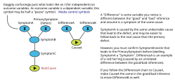
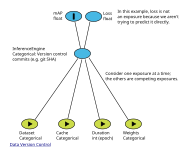
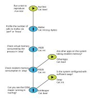
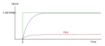
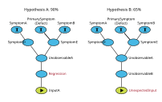
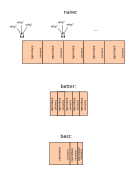

---
jupytext:
  cell_metadata_filter: -all
  formats: md:myst
  text_representation:
    extension: .md
    format_name: myst
    format_version: 0.13
    jupytext_version: 1.11.5
kernelspec:
  display_name: Python 3 (ipykernel)
  language: python
  name: python3
---

# Investigate root cause

[doe]: https://en.wikipedia.org/wiki/Design_of_experiments

## Test

Restore system to previously achieved performance; a record must exist of previous performance.

## Value

Difference between present and historical performance.

## Cost

[sm]: https://en.wikipedia.org/w/index.php?title=Scientific_method&oldid=897409401#Process
[cs]: https://en.wikipedia.org/wiki/Computer_science

Follow the [Scientific process][sm] (see also [Computer science][cs]). Sufficiently complex software
is often as difficult to mentally model as the natural world.

### Compress data

[covt]: https://en.wikipedia.org/wiki/Dependent_and_independent_variables#Statistics_synonyms

Consolidate symptoms ([covariates][covt]) in a single version-controlled document or DAG. Agonize
over all the presently known covariates:
- Exception messages
- Logging statements
- Call stacks
- Failed tests

#### Run Analysis

Use open source analysis tools to get the most out of the data you already have. Depending on the
cost of experimentation, develop your own model comparison tools to compress big data into a single
variable you can e.g. add to tables. To automate data collection, generate reports (e.g. html or md
files) that represent one row (i.e. observation / experiment) or that can compare a few
observations.

##### Logs

[dmesg]: https://en.wikipedia.org/wiki/Dmesg
[ltr]: https://pythonspeed.com/articles/measuring-memory-python/

Causal reasoning is intrinsically based in time, so it is usually helpful to collect a timeline.
Parse a sequence of events (a log without timestamps) that includes the observed symptoms. For
example:

1. The job started.
1. A warning was printed.
1. An exception was thrown.

Collect logs from the system:
- `strace` (based on `ptrace`), [`ltrace`][ltr]
- `/var/log`
- [`dmesg`][dmesg]

Parse logs with context as a table. Helpful columns:

| Column        | Description                              |
| ---           | ---                                      |
| Timestamp     | Parse and strip timestamps to diff logs. |
| Function name | Use vim's `:ta` to jump to the function. |
| Thread ID     | To separate threads or processes.        |

Print other variables in the same way, so you can e.g. serialize it back into a unit test (serialize
to and from a string).

Develop tools to parse logs and diff them to determine when and how the behavior went off track, or
how models compare. For example, visually compare or subtract loss curves.

For every symptom in the logs, try to find an equivalent manifestation of it in the logs between
where you can see the symptoms clearly and where you aren’t sure it has started. That is, backprop
to intermediate variables and add these new dimensions to your table.

##### Program state

[procfs]: https://en.wikipedia.org/wiki/Procfs#Linux

Is a running program still available? Connect to it in the debugger, dump call stacks (all
threads/processes), and disconnect again quickly to keep the state intact. Consider
[procfs][procfs], in particular `/proc/PID/stack`. Try to find a way to make the program hang and
attach.

If the defect is an uncaught exception or segfault, find the core dump.

##### Automatic tests

Prefer automatic tests to tooling and instrumentation (requiring manual intervention). If you can
say that some behavior is better than other behavior rather than simply statistically associated
with a particular defect, you should write a test indicating your interest in maintaining the
behavior.

The debate over whether to invest in an automatic test comes down to whether you both care about the
behavior and whether behavior is likely to regress. The defect you are presently fixing is one
sample indicating the behavior is likely to regress; the fact you are interested in fixing it
indicates you care.

### Develop hypotheses

[cai]: https://en.wikipedia.org/wiki/Causal_inference
[cd]: https://en.wikipedia.org/wiki/Causal_model#Causal_diagram
[dgtty]: http://dagitty.net/
[fw]: https://en.wikipedia.org/wiki/5_Whys
[pp]: https://en.wikipedia.org/wiki/Pareto_principle
[rca]: https://en.wikipedia.org/wiki/Root_cause_analysis

Using both the data and your priors, develop causal theories. See:
- [Root cause analysis][rca]
- [Five whys][fw]
- [Causal inference][cai]

Draw several [Causal diagrams][cd] (models) between the root cause and the defect with
[DAGitty][dgtty]. This static example attempts to use similar syntax:



There may be multiple causes of the primary symptom, but most of the time you can expect a Pareto
distribution and rely on the [Pareto principle][pp].

Drawing a DAG forces reasoning in at least some observable quantities (the bubbles/covariates). In
the language of the scientific process, causal reasoning should force the user to make testable
predictions. Usually it encourages measuring not for its own sake (e.g. setting up instrumentation
hoping new data inspires hypotheses) but for the sake of verifying a hypothesis as cheaply as
possible. The better your theory and the more likely hypotheses you are considering, the more
cheaply you can measure and experiment (see [Design of experiments][doe] below).

The number of alternative hypotheses you should develop before moving on to new data collection will
depend on the network, your prior network understanding, the stage of your investigation (including
how much data you've collected), the cost of measurement (analysis), and the cost of
experimentation. Call this `H` (number of hypotheses).

#### Specialize standard hypotheses

Common starting points for developing testable predictions; many of these come with an example DAG.

##### Review changes

It seems basic, but start by asking what is different (include being run later, at a new timestamp).
What are you doing in your application that is unique about how you're using this library? For
example, why did the authors never see your training example? Do they have a FAQ for common root
causes (not in the warning message)?

When you're debugging training (Bayesian inference) consider the dataset history, the code history,
and weight initialization. For example, to reproduce model performance from random initialization,
consider whether you should first reproduce performance (no increase in loss) with known good
model weights. An example DAG:



##### Out of memory

[dfs]: https://pythonspeed.com/articles/python-out-of-memory/
[mmit]: https://pythonspeed.com/articles/measuring-memory-python/
[stt]: https://en.wikipedia.org/wiki/Space%E2%80%93time_tradeoff
[pmt]: ./prescribe-computing-metrics.md

See [Dying, fast and slow: OOM crashes in Python][dfs] for examples of how out of memory issues
display in Python, and the related article [Measuring memory usage in Python: it’s tricky!][mmit]
for a discussion of resident memory. Almost every covariate in this DAG is observable:



In the [Space-time tradeoff][stt], we'd ideally like to achieve the green curve below. That is, we
want to use all the space we have to finish as quickly as possible (so we need less time). In
practice, all we achieve is the blue curve, filling an in-memory concurrent pipeline (see [Prescribe
computing metrics][pmt]) as soon as possible from disk. If we're `O(n)` in memory or in general our
memory consumption is a function of the input (that is, we do not have a chunk size adjusting to the
environment's memory), then we'll crash on larger `n`:



##### Missing variables

What logging statements were not printed? Infer a program's control flow without adding new logging
statements by checking what was NOT printed as well as what was printed.

##### Reject assumptions

Form hypotheses by rejecting statements you expect to be true. Produce a variety of statements you
expect to be true, ordered by confidence.

##### Assume a regression

Was there any point in the past when the feature worked as expected? Narrow the range of commits in
which the regression was introduced with `git bisect`. Ask developers on commits between the broken
and working commits for help developing theories.

#### Share hypotheses

[linus]: https://en.wikipedia.org/wiki/Linus%27s_Law
[sn]: ./share-notes.md

Eric Raymond claims "given enough eyeballs, all defects are shallow" ([Linus's Law][linus]). Who can
you brainstorm with? Ask local developers for closed source. Ask a maintainer or developers who
review widely. If they don't know, they know who to ask. At the least, they may be able to supply
data for you to build hypotheses from.

Formulating a written question may help you organize your thoughts and find a solution. Submit your
question to StackOverflow, a mailing list, a chat channel, etc. See also [Share notes][sn].

Look for names in git:

```{code-cell}
git log --grep="log" --grep="thread" --all-match
git log master -- path/to/broken-library
```

### Design experiments

Read [Design of experiments][doe]. Assign likelihood estimates to hypotheses to help you decide
which to run expensive testing for. For example:



Some data will rule out certain hypotheses. Other times, data will only make certain hypotheses less
likely. In Bayesian inference, we estimate parameters from the data. In this case, we're ranking
models based on data (and priors).

For the most likely hypotheses, design experiments that will either falsify or continue to confirm
them.

#### New data: Unobservable variables

Variables can be observable because they are unavailable in the raw data, because they have not been
extracted from the raw data, or both. Sometimes you need to add "permanent instrumentation" i.e.
both extract the data and compress it in your analysis tools in one step.

#### New data: Log vs. Debug

[log4j]: http://logging.apache.org/log4j/1.2/manual.html

Re-run with more detailed logging levels:

- At run time with `-v`, `-vvv`, `--verbose`, `--log-level`.
- In shared libraries (e.g. `AWS_LOG_LEVEL=TRACE`)

As you design experiments, should you prefer logging to debugging to answer your questions? When you
debug you inspect the local causal graph; logging is for a bigger picture. Temporarily log call
stacks to get some of both.

Logging takes more space; debugging takes more time. In most cases time is more valuable than
computer resources (space). From [Apache log4j 1.2 - Short introduction to log4j][log4j]:
> … debugging statements stay with the program; debugging sessions are transient.

On the other hand, excessive logging pollutes the code base with unhelpful comments. The call stack
(context) at an exception is easier to digest than verbose logs.

### Test hypotheses

Testing and experimentation doesn't change the real-world model, it only collects more training
examples from it.

#### Reproduce in new environments

Reproduce the issue in a more flexible or more easily accessible environment (e.g. locally). A cloud
debug environment can be as good as a local environment, depending on what you need to test. The
goal is to answer “why” questions faster. Sometimes it is easy to reproduce quickly, but you can’t
get more data to figure out what is going on. For example:

- No `--verbose` flag exists.
- You can’t build the code to add logging statements.
- You can’t debug the code.

If it is not easy to test more than one theory in parallel, reproduce in multiple environments.

#### Reproduce faster

Reduce delay in performing experiments.

##### Human time cost

Reproduce with less manual human time investment. It is easy to become focused on confirming a
single cause. We often have many causes to discover before we reach the root (it is often better to
invest long-term).

##### Computer delay

Finding the root cause will take too much wall clock time if a reproducible problem has a long cycle
time. Imagine discovering an issue that takes hours to reproduce to test hypotheses:


When feedback is slow and single-thread, ask yourselves: If we did this and it was as expected, what
would we do next? If it takes 3 hours to reproduce you must think of several "why" questions to ask
and get answers to. If it takes 5 minutes to reproduce you can ask one why question.

To reproduce faster, can you:
- Linearly scale down the amount of input to the algorithm?
- Cut out part of the context?

Rule out parallelization being the culprit (thrashing, locking issues); single-threaded code is also
easier to debug.

If you can’t reproduce a defect when you run it with reduced context in a new setting, what context
made the difference? The state you need to reproduce faster is often invaluable for determining what
the root cause of the defect is. You’re effectively narrowing down the problem to where it occurs in
both time and code.

To reduce context/state so you can reproduce faster:
- Check the logs for printed state.
- Call a function lower in the call stack with the same context (arguments).

The final result of reproducing with a smaller amount of context and less wall clock time is a unit
test.

#### Reproduce related/previous behavior

To test whether the cause is somewhere in a range of commits, attempt a git bisect (many
experiments). Notice a git bisect assumes the state causing the defect is in the code.

A bisect is often only collecting data, and can be mindless. Your version control system's DAG is
essentially all the options you are considering on your loss surface, and you're assigning a score
to every commit. It's not fun to do all this data collection because it rarely generalizes past your
current code; it's also hard to write code that works with every commit (and manage it in version
control).

If you spend an hour trying to get faster feedback and fix a problem by understanding only what you
need to and no more, you're not going to understand the code where the defect was in the future. If
you solve the problem by reading a bunch of code (perhaps some that's unnecessary) you'll be in a
better place to resolve the next defect in the same area. It may take longer, but you'll know the
codebase better.

Most tests we write to bisect an issue are throwaway work. How would we debug without version
control? If you try to debug without history (the old fashioned way) you'll develop reusable
debugging tools at the same time you solve your problem.

Of course, you may learn to debug faster if you try to debug the defect (e.g. learn how to use some
tool better). That is often going to be a more general skill than a specific codebase. Still, you'll
learn the language better if you read code and how the writer thinks.
