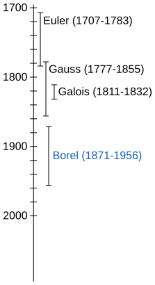

---
jupytext:
  formats: md:myst
  text_representation:
    extension: .md
    format_name: myst
    format_version: 0.13
    jupytext_version: 1.16.1
kernelspec:
  display_name: Python 3 (ipykernel)
  language: python
  name: python3
---

# History of mathematics

+++

See [History of mathematics](https://en.wikipedia.org/wiki/History_of_mathematics). For a briefer overview of some of the actors in that history:

+++

+++

# Value

+++

## One definition

+++

Ideally, the history of mathematics will provide us with words to define concepts in such a way that we don't need to reinvent words for something that has already been created.

+++

# Cost

+++

## Author existence

+++

Does it matter if Euclid was a real person? He's defined by his work (the Elements) and he has been effectively reduced (compressed) to what he wrote and what was written about him. His name has essentially become an anchor to his work.

With this assumption, you also don't care about Gauss, but [Disquisitiones Arithmeticae](https://en.wikipedia.org/wiki/Disquisitiones_Arithmeticae). If you're interested in someone in particular, find an [enumerative bibliography](https://en.wikipedia.org/wiki/Bibliography#Enumerative_bibliography) centered on them (see e.g. [Leonhard Euler § Selected bibliography](https://en.wikipedia.org/wiki/Leonhard_Euler#Selected_bibliography)). See also [WTW for an author's entire works](https://www.reddit.com/r/whatstheword/comments/2klsnq/wtw_for_an_authors_entire_works_like_a_musicians/).
