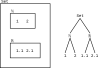
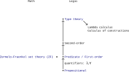
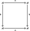
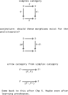
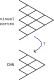
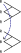

# Improve SSC

Perhaps greater and less than is so important to humans because we often think in terms of gravity. Consider saying above and below or “as high as” rather than the other language when you’re stuck. To think in terms of preorders rather than linear orders is then to think in another dimension - left and right - as well. Two things can be the same height but not be “comparable” because they are at different places across left and right. It seems like it all comes back to our 3-dimensional thinking. Are meets the way to “go down” and joins the way to “go up” in this view? If you “want” to go up, do you use the join (i.e. addition or the logical or). In Cost, is this why we have to reverse the order? Why is I < in the definition of a V-cat?

Does even forming a sentence require thinking ahead (creating an action graph)? You sometimes write the first few words of a sentence while half-thinking, and then need to erase it when you realize what you actually want to say. You often try to consider all the possible responses someone could give to a text before you write it; the more you plan ahead the more likely you’ll be able to get them to respond in a way that’s OK with you. In some sense, talking is publishing.

You often want to redo old questions rather than checking the answer. Why? Do you want to confirm you remember all the dependencies that led to the result? If you wanted to rederive every result, then you wouldn’t be reading books written by others (essentially taking their answers). You also wouldn’t maintain any notes; you’d prefer to rederive the results from scratch regularly. The point of writing down the answer was for you to be able to refer to it later, and if you never refer to it the effort you put into writing down the answer was mostly wasted (at least with respect to you).

To some extent you've even memorized the numbers associated with definitions are part of reading this book (e.g. Definition 2.46). You've also likely memorized the location of results on pages. The location of results on pages is why many books always start chapters on only odd-numbered pages (so results stay on the same side of the page through minor edits of other chapters). Hence, you really don't need to publish what you've changed back to the source.

You can read commutative diagrams like geographic maps, where the map simply repeats itself in many places. Think through one example of where the commutative diagram would apply, and you'll likely understand the pattern.

## Replace references with web links

Your references are broken anyways, so why not replace them with web links? That's what you'd prefer anyways. It'd also make your PDF better than the original, in your opinion, and so useful to others (worth sharing).

## Boxes in boxes

A drawing of "boxes in boxes" could look quite different from the side.

If you think of this as a presentation of a category then is this dependent types? A set of a certain size.

## Filters as graphs

Is there a "filter framework" in the public domain? It doesn't seem so, but see:
- [Filter graph - Wikipedia](https://en.wikipedia.org/wiki/Filter_graph)
- [Filter (software) - Wikipedia](https://en.wikipedia.org/wiki/Filter_(software))

Can you see Unix filters as defining a DAG, where the functions are the commands and the arrows in between are sets? That is, files are "sets" of lines and the filter runs on all lines in the set. The boxes are labeled with unix commands. We use "tee" to get two arrows from one output.

## Document how to visually take product orders

Add to [Product order](https://en.wikipedia.org/wiki/Product_order). You had to learn the hard way how to do this for non-total orders: see `pip-feasibility-relation.svg` for the start of how you learned to do it visually.

## Monotone maps

Consider parallel arrows, two perspectives on the same thing. What metrics are you tracking in your model? Is there a monotone map between them? For example, from F1 to an ILE. Is there a monotone map from the loss to the metrics you are measuring and care about?

The functor from your measure of a module's performance to your overall performance should ideally be monotonic. If it isn't, you won't be able to check module-level performance and be confident that it will correspond to system-level performance. If not then you have at least a non-ideal compression, a compression that is not just lossy but lossy but in the wrong way. Said another way, a compression can be "wrong" if it doesn't measure what you are interested in achieving at the next level up.

This is similar to how, when you need to start improving software, you should start by running it at the highest level that's reasonable (or better, one level above what you need to improve/change). You'll be much more immune to getting bogged down in details if you understand the big picture. If you do this, then you'll understand to what degree your module-level performance is a monotonic map to overall performance (what confidence you can have in the map).

If you don't preserve at the module-level the aspects of the problem you care about (at the most basic, preserving order), then you may have trouble (depends to what degree the map is not order-preserving).

Can you try to bite off too much before attempting to make changes? That is, start to make changes in a highly complex network when all you understand is how to run e.g. training (e.g. an object detector). No, generally speaking, but that assumes that others haven't already tried to optimize the settings you are tweaking. Said another way, if all you have is "hyperparameters" (settings you don't understand) then you and everyone else will be equally capable of checking performance (assuming your computer resources are the same). You can see humans as computers to get more done, too.

Consider breaking down your single arrow into two or more arrows in series. This corresponds to trying to gain more insight into a model through either measuring an intermediate, or reading the code for intermediates and writing tests around them.

Consider the implications of this for new developers, as well. Ideally we start them at the highest level we consider and they work down to some specific task. If that will take too much time, though, we need to give them some specific task within the larger network, and they will need to trust the optimization task they've been given has value at the next level up.

## Start with evaluations

Should you start with improving metrics in many nets? If you don't have the feature you're measuring in the loss then any achievements you gain may be temporary if the model changes in other ways (no monotone map from the loss to our metrics). But, it’s good to start with a test before adding the training feature so we know what difference we’re making if we were to include it. Once you have the test, then you can work on fixing the map incrementally.

You can also start by measuring something someone else didn't and then argue it's more important than the aspects they had optimized for (e.g. because of changing requirements).

## What is sound and complete?

To understand these terms, you're likely going to need to understand some logic (i.e. calculus). Propositional calculus is the simplest; see [Propositional calculus - Soundness and completeness of the rules](https://en.wikipedia.org/wiki/Propositional_calculus#Soundness_and_completeness_of_the_rules) to prove these properties on it. As mentioned in [Soundness](https://en.wikipedia.org/wiki/Soundness), it seems likely this completeness here is not the same as in [Gödel's incompleteness theorems](https://en.wikipedia.org/wiki/G%C3%B6del%27s_incompleteness_theorems).

## Commutative diagrams

Consider the original commutative diagram, what you think of when you think of the [Commutative property](https://en.wikipedia.org/wiki/Commutative_property):

We assume this expresses something along the lines of $ab = ba$. But is $ab$ the 2 top-right arrows, though, or the 2 bottom-left arrows?

It depends on whether you put ⨟ or ∘ in the middle of $ab$. If you put ⨟ in the middle, then $ab$ is the top-right arrows. That is, this depends on your convention for composition.

When you posed the question, you implicitly meant × (multiplication); you could have easily meant + (addition) as well. In both cases, you assume a symmetric/commutative operator and so confuse yourself about which is which. You need to go back and forget that these operators are commutative; only then can you ask if they are commutative. If you do that then you would replace the operator ×/+ by e.g. · (as in [Monoid](https://en.wikipedia.org/wiki/Monoid)) or something else that doesn't imply commutativity to you.

It's likely that · is a poor choice most of the time, however, because it does imply commutativity to many people (just as concatenation did when you posed this question). It also doesn't provide any sense of direction (only that $ab \neq ba$) if you want to also interpret the operator as a composition operator. You could come up with your own convention, but that could easily lead to confusion. In Visual Group Theory (page 85) the author confusingly defines f·g and f∘g to both equal f⨟g; this is confusing because Wikipedia's convention is now that f∘g is the opposite of f⨟g (so f⨟g = g∘f).

Said another way, you "know" that $a⨟b \neq b⨟a$ and $a∘b \neq b∘a$. The · operator is more ambiguous and so you have to check the context.

## Arrow categories

## Compression and preservation

Notice the language of models and morphisms between them in [Strict 2-category - Doctrines](https://en.wikipedia.org/wiki/Strict_2-category#Doctrines). You should often see morphisms as data, as in higher category theory. This is strangely similar to your "improve improve" documents as well; you treat a "process" as data and construct a second process (an "improve" process) to transform it. You can call of these processes, n-cells, or n-morphisms (the word doesn't matter).

As discussed in Chp. 1, most of our models are compressions of the natural world. In our brains we maintain causal compressions of the much more complicated computing engine that is nature. In computers we maintain causal compressions of the models in our brain. We expect a CNN to preserve at least some features of our visual cortex:

This compression is always lossy, but can we choose which losses to take? What do you know about your model in nature? That's what you want to preserve in your mental/computer models.

What *can* we preserve now? We discussed preserving joins and meets in Chp. 1, which seems like something you'd want to preserve in almost any model compression. It also seems quite natural to want to preserve composition, as we discussed in Chp. 3 around functors (e.g. preserving order with monotonic functions).

A [Linear map](https://en.wikipedia.org/wiki/Linear_map) preserves vectors addition and scalar multiplication.

In image processing, see other examples of preservation in [machine learning - What is translation invariance in computer vision and convolutional neural network? - Cross Validated](https://stats.stackexchange.com/questions/208936/what-is-translation-invariance-in-computer-vision-and-convolutional-neural-netwo). In e.g. topdown lidar imagery someone might be interested in rotational equivariance.

### Classification

Draw (1.5) mapped to the bools. This whole example could be seen as a classification task. For classification, we typically want translation invariance: moving an object in an image should not change the image's classification.

### Object detection

For object detection we typically want translation equivariance; see [Equivariant map](https://en.wikipedia.org/wiki/Equivariant_map). Said another way, this preserves the operation of symmetry transformations. Recognize that a model is different with different inputs applied to it; these are not the same and we can identify at least part of the map between them:

### Adding software complexity

When we add new code to existing software, we often want to maintain all our previous features. Sometimes this is as simple as adding an if statement and handling new cases, directly adding more code paths. That map between the old and new software is obvious in this case, but what if that's not enough? Consider adding an FPN, or converting a single-frame model to multiple frames.

To refactor means to maintain the same behavior while changing the code to support new features. Version control tracks your refactoring. Every commit is a map from the old software to some new version that is "better" in some way, which typically means not losing features. It's critical to have this history when some feature is lost (a bug/defect, specifically a regression). A regression is always associated with some commit, a map between the old and new software. You can't test everything; these maps are critical to understanding what happened when something breaks.

Smaller commits makes verification that these maps are as expected easier. That is, incremental changes may *seem* to be a slower path to your goal, but it's often the case that doubling the size of a step is more than twice as expensive as two smaller steps to verify (for other developers, and oneself). We can also run into working memory limitations if we make our steps too large.

## Composition of relations and matrix multiplication

How are these related? You're familiar with both, but it seems like they sometimes express nearly the same thing. See:

- https://en.wikipedia.org/wiki/Composition_of_relations#Composition_in_terms_of_matrices
- https://en.wikipedia.org/wiki/Binary_relation#Matrix_representation

A simple example with 2×2 matrices that shows a connection to the notation of quantales:
- https://twistedelephants.wordpress.com/2012/05/13/relation-composition-as-matrix-multiplication/

The connection to categories:
- https://math.stackexchange.com/questions/4548276/why-do-the-composition-of-relations-and-the-matrix-product-look-so-alike

## Section 4.5.2

*Exercise* 4.65.

In the paragraph above this question, the author is defining **1** to have a single object 1. Every morphism in a $\mathcal{V}$-category must be also be assigned an element in $\mathcal{V}$, so he also assigns to the single morphism (the identity morphism on 1) the object *I*.

A 𝓥-profunctor $\rho_\mathcal{X}: \mathcal{X} × \textbf{1} ⇸ \mathcal{X}$ is a 𝓥-functor $\rho_\mathcal{X}: (\mathcal{X} × \textbf{1})ᵒᵖ × \mathcal{X} → \mathcal{V}$. Because $\mathcal{X}$ is enriched in $\mathcal{V}$, we know that $\mathcal{X}({x,y})$ is an object of $\mathcal{V}$. Let's define $\rho_\mathcal{X}(x,1,x') := \mathcal{X}(x,x')$ (an isomorphism as required).

Similarly, a 𝓥-profunctor $\lambda_\mathcal{X}: \textbf{1} × \mathcal{X} ⇸ \mathcal{X}$ is a 𝓥-functor $\lambda_\mathcal{X}: (\textbf{1} × \mathcal{X})ᵒᵖ × \mathcal{X} → \mathcal{V}$ defined $\lambda_\mathcal{X}(1,x,x') := \mathcal{X}(x,x')$.

*Exercise* 4.66.

How does this selection of a dual make sense in terms of $\textbf{Prof}_\textbf{Bool}$? What does the categorical product $\mathcal{X}^{op} × \mathcal{X}$ look like?

Every object in $\textbf{Prof}_V$ should have a dual. Writing the relevant morphisms as $\mathcal{V}$-profunctor:

$$
\rho_\mathcal{X}: \mathcal{X} × \textbf{1} ⇸ \mathcal{X} \\
\lambda_\mathcal{X}: \textbf{1} × \mathcal{X} ⇸ \mathcal{X} \\
\rho^{-1}_\mathcal{X}: \mathcal{X} ⇸ \mathcal{X} × \textbf{1} \\
η_\mathcal{X}: \textbf{1} ↛ \mathcal{X}^{op} × \mathcal{X} \\
ε_\mathcal{X}: \mathcal{X} × \mathcal{X}^{op} ↛ \textbf{1} \\
\mathcal{X} × η_\mathcal{X}: (\mathcal{X} ↛ \mathcal{X}) × (\textbf{1} ↛ \mathcal{X}^{op} × \mathcal{X}) =
\mathcal{X} × \textbf{1} ↛ \mathcal{X} × (\mathcal{X}^{op} × \mathcal{X}) \\
$$

Writing the relevant morphisms as $\mathcal{V}$-functor:

## Algebraic structures

See:

- [Outline of algebraic structures](https://en.wikipedia.org/wiki/Outline_of_algebraic_structures)
- [Algebraic structure](https://en.wikipedia.org/wiki/Algebraic_structure)
- [Concrete category](https://en.wikipedia.org/wiki/Concrete_category)
- [Template:Algebraic structures](https://en.wikipedia.org/wiki/Template:Algebraic_structures)

Here's an example to anchor off of (could update to [File:magma to group.svg](https://commons.wikimedia.org/wiki/File:Algebraic_structures_-_magma_to_group.svg) as well):

In [Algebra [cats]](https://typelevel.org/cats/algebra.html) and [Outline of algebraic structures](https://en.wikipedia.org/wiki/Outline_of_algebraic_structures) the same information that this preorder ([File:Magma to group4.svg](https://commons.wikimedia.org/wiki/File:Magma_to_group4.svg)) expresses is provided in a table. Still, the colors of the arrows are helpful to indicate what structure is being added. That is, a typical preorder only has booleans (an arrow or not) between elements, while this colored drawing allows for 3 (and in general more) properties to be quickly recalled.

You could see the nodes/objects as categories and the arrows as coming from a set of algebraic features. That is, this presents the category of small categories enriched in certain algebraic features. You could add an arrow for commutative (selected yellow below) and add a [Commutative monoid](https://en.wikipedia.org/wiki/Monoid#Commutative_monoid) to the drawing. This is definitely collecting butterflies; you should also consider which structures are important or common.

In this context a colored arrow means *adds* some structure specific to the color. For example, in [File:Magma to group4.svg](https://commons.wikimedia.org/wiki/File:Magma_to_group4.svg) a Monoid with invertibility is a Group. Follow the arrows in reverse for an "is a" relationship followed by "with"; e.g. a Group is a Semigroup with invertibility and identity.

It's no mistake that this drawing is of a partial order with 8 elements. We could construct it by taking the product of 3 two-element partial orders, with each two-element partial order representing the addition of some property/adjective (a checkbox in the table representations).

### Structure, space, or algebra?

Although all these words show up regularly in the study of algebraic structures, they are essentially synonyms in the sense that they are all "structures" in the sense of being a set or sets with an operation or operations defined on them (the article [Mathematical structure](https://en.wikipedia.org/wiki/Mathematical_structure) limits the definition of structure to being defined on only one set). Don't be bothered by the inconsistency in language that often occurs. We'll use AS for [Algebraic structure](https://en.wikipedia.org/wiki/Algebraic_structure) in the following, since it's becoming the anchor word.

See also [Structure (mathematical logic)](https://en.wikipedia.org/wiki/Structure_(mathematical_logic)).

#### Space vs AS

Why do we have all these nearly equivalent words? The terms "space" and "structure" exist alongside each other primarily for historical reasons; see [Space (mathematics)](https://en.wikipedia.org/wiki/Space_(mathematics)). In practice this means you'll see the term "space" more often when a discussion turns to geometric rather than algebraic concerns. We are straddling this line in [Vector (mathematics and physics)](https://en.wikipedia.org/wiki/Vector_(mathematics_and_physics)) with the quote:

> A vector space formed by geometric vectors is called a Euclidean vector space, and a vector space formed by tuples is called a coordinate vector space.

You'll see the same Euclidean/coordinate (i.e. space/structure) language explained in [Real coordinate space](https://en.wikipedia.org/wiki/Real_coordinate_space).

Similarly, the article [Group action](https://en.wikipedia.org/wiki/Group_action) feels the need to awkwardly state "space or structure" early on and often switches between the words.

#### Algebra vs AS

The article [Commutative ring](https://en.wikipedia.org/wiki/Commutative_ring) states that commutative algebra is about the study of commutative rings, which are typically described as algebraic structures (not algebras). This is because the term "algebra" without an article refers to a "field of study" in mathematics; see [Algebra](https://en.wikipedia.org/wiki/Algebra) (notice this article is written in 162 languages). That is, the term "algebra" in this context is useful to avoid the verbose "field of study" or "broad part of mathematics" someone would otherwise need to use. Why not use the word "math" though? As in "linear math" (linear algebra) or "abstract math" (abstract algebra)? Most likely, only to sound fancy.

This language gets especially confusing in cases like the following from [Algebra](https://en.wikipedia.org/wiki/Algebra):

> Sometimes, the same phrase is used for a subarea and its main algebraic structures; for example, [Boolean algebra](https://en.wikipedia.org/wiki/Boolean_algebra) and a [Boolean algebra](https://en.wikipedia.org/wiki/Boolean_algebra_(structure)).

With an [Article (grammar)](https://en.wikipedia.org/wiki/Article_(grammar)), an [Algebra over a field](https://en.wikipedia.org/wiki/Algebra_over_a_field) is simply an example of an algebraic structure. These are the most "structured" or complicated algebraic structures because they stack on top of vector spaces even more operations. The fact that an [Algebra over a field](https://en.wikipedia.org/wiki/Algebra_over_a_field) is the starting point on Wikipedia is a bit unfortunate because it seems like most examples easily generalize to an [Algebra over a ring](https://en.wikipedia.org/wiki/Algebra_over_a_field#Generalization:_algebra_over_a_ring) (e.g. [Associative algebra](https://en.wikipedia.org/wiki/Associative_algebra)).

Why do we often use the letter $K$ for a field rather than $F$? One possibility (or at least a mnemonic) is that the "c" in "vector" sounds like K, and a "vector" space is defined over a field. The (historical) language of "algebra over a field" may be related to this: the concept of an "algebra over a field" is an extension of a vector space, which seems to often be conflated with the concept of a field. We could read this as an "algebra over a vector space" instead, and it's likely most people would understand what was meant (though this is even more verbose).

### Two binary operations

These are the algebraic structures with "One binary operation on one set"; can you do the same for structures with two operations? Starting with the same colors as [File:Magma to group4.svg](https://commons.wikimedia.org/wiki/File:Magma_to_group4.svg) (RGB), but with dark colors for multiplication (×) and light colors for addition (+). We'll expand on the operations in [Algebra [cats]](https://typelevel.org/cats/algebra.html).

The corresponding category is marked to the bottom left of some defintions, where you'll find the rules for preserving structure between different examples (in the definition of the homomorphism). The arrows between these categories indicate "full subcategory" rather than the addition of some property/constraint/structure.

Start with the smallest possible examples (2-3) in every case (e.g. ℤ/4ℤ), so that you can potentially provide drawings. Also as part of avoiding infinite. You should strive to provide non-trivial examples, though, which makes this harder than simply providing the smallest possible example.

If you take "is a" to mean "has inside it all examples" then you'd get a bunch of examples of everything by just going up the "is a" chain. It's a "subset of" relationship as well.

When you link to an example, link to the longest possible explanation of the example you can find (not just where you originally found it).

Prefer the term "Noncommutative ring" to be more specific, since in some contexts "Ring" may imply a commutative ring. Prefer the term "Semiring" to "Rig" only because the former is more common and consistently used on Wikipedia; it's also much easier to quickly search for ("rig" is a part of many words, requiring whole word search). But see [semiring in nLab](https://ncatlab.org/nlab/show/semiring) and [rig in nLab](https://ncatlab.org/nlab/show/rig).

We "generalize" when we go from thinking about specific examples in a category to thinking in terms of the category (what structure all the examples have in common), and we "generalize" when we remove property/constraints/structure (following arrows in the reverse direction).

Notice you've already started on the "One set with no binary operations" diagram in Exercise 5.10, with FinSet, FinRel, etc.

Said another way, the "is a" relationship can hold because one object has more constraints (more structure) on it than something it is an instance of (Y "is a" X because all examples of Y have more structure than all examples of X). The "is a" relationship can also hold because Y is simply an example of X (not thinking of the potential many examples of Y and X). We could think more deeply and put boxes in boxes; but between the examples in separate boxes there is presumably no relationship (no morphisms) unless you go up to a common level and use the morphisms at that level. That is, use e.g. prop functors, monoidal functors, or functors to preserve what structure the two objects do share.

### Properties of categories

Consider the following diagram, now one level "up" in the sense of thinking about properties/constraints/structure you can add to categories. But is it part of **Cat** if it includes **Cat**?

It could be drawn similar to the algebraic diagrams above. In both cases we are adding something with all of our arrows, whether we are assigning new properties or assigning arguments (calling constructors, so to speak). In the first case we add a property to all examples in a set/class ("modify" the set/class relative to its previous definition); in the second case we add a property to only an element ("modify" the element relative to its previous definition).

This drawing assumes some categories (e.g. **Rel**) are only defined as monoidal categories in one way. In fact, there are often multiple ways to define a category as monoidal (different options for the monoidal product). It should include what monoidal product is being used in its examples.

The link https://en.wikipedia.org/wiki/Compact_category redirects to Autonomous category. Which term do you prefer? With rigid, it seems there are three now:
- https://math.stackexchange.com/questions/4548276
- https://ncatlab.org/nlab/show/rigid+monoidal+category

For more on the term compact, see [machine learning - Can neural networks approximate any function given enough hidden neurons? - SO](https://stackoverflow.com/questions/25609347/can-neural-networks-approximate-any-function-given-enough-hidden-neurons) and [Compact space](https://en.wikipedia.org/wiki/Compact_space).

This diagram started as a list of common [Enriched category](https://en.wikipedia.org/wiki/Enriched_category).

### All examples

Be careful with the word "example" (which shows up all over these notes). Is a collection of examples an example of something? If you're using the word analogously to "element" in a set, then you're going to run into Russell's paradox if you consider a collection of examples as an example in some other collection of examples.

Instead, invent words to create collections of collections of examples. Call them sets, categories, collections, [Class (set theory)](https://en.wikipedia.org/wiki/Class_(set_theory)), [Conglomerate (mathematics)](https://en.wikipedia.org/wiki/Conglomerate_(mathematics)), etc. until you're sick of coming up with words. Or start using 0-category, 1-category, 2-category, etc. as in [n-category](https://ncatlab.org/nlab/show/n-category). From that page:

> Especially as n increases, there is a plethora of different definitions of n-categories, some differing in generality others different-looking but secretly equivalent. A (woefully incomplete) list is given below, with pointers to dedicated entries. Part of the subject of higher category theory is to understand, organize, systematize and, last not least, apply these definitions. (It is the “n” in “n-category” that gives the nLab its name.)

However, the definitions do seem to agree that a [0-category](https://ncatlab.org/nlab/show/0-category) is a set, and a 1-category is a regular category.

In SVG you should link boxes to the word you want to be using for the collection (boxes can be linked, just like text). You could even provide a separate TOC, and color boxes (perhaps shades of gray) for the word that should be used with them.

It seems like the word "collection" is the most informal and therefore a good default (for unlinked boxes). See:
- [elementary set theory - What are the differences between class, set, family, and collection?](https://math.stackexchange.com/questions/172966/what-are-the-differences-between-class-set-family-and-collection)

Perhaps a "collection" is something that must be constructed one-by-one, not defined via properties. That is, the word "example" may be appropriate for a collection. Of course, what makes an example belong to your collection? If you don't have a rule, you could put anything into it. In some sense this is what gray boxes are; there's only a notion that these belong together.

See [Is there a category of categories?](https://math.stackexchange.com/questions/750731/is-there-a-category-of-categories). You could draw a large CAT box around your whole drawing, but it probably wouldn't be helpful. Similarly you could draw a large [Algebraic structure](https://en.wikipedia.org/wiki/Algebraic_structure) box arond a large section of these notes, because this term is again rather general.

Many web APIs use tags (think hash tags in twitter, labels in Gmail, tags for cost-tracking in AWS) to make it quick and easy to put new elements into a set. The Web API then provides a single list of tags (i.e. types in a type system).

It seems like you are running into nearly the same issue when organizing into directories: do you see each directory as a set? You can make everything much simpler if you have a single namespace, as Jupyter Book suggests that you do. Why not use JB tags to avoid directories?

### Managing definitions

Working through this exercise, it's clear that there are so many definitions you're going to struggle to get them all on one diagram. As discussed in [Ring (mathematics)](https://en.wikipedia.org/wiki/Ring_(mathematics)), many authors define a ring differently depending on the context. And why not? These definitions (like any structure) should only be evaluated relative to your objectives.

Even if you *wanted* to define global terms, the terms are going to get incredibly long as you add more and more adjectives. You'll need more and more adjectives (or alternatively, to invent new words) only because your namespace is going to fill (requiring rework of your drawing, as well). It's critical to delete/archive code for the same reason. Still, you need a large vocabulary to be able to interpret as much as possible (as long as you're given context). Your notes are your own vocabulary; you may need to invent new words (or make longer words) in them so you can actually pull together logic that was previously in different contexts.

For example, prefer the term "Noncommutative ring" internally to be more specific, though this will usually correspond to the unadorned "Ring" when you encounter that term.

### Other

Consider finding the same in a programming language as well; see:
- https://typelevel.org/cats/typeclasses.html#type-classes-in-cats
- [discopy/discopy: Architecture](https://github.com/discopy/discopy#architecture)

Perhaps you still need your own in your own notes, to include e.g. [Quantale](https://en.wikipedia.org/wiki/Quantale)? In your own notes you want to see what you've understood in the past so you can think about what might be easy to construct from what you already know. In general, this is true for most drawings (you only include on them what you understand).

How do you use categorical logic in Python? Much may need to be custom; see [Computational Category Theory in Python I: Dictionaries for FinSet | Hey There Buddo!](https://www.philipzucker.com/computational-category-theory-in-python-i-dictionaries-for-finset/). However, this mentions the promising [Welcome to Hypothesis! — Hypothesis 6.71.0 documentation](https://hypothesis.readthedocs.io/en/latest/). See also [Computational Category Theory in Python III: Monoids, Groups, and Preorders | Hey There Buddo!](https://www.philipzucker.com/computational-category-theory-in-python-3-monoids-groups-and-preorders/).
