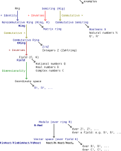
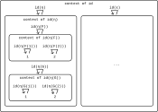

# Improve SSC

Perhaps greater and less than is so important to humans because we often think in terms of gravity. Consider saying above and below or “as high as” rather than the other language when you’re stuck. To think in terms of preorders rather than linear orders is then to think in another dimension - left and right - as well. Two things can be the same height but not be “comparable” because they are at different places across left and right. It seems like it all comes back to our 3-dimensional thinking. Are meets the way to “go down” and joins the way to “go up” in this view? If you “want” to go up, do you use the join (i.e. addition or the logical or). In Cost, is this why we have to reverse the order? Why is I < in the definition of a V-cat?

Does even forming a sentence require thinking ahead (creating an action graph)? You sometimes write the first few words of a sentence while half-thinking, and then need to erase it when you realize what you actually want to say. You often try to consider all the possible responses someone could give to a text before you write it; the more you plan ahead the more likely you’ll be able to get them to respond in a way that’s OK with you. In some sense, talking is publishing.

You often want to redo old questions rather than checking the answer. Why? Do you want to confirm you remember all the dependencies that led to the result? If you wanted to rederive every result, then you wouldn’t be reading books written by others (essentially taking their answers). You also wouldn’t maintain any notes; you’d prefer to rederive the results from scratch regularly. The point of writing down the answer was for you to be able to refer to it later, and if you never refer to it the effort you put into writing down the answer was mostly wasted (at least with respect to you).

To some extent you've even memorized the numbers associated with definitions are part of reading this book (e.g. Definition 2.46). You've also likely memorized the location of results on pages. The location of results on pages is why many books always start chapters on only odd-numbered pages (so results stay on the same side of the page through minor edits of other chapters). Hence, you really don't need to publish what you've changed back to the source.

You can read commutative diagrams like geographic maps, where the map simply repeats itself in many places. Think through one example of where the commutative diagram would apply, and you'll likely understand the pattern.

## Replace references with web links

Your references are broken anyways, so why not replace them with web links? That's what you'd prefer anyways. It'd also make your PDF better than the original, in your opinion, and so useful to others (worth sharing).

## Document how to visually take product orders

Add to [Product order](https://en.wikipedia.org/wiki/Product_order). You had to learn the hard way how to do this for non-total orders: see `pip-feasibility-relation.svg` for the start of how you learned to do it visually.

## Monotone maps

Consider parallel arrows, two perspectives on the same thing. What metrics are you tracking in your model? Is there a monotone map between them? For example, from F1 to an ILE. Is there a monotone map from the loss to the metrics you are measuring and care about?

The functor from your measure of a module's performance to your overall performance should ideally be monotonic. If it isn't, you won't be able to check module-level performance and be confident that it will correspond to system-level performance. If not then you have at least a non-ideal compression, a compression that is not just lossy but lossy but in the wrong way. Said another way, a compression can be "wrong" if it doesn't measure what you are interested in achieving at the next level up.

This is similar to how, when you need to start improving software, you should start by running it at the highest level that's reasonable (or better, one level above what you need to improve/change). You'll be much more immune to getting bogged down in details if you understand the big picture. If you do this, then you'll understand to what degree your module-level performance is a monotonic map to overall performance (what confidence you can have in the map).

If you don't preserve at the module-level the aspects of the problem you care about (at the most basic, preserving order), then you may have trouble (depends to what degree the map is not order-preserving).

Can you try to bite off too much before attempting to make changes? That is, start to make changes in a highly complex network when all you understand is how to run e.g. training (e.g. an object detector). No, generally speaking, but that assumes that others haven't already tried to optimize the settings you are tweaking. Said another way, if all you have is "hyperparameters" (settings you don't understand) then you and everyone else will be equally capable of checking performance (assuming your computer resources are the same). You can see humans as computers to get more done, too.

Consider breaking down your single arrow into two or more arrows in series. This corresponds to trying to gain more insight into a model through either measuring an intermediate, or reading the code for intermediates and writing tests around them.

Consider the implications of this for new developers, as well. Ideally we start them at the highest level we consider and they work down to some specific task. If that will take too much time, though, we need to give them some specific task within the larger network, and they will need to trust the optimization task they've been given has value at the next level up.

## Start with evaluations

Should you start with improving metrics in many nets? If you don't have the feature you're measuring in the loss then any achievements you gain may be temporary if the model changes in other ways (no monotone map from the loss to our metrics). But, it’s good to start with a test before adding the training feature so we know what difference we’re making if we were to include it. Once you have the test, then you can work on fixing the map incrementally.

You can also start by measuring something someone else didn't and then argue it's more important than the aspects they had optimized for (e.g. because of changing requirements).

## Commutative diagrams

Consider the original commutative diagram, what you think of when you think of the [Commutative property](https://en.wikipedia.org/wiki/Commutative_property):

We assume this expresses something along the lines of $ab = ba$. But is $ab$ the 2 top-right arrows, though, or the 2 bottom-left arrows?

It depends on whether you put ⨟ or ∘ in the middle of $ab$. If you put ⨟ in the middle, then $ab$ is the top-right arrows. That is, this depends on your convention for composition.

When you posed the question, you implicitly meant × (multiplication); you could have easily meant + (addition) as well. In both cases, you assume a symmetric/commutative operator and so confuse yourself about which is which. You need to go back and forget that these operators are commutative; only then can you ask if they are commutative. If you do that then you would replace the operator ×/+ by e.g. · (as in [Monoid](https://en.wikipedia.org/wiki/Monoid)) or something else that doesn't imply commutativity to you.

It's likely that · is a poor choice most of the time, however, because it does imply commutativity to many people (just as concatenation did when you posed this question). It also doesn't provide any sense of direction (only that $ab \neq ba$) if you want to also interpret the operator as a composition operator. You could come up with your own convention, but that could easily lead to confusion. In Visual Group Theory (page 85) the author confusingly defines f·g and f∘g to both equal f⨟g; this is confusing because Wikipedia's convention is now that f∘g is the opposite of f⨟g (so f⨟g = g∘f).

Said another way, you "know" that $a⨟b \neq b⨟a$ and $a∘b \neq b∘a$. The · operator is more ambiguous and so you have to check the context.

## Arrow categories

## Compression and preservation

Notice the language of models and morphisms between them in [Strict 2-category - Doctrines](https://en.wikipedia.org/wiki/Strict_2-category#Doctrines). You should often see morphisms as data, as in higher category theory. This is strangely similar to your "improve improve" documents as well; you treat a "process" as data and construct a second process (an "improve" process) to transform it. You can call of these processes, n-cells, or n-morphisms (the word doesn't matter).

As discussed in Chp. 1, most of our models are compressions of the natural world. In our brains we maintain causal compressions of the much more complicated computing engine that is nature. In computers we maintain causal compressions of the models in our brain. We expect a CNN to preserve at least some features of our visual cortex:

This compression is always lossy, but can we choose which losses to take? What do you know about your model in nature? That's what you want to preserve in your mental/computer models.

What *can* we preserve now? We discussed preserving joins and meets in Chp. 1, which seems like something you'd want to preserve in almost any model compression. It also seems quite natural to want to preserve composition, as we discussed in Chp. 3 around functors (e.g. preserving order with monotonic functions).

A [Linear map](https://en.wikipedia.org/wiki/Linear_map) preserves vectors addition and scalar multiplication.

In image processing, see other examples of preservation in [machine learning - What is translation invariance in computer vision and convolutional neural network? - Cross Validated](https://stats.stackexchange.com/questions/208936/what-is-translation-invariance-in-computer-vision-and-convolutional-neural-netwo). In e.g. topdown lidar imagery someone might be interested in rotational equivariance.

### Classification

Draw (1.5) mapped to the bools. This whole example could be seen as a classification task. For classification, we typically want translation invariance: moving an object in an image should not change the image's classification.

### Object detection

For object detection we typically want translation equivariance; see [Equivariant map](https://en.wikipedia.org/wiki/Equivariant_map). Said another way, this preserves the operation of symmetry transformations. Recognize that a model is different with different inputs applied to it; these are not the same and we can identify at least part of the map between them:

### Adding software complexity

When we add new code to existing software, we often want to maintain all our previous features. Sometimes this is as simple as adding an if statement and handling new cases, directly adding more code paths. That map between the old and new software is obvious in this case, but what if that's not enough? Consider adding an FPN, or converting a single-frame model to multiple frames.

To refactor means to maintain the same behavior while changing the code to support new features. Version control tracks your refactoring. Every commit is a map from the old software to some new version that is "better" in some way, which typically means not losing features. It's critical to have this history when some feature is lost (a bug/defect, specifically a regression). A regression is always associated with some commit, a map between the old and new software. You can't test everything; these maps are critical to understanding what happened when something breaks.

Smaller commits makes verification that these maps are as expected easier. That is, incremental changes may *seem* to be a slower path to your goal, but it's often the case that doubling the size of a step is more than twice as expensive as two smaller steps to verify (for other developers, and oneself). We can also run into working memory limitations if we make our steps too large.

## Section 4.5.2

*Exercise* 4.65.

In the paragraph above this question, the author is defining **1** to have a single object 1. Every morphism in a $\mathcal{V}$-category must be also be assigned an element in $\mathcal{V}$, so he also assigns to the single morphism (the identity morphism on 1) the object *I*.

A 𝓥-profunctor $\rho_\mathcal{X}: \mathcal{X} × \textbf{1} ⇸ \mathcal{X}$ is a 𝓥-functor $\rho_\mathcal{X}: (\mathcal{X} × \textbf{1})ᵒᵖ × \mathcal{X} → \mathcal{V}$. Because $\mathcal{X}$ is enriched in $\mathcal{V}$, we know that $\mathcal{X}({x,y})$ is an object of $\mathcal{V}$. Let's define $\rho_\mathcal{X}(x,1,x') := \mathcal{X}(x,x')$ (an isomorphism as required).

Similarly, a 𝓥-profunctor $\lambda_\mathcal{X}: \textbf{1} × \mathcal{X} ⇸ \mathcal{X}$ is a 𝓥-functor $\lambda_\mathcal{X}: (\textbf{1} × \mathcal{X})ᵒᵖ × \mathcal{X} → \mathcal{V}$ defined $\lambda_\mathcal{X}(1,x,x') := \mathcal{X}(x,x')$.

*Exercise* 4.66.

How does this selection of a dual make sense in terms of $\textbf{Prof}_\textbf{Bool}$? What does the categorical product $\mathcal{X}^{op} × \mathcal{X}$ look like?

Every object in $\textbf{Prof}_V$ should have a dual. Writing the relevant morphisms as $\mathcal{V}$-profunctor:

$$
\rho_\mathcal{X}: \mathcal{X} × \textbf{1} ⇸ \mathcal{X} \\
\lambda_\mathcal{X}: \textbf{1} × \mathcal{X} ⇸ \mathcal{X} \\
\rho^{-1}_\mathcal{X}: \mathcal{X} ⇸ \mathcal{X} × \textbf{1} \\
η_\mathcal{X}: \textbf{1} ↛ \mathcal{X}^{op} × \mathcal{X} \\
ε_\mathcal{X}: \mathcal{X} × \mathcal{X}^{op} ↛ \textbf{1} \\
\mathcal{X} × η_\mathcal{X}: (\mathcal{X} ↛ \mathcal{X}) × (\textbf{1} ↛ \mathcal{X}^{op} × \mathcal{X}) =
\mathcal{X} × \textbf{1} ↛ \mathcal{X} × (\mathcal{X}^{op} × \mathcal{X}) \\
$$

Writing the relevant morphisms as $\mathcal{V}$-functor:

## Algebraic structures

See:

- [Outline of algebraic structures - Wikipedia](https://en.wikipedia.org/wiki/Outline_of_algebraic_structures)
- [Algebraic structure - Wikipedia](https://en.wikipedia.org/wiki/Algebraic_structure)
- [Concrete category - Wikipedia](https://en.wikipedia.org/wiki/Concrete_category)
- [Template:Algebraic structures - Wikipedia](https://en.wikipedia.org/wiki/Template:Algebraic_structures)

A start:

Have these diagrams been done by others? Don't reinvent the wheel. For example:

These are the algebraic structures with "One binary operation on one set"; it seems like others would have wanted to have come up with something similar for more complicated structures. Consider finding the same in a programming language as well; see:
- https://typelevel.org/cats/typeclasses.html#type-classes-in-cats
- [discopy/discopy: Architecture](https://github.com/discopy/discopy#architecture)

In [Algebra](https://typelevel.org/cats/algebra.html) and [Outline of algebraic structures - Wikipedia](https://en.wikipedia.org/wiki/Outline_of_algebraic_structures) the same information that a hierarchy would express is provided in a table. Is there a simple way to construct a drawing from the table? In [File:Magma to group4.svg](https://commons.wikimedia.org/wiki/File:Magma_to_group4.svg) above, the colors of the arrows helpful indicate what structure is being added. You can only add the colors if take arrows to mean *adds*; if you reverse all the arrows to create the opposite category then you can take the arrows to mean "is a" (also useful) but you lose color. For example, in the above a Group is a Monoid. Following the arrows in reverse for the "is a" relationship also lets you add "with" as in a Group is a Semigroup with invertibility and identity.

Perhaps if you store the raw information as a table, you could build both with graphviz?

Perhaps you still need your own in your own notes, to include e.g. [Quantale](https://en.wikipedia.org/wiki/Quantale) and [Heyting algebra](https://en.wikipedia.org/wiki/Heyting_algebra)? In your own notes you want to see what you've understood in the past so you can think about what might be easy to construct from what you already know.

How do you use categorical logic in Python? Much may need to be custom; see [Computational Category Theory in Python I: Dictionaries for FinSet | Hey There Buddo!](https://www.philipzucker.com/computational-category-theory-in-python-i-dictionaries-for-finset/). However, this mentions the promising [Welcome to Hypothesis! — Hypothesis 6.71.0 documentation](https://hypothesis.readthedocs.io/en/latest/). See also [Computational Category Theory in Python III: Monoids, Groups, and Preorders | Hey There Buddo!](https://www.philipzucker.com/computational-category-theory-in-python-3-monoids-groups-and-preorders/).

# 5.4 Graphical linear algebra

## 5.4.1 A presentation of Mat(R)

*Exercise* 5.58

*Exercise* 5.59

*Exercise* 5.62

*Exercise* 5.63

## 5.4.2 Aside: monoid objects in a monoidal category

### Identity

We often denote the identity morphism on a vertex v as either $v$ or $id_v$. Prefer the latter notation; otherwise this can be confusing because $v$ can also mean the object $v$, which is really a different thing. The articles [Identity function](https://en.wikipedia.org/wiki/Identity_function) and [Category (mathematics)](https://en.wikipedia.org/wiki/Category_(mathematics)#endnote_Alpha) don't introduce this same ambiguity (this ambiguity was explicitly introduced by the author in Section 3.2.1).

Prefer $id_v$ to $1_v$; the latter assumes the identity element is one (as in multiplication) although it is shorter.

There's only ever one identity morphism on an object and it is both a left and right identity; see [Identity element / Properties](https://en.wikipedia.org/wiki/Identity_element#Properties) for a discussion of how the existence of both a left and right identity implies the two identities must be equal.

What does $id$ mean, without any subscript, as in the upcoming Exercise 5.67? Often it means the [Identity functor](https://en.wikipedia.org/wiki/Functor#identity_functor), which is not a morphism at all. Or is it? Do you assume that 0-morphisms don't map structure, so 1-morphisms (functors) do? That's thinking only in **Set**. Still, it may be more appropriate to write $id_𝓒$ rather than $id_C$ to make it clear this is a functor that can take as an argument any object in 𝓒 rather than the identity morphism on an object C. This isn't to say that $id_C$ couldn't take an argument; in **Set** it would take elements of the set (an identity function).

This is closely related to the primordial ooze, that is, seeing functions/morphisms as "single" things/objects vs. seeing them as a collection of things/objects (a mapping defined for many objects). It's likely this is the reason that sometimes we give id a subscript and sometimes we don't; the former emphasizes that is one thing/object in some larger collection and the latter emphasizes that it is a collection of things itself (that could be subscripted/indexed as needed). Thinking in terms of both subscripts and arguments, the language of $id_a(x)$ lets you essentially consider three levels at once. For more on subscripts vs applying arguments, see [Indexed family](https://en.wikipedia.org/wiki/Indexed_family).

Is $id_{x_{x_x}}$ so bad? Clearly the subscripts are going to get so small as to be unreadable. The "solution" in many contexts seems to be to start with subscripts then move to argument application (see e.g. [Operations with natural transformations](https://en.wikipedia.org/wiki/Natural_transformation#Operations_with_natural_transformations)) to get terms like $id_{F(X)}$ (which would otherwise have been $id(F(X))$ or $id_{F_X}$). For simplicity we'll either follow this mixed pattern, or use all parentheses.

Can you "apply" a natural transformation the same way you apply an argument to a function or an object to a functor? See the first paragraph of [Natural transformation](https://en.wikipedia.org/wiki/Natural_transformation#natural_isomorphism), before all the nasty definitional details. The apparent difference is that a natural transformation typically takes a single functor F as an argument and produces a second functor G; it's a transformation that is defined for only one input argument. Let's simplify our thinking to identities, though, so we can more easily go up a level ("level shift" in the language of section 1.4.5). Who says there isn't an identity function defined for all natural transformations? Call this id, so that $id_\eta$ refers to the specific morphism we are talking about here.

We got where we wanted, but notice we're using the language id (which we said before to prefer not to use, always including a subscript). We can only get away from this by seeing the "bigger picture" and making id just an example of morphism in a higher category. Try to do so yourself by mentally duplicating the following drawing below it, and introducing e.g. lowercase letters (a,b,c ...) to assign names to the two objects in your new collection:

Even if you can draw the mental picture, it's unlikely that you'll need this level of abstraction. Adding abstraction creates complexity; if we had referred to id(η(G)) in the diagram above as plain old id, then we could have saved ourselves a lot of typing and referred to the identity function on id(η(G(1))) as simply id(1) (or $id_1$). This works as long as we don't need to refer to the 1 in the context of id(η(F)) (our reference would then be ambiguous). In short, there's a tradeoff between providing extra detail (potentially distracting, more work to provide) and potentially running into ambiguity.

#### Context creation

All this likely hides the fact that when we "level shift" we are creating something new: a context. If we're upshifting then we're taking everything we know and trying to put it in a new box (seeing the big picture, seeing our currently focal object as part of a collection). If we're downshifting then we're creating a new box for something that we previously didn't concern ourselves with (getting into the details, seeing our currently focal object as a collection that we need to open up and look through). Perhaps better terms are "upcreate" and "downcreate" to emphasize that these contexts don't exist until we imagine them.

This gives [Self-reference](https://en.wikipedia.org/wiki/Self-reference) a whole new meaning. To avoid self-reference we have to define things that "just are" and we don't question. This is referring to A as A rather than $id_A$, which makes the world of A a real thing with e.g. multiple things inside it (a function). In the language of [Strict 2-category](https://en.wikipedia.org/wiki/Strict_2-category) these are the 0-cells: what we don't question (at least for now). We don't use negative numbers in this context; typically we'd reindex from 0 if we needed to add more details.

To "downcreate" is categorification. In fact the primary example of the concept given by the author and the article [Categorification](https://en.wikipedia.org/wiki/Categorification) is seeing a natural number such as 5 as a set of objects of size five {apple, banana, cherry, dragonfruit, elephant}.

In computing this is related to dependencies. What objects do you "define" to simply exist? These become your dependencies in a particular domain. You don't have to dig into your own definitions; you've taken them as axioms.

This is highly related to how a [Monad (functional programming)](https://en.wikipedia.org/wiki/Monad_(functional_programming)) creates a *context* for computation. When we're programming and downcreating it's easy to write a bunch of new code that only addresses what we care about: we get to decide the new bottom. When we're upcreating this isn't so easy. How do we share all that we know with higher levels? We often compress our results, even arguing that this is good. It's in this context that it's important to wire e.g. a Maybe monad dependency through all the layers.

If you could make the structure associated with a particular morphism part of the argument i.e. make it part of a set based on tuples, couldn't you make sure it was preserved in any conversion? In that sense, it's all data. What do you let be passed via context, and what must be passed on a case-by-case basis? Functional languages try to make it easy to pass information via context, so that it *does* get passed at all.

Contrast this with [Identity (mathematics)](https://en.wikipedia.org/wiki/Identity_(mathematics)), which is actually an equality.

### Define n⁰ (for non-negative n)

The functor $U$ in Exercise 5.69 sends $n ∈ ℕ$ to the set $ℝ^n$. What does this mean when n = 0? First, we should read $ℝ^n$ as a [Real coordinate space](https://en.wikipedia.org/wiki/Real_coordinate_space), not necessarily as a vector space (given the codomain of $U$ is **Set**, but in general as well). See [Real coordinate space / Examples](https://en.wikipedia.org/wiki/Real_coordinate_space#Examples); this defines $ℝ^0$ as a singleton. Clearly this is the most popular/common definition in mathematics (the apparent consensus) per e.g. the [hmakholm answer](https://math.stackexchange.com/a/235096/245548), but why is raising any number to the power of zero equal to one? Should numbers (or sets) to the power of zero equal one (or have cardinality one)?

#### Advantages

If you want to reinterpret functions with $n$ arguments as taking a member of $ℝ^n$, then $ℝ^0$ would correspond to constant functions. That is, functions that take zero arguments e.g. $x = 7$. In this last example, is $x$ a function/morphism from some "singleton" object (defining $n^0 = 1$), or is it an alias for 7 (defining $n^0 = 0$)? Either way, we could write it $x: ℝ^0 → ℝ^1 = 7$ (leaving $ℝ^0$ ambiguous).

Said another way, must we define even constant objects as being with respect to something that already exists? This is highly related to the conversation about identity above.

When you write a function from a singleton set to some other set (e.g. f: {1} → {2,3} = 2) there's really no need to supply the first argument. While f(1) is clearly going to be 2, you could have concluded the answer would be 2 without this argument. On the other hand, what would f(2) mean? It seems like it would be better to be explicit so you can catch apparent errors like this one. If you write this f(), are you applying the empty tuple ()? Do you want to call [numpy.squeeze](https://numpy.org/doc/stable/reference/generated/numpy.squeeze.html) on your function, or not? In the case of numpy.squeeze, you have to supply dummy 0 arguments if you don't remove the extra dimensions.

If you imagine $5^3$ as a cube with 125 elements, then when you move to $5^2$ you reduce one dimension to one. Similarly when you go from $5^2$ to $5^1$ (from a box to an array). To be consistent, you should define going from $5^1$ to $5^0$ as only collapsing the last dimension down to length one. This is similar to many other answers, such as [The Count's](https://math.stackexchange.com/a/2121811/245548).

Many other answers argue for this approach merely because it's convenient. See also:
- https://math.stackexchange.com/a/235117/245548
- https://math.stackexchange.com/questions/135 (all answers)

If you take [Dimension](https://en.wikipedia.org/wiki/Dimension) to mean the number of coordinates that are needed to specify the position of a point in context, then a point has zero dimensions.

It's convenient to use this definition to be able to use the trivial or zero vector space (see [Examples of vector spaces](https://en.wikipedia.org/wiki/Examples_of_vector_spaces)). See also [Dimension (vector space)](https://en.wikipedia.org/wiki/Dimension_(vector_space)) and [Zero-dimensional space](https://en.wikipedia.org/wiki/Zero-dimensional_space).

#### Disadvantages

If you see $5^3$ as five groups of fives groups of five, then $5^2$ as five groups of five, then $5^1$ as a group of five, why wouldn't $5^0$ be zero groups, or zero?

It's tempting to expect $ℝ^0$ to be the empty set. If you see this as the set of tuples of size zero, then you may not want to count the empty tuple () as a tuple.

While the [Vectornaut answer](https://math.stackexchange.com/a/1475935/245548) is somewhat convincing, why is "not doing anything" count as a mapping? If you had one bead and one paint, why wouldn't there be two ways to paint the beads: assigning the one paint to the one bead, or doing nothing?

There's no clear consensus on $0^0$ and there may never be; see:
- https://math.stackexchange.com/questions/235081/numbers-to-the-power-of-zero#comment521107_235081

Consider this table for the operation, which demonstrates some of the conflict:

| Base/Exp |  0  |  1  |  2  |
| ---      | --- | --- | --- |
| 0        |  ?  |  0  |  0  |
| 1        |  1  |  1  |  1  |
| 2        |  1  |  2  |  4  |
| 3        |  1  |  3  |  9  |

If we define a [function (mathematics)](https://en.wikipedia.org/wiki/Function_(mathematics)) as a [total function](https://en.wikipedia.org/w/index.php?title=Total_function), then the asymmetry in our definition leads to there always being one function out of the empty set but zero into it (see also [Initial and terminal objects](https://en.wikipedia.org/wiki/Initial_and_terminal_objects)). That is, a function can't be total and map to the empty set (if it has any elements in its source set). Is there a self-loop between the empty set and the empty set (i.e. $0^0$)? Is it better to work with relations to avoid this issue? The [empty function](https://en.wikipedia.org/wiki/Function_(mathematics)#empty_function) has always seemed strange.

### *Definition* 5.65

For a similar definition, see [Monoid (category theory)](https://en.wikipedia.org/wiki/Monoid_(category_theory)). The Wikipedia definition nearly exactly matches [monoid in a monoidal category in nLab](https://ncatlab.org/nlab/show/monoid+in+a+monoidal+category). Confusingly, in all definitions, both $\mu$ and $\eta$ are morphisms rather than natural transformations (despite being Greek letters).

The author glosses over the natural isomorphism $\alpha$ in part (a) of his definition. He also apparently defines $\eta$ as a function with signature $0 → 1$ rather than $1 → 1$ (allowable because $I$ is a singleton set); without this assumption (b) doesn't work.

The word "monoid" is being being thrown around a lot in this definition. First, there's an almost-monoid associated with 𝓒 simply being a category based on the set (presumably a small category) of objects in 𝓒, the composition operator (∘ or ⨟), and all the identity morphisms. That is, one can view a small [Category (mathematics)](https://en.wikipedia.org/wiki/Category_(mathematics)) as similar to a monoid but without closure/totality properties (see also  the row for "small category" in [Template:Group-like structures](https://en.wikipedia.org/wiki/Template:Group-like_structures)). See also [Groupoid](https://en.wikipedia.org/wiki/Groupoid). Still, a monoid is a small category but a small category is not a monoid (lacking totality/closure). This is worth mentioning because the standard composition operators provide one dimension where concatenation can happen on string diagrams, however. Because this isn't a full monoid, you can't concatenate just anything.

Arguably the composition direction is more like language/algebra (which is also not symmetric/commutative) and the monoidal direction is more like convolution/parallelism (or possible worlds).

This is distinct from the idea of a monoid being a small category with one object. For example, the monoid $(\{T,F\}, T, ∧)$ can be represented as a category with one object, two arrows, and the path equations $TT = T, TF = F, FT = F, FF = F$. We can't view it as [monoid object](https://en.wikipedia.org/wiki/Monoid_(category_theory)) unless we level shift to the category of sets, or the category of small categories.

Why must a monoid object only exist in a monoidal category? Because the identity for the monoid object $\eta$ is (technically) dependent on the identity in the monoidal category $I$, and the identity binary operation for the monoid object $\mu$ is dependent on the monoidal category's ⊗ to "concatenate" objects.

### *Exercise* 5.67

Let's define $id_ℝ: ℝ → ℝ$ specifically as $id_ℝ(r) ↦ r$.

For `1.` we have $\mu: ℝ ⊗ ℝ → ℝ$ and $id_ℝ: ℝ → ℝ$ so that $\mu ⊗ id_ℝ: (ℝ ⊗ ℝ) ⊗ ℝ → ℝ ⊗ ℝ$.

Per the [Cartesian product of functions](https://en.wikipedia.org/wiki/Cartesian_product#Cartesian_product_of_functions) this is specifically defined $(\mu ⊗ id_ℝ)((a,b), c) ↦ (a * b, c)$. Similarly:

$$
\begin{align}
((\mu ⊗ id_ℝ) ⨟ \mu)(a,b,c) & ↦ (a * b) * c \\
((id_ℝ ⊗ \mu) ⨟ \mu)(a,b,c) & ↦ a * (b * c)
\end{align}
$$

Which are equal by associativity (the author ignores $\alpha$ in his definition).

For part (b) we have $\eta: 0 → 1 = 1$. So we have:

$$
\begin{align}
((\eta ⊗ id_ℝ) ⨟ \mu)(a) ↦ 1 * a & = a \\
id_ℝ(a) ↦ & = a \\
((id_ℝ ⊗ \eta) ⨟ \mu)(a) ↦ a * 1 & = a
\end{align}
$$

### *Exercise* 5.69

See also [Monoidal functor](https://en.wikipedia.org/wiki/Monoidal_functor) and [Monoidal natural transformation](https://en.wikipedia.org/wiki/Monoidal_natural_transformation).

For `1.`, to show we preserve the monoidal unit:

$$
U(0) = ℝ^0 = {0} ≅ {1}
$$

To show we preserve the monoidal product:

$$
U(A ⊗ B) = U(A + B) ≅ U(A) ⊗ U(B) = U(A) × U(B)
$$

which holds for all A and B in **Mat**(R), where + is the direct sum as given in Definition 5.50.

For `2.` we can start by thinking of the specific monoids in Exercise 5.67. U(M) will be $R^1$, so n = 1 in the prop Mat(R).

Wrap all the equations in Definition 5.65 in $U$, and use all rules about preservation to reduce.

## 5.4.3 Signal flow graphs: feedback and more

*Exercise* 5.77

*Exercise* 5.80

*Exercise* 5.82

*Exercise* 5.83

*Exercise* 5.84

*Exercise* 5.85
