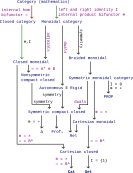
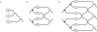
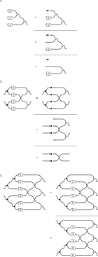
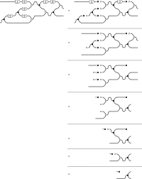
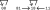

# Improve SSC

Perhaps greater and less than is so important to humans because we often think in terms of gravity. Consider saying above and below or “as high as” rather than the other language when you’re stuck. To think in terms of preorders rather than linear orders is then to think in another dimension - left and right - as well. Two things can be the same height but not be “comparable” because they are at different places across left and right. It seems like it all comes back to our 3-dimensional thinking. Are meets the way to “go down” and joins the way to “go up” in this view? If you “want” to go up, do you use the join (i.e. addition or the logical or). In Cost, is this why we have to reverse the order? Why is I < in the definition of a V-cat?

Does even forming a sentence require thinking ahead (creating an action graph)? You sometimes write the first few words of a sentence while half-thinking, and then need to erase it when you realize what you actually want to say. You often try to consider all the possible responses someone could give to a text before you write it; the more you plan ahead the more likely you’ll be able to get them to respond in a way that’s OK with you. In some sense, talking is publishing.

You often want to redo old questions rather than checking the answer. Why? Do you want to confirm you remember all the dependencies that led to the result? If you wanted to rederive every result, then you wouldn’t be reading books written by others (essentially taking their answers). You also wouldn’t maintain any notes; you’d prefer to rederive the results from scratch regularly. The point of writing down the answer was for you to be able to refer to it later, and if you never refer to it the effort you put into writing down the answer was mostly wasted (at least with respect to you).

To some extent you've even memorized the numbers associated with definitions are part of reading this book (e.g. Definition 2.46). You've also likely memorized the location of results on pages. The location of results on pages is why many books always start chapters on only odd-numbered pages (so results stay on the same side of the page through minor edits of other chapters). Hence, you really don't need to publish what you've changed back to the source.

You can read commutative diagrams like geographic maps, where the map simply repeats itself in many places. Think through one example of where the commutative diagram would apply, and you'll likely understand the pattern.


## Replace references with web links

Your references are broken anyways, so why not replace them with web links? That's what you'd prefer anyways. It'd also make your PDF better than the original, in your opinion, and so useful to others (worth sharing).


## Filters as graphs

Is there a "filter framework" in the public domain? It doesn't seem so, but see:
- [Filter graph - Wikipedia](https://en.wikipedia.org/wiki/Filter_graph)
- [Filter (software) - Wikipedia](https://en.wikipedia.org/wiki/Filter_(software))

Can you see Unix filters as defining a DAG, where the functions are the commands and the arrows in between are sets? That is, files are "sets" of lines and the filter runs on all lines in the set. The boxes are labeled with unix commands. We use "tee" to get two arrows from one output.


## Document how to visually take product orders

Add to [Product order](https://en.wikipedia.org/wiki/Product_order). You had to learn the hard way how to do this for non-total orders: see `pip-feasibility-relation.svg` for the start of how you learned to do it visually.


## Monotone maps

Consider parallel arrows, two perspectives on the same thing. What metrics are you tracking in your model? Is there a monotone map between them? For example, from F1 to an ILE. Is there a monotone map from the loss to the metrics you are measuring and care about?

The functor from your measure of a module's performance to your overall performance should ideally be monotonic. If it isn't, you won't be able to check module-level performance and be confident that it will correspond to system-level performance. If not then you have at least a non-ideal compression, a compression that is not just lossy but lossy but in the wrong way. Said another way, a compression can be "wrong" if it doesn't measure what you are interested in achieving at the next level up.

This is similar to how, when you need to start improving software, you should start by running it at the highest level that's reasonable (or better, one level above what you need to improve/change). You'll be much more immune to getting bogged down in details if you understand the big picture. If you do this, then you'll understand to what degree your module-level performance is a monotonic map to overall performance (what confidence you can have in the map).

If you don't preserve at the module-level the aspects of the problem you care about (at the most basic, preserving order), then you may have trouble (depends to what degree the map is not order-preserving).

Can you try to bite off too much before attempting to make changes? That is, start to make changes in a highly complex network when all you understand is how to run e.g. training (e.g. an object detector). No, generally speaking, but that assumes that others haven't already tried to optimize the settings you are tweaking. Said another way, if all you have is "hyperparameters" (settings you don't understand) then you and everyone else will be equally capable of checking performance (assuming your computer resources are the same). You can see humans as computers to get more done, too.

Consider breaking down your single arrow into two or more arrows in series. This corresponds to trying to gain more insight into a model through either measuring an intermediate, or reading the code for intermediates and writing tests around them.

Consider the implications of this for new developers, as well. Ideally we start them at the highest level we consider and they work down to some specific task. If that will take too much time, though, we need to give them some specific task within the larger network, and they will need to trust the optimization task they've been given has value at the next level up.


## Start with evaluations

Should you start with improving metrics in many nets? If you don't have the feature you're measuring in the loss then any achievements you gain may be temporary if the model changes in other ways (no monotone map from the loss to our metrics). But, it’s good to start with a test before adding the training feature so we know what difference we’re making if we were to include it. Once you have the test, then you can work on fixing the map incrementally.

You can also start by measuring something someone else didn't and then argue it's more important than the aspects they had optimized for (e.g. because of changing requirements).


## What is sound and complete?

To understand these terms, you're likely going to need to understand some logic (i.e. calculus). Propositional calculus is the simplest; see [Propositional calculus - Soundness and completeness of the rules](https://en.wikipedia.org/wiki/Propositional_calculus#Soundness_and_completeness_of_the_rules) to prove these properties on it. As mentioned in [Soundness](https://en.wikipedia.org/wiki/Soundness), it seems likely this completeness here is not the same as in [Gödel's incompleteness theorems](https://en.wikipedia.org/wiki/G%C3%B6del%27s_incompleteness_theorems).


## Commutative diagrams

Consider the original commutative diagram, what you think of when you think of the [Commutative property](https://en.wikipedia.org/wiki/Commutative_property):


We assume this expresses something along the lines of $ab = ba$. But is $ab$ the 2 top-right arrows, though, or the 2 bottom-left arrows?

It depends on whether you put ⨟ or ∘ in the middle of $ab$. If you put ⨟ in the middle, then $ab$ is the top-right arrows. That is, this depends on your convention for composition.

When you posed the question, you implicitly meant × (multiplication); you could have easily meant + (addition) as well. In both cases, you assume a symmetric/commutative operator and so confuse yourself about which is which. You need to go back and forget that these operators are commutative; only then can you ask if they are commutative. If you do that then you would replace the operator ×/+ by e.g. · (as in [Monoid](https://en.wikipedia.org/wiki/Monoid)) or something else that doesn't imply commutativity to you.

It's likely that · is a poor choice most of the time, however, because it does imply commutativity to many people (just as concatenation did when you posed this question). It also doesn't provide any sense of direction (only that $ab \neq ba$) if you want to also interpret the operator as a composition operator. You could come up with your own convention, but that could easily lead to confusion. In Visual Group Theory (page 85) the author confusingly defines f·g and f∘g to both equal f⨟g; this is confusing because Wikipedia's convention is now that f∘g is the opposite of f⨟g (so f⨟g = g∘f).

Said another way, you "know" that $a⨟b \neq b⨟a$ and $a∘b \neq b∘a$. The · operator is more ambiguous and so you have to check the context.


## Arrow categories


## Compression and preservation

Notice the language of models and morphisms between them in [Strict 2-category - Doctrines](https://en.wikipedia.org/wiki/Strict_2-category#Doctrines). You should often see morphisms as data, as in higher category theory. This is strangely similar to your "improve improve" documents as well; you treat a "process" as data and construct a second process (an "improve" process) to transform it. You can call of these processes, n-cells, or n-morphisms (the word doesn't matter).

As discussed in Chp. 1, most of our models are compressions of the natural world. In our brains we maintain causal compressions of the much more complicated computing engine that is nature. In computers we maintain causal compressions of the models in our brain. We expect a CNN to preserve at least some features of our visual cortex:


This compression is always lossy, but can we choose which losses to take? What do you know about your model in nature? That's what you want to preserve in your mental/computer models.

What *can* we preserve now? We discussed preserving joins and meets in Chp. 1, which seems like something you'd want to preserve in almost any model compression. It also seems quite natural to want to preserve composition, as we discussed in Chp. 3 around functors (e.g. preserving order with monotonic functions).

A [Linear map](https://en.wikipedia.org/wiki/Linear_map) preserves vectors addition and scalar multiplication.

In image processing, see other examples of preservation in [machine learning - What is translation invariance in computer vision and convolutional neural network? - Cross Validated](https://stats.stackexchange.com/questions/208936/what-is-translation-invariance-in-computer-vision-and-convolutional-neural-netwo). In e.g. topdown lidar imagery someone might be interested in rotational equivariance.

### Classification

Draw (1.5) mapped to the bools. This whole example could be seen as a classification task. For classification, we typically want translation invariance: moving an object in an image should not change the image's classification.

### Object detection

For object detection we typically want translation equivariance; see [Equivariant map](https://en.wikipedia.org/wiki/Equivariant_map). Said another way, this preserves the operation of symmetry transformations. Recognize that a model is different with different inputs applied to it; these are not the same and we can identify at least part of the map between them:


### Adding software complexity

When we add new code to existing software, we often want to maintain all our previous features. Sometimes this is as simple as adding an if statement and handling new cases, directly adding more code paths. That map between the old and new software is obvious in this case, but what if that's not enough? Consider adding an FPN, or converting a single-frame model to multiple frames.

To refactor means to maintain the same behavior while changing the code to support new features. Version control tracks your refactoring. Every commit is a map from the old software to some new version that is "better" in some way, which typically means not losing features. It's critical to have this history when some feature is lost (a bug/defect, specifically a regression). A regression is always associated with some commit, a map between the old and new software. You can't test everything; these maps are critical to understanding what happened when something breaks.

Smaller commits makes verification that these maps are as expected easier. That is, incremental changes may *seem* to be a slower path to your goal, but it's often the case that doubling the size of a step is more than twice as expensive as two smaller steps to verify (for other developers, and oneself). We can also run into working memory limitations if we make our steps too large.


## Composition of relations and matrix multiplication

How are these related? You're familiar with both, but it seems like they sometimes express nearly the same thing. See:

- https://en.wikipedia.org/wiki/Composition_of_relations#Composition_in_terms_of_matrices
- https://en.wikipedia.org/wiki/Binary_relation#Matrix_representation

A simple example with 2×2 matrices that shows a connection to the notation of quantales:
- https://twistedelephants.wordpress.com/2012/05/13/relation-composition-as-matrix-multiplication/

The connection to categories:
- https://math.stackexchange.com/questions/4548276/why-do-the-composition-of-relations-and-the-matrix-product-look-so-alike


## Section 4.5.2


*Exercise* 4.65.

In the paragraph above this question, the author is defining **1** to have a single object 1. Every morphism in a $\mathcal{V}$-category must be also be assigned an element in $\mathcal{V}$, so he also assigns to the single morphism (the identity morphism on 1) the object *I*.

A 𝓥-profunctor $\rho_\mathcal{X}: \mathcal{X} × \textbf{1} ⇸ \mathcal{X}$ is a 𝓥-functor $\rho_\mathcal{X}: (\mathcal{X} × \textbf{1})ᵒᵖ × \mathcal{X} → \mathcal{V}$. Because $\mathcal{X}$ is enriched in $\mathcal{V}$, we know that $\mathcal{X}({x,y})$ is an object of $\mathcal{V}$. Let's define $\rho_\mathcal{X}(x,1,x') := \mathcal{X}(x,x')$ (an isomorphism as required).

Similarly, a 𝓥-profunctor $\lambda_\mathcal{X}: \textbf{1} × \mathcal{X} ⇸ \mathcal{X}$ is a 𝓥-functor $\lambda_\mathcal{X}: (\textbf{1} × \mathcal{X})ᵒᵖ × \mathcal{X} → \mathcal{V}$ defined $\lambda_\mathcal{X}(1,x,x') := \mathcal{X}(x,x')$.


*Exercise* 4.66.

How does this selection of a dual make sense in terms of $\textbf{Prof}_\textbf{Bool}$? What does the categorical product $\mathcal{X}^{op} × \mathcal{X}$ look like?

Every object in $\textbf{Prof}_V$ should have a dual. Writing the relevant morphisms as $\mathcal{V}$-profunctor:

$$
\rho_\mathcal{X}: \mathcal{X} × \textbf{1} ⇸ \mathcal{X} \\
\lambda_\mathcal{X}: \textbf{1} × \mathcal{X} ⇸ \mathcal{X} \\
\rho^{-1}_\mathcal{X}: \mathcal{X} ⇸ \mathcal{X} × \textbf{1} \\
η_\mathcal{X}: \textbf{1} ↛ \mathcal{X}^{op} × \mathcal{X} \\
ε_\mathcal{X}: \mathcal{X} × \mathcal{X}^{op} ↛ \textbf{1} \\
\mathcal{X} × η_\mathcal{X}: (\mathcal{X} ↛ \mathcal{X}) × (\textbf{1} ↛ \mathcal{X}^{op} × \mathcal{X}) =
\mathcal{X} × \textbf{1} ↛ \mathcal{X} × (\mathcal{X}^{op} × \mathcal{X}) \\
$$

Writing the relevant morphisms as $\mathcal{V}$-functor:


## Algebraic structures

See:

- [Outline of algebraic structures - Wikipedia](https://en.wikipedia.org/wiki/Outline_of_algebraic_structures)
- [Algebraic structure - Wikipedia](https://en.wikipedia.org/wiki/Algebraic_structure)
- [Concrete category - Wikipedia](https://en.wikipedia.org/wiki/Concrete_category)
- [Template:Algebraic structures - Wikipedia](https://en.wikipedia.org/wiki/Template:Algebraic_structures)

Here's an example to anchor off of (could update to [File:magma to group.svg](https://commons.wikimedia.org/wiki/File:Algebraic_structures_-_magma_to_group.svg) as well):


In [Algebra [cats]](https://typelevel.org/cats/algebra.html) and [Outline of algebraic structures](https://en.wikipedia.org/wiki/Outline_of_algebraic_structures) the same information that this preorder ([File:Magma to group4.svg](https://commons.wikimedia.org/wiki/File:Magma_to_group4.svg)) expresses is provided in a table. Still, the colors of the arrows are helpful to indicate what structure is being added. That is, a typical preorder only has booleans (an arrow or not) between elements, while this colored drawing allows for 3 (and in general more) properties to be quickly recalled.

You could see the nodes/objects as categories and the arrows as coming from a set of algebraic features. That is, this presents the category of small categories enriched in certain algebraic features. You could add an arrow for commutative (selected yellow below) and add a [Commutative monoid](https://en.wikipedia.org/wiki/Monoid#Commutative_monoid) to the drawing. This is definitely collecting butterflies; you should also consider which structures are important or common.

In this context a colored arrow means *adds* some structure specific to the color. For example, in [File:Magma to group4.svg](https://commons.wikimedia.org/wiki/File:Magma_to_group4.svg) a Monoid with invertibility is a Group. Follow the arrows in reverse for an "is a" relationship followed by "with"; e.g. a Group is a Semigroup with invertibility and identity.

It's no mistake that this drawing is of a partial order with 8 elements. We could construct it by taking the product of 3 two-element partial orders, with each two-element partial order representing the addition of some property/adjective (a checkbox in the table representations).


### Structure, space, or algebra?

Although all these words show up regularly in the study of algebraic structures, they are essentially synonyms in the sense that they are all "structures" in the sense of being a set or sets with an operation or operations defined on them (the article [Mathematical structure](https://en.wikipedia.org/wiki/Mathematical_structure) limits the definition of structure to being defined on only one set). Don't be bothered by the inconsistency in language that often occurs. We'll use AS for [Algebraic structure](https://en.wikipedia.org/wiki/Algebraic_structure) in the following, since it's becoming the anchor word.

See also [Structure (mathematical logic)](https://en.wikipedia.org/wiki/Structure_(mathematical_logic)).


#### Space vs AS

Why do we have all these nearly equivalent words? The terms "space" and "structure" exist alongside each other primarily for historical reasons; see [Space (mathematics)](https://en.wikipedia.org/wiki/Space_(mathematics)). In practice this means you'll see the term "space" more often when a discussion turns to geometric rather than algebraic concerns. We are straddling this line in [Vector (mathematics and physics)](https://en.wikipedia.org/wiki/Vector_(mathematics_and_physics)) with the quote:

> A vector space formed by geometric vectors is called a Euclidean vector space, and a vector space formed by tuples is called a coordinate vector space.

You'll see the same Euclidean/coordinate (i.e. space/structure) language explained in [Real coordinate space](https://en.wikipedia.org/wiki/Real_coordinate_space).

Similarly, the article [Group action](https://en.wikipedia.org/wiki/Group_action) feels the need to awkwardly state "space or structure" early on and often switches between the words.


#### Algebra vs AS

The article [Commutative ring](https://en.wikipedia.org/wiki/Commutative_ring) states that commutative algebra is about the study of commutative rings, which are typically described as algebraic structures (not algebras). This is because the term "algebra" without an article refers to a "field of study" in mathematics; see [Algebra](https://en.wikipedia.org/wiki/Algebra) (notice this article is written in 162 languages). That is, the term "algebra" in this context is useful to avoid the verbose "field of study" or "broad part of mathematics" someone would otherwise need to use. Why not use the word "math" though? As in "linear math" (linear algebra) or "abstract math" (abstract algebra)? Most likely, only to sound fancy.

This language gets especially confusing in cases like the following from [Algebra](https://en.wikipedia.org/wiki/Algebra):

> Sometimes, the same phrase is used for a subarea and its main algebraic structures; for example, [Boolean algebra](https://en.wikipedia.org/wiki/Boolean_algebra) and a [Boolean algebra](https://en.wikipedia.org/wiki/Boolean_algebra_(structure)).

With an [Article (grammar)](https://en.wikipedia.org/wiki/Article_(grammar)), an [Algebra over a field](https://en.wikipedia.org/wiki/Algebra_over_a_field) is simply an example of an algebraic structure. These are the most "structured" or complicated algebraic structures because they stack on top of vector spaces even more operations. The fact that an [Algebra over a field](https://en.wikipedia.org/wiki/Algebra_over_a_field) is the starting point on Wikipedia is a bit unfortunate because it seems like most examples easily generalize to an [Algebra over a ring](https://en.wikipedia.org/wiki/Algebra_over_a_field#Generalization:_algebra_over_a_ring) (e.g. [Associative algebra](https://en.wikipedia.org/wiki/Associative_algebra)). See also [Map of lattices](https://en.wikipedia.org/wiki/Map_of_lattices).

Why do we often use the letter $K$ for a field rather than $F$? One possibility (or at least a mnemonic) is that the "c" in "vector" sounds like K, and a "vector" space is defined over a field. The (historical) language of "algebra over a field" may be related to this: the concept of an "algebra over a field" is an extension of a vector space, which seems to often be conflated with the concept of a field. We could read this as an "algebra over a vector space" instead, and it's likely most people would understand what was meant (though this is even more verbose).


### Two binary operations

These are the algebraic structures with "One binary operation on one set"; can you do the same for structures with two operations? Starting with the same colors as [File:Magma to group4.svg](https://commons.wikimedia.org/wiki/File:Magma_to_group4.svg) (RGB), but with dark colors for multiplication (×) and light colors for addition (+). Expanding on the operations in [Algebra [cats]](https://typelevel.org/cats/algebra.html):


The corresponding category is marked to the bottom left of some defintions, where you'll find the rules for preserving structure between different examples (in the definition of the homomorphism). The arrows between these categories indicate "full subcategory" rather than the addition of some property/constraint/structure.

Start with the smallest possible examples (2-3) in every case (e.g. ℤ/4ℤ), so that you can potentially provide drawings. Also as part of avoiding infinite. You should strive to provide non-trivial examples, though, which makes this harder than simply providing the smallest possible example.

If you take "is a" to mean "has inside it all examples" then you'd get a bunch of examples of everything by just going up the "is a" chain. It's a "subset of" relationship as well.

When you link to an example, link to the longest possible explanation of the example you can find (not just where you originally found it).

Prefer the term "Noncommutative ring" to be more specific, since in some contexts "Ring" may imply a commutative ring. Prefer the term "Semiring" to "Rig" only because the former is more common and consistently used on Wikipedia; it's also much easier to quickly search for ("rig" is a part of many words, requiring whole word search).

We "generalize" when we go from thinking about specific examples in a category to thinking in terms of the category (what structure all the examples have in common), and we "generalize" when we remove property/constraints/structure (following arrows in the reverse direction).

Notice you've already started on the "One set with no binary operations" diagram in Exercise 5.10, with FinSet, FinRel, etc.

Said another way, the "is a" relationship can hold because one object has more constraints (more structure) on it than something it is an instance of (Y "is a" X because all examples of Y have more structure than all examples of X). The "is a" relationship can also hold because Y is simply an example of X (not thinking of the potential many examples of Y and X). We could think more deeply and put boxes in boxes; but between the examples in separate boxes there is presumably no relationship (no morphisms) unless you go up to a common level and use the morphisms at that level. That is, use e.g. prop functors, monoidal functors, or functors to preserve what structure the two objects do share.


### Properties of categories

Consider the following diagram, now one level "up" in the sense of thinking about properties/constraints/structure you can add to categories. But is it part of **Cat** if it includes **Cat**?



It could be drawn similar to the algebraic diagrams above. In both cases we are adding something with all of our arrows, whether we are assigning new properties or assigning arguments (calling constructors, so to speak). In the first case we add a property to all examples in a set/class ("modify" the set/class relative to its previous definition); in the second case we add a property to only an element ("modify" the element relative to its previous definition).

This drawing assumes some categories (e.g. **Rel**) are only defined as monoidal categories in one way. In fact, there are often multiple ways to define a category as monoidal (different options for the monoidal product). It should include what monoidal product is being used in its examples.

The link https://en.wikipedia.org/wiki/Compact_category redirects to Autonomous category. Which term do you prefer? With rigid, it seems there are three now:
- https://math.stackexchange.com/questions/4548276
- https://ncatlab.org/nlab/show/rigid+monoidal+category

This diagram started as a list of common [Enriched category](https://en.wikipedia.org/wiki/Enriched_category).


### Managing definitions

Working through this exercise, it's clear that there are so many definitions you're going to struggle to get them all on one diagram. As discussed in [Ring (mathematics)](https://en.wikipedia.org/wiki/Ring_(mathematics)), many authors define a ring differently depending on the context. And why not? These definitions (like any structure) should only be evaluated relative to your objectives.

Even if you *wanted* to define global terms, the terms are going to get incredibly long as you add more and more adjectives. You'll need more and more adjectives (or alternatively, to invent new words) only because your namespace is going to fill (requiring rework of your drawing, as well). It's critical to delete/archive code for the same reason. Still, you need a large vocabulary to be able to interpret as much as possible (as long as you're given context). Your notes are your own vocabulary; you may need to invent new words (or make longer words) in them so you can actually pull together logic that was previously in different contexts.

For example, prefer the term "Noncommutative ring" internally to be more specific, though this will usually correspond to the unadorned "Ring" when you encounter that term.


### Other

Consider finding the same in a programming language as well; see:
- https://typelevel.org/cats/typeclasses.html#type-classes-in-cats
- [discopy/discopy: Architecture](https://github.com/discopy/discopy#architecture)

Perhaps you still need your own in your own notes, to include e.g. [Quantale](https://en.wikipedia.org/wiki/Quantale) and [Heyting algebra](https://en.wikipedia.org/wiki/Heyting_algebra)? In your own notes you want to see what you've understood in the past so you can think about what might be easy to construct from what you already know. In general, this is true for most drawings (you only include on them what you understand).

How do you use categorical logic in Python? Much may need to be custom; see [Computational Category Theory in Python I: Dictionaries for FinSet | Hey There Buddo!](https://www.philipzucker.com/computational-category-theory-in-python-i-dictionaries-for-finset/). However, this mentions the promising [Welcome to Hypothesis! — Hypothesis 6.71.0 documentation](https://hypothesis.readthedocs.io/en/latest/). See also [Computational Category Theory in Python III: Monoids, Groups, and Preorders | Hey There Buddo!](https://www.philipzucker.com/computational-category-theory-in-python-3-monoids-groups-and-preorders/).


# 5.4 Graphical linear algebra


## 5.4.1 A presentation of Mat(R)


### *Exercise* 5.58




### *Exercise* 5.59

In stage (i) we'll take the $m$ inputs and make $n$ copies of each to prepare for $m*n$ scalar multiplications in stage (ii). In stage (iii) we'll use swaps and identities to build a [permutation](https://en.wikipedia.org/wiki/Permutation) matrix to convert the scaled data from a row-major to a column-major form. In the final stage (iv) we'll use additions to sum across the now-contiguous column data.


### **Sound and complete presentation of matrices.**

Two SFG can in general represent different matrices:

$$
\begin{matrix}
SFG_1 & M_1 \\
SFG_2 & M_2
\end{matrix}
$$

The *sound* property implies that if $SFG_1$ can be converted into $SFG_2$ using the given rules, then $M_1$ and $M_2$ are equal. The *complete* property implies that if $M_1$ and $M_2$ are equal, then $SFG_1$ can be converted into $SFG_2$ using the given rules. The second statement is clearly the [Converse (logic)](https://en.wikipedia.org/wiki/Converse_(logic)#Categorical_converse) of the first. Example 5.61 is demonstrating an implication of the *complete* property.

See also:
- [Completeness (logic)](https://en.wikipedia.org/wiki/Completeness_(logic))
- [Soundness](https://en.wikipedia.org/wiki/Soundness)

Why use anything but the normal form to represent matrices? As Example 5.62 and 5.63 demonstrate, the non-normal form of a matrix can be much smaller (i.e. more efficient, with fewer additions and multiplications).


### *Exercise* 5.62




### *Exercise* 5.63

Consider part `1.`. Calling the two inputs $x_1$ and $x_2$ (from top to bottom) and the two outputs $y_1$ and $y_2$, there's clearly a non-zero contribution to $y_1$ from $x_1$. Following only the top wire, it's at least $5·3·5·3 = 225$ when the input is non-zero.

Note that because the semiring is the natural numbers, the inputs are always zero or greater.

For part `2.`:




## 5.4.2 Aside: monoid objects in a monoidal category


### Identity

We often denote the identity morphism on a vertex v as either $v$ or $id_v$. Prefer the latter notation; otherwise this can be confusing because $v$ can also mean the object $v$, which is really a different thing. The articles [Identity function](https://en.wikipedia.org/wiki/Identity_function) and [Category (mathematics)](https://en.wikipedia.org/wiki/Category_(mathematics)#endnote_Alpha) don't introduce this same ambiguity (this ambiguity was explicitly introduced by the author in Section 3.2.1).

Prefer $id_v$ to $1_v$; the latter assumes the identity element is one (as in multiplication) although it is shorter.

There's only ever one identity morphism on an object and it is both a left and right identity; see [Identity element / Properties](https://en.wikipedia.org/wiki/Identity_element#Properties) for a discussion of how the existence of both a left and right identity implies the two identities must be equal.

What does $id$ mean, without any subscript, as in the upcoming Exercise 5.67? Often it means the [Identity functor](https://en.wikipedia.org/wiki/Functor#identity_functor), which is not a morphism at all. Or is it? Do you assume that 0-morphisms don't map structure, so 1-morphisms (functors) do? That's thinking only in **Set**. Still, it may be more appropriate to write $id_𝓒$ rather than $id_C$ to make it clear this is a functor that can take as an argument any object in 𝓒 rather than the identity morphism on an object C. This isn't to say that $id_C$ couldn't take an argument; in **Set** it would take elements of the set (an identity function).

This is closely related to the primordial ooze, that is, seeing functions/morphisms as "single" things/objects vs. seeing them as a collection of things/objects (a mapping defined for many objects). It's likely this is the reason that sometimes we give id a subscript and sometimes we don't; the former emphasizes that is one thing/object in some larger collection and the latter emphasizes that it is a collection of things itself (that could be subscripted/indexed as needed). Thinking in terms of both subscripts and arguments, the language of $id_a(x)$ lets you essentially consider three levels at once. For more on subscripts vs applying arguments, see [Indexed family](https://en.wikipedia.org/wiki/Indexed_family).

Is $id_{x_{x_x}}$ so bad? Clearly the subscripts are going to get so small as to be unreadable. The "solution" in many contexts seems to be to start with subscripts then move to argument application (see e.g. [Operations with natural transformations](https://en.wikipedia.org/wiki/Natural_transformation#Operations_with_natural_transformations)) to get terms like $id_{F(X)}$ (which would otherwise have been $id(F(X))$ or $id_{F_X}$). For simplicity we'll either follow this mixed pattern, or use all parentheses.

Can you "apply" a natural transformation the same way you apply an argument to a function or an object to a functor? See the first paragraph of [Natural transformation](https://en.wikipedia.org/wiki/Natural_transformation#natural_isomorphism), before all the nasty definitional details. The apparent difference is that a natural transformation typically takes a single functor F as an argument and produces a second functor G; it's a transformation that is defined for only one input argument. Let's simplify our thinking to identities, though, so we can more easily go up a level ("level shift" in the language of section 1.4.5). Who says there isn't an identity function defined for all natural transformations? Call this id, so that $id_\eta$ refers to the specific morphism we are talking about here.

We got where we wanted, but notice we're using the language id (which we said before to prefer not to use, always including a subscript). We can only get away from this by seeing the "bigger picture" and making id just an example of morphism in a higher category. Try to do so yourself by mentally duplicating the following drawing below it, and introducing e.g. lowercase letters (a,b,c ...) to assign names to the two objects in your new collection:


Even if you can draw the mental picture, it's unlikely that you'll need this level of abstraction. Adding abstraction creates complexity; if we had referred to id(η(G)) in the diagram above as plain old id, then we could have saved ourselves a lot of typing and referred to the identity function on id(η(G(1))) as simply id(1) (or $id_1$). This works as long as we don't need to refer to the 1 in the context of id(η(F)) (our reference would then be ambiguous). In short, there's a tradeoff between providing extra detail (potentially distracting, more work to provide) and potentially running into ambiguity.


#### Context creation

All this likely hides the fact that when we "level shift" we are creating something new: a context. If we're upshifting then we're taking everything we know and trying to put it in a new box (seeing the big picture, seeing our currently focal object as part of a collection). If we're downshifting then we're creating a new box for something that we previously didn't concern ourselves with (getting into the details, seeing our currently focal object as a collection that we need to open up and look through). Perhaps better terms are "upcreate" and "downcreate" to emphasize that these contexts don't exist until we imagine them.

This gives [Self-reference](https://en.wikipedia.org/wiki/Self-reference) a whole new meaning. To avoid self-reference we have to define things that "just are" and we don't question. This is referring to A as A rather than $id_A$, which makes the world of A a real thing with e.g. multiple things inside it (a function). In the language of [Strict 2-category](https://en.wikipedia.org/wiki/Strict_2-category) these are the 0-cells: what we don't question (at least for now). We don't use negative numbers in this context; typically we'd reindex from 0 if we needed to add more details.

To "downcreate" is categorification. In fact the primary example of the concept given by the author and the article [Categorification](https://en.wikipedia.org/wiki/Categorification) is seeing a natural number such as 5 as a set of objects of size five {apple, banana, cherry, dragonfruit, elephant}.

In computing this is related to dependencies. What objects do you "define" to simply exist? These become your dependencies in a particular domain. You don't have to dig into your own definitions; you've taken them as axioms.

This is highly related to how a [Monad (functional programming)](https://en.wikipedia.org/wiki/Monad_(functional_programming)) creates a *context* for computation. When we're programming and downcreating it's easy to write a bunch of new code that only addresses what we care about: we get to decide the new bottom. When we're upcreating this isn't so easy. How do we share all that we know with higher levels? We often compress our results, even arguing that this is good. It's in this context that it's important to wire e.g. a Maybe monad dependency through all the layers.

If you could make the structure associated with a particular morphism part of the argument i.e. make it part of a set based on tuples, couldn't you make sure it was preserved in any conversion? In that sense, it's all data. What do you let be passed via context, and what must be passed on a case-by-case basis? Functional languages try to make it easy to pass information via context, so that it *does* get passed at all.

Contrast this with [Identity (mathematics)](https://en.wikipedia.org/wiki/Identity_(mathematics)), which is actually an equality.


### Define n⁰ (for non-negative n)

The functor $U$ in Exercise 5.69 sends $n ∈ ℕ$ to the set $ℝ^n$. What does this mean when n = 0? First, we should read $ℝ^n$ as a [Real coordinate space](https://en.wikipedia.org/wiki/Real_coordinate_space), not necessarily as a vector space (given the codomain of $U$ is **Set**, but in general as well). See [Real coordinate space § Examples](https://en.wikipedia.org/wiki/Real_coordinate_space#Examples); this defines $ℝ^0$ as a singleton. Clearly this is the most popular/common definition in mathematics (the apparent consensus) per e.g. the [hmakholm answer](https://math.stackexchange.com/a/235096/245548), but why is raising any number to the power of zero equal to one? Should numbers (or sets) to the power of zero equal one (or have cardinality one)?


#### Advantages

See [Empty product](https://en.wikipedia.org/wiki/Empty_product), with a variety of arguments for this convention.

If you want to reinterpret functions with $n$ arguments as taking a member of $ℝ^n$, then $ℝ^0$ would correspond to constant functions. That is, functions that take zero arguments e.g. $x = 7$. In this last example, is $x$ a function/morphism from some "singleton" object (defining $n^0 = 1$), or is it an alias for 7 (defining $n^0 = 0$)? Either way, we could write it $x: ℝ^0 → ℝ^1 = 7$ (leaving $ℝ^0$ ambiguous).

Said another way, must we define even constant objects as being with respect to something that already exists? This is highly related to the conversation about identity above.

If you take [Dimension](https://en.wikipedia.org/wiki/Dimension) to mean the number of coordinates that are needed to specify the position of a point in context, then if your "context" is a point you need zero dimensions to specify your location.

Is this the equivalent to calling [numpy.squeeze](https://numpy.org/doc/stable/reference/generated/numpy.squeeze.html)? In the case of numpy.squeeze, you have to supply dummy 0 arguments if you don't remove the extra dimensions. If there are 2 or greater columns along one dimension of a relation, you can see it as being of order $R^1$: you need to supply at least one argument to that context to supply which column you mean. If there is only one column, then you don't really need to specify anything to that "context" (that dimension) to specify what data you mean. It's up to you: feel free to squeeze or unsqueeze depending on your logical needs.

From this perspective, every dimension in a PyTorch tensor could "actually" be of zero or one dimension, despite the type reported by PyTorch. That is, the system could easily be holding onto no longer needed dimensions.

When you write a function from a singleton set to some other set e.g. f = x ↦ 2: {1} → {2,3} there's really no need to supply the first argument. While f(1) is clearly going to be 2, you could have concluded the answer would be 2 without this argument. On the other hand, what would f(2) mean? It seems like it would be better to be explicit so you can catch apparent errors like this one. Per [Initial and terminal objects](https://en.wikipedia.org/wiki/Initial_and_terminal_objects), there can be multiple zero objects (even if they are unique up to unique isomorphism).

However, from the perspective of [Free variables and bound variables](https://en.wikipedia.org/wiki/Free_variables_and_bound_variables), it doesn't make sense to bind an argument if it doesn't show up as a variable anywhere in the expression. To continue to provide the argument seems non-minimal. In the above, would you want an error if you supplied 1 rather than 0 to index a PyTorch tensor with a column of dimension 1? You could have prevented the error from even being possible by cleaning up your logic.

If you write this f(), are you applying the empty tuple ()? It seems so, see [Function application](https://en.wikipedia.org/wiki/Function_application). This "flat" horizontal stack is often a good visualization; the equivalent for a column vector is [File:Real 0-space.svg](https://commons.wikimedia.org/wiki/File:Real_0-space.svg), mentioned in [Real coordinate space § Examples](https://en.wikipedia.org/wiki/Real_coordinate_space#Examples).

If you imagine $5^3$ as a cube with 125 elements, then when you move to $5^2$ you reduce one dimension to one. Similarly when you go from $5^2$ to $5^1$ (from a box to an array). To be consistent, you should define going from $5^1$ to $5^0$ as only collapsing the last dimension down to length one. This is similar to many other answers, such as [The Count's](https://math.stackexchange.com/a/2121811/245548).

Many other answers argue for this approach merely because it's convenient. See also:
- https://math.stackexchange.com/a/235117/245548
- https://math.stackexchange.com/questions/135 (all answers)

It's convenient to use this definition to be able to use the trivial or zero vector space (see [Examples of vector spaces](https://en.wikipedia.org/wiki/Examples_of_vector_spaces)). See also [Dimension (vector space)](https://en.wikipedia.org/wiki/Dimension_(vector_space)) and [Zero-dimensional space](https://en.wikipedia.org/wiki/Zero-dimensional_space).


#### Disadvantages

If you see $5^3$ as five groups of fives groups of five, then $5^2$ as five groups of five, then $5^1$ as a group of five, why wouldn't $5^0$ be zero groups, or zero? Perhaps the issue here is that "five" means "five elements" or "five groups of one" and so to remove the word "group" one more time would leave one.

It's tempting to expect $ℝ^0$ to be the empty set. If you see this as the set of tuples of size zero, then you may not want to count the empty tuple () as a tuple.

While the [Vectornaut answer](https://math.stackexchange.com/a/1475935/245548) is somewhat convincing, why is "not doing anything" count as a mapping? If you had one bead and one paint, why wouldn't there be two ways to paint the beads: assigning the one paint to the one bead, or doing nothing?

There's no clear consensus on $0^0$ and there may never be; see [this MSE comment](https://math.stackexchange.com/questions/235081/numbers-to-the-power-of-zero#comment521107_235081). Consider this table for the operation, which demonstrates some of the conflict:

| Base/Exp |  0  |  1  |  2  |
| ---      | --- | --- | --- |
| 0        |  ?  |  0  |  0  |
| 1        |  1  |  1  |  1  |
| 2        |  1  |  2  |  4  |
| 3        |  1  |  3  |  9  |

If we define a [function (mathematics)](https://en.wikipedia.org/wiki/Function_(mathematics)) as a [total function](https://en.wikipedia.org/w/index.php?title=Total_function), then the asymmetry in our definition leads to there always being one function out of the empty set but zero into it (see also [Initial and terminal objects](https://en.wikipedia.org/wiki/Initial_and_terminal_objects)). That is, a function can't be total and map to the empty set (if it has any elements in its source set). Is there a self-loop between the empty set and the empty set (i.e. $0^0$)? Is it better to work with relations to avoid this issue? The [empty function](https://en.wikipedia.org/wiki/Function_(mathematics)#empty_function) has always seemed strange.

You could see many of these corner cases as humans needing/wanting to define a function beyond where it currently has a semantic meaning. That is, functions are "total" by definition, and so unless you carefully define all your sets as being e.g. one element smaller then you may feel need like you need an answer for your function to remain total.

In different situations (with different semantics) different definitions may be appropriate. If you use only a definition that makes sense in *most* situations, then you may miss the opportunity to use a more appropriate definition to a situation (that allows for a much better or more elegant solution). When it comes to corner cases where multiple definitions may be acceptable, it gets hard to use Wikipedia (which only documents what are effectively common definitions).


### *Definition* 5.65

For a similar definition, see [Monoid (category theory)](https://en.wikipedia.org/wiki/Monoid_(category_theory)). The Wikipedia definition nearly exactly matches [monoid in a monoidal category in nLab](https://ncatlab.org/nlab/show/monoid+in+a+monoidal+category). Confusingly, in all definitions, both $\mu$ and $\eta$ are morphisms rather than natural transformations (despite being Greek letters).

The author glosses over the natural isomorphism $\alpha$ in part (a) of his definition. He also apparently defines $\eta$ as a function with signature $0 → 1$ rather than $1 → 1$ (allowable because $I$ is a singleton set); without this assumption (b) doesn't work.

The word "monoid" is being being thrown around a lot in this definition. First, there's an almost-monoid associated with 𝓒 simply being a category based on the set (presumably a small category) of objects in 𝓒, the composition operator (∘ or ⨟), and all the identity morphisms. That is, one can view a small [Category (mathematics)](https://en.wikipedia.org/wiki/Category_(mathematics)) as similar to a monoid but without closure/totality properties (see also  the row for "small category" in [Template:Group-like structures](https://en.wikipedia.org/wiki/Template:Group-like_structures)). See also [Groupoid](https://en.wikipedia.org/wiki/Groupoid). Still, a monoid is a small category but a small category is not a monoid (lacking totality/closure). This is worth mentioning because the standard composition operators provide one dimension where concatenation can happen on string diagrams, however. Because this isn't a full monoid, you can't concatenate just anything.

Arguably the composition direction is more like language/algebra (which is also not symmetric/commutative) and the monoidal direction is more like convolution/parallelism (or possible worlds).

This is distinct from the idea of a monoid being a small category with one object. For example, the monoid $(\{T,F\}, T, ∧)$ can be represented as a category with one object, two arrows, and the path equations $TT = T, TF = F, FT = F, FF = F$. We can't view it as [monoid object](https://en.wikipedia.org/wiki/Monoid_(category_theory)) unless we level shift to the category of sets, or the category of small categories.

Why must a monoid object only exist in a monoidal category? Because the identity for the monoid object $\eta$ is (technically) dependent on the identity in the monoidal category $I$, and the identity binary operation for the monoid object $\mu$ is dependent on the monoidal category's ⊗ to "concatenate" objects.


### *Exercise* 5.67

Let's define $id_ℝ: ℝ → ℝ$ specifically as $id_ℝ(r) ↦ r$.

For `1.` we have $\mu: ℝ ⊗ ℝ → ℝ$ and $id_ℝ: ℝ → ℝ$ so that $\mu ⊗ id_ℝ: (ℝ ⊗ ℝ) ⊗ ℝ → ℝ ⊗ ℝ$.

Per the [Cartesian product of functions](https://en.wikipedia.org/wiki/Cartesian_product#Cartesian_product_of_functions) this is specifically defined $(\mu ⊗ id_ℝ)((a,b), c) ↦ (a * b, c)$. Similarly:

$$
\begin{align}
((\mu ⊗ id_ℝ) ⨟ \mu)(a,b,c) & ↦ (a * b) * c \\
((id_ℝ ⊗ \mu) ⨟ \mu)(a,b,c) & ↦ a * (b * c)
\end{align}
$$

Which are equal by associativity (the author ignores $\alpha$ in his definition).

For part (b) we have $\eta: 0 → 1 = 1$. So we have:

$$
\begin{align}
((\eta ⊗ id_ℝ) ⨟ \mu)(a) ↦ 1 * a & = a \\
id_ℝ(a) ↦ & = a \\
((id_ℝ ⊗ \eta) ⨟ \mu)(a) ↦ a * 1 & = a
\end{align}
$$


### *Exercise* 5.69

See also [Monoidal functor](https://en.wikipedia.org/wiki/Monoidal_functor) and [Monoidal natural transformation](https://en.wikipedia.org/wiki/Monoidal_natural_transformation).

For `1.`, to show we preserve the monoidal unit:

$$
U(0) = ℝ^0 = {0} ≅ {1}
$$

To show we preserve the monoidal product:

$$
U(A ⊗ B) = U(A + B) ≅ U(A) ⊗ U(B) = U(A) × U(B)
$$

which holds for all A and B in **Mat**(R), where + is the direct sum as given in Definition 5.50.

For `2.` we can start by thinking of the specific monoids in Exercise 5.67. U(M) will be $R^1$, so n = 1 in the prop Mat(R).

Wrap all the equations in Definition 5.65 in $U$, and use all rules about preservation to reduce.


## 5.4.3 Signal flow graphs: feedback and more


### *Exercise* 5.77

For part `1.`, the behavior of the addition icon is:

$$
= \{ ((x,y),x+y) | x,y \in R\} ∈ R^2 × R^1
$$

So the behavior of the reversed addition icon is:

$$
= \{ (x+y,(x,y)) | x,y \in R\} ∈ R^1 × R^2
$$

For part `2.`, the behavior of the reversed copy icon is:

$$
= \{ ((x,x),x) | x \in R\} ∈ R^2 × R^1
$$


### Combining directions.

It's not explicitly mentioned anywhere, so it's worth calling out (before it's needed) exactly what the zero-reverse and the discard-reverse mean. The original zero generator took nothing and produced zero; the original discard generator took anything and produced nothing. So the zero-reverse takes zero and produces nothing; the discard-reverse takes nothing and produces anything (it could be thought of as an "any" generator).

These definitions are perhaps confusingly written in terms of cause (or conversion), however, when a relation simply implies that certain tuples are valid.

One way to remember the icon for the zero signal (i.e. distinguish it from e.g. discard-reverse) is that the empty circle looks like a zero.

Consider the first diagram in this section in this light; the discussion of the "Compact closed structure" of $\textbf{Rel}_R$ at the end of this section is also helpful. In short:

$$
y = -3y + 4x \\
4y = 4x \\
y = x
$$


### Definition 5.79

#### Relative to **Rel**

```bash
pip install -q xarray
```

How is this new $\textbf{Rel}_R$ different than $\textbf{Rel}$? Clearly, there's some relationship based on the name the author has decided to use here. It has more structure; while a morphism in $\textbf{Rel}$ can be a subset of the product of any two sets (say A and B), the morphisms in $\textbf{Rel}_R$ are constrained to be subsets of $R^m × R^n$ (where R is the rig). This doesn't imply the relation is no longer finite; consider the boolean matrices we encountered when discussing quantales (e.g. Example 2.102).

It does imply (at least conceptually) a rather inefficient storage format for matrices. Consider a 2×2 boolean matrix (an object in 𝔹²×𝔹² i.e. $R^2 × R^2$ where the rig R = 𝔹). Taking 𝔹 = {0,1} we have 𝔹² = {00,01,10,11} so that this relation takes 4×4 = 16 bits to store. Consider the specific example of a boolean matrix taking 4 bits to store:

$$
\begin{bmatrix}
1 & 0 \\
1 & 0 \\
\end{bmatrix}
$$

When we store (or think about) this as a relation, we have to consider every possible input (4 vectors of length 2) and provide a column of data for every possible output. For the example matrix above, applying the length-2 vector from the left:

```python
import numpy as np
import xarray as xr

data = xr.DataArray(np.array(
    [
        [1,0,0,0],
        [0,0,1,0],
        [0,0,1,0],
        [0,0,1,0],
    ]),
    dims=("x", "y"), coords={"x": ["00", "01", "10", "11"], "y": ["00", "01", "10", "11"]}
)
data
```

Obviously these logical matrices will only get more sparse as we increase dimensionality. This is a clear example of decompression, taking a compact/efficent function/matrix and converting it to a complete list of examples. Since we've decompressed it, we may as well visualize the binary relation:



One could also see this as a list of pass/fail "unit" tests that we could write on the original function (the matrix). In this sense, the "behavioral" approach of section 5.4.3 is closer to machine learning models that define their model through large amounts of data.


#### Monoidal product in **Rel**

What is the monoidal product in **Rel**? In Example 5.8, the monoidal product is apparently the disjoint union; the footnote almost states this directly. However, the article [Category of relations](https://en.wikipedia.org/wiki/Category_of_relations) states that the monoidal product (and the internal hom) are both the cartesian product (it also claims that the categorical product is the disjoint union). Now this definition is making the "product" of two sets is the monoidal product. Is the term "product" here referring to the Cartesian product or the categorical product (disjoint union)?

The issue is that while the categorical product in a category is quite tightly defined, the monoidal product is much more open to interpretation. That is, you can make a category monoidal in more than one way, i.e. there is no *the* monoidal product in **Rel**. We discussed in Chp. 2, for example, at least two monoidal structures on the Booleans and two on the real numbers. As discussed in [FinVect](https://en.wikipedia.org/wiki/FinVect), there are two common monoidal products on this category. For **Set**, see [What other monoidal structures exist on the category of sets? - MO](https://mathoverflow.net/questions/155939/what-other-monoidal-structures-exist-on-the-category-of-sets).

There's no "right" monoidal product. As discussed in [Why not use the Cartesian product for the monoidal category of modules? - MSE](https://math.stackexchange.com/questions/1870825/why-not-use-the-cartesian-product-for-the-monoidal-category-of-modules-why-use), we evaluate our structures based on how well they achieve our specific objectives. That doesn't mean that we don't explore widely-accepted structures on e.g. Wikipedia before inventing too many of our own, but it does imply we almost always need to be "creative" in the end. In the introduction to Chp. 3 this is put in terms of how there's no best way to organize anything, such as your clothes.

The answer in [Categorical product versus monoidal category - MSE](https://math.stackexchange.com/questions/2528880/categorical-product-versus-monoidal-category?rq=1) directly states there can be more than one monoidal product. It also describes when the categorical product can be used as a monoidal product, and how (confusingly, if you're using the term "categorical sum") the categorical sum can serve as a monoidal product. It may be better to use the term "categorical product" alongside "coproduct" even if the two terms aren't symmetric. See also [Cartesian monoidal category](https://en.wikipedia.org/wiki/Cartesian_monoidal_category).

All these comments beg the question: do both the Cartesian product and the categorical product (disjoint union) work to make **Rel** monoidal? Yes; the article [Category of relations](https://en.wikipedia.org/wiki/Category_of_relations) has been updated with a reference, and to avoid defining *the* monoidal structure on the category. The footnote on Example 5.8 unfortunately still defines *the* monoidal product as the disjoint union.

If you want more proof than a reference that defining the monoidal product as the Cartesian product forms a monoidal closed category, see Zhen's answer in [relations - Direct products in the category Rel - MSE](https://math.stackexchange.com/a/175193/245548). Using the variables of [Product (category theory)](https://en.wikipedia.org/wiki/Product_(category_theory)), the first half of the answer attempts to show that all the morphism pairs ($f_1$, $f_2$) (referred to as $\textbf{Rel}(X,Y) × \textbf{Rel}(X,Z)$) are in one-to-one correspondence with functions f (referred to as $\textbf{Rel}(X,Y⨿Z)$). That is, it's concerned with the OP's question of what the direct/categorical product is in **Rel**.

In the second half of Zhen's answer, he gets into the proof that **Rel** is monoidal closed with the cartesian product. The assertion that $\textbf{Rel}(X, Y) = \mathscr{P}(X \otimes Y)$ is a consequence of the fact that every binary relation is a subset of the cartesian product of two sets. Therefore:

$$
\mathscr{P}((X \otimes Y) \otimes Z) \cong \mathscr{P}(X \otimes (Y \otimes Z)) \\
\textbf{Rel}(X \otimes Y, Z) \cong \textbf{Rel}(X, Y \otimes Z)
$$

See the answer in [Categorical product versus monoidal category - MSE](https://math.stackexchange.com/questions/2528880/categorical-product-versus-monoidal-category?rq=1) for a less involved proof that defining the monoidal product to be the disjoint union of sets (categorical product) leads to a monoidal category; we simply need to observe that terminal objects exist in **Rel** (check [Initial and terminal objects](https://en.wikipedia.org/wiki/Initial_and_terminal_objects)).

The answer to [Does the product always exist in a monoidal category? - MSE](https://math.stackexchange.com/questions/4514980/does-the-product-always-exist-in-a-monoidal-category?rq=1) is *no*, as indirectly covered by the fact that not all categories are a [Cartesian monoidal category](https://en.wikipedia.org/wiki/Cartesian_monoidal_category). The conversation also provides an example.

So what does the author mean when he says the "product of two sets" in this definition? If you web search that quote, all you're going to get are references to the Cartesian product. If you take "product" to mean categorical product, however, then the author means the disjoint union.


#### Direct product and sum

See [Direct product](https://en.wikipedia.org/wiki/Direct_product) and [Direct sum](https://en.wikipedia.org/wiki/Direct_sum). The former is apparently always a categorical product, but the latter is only usually (not always) a categorical coproduct (categorical sum). Still, it's helpful to see that "direct" is almost a synonym for "categorical" (with a few exceptions).


#### Bookkeeping considerations

Based on part (v) of the definition of a prop (the paragraph below Definition 5.2), given two morphisms m → n and p → q we expect the monoidal product on morphisms to have signature (m + p) → (n + q). Using some definitions from Exercise 5.80, this would imply B+C ⊆ $R^{m+p} \times R^{n+q}$. Does this fit a monoidal product of either the disjoint union or the cartesian product?

If we were to use the disjoint union, then the domain of the new relation would be $R^m ⊔ R^p$, and the codomain $R^n ⊔ R^q$ (see previous commentary on Example 5.8). Let's assume a finite rig $R$, to avoid conversations about e.g. the [cardinality of the continuum](https://en.wikipedia.org/wiki/Cardinality_of_the_continuum). Per [Disjoint union](https://en.wikipedia.org/wiki/Disjoint_union), the cardinality of the disjoint union is the sum of the cardinalities of the terms, so the cardinality of $R^m ⊔ R^p$ would be $|R|^m + |R|^p$. If $|R| = |𝔹| = m = p = 2$ as in the example above, then this is 8 rather than the expected 16.

The cartesian product would make B+C ⊆ $(R^m × R^n) × (R^p × R^q)$. Per [Cartesian product](https://en.wikipedia.org/wiki/Cartesian_product#Intersections,_unions,_and_subsets), however, this operation is not associative. However, the cardinalities match since $|R|^m|R|^n = |R|^{m+n}$ and it should not typically be difficult to establish an isomorphism between the two. In the example above with booleans, this would be $((a,b),(c,d)) ↦ (a,b,c,d)$.


### *Exercise* 5.80

The product of the two sets B and C is then A = B × C or:

$$
A = \{(b, c) | b ∈ B, c ∈ C \}
$$

Notice that in both the answer to Exercise 5.77 and 5.80 the author doesn't provide 2-tuple answers as this commentary has (corresponding to [Binary relation](https://en.wikipedia.org/wiki/Binary_relation)). The advantage to the 2-tuple answers are they make the domain and codomain of the associated binary relation clear, and in particular distinct from its transpose. The advantage to the 3-tuple and 4-tuple answers (corresponding to [Finitary relation](https://en.wikipedia.org/wiki/Finitary_relation)) provided by the author is that they keep variables separate for a potential construction (via an isomorphism) of any binary relation.


### *Exercise* 5.82

The behavior of $g$ is (copying Equation 5.75):

$$
\mathsf{B}(g) = \{(x,S(g)(x)) | x \in R^m\} ⊆ R^m × R^n
$$

The behavior of $h^{op}$ is (see Equation 5.76):

$$
\mathsf{B}(h^{op}) = \{(S(h)(y),y) | y \in R^l\} ⊆ R^n × R^l
$$

Per the discussion around Equation 5.78:

$$
\mathsf{B}(g) ⨟ \mathsf{B}(h^{op}) = \mathsf{B}(g ⨟ h^{op}) = \{(x,y) | S(g)(x) = S(h)(y) \in R^n\} ⊆ R^m × R^l
$$


### *Exercise* 5.83

The behavior of $g^{op}$ is (copying Equation 5.76):

$$
\mathsf{B}(g^{op}) = \{(S(g)(x),x) | x \in R^m\} ⊆ R^n × R^m
$$

The behavior of $h$ is (see Equation 5.75):

$$
\mathsf{B}(h) = \{x,(S(h)(x)) | x \in R^m\} ⊆ R^m × R^p
$$

Per the discussion around Equation 5.78:

$$
\mathsf{B}(g^{op} ⨟ h) = \{(S(g)(x),S(h)(x)) | x \in R^m\} ⊆ R^n × R^p
$$


### *Exercise* 5.84

Consider part `1.`. See [Kernel (linear algebra)](https://en.wikipedia.org/wiki/Kernel_(linear_algebra)) and [Kernel (category theory)](https://en.wikipedia.org/wiki/Kernel_(category_theory)). Per table (5.52), the original zero generator had arity 0 → 1, taking nothing and producing a zero. As a behavior it's:

$$
\mathsf{B}(z) = \mathsf{B}(⟜) = \{(x,0) | x \in R^0 \} ⊆ R^0 × R^1
$$

The 0-reverse takes a zero and produces nothing, with arity 1 → 0. As a behavior it's:

$$
\mathsf{B}(z^{op}) = \mathsf{B}(⊸) = \{(0,x) | x \in R^0 \} ⊆ R^1 × R^0
$$

We can easily extend this definition to multiple dimensions (also changing the bound variable $x$ to $y$):

$$
\mathsf{B}(h) = \{(y,\mathbf{0}) | y \in R^0 \} ⊆ R^0 × R^n
$$

Let's use the result of Exercise 5.82 with $h$ as above:

$$
\begin{align}
\mathsf{B}(g ⨟ h^{op}) & = \{(x,y) | S(g)(x) = S(h)(y) \in R^n\} ⊆ R^m × R^0 \\
\mathsf{B}(g ⨟ h^{op}) & = \{(x,y) | S(g)(x) = \mathbf{0} \in R^n\} ⊆ R^m × R^0 \\
\mathsf{B}(g ⨟ h^{op}) & = \{x | S(g)(x) = \mathbf{0} \in R^n\} ⊆ R^m \\
\end{align}
$$


For part `2.`, see [Cokernel](https://en.wikipedia.org/wiki/Cokernel) and [Linear map § Cokernel](https://en.wikipedia.org/wiki/Linear_map#Cokernel) and [Image (mathematics)](https://en.wikipedia.org/wiki/Image_(mathematics)).  Per table (5.52), the original discard generator had arity 1 → 0, taking anything and producing nothing. As a behavior it's:

$$
\mathsf{B}(d) = \{(x,y) | x \in R^1 \} ⊆ R^1 × R^0
$$

The discard-reverse takes nothing and produces anything, with arity 0 → 1. As a behavior it's:

$$
\mathsf{B}(d^{op}) = \{(y,x) | x \in R^1 \} ⊆ R^0 × R^1
$$

We can easily extend this definition to multiple dimensions:

$$
\mathsf{B}(d) = \{(x,y) | x \in R^m \} ⊆ R^m × R^0
$$

Let's take the result of Exercise 5.83 (with $g$ replaced by $d$, and $h$ by $g$, and $p$ by $n$):

$$
\begin{align}
\mathsf{B}(d^{op} ⨟ g) & = \{(S(d)(x),S(g)(x)) | x \in R^m\} ⊆ R^0 × R^n \\
\mathsf{B}(d^{op} ⨟ g) & = \{(S(g)(x)) | x \in R^m\} ⊆ R^n
\end{align}
$$


For part `3.`, see [Linear subspace](https://en.wikipedia.org/wiki/Linear_subspace). Starting from the definition in (5.75):

$$
\mathsf{B}(g) = \{(x,S(g)(x)) | x \in R^m\} ⊆ R^m × R^n
$$

We know that:

$$
∃x_1 ∈ R^m (b_1 = (x_1,S(g)(x_1))) \\
∃x_2 ∈ R^m (b_2 = (x_2,S(g)(x_2))) \\
S(g)(x_1)+S(g)(x_2) = Mx_1+Mx_2 = M(x_1+x_2) = S(g)(x_1+x_2) \\
\begin{align}
b_1 + b_2 & = (x_1+x_2,S(g)(x_1)+S(g)(x_2))) \\
b_1 + b_2 & = (x_1+x_2,S(g)(x_1+x_2)) \\
\end{align}
$$


### *Exercise* 5.85

See [Linear relation](https://en.wikipedia.org/wiki/Linear_relation), distinct from e.g. [Linear map](https://en.wikipedia.org/wiki/Linear_map) and [Linear function](https://en.wikipedia.org/wiki/Linear_function).

Let's say we have two linear relations $B_1$ and $B_2$. Their composite is given by Equation (5.78):

$$
B_1 ⨟ B_2 = \{(x,z) | ∃y \in R^n ((x,y) \in B_1 ∧ (y,z) \in B_2)\}
$$

Given $(x_1, z_1) \in B_1 ⨟ B_2$ and $(x_2, z_2) \in B_1 ⨟ B_2$ we show that $(x_1+x_2, z_1+z_2) \in B_1 ⨟ B_2$:

$$
∃(x_1,y_1) \in B_1 \\
∃(y_1,z_1) \in B_2 \\
∃(x_2,y_2) \in B_1 \\
∃(y_2,z_2) \in B_2 \\
∃(x_1 + x_2,y_1 + y_2) \in B_1 \\
∃(y_1 + y_2,z_1 + z_2) \in B_2 \\
(x_1 + x_2,z_1 + z_2) \in B_1 ⨟ B_2
$$

Given $r \in R$ we show that $(rx, rz) \in B_1 ⨟ B_2$:

$$
∃(rx,ry) \in B_1 \\
∃(ry,rz) \in B_2 \\
(rz,rz) \in B_1 ⨟ B_2
$$


### **Compact closed structure.**

This section presents the snake equations for this category.
