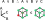
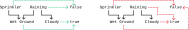
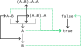
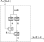
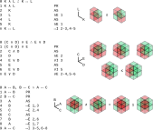
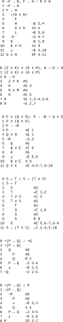
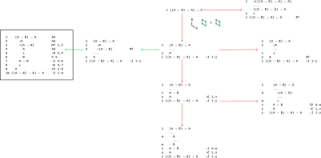
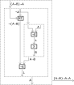
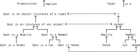

# Logic


## Chp 2: The scope of logic


It may seem like only logicians would ignore truth and focus only on form. When else don't we care about truth, however?

When training a deep learning model, we often start with dummy data and just check that we *can* fit to something (e.g. images from some other dataset). If we can't, then we likely coded something wrong. Sometimes we are just interested in learning a libary (e.g. PyTorch) rather than getting it to do something useful.

In Bayesian statistics, similarly, we generate data from our assumed data-generating distribution and then try to fit our model to it to confirm we can reproduce the model parameters.

In [Chapter 2: The scope of logic](https://forallx.openlogicproject.org/html/Ch2.html), this is put in terms of a "valid" argument: we don't care about truth. Alternatively, you can see this as asking a "what if" question about a world that could have existed (e.g. if Abe Lincoln was from France). You could also see all this as "play" in the sense that it helps you understand other assumptions people have about the world. A kid could learn something about e.g. conjunction introduction on any imaginary world where we hold it to be true.

Do you only care about valid arguments, not sound arguments? Yes, when you're trying to learn the rules of inference. No, when you're trying to get something "done" in some sense (in this case, discovering truth).


## Chp 12: Semantic concepts


How do you read A → B? Not in general, but in a context where it means [Material conditional](https://en.wikipedia.org/wiki/Material_conditional). See [Chapter 12 Semantic concepts § 12.6](https://forallx.openlogicproject.org/html/Ch12.html#S6) for a suggestion to avoid "implies" because of both the causal and historical issues. How about always reading it "backwards" and putting "or not" in the middle? So you'd read "A → B" as "B or not A" in these situations. That makes you read "(A → B) → A" as "A or not (B or not A)" (can't really avoid the parentheses) which makes it rather obvious how it reduces to "A or not B" assuming the law of the excluded middle. You can then read Pierce's law i.e. ((A → B) → A) → A as "A or not (A or not B)" which reduces to the law of the excluded middle (with an "or B" at the end that doesn't hurt anything).

This strategy is similar to always applying [Material implication (rule of inference)](https://en.wikipedia.org/wiki/Material_implication_(rule_of_inference)), but also flipping the disjunction. Reading A → B as "not A or B" is also acceptable, but it seems more intuitive to replace a single symbol (→) with a pair of words than adding two words in different spots. It also avoids the potential misinterpretation of "not A or B" as "not (A or B)" which is something completely different (and you can't express parentheses when you're talking without a lot of extra work).

You could also replace A → B with A ≤ B if you don't mind seeing false as less than true.

Alternatively one could read A → B as "A forces B" (in the sense of turning a light on) which is a bit shorter and read in the right direction, but harder to break down. It may also imply that A is the only forcer of B.

How should one read ⊨? It seems like the best word is "entails" because it's a rather technical term. The author suggests that he may use "implies" to mean entails, but in practice almost never does. It's likely better to never use the word "implies" because of its present ambiguity. In particular, many people would read "A implies B" to mean that A not being true also implies that B is not true (or is at least a clue that indicates it may not be true). There are no clues in this domain; everything is true or false.

Consider the following simple example argument. While A ∨ B entails A ∨ B ∨ C, if you're thinking about the truth tables you'll clearly see the most unambiguous way to explain their relationship is with ≤ rather than → (in English, use "entails" rather than "implies"):





## bussproofs prooftree


See [Supported TeX/LaTeX commands — MathJax 3.2 documentation § Environments](https://docs.mathjax.org/en/latest/input/tex/macros/index.html#environments) for the prooftree environment, and more documentation under [bussproofs — MathJax 3.2 documentation](https://docs.mathjax.org/en/latest/input/tex/extensions/bussproofs.html). At the moment, you can't get this to work. Right click on the following example to get our MathJax version:

$$\require{enclose}
\enclose{circle}{x}
$$

It looks like it's 2.7.9 at the moment. Even [The TeX/LaTeX Extension List — MathJax 3.0 documentation](https://docs.mathjax.org/en/v3.0-latest/input/tex/extensions/) doesn't have bussproofs. It looks like the examples on [Motivating Examples — Jupyter Notebook 7.0.6 documentation](https://jupyter-notebook.readthedocs.io/en/stable/examples/Notebook/Typesetting%20Equations.html) are 3.2.2.


## Monotone valuation functions


When applying inferences to propositions, we effectively expect our valuation function to be monotone. For example, we want the "green" situation/arrows here rather than the red:





When this isn't the case, we have to give something up. It could be that our valuation function is wrong; the data we've collected is wrong (and we need to fix the dashed green/red arrows). It could be that our system for coming up with inferences is wrong (and we need to fix the solid black arrows). In propositional logic we assume that the dashed arrows are always right (even definining them as "right" by removing meaning from the words, e.g. replacing Cloudy with $C$) and do whatever we need to in order to rearrange items on the left to make the function monotone. Humans get to choose what they question, which (among other things) creates politics and filter bubbles.

One solution for the system on the right is to delete the arrow Raining → Wet Ground (perhaps you have a roof or umbrella to cover the ground you're talking about). That is, what you can you do with a contradiction in your system of logic? In almost any system you'll want to rearrange your drawing so Raining is not above Wet Ground. You could put them at the same level ("rank" in graphviz) until you know more.


Consider the following inference system that includes Pierce's law, however. There are three gray arrows on the diagram for the three arrows in Pierce's law, where gray here indicates TBD. The given valuation function is shown as green because it can be made green for some choice of turning arrows on and off. Can you easily see which gray arrows need to be turned black/white?





You can come up with a working inference system based on some valuation function (deciding which arrows on the left side need to be turned on/off), but can you always come up with a green valuation function given arrows that are definitively turned on/off? What makes this question harder to "solve" is its recursive nature; if you only commit to one piece of "data" (e.g. whether a proposition is true or false) and start to check what that implies, you may discover that you need to change your original choice. What if you assign the proposition that is Pierce's law to false to start? Your valuation function now determines the truth value of your propositions, which determines which arrows need to be on/off, which determines whether you valuation function is monotone and therefore needs to be changed.


## Heyting algebra semantics

<!-- #region -->
See [OpenLogic/content/intuitionistic-logic/semantics/introduction.tex (line 45) · OpenLogicProject/OpenLogic](https://github.com/OpenLogicProject/OpenLogic/blob/master/content/intuitionistic-logic/semantics/introduction.tex#L45). This whole chapter is also a great introduction to intuitionistic logic, but notice the BD book hasn't been built in 2 years.

Another way to see this as a function that is written at some point, but that doesn't have any constructions to work on. In the world of programming, this would not compile. In the world of math, however, this isn't unreasonable. Many famous conjectures have had additional work done on them assuming that someday someone will come up with a proof of some of the dependencies of the proof. That is, sometimes mathematicians build $A→B$ without having $A$ yet.

Or consider this function defined in a file by itself:

```python
def add_one(x: Integer):
    x = x + 1
```

Clearly this code only has "potential" without being used. That's not to say it isn't something in itself, however.
<!-- #endregion -->

## Accessible logic


In Kripske semantics we say that a world is "accessible" from another if we feel it's possible to get there from where we are. Is this a statement about the future, or about the past? Likely neither. It seems like our imperfect knowledge of the past makes multiple histories possible given what we're observing, as well. Are we even always more interested in the future than the past? Many problems (e.g. building a map) depend on being able to consider many possible past worlds.

Either way, the word "accessible" often comes up when you're trying to decide what to read on Wikipedia. For example, the article [Heyting algebra](https://en.wikipedia.org/wiki/Heyting_algebra) is long and complicated. Only some sections are "accessible" to your current understanding. You've tried to build git graphs to plan your learning, but is it better to think about this in terms of possible worlds?

One way to read is to only read chapter sections, and consider both what's accessible and what's valuable. If you read only accessible sections, you'll end up following links on Wikipedia from the categorical product to tychoff's theorem to who the current king of England is (it's easy to understand history and politics). If you only read what's valuable to solving your current problem, you may end up spending a long time reading an article and not comprehend anything at the end (or not comprehend anything long term e.g. new math).


## Valid argument


The word "valid" as it is used in logic doesn't really correspond to how we use it in everyday life; see [Validity](https://en.wikipedia.org/wiki/Validity) and [valid](https://en.wiktionary.org/wiki/valid). However, there needs to be some word that separates the truth of individual propositions from how you reason about truth. Is it true that you can reason about truth in this way?

Why not define valid to mean "if all the premises are true, the conclusion is true" rather than "if it is impossible for all the premises to be true and the conclusion false" as in forallx? That is, so that "all premises true" → "conclusion is true"? Perhaps you can define it that way; this produces the conclusion that the argument is valid if you accept the [Material conditional](https://en.wikipedia.org/wiki/Material_conditional). Perhaps this is getting to some comments on the modal logic about "knowing that you know that" which otherwise seem rather crazy. To some extent this is also about "defaults" in the presence of uncertainty: do you conclude that A implies B if you have no evidence that A has led to B (because you have no record of A ever being true)? The material conditional can only be T/F so it must choose either T or F, and someone somewhere seems to have decided that it defaults to T. This seems wrong: from a constructivist perspective we should only accept that something is true if we can prove that it is true. It should have "defaulted" to false. Said another way, absence of evidence (see [Argument from ignorance](https://en.wikipedia.org/wiki/Argument_from_ignorance#Examples)) says nothing about the truth of a matter (see also [Evidence of absence](https://en.wikipedia.org/wiki/Evidence_of_absence), which links to the last article).

What if you saw material implication not as that it's true that A causes B, but that it's possible that A causes B? This feels like going from a strict inequality to a non-strict inequality. Or perhaps as if A is true, then B is possible.

Perhaps an even better way to define this (more generally) is that it is impossible that an increase in X does not lead to an increase in Y. This is effectively what arrows mean on a causal diagram; they indicate that an increase in the source of the arrow leads to an increase in the target of an arrow. In the simple case of T/F, this reduces to the definition of entailment (or material conditional). Because T is as high as you can get, and F is as low as you can get, if you see X equal to T and Y equal to F then clearly no increase in X leads to any increase in Y.

This seems quite similar to an adjoint pair, in that x ≤ y iff f(x) ≤ f(y). An increase (or no change) from x to y must always correspond to an increase (or no change) from f(x) to f(y).

See also [Wason selection task](https://en.wikipedia.org/wiki/Wason_selection_task). In the first example, you can distinguish between the rule being *obeyed* or *causative* relative to being *likely*. If a card shows an even number on one face, is it *likely* the opposite face is blue? In that case, you need to flip all the cards to get more evidence about whether the rule holds. If you flip an odd number and see blue, it may be the case that *all* colored sides are blue. If that's the case, then the rule that there is an even number on one face means the other side is blue isn't really correct: it may be technically true but it's far from the full story (and you could come up with a simpler rule). Why not prefer simpler theories, if you believe in Occam's razor? The existence of the red card excludes the possibility of this rule being true, but many people (experimentally-minded rather than theoretically-minded) will simply start collecting evidence before even thinking about theories.

Another explanation could simply be that in regular English we assume that "if" means "iff" in many cases. See this same point being made in [Chapter 5 Connectives](https://forallx.openlogicproject.org/html/Ch5.html).

If we had simply stopped "constructing" (making statements about truth, such as whether an argument is valid) when we saw a contradiction in our assumptions, then we could have avoided reaching a conclusion that may be "true" in some sense but isn't useful (that the argument is actually valid). That is, the world doesn't have to be valid or invalid: it could have been left neither.

We often feel that we need to organize our notes to remove contradictions. It's not that we're doing this for the sake of avoiding an explosion in conclusions; we're simplying doing it to avoid reaching different but incompatible conclusions in different areas of our notes. We want one, single, complex model. In particular, we want to avoid coming to simple conclusions in some areas because we aren't considering enough possibilities (possible worlds).


## Chp 17: Basic Rules for TFL


### Practice exercises


Part C.


```
0 J → ¬J ∴ ¬J
1 J → ¬J           PR
2   J              AS
3   ¬J             →E 1,2
4   ⊥              ¬E 3,2
5 ¬J               ¬I 2-4
```


```
0 Q → (Q ∧ ¬Q) ∴ ¬Q
1 Q → (Q ∧ ¬Q)        PR
2   Q                 AS
3   Q ∧ ¬Q            →E 1,2
4   ¬Q                ∧E 3
5   ⊥                 ¬E 2,4
6 ¬Q                  ¬I 2-5
```


```
0 A → (B → C) ∴ (A ∧ B) → C
1 A → (B → C)             PR
2   A ∧ B                 AS
3   A                     ∧E 2
4   B                     ∧E 2
5   B → C                 →E 1,3
6   C                     →E 5,4
7 (A ∧ B) → C             →I 2-6
```


Let's take this third example and rewrite it as a [String diagram](https://en.wikipedia.org/wiki/String_diagram). We convert objects (propositions) to wires, and morphisms (inference rules) to boxes:





For this particular example, we can view the same diagram (taking propositions to types per the curry-howard isomorphism) as a description of a function that takes a function of type $A→(B→C)$ and returns a function of type $(A∧B)→C$ (or in the category of sets $(A×B)→C$). That is, this expresses uncurrying.


For the next few examples, we also provide the possible worlds (each cell being a possible world) associated with parts of the proof. These are essentially the same as the truth tables:








Natural deduction in TFL is very much like how you already do proofs. It feels like a geographical search, where you have as "truth" what you are trying to prove, and like a geographical "proof" of how to get from A to B there is often more than one way to do so (but sometimes only one). You could see your intended proof (your goal) as minimizing the loss in machine learning, or maximizing some utility function, but in this case reaching the proof is the end because there's only one thing to show (only one "ground" truth example). In ML you set a bunch of parameters; in this context we fill out a truth table.

Part of the problem is that you can go in circles, i.e. with:

```
A → B
  A
  B
A → B
```

With a natural deduction system, the large number of basic and derived rules give you many directions you can take at any possible point. The less natural a system, the fewer options/choices you have. The advantage to a natural deduction system is that your proofs can be much shorter, and arguably easier to comprehend (as long as you agree with and understand all the additional rules i.e. have them memorized).

You don't look at the proof for the same reason a machine learning model doesn't look at the truth when it's running inference (the term inference now makes a ton of sense, see [Inference](https://en.wikipedia.org/wiki/Inference)). We want to check it comes to the same conclusion (e.g. true or false) about a particular set of premises that we do. If it had the truth as an input, it could just feed that all the way through, from being a premise to being the conclusion.

If proofs are programs, then automated theorem proving is automated program writing.


## Chp 20: Proof-theoretic concepts


Notice how the title of this chapter is symmetric with the title of [Chp 12: Semantic concepts](https://forallx.openlogicproject.org/html/Ch12.html). We'll see in Chp 22 how the "semantic" (truth table) concepts relate to the "syntatic" (proof-theoretic) concepts (e.g. both define a notion of equivalence). For now, ignore how familiar all the language looks.


### Practice exercises


Exercise A2's answer was covered in more detail in 18.6 Indirect proof of excluded middle.


For Exercise A4 we'll try a more systematic answer search. In the following, red arrows to the right indicate searching backwards using IP. Red arrows going down indicate searching backwards using some kind of introduction rule. Green arrows going left indicate searching forwards using some kind of elimination rule.





The same proof as a [String diagram](https://en.wikipedia.org/wiki/String_diagram):





## Propositions from propositions


When you see "if you're in the rain, you're going to get wet" you see A → B with the obvious fill-ins. But why don't you see this as a proposition in itself, that is, a C that can be true or false? You could see it as either adding another object to your preorder of propositions, or you could see it as equivalent to an existing object (equivalent in the sense of iff i.e. an arrow in both directions).


## Chp 22: Sound and complete


See [Chapter 22 Soundness and completeness ‣ Part IV Natural deduction for TFL ‣ forall x: Calgary. An Introduction to Formal Logic‣ Part IV Natural deduction for TFL ‣ forall x: Calgary. An Introduction to Formal Logic](https://forallx.openlogicproject.org/html/Ch22.html) for some suggestions about when to use truth tables vs. logic.

Sound and complete to some degree means you can use both data and logic to solve a problem. Each is better in some situation. For ill-defined problems, it's often to collect a bunch of data and do machine learning (truth tables). For cleaner problems, you can write code.


## Chp 23: Building blocks of FOL


How do you code the "necessary" truths discussed in previous chapters? Let's say you believe it's true that if Jenny is mean, then Jenny will kick the dog. Similarly, you think that if George is mean, then George will kick the dog. It seems like you'd have to codify/model this as two different implications JM → JK and GM → GK. How do you deal with specifying this for all possible people, though? While it's true that JM → JK, you could make it a "necessary truth" by coming up with some rule where XM → XK where X is any person. This way, you don't have to specify so many individual rules. It's only possible to code something like this once you move to FOL (or a programming language).


## Chp 24: Sentences with one quantifier


See [Syllogism § Types](https://en.wikipedia.org/wiki/Syllogism#Types) for more on syllogisms and these examples.


## Why past possible worlds?


If you think of the world like a computer i.e. in a deterministic way, then it's hard to fathom the value in past possible worlds. How would we get to a point where Abraham Lincoln was born in France? It seems silly; what would you have to change farther back in the past to make that happen? Convince his parents to move?

One possible resolution is that we need past possible worlds because really have imperfect information about the past, just like we have imperfect information about the future. How do you know that Abraham Lincoln wasn't born in France? You think it quite unlikely that historians and the US government would lie about that, but it's possible.

Another possible resolution is that we need to accept that those living in the past didn't have perfect information about what their future would be. Did they make the best decision based on the information that was available to them? That's often a more important question than how history actually turned out; you can only go on the information you have. Leaders are often criticized despite the fact that they made the best decision they could given the information they had.


## Standard compression


TFL is obviously a lossy compression. If you're going to use it, however, then you need a standard way to compress into it. That is, you essentially need a standard functor from natural language sentences to TFL, which will necessarily not be injective.

In Chp5 of forallx you can see many examples of compressions you may not agree with, but they are standard in the context of this text. The author is doing his best given the system.

For example, you code "Jean is in France only if Jean is in Paris." to F → P. If you switch this to "Jean is in Paris only if Jean is in France." it'd be coded P → F (although P → F seems true, the coding still seems wrong). Really, you'd like to use the biconditional here, if anything. Is the speaker saying that Jean may or may not have had a layover in France, but if he did then it was in Paris? You almost want to refuse to encode this, but it might work in some cases. It's an example of ambiguity in language where you really need to ask the original speaker what they meant (ask for more context).

Another nasty one (see [Necessity and sufficiency](https://en.wikipedia.org/wiki/Necessity_and_sufficiency)) is all of these being coded to the same thing, namely P → F:
- For Jean to be in Paris, it is necessary that Jean be in France.
- It is a necessary condition on Jean’s being in Paris that she be in France.
- For Jean to be in France, it is sufficient that Jean be in Paris.
- It is a sufficient condition on Jean’s being in France that she be in Paris.

Just as we have nasty standards/defaults for the material conditional when the antecedent is false, we have to live with some of these compression standards if we're using TFL.


## Law of exclude middle


Is like arguing with someone and they find some small contradiction in something you said once. They use that to conclude everything you say is wrong and their conclusion is right. Or perhaps this is closer to the principle of explosion?

Either way, it feels similar to exceptions in programming languages. You "explode" when things don't logically fit together (give up on any kind of inference).


## One and only one


See [Chapter 28 Definite descriptions ‣ forall x: Calgary](https://forallx.openlogicproject.org/html/Ch28.html) for Russell's analysis of what it means for something to be unique. See [Glossary of mathematical jargon § Proof terminology](https://en.wikipedia.org/wiki/Glossary_of_mathematical_jargon#Proof_terminology) for the related jargon, which points to [Uniqueness quantification](https://en.wikipedia.org/wiki/Uniqueness_quantification).

When you move to equivalence classes you should be thinking in terms of [Essentially unique](https://en.wikipedia.org/wiki/Essentially_unique) instead. Sometimes we don't care about the differences between all the objects in an equivalence class.


## Metalanguage


See [Chapter 8 Use and mention ‣ Part II Truth-functional logic ‣ forall x: Calgary](https://forallx.openlogicproject.org/html/Ch8.html) for the object-language and meta-language distinction also mentioned in [implication in nLab](https://ncatlab.org/nlab/show/implication). See also [Metalogic](https://en.wikipedia.org/wiki/Metalogic), which points to [Use–mention distinction](https://en.wikipedia.org/wiki/Use%E2%80%93mention_distinction).


## Necessary and sufficient


See [Glossary of mathematical jargon § Proof terminology](https://en.wikipedia.org/wiki/Glossary_of_mathematical_jargon#Proof_terminology), which points to [Necessity and sufficiency](https://en.wikipedia.org/wiki/Necessity_and_sufficiency). Although this is taken to mean iff, you should also be skeptical of [If and only if](https://en.wikipedia.org/wiki/If_and_only_if), being based on the [Material conditional](https://en.wikipedia.org/wiki/Material_conditional).

If you're looking at [Modal logic](https://en.wikipedia.org/wiki/Modal_logic), you'll see it uses the word "necessity" in essentially a completely different way.


## ForAllX improvements


In section 12.5, change:

> This says that there is no valuation which makes all the sentences mentioned on the left side of ⊨ true whilst making 𝒞 false.

To:

> This says that there is no valuation which makes all the sentences mentioned on the left side of ⊨ true whilst making all the sentences on the right side false.

This would make it easier to understand how 𝒜 ⊨ is another way of saying that 𝒜 is a contradiction.

The A in the first AS in this section should probably be a script A:
- https://forallx.openlogicproject.org/html/Ch18.html#S5

In https://forallx.openlogicproject.org/html/Ch23.html#S2 it seems unnecessary to include the following sentence:

> (Equally, there are at least two people with the name ‘P. D. Magnus’.)

Most readers will already be familiar with the fact that many full names are reused.


## Propositions as types


One of the primary insights that came out of the [Curry–Howard correspondence](https://en.wikipedia.org/wiki/Curry%E2%80%93Howard_correspondence) is the analogy between propositions and types. Here's an example isomorphism, originating from the example type hierarchy on the right:





When we expand to thinking in terms of the Curry–Howard–Lambek correspondence/isomorphism (see [Curry–Howard correspondence § Curry–Howard–Lambek correspondence](https://en.wikipedia.org/wiki/Curry%E2%80%93Howard_correspondence#Curry%E2%80%93Howard%E2%80%93Lambek_correspondence)), we interpret category-theoretic objects as types or propositions. From this perspective an "Animal" is an object in a category, and the isomorphism between the categories is (partially) shown as the dashed arrows.


## Turnstile symbol ⊢


Notice this symbol is used for both syntactic consequence (see [Logical consequence § Syntactic consequence](https://en.wikipedia.org/wiki/Logical_consequence#Syntactic_consequence)) and [Adjoint functors](https://en.wikipedia.org/wiki/Adjoint_functors). Is this just a coincidence? It seems likely that syntactic consequence is part of an adjunction (based on the syntax alone, it's the right adjoint).

Some evidence for this is that the propositions we can derive as being true given some propositions that we assume are generally not speaking not equivalent to our assumed propositions. Since the left side of the syntactic consequence operator takes a set of propositions, this may be the upper closure operation $A^{↑X}$ defined in [Upper set](https://en.wikipedia.org/wiki/Upper_set).
