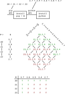
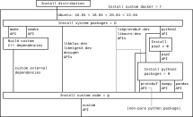

---
jupytext:
  text_representation:
    extension: .md
    format_name: myst
    format_version: 0.13
    jupytext_version: 1.14.1
kernelspec:
  display_name: Python 3 (ipykernel)
  language: python
  name: python3
---

# Unorganized

Let's say you have an interruption Y come in (maybe a thought) that is slightly more important than what you are doing X, but requires much less working memory and therefore will almost surely be possible later. If you take away from your time in focused work (something that requires a lot of working memory) to do this task then you will likely not accomplish X by the end of e.g. your timebox. This creates a situation where you are doing something that is less important than your highest-priority task, but overall lets you get more done. You're trading off thoroughput (i.e. learning) for responsiveness. It seems like this is why you need unorganized notes. All learning makes this tradeoff; think of someone going to college rather than starting to work at a factory.

If you aren't addressing your unorganized notes, you aren't doing important work. If you aren't producing unorganized notes, then you aren't efficiently solving your problems.

Insisting on having no unorganized notes can also be shallow. You can force no `unorganized.md` to exist, but that only forces one level of organization. When will you structure second-level concepts? Even worse, some files can become dumping grounds for nearly unorganized notes. It may even be better to wait to organize (compress) your observations, at least to some extent, until you get to a point where you can compress them all at once in focused work (unless the compression is clearly not lossy i.e. no loss of generality).

Generally speaking, unorganized content is an artifact of prioritization. As you work you should constantly be pushing the most promising ideas you have to the bottom of a short list of things you are working on. Work on these first, to make forward progress on the topic you are focused on (using all your working memory on your primary task). When you're done, everything less important than your primary task will be left in your wake higher in your document. It's not that these are less important at a global level than your primary task; they may even be more important areas to explore (you don't know). To have spent time on them as you encountered them, however, would prevent you from making deep forward progress on what you previously believed (with a global view) was most important and you can't say definitely that your new areas to explore are the most globally important thing to do until you return to a global view.

+++

## Z-level prioritization

Organizing notes should be first and foremost about prioritization. Visually, you could think about it similarly to how you see Z levels in a drawing. It should be OK to push things all the way down behind everything you're looking at now as long as you know that you know that you're going to be able to remember to look it up later (e.g. friends-and-relations.svg). Ideally, everything that you do supports something that is "visible" to you. If it doesn't support something visible, then perhaps you shouldn't be doing it. If it isn't a significant part of supporting the visible things, then it's less important to work on. Should you set priorities via a picture of disjoint sets of what you care about in your life? Perhaps you could use this to learn layers in Inkscape. It seems like people would dominate the highest levels, then technology to support people at lower levels.

You like how this approach is similar to the concept of compression. At work, you'd make the "visible" elements things like F1 score. The causal logic is then from the back to the front of the image. You also like how this lets you take advantage of three dimensions (at least think in it) when typically Inkscape is limited to two. You also like how this focuses your "attention" as in attention mechanisms on the most important things, with exogeneous orienting. You've already been thinking to require a time axis on all causal diagrams (making it explicit so you assign some units/scale to it and label it for others). Of course, you could also make the time axis in the Y direction (vertical) and give more Z levels to more important goals (but this seems less natural). Your "improve improve" tasks would also naturally go to deeper Z levels.

Ironicallly, you may want to save the time dimension into Z-levels (or layers) so that if you ever want to create a visualization of your layers as a GIF (exporting as batch) the time dimension in your GIF will match the time dimension you were thinking about.

Should this view reflect how you spend your time? No, because many things are important to you but aren't going to take your time. Your child's health may be important to you, but you have others to help with it (including the child, eventually) and you're not an expert in healthcare. That is, if you're not the best at something but it's important to you, outsource it. Said another way, some things are important, but that doesn't mean you can control them (or choose to control them).

You also like how this system makes your values theoretically measurable (in terms of e.g. area) but also clearly not particularly objective (so you don't agonize over the numbers). It also makes your values relative, which should really help you think about them.


No design strategy is perfect, and unfortunately engineers often like to approach design in different ways (e.g. a codesign diagram vs. a gantt chart). It seems like the most critical part of designing a design approach should be making what's most valuable most focal, however.

Nearly the same thing can be done with text, by making plain text into links. Let's say you had a link from one document A, to another B, to another C. If you move the link from B to C to the article A by e.g. mentioning the word somewhere (or even just adding the link to some related word) you're making the lower-level content more focal. Perhaps you could use links as a simpler form of the z-level based prioritization.

Another way we do the same thing with text is by pushing language into version control. When you are reviewing changes in `git diff` you can `git add` and commit anything you no longer want to be focal.

Another way to do the same is simply having a backlog, putting what you think should be most important at the top.

+++

## Improve share notes

You should see your notes as a set, partitioned between public/private/work. The partitioning happens on disk, in files. Get that Venn diagram right. You have notes that are shared between work/private that e.g. need to have their own place within your master repo. Your drawing of this division should include the paths you've allocated for these partitions.


+++ {"tags": []}

## Rclone

Why not `cp`? You'll often want to confirm checksums to avoid e.g. corrupt PNG files that kill training (on questionable spinning disks or SSDs). Both `rsync` and `rclone` can do this. You would much rather wait for a slightly longer copy than have a corrupt file on your disk. Even if you totally trust the disks on your local filesystems, let's say you need your disk for something besides a copy/move (like training). You could stop the move or copy, and restart it later. There's a cost to this, of course, but it's not terrible. You also get progress indication, and better/clearer logging (something rather than nothing). You could take over the half-finished `cp` command someone else started and move instead. You can also control whether large/small files get moved first for performance optimization.

It doesn't really seem like there's much a reason to use `rsync` either. See [Difference between Rclone and Rsync when syncing to the Local Filesystem? - Help and Support - rclone forum](https://forum.rclone.org/t/difference-between-rclone-and-rsync-when-syncing-to-the-local-filesystem/3088/4). Why? You can use it for transfer both to and from remote locations (AWS) as well as between local disks. That is, one interface for everything.

Why not use the AWS CLI? `rclone` is an open-source tool while the AWS CLI is tied to Amazon (maybe not the code, but the service behind it). The AWS CLI is also awful to install; there doesn't seem to be a good way. You also get much better progress indication, less verbose/clearer logging, better filtering, and performance optimization (using e.g. all of your NIC).

Even if you don't use `--max-backlog=-1` with rclone to get overall progress, it shows you MiB/s. Usually this is enough for you to project when you'll be done - you know how many TB you need to move.

See also your comments in learn-unix-utilities.md about `cp -r` confusion. See also [ubuntu - How to copy-merge two directories? - Unix & Linux Stack Exchange](https://unix.stackexchange.com/questions/149965/how-to-copy-merge-two-directories/149986#149986). You aliased `rsync` to `ry`, should you alias `rclone` to `rc`? Or create a `cp` alias that uses `rclone`?

+++ {"tags": []}

## Review code

Linting standards create another barrier to entry. You couldn't do a wiki like edit. But don't lint markdown?

How do you feel about approvals on code reviews in general? It's another barrier to entry.

Part of the power of “no” is saying "no" to code reviews. It’s better to say no than nothing. If it doesn’t break anything, then you can treat the content as “don’t care” in your mind.

+++

## Memorization vs. working

Are you looking to memorize content, or just solve a problem? If it's the latter then you can open up a bunch of tabs and just reference them. If you want to remember/memorize something then you should limit yourself to 5-10 tabs, forcing yourself to remember what you can't pull up as easily.

+++

## Prefer a forking workflow?

New developers don't have to sit around for days waiting for access before they can write code. I've had to not only wait for access, but spend time bothering an admin to get access faster (which is work in itself).

We ensure our build system works even if a repo is moved/renamed.

Reduces clutter in the primary repository:
- https://stackoverflow.com/questions/3611256

One downside to a forking working flow is that when you hit "fork" on a GitLab repo you get a duplicate of all the branches. You really want to just create a blank project, and submit branches as you create them.

+++

## Classifiers as organizers

A classifier (see [Statistical classification](https://en.wikipedia.org/wiki/Statistical_classification)) induces a partition on a set. Is it the individual classification, or the organization of examples into partitions that really adds value for humans? Knowing a stop sign is coming up wouldn't be useful if you didn't know other kinds of signs that are not stop signs.

We could really go one step beyond classification into non-overlapping sets to provide an order on these sets (e.g. a preorder). Organization into trees (think of common dictionary data structures) is in general an efficient way to retrieve information, both mentally and in a computer. It'd be much easier to describe to someone all the kinds of signs in the world with a tree than a list. See [Categorization](https://en.wikipedia.org/wiki/Categorization) (a synonym for classification) for some thoughts on the psychological aspects involved; is this why category theory is so fundamental to mathematics as well? Are adjectives fundamental to how we think?

+++ {"tags": []}

## Maintain light git history

Having a single git repo with many working trees is essentially the same as a single dvc cache. Until looking up objects gets slow, there's really not a downside to it.

You could pull in a repo without all its history (thinking of HDMA) by stripping history (see [How to Use Git Shallow Clone to Improve Performance | Perforce](https://www.perforce.com/blog/vcs/git-beyond-basics-using-shallow-clones)) and pushing that to some backup location. You can pull that into history, but on the branch that you have that is the original repo you can use a remote that is the original repo with all its history. In other words, you really like the idea of subtree merge (which effectively does this, but with one commit).

+++

## Skipping questions

Why do we skip questions, to come back to them later? Even if we've read all the prerequisites that we need to answer the question, we may not have enough of them memorized to be able to construct the answer using both our memorized logic and working memory. By reading and answering beyond the question, we'll have more time to memorize more of the prerequisities in the context of new problems that are more motivating and novel than the question we've been re-reading.

+++

## Quote Wikipedia

Rather than trying to freeze links to Wikipedia, copy/paste (the same way you would copy/paste code) the content you want into your own material with a quote. This is equivalent to forking the content in a more limited way; you likely didn't read the whole article anyways (and should say so if you did). You can also do this with more than Wikipedia as well; you never read a whole article anywhere on the internet.

Should you have tasks to understand Wikipedia with other articles/content as your alternatives? Rather than the reverse. You'd perhaps only end up reading part of the other content, which could be hard (Wikipedia is better as a reference i.e. for one article at a time).

Don't be discouraged if you simply copy/paste from Wikipedia and get what looks like a mess. If you have math anywhere in what you copy/pasted, you'll have gotten both a Unicode version of it and a Wikipedia version of it. Just delete the Wikipedia version, and you'll have something you can put in any document.

+++ {"tags": []}

## Manual dependency resolution

Dependency resolution can be presented in the language of a codesign problem. Consider the feasibility relation Φ documented in [Changelog - pip documentation v23.0.1](https://pip.pypa.io/en/stable/news/):



If you know what APIs your code requires, you can enter them as matrices and see what is feasible (overall) as yet another matrix. Is it feasible, for example, to upgrade from 16.04 to 18.04? This is a function of the feasability matrices Ω, Θ, and ψ in:



In the feasibility matrix Γ that includes all this information, you would simply look for any entries where the operating system is 18.04 and the value is "true" and then configure everything else to hit one of these goals.

+++

Is your goal to simply update to the latest version of Ubuntu? More often, you actually want something else. Perhaps you want to be working with a relatively recent version of python3 (e.g. the default in 20.04). If you set the wrong goal, you may end up working with Ubuntu 22.04 and python2! Perhaps this is what you want, though, so that when you do upgrade to python3 you can do it with the latest version. The risk here is that there is often an upgrade path from e.g. 2.7 to 3.x that is only supported up to some predetermined x. You could also simply be interested in other system packages like tmux, vim, ctags, etc.

Once you have the general layout of the problem, you can go through all the system and python packages you use and get a decent understanding of Ω and Θ by constructing them assuming you only install one package.

For example, for Ubuntu feasability matrices use [Ubuntu Packages Search](https://packages.ubuntu.com/) with the distribution set to "any" in the search. Notice the comment on that page:

> There are shortcuts for some searches available:
>
>   - http://packages.ubuntu.com/name for the search on package names.
>   - http://packages.ubuntu.com/src:name for the search on source package names.

So for cmake, referencing:
- http://packages.ubuntu.com/cmake

Based on [packaging - Is there a tool/website to compare package status in different Linux distributions?](https://unix.stackexchange.com/questions/62355), another option is:

```
$ whohas --shallow --strict -d ubuntu cmake
Ubuntu      cmake                                  3.10.2-1ubuntu2
Ubuntu      cmake                                  3.10.2-1ubuntu2.18
Ubuntu      cmake                                  3.16.3-1ubuntu1
Ubuntu      cmake                                  3.16.3-1ubuntu1.20
Ubuntu      cmake                                  3.22.1-1ubuntu1
Ubuntu      cmake                                  3.22.1-1ubuntu1.22
Ubuntu      cmake                                  3.24.2-1ubuntu1
Ubuntu      cmake                                  3.25.1-1
```

Clearly there's room to automate here, by running this command on the same list of packages that you pass to `apt`. It looks like `whohas` is available going back to 16.04. If you run this immediately after running apt, in your logs you'll have all this information printed out immediately after `apt` prints the version numbers it did end up installing.

We have Ω:

|   Ω    | 18.04 | 16.04 |
|   -    |   -   |   -   |
| 3.5.1  |   T   |   T   |
| 3.10.2 |   T   |   F   |

Notice we assume we can downgrade to 3.5.1 on 18.04, which comes with assuming preorders. Although this isn't ideal, most of the time we are struggling to only upgrade our custom code and so this is not an issue (we are merely trying to enumerate everything we need to do to upgrade).

Based on an understanding of your own code, which in this case we assume will work with both versions, we construct ψ:

|   ψ   | 3.10.2 | 3.5.2 |
|   -   |    -   |   -   |
| 1.0.0 |    T   |   T   |
| 1.0.1 |    T   |   T   |

Then we construct Γ = Ω⨟ψ:

|   ψ   | 18.04 | 16.04 |
|   -   |   -   |   -   |
| 1.0.0 |   T   |   T   |
| 1.0.1 |   T   |   T   |

Assuming your current version is 1.0.0 and your new version will be 1.0.1 (a cmake upgrade should make no breaking changes to your API).

+++

Packages that are shared between python and C++ can be trickier. See [How do I tell if a PyPI package is pure python or not?](https://stackoverflow.com/questions/71550167) for the ambiguity that can exist. To get a list of python packages, use a URL like:
- https://pypi.org/project/protobuf/#history

Or on the command line, based on [Python and pip, list all versions of a package that's available?](https://stackoverflow.com/questions/4888027):

```
pip install --use-deprecated=legacy-resolver protobuf==
```

In this case we see `protobuf: 2 < 3 < 4`. But the native package only has version 3:

```
$ whohas --shallow --strict -d ubuntu libprotobuf-dev
Ubuntu      libprotobuf-dev                        3.0.0-9.1ubuntu1
Ubuntu      libprotobuf-dev                        3.6.1.3-2ubuntu5
Ubuntu      libprotobuf-dev                        3.12.4-1ubuntu7
Ubuntu      libprotobuf-dev                        3.12.4-1ubuntu7
Ubuntu      libprotobuf-dev                        3.21.12-1ubuntu6
```

If a project is hosted in GitHub, use the general URL form:
- https://github.com/protocolbuffers/protobuf/releases

The full story can be found from links there:
- [Changes made on May 6, 2022 | Protocol Buffers Documentation](https://protobuf.dev/news/2022-05-06/)

This kind of digging may also reveal a [Migration Guide](https://protobuf.dev/programming-guides/migration/). Another advantage of reviewing all your package dependencies is helping make you aware of what code you could look to in order to solve your problems (by using packages you already have installed).

Where do you document your code's feasability matrix ψ? If you're building a python package or deb, there should be a place to record this information so dependency resolvers like pip and apt can use them to make decisions when you are installing your code alongside other packages.

Another minor advantage to this is you can install your package elsewhere. It may often be fine to copy the source code you need into multiple docker images that require it, but this is a form of duplication as long as you need to copy the code in a particular way. In some sense, you're inventing your own packaging system in the form of a simple tar and copy/paste to paths that you select.

There will also always be some code in your development environment that differs from that of others (e.g. ctags, vim). If you must install these in a new stage of the Dockerfile then you're always going to be maintaining a fork of the original repository. Of course, this may be necessary to edit the code anyways.

Consider other strategies like docker that prefer space consumption to coupling. For example, building binaries and copying them as you can do for native C++ and golang code. For example, with bazelisk you should end up with a binary in a predetermined location (see [bazelbuild/bazelisk: Installation](https://github.com/bazelbuild/bazelisk#installation)). Does this install work even on 16.04? Replace scons. But, no code has no dependencies. Do you depend on musl or glibc?

When you run into a broken build, you have two options: improve your feasibility matrix or pin dependencies. Which one is easier? Once you know what dependencies you *could* pin to fix the issue, try to make that change and see what happens. After you kick off that potentially long build, check if the issue was reported in the release notes for the upgrade that you unintentionally did. If it was then see if there is anything else other than e.g. a name change to an API involved. Don't start on a TF1 to TF2 sized upgrade, for example, but also don't pin something that's easy to fix and could be fixed while you're looking at the code anyways (the release notes will tell you how much you have to do).

By default version numbers look linear, like a linear order. Once you introduce parallel builds, however, then you can end up with a preorder. For example, you may want to experiment with an Ubuntu18 build while you're still mostly working with Ubuntu16. You could do this with separate SHA and the same version numbers, but that doesn't communicate what you think will work and what you think is better in the version numbering. Version numbers don't have to be strictly a linear order, though. You can leave the Ubuntu16 builds on e.g. the 2.x path and the Ubuntu18 builds on the 3.x path. You communicate both what you think is better (3 > 2) but you also let users continue on the linear 2.x build (including yourself, if the Ubuntu18 build never works).

Said another way, a major version upgrade is more of an "opinion" than a minor version upgrade. There's really no required relationship between major versions. Who moved from TF1 to TF2 rather than to PyTorch? In that case, the "linear" order is more like TF1 < TF2 < PyTorch, or if you're at Google then TF1 < PyTorch < TF2, or perhaps this is a preorder with TF1 < PyTorch and TF1 < TF2. Many people never upgraded from Java8 to Java 9, 10, 11, etc. Are YOLOv4 and YOLOv5 really successors to the original?

This is all related to building consensus. Once you have consensus (e.g. everyone using your product) you really don't want to lose it by losing backwards compatibility. If you only assigned SHA to all your releases, then no one would have to argue about which is better (the SHA are effectively all separate version numbers). The advantage of consensus, however, is that your consumers get an understanding of what you think is better and where the future is. If they see minor versions update, they know they *should* be able to get features nearly for free. You don't like automatically assigning SHA to builds because the namespace blows up, and you waste a lot of disk space (e.g. in artifactory, or s3) as you iterate on a non-functioning package (not even good in the eyes of the one person working on it). So if you're assigning names manually anyways, they should probably be semantic (like version numbers, or a branch name). If you really want to insist on no opinion then you can *manually* assign a SHA.

Using the major version to indicate breaking changes means that it's actually not the case that 1.0 ≤ 2.0; the new major version number is not going to support your code. Again, this breaks the monotone assumption and essentially creates "islands" (optimization peaks) that will build.

There's really a close relationship between updating dependencies and retraining a network. Both are risky, because you're never going to understand all the details of the upgrade you're doing and the risk it involves. See all your dependencies as weights: if you believe something is broken then you're going to have to look into all of them in detail. If you *believe* everything is OK though, then accept the risk and keep moving.

Is the ultimate problem that you need someone to have ownership of the *code* rather than just a team? Managers "own" a team (people) but not code, and hence have no interest in keeping code up to date in terms of dependencies.

If managers are upset that you did an upgrade, tell them exactly the conflict of interest involved: they don't care about my needs, the tools that I need to get a job done. You can also say that someone is excessively risk-averse (afraid of change).

Running apt is like running a function with only side effects. Really, it should return the package you're installing as a deb or tar file including version information, etc.

When you go from thinking about objects as morphisms, you're going from thinking about code as "packages" to executables. You can draw a wiring diagram in **Set** where the wires are e.g. packages, or where the wires are what you "really" care about (e.g. a directory of AMA files). Should you see this as a comma category, or as higher level cateogry theory?

A Makefile documents a DAG, but how do you expect parts of it? To execute an upper set, you can "touch" a file and then run the "all" target. To execute a lower set, you simply provide the name of the target at the top of the set. To execute an arbitrary part of the DAG, you can touch the bottom of what you want to run and then run make on the top of what you want to make. It doesn't really seem like there'd be a simpler way to specify what you want. Unfortunately this may execute parts of the DAG you aren't interested in, and you can only partially get around this by running many lower targets building up to the target you care about. To do the minimal work, you'd have to call all the functions that the targets would otherwise call, individually (a good argument for enforcing that Makefiles only make one-line calls to scripts).

A docker image that takes a "cmd" as a parameter is a lot like an HTTP service. The CMD is whatever part of the REST API you are using. The return value is trickier; are you returning files? If so you should return the path somehow. In HTTPs systems you would get an actual response.

+++

The `dvc` tool does support 18:04:

```
apt update && apt install python3 python3-pip -y && python3 -m pip install --upgrade "pip<21.0" && python3 -m pip install dvc[s3]
```

The `dvc` tool does not support 16.04:

```bash
$ apt update && apt install python3 python3-pip -y && python3 -m pip install --upgrade "pip<21.0" && python3 -m pip install --upgrade setuptools && python3 -m pip install dvc[s3]
...
Collecting flufl.lock>=3.2
  Downloading flufl.lock-4.0.tar.gz (23 kB)
    ERROR: Command errored out with exit status 1:
     command: /usr/bin/python3 -c 'import sys, setuptools, tokenize; sys.argv[0] = '"'"'/tmp/pip-install-x9nl1t14/flufl-lock_6627e4ef6c0f459b93ebb455d4edc7b8/setup.py'"'"'; __file__='"'"'/tmp/pip-install-x9nl1t14/flufl-lock_6627e4ef6c0f459b93ebb455d4edc7b8/setup.py'"'"';f=getattr(tokenize, '"'"'open'"'"', open)(__file__);code=f.read().replace('"'"'\r\n'"'"', '"'"'\n'"'"');f.close();exec(compile(code, __file__, '"'"'exec'"'"'))' egg_info --egg-base /tmp/pip-pip-egg-info-7x96q495
         cwd: /tmp/pip-install-x9nl1t14/flufl-lock_6627e4ef6c0f459b93ebb455d4edc7b8/
    Complete output (1 lines):
    Python 3.6.0 or better is required
    ----------------------------------------
...
```

Until you can get to 18.04, you can use rclone as a replacement. It will require manually uploading artifacts you generate, essentially adding the extra work of needing to come up with names for all your artifacts. It will also lead to more duplication of data in s3 (which dvc would otherwise handle with its internal SHA) and less efficient caching on your local machine (for the same reasons).

This approach might be better for the future though, only because outside of docker (where you need to pull docker images you saved with `docker save`) you may not want to need to install python3. It's much easier to install a binary in e.g. alpine linux. But, you've already installed dvc in alpine linux in the past.

Does the fact that you need to install dvc outside of docker anyways (in order to pull docker images) imply you shouldn't install it inside?

+++

## Prefer fact to answer

Rather than "q-" and "a-" should you think in terms of "q-" and "f-" where f stands for fact? You like how this contrasts with counterfactual. It's also a fact that "Son child Dad" not so much an answer (the fact can exist without someone asking the question). You can also state the same fact in the opposite way with "Dad parent Son" without regard to any question. It also makes it clear you rely on these "facts" being absolutely true, with no uncertainty. This is related to your recent approach where many experiments (facts) are required to answer a question more confidently (never completely, if the question is large at all). That is, you can really only answer really specific questions fully confidently. See:
- https://en.wikipedia.org/wiki/Fact
- https://en.wikipedia.org/wiki/Question_(disambiguation)
- https://en.wikipedia.org/wiki/Answer

Perhaps you can also get more specific with question, perhaps only allowing why questions (why-):
- https://en.wikipedia.org/wiki/Why

+++

## Short action graph

Part of the struggle with an action graph (git-like graph) is that if you're working iteratively, it's usually small and short. That is, you shouldn't spend too much time in planning, which is scheduling. As long as you know where you "are" at the moment, then an iterative approach can work well.

Perhaps analysis paralysis happens precisely because it's at the border of action and planning, a strange place for our thought processes.

You should have only "actionable" items on your graph, that is, things don't take 20 years (though this depends on the circumstance). The shorter your items, the less likely you'll need to reorganize the chart in a major way.

+++

## Why close windows?

Perhaps it's obvious, but the more tmux windows you have, the harder it is to find what you need. If you've e.g. opened `.aws/credentials` in a tab somewhere, and then need to edit it again much later, it can take a long time to find the tab you have open in again.

+++

## Books

When you're reading a book, don't commit to finishing a whole section before publishing. In a traditional classroom this is how we're taught; you must finish the whole assignment before you turn it in. This approach is not incremental, and just like publishing changes to software you shouldn't publish changes to the book (which questions essentially are proposing) in huge chunks.

We use the term "bug" for two different concepts: when code doesn't act as we desire, and when code doesn't act in a way that we understand. Naturally these are often conflated, since we would like to understand. If you see a book as something you are trying to understand, then you can see any questions that you can't answer as bugs (in the second sense). Your code (mental model) "crashes" when it tries to evaluate them, perhaps because you are only missing dependencies in memory. How do you fix bugs? With many eyes. So to answer questions you are struggling with you should come back to them on different days, when you're thinking differently. To get "stuck" on a question is to read it over and over without effectively making your "eyes" different by doing something else that is still related (like looking forward in the book). It's critical to be able to only partially release your answered questions, leaving some undone (in "unorganized" notes). As long as you're still fixing the shallow bugs in the same area where the hard bugs are, you should be getting closer to fixing the hard ones.

A statement that you don't understand in a book is like data (the result of running e.g. an experiment) that you don't understand when writing code. You have to explore the code, or the earlier parts of the book, or find something that the author didn't explicitly provide in alternative material (because books are not code), to understand the data.

Should you take your potential errata and only post them to the author's Google Doc? If you were a student, you would ask the teacher a question about what looks wrong. The same action in a distributed internet environment is probably to ask the question on an SO site. It's not an errata entry until someone else confirms (unless it's really clear) and it's not likely the author will respond. Ideally the author would be able to answer all your questions, but you don't want to pay for that. That is, ask a friendly neighborhood mathematician. Don't wait until you're done to ask.

How do you hide answer cells? It seems like there is no good solution now:
- [Exercise cells · Issue #455 · executablebooks/jupyter-book](https://github.com/executablebooks/jupyter-book/issues/455)
- [Adding directives for "question and answer" blocks · Issue #536 · executablebooks/jupyter-book](https://github.com/executablebooks/jupyter-book/issues/536)

Why look at a book's answers? Don't try to pretend that your answers are independent of the author's answers; clearly you're reading the text and using all his assumptions and language. In answering the question, to some extent you are *only* verifying that the text has all the prerequisites to construct the answer.

+++

## Organize notes to sort dependencies

You often can't decide if e.g. one Wikipedia article is a dependency of another, or vice versa (See also, vs. read something else first). Similarly, you can't make all links in one direction among all your own articles easily (without a *lot* of organization).

This is likely because there are more than two ways to understand something. You can understand via examples, that is by understanding a bunch of examples and then generalizing to something they share in common. You can also understand via construction, that is, by taking logical constructs and putting them together to build new logical constructs. The latter method is about getting your dependencies straight. The former doesn't get you to the "bottom" of a subject, even though it will likely give you a working understanding of the concept. An example of the former is when you read something in multiple places on Wikipedia and then start to suddenly assume that it's true or that you understand it. Understanding by example is not building a deep mental network; machines understand by example.

For example, while reading the article [Ordinal numbers](https://en.wikipedia.org/wiki/Ordinal_number), you may read a section that says that assuming a well-ordered set is the same as assuming the axiom of choice. After following a few more links, you may read the same in [Well-ordering theorem](https://en.wikipedia.org/wiki/Well-ordering_theorem). Reading this in two places is not equivalent to reading the section in [Well-ordering theorem](https://en.wikipedia.org/wiki/Well-ordering_theorem) explaining how they are essentially the same (isomorphic, or ≅, thinking in terms of a preorder of dependencies). In fact, you haven't understood how they are the same. It may be that everyone is saying it, but that doesn't mean you understand the isomorphism.

Learning by example should generally assist you in learning the causal or logical structure, not be the method of definition. You can define what a "big" or "small" dog is by example; this is necessary because the concepts are ultimately fuzzily defined.

When you organize your notes, you essentially sort out all these dependencies. You establish a new "bottom" to your understanding (hopefully making it lower, simpler) making your notes into a new pedagogical tool most useful to yourself. Imagine that you were to organize all your links in your articles in one direction; this would be the equivalent of writing a book where the readers could always start on earlier chapters. In fact this is what you expect from any book that you consume; you expected to be able to follow SSC in a linear order. You may end up with a preorder/poset rather than a loset in the end, but that's better than having cycles. When you allow cycles (as on Wikipedia), your "users" don't know when to try to understand by following links or reading what they can already see. You like how this lets readers come to the book with their own motivations.

+++ {"tags": []}

## Fix slow build

Prefer to local nginx server because it's faster, and encourages you to change your code to make it faster:
- file:///home/vandebun/source/personal-notes/bazel-bin/jb/extract_build_book/tmp/_build/html/notes/about.html

Of course you'll always have a slow build because you need to convert a docker image to the OCI format, then back to a docker image to do docker_run_and_commit. This really slow feedback is bad for publishing. When you're trying to organize your notes in a way that involves renames and riskier changes, this drastically slows down progress. It has been especially frustrating today when you’re trying to clean up the JB cache after some renames. You’re not going to reorganize your notes unless it’s fast to do so.

This also has some nasty side effects when you're doing straightforward work. Even if you don't make any mistakes, while the build is running you have to make new comments in either a Google Doc or in local files that you then may have to undo or put in a separate commit if you do need to make any minor fixups.

BTW, to fix a broken jb build (because of renames) you have to (1) pull the latest jupyter_cache directory (and database) into your local copy of the repo (1) delete the entries from 2 tables in the SQL database and (3) as you get “KeyError: 'Cache record not found for NB with hashkey: 181d0c3c549e42ec794c4f93bcbae029'” errors, delete them from the cache as in “rm -rf jb/jupyter_cache/executed/181d0c3c549e42ec794c4f93bcbae029/”. It’s the third step that is painfully slow (once you discover it’s what you need to do).

Faster than step (3) is to take note of the cache md5 keys in step (2) in the `nbcache` table and delete them then.

It seems quite likely you're going to have to go back to docker to be able to use the GPU anyways (assuming you are interested in that). But based on this issue, it seems it's possible:
- https://github.com/containers/podman/issues/15863

You are interested in podman for rootless containers and avoiding all the headaches associated with file permissions when you use docker run. Besides all the extra code you need to write, this has led to e.g. slow builds when your UID is other than 1000 at work (affecting more than just you, and you on multiple machines). In fact, could this be a quick solution to your slow build? If you use podman does it suddenly go away? You should start by getting rid of the GitLab build, though.

That's not all there is to a rename; you also have to change the entries in the TOC and add redirects to `public/_redirects`. It's really not a surprise that you avoid this.

You should always build and commit the jb cache locally, to get in that habit. Don’t let GitLab build it. You need a script to automatically commit and push it, as you have elsewhere.

This slowness also drastically slows you down when you want to add a package to your docker image. You often don’t bother because you don’t want to wait. You’d like to install Xarray right now. It seems like Xarray is how to represent a "database" in the sense of SSC. When you use pandas, it's not clear that dimensions are the same (even if they are the same length). You'd also like to be able to name pandas dataframes. Of course, you may want custom multiplication of arrays anyways.

If you want to "Prefer to local nginx server" can you get rid of the `pn-nginz` container? This exists in a broken state when you reboot vdd and so makes GitLab builds break. You're also spamming your repo with a bunch of tags (`test-jupyter_cache ...`) right now, which probably also wastes a little space in s3.

+++

## Prefer dashes to underscores

Prefer dashes to underscores in filenames and directories. So they show up properly in search:
https://stackoverflow.com/q/119312/622049

Also avoids shift; i.e. faster to type.

However, you should prefer underscores for python scripts you may later need to import (to avoid a rename when you do want to do so).

+++

## Time snacks

Set min 45 minute timer for snack, then have a bigger snack. Don't have one piece of a carrot at a time.

Also have the snack the first time you check the timer and it's OK to. You like how this doesn't interrupt you, the same as setting your watch for Salmon to finish. It seems like you're training yourself to *not* constantly think about food; thinking about food doesn't mean that you're going to get food. Perhaps the same should be applied to when you wake up at night. If it's not past a certain time, you don't get a snack. You'd need your watch (or some clock) by your bed.

You like how this is also a reminder to drink water, and perhaps check your email. It's essentially a time to deal with all pending interrupts, seeing yourself as a computer.

Can you train yourself not to have snacks, though? Hunger is not something that is amenable to simple training; it's too fundamental. More likely you just need to plan on having bigger snacks if you find yourself constantly interrupted by thinking about snacks (and have less at dinner).

+++

## Abstractions, the necessary evil

You can take any particular thought/note and put it somewhere in your notes. What if you have more than one thought, though? Perhaps a whole section. You can really only organize a whole section if you form it into a clean abstraction (e.g. break it up a bit) and then take the clean abstractions you get out an organize them (as a new "whole") into some other larger abstraction.

An abstraction assumes structure, however, and in the process of organizing around one structure you may build a large network that is actually not the best structured for other or all problems.

You could see all your unorganized notes (e.g. a sentence) as an "observation" in order to be able to interpret it as a fact. Then you collect these observations/facts into more organized notes, structuring as abstractions. But in some sense every abstraction is an observation as well; if you do x then y results (a function) is as much an observation/fact as a more plain fact like giraffes are tall. See also:
- https://en.wikipedia.org/wiki/Observation

See in particular the section on "Bias" in `!w Observation`. All observations are made within your existing structure:
- https://en.wikipedia.org/wiki/Schema_(psychology)

+++

## Improve organize notes

Everything has been said before, probably even by you (in your notes).

+++ {"tags": []}

## Bazel vs. dvc

From [Overview | Data Version Control · DVC](https://dvc.org/doc/user-guide/overview#build-automation-tools):

> DVC uses file timestamps and inodes* for optimization. This allows DVC to avoid recomputing all dependency file hashes, which would be highly problematic when working with large files (multiple GB).

+++

## Causal diagram for all P/R curves

The FeatureExists variable is unobserved (a latent variable) typically.


