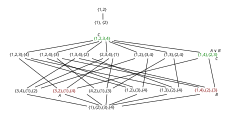

---
jupytext:
  text_representation:
    extension: .md
    format_name: myst
    format_version: 0.13
    jupytext_version: 1.14.1
kernelspec:
  display_name: Python 3 (ipykernel)
  language: python
  name: python3
---

# Review: Seven Sketches

Category theory is ubiquitous in mathematics; it's difficult to read mathematical articles on
Wikipedia without an understanding of the topic.

[ssc]: https://math.mit.edu/~dspivak/teaching/sp18/

## Why [Seven Sketches in Compositionality][ssc] for category theory?

The PDF is open source; see [Format selector for
1803.05316v3](https://arxiv.org/format/1803.05316v3). When you're working on questions you can copy
and paste the question out of the source to avoid the split attention effect, or even build the
pdf yourself and instead add or move answers. To build on Ubuntu 20.04 install the `texlive-full`
package; see [LaTeX/Installing Extra Packages -
Wikibooks](https://en.wikibooks.org/wiki/LaTeX/Installing_Extra_Packages) for suggestions on your
own system. Then in a directory with the source:

```bash
rm 7Sketches.bbl
pdflatex -interaction nonstopmode 7Sketches.tex
pdflatex -interaction nonstopmode 7Sketches.tex
```

You do need to build twice or `cleverref` references will be broken. The resulting pdf will be
missing a bibliography because the authors seem to have failed to include the original `.bib` file
in the source, hence the extra `rm` command. If you don't remove it the build will fail and you'll
either find or review this documentation:
- [biber - Package biblatex Warning: File 'filename.bbl' is wrong format version](
https://tex.stackexchange.com/questions/408473)
- [bibliographies - bibtex vs. biber and biblatex vs. natbib - TeX - LaTeX Stack
  Exchange](https://tex.stackexchange.com/questions/25701/bibtex-vs-biber-and-biblatex-vs-natbib)

More specifically the `.bib` file (the following is line 53 of `7Sketches.tex`) is missing:
```
\addbibresource{Library20180913.bib}
```

It's not trivial to build this file from the `.bbl` file they do include; see [bibtex - Convert .bbl
file to .bib file - TeX - LaTeX Stack
Exchange](https://tex.stackexchange.com/questions/203177/convert-bbl-file-to-bib-file).

With a "legitimate" PDF you can cite this resource on Wikipedia as you make connections to its
articles (most links will be in the opposite direction, though).

% TODO: Add an Amazon review when you're done, good or bad.

## Reference materials

See [Category theory](https://en.wikipedia.org/wiki/Category_theory). Examples of categories:
- [Category of sets](https://en.wikipedia.org/wiki/Category_of_sets)
- [Category of groups](https://en.wikipedia.org/wiki/Category_of_groups)
- [Functor category](https://en.wikipedia.org/wiki/Functor_category)

See [Category:Categories in category theory - Wikipedia](
https://en.wikipedia.org/wiki/Category:Categories_in_category_theory) for a more complete list of
example categories, or [Category (mathematics) - Examples](
https://en.wikipedia.org/wiki/Category_(mathematics)#Examples).

See [Introduction to Category Theory - Wikiversity](
https://en.wikiversity.org/wiki/Introduction_to_Category_Theory) for an alternative pedagogical
resource.

## Personal workflow

Start by reading [1803.05316.pdf](https://arxiv.org/pdf/1803.05316.pdf) in your browser with two
columns up (select "Odd Spreads" in Firefox), and close the sidebar. Open a second tab scrolled to
the solutions. Otherwise, use `zathura` to avoid needing to go to PgUp and PgDown on your keyboard.

Add to the errata: [Seven-Sketches suggestions - Google
Docs](https://docs.google.com/document/d/160G9OFcP5DWT8Stn7TxdVx83DJnnf7d5GML0_FOD5Wg/edit).

## Chapter 1: Generative effects: Orders and Galois connections

### 1.1. More than the sum of their parts

ERROR:

> a solution can be found in Chapter 1

The author likely intends to refer to the appendix.

*Exercise* 1.1. Some terminology: a function $f$ is said to be:

1. *order-preserving* if $x\leq y$ implies $f(x)\leq f(y)$, for all $x,y\in\mathbb{R}$
1. *metric-preserving* if $|x-y|=|f(x)-f(y)|$;
1. *addition-preserving* if $f(x+y)=f(x)+f(y)$.

For each of the three properties defined above - call it foo - find an $f$ that is foo-preserving
and an example of an $f$ that is not foo-preserving.

<hr>

An order-preserving function, part of the [Category of preordered
sets](https://en.wikipedia.org/wiki/Category_of_preordered_sets). See also [Order
theory](https://en.wikipedia.org/wiki/Order_theory):

$$
f(x) = x + 1
$$

A function that is not order-preserving:

$$
f(x) = -x
$$

A metric-preserving function:

$$
f(x) = x + 1
$$

A function that is not metric-preserving:

$$
f(x) = 2x
$$

An addition-preserving function:

$$
f(x) = 2x
$$

A function that is not addition-preserving:

$$
f(x) = x^2
$$

#### 1.1.1. A first look at generative effects

See [Category of topological spaces](https://en.wikipedia.org/wiki/Category_of_topological_spaces).

#### 1.1.2 Ordering systems



*Exercise* 1.7. Only the last (`4.`) is false.

To summarize, both $\leq$ and $\vee$ are binary operations that can be used to indirectly define a
kind of structure. If the relationship between the results of function application before and after
the binary operation is as required, we say the function is structure preserving.

The map $\Phi$ is an order-preserving function because if $A \leq B$ it implies that $\Phi(A) \leq
\Phi(B)$. The order-preserving relationship (unlike the metric-preserving, addition-preserving, and
join-preserving relationships) do not require the result before and after to be equal. It's defined
so you only need the result of an order comparison before function application to *imply* the result
of an order comparison after function application.

For the function to be join-preserving, we would need $\Phi(A) \vee Phi(B)$ (applying the function
before) to *equal* $\Phi(A \vee B)$ (applying the function after).
