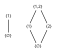
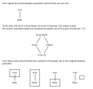
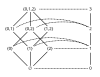
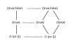

---
jupytext:
  text_representation:
    extension: .md
    format_name: myst
    format_version: 0.13
    jupytext_version: 1.14.1
kernelspec:
  display_name: Python 3 (ipykernel)
  language: python
  name: python3
---

# Review: Seven Sketches

Category theory is ubiquitous in mathematics; it's difficult to read mathematical articles on
Wikipedia without an understanding of the topic.

Category theory is also fundamental to programming; see [Is Category Theory useful for learning
functional programming? - CS SE](https://cs.stackexchange.com/questions/3028).

+++

[ssc]: https://math.mit.edu/~dspivak/teaching/sp18/

## Why [Seven Sketches in Compositionality][ssc] for category theory?

Alternative pedagogical resources:
- [Introduction to Category Theory - Wikiversity](
https://en.wikiversity.org/wiki/Introduction_to_Category_Theory)
- [Category Theory - Wikibooks, open books for an open world](
https://en.wikibooks.org/wiki/Category_Theory)
- [reference request - Good books and lecture notes about category theory. - Math SE](
https://math.stackexchange.com/questions/370/good-books-and-lecture-notes-about-category-theory)
- [Highest scored 'category-theory' questions - Mathematics Stack Exchange](
https://math.stackexchange.com/questions/tagged/category-theory)
- [Highest scored 'category-theory' questions - Stack Overflow](
https://stackoverflow.com/questions/tagged/category-theory)

Category theory is an old topic and shouldn't include much original research. In practice, I've
found most of this book's instructions have directly applicable or equivalent articles on Wikipedia
(which is good).

[azurl]: https://www.amazon.com/Invitation-Applied-Category-Theory-Compositionality/dp/1108711820/ref=sr_1_1?keywords=Invitation-Applied-Category-Theory-Compositionality&qid=1664376287&qu=eyJxc2MiOiIwLjYzIiwicXNhIjoiMC4wMCIsInFzcCI6IjAuMDAifQ%3D%3D&sr=8-1&ufe=app_do%3Aamzn1.fos.d977788f-1483-4f76-90a3-786e4cdc8f10

% TODO: Add an Amazon review when you're done, good or bad. See [Amazon.com: SSC][azurl].

### Open source PDF

[pdffs]: https://arxiv.org/format/1803.05316v3

The PDF is open source; see [Format selector for 1803.05316v3][pdffs]. At the least, this makes it
easy to search for content (e.g. latex macros). It allows for many other workflows as well; you
could copy and paste the question out of the source to avoid the split attention effect, or fix
minor errors in your own fork of the pdf.

[insep]: https://en.wikibooks.org/wiki/LaTeX/Installing_Extra_Packages

To build on Ubuntu 20.04 install the `texlive-full` package; see [LaTeX/Installing Extra Packages -
Wikibooks][insep] for suggestions on your own system. Then in a directory with the source:

```bash
rm 7Sketches.bbl
pdflatex -interaction nonstopmode 7Sketches.tex
pdflatex -interaction nonstopmode 7Sketches.tex
```

You do need to build twice or `cleverref` references will be broken. The resulting pdf will be
missing a bibliography because the authors seem to have failed to include the original `.bib` file
in the source, hence the extra `rm` command. If you don't remove it the build will fail and you'll
either find or review this documentation:
- [biber - Package biblatex Warning: File 'filename.bbl' is wrong format version](
https://tex.stackexchange.com/questions/408473)
- [bibliographies - bibtex vs. biber and biblatex vs. natbib - TeX - LaTeX Stack
  Exchange](https://tex.stackexchange.com/questions/25701/bibtex-vs-biber-and-biblatex-vs-natbib)

More specifically the `.bib` file (the following is line 53 of `7Sketches.tex`) is missing:
```
\addbibresource{Library20180913.bib}
```

It's not trivial to build this file from the `.bbl` file they do include; see [bibtex - Convert .bbl
file to .bib file - TeX - LaTeX Stack
Exchange](https://tex.stackexchange.com/questions/203177/convert-bbl-file-to-bib-file).

+++

## Reference materials

See [Category theory](https://en.wikipedia.org/wiki/Category_theory). Examples of categories:
- [Category of sets](https://en.wikipedia.org/wiki/Category_of_sets)
- [Category of groups](https://en.wikipedia.org/wiki/Category_of_groups)
- [Functor category](https://en.wikipedia.org/wiki/Functor_category)

See [Category:Categories in category theory](
https://en.wikipedia.org/wiki/Category:Categories_in_category_theory) for a more complete list of
example categories, or [Category (mathematics) - Examples](
https://en.wikipedia.org/wiki/Category_(mathematics)#Examples).

See also:
- [Glossary of category theory](
https://en.wikipedia.org/wiki/Glossary_of_category_theory)
- [Outline of category theory](https://en.wikipedia.org/wiki/Outline_of_category_theory)

+++

## Personal workflow

Start by reading [1803.05316.pdf](https://arxiv.org/pdf/1803.05316.pdf) in your browser with two
columns up (select "Even Spreads" in Firefox to match `zathura`), and close the sidebar. Open a
second tab scrolled to the solutions.

Otherwise, use `zathura` to avoid needing to go to PgUp and PgDown on your keyboard. You can have
only one window open and use marks to jump to the solution for the current question.

Don't wait for a full build of your jupyter book notes; open an article in Jupyter to check that
e.g. math renders as expected.

Add to the errata in [Seven-Sketches suggestions - Google
Docs](https://docs.google.com/document/d/160G9OFcP5DWT8Stn7TxdVx83DJnnf7d5GML0_FOD5Wg/edit).

+++

## Chapter 1: Generative effects: Orders and Galois connections

### 1.1. More than the sum of their parts

**ERROR**:

> a solution can be found in Chapter 1

The author likely intends to refer to the appendix.

+++

*Exercise* 1.1. Some terminology: a function $f$ is said to be:

1. *order-preserving* if $x\leq y$ implies $f(x)\leq f(y)$, for all $x,y\in\mathbb{R}$
1. *metric-preserving* if $|x-y|=|f(x)-f(y)|$;
1. *addition-preserving* if $f(x+y)=f(x)+f(y)$.

For each of the three properties defined above - call it foo - find an $f$ that is foo-preserving
and an example of an $f$ that is not foo-preserving.

<hr>

An order-preserving function, part of the [Category of preordered
sets](https://en.wikipedia.org/wiki/Category_of_preordered_sets). See also [Order
theory](https://en.wikipedia.org/wiki/Order_theory):

$$
f(x) = x + 1
$$

A function that is not order-preserving:

$$
f(x) = -x
$$

A metric-preserving function:

$$
f(x) = x + 1
$$

A function that is not metric-preserving:

$$
f(x) = 2x
$$

An addition-preserving function:

$$
f(x) = 2x
$$

A function that is not addition-preserving:

$$
f(x) = x^2
$$

#### 1.1.1. A first look at generative effects

See [Category of topological spaces](https://en.wikipedia.org/wiki/Category_of_topological_spaces).

#### 1.1.2 Ordering systems


+++

*Exercise* 1.7. Only the last (`4.`) is false.

See ["Observation preserves order but not join" in Applied Category Theory book - Math
SE](https://math.stackexchange.com/questions/3290331) for valuable commentary on section `1.1.2`.

[botr]: https://en.wikipedia.org/wiki/Binary_operation#Binary_operations_as_ternary_relations

For non-mathematicians this section in particular fails to address the (simple) difference between a
[Binary relation](https://en.wikipedia.org/wiki/Binary_relation) and a [Binary operation](
https://en.wikipedia.org/wiki/Binary_operation). Operations are convertible to relations (see
[Binary operations as ternary relations][botr]) but are in no way the same. As pointed out in a
comment by John Baez on the Math SE question referenced above, what it means for each to preserve
structure is rather different.

[mc]: https://en.wikipedia.org/wiki/Material_conditional
[lbc]: https://en.wikipedia.org/wiki/Logical_biconditional

That is, $\leq$ is a binary relation, and $\vee$ is a binary operation. The map $\Phi$ is an
order-preserving function because if $A \leq B$ it implies that $\Phi(A) \leq \Phi(B)$. The
order-preserving relationship (unlike the metric-preserving, addition-preserving, and
join-preserving relationships) does not require the result before and after to be equal. It's
defined so you only need the result of an order comparison before function application to *imply*
the result of an order comparison after function application (the [Material conditional][mc], not
the [Material biconditional][lbc]). For the function to be join-preserving, we need $\Phi(A) \vee
\Phi(B)$ (applying the function before) to *equal* $\Phi(A \vee B)$ (applying the function after).

+++

### 1.2. What is order?

#### 1.2.1. Review of sets, relations, and functions

*Exercise* 1.10

1. Yes
2. No
3. Yes

See also [Disjoint union](https://en.wikipedia.org/wiki/Disjoint_union).

Notice the solutions for 1.10 and 1.11 are out of order in the Appendix.

+++

*Exercise* 1.11

1. {}, {1}, {2}, {3}, {1,2}, {1,3}, {2,3}, {1,2,3}
2. ${1} \cup {2} = \{1,2\}$
3. (h,1), (h,2), (h,3), (1,1), (1,2), (1,3)
4. (h,1), (1,1), (1,2), (2,2), (3,2)
5. h, 1, 2, 3

Why is there a diamond after the third question?

+++

*Exercise* 1.16.

1. If there were more than one, then the first and second $p'$ would share elements.
2. If there were not one, then the $p$ would not partition the original set.

+++

*Exercise* 1.17.

(11,11), (11,12), (12,11), (12,12), (13,13), (21,21), (22,22), (22,23), (23,22), (23,23)

The Appendix has an error in this solution; it adds a (12,23) where there should be a (22,23)
(looks like a typo).

+++

*Exercise* 1.20.

1. We would not have constructed a subset if there were no elements to put in it. The definition of
   a $(\sim)$-connected subset also included that it was nonempty.
2. Consider the [Contraposition](https://en.wikipedia.org/wiki/Contraposition). If the union of the
   two sets was not empty, then there would be some element in both. If that was the case then the
   $(\sim)$-connected property would have unified the two sets.
3. Every element of $A$ must end up in at least one partition. Even if it was equivalent to no other
   element in the set, it would form a $(\sim)$-connected and $(\sim)$-closed subset on its own.

+++

*Exercise* 1.24.

1. $A = \{1\}$ and $B = \{a,b\}$, with $F(1) = b$
1. $B = \{1\}$ and $A = \{a,b\}$, with $F(a) = 1$ and $F(b) = 1$
1. Yes, No, No, Yes
1. Not injective or surjective, not because one domain element maps to two different codomain
   elements, not because one domain element does not map to any codomain element, bijective.

+++

*Exercise* 1.25.

$A$ is empty because every domain element must map to one codomain element, and there are no
codomain elements.

+++

*Exercise* 1.27.

In reading order (top to bottom, left to right):

1. $F(\bullet) = a$, $F(\circ) = a$, $F(\ast) = a$
1. $F(\bullet) = a$, $F(\circ) = a$, $F(\ast) = b$
1. $F(\bullet) = a$, $F(\circ) = b$, $F(\ast) = a$
1. $F(\bullet) = a$, $F(\circ) = b$, $F(\ast) = b$
1. $F(\bullet) = a$, $F(\circ) = b$, $F(\ast) = c$

+++

#### 1.2.2. Preorders

See also:
- [Preorder](https://en.wikipedia.org/wiki/Preorder)
- [Discrete category](https://en.wikipedia.org/wiki/Discrete_category)
- [Skeleton (category theory)](https://en.wikipedia.org/wiki/Skeleton_(category_theory))

*Exercise* 1.38.

| arrow | source | target |
| ---   | ---    | ---    |
| a     | 1      | 2      |
| b     | 1      | 3      |
| c     | 1      | 3      |
| d     | 2      | 2      |
| e     | 2      | 3      |

+++

*Exercise* 1.40.

$$
P = \{a, b, c, d, e\}
$$

(1,1) (1,2) (1,3) (1,3) (2,2) (2,3) (3,3) (4,4)

+++

*Exercise* 1.41.

Yes, as long as there is an implicit reflexive relationship.

+++

*Exercise* 1.42.

There are 5 relations of an element with itself, 3 relations between the first and second rank, 3
relations between the second and third rank, and 1 between the first and third.

For the meaning of the word "rank" here see [Attributes |
Graphviz](https://graphviz.org/doc/info/attrs.html).

+++

*Exercise* 1.44.

Technically no because you can compare elements to themselves.

+++

*Exercise* 1.46.


+++

*Exercise* 1.48.

Yes

+++

*Exercise* 1.51

The Hasse diagram for $P(\varnothing)$ is trivial; there are no subsets. The Hasse diagram for
$P\{1\}$ and $P\{1,2\}$ are:



*Example* 1.52

The author is defining $Prt(A)$, which is rather unclear initially. In this definition, it seems
like it would be more natural to call a partition $P$ finer than a partition $Q$ is the cardinality
is smaller. In the second paragraph, notice the definition allows for $P$ to have the same
cardinality as $Q$ (both finer and coarser?) if $h$ is an injective/bijective function. If $h$ is
surjective, then you would get the arguably more natural (strict) definition of fine and coarse.

+++

*Exercise* 1.53.

The coarsest partition corresponds to a function with a codomain of one element. The finest
partition corresponds to an identity function, where every unique element gets its own partition.

+++

*Example* 1.54.

This question has multiple issues. First some visual notes:



The author's definition of an "upper set" is any of these 4 sets (call each $U$) where if $p \in U$
and $p \leq q$, then $q \in U$. He intends us to go through all four of these sets and check if
this definition holds for them. The primary issue with this example is that his definition is just
plain wrong. Consider the definition applied to the $\{false\}$ set (calling it $U$); the author is
claiming that this set is an upper set if $false \in \{false\}$ in and $false \leq q$, then $q \in
U$. When does the author even define $q$? If we define $q$ to be $\{false\}$ then there's nothing
wrong with this set.

To avoid reverse-engineering the definition from the author's explanation of why $\{false\}$ is not
an upper set, see [Upper set](https://en.wikipedia.org/wiki/Upper_set). Using the variables that the
author uses rather than Wikipedia's, the definition of an upper set is then a set where for all $q
\in U$ and $p \in P$, if $q \leq p$, then $p \in U$. An even better definition for this context is
that an upper set is a set where for all $u \in U$ and $p \in P$, if $u \leq p$, then $p \in U$.
With either of these new definitions, the author's explanation of why $\{false\}$ is not an upper
set makes sense.

+++

*Exercise* 1.55.

A discrete preorder has no relationship between any elements, so every element on its own is an
upper set. Adding a second element to any of these sets also creates an upper set, because again
there is no relationship between elements. You can continue this with a third and fourth element, in
any order, constructing in the end all of the possible subsets of $X$.

+++

*Exercise* 1.57.

The issues this question has are covered in [order theory - Understanding upper set preorders - Math
SE](https://math.stackexchange.com/questions/3787952) and multiple comments in the errata.


+++

#### 1.2.3. Monotone maps

See also [Monotonic function](https://en.wikipedia.org/wiki/Monotonic_function).

*Exercise* 1.63.

Taking step `1.` from Example 1.50:



+++

*Exercise* 1.65.



+++

*Exercise* 1.66.

This question is a notational nightmare; see [notation - Making sense of a map, given a new domain
and codomain - Math SE](https://math.stackexchange.com/questions/3307889/) for someone else's
helpful comments on it.

In `1.` let's call the ↑ operator the "upper closure" of an element $p$ in $P$ (following the
language in [Upper set](https://en.wikipedia.org/wiki/Upper_set)). The definition constructs an
upper set because it includes in its construction all elements that make $p$ satisfy the
requirements of being an element of an upper set. Because the ordering relationship is transitive,
any other element included in the set by this construction will also have the requirements for it to
be an element of an upper set satisfied.

[dot]: https://en.wikipedia.org/wiki/Duality_(order_theory)

Part `2.` of the question introduces the notation $P^{op}$ out of nowhere to refer to the opposite
preorder; see this notation used in [Duality (order theory)][dot] and [Opposite
category](https://en.wikipedia.org/wiki/Opposite_category).

The given construction will map every element $p \in P^{op}$ to a set $s \in U(P)$ where $s$ is an
"upper" set that includes $p$. With respect to $P^{op}$ this set will be the opposite of an "upper"
set; what we'll call a "lower" set with respect to $p$.

Remove the first "if" from part `3.` of the question to make it understandable/readable. To prove
the forward case, let's use the definition in `1.`:

See also [Causality](https://en.wikipedia.org/wiki/Causality). One could see the lack of
preservation of joins and meets as a way of losing history in causal DAGs. For example, if you have
the number 12 you can't say for sure if it was generated by 6 * 2 or 3 * 4. Thinking in terms of a
DAG, rather than a total order, allows for multiple causality.

$$
\uparrow p = A = \{a\in P\mid p\leq a\} \\
\uparrow p' = B = \{b\in P\mid p'\leq b\}
$$

So if $p \leq p'$ we have by [direct proof](https://en.wikipedia.org/wiki/Direct_proof) that:

$$
\uparrow p' = B = \{b\in P\mid p\leq p'\leq b\} \subseteq \{a\in P\mid p\leq a\} = A = \uparrow p
$$

The opposite implication is left as an exercise for the reader.

Part `4.` of this question should refer to Exercise 1.57 rather than Example 1.56:


See also [Yoneda lemma](https://en.wikipedia.org/wiki/Yoneda_lemma).

+++

*Exercise* 1.67.

The monotonicity requirement is that for all $x,y \in A$, if $x \leq_{A} y$ then $f(x) \leq_B f(y)$.
The condition of the if statement is always false for a discrete preorder, so any function will
satisfy it.

+++

*Exercise* 1.69.

Define the sets $X$ and $Y$:

$$
X = \{0,1,2,3\} \\
Y = \{A,B,C\}
$$

Define the surjective function $f$:

$$
f(0) = A \\
f(1) = A \\
f(2) = B \\
f(3) = C
$$

See [Partition of a set](https://en.wikipedia.org/wiki/Partition_of_a_set) for notation. Two
different partitions $P$ and $Q$:

$$
\begin{align} \\
P & = \{\{A,B\},\{C\}\} = A B | C \\
p(A) & = M \\
p(B) & = M \\
p(C) & = N \\
\end{align}
$$

$$
\begin{align} \\
Q & = \{\{A\},\{B,C\}\} = A | B C \\
q(A) & = M \\
q(B) & = N \\
q(C) & = N \\
\end{align}
$$

The composite $f;s$ for $P$ is:

$$
\begin{align} \\
f;p(0) & = M \\
f;p(1) & = M \\
f;p(2) & = M \\
f;p(3) & = N \\
f^\ast(P) & = 0 1 2 | 3 \\
\end{align}
$$

The composite $f;s$ for $Q$ is:

$$
\begin{align} \\
f;q(0) & = M \\
f;q(1) & = M \\
f;q(2) & = N \\
f;q(3) & = N \\
f^\ast(Q) & = 0 1 | 2 3 \\
\end{align}
$$

+++

*Exercise* 1.71.

The identity function is monotone because if $x \leq y$ then $id_X(x) \leq id_X(y)$.

The composition of monotone functions is monotone because if $x \leq y$ then $f;g(x) \leq f;g(y)$.

+++

*Exercise* 1.73.

Calling a preorder skeletal removes all equivalence sets (partitions), making every element its own
equivalence set (partition). This is a discrete preorder.

See also [Dagger category](https://en.wikipedia.org/wiki/Dagger_category).

+++

*Definition* 1.75.

See also [Order isomorphism](https://en.wikipedia.org/wiki/Order_isomorphism).

+++

*Exercise* 1.77.

The function:

$$
\phi(\ast \bullet \circ) = true \\
\phi(\ast | \bullet \circ) = false \\
\phi(\ast \bullet | \circ) = true \\
\phi(\bullet | \ast \circ) = false \\
\phi(\ast | \bullet | \circ) = false
$$

The preorder:

$$
\phi(\ast | \bullet \circ) \leq \phi(\ast \bullet \circ) \\
\phi(\ast \bullet | \circ) \leq \phi(\ast \bullet \circ) \\
\phi(\bullet | \ast \circ) \leq \phi(\ast \bullet \circ) \\
\phi(\ast | \bullet | \circ) \leq \phi(\ast | \bullet \circ) \\
\phi(\ast | \bullet | \circ) \leq \phi(\ast \bullet | \circ) \\
\phi(\ast | \bullet | \circ) \leq \phi(\bullet | \ast \circ) \\
$$

By substitution:

$$
false \leq true \\
true \leq true \\
false \leq true \\
false \leq false \\
false \leq true \\
false \leq false \\
$$

+++

*Exercise* 1.79.

The second paragraph should start (remove an "a"):

> Viewing upper sets as monotone maps to ...

The function $u$ here defines an upper set by labeling all elements of $Q$ as either belonging to it
or not. The composition $f;u$ can then be understood as mapping an element of $P$ to an element in
$Q$, and again labeling it as belonging to the upper set or not.

+++

### 1.3. Meets and Joins

See also [Join and meet](https://en.wikipedia.org/wiki/Join_and_meet).

*Exercise* 1.80.

1. Because all elements in the set are greater than zero.
2. Because among the set of all lower bounds, it is the greatest.

+++

*Exercise* 1.85.

For `1.`, we have that for all $a \in A$ (only one element) we have $p \leq a$, satisfying the first
requirement. The second requirement is that for all $q$ such that $q \leq a$ for all $a \in A$, we
have that $q \leq p$. This requirement allows for other $q$ that are equivalent to $p$.

In `2.` we remove the possibility of equivalent sets of elements  by making the preorder skeletal.

The answer to `3.` is yes.

+++

*Exercise* 1.90.

The meet is the greatest common divisor and the join is the least common multiple.

+++

*Exercise* 1.94.

There are only two possible worlds to consider; that $a \leq b$ or that $b \leq a$. If the first is
true, then by the definition of $f$ as a monotone map we have that $a \leq_P b$ implies $f(a) \leq_Q
f(b)$. This implies the expression $f(a) \vee f(b)$ is equivalent to $f(b)$, which is $\leq$ the
expression $f(a \vee b) = f(b)$. If the second case ($b \leq a$) is true, then again by the
definition of a monotone map we have that $b \leq a$ implies $f(b) \leq f(a)$, the left hand
expression is $f(a)$, and the right hand expression is $f(a \vee b) = f(a)$.

+++

### 1.4. Galois connections

See also:
- [Galois connection](https://en.wikipedia.org/wiki/Galois_connection)
- [Adjoint functors](https://en.wikipedia.org/wiki/Adjoint_functors)

#### 1.4.1. Definition and examples of Galois connections

$$
\def\RR{{\bf R}}
\def\ZZ{{\bf Z}}
$$

*Example* 1.97.

The first paragraph of this example should replace the dummy variable $x$ with $y$. Otherwise, it's
not clear in the next paragraph that $x$ is always a real number and $y$ is always an integer. The
relation in this example needs to hold for *any* real number and integer; e.g. the pair (x=3.1, y=2)
is always true, and (x=7.3, y=1) is always false. The author could have put this more precisely:

$$
\lceil x/3 \rceil \leq_\ZZ y \iff x \leq_\RR 3y
$$

Or as:

$$
\lceil r/3 \rceil \leq z \iff r \leq 3z
$$

[fsf]: https://en.wikipedia.org/wiki/Floor_and_ceiling_functions

See [Floor and ceiling functions][fsf]. By the definition of the ceiling function we have $x
\leq_\RR n \iff \lceil x \rceil \leq_\ZZ n$. If we substitute $x/3$ for $x$, and $y$ for $n$, we get
the result from the text.

+++

*Exercise* 1.98.

We need a function from $\RR \to \ZZ$; an obvious function to try given the last example is $\lfloor
x/3 \rfloor$.

[fsf2]: https://en.wikipedia.org/wiki/Floor_and_ceiling_functions

See [Floor and ceiling functions][fsf2]. By the definition of the floor function we have $n \leq_\RR
x \iff n \leq_\ZZ \lfloor x \rfloor$. If we substitute $x/3$ for $x$, and $y$ for $n$, we get:

$$
\begin{align} \\
y \leq_\RR x/3 \iff y & \leq_\ZZ \lfloor x/3 \rfloor \\
3y \leq_\RR x \iff y  & \leq_\ZZ \lfloor x/3 \rfloor \\
\end{align}
$$

As expected the right adjoint is $\lfloor x/3 \rfloor$.

+++

*Exercise* 1.99.

All of these cases (for part `1.`) are true, so $f$ is left adjoint to $g$:

$$
\begin{align} \\
f(p=1) & = 1 \leq q=1 \iff p=1 \leq g(q=1) = 2 \\
f(p=2) & = 1 \leq q=1 \iff p=2 \leq g(q=1) = 2 \\
f(p=3) & = 3 \leq q=1 \iff p=3 \leq g(q=1) = 2 \\
f(p=1) & = 1 \leq q=2 \iff p=1 \leq g(q=2) = 2 \\
f(p=2) & = 1 \leq q=2 \iff p=2 \leq g(q=2) = 2 \\
f(p=3) & = 3 \leq q=2 \iff p=3 \leq g(q=2) = 2 \\
f(p=1) & = 1 \leq q=3 \iff p=1 \leq g(q=3) = 3 \\
f(p=2) & = 1 \leq q=3 \iff p=2 \leq g(q=3) = 3 \\
f(p=3) & = 3 \leq q=3 \iff p=3 \leq g(q=3) = 3 \\
\end{align}
$$

As we work through the cases for `2.` we hit a failure:

$$
\begin{align} \\
f(p=1) & = 1 \leq q=1 \iff p=1 \leq g(q=1) = 2 \\
f(p=2) & = 2 \leq q=1 \iff p=2 \leq g(q=1) = 2 \\
\end{align}
$$

*Remark* 1.100.


*Exercise* 1.101.

We are interested in finding the function $f$:

$$
f(z) \leq r \iff z \leq \lceil r/3 \rceil
$$


To fix the corner cases, one could define $f(z)$ to be the first real number greater than $3(z-1)$.

Looking forward, one could use Theorem 1.115 to define a left adjoint, although it would also be in
an unsatisfying set-builder notation. Because $g(r) = \lceil r/3 \rceil$ preserves meets (trivial
given it's a total order), then by that theorem it should be a right adjoint.

The answer given in the Appendix seems wrong, with the logic failing at:

> In the same way, $L(1) \leq r$ for all $r > 0$, so $L(1) \leq 0$.

See also [galois theory - Is there a systematic way to find a left adjoint of a given monotone
function - Math SE](https://math.stackexchange.com/questions/3955264).

#### 1.4.2. Back to partitions

Second paragraph, add *the*:

> between *the* preorder of $S$-partitions and ...

Third paragraph, remove *with*:

> if there exist $s_1, s_2 \in S$ such that

In the same paragraph, remove the unnecessary "?" in $\sim_T^?$.

+++

*Exercise* 1.103.

The author asks for 6 examples in the question, then only bothers to do 4 in the Appendix. Doing so
many is probably not a great use of time; this answer includes 5 only because the same drawings can
be reused in the next question.


+++

*Exercise* 1.105.


+++

*Exercise* 1.106.

The parenthetical remark in `3.` could be taken to mean you need to go back and fix your answer to
`1.` if you can't answer `3.`, because you apparently misunderstood something. More likely it simply
means you need to choose a partition in `1.` that allows for both a coarser partition in `2.` and a
non-coarser partition in `3.`.


+++

#### 1.4.3. Basic theory of Galois connections

Third paragraph, add *to*:

> We want *to* show

+++

*Exercise* 1.109.

Part `2.`, remove *holds*:

> If Eq. (1.108) holds, then $p \leq g(q) \iff f(p) \leq q$ ...

For `1.` take any $q \in Q$ and let $p := g(q)$. With this definition we have $p \leq g(q)$,
which by the definition of a Galois connection implies $f(p) \leq q$. Substituting the definition of
$p$ in the last equation we get the desired result.

For `2.` suppose $p \leq g(q)$. Since $f$ is monotonic we have $f(p) \leq f(g(q))$, and substituting
$f(g(q)) \leq q$ we get the desired result $f(p) \leq q$.

+++

*Exercise* 1.110.

See the answer in the appendix; this answer would not be independent.

+++

*Exercise* 1.112.

Let $A \in P$ be any subset and let $j := \vee A$ be its join. Then since $f$ is monotone $f(a) \leq
f(j)$ for all $a \in A$, so $f(j)$ is an upper bound for the set $f(A)$. We must now show it is the
least upper bound.

So take any other upper bound $b$ for $f(A)$; that is suppose that for all $a \in A$, we have $f(a)
\leq b$ and we want to show $f(j) \leq b$. Then by definition of $f$ being a left adjoint we also
have $a \leq g(b)$. However since $j$ is the least upper bound, we have $j \leq g(b)$. Again using
the Galois connection, we have $f(j) \leq b$, proving that $f(j)$ really is the least upper bound
for $f(A)$.

+++

*Exercise* 1.114.

$$
\begin{align} \\
f(p=1)   & = 1 \leq q=1 \iff p=1   \leq g(q=1) = 1 \\
f(p=2)   & = 2 \leq q=1 \iff p=2   \leq g(q=1) = 1 \\
f(p=3.9) & = 4 \leq q=1 \iff p=3.9 \leq g(q=1) = 1 \\
f(p=4)   & = 4 \leq q=1 \iff p=4   \leq g(q=1) = 1 \\
f(p=1)   & = 1 \leq q=2 \iff p=1   \leq g(q=2) = 2 \\
f(p=2)   & = 2 \leq q=2 \iff p=2   \leq g(q=2) = 2 \\
f(p=3.9) & = 4 \leq q=2 \iff p=3.9 \leq g(q=2) = 2 \\
f(p=4)   & = 4 \leq q=2 \iff p=4   \leq g(q=2) = 2 \\
f(p=1)   & = 1 \leq q=4 \iff p=1   \leq g(q=4) = 4 \\
f(p=2)   & = 2 \leq q=4 \iff p=2   \leq g(q=4) = 4 \\
f(p=3.9) & = 4 \leq q=4 \iff p=3.9 \leq g(q=4) = 4 \\
f(p=4)   & = 4 \leq q=4 \iff p=4   \leq g(q=4) = 4 \\
\end{align}
$$

The second row in the solution for this question is incorrect.

+++

*Theorem* 1.115.

In the third paragraph of the proof, replace 1.111 with 1.107:

> By Proposition 1.107, it suffices

+++

*Example* 1.117.

The names of the sets change from $A$/$B$ to $X$/$Y$ and then back again.

This section is confusing; the function $f_{!}$ is a left adjoint not to $f_*$ but $f^*$. Similarly
$f_{*}$ is right adjoint to $f^*$, not $f_!$.

A similar example is given in [category theory - A concrete intuition for Galois Connection - Math
SE](https://math.stackexchange.com/a/4470690/245548).

+++

*Exercise* 1.118.

Selecting the function and subsets:


$$
\begin{align}
f^*(B_1) & = \{a_1, a_2\} \\
f^*(B_2) & = \{a_3\} \\
f_!(A_1) & = \{b_1\} \\
f_!(A_2) & = \{b_1, b_2\} \\
f_*(A_1) & = \{b_1\} \\
f_*(A_2) & = \{b_2\}
\end{align}
$$

+++

#### 1.4.4. Closure operators

See [Closure operators on partially ordered sets](
https://en.wikipedia.org/wiki/Closure_operator#Closure_operators_on_partially_ordered_sets).

+++

*Exercise* 1.119.

For `1.`, this is simply a restatement of the first part of $p \leq g(f(p))$ in Proposition 1.117.
but with different symbols.

For `2.`, define $q := f(p)$. Applying $f(g(q)) \leq q$, we have $f(g(f(p)) \leq f(p)$. Applying the
monotonicity property of $g$ we then have $g(f(g(f(p)))) \leq g(f(p))$, which is one half of what we
are trying to prove.

Define $p_1 := g(f(p))$, and apply $p_1 \leq g(f(p_1)$ to get $g(f(p)) \leq g(f(g(f(p))))$, the
second half of what we are trying to prove.

+++

*Example* 1.122.

For the term "inclusion" used in this example, see [Inclusion map](
https://en.wikipedia.org/wiki/Inclusion_map).

It would be helpful to have an example to go with this example. See [Upper
set](https://en.wikipedia.org/wiki/Upper_set) for the definition of an upper closure; let's compute
this closure on a simple preorder.


+++

#### 1.4.5. Level shifting

See [Category of preordered sets](https://en.wikipedia.org/wiki/Category_of_preordered_sets).

+++

*Exercise* 1.124.


+++

*Exercise* 1.125.

For `1.` define the preorder $\leq$:

$$
1 \leq 3 \\
2 \leq 3
$$

Then we have $U(\leq) = \{(1,3), (2,3), (1,1), (2,2), (3,3)\}$.

For `2.` take the binary relations:

$$
Q = \{(1,3)\} \\
Q' = \{(3,1)\}
$$

See Example 1.22 above; the authors are implying $Cl$ is a closure and therefore a left adjoint. In
`3.` we'll only show that $Cl$ is monotone:

$$
Cl(Q) = Cl(\{1,3)\}) = Cl(\{(1,3), (1,1), (2,2), (3,3)\})
$$

The preorder $Cl(Q)$:

$$
1 \leq 3
$$

Clearly $Cl(Q) \sqsubseteq \leq$ (see $\leq$ defined in `1.` above). For `4.` we have:

$$
Cl(Q') = Cl(\{3,1)\}) = Cl(\{(3,1), (1,1), (2,2), (3,3)\})
$$

The preorder $Cl(Q')$:

$$
3 \leq 1
$$

Clearly $Cl(Q) \not\sqsubseteq \leq$.
