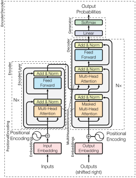

---
jupytext:
  cell_metadata_filter: -all
  formats: md:myst
  text_representation:
    extension: .md
    format_name: myst
    format_version: 0.13
    jupytext_version: 1.19.1
kernelspec:
  display_name: Python 3 (ipykernel)
  language: python
  name: python3
---

# QKV attention

+++

Supplementary material to the questions and answers in [What exactly are keys, queries, and values in attention mechanisms? - Cross Validated](https://stats.stackexchange.com/questions/421935). Indirectly, commentary on [Attention is All You Need (Vaswani2017)](https://arxiv.org/abs/1706.03762).

+++

## Why this question?

+++

Why is this question important? Many versions of attention are used with older RNN-based models, and are not used in practice any more. On the other hand, the KQV (or QKV) method seems to still be used extensively. Besides being common, see comments on the value of all attention mechanisms (not just KQV) in [Add attention mechanism](../add-attention-mechanism.md).

+++

The QKV attention mechanism is particularly interesting because it's used in Perceivers. That is, QKV lets you easily connect two different modalities (i.e. text and image) because e.g. QK can both be text and V can be an image (image search in web browsers).

+++

## Library versions

```{code-cell} ipython3
%pip install numpy pandas
```

## Answer

+++

To answer the OP's question (what $Q$, $K$, $V$ are), here are the queries and keys from **Figure 3** in Bahdanau2014:

+++


+++

You won't find the term "query" or "key" anywhere in this paper, as these terms were introduced in Vaswani2017, but the English words in the columns are the keys. The French words in the rows are the queries. The better a query matches a key, the whiter a box. The whiter a box, the more a "value" is passed through from one layer to another. Said another way, the more downstream layers pay attention to or "attend to" a value.

+++

Here's an example from Figure 5 of Vaswani2017:


+++

What was previously a matrix is now presented as shading on lines, but we are merely presenting the matrix in a different way. The more red a line, the more a query is associated with a key. Since we're now talking about "self-attention" the queries and keys are both in English. See [Tensor2Tensor Intro - Colab](https://colab.research.google.com/github/tensorflow/tensor2tensor/blob/master/tensor2tensor/notebooks/hello_t2t.ipynb#scrollTo=OJKU36QAfqOC) for a live demo of the tool the authors apparently used to produce this visualization.

+++

In the context of this paper, we're looking at $QK^T$ from equation (1):

+++

$$
\text{Attention}(Q, K, V) = \text{softmax}\left(\frac{QK^T}{\sqrt{d_k}}\right)V
$$

+++

$QK^T$ is often called the "attention scores matrix" and as you can probably infer, is square. Diverging a bit, notice that the size of it scales as $O(n²)$ where $n$ is the sequence length (e.g. 512). Since Vaswani2017 was published, the [flash-attention](https://github.com/Dao-AILab/flash-attention) innovation has seriously optimized the calculation of this matrix.

+++

### References

+++

Reference papers:

+++

| Short name | Arxiv | Author | Date | Semantic Scholar |
| --- | --- | --- | --- | --- |
| Bahdanau2014 | [NEURAL MACHINE TRANSLATION BY JOINTLY LEARNING TO ALIGN AND TRANSLATE](https://arxiv.org/pdf/1409.0473) | Bahdanau et al. | 2014-09-01 | [link](https://www.semanticscholar.org/reader/fa72afa9b2cbc8f0d7b05d52548906610ffbb9c5)
| Sutskever2014 | [Sequence to Sequence Learning with Neural Networks](https://arxiv.org/pdf/1409.3215) | Sutskever et al. | 2014-09-10 | [link](https://www.semanticscholar.org/paper/Sequence-to-Sequence-Learning-with-Neural-Networks-Sutskever-Vinyals/cea967b59209c6be22829699f05b8b1ac4dc092d)
| Vaswani2017 | [Attention Is All You Need](https://arxiv.org/pdf/1706.03762.pdf) | Vaswani et al. | 2017-06-12 | [link](https://www.semanticscholar.org/reader/204e3073870fae3d05bcbc2f6a8e263d9b72e776)

+++

It's easier to navigate between papers with Semantic Scholar than Arxiv as it adds clickable links to every reference in a paper. See Connected Papers for a denser graph, though CP is not a citation graph (see [Connected Papers | About](https://www.connectedpapers.com/about)). See [this link](https://www.connectedpapers.com/main/fa72afa9b2cbc8f0d7b05d52548906610ffbb9c5+204e3073870fae3d05bcbc2f6a8e263d9b72e776+cea967b59209c6be22829699f05b8b1ac4dc092d/Connected-Papers-|-Find-and-explore-academic-papers/graph) for a custom graph with three of these papers as origins. Although CP is now heavily paywalled, it still helps to see the size of paper bubbles.

+++

More links, advancing from the softest introductions to the most technical (compressed) material:

+++

| Name | Author | Papers | Grade |
| --- | --- | --- | --- |
| [Visualizing A NMT Model](https://jalammar.github.io/visualizing-neural-machine-translation-mechanics-of-seq2seq-models-with-attention/) | Alammar | Bahdanau2014 | A |
| [Attention illustrated in GIFs](https://medium.com/data-science/attn-illustrated-attention-5ec4ad276ee3#ba24) | Karim | Bahdanau2014 | B |
| [additive attention](https://en.wikipedia.org/wiki/Attention_(machine_learning)#Bahdanau_(additive)_attention) | Wikipedia | Bahdanau2014 | A |
| [Attention Is All You Need](https://en.wikipedia.org/wiki/Attention_Is_All_You_Need) | Wikipedia | Vaswani2017 | A |
| [Seq2seq](https://en.wikipedia.org/wiki/Seq2seq#cite_note-sequence-1) | Wikipedia | Sutskever2014 | A |
| [Neural machine translation](https://en.wikipedia.org/wiki/Neural_machine_translation) | Wikipedia | Bahdanau2014 | B |
| [The Illustrated Transformer](https://jalammar.github.io/illustrated-transformer/) | Alammar | Vaswani2017 | A |
| [Sam Tseng's answer](https://stats.stackexchange.com/a/463320/189415) | Tseng | Bahdanau2014, Vaswani2017 | C |

+++

My personal opinion on the quality of the commentary is given as a grade in the rightmost column. For commentary on other commentary, see below.

+++

### [Sam Tseng's answer](https://stats.stackexchange.com/a/463320/189415)

+++

An alternative to the YouTube video is the ["Derivation" section of Latent semantic analysis - Wikipedia](https://en.wikipedia.org/wiki/Latent_semantic_analysis#Derivation). Using the same data from the image in Sam's answer but following the logic in the Wikipedia page on LSA:

```{code-cell} ipython3
import numpy as np
import pandas as pd

X = np.array([ \
   [1, 1, 1, 0, 0], \
   [3, 3, 3, 0, 0], \
   [4, 4, 4, 0, 0], \
   [5, 5, 5, 0, 0], \
   [0, 2, 0, 4, 4], \
   [0, 0, 0, 5, 5], \
   [0, 1, 0, 2, 2], \
])
pd.DataFrame(X,
    index=['P1', 'P2', 'P3', 'P4', 'P5', 'P6', 'P7'],
    columns=["Star Wars", "The Matrix", "Iron man", "U got mail", "Titanic"])
```

```{code-cell} ipython3
from numpy import linalg as la

np.set_printoptions(precision=2, suppress=True, floatmode='maxprec_equal')

U, s, Vt = la.svd(X, full_matrices=False)
U, s, Vt
```

```{code-cell} ipython3
k = 2
U_k, s_k, Vt_k = U[:, :k], s[:k], Vt[:k, :]
V_k = Vt_k.T
U_k, s_k, V_k
```

```{code-cell} ipython3
P8 = np.array([5, 0, 0, 0, 0])
P9 = np.array([0, 4, 5, 0, 0])
cos_sim = P8.dot(P9) / (la.norm(P8) * la.norm(P9))
cos_sim
```

The variables `P8` and `P9` are equivalent to $\textbf{t}_i^T$ in the Wikipedia article; they are
the "queries" (Q) in the language of KQV and information retrieval. To project them into the
"semantic" or "concept" space we'll use a variation on this equation from the Wikipedia article:

$$
\begin{align}
\hat{\textbf{t}}_i & = \Sigma_k^{-1}  V_k^T \textbf{t}_i \\
\end{align}
$$

Taking the transpose:

$$
\begin{align}
(\hat{\textbf{t}}_i)^T & = (\Sigma_k^{-1}  V_k^T \textbf{t}_i)^T \\
\hat{\textbf{t}}_i^T & = \textbf{t}_i^T V_k \Sigma_k^{-1} \\
\end{align}
$$


Initially we'll drop the $\Sigma_k^{-1}$ term:

```{code-cell} ipython3
P8_hat = P8 @ V_k
P9_hat = P9 @ V_k
cos_sim = P8_hat.dot(P9_hat) / (la.norm(P8_hat) * la.norm(P9_hat))
P8_hat, P9_hat, cos_sim
```

Re-adding the $\Sigma_k^{-1}$ term:

```{code-cell} ipython3
P8_hat = P8 @ V_k @ np.diag(1 / s_k)
P9_hat = P9 @ V_k @ np.diag(1 / s_k)
P8_hat, P9_hat
```

Notice these 2 new $\textbf{t}_i^T$ are on the same scale as the original 7 $\textbf{t}_i^T$:

```{code-cell} ipython3
U_k
```

We also end up with (in general) a different cosine similarity measure:

```{code-cell} ipython3
cos_sim = P8_hat.dot(P9_hat) / (la.norm(P8_hat) * la.norm(P9_hat))
cos_sim
```

[wlm]: https://en.wikipedia.org/wiki/Linear_map

To try to summarize, the author is saying the $K$ and $Q$ matrices in KQV attention both represent
something like the $V_k$ matrix of left-singular values above, and where we also disregard the
$\Sigma_k^{-1}$ term. In optimization we can learn this scaling matrix as part of the weight matrix,
that is, learn $V_k \Sigma_k^{-1}$ rather than only $V_k$.

Said another way, in KQV attention we use a potentially different mapping $K$ and $Q$ to transform
([linear map][wlm]) vectors from their original basis to a "semantic" (or "contextualized") space
where we get reasonable values from a similarity measure. In latent semantic indexing (LSI) there is
only one weight matrix represented above as $V_k$ (not two). It transforms both the original (P1-P7)
and new (P8-P9) terms to the same "semantic" space already.

[pytl]: https://pytorch.org/docs/stable/generated/torch.nn.Linear.html

In KQV attention the loss function is also different; it's not as simple as the Frobenious norm
because a [torch.nn.Linear][pytl] layer (a linear layer in general) also learns a bias by default
and because the network's loss function is not always L2. To avoid confusion over whether a bias
term is implied, don't use the two words [Linear
function](https://en.wikipedia.org/wiki/Linear_function) together.

Sam's answer mentions the SVD; it would probably improve the answer to reference PCA as well. For more details see [Relationship between SVD and PCA](./relationship-between-svd-and-pca.md). You interpet point `2.` in Sam's answer as a reference to [Feature learning - PCA](https://en.wikipedia.org/wiki/Feature_learning#Principal_component_analysis) and `3.` as a reference to [Dimensionality reduction - PCA](https://en.wikipedia.org/wiki/Dimensionality_reduction#Principal_component_analysis_(PCA)). See the comments following "Feature extraction and dimension reduction can be combined in one step" in [Dimensionality reduction - Dimension reduction](https://en.wikipedia.org/wiki/Dimensionality_reduction#Dimension_reduction) for other techniques for doing both these steps at once.

[vs]: https://en.wikipedia.org/wiki/Vector_space

Sam's answer provides a decent common-sense explanation in point `1.` for why we need at least one of the $W_Q$ or $W_K$ matrices; so that we don't leave our input embeddings (the $x$ in each row of $X$) in the same vector space. To use a little cleaner syntax than Sam's answer does, for each head we have that:

$$
\begin{align}
K & = X W_K \\
Q & = X W_Q
\end{align}
$$

If we eliminated both the $W_Q$ and $W_K$ matrices then the $Q K^T$ term in the attention
calculation would be $X X^T$, which is an auto-covariance matrix, which are symmetric, meaning the
attention weights could only capture information about the similarity of words in the original
representation. There would be no need for multiple heads (it'd be hard to justify separate $V$ in
each, the only remaining changeable component) and the mechanism would include no contextualization.
See further comments about eliminating weight matrices below.

+++

## [mon's answer](https://stats.stackexchange.com/a/531971/189415)

+++

This answer is more focused on the "meaning" of KQV attention rather than the mechanics. The answer is relatively high-level, however, and doesn't even try to address multi-head attention.

A single-head KQV attention mechanism can really only provide a guess at what other words are important to include in a "contextualized" embedding of a more generic word. That is, it can pick out only one kind of generic [Anaphora (linguistics)](https://en.wikipedia.org/wiki/Anaphora_(linguistics)) to include; see also an anaphora head in [Vaswani2017 - Pg14](https://arxiv.org/pdf/1706.03762.pdf#page=14). Hence, mon's answer simply says K/Q is about finding the "most related" word.

The answer implies single-head attention is about where you *should* look for the most useful word.
That is, that attention provides a probabilistic estimate of "value" for understanding. Is this
where our eyes search (guess) in practice? Could we measure our saccades and compare them to the
results of an attention mechanism? Arguably a search engine provides the same single-head attention
scores (what you should pay attention to, what's "valuable" for understanding) based on training on
e.g. web links.

+++

### Multi-headed attention

+++

[wmh]: https://stackoverflow.com/a/66652733/622049

If you have more than one attention head, however, the different heads should be pulling different
features out of the sentence. See [What Does BERT Look At?](https://arxiv.org/abs/1906.04341). Like
the features provided by a CNN, only some of the heads provide features interpretable by a human
being (see [Why use multi-headed attention in Transformers?][wmh]).

[polys]: https://en.wikipedia.org/wiki/Polysemy
[homy]: https://en.wikipedia.org/wiki/Homonym

The Peltarion author refers to [Polysemy][polys], closely related to [Homonymy][homy]. You need to
be able to find anaphora with attention in order to distinguish between these kinds of words. If the
anaphora you need aren't part of your sentence, you're out of luck. You can see attention as
providing a "feature" on top of your word, to help contextualize it (add or refine information for
e.g. a polyseme) or disambiguate it (change its default meaning for e.g. a homonym).

+++

### Why do we need both a $W_Q$ and $W_K$ matrix?

+++

Do the $W_K$ and $W_Q$ matrices learn to project to the same "semantic" or "contextualized" vector
space? If so, perhaps there is no need to keep both of them. Let's say we applied this single matrix
to both:

$$
\begin{align}
K & = X W_{KQ} \\
Q & = X W_{KQ}
\end{align}
$$

This approach allows for some contextualization, but the product $Q K^T$ will be a symmetric matrix.
Few word relationships are of this type; e.g. when you want to find the proper noun associated with a
pronoun you do not want your query to discover pronouns when you look up a proper noun.

What if we only applied the single weight matrix to one of the inputs?

$$
\begin{align}
K & = X W_K \\
Q & = X
\end{align}
$$

This approach only allows for limited contextualization because the $W_K$ matrix will not be able to
be selected (learned) in a way that produces $k$ and $q$ dot products significantly different than
those in the original (e.g. word2vec) embedding. That is, because there's no change in $q$ examples,
there's limited flexibility in creating a new semantic (or "contextualized") space for this
particular head.

[monsc]: https://stats.stackexchange.com/questions/421935/what-exactly-are-keys-queries-and-values-in-attention-mechanisms#comment1042657_531971

Do the K and Q matrices learn to project to the same "semantic" or "contextualized" space? Yes, but
because we are interested in building a non-symmetric relationship, they must both exist. I'd
disagree with [mon's comment][monsc] here.

Just to be clear, let's work through a specific example with pronouns and proper nouns. If he
(pronoun) is the query then "Hans" (proper noun) may be the most-similar key we want to pull up. The
word "he" (an $x$ in the $X$ matrix) would hopefully be transformed (if weights are selected
properly) to a $q$ through the $W_Q$ matrix that would be much more similar to the key "Hans"
translated to a $k$ through the $W_K$ matrix than the word "Mary" translated to a $k$ through the
$W_K$ matrix. We want the dot-product attention score produced in the attention weights matrix
produced by the pronoun attention head to be high, which requires the vectors to be in the same
space. We need a "pronoun" semantic (or "contextualized") space.

Because $W_Q$ and $W_K$ are jointly trained they should have time to work out this common
representation. Remember that it's only at run-time however that we get a specific answer to which
pronouns are most likely associated with which proper nouns, when you can use these "soft" weights
as a linear map in itself to convert the newly-remapped $v$ to a single weighted $v$.

In this case the $W_Q$ and $W_K$ matrices may need to learn to emphasize gender from the original
embedding in order to find associated proper nouns (despite the reduction in dimension from
$d_{model}$ to $d_k$), but only the $K$ matrix would need to learn that e.g. "Hans" is a Germanic
boy's name that is a proper noun because e.g. it's capitalized (and is *not* a pronoun). An [Article
(grammar)](https://en.wikipedia.org/wiki/Article_(grammar)) head may be able to strip gender
information if the only concern is e.g. the multiplicity of the reference word.

+++

### Why do we need a $W_V$ matrix?

+++

Could we skip the $W_V$ matrix if all we are doing is forwarding the original word to the next
layer? Once we've identified the word as e.g. a pronoun it seems the attention layer has done its
job and we can use our attention weights to properly emphasize the word relative to others.

The obvious reason is that our original embedded words of dimension $d_{model}$ may be in a
different dimension than the $d_v$ we want to use downstream. That is, we may need to do
dimensionality reduction to avoid an explosion in the size of our representation over the course of
several layers.

Another advantage of a $W_V$ matrix is we'll be able to map the original embedding to a new custom
("contextualized") embedding coming out of the whole multi-head attention mechanism. Recall that at
the end of multi-head attention we concatenate the results of every head and then apply another
weight matrix to build a new embdedding of size $d_{model}$ similar to the $d_{model}$ sized
original (e.g. word2vec) representations.

Continuing the pronoun example, the $v$ associated with "Hans" would thus get multiplied by an
attention weight near one. This new representation may contain information specific to the name
"Hans" such as that it's a Germanic name, but only if that's information that's important to
downstream layers. Including this information in the word "he" may help future decisions if
geography is important in the sentence.

The linear map $W_V$ provides does more than just add information to words, however (e.g. to deal
with a polyseme). It actually completely transforms the original words ("he" and "Hans") so that you
can potentially change the meaning of words (e.g. to deal with a homonym).

Let's consider an example with adjectives and the word "bank" (actually both a polyseme and
homonym). If we see the word "river" immediately before bank we know the word has an almost
completely different meaning than if we see e.g. "savings" before. Remember we can use the
positional encoding in the word to check if we have e.g. an immediate adjective. If we have an
attention head that recognizes these particular two-word tuples then it can change the meaning of
the noun to include the information in the adjective. You could then build up higher level concepts
like phrases through multiple layers.

+++

## The Annotated Transformer

+++

[atov]: http://nlp.seas.harvard.edu/2018/04/03/attention.html#applications-of-attention-in-our-model
[atnv]: http://nlp.seas.harvard.edu/annotated-transformer/

See [The Annotated Transformer (old version)][atov] and [The Annotated Transformer (new
version)][atnv] for a helpful multi-modal summary of the Transformer's paper. The text in the newer
version is too large, but can be zoomed. It also annoyingly doesn't automatically fill anywhere near
the width of a standard computer monitor; someone should republish it to automatically resize to the
full width of the screen. A drawing of some of the classes:

+++



+++

[nbkq]: https://stats.stackexchange.com/questions/515477/when-calculating-self-attention-for-transformer-ml-architectures-why-do-we-need#comment982038_515552

As mentioned in a comment on [this SE question][nbkq], the implementation of `MultiHeadedAttention`
is not easy to follow. Quoting the code:

```python
class MultiHeadedAttention(nn.Module):
    def __init__(self, h, d_model, dropout=0.1):
        "Take in model size and number of heads."
        super(MultiHeadedAttention, self).__init__()
        assert d_model % h == 0
        # We assume d_v always equals d_k
        self.d_k = d_model // h
        self.h = h
        self.linears = clones(nn.Linear(d_model, d_model), 4)
        self.attn = None
        self.dropout = nn.Dropout(p=dropout)

    def forward(self, query, key, value, mask=None):
        "Implements Figure 2"
        if mask is not None:
            # Same mask applied to all h heads.
            mask = mask.unsqueeze(1)
        nbatches = query.size(0)

        # 1) Do all the linear projections in batch from d_model => h x d_k
        query, key, value = [
            lin(x).view(nbatches, -1, self.h, self.d_k).transpose(1, 2)
            for lin, x in zip(self.linears, (query, key, value))
        ]

        # 2) Apply attention on all the projected vectors in batch.
        x, self.attn = attention(
            query, key, value, mask=mask, dropout=self.dropout
        )

        # 3) "Concat" using a view and apply a final linear.
        x = (
            x.transpose(1, 2)
            .contiguous()
            .view(nbatches, -1, self.h * self.d_k)
        )
        del query
        del key
        del value
        return self.linears[-1](x)
```

[nne]: https://pytorch.org/docs/stable/generated/torch.nn.Embedding.html

We expect to see e.g. $W^Q_i \in \mathbb{R}^{d_{model} \times d_k}$ but instead see four square
weight matrices instantiated at once with `clones`. Why are these square rather than rectangular?
We'll focus on the first three which are associated with KQV; the fourth is not the issue here.

Read through `EncoderDecoder`, `EncoderLayer`, `Embeddings`, and [`nn.Embedding`][nne] to confirm
the `query`, `key`, `value` arguments to the `forward` method are all equal for self-attention and
of shape $N_{batch} \times n_{words} \times d_{model}$. The second dimension $n_{words}$ is the
maximum number of words (embedded words) per sentence.

[nnl]: https://pytorch.org/docs/stable/generated/torch.nn.Linear.html

Look only at the line `lin(x).view(nbatches, -1, self.h, self.d_k).transpose(1, 2)`. Considering
only dimensions, the [`nn.Linear`][nnl] operation produces a tensor of the same shape as its
argument (given above) because the weight matrices are square. We then reshape the result to
$N_{batch} \times h \times n_{words} \times d_k$ (after the transpose) which works because
$d_{model} = d_k h$ where `h` is the number of attention heads.

[bmm]: https://en.wikipedia.org/wiki/Block_matrix#Block_matrix_multiplication

How is this reshaping justified? What's happening here is probably best understood as [Block matrix
multiplication][bmm]. The code makes it look like we're working with square matrices, but
conceptually they're matrices of shape $d_k h \times d_{model}$ (note $d_v = d_k$). Let's imagine
the operation is $Y = X A^T$ where an embedded word $x$ is on every row of $X$ (along the last
dimension, the column direction). If $A$ is $m \times n$ the input dimension is $n$ and the output
dimension is $m$; notice you specify these in the opposite order (the first argument is $n$) to
[`nn.Linear`][nnl].

Clearly the first row of $Y$ is influenced by all weights but only the first example $x$, and the
first column of $Y$ is influenced by all examples but only the first column of $A^T$. Extend this to
a "block" to say the first $d_k$ columns of $Y$ are influenced by all examples but only the first
$d_k$ columns of $A^T$. Conceptually then we can see $W^Q_i \in \mathbb{R}^{d_{model} \times d_k}$
fitting in these columns of $A^T$ (rows of $A$). Notice we can add offsets `b` with an influence
limited to one head.

[rcmo]: https://en.wikipedia.org/wiki/Row-_and_column-major_order

If we want to reinterpret these columns of $Y$ as a matrix then we need to acknowledge that the
$d_k$ dimension is contiguous; see [Row- and column-major order][rcmo]. Because PyTorch is row-major
order the `self.d_k` argument is the last to `view`.

[pytlg]: https://pytorch-lightning.readthedocs.io/en/stable/notebooks/course_UvA-DL/05-transformers-and-MH-attention.html
[pymh]: https://github.com/pytorch/pytorch/blob/d589aa531ffc3cb657f9f76d38abf034df474c57/torch/nn/modules/activation.py#L886

Other implementations make all this clearer by using `d_model`, `n_head`, and `d_k`; see
[attention-is-all-you-need-pytorch/SubLayers.py](https://github.com/jadore801120/attention-is-all-you-need-pytorch/blob/fec78a687210851f055f792d45300d27cc60ae41/transformer/SubLayers.py#L9).
See also `MultiheadAttention` in:
- [Tutorial 5: Transformers and Multi-Head Attention — PyTorch Lightning][pytlg]
- [pytorch/activation.py · pytorch/pytorch][pymh]

[tmm]: https://pytorch.org/docs/stable/generated/torch.matmul.html

If you want more context note the first three arguments to the `attention` implementation are then
four-dimensional. This logic is doing batching at two levels, one the normal mini-batch and one
across all heads. See the "batched" examples in [torch.matmul][tmm]:

```python
def attention(query, key, value, mask=None, dropout=None):
    "Compute 'Scaled Dot Product Attention'"
    d_k = query.size(-1)
    scores = torch.matmul(query, key.transpose(-2, -1)) / math.sqrt(d_k)
    if mask is not None:
        scores = scores.masked_fill(mask == 0, -1e9)
    p_attn = scores.softmax(dim=-1)
    if dropout is not None:
        p_attn = dropout(p_attn)
    return torch.matmul(p_attn, value), p_attn
```

% TODO: It'd be nice to republish full width but you only have one GPU (they use eight) so your
% results are especially poor. Images also aren't centered unless you use jb.

+++

## Other annotations

+++

The tutorials [Language Modeling with nn.Transformer and TorchText](
https://pytorch.org/tutorials/beginner/transformer_tutorial.html) and [Language Translation with
nn.Transformer and torchtext](https://pytorch.org/tutorials/beginner/translation_transformer.html)
are more focused on the details of implementing a Transformer model than how or why it works; for
example they don't describe "attention" in detail and only mention [MultiheadAttention - PyTorch](
https://pytorch.org/docs/stable/generated/torch.nn.MultiheadAttention.html) rather than use it in
the code (much less look at its internals).
