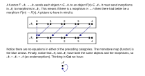
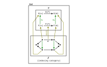
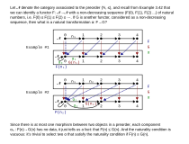
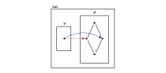
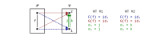
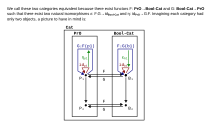
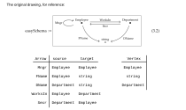
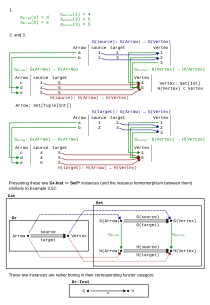

---
jupytext:
  text_representation:
    extension: .md
    format_name: myst
    format_version: 0.13
    jupytext_version: 1.14.1
kernelspec:
  display_name: Python 3 (ipykernel)
  language: python
  name: python3
---

# 3.3. Functors, natural transformations

## 3.3.2. Functors

Prerequisite to [Functor](https://en.wikipedia.org/wiki/Functor).

*Exercise* 3.37.

A fourth functor sends $F(m_0) = n_1$, $F(f_1) = n_1$, and $F(m_1) = n_1$ (that is, it sends
everything to $n_1$). A fifth functor sends everything to $n_2$. A sixth sends $F(m_0) = n_1$,
$F(f_1) = g_2$, and $F(m_1) = n_2$.

+++

*Exercise* 3.39.

*A'* is sent to *A*, f' to f, B' to B, g' to g, h' to h, C' to C, i' to i, and D' to D (covering eight
of the morphisms). The morphisms g';i' and f';h' are both sent to f;h = g;i.

+++

*Exercise* 3.40.

The only arrow in C (call it f) could be sent to either arrow in D (call them g and h). You can't
send f to both g and h because a functor only returns one morphism (like a function).

Said another way, you can't draw blue lines as in Example 3.36 between these two categories as a
"sufficient" answer (it doesn't fully specify a functor).

+++

*Example* 3.42.

See the errata. I'd go one step beyond the errata and rephrase this example as the following:

+++

*Exercise* 3.43.

Prerequisite to [Category of small
categories](https://en.wikipedia.org/wiki/Category_of_small_categories).

For `1.`, it's trivial to check the two properties required of a functor (preserving identities and
composition). The property (a) is satisfied by definition of sending every object (category) to
itself i.e. that $F(id_c) = id_c = id_{F(c)_{}}$. For property (b) we clearly have $F(f ⨾ g) = F(f)
⨾ F(g)$ because $F(f) = f$ and $F(g) = g$ and $F(f ⨾ g) = f ⨾ g$. Call this $id_{𝓒_{}} = F$.

For `2.`, we must first construct this second new functor $H$ where morphisms are functors. Use the
subscript $Ob$ to refer to the part of a functor that deals with mapping objects (categories). To
satisfy (i) in our definition of a functor, we construct the function $H_{Ob_{}} : Ob(C)$ → $Ob(E)$
by simply composing the two functions $F_{Ob_{}} : Ob(C)$ → $Ob(D)$ and $G_{Ob_{}} : Ob(D)$ →
$Ob(E)$. That is, $H_{Ob_{}} = F_{Ob_{}} ⨾ G_{Ob_{}}$.

To satisfy (ii), use the subscript $m$ to refer to the part of a functor that deals with mapping
morphisms (here, functors) between objects (categories). Our construction will simply compose the
two functions $F_m : C(c_1,c_2) → D(F(c_1),F(c_2))$ and $G_m : D(d_1,d_2)$ → $E(G(d_1),G(d_2))$.
That is, $H_m = F_m ⨾ G_m$.

Now we must check this construction $H$ preserves identities and composition. To show it preserves
identities we must show that for every object $c \in Ob(C)$ we have $H(id_c) = F⨾G(id_c) =
id_{F⨾G(c)_{}}$. Because $F$ and $G$ are both functors, we have that $F(id_c) = id_{F(c)_{}}$
(similarly for $G$) so that $F⨾G(id_c) = id_{F(c)_{}}⨾G = id_{G(F(c))_{}}$, which is equivalent to
what we wanted to show.

To show it preserves composition, we must show that for every morphism $f$ and $g$ in **Cat** where
the target of $f$ is the source of $g$ that $F⨾G(f⨾g) = F⨾G(f)⨾F⨾G(g)$. Because F and G are functors
we have $F⨾G(f⨾g) = F(f)⨾F(g);G = G(F(f)⨾F(g)) = G(F(f))⨾G(F(g))$. To summarize, because $F$ and $G$
preserve identities and composition then $H$ does as well.

For `3.`, we need to satisfy all the conditions in Definition 3.6. For (i), we are specifying a
collection of objects that is all categories. For (ii), for every two objects c,d the set C(c,d)
will be the set of all functors from the categories c and d. For (iii), we can use the identity
functor defined in part `1.` of this question. For (iv) we can use as our morphism the functor
defined in part `2.` of this question.

+++

## 3.3.3. Database instances as Set-valued functors

*Exercise* 3.35.

This function $F_S$ will map 1 to S, and $id_1$ to $id_S$. It preserves identities in the one case
it needs to, and it preserves composition because there is no composition to preserve.

+++

*Exercise* 3.48.

For `1.`, any involution. For example, if x ∈ ℝ then $f(x) = 1/x$.

For `2.`, any two-stage conversion where there are two different ways to do the same thing for the
second stage. For example, working hard to make money in the first stage, then using one of two
vendors (asking the same price) to convert the money to a good.

+++

## 3.3.4. Natural transformations

Prerequisite to [Natural transformation](https://en.wikipedia.org/wiki/Natural_transformation) and
[Functor category](https://en.wikipedia.org/wiki/Functor_category).

*Definition* 3.51.

Prerequisite to [Commutative diagram](https://en.wikipedia.org/wiki/Commutative_diagram) and
[Diagram (category theory)](https://en.wikipedia.org/wiki/Diagram_(category_theory)). Drawing this
definition on top of the second category in Example 3.52:

*Definition* 3.54.

In the category-theoretic view (and in some cases, the programming language view) we are looking at
functions as objects (first class citizens) when we go from thinking in 𝓒 → 𝓓 to $D^{C}$. In the
database view, we are re-viewing conversions between databases (sets of tables) as objects (see the
end of Exercise 3.64 below). That is, these reinterpretations happen when you step up one level of
abstraction here:

*Exercise* 3.55.

For `1.`, say we have natural transformations α and β, and want to construct a composite ɣ. For
every c ∈ 𝓒, define $\gamma_c = \alpha_c ⨾ \beta_c$. For a valuable proof of the naturality
condition, see the author's answer.

For `2.`, the functor F maps from some category 𝓒 to 𝓓. For every c ∈ 𝓒, construct a natural
transformation via a morphism $\iota_c: F(c) → F(c)$ in 𝓓 defined as $id_{F(c)_{}}$. To check
unitality, we observe $\iota_c ⨾ \alpha_c = \alpha_c$ and $\alpha_c ⨾ \iota_c = \alpha_c$.

+++

*Example* 3.57.

+++

*Exercise* 3.58.

For `1.`, this is true because a natural transformation is made up of many $\alpha_c$ that must
exist as morphisms in 𝓟. Because we're mapping to a preorder category, there will be at most only
choice for each of these $\alpha_c$, meaning there will be at most one natural transformation. If
there are zero choices for any $\alpha_c$, then the natural transformation doesn't exist. An example
with zero choices:

For `2.`, this is false, taking as a counterexample the categories in Example 3.52 but adding e.g.
another option parallel to $c$ between $v$ and $x$ (call it $h$). One could choose either $c$ or $h$
to construct a natural transformation. An even smaller counterexample:

+++

*Remark* 3.59.

See the errata for commentary from others on this section. Read through "Definition" in [Equivalence
of categories](https://en.wikipedia.org/wiki/Equivalence_of_categories) for help reinterpreting it.
The author is using id to refer to the identity functor in each category. The end of this section
should most likely be rewritten:

+++

## 3.3.5. The category of instances on a schema

Prerequisite to [Graph isomorphism](https://en.wikipedia.org/wiki/Graph_isomorphism).

*Exercise* 3.62.

+++

*Exercise* 3.64.

