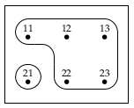

---
jupytext:
  text_representation:
    extension: .md
    format_name: myst
    format_version: 0.13
    jupytext_version: 1.14.1
kernelspec:
  display_name: Python 3 (ipykernel)
  language: python
  name: python3
---

# 1.1. More than the sum

**ERROR**:

> a solution can be found in Chapter 1

The author likely intends to refer to the appendix.

+++

*Exercise* 1.1.

An order-preserving function, part of the [Category of preordered
sets](https://en.wikipedia.org/wiki/Category_of_preordered_sets). See also [Order
theory](https://en.wikipedia.org/wiki/Order_theory):

$$
f(x) = x + 1
$$

A function that is not order-preserving:

$$
f(x) = -x
$$

A metric-preserving function:

$$
f(x) = x + 1
$$

A function that is not metric-preserving:

$$
f(x) = 2x
$$

An addition-preserving function:

$$
f(x) = 2x
$$

A function that is not addition-preserving:

$$
f(x) = x^2
$$

+++

## 1.1.1. A first look at generative effects

See [Category of topological spaces](https://en.wikipedia.org/wiki/Category_of_topological_spaces).

*Exercise* 1.4.

The author's drawing:

+++ {"tags": []}

## 1.1.2 Ordering systems

*Exercise* 1.6.

+++

+++

*Exercise* 1.7. Only the last (`4.`) is false.

### Subsection summary

[botr]: https://en.wikipedia.org/wiki/Binary_operation#Binary_operations_as_ternary_relations
[binr]: https://en.wikipedia.org/wiki/Binary_relation

See ["Observation preserves order but not join" in Applied Category Theory book - Math
SE](https://math.stackexchange.com/questions/3290331) for valuable commentary on section `1.1.2`.
For non-mathematicians this section in particular fails to address the (simple) difference between a
[Binary relation][binr] and a [Binary operation](https://en.wikipedia.org/wiki/Binary_operation).
Operations are convertible to relations (see [Binary operations as ternary relations][botr]) but are
in no way the same. As pointed out in a comment by John Baez on the Math SE question, what it means for each to preserve structure is rather different.

[mc]: https://en.wikipedia.org/wiki/Material_conditional
[lbc]: https://en.wikipedia.org/wiki/Logical_biconditional

That is, $\leq$ is a binary relation, and $\vee$ is a binary operation. The map $\Phi$ is an
order-preserving function because if $A \leq B$ it implies that $\Phi(A) \leq \Phi(B)$. The
order-preserving relationship (unlike the metric-preserving, addition-preserving, and
join-preserving relationships) does not require the result before and after to be equal. It's
defined so you only need the result of an order comparison before function application to *imply*
the result of an order comparison after function application (the [Material conditional][mc], not
the [Material biconditional][lbc]). For the function to be join-preserving, we need $\Phi(A) \vee
\Phi(B)$ (applying the function before) to *equal* $\Phi(A \vee B)$ (applying the function after).

In Section 1.2 you'll see that the following is a monotone map that shows how Φ is order-preserving:

In Section 1.4 you'll see that because this monotone map is not a left adjoint to any monotone map in the reverse direction, it does not preserve joins.

If you see much of engineering as a form of compression, then doing so in a non-lossy way (or a way in which we understand the losses) is critical. Any mental model (e.g. a causal DAG) is necessarily a compression of the excessive detail that a codebase includes. What features do we want the map to preserve?
