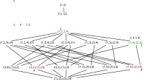
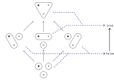

---
jupytext:
  text_representation:
    extension: .md
    format_name: myst
    format_version: 0.13
    jupytext_version: 1.16.1
kernelspec:
  display_name: Python 3 (ipykernel)
  language: python
  name: python3
---

# 1.1. More than the sum

+++


+++


+++

In a [Concrete category](https://en.wikipedia.org/wiki/Concrete_category) the morphisms are "structure-preserving" (which motivates this chapter). When we eventually get to category theory (in Chp. 3) we'll learn that functors are identity-preserving and composition-preserving. What we'll fill in for $x$ in $x$-preserving will eventually get quite interesting; e.g. manipulations of logical formulas will be truth-preserving (see [Formal system](https://en.wikipedia.org/wiki/Formal_system), or [Validity (logic) § Preservation](https://en.wikipedia.org/wiki/Validity_(logic)#Preservation)) or justification-preserving (see [Intuitionistic logic](https://en.wikipedia.org/wiki/Intuitionistic_logic)).

+++


+++

## Exercise 1.1.

+++


+++


+++

An order-preserving function, part of the [Category of preordered
sets](https://en.wikipedia.org/wiki/Category_of_preordered_sets). See also [Order
theory](https://en.wikipedia.org/wiki/Order_theory):

$$
f(x) = x + 1
$$

A function that is not order-preserving:

$$
f(x) = -x
$$

A metric-preserving function:

$$
f(x) = x + 1
$$

A function that is not metric-preserving:

$$
f(x) = 2x
$$

An addition-preserving function:

$$
f(x) = 2x
$$

A function that is not addition-preserving:

$$
f(x) = x^2
$$

+++

```{admonition} Reveal answer
:class: dropdown

```

+++

At the moment, we refer to all of these "preserving" operations as functions. We'll see later that the "right" word for them is "morphism" (more specifically, [Homomorphism](https://en.wikipedia.org/wiki/Homomorphism)). We implicitly assume above that e.g. the domain and codomain of $f(x)$ is e.g. ordered (e.g. the real numbers). If it was not ordered, how could we preserve order? Similarly, sets can have a "metric" defined on them (such as distance) which in some sense makes them "more" than sets. The term "function" will later be reserved for functions between sets, which technically have no "structure" such as order.

+++


+++

## 1.1.1. A first look at generative effects

+++

Prerequisite to [Category of topological spaces](https://en.wikipedia.org/wiki/Category_of_topological_spaces).

+++


+++


+++


+++

### Joining our simple systems

+++


+++

### Exercise 1.4.

+++


+++

```{admonition} Reveal answer
:class: dropdown

```

+++


+++

Read "extract information from raw data" as $f$ and "combine data" as · in [Homomorphism § Definition](https://en.wikipedia.org/wiki/Homomorphism#Definition).

+++

## 1.1.2 Ordering systems

+++


+++


+++


+++


+++


+++

### Exercise 1.6.

+++


+++

In this alternative solution, part `3.` is in blue, part `4.` is in red, and parts `5.` and `6.` are in green:

+++



+++

```{admonition} Reveal answer
:class: dropdown

```

+++


+++


+++

### Exercise 1.7.

+++


+++

```{admonition} Reveal answer
:class: dropdown

```

+++


+++

[botr]: https://en.wikipedia.org/wiki/Binary_operation#Binary_operations_as_ternary_relations
[binr]: https://en.wikipedia.org/wiki/Binary_relation

See ["Observation preserves order but not join" in Applied Category Theory book - Math SE](https://math.stackexchange.com/questions/3290331) for valuable commentary on section `1.1.2`. One major concept this section fails to address is the difference between a [Binary relation][binr] and a [Binary operation](https://en.wikipedia.org/wiki/Binary_operation). As pointed out in a comment by John Baez on the Math SE question, what it means for each to preserve structure is rather different:

> In general, a function 𝐹 preserves a binary operation ★ if 𝐹(𝐴★𝐵)=𝐹(𝐴)★𝐹(𝐵), and it preserves a relation ⊲ if 𝐴⊲𝐵 implies 𝐹(𝐴)⊲𝐹(𝐵).

The comment assumes "operation" means on the same set, when in fact this is not the case in the example in the text. It may be clearer to write these equations with subscripts on the operators:

$$
\begin{align}
F(A ★_C B) & = F(A) ★_D F(B) \\
A ⊲_C B & → F(A) ⊲_D F(B)
\end{align}
$$

Operations are convertible to relations (see [Binary operation § Binary operations as ternary relations][botr]). In fact, any function/operation can be seen as a relation that is total and functional (see [Binary relation](https://en.wikipedia.org/wiki/Binary_relation)). If we assume $A ★_C B = C$ then we can write these requirements in a more symmetric way:

$$
\begin{align}
(A ★_C B, C) & → (F(A) ★_D F(B), F(C)) \\
A ⊲_C B & → F(A) ⊲_D F(B)
\end{align}
$$

[mc]: https://en.wikipedia.org/wiki/Material_conditional
[lbc]: https://en.wikipedia.org/wiki/Logical_biconditional

To summarize, $\leq$ is a binary relation, and $\vee$ is a binary operation. The map $\Phi$ is an
order-preserving function because if $A \leq B$ it implies that $\Phi(A) \leq \Phi(B)$. The
order-preserving relationship (unlike the metric-preserving, addition-preserving, and
join-preserving relationships) does not require the result before and after to be equal. It's
defined so you only need the result of an order comparison before function application to *imply*
the result of an order comparison after function application (the [Material conditional][mc], not
the [Material biconditional][lbc]). For the function to be join-preserving, we need $\Phi(A) \vee
\Phi(B)$ (applying the function before) to *equal* $\Phi(A \vee B)$ (applying the function after).

See also the definition of operation-preserving in [Homomorphism § Definition](https://en.wikipedia.org/wiki/Homomorphism#Definition).

+++

### Relationship to other sections

+++

In Section 1.2 you'll see that the following is a monotone map that shows how Φ is order-preserving:



In Section 1.4 you'll see that because this monotone map is not a left adjoint to any monotone map in the reverse direction, it does not preserve joins.

+++

### Binary operations vs. binary functions

+++

According to [Binary function](https://en.wikipedia.org/wiki/Binary_function):

> A binary operation is a binary function where the sets X, Y, and Z are all equal; binary operations are often used to define algebraic structures.

To some degree this conflicts with the section [Binary operation § External binary operations](https://en.wikipedia.org/wiki/Binary_operation#External_binary_operations). It clearly conflicts with [Operation (mathematics) § Definition](https://en.wikipedia.org/wiki/Operation_(mathematics)#Definition), although the conflict is discussed at the bottom of the definition. This article claims to be authoritative with respect to the term operator, as well:

> An **operator** is similar to an operation in that it refers to the symbol or the process used to denote the operation, hence their point of view is different. For instance, one often speaks of "the operation of addition" or "the addition operation", when focusing on the operands and result, but one switches to "addition operator" (rarely "operator of addition"), when focusing on the process, or from the more symbolic viewpoint, the function +: X × X → X.

Strangely, this definition is supplied despite the warning at the top of the article:

> Not to be confused with [Operator (mathematics)](https://en.wikipedia.org/wiki/Operator_(mathematics)).

The parentheses in an article name generally indicate context, so it seems like defining **operator** in an mathematics article on what an "operation" is would still apply to the context of mathematics. The article [Operator (mathematics)](https://en.wikipedia.org/wiki/Operator_(mathematics)) seems to fully accept that the term is ambiguous. The fact that it is used (in all these articles) with functions as operations, without any mention of category theory (in which functions are morphisms), also indicates the language is not well-developed.

The conflict is also discussed in [terminology - What is the difference between functions and operations? - MSE](https://math.stackexchange.com/questions/1337355/what-is-the-difference-between-functions-and-operations). To make these words distinct, it seems more appropriate to use the definition requiring an operation to be closed.

Part of the issue here is that there's really no difference between using a symbol for a function vs. a name. That is, you can use the symbol ☆ (from [Star (glyph)](https://en.wikipedia.org/wiki/Star_(glyph))) or the function name `white_star`. You can use the symbol + (from [Plus and minus signs](https://en.wikipedia.org/wiki/Plus_and_minus_signs#Plus_sign), also on my keyboard) or the function name `plus`. Whether we choose one option over the other is almost exclusively decided by practical issues like what our keyboard and operating system supports conveniently. Unfortunately we'll tend to use the term "operator" when are using a symbol and the term "function" when we're using a string of symbols (there are four symbols/letters in the term `plus`). This extends even to programming languages (see [Order of operations](https://en.wikipedia.org/wiki/Order_of_operations), or [Operator overloading](https://en.wikipedia.org/wiki/Operator_overloading)) though in programming the term is often to extended to allow "operations" with 2 characters.

+++

### Relationship to other chapters

+++

Notice the similarity between what it means for a function to preserve a structure and the definition of a [Functor](https://en.wikipedia.org/wiki/Functor). Functors are in fact "structure-preserving" in the sense that they preserve composition. The goal of preserving composition is to preserve structure among the objects that the functions/morphisms act on however; see [Functor § Properties](https://en.wikipedia.org/wiki/Functor#Properties).

A structure-preserving function (morphism) never implies one in the reverse direction. For an example of a bidirectional structure-preserving morphism this with respect to relations, see [Isomorphism § Relation-preserving isomorphism](https://en.wikipedia.org/wiki/Isomorphism#Relation-preserving_isomorphism).

Note we'll use the term "map" for morphisms (structure-preserving functions) as well (see [Map (mathematics) § As morphisms](https://en.wikipedia.org/wiki/Map_(mathematics)#As_morphisms)).
