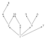
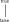
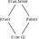
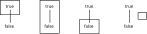
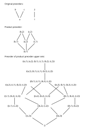
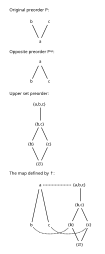

---
jupytext:
  text_representation:
    extension: .md
    format_name: myst
    format_version: 0.13
    jupytext_version: 1.16.1
kernelspec:
  display_name: Python 3 (ipykernel)
  language: python
  name: python3
---

# 1.2. What is order?

+++


+++

## 1.2.1. Review of sets, relations, and functions

+++


+++


+++


+++

In general, the term *natural numbers* is more ambiguous (see [Natural number](https://en.wikipedia.org/wiki/Natural_number)) about whether it includes zero, but this definition also apparently matches an ISO defintion.

+++


+++


+++

### *Exercise* 1.10

+++


+++

```{admonition} Reveal answer
:class: dropdown

```

+++


+++


+++

See also [Disjoint union](https://en.wikipedia.org/wiki/Disjoint_union).

+++

### *Exercise* 1.11

+++


+++

An alternative solution:
1. {}, {1}, {2}, {3}, {1,2}, {1,3}, {2,3}, {1,2,3}
2. ${1} \cup {2} = \{1,2\}$
3. (h,1), (h,2), (h,3), (1,1), (1,2), (1,3)
4. (h,1), (1,1), (1,2), (2,2), (3,2)
5. h, 1, 2, 3

+++

```{admonition} Reveal answer
:class: dropdown

```

+++


+++

### Partitions and equivalence relations

+++


+++


+++

### *Exercise* 1.16.

+++


+++

A shorter answer than the author's:

1. If there were more than one, then the first and second $p'$ would share elements.
2. If there were not at least one, then the $p$ would not partition the original set.

+++

```{admonition} Reveal answer
:class: dropdown

```

+++

### *Exercise* 1.17.

+++


+++


+++

```{admonition} Reveal answer
:class: dropdown

```

+++


+++


+++

### *Exercise* 1.20.

+++


+++

A shorter answer than the author's:

1. The definition of a $(\sim)$-connected subset includes that it is nonempty.
2. Consider the [Contraposition](https://en.wikipedia.org/wiki/Contraposition). If the union of the
   two sets was not empty, then there would be some element in both. If that was the case then the
   $(\sim)$-connected property would have unified the two sets.
3. Every element of $A$ must end up in at least one partition. Even if it was equivalent to no other
   element in the set, it would form a $(\sim)$-connected and $(\sim)$-closed subset on its own.

+++

```{admonition} Reveal answer
:class: dropdown

```

+++


+++

### Functions

+++


+++


+++

### *Exercise* 1.24.

+++


+++

An alternative solution:

1. $A = \{1\}$ and $B = \{a,b\}$, with $F(1) = b$
1. $B = \{1\}$ and $A = \{a,b\}$, with $F(a) = 1$ and $F(b) = 1$
1. Yes, No, No, Yes
1. Not injective or surjective, not because one domain element maps to two different codomain
   elements, not because one domain element does not map to any codomain element, bijective.

+++

```{admonition} Reveal answer
:class: dropdown

```

+++

### *Exercise* 1.25.

+++


+++

$A$ is empty because every domain element must map to one codomain element, and there are no
codomain elements.

+++

```{admonition} Reveal answer
:class: dropdown

```

+++

Not the same as [Function (mathematics) § Empty function](https://en.wikipedia.org/wiki/Function_(mathematics)#empty_function) (sometimes called the "unique function" by the author), unless the target is also the empty set.

+++


+++

### *Exercise* 1.27.

+++


+++

In reading order (top to bottom, left to right):

1. $F(\bullet) = a$, $F(\circ) = a$, $F(\ast) = a$
1. $F(\bullet) = a$, $F(\circ) = a$, $F(\ast) = b$
1. $F(\bullet) = a$, $F(\circ) = b$, $F(\ast) = a$
1. $F(\bullet) = a$, $F(\circ) = b$, $F(\ast) = b$
1. $F(\bullet) = a$, $F(\circ) = b$, $F(\ast) = c$

+++

```{admonition} Reveal answer
:class: dropdown

```

+++


+++

## 1.2.2. Preorders

+++


+++


+++


+++

See also [Preorder](https://en.wikipedia.org/wiki/Preorder) and [preorder](https://ncatlab.org/nlab/show/preorder). A subtlety that will only become obvious with time is that both these articles define a *preorder* as what the author here calls a *preorder relation*. The author defines *preoder* to mean what these articles would call a *proset*, a term that is analogous to *poset* from [Partially ordered set](https://en.wikipedia.org/wiki/Partially_ordered_set) and [partial order](https://ncatlab.org/nlab/show/partial+order) (and that the author also introduces soon). We'll prefer the term *proset*.

That is, a preorder is a binary relation on a particular set. If you want to consider only a particular set with a particular preorder defined on it, prefer the term proset (for brevity). If you'd like to refer to a set that has two different kinds of binary relations on it, prefer the term preorder (for clarity). For example, a set could have both a preorder and a partial order defined on it (though these would likely use different symbols, as in e.g. a [Ring (mathematics)](https://en.wikipedia.org/wiki/Ring_(mathematics))).

See also *loset* from [Total order](https://en.wikipedia.org/wiki/Total_order) and *toset* from [total order](https://ncatlab.org/nlab/show/total+order) (we'll prefer the latter).

+++


+++

See also [Discrete category](https://en.wikipedia.org/wiki/Discrete_category).

+++


+++


+++

See also [Skeleton (category theory)](https://en.wikipedia.org/wiki/Skeleton_(category_theory)).

+++


+++


+++


+++

### *Exercise* 1.38.

+++


+++

```{admonition} Reveal answer
:class: dropdown

```

+++


+++

### *Exercise* 1.40.

+++


+++

```{admonition} Reveal answer
:class: dropdown

```

+++

### *Exercise* 1.41.

+++


+++

Yes, as long as there is an implicit reflexive relationship.

+++

```{admonition} Reveal answer
:class: dropdown

```

+++

### *Exercise* 1.42.

+++


+++

There are 5 relations of an element with itself, 3 relations between the first and second rank, 3 relations between the second and third rank, and 1 between the first and third. For the meaning of the word "rank" here see [Attributes | Graphviz](https://graphviz.org/doc/info/attrs.html).

+++

```{admonition} Reveal answer
:class: dropdown

```

+++


+++

### *Exercise* 1.44.

+++


+++

Technically no because you can compare elements to themselves.

+++

```{admonition} Reveal answer
:class: dropdown

```

+++


+++

### *Exercise* 1.46.

+++


+++



+++

```{admonition} Reveal answer
:class: dropdown

```

+++


+++

### *Exercise* 1.48.

+++


+++

```{admonition} Reveal answer
:class: dropdown

```

+++


+++


+++

### *Exercise* 1.51

+++


+++

The Hasse diagram for $P(\varnothing)$ is trivial; there are no subsets. The Hasse diagram for
$P\{1\}$ and $P\{1,2\}$ are:


+++

```{admonition} Reveal answer
:class: dropdown

```

+++

### *Example* 1.52

+++


+++

The author is defining $Prt(A)$, which is rather unclear initially. In the second paragraph, notice the definition allows for $P$ to be equivalent to $Q$ (both finer and coarser?) if $h$ is an injective/bijective function. If $h$ is surjective, then you would get the arguably more natural (strict) definition of fine and coarse.

+++

### *Exercise* 1.53.

+++


+++

The coarsest partition corresponds to a function with a codomain of one element. The finest
partition corresponds to an identity function, where every unique element gets its own partition.

+++

```{admonition} Reveal answer
:class: dropdown

```

+++

### *Example* 1.54.

+++


+++

This example and the following questions have multiple issues. Let's repeat (𝔹,≤) (the boolean preorder); notice these are not sets:

+++



+++

To be clear, the set 𝔹 is {true,false}. An error in Exercise 1.65 makes it clear the author intended readers to compute the power set of 𝔹 as part of Exercise 1.51:

+++



+++

Let's draw a box around these four subsets in the power set in the original boolean preorder:

+++



+++

The author's definition of an "upper set" is any of these 4 sets (call each $U$) where if $p \in U$
and $p \leq q$, then $q \in U$. He intends us to go through all four of these sets and check if
this definition holds for them. The primary issue with this example is that his definition is just
plain wrong. Consider the definition applied to the $\{false\}$ set (calling it $U$); the author is
claiming that this set is an upper set if $false \in \{false\}$ in and $false \leq q$, then $q \in
U$. When does the author even define $q$? If we define $q$ to be $\{false\}$ then there's nothing
wrong with this set.

To avoid reverse-engineering the definition from the author's explanation of why $\{false\}$ is not
an upper set, see [Upper set](https://en.wikipedia.org/wiki/Upper_set). Using the variables that the
author uses rather than Wikipedia's, the definition of an upper set is then a set where for all $q
\in U$ and $p \in P$, if $q \leq p$, then $p \in U$. An even better definition for this context is
that an upper set is a set where for all $u \in U$ and $p \in P$, if $u \leq p$, then $p \in U$.
With either of these new definitions, the author's explanation of why $\{false\}$ is not an upper
set makes sense.

+++

### *Exercise* 1.55.

+++


+++

A discrete preorder has no relationship between any elements, so every element on its own is an
upper set. Adding a second element to any of these sets also creates an upper set, because again
there is no relationship between elements. You can continue this with a third and fourth element, in
any order, constructing in the end all of the possible subsets of $X$.

+++

```{admonition} Reveal answer
:class: dropdown

```

+++


+++

### *Exercise* 1.57.

+++


+++

The issues this question has are covered in [order theory - Understanding upper set preorders - Math
SE](https://math.stackexchange.com/questions/3787952) and multiple comments in the errata.



+++

The author's incorrect answer:

+++

```{admonition} Reveal answer
:class: dropdown

```

+++


+++

## 1.2.3. Monotone maps

+++


+++

See also [Monotonic function](https://en.wikipedia.org/wiki/Monotonic_function).

+++


+++


+++


+++


+++

### *Exercise* 1.63.

+++


+++

Taking step `1.` from Example 1.50:

+++


+++

```{admonition} Reveal answer
:class: dropdown

```

+++


+++

### *Exercise* 1.65.

+++


+++


+++

```{admonition} Reveal answer
:class: dropdown

```

+++

### *Exercise* 1.66.

+++


+++

This question is a notational nightmare; see [notation - Making sense of a map, given a new domain
and codomain - Math SE](https://math.stackexchange.com/questions/3307889/) for someone else's
helpful comments on it.

In `1.` let's call the ↑ operator the "upper closure" of an element $p$ in $P$ (following the
language in [Upper set](https://en.wikipedia.org/wiki/Upper_set)). The definition constructs an
upper set because it includes in its construction all elements that make $p$ satisfy the
requirements of being an element of an upper set. Because the ordering relationship is transitive,
any other element included in the set by this construction will also have the requirements for it to
be an element of an upper set satisfied.

[dot]: https://en.wikipedia.org/wiki/Duality_(order_theory)

Part `2.` of the question introduces the notation $P^{op}$ out of nowhere to refer to the opposite
preorder; see this notation used in [Duality (order theory)][dot] and [Opposite
category](https://en.wikipedia.org/wiki/Opposite_category).

The given construction will map every element $p \in P^{op}$ to a set $s \in U(P)$ where $s$ is an
"upper" set that includes $p$. With respect to $P^{op}$ this set will be the opposite of an "upper"
set; what we'll call a "lower" set with respect to $p$.

Remove the first "if" from part `3.` of the question to make it understandable/readable. To prove
the forward case, let's use the definition in `1.`:

$$
\uparrow p = A = \{a\in P\mid p\leq a\} \\
\uparrow p' = B = \{b\in P\mid p'\leq b\}
$$

So if $p \leq p'$ we have by [direct proof](https://en.wikipedia.org/wiki/Direct_proof) that:

$$
\uparrow p' = B = \{b\in P\mid p\leq p'\leq b\} \subseteq \{a\in P\mid p\leq a\} = A = \uparrow p
$$

The opposite implication is left as an exercise for the reader.

Part `4.` of this question should refer to Exercise 1.57 rather than Example 1.56:



+++

```{admonition} Reveal answer
:class: dropdown

```

+++


+++

See also [Yoneda lemma](https://en.wikipedia.org/wiki/Yoneda_lemma).

+++

### *Exercise* 1.67.

+++


+++

The monotonicity requirement is that for all $x,y \in A$, if $x \leq_{A} y$ then $f(x) \leq_B f(y)$.
The condition of the if statement is always false for a discrete preorder, so any function will
satisfy it.

+++

```{admonition} Reveal answer
:class: dropdown

```

+++


+++


+++

### *Exercise* 1.69.

+++


+++

Define the sets $X$ and $Y$:

$$
X = \{0,1,2,3\} \\
Y = \{A,B,C\}
$$

Define the surjective function $f$:

$$
f(0) = A \\
f(1) = A \\
f(2) = B \\
f(3) = C
$$

See [Partition of a set](https://en.wikipedia.org/wiki/Partition_of_a_set) for notation. Two
different partitions $P$ and $Q$:

$$
\begin{align} \\
P & = \{\{A,B\},\{C\}\} = A B | C \\
p(A) & = M \\
p(B) & = M \\
p(C) & = N \\
\end{align}
$$

$$
\begin{align} \\
Q & = \{\{A\},\{B,C\}\} = A | B C \\
q(A) & = M \\
q(B) & = N \\
q(C) & = N \\
\end{align}
$$

The composite $f⨟s$ for $P$ is:

$$
\begin{align} \\
f;p(0) & = M \\
f;p(1) & = M \\
f;p(2) & = M \\
f;p(3) & = N \\
f^\ast(P) & = 0 1 2 | 3 \\
\end{align}
$$

The composite $f⨟s$ for $Q$ is:

$$
\begin{align} \\
f;q(0) & = M \\
f;q(1) & = M \\
f;q(2) & = N \\
f;q(3) & = N \\
f^\ast(Q) & = 0 1 | 2 3 \\
\end{align}
$$

+++

```{admonition} Reveal answer
:class: dropdown

```

+++


+++


+++

### *Exercise* 1.71.

+++


+++

The identity function is monotone because if $x \leq y$ then $id_X(x) \leq id_X(y)$.

The composition of monotone functions is monotone because if $x \leq y$ then $f;g(x) \leq f;g(y)$.

+++

```{admonition} Reveal answer
:class: dropdown

```

+++

### *Exercise* 1.73.

+++


+++

Calling a preorder skeletal removes all equivalence sets (partitions), making every element its own
equivalence set (partition). This is a discrete preorder.

See also [Dagger category](https://en.wikipedia.org/wiki/Dagger_category).

+++

```{admonition} Reveal answer
:class: dropdown

```

+++

### *Definition* 1.75.

+++


+++

See also [Order isomorphism](https://en.wikipedia.org/wiki/Order_isomorphism).

+++


+++

### *Exercise* 1.77.

+++


+++

The function:

$$
\phi(\ast \bullet \circ) = true \\
\phi(\ast | \bullet \circ) = false \\
\phi(\ast \bullet | \circ) = true \\
\phi(\bullet | \ast \circ) = false \\
\phi(\ast | \bullet | \circ) = false
$$

The preorder:

$$
\phi(\ast | \bullet \circ) \leq \phi(\ast \bullet \circ) \\
\phi(\ast \bullet | \circ) \leq \phi(\ast \bullet \circ) \\
\phi(\bullet | \ast \circ) \leq \phi(\ast \bullet \circ) \\
\phi(\ast | \bullet | \circ) \leq \phi(\ast | \bullet \circ) \\
\phi(\ast | \bullet | \circ) \leq \phi(\ast \bullet | \circ) \\
\phi(\ast | \bullet | \circ) \leq \phi(\bullet | \ast \circ) \\
$$

By substitution:

$$
false \leq true \\
true \leq true \\
false \leq true \\
false \leq false \\
false \leq true \\
false \leq false \\
$$

+++

```{admonition} Reveal answer
:class: dropdown

```

+++


+++

### *Exercise* 1.79.

+++


+++

The function $u$ here defines an upper set by labeling all elements of $Q$ as either belonging to it
or not. The composition $f;u$ can then be understood as mapping an element of $P$ to an element in
$Q$, and again labeling it as belonging to the upper set or not.

+++

```{admonition} Reveal answer
:class: dropdown

```
