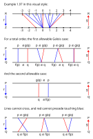
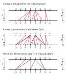
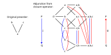
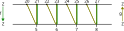

---
jupytext:
  text_representation:
    extension: .md
    format_name: myst
    format_version: 0.13
    jupytext_version: 1.16.1
kernelspec:
  display_name: Python 3 (ipykernel)
  language: python
  name: python3
---

# 1.4. Galois connections

```{code-cell} ipython3
from IPython.display import Image
```

See also [Galois connection](https://en.wikipedia.org/wiki/Galois_connection) and [Adjoint functors](https://en.wikipedia.org/wiki/Adjoint_functors).

+++

## 1.4.1. Definition and examples of Galois connections

+++

$$
\def\RR{{\bf R}}
\def\ZZ{{\bf Z}}
$$

+++


+++

Notice $f$ is on the left side of the left equation, and $g$ is on the right side of the right equation. Hence the names.

+++

### Example 1.97.

+++


+++

The first paragraph of this example should replace the dummy variable $x$ with $y$. Otherwise, it's
not clear in the next paragraph that $x$ is always a real number and $y$ is always an integer. The
relation in this example needs to hold for *any* real number and integer; e.g. the pair (x=3.1, y=2)
is always true, and (x=7.3, y=1) is always false. The author could have put this more precisely:

$$
\lceil x/3 \rceil \leq_\ZZ y \iff x \leq_\RR 3y
$$

Or as:

$$
\lceil r/3 \rceil \leq z \iff r \leq 3z
$$

[fsf]: https://en.wikipedia.org/wiki/Floor_and_ceiling_functions

See [Floor and ceiling functions][fsf]. By the definition of the ceiling function we have $x
\leq_\RR n \iff \lceil x \rceil \leq_\ZZ n$. If we substitute $x/3$ for $x$, and $y$ for $n$, we get
the result from the text.

+++

### Exercise 1.98.

+++


+++

We need a function from $\RR \to \ZZ$; an obvious function to try given the last example is $\lfloor
x/3 \rfloor$.

[fsf2]: https://en.wikipedia.org/wiki/Floor_and_ceiling_functions

See [Floor and ceiling functions][fsf2]. By the definition of the floor function we have $n \leq_\RR
x \iff n \leq_\ZZ \lfloor x \rfloor$. If we substitute $x/3$ for $x$, and $y$ for $n$, we get:

$$
\begin{align} \\
y \leq_\RR x/3 \iff y & \leq_\ZZ \lfloor x/3 \rfloor \\
3y \leq_\RR x \iff y  & \leq_\ZZ \lfloor x/3 \rfloor \\
\end{align}
$$

As expected the right adjoint is $\lfloor x/3 \rfloor$.

```{code-cell} ipython3
:tags: [hide-output]

Image('raster/2023-10-07T15-32-32.png', metadata={'description': "7S answer"})
```

### Exercise 1.99.

+++


+++

All of these cases (for part `1.`) are true, so $f$ is left adjoint to $g$:

$$
\begin{align} \\
f(p=1) & = 1 \leq q=1 \iff p=1 \leq g(q=1) = 2 \\
f(p=2) & = 1 \leq q=1 \iff p=2 \leq g(q=1) = 2 \\
f(p=3) & = 3 \leq q=1 \iff p=3 \leq g(q=1) = 2 \\
f(p=1) & = 1 \leq q=2 \iff p=1 \leq g(q=2) = 2 \\
f(p=2) & = 1 \leq q=2 \iff p=2 \leq g(q=2) = 2 \\
f(p=3) & = 3 \leq q=2 \iff p=3 \leq g(q=2) = 2 \\
f(p=1) & = 1 \leq q=3 \iff p=1 \leq g(q=3) = 3 \\
f(p=2) & = 1 \leq q=3 \iff p=2 \leq g(q=3) = 3 \\
f(p=3) & = 3 \leq q=3 \iff p=3 \leq g(q=3) = 3 \\
\end{align}
$$

As we work through the cases for `2.` we hit a failure:

$$
\begin{align} \\
f(p=1) & = 1 \leq q=1 \iff p=1 \leq g(q=1) = 2 \\
f(p=2) & = 2 \leq q=1 \iff p=2 \leq g(q=1) = 2 \\
\end{align}
$$

+++

```{admonition} Reveal answer
:class: dropdown

```

+++

### Remark 1.100.

+++


+++

The right adjoint is red:



+++

### Exercise 1.101.

+++


+++

We are interested in finding the function $f$:

$$
f(z) \leq r \iff z \leq \lceil r/3 \rceil
$$



To fix the corner cases, one could define $f(z)$ to be the first real number greater than $3(z-1)$.

Looking forward, one could use Theorem 1.115 to define a left adjoint, although it would also be in
an unsatisfying set-builder notation. Because $g(r) = \lceil r/3 \rceil$ preserves meets (trivial
given it's a total order), then by that theorem it should be a right adjoint.

The answer given in the Appendix seems wrong, with the logic failing at:

> In the same way, $L(1) \leq r$ for all $r > 0$, so $L(1) \leq 0$.

See also [galois theory - Is there a systematic way to find a left adjoint of a given monotone
function - Math SE](https://math.stackexchange.com/questions/3955264).

+++

```{admonition} Reveal answer
:class: dropdown

```

+++

## 1.4.2. Back to partitions

+++


+++


+++

The "?" in $\sim_T^?$ is meant to indicate that the relationship is "doubtful" to the author, something that is already stated in the text. If you're not familiar with this notation, it makes it hard to read this section (given the mental question mark of what this literal question mark means).

+++


+++

### Example 1.102

+++


+++

### Exercise 1.103.

+++


+++

The author asks for 6 examples in the question, then only bothers to do 4 in the Appendix. Doing so
many is probably not a great use of time; this answer includes 5 only because the same drawings can
be reused in the next question.


+++

```{admonition} Reveal answer
:class: dropdown

```

+++

### Exercise 1.105.

+++


+++


+++

```{admonition} Reveal answer
:class: dropdown

```

+++


+++

### Exercise 1.106.

+++


+++

The parenthetical remark in `3.` could be taken to mean you need to go back and fix your answer to
`1.` if you can't answer `3.`, because you apparently misunderstood something. More likely it simply
means you need to choose a partition in `1.` that allows for both a coarser partition in `2.` and a
non-coarser partition in `3.`.


+++

```{admonition} Reveal answer
:class: dropdown

```

+++

## 1.4.3. Basic theory of Galois connections

+++


+++

### Exercise 1.109.

+++


+++

For `1.` take any $q \in Q$ and let $p := g(q)$. With this definition we have $p \leq g(q)$,
which by the definition of a Galois connection implies $f(p) \leq q$. Substituting the definition of
$p$ in the last equation we get the desired result.

For `2.` suppose $p \leq g(q)$. Since $f$ is monotonic we have $f(p) \leq f(g(q))$, and substituting
$f(g(q)) \leq q$ we get the desired result $f(p) \leq q$.

+++


+++

```{admonition} Reveal answer
:class: dropdown

```

+++

### Exercise 1.110.

+++


+++

```{admonition} Reveal answer
:class: dropdown

```

+++

### Proposition 1.111

+++


+++

See [Complete lattice § Morphisms of complete lattices](https://en.wikipedia.org/wiki/Complete_lattice#Morphisms_of_complete_lattices) for comments on the categories **Sup** (for supremum) and **Inf** (for infimum). We preserve both meets and joins in complete lattice morphisms, but only e.g. joins in **Sup**. See also [Limit-preserving function (order theory)](https://en.wikipedia.org/wiki/Limit-preserving_function_(order_theory)).

+++

If you're trying to remember what kind of adjoint preserves which operation, you can match them up in alphabetical order. That is, **j**oin < **m**eet and **l**eft < **r**ight. It's also even the case that **j**oin < **l**eft < **l**ower < **m**eet < **r**ight < **u**pper so you could remember that **j**oins are preserved by **l**eft/**l**ower adjoints and **m**eets are preserved by **r**ight/**u**pper adjoints. In a less passive voice (a design perspective): to preserve a **j**oin you need a **l**eft/**l**ower adjoint and to preserve a **m**eet you need a **r**ight/**u**pper adjoint.

+++

### Exercise 1.112.

+++


+++

Let $A \in P$ be any subset and let $j := \vee A$ be its join. Then since $f$ is monotone $f(a) \leq
f(j)$ for all $a \in A$, so $f(j)$ is an upper bound for the set $f(A)$. We must now show it is the
least upper bound.

So take any other upper bound $b$ for $f(A)$; that is suppose that for all $a \in A$, we have $f(a)
\leq b$ and we want to show $f(j) \leq b$. Then by definition of $f$ being a left adjoint we also
have $a \leq g(b)$. However since $j$ is the least upper bound, we have $j \leq g(b)$. Again using
the Galois connection, we have $f(j) \leq b$, proving that $f(j)$ really is the least upper bound
for $f(A)$.

+++

```{admonition} Reveal answer
:class: dropdown

```

+++


+++


+++

### Exercise 1.114.

+++


+++

$$
\begin{align} \\
f(p=1)   & = 1 \leq q=1 \iff p=1   \leq g(q=1) = 1 \\
f(p=2)   & = 2 \leq q=1 \iff p=2   \leq g(q=1) = 1 \\
f(p=3.9) & = 4 \leq q=1 \iff p=3.9 \leq g(q=1) = 1 \\
f(p=4)   & = 4 \leq q=1 \iff p=4   \leq g(q=1) = 1 \\
f(p=1)   & = 1 \leq q=2 \iff p=1   \leq g(q=2) = 2 \\
f(p=2)   & = 2 \leq q=2 \iff p=2   \leq g(q=2) = 2 \\
f(p=3.9) & = 4 \leq q=2 \iff p=3.9 \leq g(q=2) = 2 \\
f(p=4)   & = 4 \leq q=2 \iff p=4   \leq g(q=2) = 2 \\
f(p=1)   & = 1 \leq q=4 \iff p=1   \leq g(q=4) = 4 \\
f(p=2)   & = 2 \leq q=4 \iff p=2   \leq g(q=4) = 4 \\
f(p=3.9) & = 4 \leq q=4 \iff p=3.9 \leq g(q=4) = 4 \\
f(p=4)   & = 4 \leq q=4 \iff p=4   \leq g(q=4) = 4 \\
\end{align}
$$

The second row in the solution for this question is incorrect.

+++

```{admonition} Reveal answer
:class: dropdown

```

+++

### Theorem 1.115.

+++


+++

For the more general adjoint functor theorem, see [Formal criteria for adjoint functors](https://en.wikipedia.org/wiki/Formal_criteria_for_adjoint_functors). In the case, preserving all joins generalizes to preserving all limits (see similar comments at the start of 1.3.2 in [Section 1.3](./1-3.md)).

+++

### Example 1.117.

+++


+++

The function $f_{!}$ is a left adjoint to $f^*$ (not $f_*$). Similarly $f_{*}$ is right adjoint to $f^*$ (not $f_!$). This notation directly or indirectly comes from [Galois connection](https://en.wikipedia.org/wiki/Galois_connection), which uses the terms "lower/upper" adjoint rather than "left/right" adjoint. This makes it easy to remember that $f_{*}$ is the "lower" adjoint because the asterisk is low relative to where it is in $f^{*}$.

+++

Nearly the exact same example is given [Universal quantification § As adjoint](https://en.wikipedia.org/wiki/Universal_quantification#As_adjoint), where $f^*$ = $f^*$ and $∃_f$ = $f_!$ and $∀_f$ = $f_*$. The logic in this section could be converted to code that could be used to compute the left and right adjoint given the inverse image functor.

+++

A related example is given in [A concrete intuition for Galois Connection - MSE](https://math.stackexchange.com/a/4470690/245548), where $f$ = $f_!$ and $g = f^*$. This example demonstrates that $s: R → F$ ($s$ for serves) need not be a function, just a relation $s: R × F$.

+++

These functors are also discussed in [Image functors for sheaves](https://en.wikipedia.org/wiki/Image_functors_for_sheaves), which has pointers to articles specific to each.

+++

This example looks superficially related to the content above Example 1.102, but the relationship may only be syntatical.

+++

### Exercise 1.118.

+++


+++

Selecting the function and subsets:

+++


+++

$$
\begin{align}
f^*(B_1) & = \{a_1, a_2\} \\
f^*(B_2) & = \{a_3\} \\
f_!(A_1) & = \{b_1\} \\
f_!(A_2) & = \{b_1, b_2\} \\
f_*(A_1) & = \{b_1\} \\
f_*(A_2) & = \{b_2\}
\end{align}
$$

+++

```{admonition} Reveal answer
:class: dropdown

```

+++

## 1.4.4. Closure operators

+++


+++


+++

See also [Closure operators on partially ordered sets](
https://en.wikipedia.org/wiki/Closure_operator#Closure_operators_on_partially_ordered_sets). Why do we use the term "interior operator" for the other composite? Search for "closure" in [Interior (topology)](https://en.wikipedia.org/wiki/Interior_(topology)). See also [Interior algebra § Modal logic](https://en.wikipedia.org/wiki/Interior_algebra#Modal_logic) and [Interior algebra § Definition](https://en.wikipedia.org/wiki/Interior_algebra#Definition).

+++

### Exercise 1.119: Adjunctions produce closures

+++


+++

For `1.`, this is simply a restatement of the first part of $p \leq g(f(p))$ in Proposition 1.107 but with different symbols.

For `2.`, define $q := f(p)$. Applying $f(g(q)) \leq q$, we have $f(g(f(p)) \leq f(p)$. Applying the
monotonicity property of $g$ we then have $g(f(g(f(p)))) \leq g(f(p))$, which is one half of what we
are trying to prove.

Define $p_1 := g(f(p))$, and apply $p_1 \leq g(f(p_1)$ to get $g(f(p)) \leq g(f(g(f(p))))$, the
second half of what we are trying to prove.

+++

```{admonition} Reveal answer
:class: dropdown

```

+++


+++

### Define **closure operator**

+++

In short, a closure operator is a monotone map with two extra properties. In [Closure operator](https://en.wikipedia.org/wiki/Closure_operator#Closure_operators_on_partially_ordered_sets) we replace:
- "monotone" with "increasing"
- Requirement (a) with "extensive"
- Requirement (b) with "idempotent"

Using the term "monotone" is in general a bit ambiguous/unhelpful, because it could be taken to mean that an increase in the input variable always leads to a decrease in the output variable (sometimes called "antitone"). If you're not using "monotone" alongside "antitone" it may be clearer to use "monotonically increasing" or simply "increasing" in its place. Per [Monotonic function § In order theory](https://en.wikipedia.org/wiki/Monotonic_function#In_order_theory), the terms "order-preserving" and "order-reversing" are likely even clearer.

In [Galois connection](https://en.wikipedia.org/wiki/Galois_connection), the term "extensive" is replaced with "inflationary" which also seems like a good choice. This term lets us use "deflationary" with interior operators, and avoids a term that seems to have been invented for the sake of closure operators (see [Extensive](https://en.wikipedia.org/wiki/Extensive)).

+++

### Example 1.121: Computation closures

+++


+++

Applying a closure operator always gets you something bigger or equal; applying an interior operator always gets you something smaller or equal. The closure of a set such as [0,1) is bigger, specifically [0,1] (adding one point). The interior of the same set is smaller, specifically (0,1) (losing one point).

+++

If you're more familiar with the language of "reducing" expressions in computation, it could be a struggle to remember the definition of a closure if you associate it with reductions. See [Abstract rewriting system](https://en.wikipedia.org/wiki/Abstract_rewriting_system) for a discussion of how this word is entrenched in the language of these systems. It may be better to see a "reduction" as a rewrite to something better (bigger is better) but better because it's smaller (e.g. compressed). A refactor changes code to something "better" via a rewrite that doesn't change behavior, as well.

+++

A transitive closure always produces something clearly "bigger" as well (filling in holes in the binary relation, see Exercise 1.125 below). The convex hull (pictured on [Closure operator](https://en.wikipedia.org/wiki/Closure_operator)) is also clearly "bigger" than its starting point.

+++

### Example 1.122: Closures produce adjunctions

+++


+++

For the term "inclusion" used in this example, see [Inclusion map](https://en.wikipedia.org/wiki/Inclusion_map). See also [Fixed point (mathematics)](https://en.wikipedia.org/wiki/Fixed_point_(mathematics)).

+++

See [Upper set](https://en.wikipedia.org/wiki/Upper_set) for the definition of an upper closure; let's compute
this closure on a simple preorder:

+++



+++

### Example 1.123: Logic closures

+++


+++

See also [Modal operator](https://en.wikipedia.org/wiki/Modal_operator), although the article [Modal logic](https://en.wikipedia.org/wiki/Modal_logic) provides a much more complete introduction to these two operators. See [Geometric Shapes (Unicode block)](https://en.wikipedia.org/wiki/Geometric_Shapes_(Unicode_block)) for "white medium square" (□) and "lozenge" (◊).

For more on propositional logic, see [forall x: Calgary. An Introduction to Formal Logic](https://forallx.openlogicproject.org/html/).

+++

### Which function is left and right?

If you suspect or feel confident you have two functions that are adjoints, how do you determine which is left/right? In the examples in Section 1.4.1 above, the author establishes a convention that the left adjoint is a function from the top to bottom of a diagram and the right adjoint is a function from bottom to top. This means the label for the left adjoint (colored blue in most examples) is on an arrow going from top to bottom.

This doesn't help if you don't know which set to put on the top and bottom. Consider the following example, where we're stripping the blue/red clue:



Recognize that the scales on your diagram don't matter. You should be able to stretch/scale or shift to the left/right the scales on top and bottom.

Form what will be either a closure or interior operator by composing the two functions; in this case we'll compose them as $h_1=f⨟g$ i.e. $h_1=g∘f$. On all pairs on top and bottom, check whether your composed function h is increasing (*extensive* per [Closure operator](https://en.wikipedia.org/wiki/Closure_operator)) or decreasing. Similarly, form the opposite function $h_2=f∘g$ and apply the same tests.

If either function is not increasing or decreasing (both can be non-strictly), or what they do is not opposite, then you don't have an adjoint pair. Choose whichever function is not an identity, and pattern match it against the definitions of a closure/interior operator in this section to determine which is left/right.

In the example above, $h_1$ is extensive and $h_2$ is the identity function. Therefore $f$ is the left adjoint, and $g$ is the right adjoint (this drawing isn't actually too different than the one for Example 1.97 above).

+++

## 1.4.5. Level shifting

+++


+++

See [Category of preordered sets](https://en.wikipedia.org/wiki/Category_of_preordered_sets).

+++

### Exercise 1.124: Binary relation preorders

+++


+++


+++

```{admonition} Reveal answer
:class: dropdown

```

+++

### Exercise 1.125: Preorder preorder

+++


+++


+++

For `1.` define the preorder $\leq$:

$$
\begin{align}
1 \leq 3 \\
2 \leq 3
\end{align}
$$

Then we have $U(\leq) = \{(1,3), (2,3), (1,1), (2,2), (3,3)\}$.

+++

For `2.` take the binary relations:

$$
\begin{align}
Q = \{(1,3)\} \\
Q' = \{(3,1)\}
\end{align}
$$

+++

For `3.` see Example 1.22 above; the authors are implying $Cl$ is a closure and therefore a left adjoint. Notice that even in [Closure operator](https://en.wikipedia.org/wiki/Closure_operator) the article writers use $cl$ for a closure (rather than $j$ as above).

For now we'll only show that $Cl$ is monotone (not a closure):

$$
Cl(Q) = Cl(\{1,3)\}) = Cl(\{(1,3), (1,1), (2,2), (3,3)\})
$$

The preorder $Cl(Q)$:

$$
1 \leq 3
$$

Clearly $Cl(Q) \sqsubseteq \leq$ (see $\leq$ defined in `1.` above). For `4.` we have:

$$
Cl(Q') = Cl(\{3,1)\}) = Cl(\{(3,1), (1,1), (2,2), (3,3)\})
$$

The preorder $Cl(Q')$:

$$
3 \leq 1
$$

Clearly $Cl(Q) \not\sqsubseteq \leq$.

+++

```{admonition} Reveal answer
:class: dropdown

```
