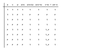

---
jupytext:
  text_representation:
    extension: .md
    format_name: myst
    format_version: 0.13
    jupytext_version: 1.14.1
kernelspec:
  display_name: Python 3 (ipykernel)
  language: python
  name: python3
---

# 2.5. Computing presented …

+++


+++

## 2.5.1. Monoidal closed preorders

+++


+++

Prerequisite to [Closed monoidal category](https://en.wikipedia.org/wiki/Closed_monoidal_category). Later, with the background of Chp. 3, read [Closed category](https://en.wikipedia.org/wiki/Closed_category) for a better explanation of how categories of this type enrich themselves. It looks like the author is defining the word "hom-element" as the hom-set for the category; perhaps because preorders have at most one element in their hom-set we can get away with this.

+++

### *Exercise* 2.82.

+++

For `1.` let's define:

$$
f(s) ≔ s \otimes v
$$

Given $x_1 \leq y_1$ where $x_1, y_1 \in \mathcal{V}$, we must show that:

$$
f(x_1) \leq f(x_2) ↔ x_1 \otimes v \leq y_1 \otimes v
$$

If we set:

$$
v ≔ x_2 ≔ y_2
$$

Then we have by reflexivity:

$$
x_2 \leq y_2
$$

And can use (a) in Definition 2.2. to conclude:

$$
x_1 \otimes v \leq y_1 \otimes v ↔ x_1 \otimes x_2 \leq y_1 \otimes y_2
$$

For `2.` let's define:

$$
m ≔ v ⊸ w
$$

By reflexivity:

$$
m ≤ v ⊸ w
$$

Using the fact that $\mathcal{V}$ is closed we have:

$$
m ⊗ v ≤ w
$$

Which is what we intended to show. See nearly the same answer in part (c) of Proposition 2.87.

For `3.` let's define:

$$
g(s) ≔ v ⊸ s
$$

Given $x \leq y$ where $x, y \in \mathcal{V}$, we must show that:

$$
g(x) \leq g(x) ↔ (v ⊸ x) \leq (v ⊸ y)
$$

Starting with:

$$
x \leq y
$$

Including the result from `2.` with $x$ replacing $w$:

$$
(v ⊸ x) ⊗ v \leq x \leq y
$$

Then using the fact that $\mathcal{V}$ is closed, we have what we intended to show:

$$
((v ⊸ x) ⊗ v) \leq y ↔ (v ⊸ x) \leq (v ⊸ y)
$$

For `4.`, notice that in `2.` and `3.` we only showed the reverse; that being monoidal closed
implies that (v ⊸ -) is a monotone map. A quick review of Definition 1.95 makes it clear that this
means (v ⊸ -) is a right adjoint however, and this definition has the same structure as Definition
2.79.

+++

### *Example* 2.83.

+++

We start with:

$$
a + x ≥ y
$$

Subtracting $x$ from both sides:

$$
a ≥ y - x
$$

Applying $max(0,-)$ to both sides:

$$
max(0,a) ≥ max(0,y - x)
$$

How is $v ⊸ w$ an example of a "single-use v-to-w converter"? If you have a $v$, you can use the monoidal product (+) to get a $w$ because $v + max(0, w - v) ≤ w$.

+++

### *Exercise* 2.84.

+++



Note $w∨ ¬v ⇔ v ⇒ w$.

How is $v ⊸ w$ an example of a "single-use v-to-w converter"? If you have a $v$, you can use the monoidal product (∧) to get a $w$ because $v ∧ (w∨ ¬v) = v ∧ w ≤ w$.

+++

### *Remark* 2.89.

+++

Some examples of categories enriched in themselves (i.e. closed):
- **Bool**-category **Bool**
- **Cost**-category **Cost**
- **Set**-category **Set**

+++

## 2.5.2. Quantales

+++

### Definition 2.90.

+++


+++

See also [Infimum and supremum](https://en.wikipedia.org/wiki/Infimum_and_supremum).

Prerequisite to [Quantale](https://en.wikipedia.org/wiki/Quantale). A unital commutative quantale is a symmetric monoidal closed preorder that has all joins. A unital quantale is a monoidal closed preorder that has all joins. This corresponds to the following alternative definition from the Wikipedia article:

> A unital quantale may be defined equivalently as a monoid in the category Sup of complete join semi-lattices.

The primary definition used by the Wikipedia article (based on a distributive property) is discussed in Proposition 2.98 below.

If we strip the term "unital" from quantale we wouldn't be able to call the preorder "monoidal" anymore because that would require unitality. A monoid without an identity element is a semigroup; the term semigroup isn't used too often because it's easier to say a set that has nothing but a closed (see [Magma (algebra)](https://en.wikipedia.org/wiki/Magma_(algebra))) associative binary operation. The Wikipedia article includes this definition by saying they are sometimes called *complete [residuated semigroups](https://en.wikipedia.org/wiki/Residuated_lattice#Residuated_semilattice)*.

At a high level the term "quantale" brings together order theory and basic algebraic structures.

The concept of a quantale is closely tied to binary relations. See [Relation algebra](https://en.wikipedia.org/wiki/Relation_algebra) and [Algebraic logic / Calculus of relations](https://en.wikipedia.org/wiki/Algebraic_logic#Calculus_of_relations) and [this comment](https://math.stackexchange.com/questions/175169/direct-products-in-the-category-rel#comment408729_175193).

+++

### *Example* 2.91.

+++


+++

### *Exercise* 2.92.

+++


+++

1a. False \
1b. ∞ \
2a. The usual logical or \
2b. The minimum of the numbers (using the usual order of the reals)

+++

### *Exercise* 2.93.

+++


+++

We already defined the join for the empty set. For the singleton sets {T} and {F} the join is simply
the same element of the set. For the set {T,F} the join is T.

+++

### *Exercise* 2.94.

+++


+++

Yes; the join of the empty set will be the empty set (the least element). The join of any singleton
set (e.g. $\{\{T\}\}$ or $\{\{F\}\}$ in **Bool**) will be the same element. All sets of subsets will
have a join that is the union of the included subsets.

+++ {"tags": []}

### *Remark* 2.92

+++


+++ {"tags": []}

### *Proposition 2.96*

+++


+++

This proof is tricky; see [Joins and Meets in Preorder - Mathematics Stack Exchange](https://math.stackexchange.com/questions/3846876/joins-and-meets-in-preorder) for a question specific to it and this text. To "have all joins" doesn't mean (as in the definition of a [Semilattice](https://en.wikipedia.org/wiki/Semilattice)) that a join exists for *any nonempty finite subset*. That is, a semilattice has all nonempty joins. A preorder that has all joins has all joins in the sense of Definition 2.90 here; a join exists even for the empty set. A preorder has all joins if it has a bottom element, which can obviously always serve as the meet of any subset that would otherwise not have one. The author intends to restrict quantales to being based on a preorder that is a [Complete lattice](https://en.wikipedia.org/wiki/Complete_lattice).

+++


+++

## 2.5.3. Matrix multiplication in a quantale

Why is it necessary to be closed and have all joins to support matrix multiplication? The general definition of matrix multiplication uses joins, i.e. they seem to be required by how we choose to define our general form form of matrix multiplication. It's likely that being closed is necessary so that we have the distributive law as in Eq. (2.88).

For a longer list of fields that matrix multiplication is possible in, see [torch.Tensor](https://pytorch.org/docs/stable/tensors.html).

See also:
- [Two-element Boolean algebra](https://en.wikipedia.org/wiki/Two-element_Boolean_algebra)
- [Boolean matrix](https://en.wikipedia.org/wiki/Boolean_matrix)

+++

### *Exercise* 2.103.

+++

$$
\begin{pmatrix}
1 & 0\\\
0 & 1
\end{pmatrix}
$$

$$
\begin{pmatrix}
true  & false\\\
false & true
\end{pmatrix}
$$

$$
\begin{pmatrix}
0 & ∞\\\
∞ & 0
\end{pmatrix}
$$

+++

### *Exercise* 2.104.

+++

For `1.` we have:

$$
(I * M)(w,y) ≔ \bigvee_{x \in X} I(w,x) \otimes M(x,y) \\
(I * M)(w,y) ≔ I(w,w) \otimes M(w,y) \vee \bigvee_{x \in X \setminus \{w\}} 0 \otimes M(x,y)
$$

Using Definition 2.2. part (a), any $0 \otimes x$ term is always $0$, so this reduces to:

$$
(I * M)(w,y) ≔ M(w,y)
$$

For `2.` we have:

$$
((M * N) * P)(w,z) = \bigvee_{y \in Y} \big( \bigvee_{x \in X} M(w,x) ⊗ N(x,y) \big) ⊗ P(y,z)
$$

Using symmetry, part (b) of Proposition 2.87, and symmetry again:

$$
((M * N) * P)(w,z) = \bigvee_{y \in Y} \bigvee_{x \in X} M(w,x) ⊗ N(x,y) ⊗ P(y,z)
$$

Pulling out $M(w,x)$ with part (b) of Proposition 2.87 again, we have:

$$
\bigvee_{x \in X} M(w,x) ⊗ \big( \bigvee_{y \in Y} N(x,y) ⊗ P(y,z) \big) = (M * (N * P))(w,z)
$$

+++

### *Exercise* 2.105.

```{code-cell} ipython3
import numpy as np

inf = float("inf")
M1 = np.array([[0, inf, 3, inf], [2, 0 , inf, 5], [inf, 3, 0 , inf], [inf, inf, 6, 0]])

# See https://stackoverflow.com/a/55986817/622049
M2 = np.min(M1[:,:,None] + M1[None,:,:], axis=1)
M3 = np.min(M2[:,:,None] + M1[None,:,:], axis=1)
M4 = np.min(M2[:,:,None] + M2[None,:,:], axis=1)

M1, M2, M3, M4
```
