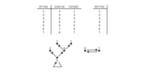
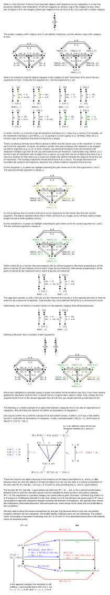
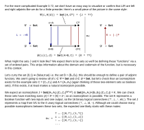
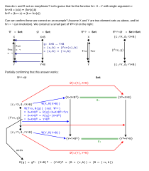
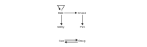

---
jupytext:
  text_representation:
    extension: .md
    format_name: myst
    format_version: 0.13
    jupytext_version: 1.14.1
kernelspec:
  display_name: Python 3 (ipykernel)
  language: python
  name: python3
---

# 3.4. Adjunctions and data migration

+++


+++

## 3.4.1. Pulling back data along a functor

+++


+++


+++

### Exercise 3.67.

+++


+++

Every arrow indicates "this is the state that I came from" (the source). You could use this diagram
to work back to how you could have gotten to some final state:



+++

```{admonition} Reveal 7S answer
:class: dropdown

```

+++


+++


+++

## 3.4.2. Adjunctions

+++


+++

### Definition 3.70.

+++


+++


+++

[dvhsa]: https://en.wikipedia.org/wiki/Adjoint_functors#Definition_via_Hom-set_adjunction

Read through [Adjoint functors](https://en.wikipedia.org/wiki/Adjoint_functors) and in particular
the section [Definition via Hom-set adjunction][dvhsa] for a more detailed version of this
definition. Unfortunately, the Wikipedia article describes the left adjoint from 𝓓 → 𝓒 (opposite the
authors). You'll have to switch these two letters everywhere to read it. In particular, this switch
implies the objects X in the Wikipedia definition correspond to the objects d in the author's
definition (and the objects Y correspond to the objects c). In the diagram in Wikipedia's defintion,
you'll need to switch the morphisms f and g, as well as reflect the whole diagram across a vertical
line in the center of the diagram.

If two morphisms are inverses, then $f⨾g = id_A$ and $g⨾f = id_B$, and we say that A and B are
isomorphic objects. We call $f$ more specifically an "isomorphism" rather than a morphism. We call
$f$ and $g$ "inverses" but more specifically they are inverse morphisms (or "object" isomorphisms)
(not inverse functors, which act between categories).

[weoc]: https://en.wikipedia.org/wiki/Equivalence_of_categories
[wioc]: https://en.wikipedia.org/wiki/Isomorphism_of_categories

See instead Remark 3.59 and the concept of an [Equivalence of categories][weoc] for examples of
"inverse" functors. Strictly speaking, an equivalence of categories only requires that isomorphic
objects in the first category correspond to isomorphic objects in the second category (think of a
map between preorders rather than partial orders). An [Isomorphism of categories][wioc] would
require a "true" inverse functor.

[whf]: https://en.wikipedia.org/wiki/Hom_functor

An adjunction relaxes the concept of "inverse" even more than an equivalence of categories does. It
complicates the concept of a [Hom-functor][whf] (a single bifunctor) by effectively introducing two
bifunctors (that now act on different categories) to the category of sets. The category of sets
provides a "middle ground" that is used to define a natural relationship.

+++

### Example 3.71.

+++


+++



¹[Product category - Wikipedia](https://en.wikipedia.org/wiki/Product_category)

+++

### Example 3.72.

+++


+++



See also [Exponential object](https://en.wikipedia.org/wiki/Exponential_object).

+++

### Exercise 3.73.

+++


+++



For 3. we are defining a new function that adds 3. That is, `p(3) := (b) ↦ 3 + b`

+++

```{admonition} Reveal 7S answer
:class: dropdown

```

+++

### Example 3.74.

+++


+++

## 3.4.3 Left and right pushforward functors, Σ and Π

+++


+++


+++


+++

## 3.4.4. Single set summaries of databases

+++


+++

### Exercise 3.76.

+++


+++

This functor sends all objects to the object 1 and all morphisms to id₁.

+++

```{admonition} Reveal 7S answer
:class: dropdown

```

+++


+++

### Exercise 3.78.

+++


+++



+++

```{admonition} Reveal 7S answer
:class: dropdown

```

+++


