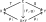
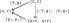
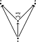

---
jupytext:
  text_representation:
    extension: .md
    format_name: myst
    format_version: 0.13
    jupytext_version: 1.14.1
kernelspec:
  display_name: Python 3 (ipykernel)
  language: python
  name: python3
---

# 3.5. Bonus: limits and colimits

## 3.5.1. Terminal objects and products

Prerequisite to [Initial and terminal objects](
https://en.wikipedia.org/wiki/Initial_and_terminal_objects).

+++

### *Exercise* 3.81.

No object in the preorder will have a unique morphism for every object C in 𝓒 to it, except the top
object, because there will be no morphism at all from the top object to it. The top object will be a
terminal object because every other object in a preorder will have only one morphism to it (there is
at most one morphism between any two objects in a preorder category).

+++

### *Exercise* 3.82.

The category **1**. In **Cat** the objects are categories and the morphisms are functors, and there
will be one unique functor "!" to every category as given in Eq. (3.75).

+++

### *Exercise* 3.83.

The category with two objects and two parallel morphisms between them. There are only two candidate
objects for the terminal object. The object with two morphisms out of it is not the terminal object
because there is no unique morphism between the object and it (there are zero morphisms). The object
with two morphisms into it is not the terminal object because the only other object has two
morphisms to it rather than one.

+++

### *Definition* 3.86.

See [Universal property / Examples / Products - Wikipedia](https://en.wikipedia.org/wiki/Universal_property#Products) for a similar definition. How does this article's commutative diagram relate to the author's? The commutative diagram provided in the text:

Doubling up the objects/morphisms so we can "fold" the right wing onto the left wing:

Flipping the diagram and using notation from the Wikipedia article:

Notice the conflict in language between the author and the article as well; what has a universal property? In the text, objects (terminal objects, product objects) have a universal property. In the Wikipedia article, universal morphisms (an object/morphism pair) have the universal property. It seems the Wikipedia article wants to define a globally unique object/morphism pair, which isn't really possible with just an object. See Remark 3.85 and [category theory - Why are two universal objects isomorphic? - Mathematics Stack Exchange](https://math.stackexchange.com/questions/59101/why-are-two-universal-objects-isomorphic). That is, there can be two univeral objects, but there is really only one of each object/morphism pair. We call it a universal morphism because the morphism part of the pair really does most of the defining.

See [universal - Wiktionary](https://en.wiktionary.org/wiki/universal). The term "universal" in this context means "useful for many purposes" in the sense that the universal object is useful like a universal wrench. The universal object or universal object/morphism is by no means common to all members of the set.

+++

### *Exercise* 3.88.

Only the elements c in 𝓒 where c ≤ x and c ≤ y are candidates for the product of x and y because they are the only elements that will have a $p_X$ and $p_Y$ (in the language of Definition 3.86) that point to x and y. These other elements will not satisfy the definition of a product, however, because there will be no $〈f,g〉$ between the element and the meet x ∧ y (since the meet is the greatest element that is less than both x and y). That is, there an arrow from c → x×y in the following diagram, but no arrow in the reverse direction:

For the meet x ∧ y, the $〈f,g〉$ morphism is the only morphism that exists between all the lesser elements and it. In a preorder there is at most one morphism between objects, so to call the arrow c → x×y "unique" (or to make it dashed/dotted) is potentially confusing.

+++

### *Example* 3.89.

Compare to [Product category](https://en.wikipedia.org/wiki/Product_category). How does this fit into the current section? This example is a construction, while Example 3.86 (which corresponds to [Product (category theory)](https://en.wikipedia.org/wiki/Product_(category_theory))) is a definition. That is, Definition 3.86 indirectly specifies a universal property that product objects should satisfy, but there may be multiple ways to construct any object that satisfies a universal property.

+++

### *Exercise* 3.90.

The identity morphisms in a product category are the pairs of identity morphisms in the two
composing categories.

Composition in a product category is associative because composition in each of the composing
categories is.

The product category **1** × **2** has two objects (1,1) and (1,2). The only non-identity morphism
is $(id_{1}, p_{12})$.

The product category when P and Q are preorders is the "product" preorder, as described in Example
1.56. and Exercise 1.57.

+++

## 3.5.2. Limits

Prerequisite to [Limit (category theory)](https://en.wikipedia.org/wiki/Limit_(category_theory)) and
[Cone (category theory)](https://en.wikipedia.org/wiki/Cone_(category_theory)).

+++

### Dotted, dashed, and unique *to*

In [Universal property](https://en.wikipedia.org/wiki/Universal_property) and other articles, the unique morphism that exists because of some universal property is typically dashed. The author uses dotted lines because he has already committed to using dashed lines for functors between categories. We'll follow the author only to have a potentially richer language.

What's more of a problem is how the word "unique" is thrown around in both online articles and the text, and the first paragraph of this section highlights the conflict: why is the "unique" map $C → X×Y$ associated with the product not sufficient to qualify as the "unique" morphism required of a terminal object in Definition 3.79? Why isn't a product already a terminal object.

See [unique - Wiktionary](https://en.wiktionary.org/wiki/unique). In the definition of a terminal object, we're using the term "unique" to mean "Being the only one of its kind" (the first definition of the word). In the definition of a product object, we're using the term "unique" to mean "Particular, characteristic" or said another way, we mean to say the morphism is unique *to* some other morphism. When we move to the category of cones, the product cone will become "unique" in the global sense.

Said another way, see [Initial and terminal objects](https://en.wikipedia.org/wiki/Initial_and_terminal_objects). In this context "unique" means the the cardinality of the set of morphisms between the two objects is one, no more or less.

It's easy to verify this looking at e.g. the diagram at the bottom of Example 3.87. The diagram indicates ∃! (there exists a unique map) from C to the product category. But clearly, there is not just one map from an arbitrary set (e.g. {1,2,3}) to a product category. The morphism in this diagram is unique *to* $f$ and $g$.

Said another way, there is a one-to-one mapping (a bijection, not an injection) between these morphisms. The language "one-to-one" is used in e.g. Exercise 5.23 later in the text (the author uses "one-to-one correspondence" frequently, apparently always for a bijection). Because we're usually working with regular categories (**Set**-categories) the hom-objects are sets and these bijections are actually between sets. From [universal construction in nLab](https://ncatlab.org/nlab/show/universal+construction):

> The universal property of the product says that giving a map to A×B is the same as giving a map to A and a map to B, and moreover this correspondence is natural in some precise sense.
>
> Similarly, given rings R and S, if we want to extend a ring homomorphism R→S to a homomorphism from the polynomial ring R[x]→S, all we have to do is to specify an element of S that we send x to. In other words, a homomorphism R[x]→S is the same as a homomorphism R→S and an element of S.
>
> For it to be a universal property, just the existence of such a bijection is not sufficient. We will need some conditions to make sure the bijection is “natural”. Abstractly, this says that the bijection is given by a natural isomorphism of certain functors.

The fact that the commutative diagram "commutes" over the whole category is what leads to this bijection. When we move to the category of cones, where you can think of each of the objects as commutative diagrams, then you may notice that one commutative diagram is special or stands out among all the rest.

Whenever you see someone say "For any ... there exists a unique" (as in [Universal property](https://en.wikipedia.org/wiki/Universal_property)) (as in the start of this section) you can probably shorten their language to "unique to" in one way or another.

+++

### *Exercise* 3.91.

Notice the symmetry between the last diagram of Definition 3.86 and the diagram immediately above
Exercise 3.91; both of these diagrams depict two cones but with different labels on the graph
elements. In the first, we are claiming that for all cones centered on C there is a unique morphism
to the cone centered on the product X × Y. Thinking in terms of a terminal object in **Cone**(X,Y),
this is equivalent to claiming that there exists a unique morphism !: C → Z = (X ← X × Y → Y) which
is referred to as 〈f,g〉 for each object C of 𝓒.

+++

### *Definition* 3.92.

Example 3.87 is Definition 3.92 where 𝓙 specifically points to the objects $X=\{1,2,3,4,5,6\}$ and
$Y=\{1,2,3,4\}$ in **Set**. While 𝓙 may be abstract, D points to specific objects in 𝓒. This can be
confusing if you think of D as a "diagram" and conflate it with 𝓙.

It can be tempting to think that two indexes are necessary; one that indexes the objects in 𝓙 and
one that indexes all the ways that 𝓙 can map onto 𝓒. The latter index is not necessary for the
reason given above. In some sense, though, the category **Cone**(D) provides a second level of
indexing.

In the last paragraph, the term "projections" is chosen with the products in mind. See the picture
at the bottom of Example 3.87 for a visualization; the product relation can be "projected" into
either X or Y.

+++

## 3.5.3. Finite limits in Set

+++

### *Exercise* 3.97.

Call $v$ and $w$ in the diagram in Example 3.94 $v_1$ and $v_2$ to make that application of the
definition easier. With this, it's easier to see how the set-builder notation being used in Theorem
3.95 boils down to the set-builder notation used at the start of Example 3.87 (notice $A$ is empty).

+++

### *Exercise* 3.98.

Call the one element in $1$ by $v_1$ to make the application of the definition easier, and use the
name $X$ for the target of the functor D. The limit is just the set itself. Looking at Definition
3.92 one can think any other set that has the set $X$ as the codomain (target) as a cone in
**Cone**(D), and the projection map of the limit as $id_X$.

+++

### *Example* 3.99.

Prerequisite to [Pullback (category theory)](
https://en.wikipedia.org/wiki/Pullback_(category_theory)).

+++

## 3.5.4. A brief note on colimits

### *Example* 3.101.

We can have $F^{op}$ map the same objects and morphisms to the same objects and morphisms that $F$
did.
