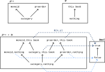

---
jupytext:
  text_representation:
    extension: .md
    format_name: myst
    format_version: 0.13
    jupytext_version: 1.14.1
kernelspec:
  display_name: Python 3 (ipykernel)
  language: python
  name: python3
---

# 4.2. Enriched profunctors

+++

## 4.2.1. Feasibility relationships as profunctors

Prerequisite to [Profunctor](https://en.wikipedia.org/wiki/Profunctor). It's habit to read $\bf{Prof}_\mathcal{V}$ as short for "proficiency" but it's obviously short for profunctor in this context. In [Profunctor - The bicategory of profunctors](https://en.wikipedia.org/wiki/Profunctor#The_bicategory_of_profunctors) it's defined as a bicategory (in this text it's a regular category, by requiring the underlying quantale to be skeletal).

The first paragraph of this section seems to be making the point that this "availability" or "less useful" relationship that you can think about a preorder as defining applies to both the needs (Y) and the output (X) of a feasibility relation. You may want to use the letters P (produced) and R (required) when possible, as he does earlier. Also notice that, perhaps counter-intuitively, the arrow ↛ associated with a $\mathcal{V}$-profunctor is from the produced to the required resources (opposite the causal direction, and the direction of diagrams in Chp. 2).

+++

*Definition* 4.2.

Immediately below this definition, the author mentions that the requirement that Φ is monotone says that if $x' ≤_X x$ and $y ≤_Y y'$ then $Φ(x,y) ≤_{Bool} Φ(x',y')$. How does he construct this observation?

We know that 𝓧ᵒᵖ and 𝓨 are 𝓥-categories (specifically **Bool**-categories). So their 𝓥-product (**Bool**-product) (see Definition 2.74) is the **Bool**-category 𝓧ᵒᵖ × 𝓨 with: \
(i) Ob(𝓧ᵒᵖ × 𝓨) = Ob(𝓧ᵒᵖ) × Ob(𝓨) \
(ii) 𝓧ᵒᵖ × 𝓨$((x,y),(x',y'))$ := 𝓧ᵒᵖ$(x,x')$ ⊗ 𝓨$(y,y')$

For two objects $(x,y)$ and $(x',y')$ in Ob(𝓧ᵒᵖ × 𝓨).

Because Φ is a monotone map (a **Bool**-functor) we also have (see Definition 2.69) that for all $(x,y),(x',y')$ ∈ Ob(𝓧ᵒᵖ × 𝓨) that: \
𝓧ᵒᵖ × 𝓨$((x,y),(x',y'))$ := \
𝓧ᵒᵖ$(x,x')$ ⊗ 𝓨$(y,y')$ = \
𝓧ᵒᵖ$(x,x')$ ∧ 𝓨$(y,y')$ $≤_{Bool}$ \
𝓥$(Φ(x,y),Φ(x',y'))$ = \
**Bool**$(Φ(x,y),Φ(x',y'))$

The author's statement is a more English-language version of the previous equation. That is, if $x' ≤_X x$ (i.e. 𝓧ᵒᵖ$(x,x')$) and (i.e. ∧) $y ≤_Y y'$ then (i.e. $≤_{Bool}$) $Φ(x,y) ≤_{Bool} Φ(x',y')$ (i.e. **Bool**$(Φ(x,y),Φ(x',y'))$).

We can extend this statement a bit farther given that **Bool** is a quantale. Reread **Bool**$(Φ(x,y),Φ(x',y'))$ as Φ(x,y) ⇒ Φ(x',y'). Then using Eq. (4.5) where we let b = 𝓧ᵒᵖ$(x,x')$ ∧ 𝓨$(y,y')$ we have that: \
(𝓧ᵒᵖ$(x,x')$ ∧ 𝓨$(y,y')$) ∧ Φ(x,y) ≤ Φ(x',y') \
𝓧ᵒᵖ$(x,x')$ ∧ Φ(x,y) ∧ 𝓨$(y,y')$ ≤ Φ(x',y')

In other words, if $x' ≤_X x$ and it's feasible to obtain x given y and (3) $y ≤_X y'$, then it should be feasible to obtain x' given y'.

You can see the logic above as taking the more general Definition 4.8. and applying it to **Bool**.

+++

*Exercise* 4.4.

The Hasse diagram and profunctor:



A monotone map to **Bool** defines an upper set; see Proposition 1.78. One possible interpretation is that the upper set defines "what works" in this particular context. If we get more resources i.e. a new $y'$ where $y ≤_Y y'$ then what we had working should still work. If we have fewer needs i.e. a new $x'$ where $x' ≤_X x$ (so that in the opposite category $x ≤_{X^{op}} x'$) then the same should also be possible. If "this book" was enough to understand a category, then it should also be enough to understand a monoid (which is lesser). Note that (confusingly) we use the symbol $≤_{X^{op}}$ to mean the same as ≥ (where ≥ has its normal meaning in a linear order); see comments on Exercise 2.39 in [](./2-2.md). In this context:


+++

*Exercise* 4.7.

How is **Bool** self-enriched? See Remark 2.89. Notice we *define* it to be self-enriched in a particular way, using ⇒. In Exercise 2.84 we checked that it's possible to come up with any (in this case, there is only one) relation that makes **Bool** self-enriched. See that answer for a table that also answers this question.

+++

## 4.2.2. V-profunctors

+++

*Exercise* 4.9.

We know that 𝓧ᵒᵖ and 𝓨 are 𝓥-categories, so their 𝓥-product (see Definition 2.74) is the 𝓥-category 𝓧ᵒᵖ × 𝓨 with: \
(i) Ob(𝓧ᵒᵖ × 𝓨) = Ob(𝓧ᵒᵖ) × Ob(𝓨) \
(ii) 𝓧ᵒᵖ × 𝓨$((x,y),(x',y'))$ := 𝓧ᵒᵖ$(x,x')$ ⊗ 𝓨$(y,y')$

For two objects $(x,y)$ and $(x',y')$ in Ob(𝓧ᵒᵖ × 𝓨).

Because Φ is a 𝓥-functor we also have (see Definition 2.69) that for all $(x,y),(x',y')$ ∈ Ob(𝓧ᵒᵖ × 𝓨) that: \
𝓧ᵒᵖ × 𝓨$((x,y),(x',y'))$ := \
𝓧ᵒᵖ$(x,x')$ ⊗ 𝓨$(y,y')$ = \
𝓧ᵒᵖ$(x,x')$ ∧ 𝓨$(y,y')$ $≤_{V}$ \
𝓥$(Φ(x,y),Φ(x',y'))$

See Remark 2.89. We will define 𝓥$(Φ(x,y),Φ(x',y'))$ to equal Φ(x,y) ⊸ Φ(x',y') i.e. we will consider 𝓥 as enriched in itself. Then using Eq. (2.80) where we let a = 𝓧ᵒᵖ$(x,x')$ ⊗ 𝓨$(y,y')$ we have that: \
(𝓧ᵒᵖ$(x,x')$ ⊗ 𝓨$(y,y')$) ⊗ Φ(x,y) ≤ Φ(x',y') \
𝓧ᵒᵖ$(x,x')$ ⊗ Φ(x,y) ⊗ 𝓨$(y,y')$ ≤ Φ(x',y')

In the author's solution, he almost surely meant to refer to Definition 2.69 rather than Definition 2.41 (which is specific to monotone maps).

+++

*Exercise* 4.10.

According to Definition 4.8, a **Bool**-profunctor from 𝓧 to 𝓨 is a 𝓥-functor (**Bool**-functor, i.e. monotone map):

Φ: 𝓧ᵒᵖ × 𝓨 → 𝓥 = **Bool**

Both 𝓧 and 𝓨 must be **Bool**-categories i.e. preorders.

There do not appear to be any subtle differences in the definitions.

+++

*Exercise* 4.12.


+++

*Exercise* 4.15.


+++

*Exercise* 4.17.

```{code-cell} ipython3
import numpy as np

inf = float("inf")
MX1 = np.array([[0, inf, 3, inf], [2, 0 , inf, 5], [inf, 3, 0 , inf], [inf, inf, 6, 0]])
MY1 = np.array([[0, 4, 3], [3, 0, inf], [inf, 4, 0]])
MΦ = np.array([[inf, inf, inf], [11, inf, inf], [inf, inf, inf], [inf, 9, inf]])

# See https://stackoverflow.com/a/55986817/622049
MX2 = np.min(MX1[:,:,None] + MX1[None,:,:], axis=1)
MX3 = np.min(MX2[:,:,None] + MX1[None,:,:], axis=1)
MY2 = np.min(MY1[:,:,None] + MY1[None,:,:], axis=1)
temp = np.min(MX3[:,:,None] + MΦ[None,:,:], axis=1)
res = np.min(temp[:,:,None] + MY2[None,:,:], axis=1)

MX1, MX2, MX3, MΦ, MY1, MY2, res
```

## 4.2.3. Back to co-design diagrams

+++

*Exercise* 4.18.

The lack of an arrow indicates it's not possible to produce a (g/n, funny) movie from any of the inputs i.e. not even given $1M.
