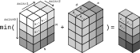
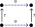
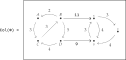

---
jupytext:
  text_representation:
    extension: .md
    format_name: myst
    format_version: 0.13
    jupytext_version: 1.14.1
kernelspec:
  display_name: Python 3 (ipykernel)
  language: python
  name: python3
---

# 4.3. Categories of profunctors

## 4.3.1. Composing profunctors

*Definition* 4.21.

This definition uses inconsistent variable names; see a comment in the errata.


*Exercise* 4.22.

```{code-cell} ipython3
import numpy as np

def add_min_dot(A, B):
    return np.min(A[:,:,None] + B[None,:,:], axis=1)
```

The function `add_min_dot` is from [custom matrix multiplication with numpy - Stack Overflow](https://stackoverflow.com/questions/55985900/custom-matrix-multiplication-with-numpy/55986817#55986817). See also [Matrix multiplication](https://en.wikipedia.org/wiki/Matrix_multiplication#Generalizations). For multiplying an M×N and N×P matrix, the broadcasting version constructs an M×N×P matrix. The M×N matrix is duplicated P times so you have P copies of all M rows (M·P rows). The N×P matrix is duplicated so you have M copies of all P columns (M·P columns). Then we take the equivalent of the dot product across all those columns and rows:




Interpreted in terms of the comments above Eq. (4.20), one can see the N dimension in the intermediate `A[:,:,None] + B[None,:,:]` as documenting the costs of all possible paths between some fixed `m` and `p`, which we then compress into a single answer. Said another way, the equivalent of the dot product is finding the minimum cost between some fixed `m` and `p`.

```{code-cell} ipython3
import pandas as pd

inf = float("inf")

Φ = pd.DataFrame(
    index=["A","B","C","D"],
    columns=["x","y","z"],
    data=np.array(
        [[17, 20, 20],
         [11, 14, 14],
         [14, 17, 17],
         [12,  9, 15]])
)
display(Φ)

MY2 = pd.DataFrame(
    index=["x","y","z"],
    columns=["x","y","z"],
    data=np.array(
        [[0, 4, 3],
         [3, 0, 6],
         [7, 4, 0]])
)
display(MY2)

MZ1 = pd.DataFrame(
    index=["p","q","r","s"],
    columns=["p","q","r","s"],
    data=np.array(
        [[0, 2, inf, inf],
         [inf, 0, 2, inf],
         [inf, inf, 0, 1],
         [1, inf, inf, 0]])
)
display(MZ1)
MZ3 = pd.DataFrame(
    index=["p","q","r","s"],
    columns=["p","q","r","s"],
    data=add_min_dot(MZ1.to_numpy(), add_min_dot(MZ1.to_numpy(), MZ1.to_numpy()))
)
display(MZ3)

MΨ = np.array([[inf, inf, inf, inf], [inf, inf, 0, inf], [4, inf, inf, 4]])

Ψ = pd.DataFrame(
    index=["x","y","z"],
    columns=["p","q","r","s"],
    data=add_min_dot(MY2.to_numpy(), add_min_dot(MΨ, MZ3.to_numpy()))
)
display(Ψ)

ΦΨ = pd.DataFrame(
    index=["A","B","C","D"],
    columns=["p","q","r","s"],
    data=add_min_dot(Φ.to_numpy(), Ψ.to_numpy())
)
display(ΦΨ)
```

## 4.3.2. The categories 𝓥-Prof and Feas

+++

*Exercise* 4.26.



+++

*Exercise* 4.30.

For part `1.` of this question, the first step (an `=`) is justified by the unitality of the underlying symmetric monoidal preorder structure (see `(b)` of Definition 2.2).

The second step (a `≤`) is justified by the fact that this is a 𝓥-category so that $I$ < 𝓟$(p,p)$ as well as the *monotonicity* property of a symmetric monoidal preorder (see `(a)` of Definition 2.2.).

The third step (a `≤`) is justified based on the definition of a join (Definition 1.81). Clearly 𝓟$(p,p)$ ⊗ Φ$(p,q)$ is a member of the set defined by 𝓟$(p,p₁)$ ⊗ Φ$(p₁,q)$ for all p₁ ∈ 𝓟, so it should be ≤ the join of that set.

The last step (an `=`) is justified by both Eq. 4.25 (meaning $U_\mathcal{P}(x,y) := \mathcal{P}(x,y)$ in this context) and the definition of the composite of profunctors in Definition 4.21.

---

For part `2.` we only need to address the second and third steps, since the first and fourth are already equalities. The author uses the term "directly" here because for **Bool** we can make this more direct proof without needing part `3.`. We only generalize the result to non-**Bool** cases by completing part `3.`.

For the second step, because $I = true$ and the monoidal product ⊗ is ∧ (logical and), as well that $\mathcal{P}(p,p)$ is true by definition, we have an equality. We could replace both these terms with Φ$(p,q)$.

For the third step we only need to consider two situations: that Φ$(p,q)$ is true and that it is false. If it's true then the join must also be true, since Φ$(p,q)$ is a member of the set and it's true. If Φ$(p,q)$ is false, then we know that any Φ$(p₁,q)$ where p₁ ≥ p is also false (and any x ⊗ false is false, so all those terms are false in the join). And if p₁ ≤ p, then we know that $\mathcal{P}(p,p₁)$ is also false (and any x ⊗ false is false, so all those terms are false in the join). This is exhaustive, so the join is also false.

---

For part `3.`, the first step (an `=`)  is justified by the unitality of the underlying symmetric monoidal preorder structure (see `(b)` of Definition 2.2).

The second step (a `≤`) is justified by the fact that this is a 𝓥-category so that $I$ < 𝓟$(p,p)$ as well as the *monotonicity* property of a symmetric monoidal preorder (see `(a)` of Definition 2.2.).

The last step (a `≤`) is justified by the relationship shown in Exercise 4.9.

+++

*Exercise* 4.31.

Starting from Definition 4.21:

$$
(\Phi⨟\Psi)(p,r)=\bigvee_{q\in Q}\big(\Phi(p,q)\otimes\Psi(q,r)\big)
$$

We can extend this to:

$$
((\Phi⨟\Psi)⨟\Upsilon)(p,s) = \
  \bigvee_{r\in R}\Big(\bigvee_{q\in Q}\Phi(p,q)\otimes\Psi(q,r)\Big)\otimes\Upsilon(r,s)
$$

Take Eq. (2.88) and replace the isomorphism with an equality because 𝓥 is skeletal, and apply:

$$
((\Phi⨟\Psi)⨟\Upsilon)(p,s) = (\Phi⨟\Psi⨟\Upsilon)(p,s) = \
  \bigvee_{r\in R}\bigvee_{q\in Q}\Phi(p,q)\otimes\Psi(q,r)\otimes\Upsilon(r,s)
$$

We can similarly produce the same for the right-hand side of the equation in Lemma 3.41.

+++ {"tags": []}

## 4.3.3. Fun profunctor facts: companions, conjoints, collages

It may be helpful to think of a profunctor as "proto functor" (generalization of a functor).

% Based on https://math.meta.stackexchange.com/a/13081/245548

$$
\newcommand{\ovs}[1]{\overset{\smile}{#1}}
\newcommand{\ovf}[1]{\overset{\frown}{#1}}
$$

+++

*Exercise* 4.36.

The identity function id is defined as $F(p) = p$. Since $\ovf{F} = \mathcal{Q}(F(p), q) = \mathcal{Q}(p, q)$, and $\mathcal{Q} = \mathcal{P}$ for the identity functor, we have that $\mathcal{Q}(p, q) = \mathcal{P}(p, q) = U_{\mathcal{P}}(p, q)$.

+++

*Exercise* 4.38.

The conjoint $\ovs{+}: ℝ ⇸ (ℝ × ℝ × ℝ)$ would be the function that sends $(a, b, c, d)$ to true if $a ≤ b + c + d$ and false otherwise.

+++

*Exercise* 4.41.

For part `1.` of this question, let's start with the definition of: $\ovf{F}(p,q) = \mathcal{Q}(F(p),q)$ from Definition 4.34. Notice this already matches the right-hand side of Eq. (4.40).

For the definition of $\ovs{G}(p,q)$, see Definition 4.34 again. Applying the definition is somewhat confusing because the order of the arguments $p$ and $q$ are reversed, as well as the order of the letters in the signature $G: \mathcal{Q} → \mathcal{P}$, but you should end up with $\ovs{G}(p,q) = \mathcal{P}(p, G(q))$. This matches the left-hand side of Eq. (4.40).

Eq. (4.40) expresses an isomorphism but given we are working with a skeletal quantale we can infer an equality.

---

For part `2.` let's first show that $\ovf{id}$ and $\ovs{id}$ are adjoints:

$$
\mathcal{P}(p, G(q)) = \mathcal{Q}(F(p),q)
$$

We have that $\mathcal{P} = \mathcal{Q}$:

$$
\mathcal{P}(p, G(q)) = \mathcal{P}(F(p),q)
$$

Then if $F = G = id$ we have:

$$
\begin{align}
\mathcal{P}(p, F(q)) & = \mathcal{P}(F(p),q) \\
\mathcal{P}(p, q)    & = \mathcal{P}(p,q)
\end{align}
$$

Since they are adjoints we have that $\ovf{F} = \ovs{G}$ and therefore that $\ovf{id} = \ovs{id}$.

+++

*Exercise* 4.44.


