---
jupytext:
  text_representation:
    extension: .md
    format_name: myst
    format_version: 0.13
    jupytext_version: 1.14.1
kernelspec:
  display_name: Python 3 (ipykernel)
  language: python
  name: python3
---

+++ {"tags": []}

# 4.5. Profunctors form a compact

+++ {"tags": []}

## 4.5.1. Compact closed categories

+++

**Definition 4.58**

+++

Alternatively, see [Dual object](https://en.wikipedia.org/wiki/Dual_object). To review, from [Natural transformation - natural isomorphism](https://en.wikipedia.org/wiki/Natural_transformation#natural_isomorphism):

> If, for every object $X$ in $C$, the morphism $\eta_X$ is an isomorphism in $D$, then $\eta$ is said to be a natural isomorphism.

You can also see a natural isomorphism as an "isomophism of functors" per [Natural transformation - natural isomorphism](https://en.wikipedia.org/wiki/Natural_transformation#natural_isomorphism), which we could visually express:

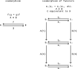

See also [Equivalence of categories - Alternative characterizations](https://en.wikipedia.org/wiki/Equivalence_of_categories#Alternative_characterizations) and the discussion of full/faithful functors.

When we have an isomorphism we can use the more familiar term "inverse" (see Definition 3.28) so it may also be appropriate to say that all components of a natural isomorphism have an inverse. In Definition 1.75 we say that the monotone functions are inverses, so it may even be appropriate to call $\eta$ and $\alpha$ in the image above inverses.

In the case of preorders, if x ≤ y and y ≤ x then we would use "approximately equal to" in Unicode to express x ≅ y, i.e. that the two objects are isomorphic (in some sense, equivalent). In Definition 1.75 we defined an isomorphism between preorders, and could have used the same symbol to express that P ≅ Q (the functors i.e. monotone functions are "approximately" the same). This symbol is freely used in [Monoidal category](https://en.wikipedia.org/wiki/Monoidal_category) for natural isomorphisms and in several places in the text.

Both functors and monotone functions are only defined for all objects and morphisms in the source category 𝓒 (not the target category 𝓓, see e.g. Example 3.52) but an isomorphism implies the target and source categories have the same number of objects. If that wasn't the case, there couldn't be an isomorphism for every object (see also [Inverse function](https://en.wikipedia.org/wiki/Inverse_function)).

The author uses the term "relaxed" (as opposed to approximate) to refer to adjunctions between categories (or Galois connections); the article [Adjoint functors](https://en.wikipedia.org/wiki/Adjoint_functors) uses "weak" in the same place. So an adjunction is a "relaxed/weak" relationship, which is different and weaker than an "equivalent/approximately equal to" relationship. Using the equations from [Adjoint functors - Definition via counit–unit adjunction](https://en.wikipedia.org/wiki/Adjoint_functors#Definition_via_counit%E2%80%93unit_adjunction) and the adjunction from Example 1.99 we could express this:

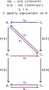

+++

The earlier (short) *Remark* 4.33 roughly maps to the following sentence from [Dual object](https://en.wikipedia.org/wiki/Dual_object):

> If we consider a monoidal category as a bicategory with one object, a dual pair is exactly an adjoint pair.

Similarly, from the article [Bicategory](https://en.wikipedia.org/wiki/Bicategory):

> Some more coherence axioms, similar to those needed for monoidal categories, are moreover required to hold: a monoidal category is the same as a bicategory with one 0-cell.

To try to summarize, we can see a compact closed category as being a bicategory with a single hom-category **B**(x,x). If we interpret the objects in this hom-category as morphisms, then every object/morphism has both a left and right adjoint somewhere else in the hom-category. A left dual is the same as a left adjoint, and a right dual is the same as a right adjoint.

The author's choice to restrict definitions to skeletal quantales before and after this section means we can replace natural isomorphisms ("approximately equal to" in Unicode i.e. ≅) with equalities (decategorification). Unfortunately the author also (properly) uses ≅ in his formal definitions (such as Definition 4.58) which is likely to confuse the reader when they come back to conversations about e.g. $\bf{Prof}_\mathcal{V}$. An isomorphism of functors must be stated through many coherence conditions i.e. a lot of details which we can also avoid here.

+++

**Commutative diagram for snake equations**

How do we read Eq. (4.59)? In the author's definition of a [Symmetric monoidal category](https://en.wikipedia.org/wiki/Symmetric_monoidal_category) (Rough Definition 4.45) he does not provide the direction of several natural isomorphisms, so we will pull these details from [Compact closed category](https://en.wikipedia.org/wiki/Compact_closed_category):

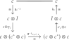

When we form c⊗I are we in general forming a tuple? In the case of set we are (with the cartesian product), as well as in the case of monoidal preorders (product preorder). Since ⊗ is a bifunctor, its domain will always be a [Product category](https://en.wikipedia.org/wiki/Product_category). Since c⊗I is a member of the product category, you can also use the internal hom to get a 𝓒 from it.

How does ⊗ act on morphisms? Per Definition 3.35, to preserve composition means that $F(f⨾g) = F(f)⨾F(g)$ or in this case $⊗(f⨾g) = ⊗(f)⨾⊗(g)$. But ⊗ acts on a product category, so preserving composition means that for all morphism pairs $(f,g)$ ⨾ $(f',g')$ in $\mathcal{C}×\mathcal{C}$ we have that:

$$
\begin{align}
⊗((f,g)⨟(f',g')) &= ⊗(f,g)⨟⊗(f',g') \\
⊗((f⨟f',g⨟g')) = (f⨟f')⊗(g⨟g') &= (f⊗g)⨟(f'⊗g')
\end{align}
$$

The second step uses component-wise composition from [Product category](https://en.wikipedia.org/wiki/Product_category) (or Example 3.89). In terms of string diagrams, it's equivalent to saying that concatenating vertically and then horizontally is the same as concatenating horizontally then vertically.

That is, consider the following from [PROP (category theory)](https://en.wikipedia.org/wiki/PROP_(category_theory)):

> The compatibility of composition and product thus boils down to:
>
> $(A \otimes B) \circ (C \otimes D) = \begin{bmatrix} A & 0 \\ 0 & B \end{bmatrix} \circ \begin{bmatrix} C & 0 \\ 0 & D \end{bmatrix} = \begin{bmatrix} AC & 0 \\ 0 & BD \end{bmatrix} = (A \circ C) \otimes (B \circ D)$

As a wiring diagram you can see both sides of the equation as:

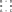

This result doesn't match the 4th bullet point in Example 4.49. It seems likely this bullet point is just wrong. It seems to be stating:

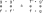

Our result also matches point `(ii)` in Definition 2.74 and makes more intuitive sense; parallelizing the double-arrows should be the same as two parallelized arrows in series.

+++

**Wiring diagram for snake equations**

The author references [A survey of graphical languages for monoidal categories - 0908.3347.pdf](https://arxiv.org/pdf/0908.3347.pdf) at the end of section 4.6; it's also referenced in the section [String diagram - Hierarchy of graphical languages](https://en.wikipedia.org/wiki/String_diagram#Hierarchy_of_graphical_languages). Other promising sources:
- [String diagram - References](https://en.wikipedia.org/wiki/String_diagram#References) (in particular [[1711.10455] Backprop as Functor: A compositional perspective on supervised learning](https://arxiv.org/abs/1711.10455))
- [category theory - Good reference for string diagrams - Mathematics Stack Exchange](https://math.stackexchange.com/questions/1545160/good-reference-for-string-diagrams)

The Wikipedia article draws wiring diagrams flowing from top to bottom rather than left to right; compare [String diagram - The snake equation](https://en.wikipedia.org/wiki/String_diagram#The_snake_equation) to the rendering in the text. With this understanding, the section [String diagram - Intuition](https://en.wikipedia.org/wiki/String_diagram#Intuition) provides a good overview of the concept, however. The author's "cup" and "cap" language are actually suited to some kind of vertically-oriented system rather than what he uses in practice; if you turn these symbols on their sides they actually look like a cup and cap. See also ⊔ (the disjoint union in mathematics) in [The Unicode Standard, Version 15.0 - U2200.pdf](https://www.unicode.org/charts/PDF/U2200.pdf), which is called "Square cup" in this more general context.

As usual, arrows read source to target despite the fact that they curve. The following four boxes are similar to four boxes you can find in section 4.1 of [A survey of graphical languages for monoidal categories - 0908.3347.pdf](https://arxiv.org/pdf/0908.3347.pdf):

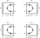

+++

Concatenate boxes vertically (horizontally in the Wikipedia article) to construct new morphisms via parallel composition i.e. with ⊗:

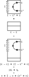

+++

Or concatenate horizontally to construct new morphisms via sequential composition i.e. with traditional composition otherwise represented by ∘ or ⨾:

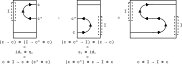

+++

On the author's new wiring diagrams, objects become lines and morphisms become boxes (rather than morphisms being lines, and objects being points as on commutative diagrams). The major advantage is that's easy to construct product categories quickly; how would you represent the full diagram in Exercise 4.50 with arrows between categories? In general, our graphical language (visual language) has become more complex. While previously we concatenated only arrows to arrows and denoted parallel paths by parallel arrows, we now concatenate boxes in two directions.

See also [String diagram - Extension to 2-categories](https://en.wikipedia.org/wiki/String_diagram#Extension_to_2-categories) for another comparison of commutative and string diagrams.

To handle string diagrams in graphviz (for the sake of automatic layouts) see the cluster example in [Examples — graphviz 0.20.1 documentation](https://graphviz.readthedocs.io/en/stable/examples.html#cluster-py).

+++

**Proposition 4.60**

+++ {"tags": []}

Alternatively, see [Closed monoidal category](https://en.wikipedia.org/wiki/Closed_monoidal_category). The sentence after this proposition maps to the comment:

> A compact closed category is a symmetric, monoidal closed category, in which the internal Hom functor $A\Rightarrow B$ is given by $A^*\otimes B$. The canonical example is the category of finite-dimensional vector spaces, FdVect.

This perspective helps connect the definition of **unit** and **counit** in [Adjoint functors - Definition via unit-counit adjunction](https://en.wikipedia.org/wiki/Adjoint_functors#Definition_via_counit%E2%80%93unit_adjunction) and (respectively) the definition of **coevaluation** and **evaluation** in [Dual object - Definition](https://en.wikipedia.org/wiki/Dual_object#Definition). The author and [Compact closed category](https://en.wikipedia.org/wiki/Compact_closed_category) actually use the language of the article on adjoint functors rather than that of dual objects. A good way to remember the terms is that "unit" starts with 1, and counit ends with 1. Why do we use the symbols ε (epsilon) and η (eta)? Possibly because they both start with "e" in the English language. Notice ε is not just a collapse of the identity and η an expansion; the order of A* and A also differ. It's also not the case that η is always a left "inverse" and ε is always a "right" inverse (consider $ε_{c^*}$).

A similar point, in [Dual object](https://en.wikipedia.org/wiki/Dual_object):

> The category $\mathrm{End}(\mathbf{C})$ of endofunctors of a category $\mathbf{C}$ is a monoidal category under composition of functors. A functor $F$ is a left dual of a functor $G$ if and only if $F$ is left adjoint to $G$.

Notice how the isomorphism is expressed in [Closed monoidal category](https://en.wikipedia.org/wiki/Closed_monoidal_category) as $\text{Hom}_\mathcal{C}(A\otimes B, C)\cong\text{Hom}_\mathcal{C}(A,B\Rightarrow C)$ and in the text as $\mathcal{C}(b\otimes c, d)\cong\mathcal{C}(b,c\multimap d)$. The author's choice of $\multimap$ rather than $\Rightarrow$ could lead to confusion when reading either this article or [Hom functor - Internal Hom functor](https://en.wikipedia.org/wiki/Hom_functor#Internal_Hom_functor).

Compare to Eq. (1.96) for preorders. In section 1.4.4 we first started talking about how the existence of adjoints creates closure operators, which we are now calling "unit" in this more general context. A footnote in section 1.4.4 actually refers to "interior" operators, equivalent to the counit. In fact, following [Adjoint functors - Definition via unit-counit adjunction](https://en.wikipedia.org/wiki/Adjoint_functors#Definition_via_counit%E2%80%93unit_adjunction) you could actually *define* a galois connection via a closure and interior operator (called an "associated kernel operator" in [Galois connection](https://en.wikipedia.org/wiki/Galois_connection)).

Compare to Example 3.72 for the category of sets, where ⊗ is replaced by ×, and $B\Rightarrow C$ by $C^B$.

+++

*Exercise* 4.62.

As mentioned in [Compact closed category](https://en.wikipedia.org/wiki/Compact_closed_category), the category [**Rel**](https://en.wikipedia.org/wiki/Category_of_relations) is also a compact closed category that is self-dual. It is defined for all relations, however, rather than only equivalence relations.

Every object in **Corel** should have a dual, with a general form of morphisms:

$$
λ_A: ∅ ⊔ A → A \\
ρ_A: A ⊔ ∅ → A \\
ρ^{-1}_A: A → A ⊔ ∅ \\
α_{A,B,C}: (A ⊔ B) ⊔ C → A ⊔ (B ⊔ C) \\
α^{-1}_{A,B,C}: A ⊔ (B ⊔ C) → (A ⊔ B) ⊔ C \\
η_A: ∅ → A^* ⊔ A \\
ε_A: A ⊔ A^* → ∅ \\
A ⊔ η_A: (A → A) ⊔ (∅ → B^* ⊔ B) = (A ⊔ ∅) → A ⊔ (B^* ⊔ B) \\
ε_A ⊔ A: (A ⊔ A^* → ∅) ⊔ (C → C) = (A ⊔ A^*) ⊔ C → ∅ ⊔ C \\
(A ⊔ η_A) ⨾ α^{-1}_{A,B,C}: (A ⊔ ∅) → (A ⊔ B) ⊔ C \\
(A ⊔ η_A) ⨾ α^{-1}_{A,B,C} ⨾ ε_A ⊔ A: (A ⊔ ∅) → (∅ ⊔ A) \\
ρ^{-1}_A ⨾ (A ⊔ η_A) ⨾ α^{-1}_{A,B,C} ⨾ ε_A ⊔ A ⨾ λ_A: A → A \\
$$

Some of the intermediates in this particular computation:

$$
A = A^* = \underline{3} = \{1,2,3\} \\
A^* ⊗ A = A ⊗ A^* = \underline{3} ⊔ \underline{3} = \{(1,1),(2,1),(3,1),(1,2),(2,2),(3,2)\} \\
(\underline{3} ⊔ \underline{3}) ⊔ \underline{3} = \{((1,1),1),((2,1),1),((3,1),1),((1,2),1),((2,2),1),((3,2),1),(1,2),(2,2),(3,2)\} \\
\underline{3} ⊔ (\underline{3} ⊔ \underline{3}) = \{(1,1),(2,1),(3,1),((1,1),2),((2,1),2),((3,1),2),((1,2),2),((2,2),2),((3,2),2)\} \\
A^* ⊗ I = A ⊗ I = \underline{3} ⊔ ∅ =\{(1,1),(2,1),(3,1)\} \\
I ⊗ A = I ⊗ A^* = ∅ ⊔ \underline{3} =\{(1,2),(2,2),(3,2)\}
$$

Filling in the implementations of some of these morphisms:

$$
λ_\underline{3} = \{(1,2),(2,2),(3,2)\} → \{1,2,3\} = \{x|(x,y)∈A\} \\
ρ_\underline{3} = \{(1,1),(2,1),(3,1)\} → \{1,2,3\} = \{x|(x,y)∈A\}  \\
ρ^{-1}_\underline{3} = \{1,2,3\} → \{(1,1),(2,1),(3,1)\} = \{(a,1)|a∈A\} \\
α^{-1}_{A,B,C}: A ⊔ (B ⊔ C) → (A ⊔ B) ⊔ C = \
(\{(a,1)|a∈A\}, \{((b,2),1)|((b,1),2)∈B\}, \{c|(c,2)∈C\}) \\
η_\underline{3} = ∅ → \{(1,1),(2,1),(3,1),(1,2),(2,2),(3,2)\} \\
ε_\underline{3} = \{(1,1),(2,1),(3,1),(1,2),(2,2),(3,2)\} → ∅ \\
A ⊔ η_A: (A ⊔ ∅) → A ⊔ (B^* ⊔ B) = \
(A, \{((a,1),2)|a∈A\}, \{((a,2),2)|a∈A\}) \\
$$

The detailed visual version of the answer:

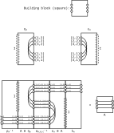

+++

*Extra exercise: Simplex category*

See the section [Compact closed category - Simplex category](https://en.wikipedia.org/wiki/Compact_closed_category#Simplex_category). Notice this is a *non-symmetric* compact closed category, with yanking equations defined in a separate section of the article. For more on arrow categories, see [Arrow Categories « The Unapologetic Mathematician](https://unapologetic.wordpress.com/2007/05/23/arrow-categories/). We briefly considered these simplex objects in Exercise 1.99:

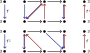

One can verify the yanking equations work for this example:

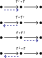

In fact, the yanking conditions are the closure and interior operators discussed in Section 1.4.4. Notice the yanking conditions also rely on Definition 2.2(a). Recall Exercise 4.48; this requirement comes from the fact that ⊗ is a functor and must preserve composition.

+++ {"tags": []}

## 4.5.2. Feas as a compact closed category

+++

*Exercise* 4.64.

If $\mathcal{X}$ and $\mathcal{Y}$ are both ordered by availability, then their product (which preserves order) will put $(x,y) \leq (x',y')$ if both (for a **Bool**-product ⊗ is ∧ i.e. AND) $x \leq x'$ or $y \leq y'$. It makes a sense that a resource pair will be available only if each resource is available; otherwise we make no statement about availability.

Similarly, it makes sense that an entire feasibility relation would be feasible only if each of the component feasability relations is (again using the AND of **Bool**).

Consider $\textbf{Prof}_\textbf{Cost}$. The monoidal product is + (addition) so a resource pair costs the addition of the cost of each individual resource. Stacking two "cost relations" corresponds to considering (adding) the cost of both.
