---
jupytext:
  text_representation:
    extension: .md
    format_name: myst
    format_version: 0.13
    jupytext_version: 1.14.1
kernelspec:
  display_name: Python 3 (ipykernel)
  language: python
  name: python3
---

+++ {"tags": []}

# 5.2. Props and presentations

See also [Signal-flow graph](https://en.wikipedia.org/wiki/Signal-flow_graph) and [Flow graph (mathematics)](https://en.wikipedia.org/wiki/Flow_graph_(mathematics)) for an extended discussion.

+++ {"tags": []}

## 5.2.1. Props: definition and first examples

### *Definition* 5.2.

What's the point of the symmetry map? Why would you use it? There's no point in building it for all these examples if you would never use it. The purpose is for when you build what you think "should" be the same thing in two different ways ($m+n$ vs $n+m$) that you have a way to convert the one to the other. If you constructed something as $m+n$ but wanted $n+m$ (or some other [canonical form](https://en.wikipedia.org/wiki/Canonical_form)) then you can use the symmetry map to get it.

This is the message of the "bookkeeping" language of Section 4.4.3. Said another way, you may only have an isomorphism (approximately equal i.e. ≅) between two objects. If you think they "should" be the same object (and that decision is related to your engineering goals) then you can apply the mapping to make them the same again (get back to an equality i.e. =).

For example, there's an isomorphism between the ℝ defined by $f(x) = 2x$. If you only care about the ratio between objects, then perhaps you consider this something that you can ignore. If you compare about absolute magnitude, then it's likely you can't ignore this conversion. This goes back to the language about "preservation" of Chapter 1; you have to know what you care about to be able to stay whether two things are pretty much the same as each other (other than some "bookkeeping"). To accountants, bookkeeping is important work.

The more you can tell a model about how much is "essentially the same" the easier you can make its job. If four images are "essentially the same" (think translation-invariance) then the model doesn't need to memorize each of the four examples separately: just one and the translation of the input for the other three. If four images are "essentially the same" other than some offset in your result (think translation-equivariance) then the model doesn't need to memorize all four; only one and the offsets to apply to both the inputs and outputs for the other three. Classification nets typically don't preserve the location of objects from the first layer; it's information that can be thrown away. Complexity kills; what can be deleted, archived, thrown away, ignored, etc.?

+++ {"tags": [], "jp-MarkdownHeadingCollapsed": true}

### Example 5.3.

Is $m + n = n + m$? It depends on what $n$ and $m$ are. If they're integers, then we've defined them to be the same (equal i.e. =, not equivalent i.e ≅). If they're sets, then if by "same" you mean equal, they are not (only equivalent). See Rough Definition 4.45(d) or $s_{AB}$ in [Symmetric monoidal category](https://en.wikipedia.org/wiki/Symmetric_monoidal_category). One way to remember this is that a "symmetric" monoidal category is not actually commutative, or it would be called a commutative monoidal category (even though this conflicts with how "symmetric" is used in the [Commutative property](https://en.wikipedia.org/wiki/Commutative_property) article).

Again, this is [Categorification](https://en.wikipedia.org/wiki/Categorification). You can't "add" sets, only take the disjoint union of them. We are confusingly defining + = ⊔, when we could have used what is arguably a more specific symbol. Unfortunately the + seems appropriate for the monoidal product on objects and ⊔ seems appropriate for the monoidal product on morphisms.

Similarly, does $m + n = n + m = k$? Only partially, and only after application of a function or functor. It may be the case that $k = +(m,n) = +(n,m)$ for integers, but for sets we only have $k = +(m,n)$ and $k = +(n,m)$.

This suggests a simpler definition than the one the author provides, following [Disjoint union](https://en.wikipedia.org/wiki/Disjoint_union) where the second index indicates the set:

$$
i,j \mapsto
\begin{cases}
    f(i), 1 & j = 1 \\
    g(i), 2 & j = 2 \\
\end{cases}
$$

Although this definition is simpler, and the logic clearer, it does assume the application of another (trivial) isomorphism to get to a set of size $|\underline{n+m}| = |\underline{m+n}| = |\underline{k}|$ where the elements are labeled from 1 to $k$. In fact, one could see Equation (5.4) as a "bookkeeping" isomorphism performing a similar function.

+++ {"tags": []}

### Exercise 5.5.

+++ {"tags": []}

Part `1.`:

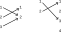

Draw $f + g$:

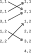

The composition rule for morphisms:

$$
f⨟g = g(f(i))
$$

The identities are:

$$
f(x) = x
$$

Some identities:

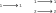

The symmetry map $\sigma_{1,2}$:

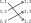

+++

### Example 5.8

As discussed in [Binary relation](https://en.wikipedia.org/wiki/Binary_relation), this example uses bipartite graphs to visualize heterogeneous binary relations. It's tempting to immediately index the involved sets:

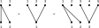

The disadvantage to this approach is it doesn't make it clear what's happening in the construction. As before, let's follow [Disjoint union](https://en.wikipedia.org/wiki/Disjoint_union) in defining the domain and codomain:

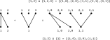

There are clearly bookkeeping isomorphisms we could build to $\underline{5}$ and $\underline{3}$, but we'll skip that for now. What this construction makes clear is the following statement from the footnote:

$$
R_1 ⊔ R_2 ⊆ (\underline{m_1} ⊔ \underline{m_2}) × (\underline{n_1} ⊔ \underline{n_2})
$$

Which we could also express:

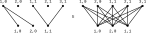

The footnote also includes:

$$
R_1 ⊔ R_2 ⊆ (\underline{m_1} × \underline{n_1}) ⊔ (\underline{m_2} × \underline{n_2})
$$

Which we could express:

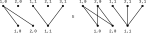

The fact that:

$$
(\underline{m_1} × \underline{n_1}) ⊔ (\underline{m_2} × \underline{n_2}) ⊆ (\underline{m_1} ⊔ \underline{m_2}) × (\underline{n_1} ⊔ \underline{n_2})
$$

Is obvious from the rightmost picture in [Cartesian product / Intersections, unions, and subsets](https://en.wikipedia.org/wiki/Cartesian_product#Intersections,_unions,_and_subsets). It's this relationship that apparently leads to the new domain and codomain of the morphism. That is, the smallest possible square that $(\underline{m_1} × \underline{n_1}) ⊔ (\underline{m_2} × \underline{n_2})$ can fit into is $(\underline{m_1} ⊔ \underline{m_2}) × (\underline{n_1} ⊔ \underline{n_2})$.

The general lesson here is to keep track of your domain and codomain, especially when they are changing. This is a general lesson of category theory, but regarding this specific situation, in the article [Binary relation](https://en.wikipedia.org/wiki/Binary_relation) the term "correspondence" is used for a binary relation that includes the domain and codomain. In the context of binary relations, you can often replace a ⊆ and × (as in f ⊆ A × B) with a : and → (as in f : A → B).

The lesson of keeping track of your domain/codomain is less obvious in the category **Set** because functions must always completely cover the domain (though not the codomain).

+++

### Exercise 5.9

+++

The question asks for posetal props although preorder props are possible in theory (e.g. the example at the top of [Preorder](https://en.wikipedia.org/wiki/Preorder) on the natural numbers). One could make all the natural numbers equivalent and the monoidal product could still be +.

A prop requires the objects to be natural numbers, and the monoidal product on objects to be +. This excludes posets (such as Example 2.32) where the monoidal product is $*$. In theory the definition of a prop doesn't restrict non-linear posets on the natural numbers, but the author hasn't discussed any other non-linear posets on the natural numbers and there don't seem to be many examples online. We'll have to construct custom examples, which simply end up being losets.

The requirement the the monoidal product be + leads to the following "template" for posetal props. On the right are the natural numbers, with no morphisms between them to start. On the left is the product category ℕ × ℕ, the domain of the monoidal product +. The requirement that the monoidal product be + means every pair from the rows on the left must map to the objects on the right:

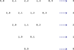

In fact, this "template" corresponds to the posetal prop with a discrete ordering, an example in itself.

Another obvious example posetal prop is with the standard order of the natural numbers (Example 1.45, Example 2.30). The mapping of morphisms (monoidal product on morphisms) is fully constrained by the monoidal product on objects and the morphisms between objects:

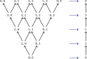

Another example is the opposite ordering:

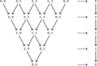

Another example could include only the even or odd numbers in the poset.

+++

### Exercise 5.10

+++

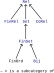

+++

For Example 5.6:
1. **Bij**(m,n) will be the subset of **FinSet**(m,n) that are bijections.
1. Identities will be as in **FinSet** (those were already bijections).
1. The symmetry maps will be as in **FinSet** (those were already bijections).
1. Composition will be as in **FinSet**; the composition of two bijections will be a bijection under this definition.
1. The monoidal product on morphisms will be as in **FinSet**; the product of two bijections will be a bjiection under this definition.

Point `5.` in the solution seems wrong. Why is the second part of the definition not $m' + g(i-m)$?

For Example 5.7:
1. **Corel**(m,n) will be the subset of **Rel**(k,k) that are equivalence relations, where $m+n=k$. The objects in **Corel** are "square" unlike in **Rel**.
1. The identities are given in the last paragraph of Example 4.61. One could visualize this as an [Identity matrix](https://en.wikipedia.org/wiki/Identity_matrix) (square by definition).
1. The symmetry maps will be the same as in **FinSet**; these functions can also be seen as equivalence relations.
1. The composition rule is given in the second to last paragraph of Example 4.61.
1. The monoidal product will be as in **Rel** (see Example 5.8).

For Example 5.8:
1. **Rel**(m,n) will be all the relations $R ⊆ \underline{m} × \underline{n}$.
1. The identities will be as in **CoRel**; these equivalence relations are still relations.
1. The symmetry maps will be the same as in **FinSet**; these functions can also be seen as relations.
1. The composition rule is given in Example 5.8.
1. The monoidal product is given in Example 5.8.

Why is **Rel** a prop, when **Set** apparently is not? Or is it? It seems like in using **FinSet** rather than **Set** as an example the author was indirectly making a claim about it, in particular that because **Set** includes objects that are larger than the set of natural numbers it would not be possible to identify every object with a natural number. This is orthogonal to the issue of large and small categories, which is concerned with avoiding paradoxes (FinSet is a large category).

+++

### *Definition* 5.11

Later in the chapter it will become clearer that natural language for point `2.` in this definition is that a prop functor preserves the monoidal product. A prop functor is also a functor, so this is in addition to preserving identities and composition.

+++ {"tags": []}

## 5.2.2. The prop of port graphs

See "port graph grammar" only mentioned in [Linear graph grammar](https://en.wikipedia.org/wiki/Linear_graph_grammar) and [Graph rewriting](https://en.wikipedia.org/wiki/Graph_rewriting). Later in the chapter we'll attempt to rewrite graphs.

**A category PG whose morphisms are port graphs.**

The author prefers to use $!$ for almost any unique function: see Example 3.80, the diagram in Example 3.87, and many variable subscripts. Generally, these seem to be associated with a universal property.

The author calling one function "the" unique function in this section may have been a mistake (an unfinished sentence). See instead comments in [Initial and terminal objects](https://en.wikipedia.org/wiki/Initial_and_terminal_objects) and [Category of sets](https://en.wikipedia.org/wiki/Category_of_sets) about how the empty set serves as the initial object in **Set**, with the [empty function](https://en.wikipedia.org/wiki/Function_(mathematics)#empty_function) the unique function to all objects. See also this [helpful SO comment](https://math.stackexchange.com/questions/343998/why-is-an-empty-set-not-a-terminal-object-in-categories-mathsftop-and-mat?rq=1#comment739340_343998).

+++

### Exercise 5.16

See the book's solution, this is straightforward.

+++

### Exercise 5.18

See the book's solution, this is straightforward.

+++

## 5.2.3. Free constructions and universal properties

+++

See also [Free object (Wikipedia)](https://en.wikipedia.org/wiki/Free_object). How does the universal property for free objects differ from universal properties in general? First, there are two ways to define a universal morphism in [Universal property](https://en.wikipedia.org/wiki/Universal_property), and free objects definition uses the first (in terms of maps out). Compare to the example of a universal property we saw in Definition 3.86 for product objects, which is based on maps in (also documented in [Universal property / Examples / Products](https://en.wikipedia.org/wiki/Universal_property#Products)).

Another difference is that the universal morphism for a free object is defined to include an injection $i$, not just any morphism $u$.

Additionally, Wikipedia's free object definition seems to only be based on **Set** while the universal property definition is based on any category. But, compare [Free object (Wikipedia)](https://en.wikipedia.org/wiki/Free_object) and [free object (nLab)](https://ncatlab.org/nlab/show/free+object). The nLab definition generalizes the Wikipedia definition, changing the faithful/forgetful functor from **C** → **Set** to **C** → **D** and hence the free functor from **Set** → **C** to **D** → **C**. Apparently:
- Example 5.19 discusses the forgetful functor with signature **[Ord](https://en.wikipedia.org/wiki/Category_of_preordered_sets)** → **Rel** (free functor reversed)
- Example 5.22 discusses **Cat** → **Quiv**
- Example 5.24 discusses **[Mon](https://en.wikipedia.org/wiki/Monoid_(category_theory))** → **Set**

All of these differences may seem minor. The article [forgetful functor (nLab)](https://ncatlab.org/nlab/show/forgetful+functor) suggests there may be no difference. From [free functor in nLab](https://ncatlab.org/nlab/show/free+functor):

> Classically, examples of free constructions were characterized by a universal property. For example, in the case of the free group on a set X the universal property states that any map X→G as sets uniquely extends to a group homomorphism F(X)→G. When such a free construction can be realized as a left adjoint functor, this universal property is just a transliteration of the fact that the unit of the free-forgetful adjunction is an initial object in the comma category (X↓U) (where U is the forgetful functor out of the category of algebras, see e.g. the proof of Freyd’s general adjoint functor theorem.)

+++

### Motivation

The value in this section is that you can define less than what you "need to" and still get some "functioning" object. It's always helpful to be able to type/specify less to a computer as part of achieving some goal. For example, it's convenient to only specify edges to graphviz and get a full graph (with nodes). It's convenient to able to define a linear function from one vector space to another using only its value on a basis of its domain. We typically do this kind of thing with "constructors" of objects (notice "free constructions" in the title of section `5.2.3`), though there's no requirement to use the object-oriented perspective (a regular function could also do these expansions). As the author points out, we often use the term [Specification (technical standard)](https://en.wikipedia.org/wiki/Specification_(technical_standard)) when we want to refer to the arguments that are necessary to construct something (e.g. a preorder spec.).

Why are universal properties important? Because there are always many ways to skin a cat (solve a problem). We often want to let people construct in whatever way works for them as long as the final product meets some specification. That is, as long as we end up with something useful in the end. Whether something is useful is more often defined by what it can do, rather than how it was built. The [Universal property](https://en.wikipedia.org/wiki/Universal_property) and [Adjoint functors](https://en.wikipedia.org/wiki/Adjoint_functors) articles discuss universal properties as setting up an optimization problem. You could also see them as setting up the acceptance criteria for some user story. To some degree, any question is an imprecise specification: it asks for an answer in its own terms (think of begging the question) but can still also often be answered in more than one way.

+++ {"jp-MarkdownHeadingCollapsed": true, "tags": []}

### Grph vs Quiv

Disinguish carefully between **Grph** and **Quiv**. The author's **Grph**, and **Grph** discussed in [Topos](https://en.wikipedia.org/wiki/Topos), are equivalent to **Quiv** as discussed in [Quiver (mathematics)](https://en.wikipedia.org/wiki/Quiver_(mathematics)) and [Quiv in nLab](https://ncatlab.org/nlab/show/Quiv). See [quiver in nLab](https://ncatlab.org/nlab/show/quiver) and [graph in nLab](https://ncatlab.org/nlab/show/graph) for a history of the terms; both articles emphasize that quiver is less ambiguous than both the terms graph and digraph (quivers are equivalent to directed pseudographs). Although [Global element](https://en.wikipedia.org/wiki/Global_element) refers to [Graph homomorphism](https://en.wikipedia.org/wiki/Graph_homomorphism), even in that case **Grph** seems equivalent to **Quiv**. In general, prefer **Quiv** to be unambiguous (stop using **Grph**). Based on [graph in nLab](https://ncatlab.org/nlab/show/graph), use the following language:

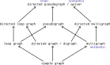

Apparently **Grph** is a holdover from [Categories for the Working Mathematician](https://en.wikipedia.org/wiki/Categories_for_the_Working_Mathematician), hence its popularity.

+++

### Example 5.19

It's helpful to review section 3.2.3. before this example.

+++

### Exercise 5.20

For both `1.` and `2.` we know that the operation of a reflexive transitive closure implies:

$$
R(x,y) → x \leq_P y
$$

For `1.` we are given that $R(x,y) → f(x) \leq_Q f(y)$, and would like to show $x \leq_P y → f(x) \leq_Q f(y)$.

The author is technically a bit lax with the language he uses for $f$. In the introduction to the question it is a function (a morphism between sets, in **Set**/**Rel**) and by the end of `1.` it's a monotone map (a morphism between preorders, in **Ord**). In the context of `1.` we'll distinguish these as $f_1$ and $f_2$:

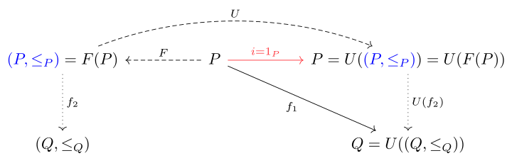

Notice that in the [Category of relations](https://en.wikipedia.org/wiki/Category_of_relations) (on the right) the objects (e.g. the basis P) are sets and the morphisms (e.g. R) are (binary) relations. So $R: P → P$ is a morphism in the category on the right, a loop on $P$.

For most of the implications we need for $f_1$ to define a monotone map $f_2$, we can rely on $R(x,y) → f(x) \leq_Q f(y)$. However, the reflexive transitive closure $UF$ will "change" the relation $R$ (call this new relation $R'$) by adding reflexive and transitive elements. Will these be respected by $f_2$?

Consider the new reflexive elements; we may not have had $R(x,x)$ before the closure but will have it after. Can we conclude that if $R'(x,x)$ (corresponding to $x ≤ x$) is filled in, that we will also have $f(x) ≤_Q f(x)$? Since $f$ is a [function](https://en.wikipedia.org/wiki/Function_(mathematics)) (as opposed to e.g. a [multivalued function](https://en.wikipedia.org/wiki/Multivalued_function)), both these terms will be equal. Since $(Q, \leq_Q)$ is a preorder, we can also be sure that $f(x) ≤_Q f(x)$.

Consider the new transitive elements. In some cases we will have $R$ with elements for x ≤ y and y ≤ z, but with only $R'$ having a new element for x ≤ z. While x ≤ y and y ≤ z will imply f(x) ≤ f(y) and f(y) ≤ f(z) by $R(x,y) → f(x) \leq_Q f(y)$, they will not directly imply f(x) ≤ f(z). However, given that $f(x) ≤_Q f(y)$ and $f(y) ≤_Q f(z)$ we know (because Q is a preorder) that $f(x) ≤_Q f(z)$.

It may help to attempt to construct a counter-example to convince yourself. Some positive examples:

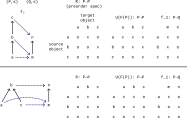

For part `2.`, we know that $x \leq_P y → f(x) \leq_Q f(y)$. By [hypothetical syllogism](https://en.wikipedia.org/wiki/Hypothetical_syllogism) with the first equation above, we can conclude $R(x,y) → f(x) \leq_Q f(y)$.

+++

### Exercise 5.21

For `1.` we are given that $a \leq_Q b → R(g(a),g(b))$. Replace the two variables in the equation that starts the solution to Exercise 5.20 to produce $R(g(a),g(b)) → g(a) \leq_P g(b)$. Combine these two equations to produce $a \leq_Q b → g(a) \leq_P g(b)$. That is, it is in fact automatically true that *g* defines a monotone map.

For `2.` we are given that $a ≤_Q b → g(a) ≤_P g(b)$, and want to show that $a ≤_Q b → R(g(a), g(b))$. We still have that $R(g(a),g(b)) → g(a) \leq_P g(b)$ but this doesn't help; we need the reverse implication of it. In general, this is not true. Consider the following counter-example, where $g$ defines a monotone map but the highlighted-red element $(g(m), g(n)) = (a, c)$ ∉ R:

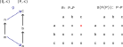

+++ {"jp-MarkdownHeadingCollapsed": true, "tags": []}

### *Paragraph* following Exercise 5.21

The author makes the claim:

> This means the domain of a map must be somehow more constrained than the codomain.

This looks exactly wrong: it should read that the *codomain* of a map must be somehow more constrained than the *domain*. The domain of all these maps is the free object on our specification, which should be the minimally-constrained structure (including only the generating constraints, in one way or another). For all other objects for which there is a map from it, we are only adding constraints (not removing constraints, which would not be preserving them).

See Example 3.41 for nearly the same sentiment, and a start to understanding what "most maps out" means for a [Free category](https://en.wikipedia.org/wiki/Free_category). The free square has a map to the commutative square, but there's no equivalent map from the commutative square to the free square. The codomain (the commutative square) is more constrained.

In the language of section 3.2.3, these "other objects" are on the spectrum from the free category (no equations) to its preorder reflection (all possible equations).

+++

### Example 5.22

See [Free category](https://en.wikipedia.org/wiki/Free_category), also mentioned as an example in [free functor in nLab](https://ncatlab.org/nlab/show/free+functor) (which points to [free category in nLab](https://ncatlab.org/nlab/show/free+category) and [path category in nLab](https://ncatlab.org/nlab/show/path+category)):

> the free category functor $Grph_{d,r}$ → $Cat$;

One question that may come up about the nature of the free (*F* or **Free**) and forgetful (*U*) functors defined in these sources is what a round trip looks like. The author uses the word "closure" to describe the application of **Free** to a quiver. To be more specific, he probably means the application of *F* then *U* (*UF*); the application of only *F* produces an object in **Cat** rather than an object of the same type in **Quiv**. Let's try to naively apply this logic to the free category **3** from Exercise 3.10:

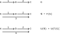

The downside to this naming scheme becomes apparent if one then tries to apply *F* again. Since the morphisms 1 and 2 are not connected to the morphism in 3 in any way, there's really no reason not to freely concatenate them together again to produce another arrow:

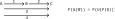

Obviously this is not the expected closure. If we wanted to only worry about preorders, then we could collapse all duplicate paths into a single paths as discussed in the answer to Exercise 1.40. This solution isn't particularly desirable because it doesn't let us turn e.g. the graph in Example 1.37 into a regular  category (a **Set**-category) and not lose information, or to go to quiver and back again without losing information.

Based on [path category in nLab](https://ncatlab.org/nlab/show/path+category), the proper solution seems to be to label the morphisms freely constructed from arrows in G (in the free category) as lists, despite [Categories for the Working Mathematician](https://en.wikipedia.org/wiki/Categories_for_the_Working_Mathematician) claiming the forgetful functor *U* should be in charge of:

> forgetting which arrows are composites and which are identities

In this approach we would apply pattern-matching on the lists to avoid regenerating paths:

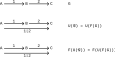

+++ {"tags": []}

### Exercise 5.23

#### Part 1.

See `dom`/`cod` used in the definition of category in [Category (mathematics)](https://en.wikipedia.org/wiki/Category_(mathematics)). These are both functions from the set of morphisms to objects in the category, where `dom` produces the source of the arrow/morphism and `cod` produces the target.

+++

#### Part 2.

Let's start with an overview of the universal property we are trying to prove:

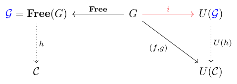

+++

*Special cases*

When *f* is not injective, it is mapping at least two vertices from the original graph G to a single vertex in the target category U(𝓒).

When *g* is not injective, it is replacing the set of all possible paths in G with a smaller set where some paths are considered equivalent (corresponding to adding path equations i.e. equivalences to 𝓒). Perhaps ironically, to remove morphisms is to add path equations (constraints). To add morphisms while keeping the set of objects fixed is to remove path equations. See examples in Section 3.2.2.

The cardinality of the set of objects or morphisms/arrows in 𝓒 may technically be greater than, the same, or smaller than the cardinality of the same sets in the free category 𝓖.

+++

*General case*

Let's repeat the two equations from the text on top of each other so they're easier to compare:

$$
\begin{align}
dom(g(a)) & = f(s(a)) \\
cod(g(a)) & = f(t(a))
\end{align}
$$

The first equation is associated with arrow sources, and the second with arrow targets. That is, for every arrow $a$ in G, the vertex associated with the source is mapped to the source of the mapped arrow, and the vertex associated with the target is mapped to the the target of the mapped arrow.

These two equations will naturally associate identities (trivial paths) in G with identities in C. For them to indirectly define a functor, though, we also need them to preserve composition.

The two equations capture what we typically do to visually construct a legitimate functor (see e.g. Example 3.36), but how does this correspond to preserving composition? There's a disconnect between the "visual" rule and the algebraic "rule" that indicates a functor preserves composition:

$$
F(a_1 ∘_G a_2) = F(a_1) ∘_C F(a_2)
$$

Notice this equation is a question (like a universal property), but it's begging the question to some degree by assuming that the given morphisms compose. That is, this "algebraic" rule also requires $t(a_2) = s(a_1)$, and $cod(F(a_2)) = dom(F(a_1))$ (or composition would not be possible).

Said another way, the "algebraic" rule works on two arrows at a time, while the "visual" rule works on one arrow at a time. One way to put the algebraic rule is that the mapped source of the first of a two-arrow path must equal the mapped source of the first arrow in the path, and the the mapped target of the second of a two-arrow path must equal the mapped target of the second arrow in the path.

Let's say that we have two arrows where $t(a_2) = s(a_1)$ in G, i.e. that can be concatentated into a path $p_G = a_2 ⨟ a_1 = a_1 ∘_G a_2$. The rules above will hold for both arrows:

$$
\begin{align}
dom(g(a_1)) & = f(s(a_1)) \\
cod(g(a_1)) & = f(t(a_1)) \\
dom(g(a_2)) & = f(s(a_2)) \\
cod(g(a_2)) & = f(t(a_2))
\end{align}
$$

Combining the first and last equations using $t(a_2) = s(a_1)$:

$$
\begin{align}
dom(g(a_1)) & = cod(g(a_2)) \\
cod(g(a_1)) & = f(t(a_1)) \\
dom(g(a_2)) & = f(s(a_2))
\end{align}
$$

Because $dom(g(a_1)) = cod(g(a_2))$ we can concatenate these arrows in C to produce the path $p_C = g(a_2) ⨟ g(a_1) = g(a_1) ∘ g(a_2)$. Because we also know:

$$
\begin{align}
dom(p_C) = dom(g(a_2)) \\
cod(p_C) = cod(g(a_1)) \\
s(p_G) = s(a_2) \\
t(p_G) = t(a_1)
\end{align}
$$

We can say:

$$
\begin{align}
cod(p_C) & = f(t(p_G)) \\
dom(p_C) & = f(s(p_G))
\end{align}
$$

In short, mapping vertices source-to-source and target-to-target per-arrow is equivalent to mapping vertices source-to-source and target-to-target per-path. Using mathematical induction, you can extend this to arbitrary length paths.

+++

*Bijection*

The preceding logic constructs demonstrates the existence of a functor from 𝓖 to 𝓒 (labeled h on the commutative diagram) for every (f,g). This does not establish a bijection between h and (f,g); we still need to demonstrate that an (f,g) for every functor h exists (the opposite direction) and then show these two constructions are mutual inverses. See the text's answer for one possible completion.

+++

*Variable names*

The variable names f and g are not ideal. The first is for vertices, so it's likely better named v. The second is for arrows, so it's likely better named a. Similarly, we use dom/cod so we can talk in terms of the category 𝓒, but we could use the cleaner names $s_c$ and $t_c$ if we talked in terms of U(𝓒) instead. A more readable version of the original equations:

$$
\begin{align}
s_C(m_a(a)) & = m_v(s_G(a)) \\
t_C(m_a(a)) & = m_v(t_G(a))
\end{align}
$$

+++

#### Part 3.

Yes this is a graph because Ob(𝓒) and Mor(𝓒) are both sets (all that is required of $V,A$), and dom and cod are functions between those sets (all that is required of $s,t$). Specifically, it's the graph U(𝓒) in the diagram above.

There's an adjunction between the free functor **Free** and the forgetful functor **U** in the diagram above.

+++ {"jp-MarkdownHeadingCollapsed": true, "tags": []}

### Exercise 5.24

See [Free monoid - Wikipedia](https://en.wikipedia.org/wiki/Free_monoid). For examples of $B$ objects per the definition in [Free object - Wikipedia](https://en.wikipedia.org/wiki/Free_object), see Example 3.18 and Exercise 3.19.

For `1.` the elements are {id, a, aa, aaa, ...}.

For `2.` the natural numbers with zero under addition i.e. $(N_0, +)$.

For `3.` the elements are {id, a, b, aa, ab, bb, ba, aaa, ...}.

+++

## 5.2.4. The free prop on a signature

This section uses the word/language of [Generator (mathematics)](https://en.wikipedia.org/wiki/Generator_(mathematics)), although in [Free object](https://en.wikipedia.org/wiki/Free_object) we would call these a basis. See also [Signature (logic)](https://en.wikipedia.org/wiki/Signature_(logic)) and [Term algebra](https://en.wikipedia.org/wiki/Term_algebra).

It's worth re-emphasizing the ambitious goal of the first paragraph: to define the free prop given a generic signature. To some extent this section explains why the author introduced port graphs, which is to allow the definition of a free prop that doesn't include all morphisms between all (m,n). Still, the port graph concept isn't necessary if you use Definition 5.30.

+++

### *Definition* 5.25

It's worth noting that $G$ is a plain set in this example (e.g. $G = \{f,g,h\}$), though in the paragraph after it becomes what looks like a set of morphisms. As mentioned, the author is already using G as a shorthand for $(G,s,t)$.

+++

### Exercise 5.28

From the paragraph after Exercise 5.16, the morphisms in **PG**(m,n) are all (m,n)-port graph $(V,in,out,\iota)$. The given prop signature lets one construct any (m,n)-port graph, so per the last paragraph of Definition 5.25 the **Free**(G) will equal **PG**.

+++

### Exercise 5.32

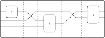

+++

## 5.2.5. Props via presentations

+++

### Exercise 5.35

There should be no difference; if we aren't applying any additional equivalences then we should only cut down the set of prop expressions by the axioms of props (as we already did before).
