---
jupytext:
  text_representation:
    extension: .md
    format_name: myst
    format_version: 0.13
    jupytext_version: 1.14.1
kernelspec:
  display_name: Python 3 (ipykernel)
  language: python
  name: python3
---

# 6.2 Colimits and connection

+++


+++

## 6.2.1 Initial objects

+++


+++


+++

### *Exercise* 6.3

+++


+++

1. The relation with zero morphisms (besides the identity morphisms).
2. A relation with one extra morphism (either from a → b or b → a).
3. The preorder relation with both a → b and b → a.

+++

```{admonition} Reveal 7S answer
:class: dropdown

```

+++ {"tags": []}

### *Example* 6.4

+++


+++

### *Exercise* 6.6

+++


+++

Example `1.` has a single initial object a, because there's still an identity morphism on a in the free category.

Example `2.` has a single initial object a, because the free category (unlike a preorder) has a morphism for every path. That is, there's a morphism from a to c that isn't explicitly shown.

Example `3.` has no initial object because no object has a morphism to every other object.

Example `4.` has no initial object because a has many morphisms to it from itself.

+++

```{admonition} Reveal 7S answer
:class: dropdown

```

+++ {"tags": []}

### Define structure-preserving

A major motivation of category theory (going back to section 1.1) is "structure" preservation. The term is used all over [Morphism](https://en.wikipedia.org/wiki/Morphism#Examples). We've gained intuition for what "structure" is through many examples, but is there a more concrete definition? The short answer is no; what it means to preserve structure completely depends on the context. The word "structure" may have more specific meanings in specific contexts (see [stuff, structure, property in nLab](https://ncatlab.org/nlab/show/stuff%2C+structure%2C+property)), but in the context of what it means to be a morphism (i.e. something that is structure-preserving) this can mean many things.

One kind of example is given in [Morphism § Examples](https://en.wikipedia.org/wiki/Morphism#Examples) under:

> - In the category of small categories, the morphisms are functors.
> - In a functor category, the morphisms are natural transformations.

In Definition 5.11 (and in Rough Definition 6.68) we'll see examples of functors that actually preserve more than what plain functors do. These are structure-preserving maps (morphisms) as well, in some category similar to **Cat** (where plain functors are the morphisms).

These examples are for "strict" categories, as defined in [Higher category theory](https://en.wikipedia.org/wiki/Higher_category_theory). There are many more possible definitions of structure-preserving in this domain. From [n-category](https://ncatlab.org/nlab/show/n-category):

> Especially as n increases, there is a plethora of different definitions of n-categories, some differing in generality others different-looking but secretly equivalent. A (woefully incomplete) list is given below, with pointers to dedicated entries. Part of the subject of higher category theory is to understand, organize, systematize and, last not least, apply these definitions. (It is the “n” in “n-category” that gives the nLab its name.)

The term "morphism" was also apparently originally used in category theory as an abstraction of the notion of homomorphism, apparently in order to advance the field of topology. This creates examples of morphisms of almost a completely different kind:

> - In the category of topological spaces, the morphisms are the continuous functions and isomorphisms are called homeomorphisms. There are bijections (that is, isomorphisms of sets) that are not homeomorphisms.
> - In the category of smooth manifolds, the morphisms are the smooth functions and isomorphisms are called diffeomorphisms.

Part of the problem in defining what it means to preserve "structure" is that we may not agree on what structure is important to preserve. Every structure-preserving function ("map") must forget some structure; we wouldn't call it a map if it was nothing but an identity (nothing changed). This disagreement about what is important to preserve leads to a wide variety of definitions.

It may be best to completely avoid the word "structure" and rather say what structure you are preserving. Don't say structure-preserving, for example, when you mean identity-preserving. The latter is just as many letters and is more specific.

It's interesting that the word "morphism" now means structure preserving, when the prefix that would indicate it should be structure preserving (in Greek) has been taken away. For example, [Isomorphism](https://en.wikipedia.org/wiki/Isomorphism) means "equal" form (equal "structure" or shape). [Homomorphism](https://en.wikipedia.org/wiki/Homomorphism) means "same" form though this is due to a mistranslation; it should have been "similar" form (and you should think of it that way).

Can we see structure-preserving morphisms as preserving context? Since what it means to be structure-preserving is so variable, this may be acceptable. A morphism, functor, homemorphism, homomorphism, etc. help you keep what you already knew from one context and use it in another context (either duplicating your knowledge base to reduce or edit it, or building it up without duplication).

+++ {"tags": []}

### Define morphism

If you could think of a small category as a partial magma with identity and an associative partial function, then a functor might preserve this structure, without having to think about all the structure that is presumably preserved in the morphisms (which could be of any kind). A morphism is a bit more than this, though, because a morphism must also be defined whenever composition is possible (when the target of one morphism matches the source of another). It's in this sense that we say a functor is composition-preserving; because (in the language of Definition 3.6) a "composite" morphism must be defined in a category for every two morphisms that can compose. Said another way, we cannot use just any associative partial function.

+++ {"tags": [], "jp-MarkdownHeadingCollapsed": true}

### Why functors?

It can be easy to read the definition of a functor without thinking about why they are defined the way they are. From [Functor § Properties](https://en.wikipedia.org/wiki/Functor#Properties)

> Two important consequences of the functor axioms are:
>
> - F transforms each commutative diagram in C into a commutative diagram in D;
> - if f is an isomorphism in C, then F(f) is an isomorphism in D.

So if in one category you have that g ∘ f = h, as in (from [Morphism](https://en.wikipedia.org/wiki/Morphism)):


Then a functor will ensure this commutative diagram is also a commutative diagram in the second category. In this drawing from [Functor](https://en.wikipedia.org/wiki/Functor#Properties), you can see the previous commutative diagram on the bottom and top:


As discussed above, what makes a morphism a morphism is that the "composite" morphisms exist. That is, the commutative triangle given above is what defines a morphism in the context of a category. You can see the same drawing in [Category (mathematics)](https://en.wikipedia.org/wiki/Category_(mathematics)):


See a slightly more involved but similar definition in [functor](https://ncatlab.org/nlab/show/functor).

The second property is also significant:

> - if f is an isomorphism in C, then F(f) is an isomorphism in D.

Let's say you had the following category:

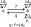

Define a function (an attempt at an endofunctor) that maps every object and morphism to itself, except that it switches the morphisms $id_B$ and $h$ (notice this disrespects identity-preservation because $F(id_B) = h ≠ id_{F(B)} = id_B$). While we still have a commutative diagram corresponding to $g⨟f = id_B$ (namely $g⨟f = h$) we failed to preserve the isomorphism.

It may be more appropriate to call functors commutative-diagram-preserving and isomorphism-preserving, rather than composition-preserving and identity-preserving. The former more likely describes what someone wants from them, while the latter more likely only describes the mechanics.

For a slightly more complicated example of failing to preserve the identity (in the case of only one object), see [Monoid § Monoid homomorphisms](https://en.wikipedia.org/wiki/Monoid#Monoid_homomorphisms).

+++

### Define stuff, structure, properties

+++

The article [stuff, structure, property in nLab](https://ncatlab.org/nlab/show/stuff%2C+structure%2C+property#more_examples) provides a tempting definition of "structure" that could potentially free this word from its expected ambiguity (perhaps all three of these things are examples of "structure"). In the context of Exercise 6.7, this could help make it easier to guess what from Definition 5.36 (of a rig) we need to maintain. Which of the items in this list are stuff, structure, and properties? If remembering properties implies we also remember stuff, then perhaps we only need to worry about some these items and get the others to follow along. For example, see [Group homomorphism](https://en.wikipedia.org/wiki/Group_homomorphism). That article concludes at the start that because a group homomorphism preserves the group operator it must also preserve identities and inverses. Similarly, see the start of [Ring homomorphism](https://en.wikipedia.org/wiki/Ring_homomorphism).

This simple relationship is also implied by the comment:

> It is worth noting that this formalism captures the intuition of how “stuff”, “structure”, and “properties” are expected to be related:
>
>    - stuff may be equipped with structure;
>    - structure may have (be equipped with) properties.

See also this quote from [stuff, structure, property § More examples](https://ncatlab.org/nlab/show/stuff%2C+structure%2C+property#more_examples):

> The embedding of abelian groups into all groups, F: Ab → Grp is faithful and full, but not essentially surjective.

Unfortunately, it's not that simple. The language of [k-surjective functor](https://ncatlab.org/nlab/show/k-surjective+functor) at first seems to imply that with increasing k more "structure" is preserved. In fact, different values of k and combinations of k imply different kinds of "structure" (meaning stuff, structure, properties) is forgotten. See:

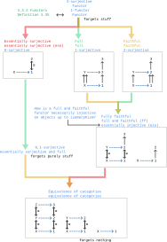

+++

The author often presents algebraic structures as tuples, as in Exercise 6.7. For the homomorphism to preserve structure, it must preserve all the structure in the tuple. However, there can also be "structure" *between* the elements of these tuples, such as (in Exercise 6.7) the distributive property. In other cases the author seems to have an understanding of stuff, structure, properties as he lists them separately (e.g. Definition 3.6, Definition 3.35). In section 4.4 the author describes categorification in terms of structure and properties. For more on the author's perspective, see "Coherence conditions" in Section 3.6.

One way to see the stuff, structure, properties breakdown is in terms of a finite presentation of a category. If you see a category as a database (Chp. 3) then this is more obvious based on inspecting the type theory example [structure § GroupDataStructure](https://ncatlab.org/nlab/show/structure#GroupDataStructure). The properties correspond to the equations at the bottom of the diagram, the structure to the morphisms in the category, and the stuff to the objects in the category. Rather than a finite number of equations, there are equations that apply globally. For example, in the definition of [Property (mathematics)](https://en.wikipedia.org/wiki/Property_(mathematics)), we say that it must apply across all examples. Similarly, for a commutative diagram to "commute" means it applies in all cases. A [Universal property](https://en.wikipedia.org/wiki/Universal_property) extends a "traditional property" in being also true of an associated morphism (rather than just an object).

Another reason that this logic doesn't apply to Exercise 6.7 is that a homomorphism is not a functor. Both are examples of morphisms (are "structure" preserving in at least some sense) but a homomorphism is only preserving of *some* kind of structure on top of a set, and a functor is identity and composition preserving. It is true that rig homomorphisms happen to form a category (see [Rig](https://ncatlab.org/nlab/show/Rig)), but an endofunctor on that category would need to apply to every rig (not be defined between rigs). A rig does have some internal compositional structure to preserve, however, on its two monoids.

See also the much more detailed original paper on this topic, which explains e.g. why all these functors can be seen as surjective (and why an "injective" function across sets can even be seen as surjective). In particular, [section 2.4, p. 15](http://arxiv.org/PS_cache/math/pdf/0608/0608420v2.pdf#page=15) and [section 3.1, p. 17](http://arxiv.org/PS_cache/math/pdf/0608/0608420v2.pdf#page=17). The stuff/structure/property conversation comes up in more detail in [Forgetful functor](https://en.wikipedia.org/wiki/Forgetful_functor), relating it to logic.

An outstanding issue is the following statement from [full functor](https://ncatlab.org/nlab/show/full+functor):

> For ordinary functors this may sound odd, because there is no real sense in which “full” modifies “faithful.”

+++

### *Exercise* 6.7

+++

#### Part `1.`

+++


+++

Recall Definition 5.36 alongside this tuple. The sets $R$ and $S$ have no structure to preserve. To preserve the structure of the other elements of a rig, we will at least need the two rules the author provided:

1) $f(0_R) = 0_S$
2) $f(r_1 +_R r_2) = f(r_1) +_S f(r_2)$

We'll also at least need the following rule for the multiplication monoid:

3) $f(1_R) = 1_S$
4) $f(r_1 *_R r_2) = f(r_1) *_S f(r_2)$

The last bullet point in Definition 5.36 implies we should preserve the absorbing element zero ($f(0_R) = 0_S$) but this is already satisfied by condition `1.` above.

Do we also need to preserve commutativity of the addition monoid? I'd guess no; why? We can see the combination of `1.` and `2.` above as a functor, because a monoid with one element is effectively a category with a single object. By preserving the monoid operation we effectively preserve composition, because all commutative triangles in a monoid flatten into a linear chain. Any functor will end up being an equivalence of categories because the functor is only defined from one object to one object. The commutative property is a "property" in the language of [stuff, structure, property](https://ncatlab.org/nlab/show/stuff%2C+structure%2C+property), and therefore should be preserved by an equivalence of categories (which "forgets nothing" where nothing means none of stuff, structure, properties).

What does it mean to preserve the distributive property given in part (c) of Definition 5.36? If it's a property, it seems like it would be the same situation, so we'll assume it will be preserved without more rules.

Note that [Ring homomorphism](https://en.wikipedia.org/wiki/Ring_homomorphism) only requires {`2.`, `3.`, `4.`} and takes `1.` as a consequence; it's likely the proof/derivation uses negative elements. For a definition that only requires {`1.`, `2.`, `4.`}, see [Ring Homomorphism - from Wolfram MathWorld](https://mathworld.wolfram.com/RingHomomorphism.html).

+++

### *Exercise* 6.8

+++


+++

The initial object is clearly what is being universal in this context. The "comparable object" is any other object in the category.

In terms of [Universal property § Formal definition](https://en.wikipedia.org/wiki/Universal_property#Formal_definition), an initial object corresponds to the 1st definition and a terminal object corresponds to the 2nd. That is, in the 1st definition the unique morphism (dashed arrow) goes out from the blue/initial object on the right rather than into it:


+++

```{admonition} Reveal 7S answer
:class: dropdown

```

+++

### *Remark* 6.9

+++


+++

### *Exercise* 6.10

+++


+++

Call $!_{c_2}$ the unique morphism from $c_1$ to $c_2$. Call $!_{c_1}$ the unique morphism from $c_2$ to $c_1$. Then both are isomorphisms, because $id_{c_1} = !_{c_2} ⨟ !_{c_1}$ and $id_{c_2} = !_{c_1} ⨟ !_{c_2}$.

+++

```{admonition} Reveal 7S answer
:class: dropdown

```

+++ {"tags": []}

## 6.2.2 Coproducts

+++ {"tags": []}


When we speak of a "pair" we typically use parentheses, e.g. $(f,g)$. In this context, parentheses seem to be reserved for pairs in the [Product category](https://en.wikipedia.org/wiki/Product_category). When we speak of a "copair" we apparently use square brackets e.g. $[f,g]$; the same syntax is used in [Coproduct](https://en.wikipedia.org/wiki/Coproduct). When we are speaking of products, as in [Product (category theory)](https://en.wikipedia.org/wiki/Product_(category_theory)), we apparently use angle brackets e.g. $⟨f,g⟩$ (see U+27E8 and U+27E9 in [Bracket](https://en.wikipedia.org/wiki/Bracket)).

+++ {"tags": []}

### *Exercise* 6.13

+++ {"tags": [], "jp-MarkdownHeadingCollapsed": true}


+++ {"jp-MarkdownHeadingCollapsed": true, "tags": []}

In a preorder all morphisms are unique, so we can remove any distinction between the types of arrows in (6.12) (that is, the dashed arrow can be thought of as solid). With this, for any coproduct we clearly have the two morphisms corresponding to the canonical injections:

$$
A ≤ A + B \\
B ≤ A + B
$$

Using the definition of join in [Join and meet § Partial order approach](https://en.wikipedia.org/wiki/Join_and_meet#Partial_order_approach), this shows that A+B is an upper bound of A and B.

How do we show that it is the least upper bound? Let's say there was some other upper bound Q ≤ A+B. We know that there is some morphism corresponding to the copairing $[f,g]$ so that (taking Q as T) we have A+B ≤ Q. So even if Q is technically distinct from A+B, they are isomorphic, just as two coproducts can be isomorphic.

Said another way, a coproduct has that for all objects T where A ≤ T and B ≤ T, that A+B ≤ T. That is, A+B is less than or equal to any other object and hence is the least upper bound.

Just as joins may not exist in every preorder, coproducts may not exist in every category.

+++

```{admonition} Reveal 7S answer
:class: dropdown

```

+++ {"tags": []}

### *Example* 6.14

+++ {"tags": []}


+++ {"tags": []}

### *Exercise* 6.16

+++ {"tags": []}


+++

$$
\begin{align}
[f,g](apple1) = a \\
[f,g](banana1) = b \\
[f,g](pear1) = p \\
[f,g](cherry1) = c \\
[f,g](orange1) = o \\
[f,g](apple2) = e \\
[f,g](tomato2) = o \\
[f,g](mango2) = o
\end{align}
$$

+++

```{admonition} Reveal 7S answer
:class: dropdown

```

+++ {"tags": []}

### *Exercise* 6.17

+++ {"tags": []}


+++

In Definition 6.11 we said that there is a unique morphism from the coproduct $A+B$ to all objects $T$ and pairs of morphisms $(f: A → T, g: B → T)$. Clearly $A+B$ exists because the category 𝓒 has coproducts, and $C$ can serve as one of these objects $T$ because it has appropriate functions $f$ and $g$. Taking $C$ as the object $T$ in diagram (6.12),  we can conclude that part `1.` and `2.` are true from the fact that the diagram commutes. Replacing the variable names:

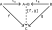

For part `3.`, we know that the morphisms $f ⨟ h$ and $g ⨟ h$ exist by simply composing morphisms, and therefore that $D$ can also serve as a $T$ in the definition and that there is some unique morphism from $A + B$ to $D$ we can call $[f ⨟ h, g ⨟ h]$. But $[f,g] ⨟ h$ also exists by simply composing morphisms, and therefore must equal $[f ⨟ h, g ⨟ h]$. Visually:


For part `4.` we know that the morphisms $ι_A$ and $ι_B$ exist because all coproducts exist, and therefore that $A+B$ can serve as a $T$ in the definition and that there is some unique morphism from $A + B$ to $A + B$ that we can call $[ι_A, ι_B]$. But $id_{A+B}$ exists by definition of $A+B$ being an object in the category, and therefore must equal $[ι_A, ι_B]$. Visually:

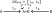

+++

```{admonition} Reveal 7S answer
:class: dropdown

```

+++ {"tags": []}

### *Exercise* 6.18

+++


+++ {"tags": []}

#### Part #1

+++

##### Attempt #1

+++

For part `1.` is this simply constructing the copairing of the two morphisms? As in (6.12) above. First, we'll have to construct a [Product category](https://en.wikipedia.org/wiki/Product_category) and decide what to do with all the arrows in that category. If $f,g$ don't have a common target there will be no copairing, so what will we do with pairs $(f,g)$ that don't have a common target? A functor must map its entire domain (all morphisms) so it doesn't seem this will work.

+++

##### Attempt #2

+++

How do we show that our definition, whatever we guess it to be, is an endo-bi-functor? We must show that it preserves identities and composition (see [Functor](https://en.wikipedia.org/wiki/Functor#Bifunctors_and_multifunctors)).

Regarding preserving identities, because for all objects $A,B$ we will let $F((A,B)) = A+B$ we must also have $F(id_{(A,B)}) = id_{A+B}$. But we also know that $id_{(A,B)} = (id_A,id_B)$, which implies $F((id_A,id_B)) = id_{A+B}$. From Exercise 6.17 we have $[ι_A, ι_B] = id_{A+B}$, which leads to $F((id_A,id_B)) = [ι_A, ι_B]$ and therefore a guess for what the functor should do to pairs of morphisms in general: send them to the pair of canonical injections associated with the sources of the morphisms.

When the morphisms also share a target, this will send the pair of morphisms to the identity on the coproduct. When the morphisms don't share a target, this will at least send the morphism pair somewhere. Unfortunately this approach also assigns pairs of morphisms based on only the two morphism sources, which may define a functor but not one that will result in a category that has anything but identity morphisms.

+++

##### Answer

+++

We need to accept that the morphisms $(f,g)$ must be allowed to have separate targets. Let's split the target $T$ in (6.12) above into two targets $C$ and $D$:

+++

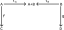

+++

This suggests constructing a coproduct $C+D$ from the targets as well, and a copairing $[f⨟ι_C,g⨟ι_D]$ associated with $(f,g)$ that will always exist in a category with all coproducts:

+++

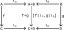

+++

Does this definition preserve identities? If we let $(f,g) = (id_A,id_B)$ (so $C=A$ and $D=B$), then:

$$
F(id_{(A,B)}) = F((id_A,id_B)) = [id_A⨟ι_A,id_B⨟ι_B] = [ι_A,ι_B] = id_{A+B}
$$

Does this definition preserve composition? Before we try to show we preserve composition, let's try to compose two pairs of morphisms in 𝓒, corresponding to two morphisms in 𝓒×𝓒 (showing we at least have two categories):

+++

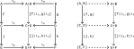

+++

To show we preserve composition, we must show that (using variable names from [Functor](https://en.wikipedia.org/wiki/Functor)) that $F(g∘f) = F(g)∘F(f)$. In this context:

$$
F((j,k)∘(f,g)) = F((j,k))∘F((f,g))
$$

Equivalently:

$$
F((f,g)⨟(j,k)) = F((f,g))⨟F((j,k))
$$

Substituting known relationships:

$$
\begin{align}
F((f,g)⨟(j,k)) & = F((f⨟j,g⨟k)) \\
& = [f⨟j⨟ι_E,g⨟k⨟ι_F] \\
& = [f⨟ι_C,g⨟ι_D] ⨟ [j⨟ι_E,k⨟ι_F] \\
& = F((f,g))⨟F((j,k))
\end{align}
$$

We can express this in the style of (from [Functor](https://en.wikipedia.org/wiki/Functor)):

+++


+++

As the commutative diagram (rotated relative to the previous diagram):

+++

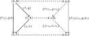

+++

Note that the conclusion $[f⨟j⨟ι_E,g⨟k⨟ι_F] = [f⨟ι_C,g⨟ι_D] ⨟ [j⨟ι_E,k⨟ι_F]$ relies on what is now a somewhat standard argument, similar to part `3.` of Exercise 6.17. By the universal property of the coproduct we know that there is only one morphism from $A+B$ to $E+F$. We know that $[f⨟ι_C,g⨟ι_D] ⨟ [j⨟ι_E,k⨟ι_F]$ exists simply by composing morphisms, so we can conclude that it equals this morphism (which we can also call $[f⨟j⨟ι_E,g⨟k⨟ι_F]$).

+++

```{admonition} Reveal 7S answer
:class: dropdown

```

+++ {"tags": []}

#### Part #2

+++

For part `2.` let $A$ serve as $T$ in (6.12) in the first diagram below:

+++

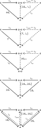

+++

Reading one equation off the left side of the diagram:

$$
id_A = ι_A ⨟ [id_A,!_A]
$$

We would have an isomorphism if we could show:

$$
id_{A+∅} = [id_A,!_A] ⨟ ι_A
$$

It may be tempting to collapse the two A on the left side of the diagram to conclude the preceding statement, but we only know that the composition $[id_A,!_A] ⨟ ι_A$ exists. The commutative diagram makes no claim about it being equal $id_{A+∅}$ because $id_{A+∅}$ is not on the diagram. This proof would also not use the universal property of ∅ and could be done with any object B in place of ∅.

To prove the preceding statement, from part `4.` of Exercise 6.17 we know:

$$
id_{A+∅} = [ι_A,ι_∅]
$$

We also know, imagining an arrow $!_A$ across the top of the diagram:

$$
ι_∅ = !_A ⨟ ι_A
$$

Substituting the second equation in the first, and adding an identity morphism:

$$
id_{A+∅} = [ι_A,!_A ⨟ ι_A] = [id_A ⨟ ι_A,!_A ⨟ ι_A]
$$

Using part `3.` of Exercise 6.17:

$$
id_{A+∅} = [id_A ⨟ ι_A,!_A ⨟ ι_A] = [id_A,!_A] ⨟ ι_A
$$

+++

```{admonition} Reveal 7S answer
:class: dropdown

```

+++ {"tags": []}

#### Part #3

+++

In the following, we construct the morphism from $A+(B+C)$ to $(A+B)+C$ by first constructing the morphisms $[ι_{A2},ι_{B2}⨟ι_{B+C}]$ and $ι_{C1}⨟ι_{B+C}$. Given the category has all coproducts we can then construct the rather complicated $[[ι_{A2},ι_{B2}⨟ι_{B+C}],ι_{C1}⨟ι_{B+C}]$. The morphism in the reverse direction is constructed in a similar way.

Given these two morphisms, we know that we can compose them to construct a morphism from $A+(B+C)$ to itself. But $id_{A+(B+C)}$ must also exist, and since there is only one morphism from $A+(B+C)$ to itself (by the universal property of the coproduct) we know these must be equal (and therefore both of these morphisms are an isomorphism i.e. are inverses of each other).

+++

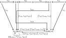

+++

A similar argument holds in this situation:

+++

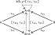

+++

```{admonition} Reveal 7S answer
:class: dropdown


The author uses the term $id_A + ι_B$ in his answer to part `a`. By redrawing part of the commutative diagram above, it's clear that $id_A + ι_{B2} = [ι_{A2},ι_{B2}⨟ι_{B+C}]$:

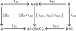

However, it's not clear that $[id_A + ι_{B2},ι_{C1}] = [[ι_{A2},ι_{B2}⨟ι_{B+C}],ι_{C1}⨟ι_{B+C}]$ from that. This may be a mistake.
```

+++

<!--
Never ended up using these drawings:
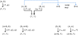
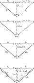
-->

+++ {"tags": []}

## 6.2.3 Pushouts

+++ {"tags": []}


+++ {"tags": []}


+++

See [Pushout (category theory)](https://en.wikipedia.org/w/index.php?title=Pushout_%28category_theory%29&section=2), in particular the whole paragraph starting:

> Suppose that X, Y, and Z as above are sets, and that f : Z → X and g : Z → Y are set functions.

+++ {"tags": []}

### *Example* 6.23

+++ {"tags": []}


+++ {"tags": []}

### *Exercise* 6.24

+++


+++

For part `1.`, what does it mean for all pushouts to exist? A pushout is a type of colimit, a colimit for the particular diagram given in Definition 6.19 above. See [Limit (category theory) § Existence of limits](https://en.wikipedia.org/wiki/Limit_(category_theory)#Existence_of_limits). So we must show that every diagram J of the shape X ← A → Y has a colimit in $\bf{Disc}_S$. The only diagrams of this shape will have A = X = Y, however, making all the morphisms identities. All these diagrams will have a colimit, only because all the morphisms in the cone will again the identity (that is, there will only be one cone on every object).

For part `2.`, there is clearly an initial object in the category **1** corresponding the the single object; there is one morphism from it to every other object (namely, the identity morphism to itself). In the category **0** it is vacuously true that there is one morphism out of every object, but there is no object (hence it has no initial object).

+++

```{admonition} Reveal 7S answer
:class: dropdown

```

+++ {"tags": []}

### *Example* 6.25

+++ {"tags": []}


+++ {"tags": []}

### *Exercise* 6.26

+++ {"tags": []}


+++

First we'll construct the solution somewhat experimentally, by simply trying to get $f ⨾ ι_X = g ⨾ ι_Y$ (the black dashed arrows in the drawing below). The arrows in this drawing are in various styles only to make them easier to visually distinguish. Compare to (6.20):

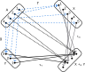

In the previous, we could have still satisfied the requirement $f ⨾ ι_X = g ⨾ ι_Y$ by e.g. mapping both {2,4} in X to the same place we mapped {1}:

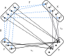

Although the diagram commutes, it does not satisfy (6.21) for all T. In the language of [pushout](https://ncatlab.org/nlab/show/pushout), it's not the universal solution to finding a commutative square like this (just one solution).

+++

To check the answer using the abstract description of Example 6.25, we'll start by filling in a binary relation with only the connections produced by the a ∈ A:

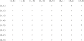

+++

Taking the reflexive, symmetric closure:

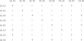

+++

This relatively sparse matrix is better visualized as a graph. This approach also makes it easier to see how the resulting equivalence categories are the connected components of the corresponding graph (see [Component (graph theory)](https://en.wikipedia.org/wiki/Component_(graph_theory))):

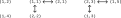

+++

Taking the transitive closure:

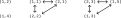

+++ {"tags": []}

```{admonition} Reveal 7S answer
:class: dropdown

```

+++ {"tags": []}

### *Exercise* 6.28

+++ {"tags": []}


+++

For `1.`, remember that the initial object has only one morphism to every object. This includes the coproduct $X+Y$; therefore the morphisms $f⨟ι_X$ and $g⨟ι_Y$ must be the same (i.e. $f⨟ι_X$ = $g⨟ι_Y$).

The conclusion in part `2.` follows directly from the universal property of a coproduct (see the commutative diagram in (6.12)). That is, adding (6.12) to the diagram on the left results in (6.21). For (6.21) to commute we also need $f⨟x = g⨟y$, but this follows from the universal property of the initial object.

For part `3.` assume we have a pushout $X +_∅ Y$, so that as given in part (b) of the definition of a pushout there is a unique morphism $t$ from it to any other object $T$ and (6.21) commutes. The pushout $X +_∅ Y$ is then a coproduct $X + Y$ with respect to $X$ and $Y$ where the the copairing $[f,g]$ given in (6.12) is equal to $t$.

+++ {"tags": []}

```{admonition} Reveal 7S answer
:class: dropdown

```

+++ {"tags": []}

### *Example* 6.29

+++ {"tags": []}


+++

This example starts:

> If $T$ is any other set and we have maps $x\colon X\to T$ and $y\colon Y\to T$ that commute with $f$ and $g$, i.e. $f\cong x=g\cong y$, then this commutativity implies that ...

It seems likely the congruent symbols ($\cong$) are wrong. This makes more sense:

> If $T$ is any other set and we have maps $x\colon X\to T$ and $y\colon Y\to T$ that commute with $f$ and $g$, i.e. $f⨟x=g⨟y$, then this commutativity implies that ...

Thinking of this example in terms of connected components (see [Component (graph theory)](https://en.wikipedia.org/wiki/Component_(graph_theory))) makes it much easier to accept the solution. If you follow the blue dotted lines in the drawing, you'll see there is just one single large component.

+++ {"tags": []}

## 6.2.4 Finite colimits

+++ {"tags": []}


+++

A similar pair of drawings is shown below Definition 3.92 (with a diagram on the left, and a cone on the diagram on the right). The author chooses to flip both the morphisms and the picture here; the same flip is present in [Limit (category theory)](https://en.wikipedia.org/wiki/Limit_(category_theory)#Existence_of_limits) and [Cone (category theory)](https://en.wikipedia.org/wiki/Cone_(category_theory)).

The advantage to flipping both the arrows and the diagram is that the arrows end up in the same direction, from top to bottom. The disadvantages is that these drawings aren't going to make intuitive sense if you're using the words [apex](https://en.wiktionary.org/wiki/apex) and [vertex](https://en.wiktionary.org/wiki/vertex), which imply the apex/vertex is at the top of a diagram.

In [Coproduct](https://en.wikipedia.org/wiki/Coproduct), the authors only reverse the morphisms (skipping the picture flip). The author's language in Example 6.42 indicates he at least sometimes thinks in these terms (also, there are two authors):

> These are colimits over the graph ...

+++ {"tags": []}

### *Definition* 6.30

+++ {"tags": []}


+++

Another way of saying this is that 𝓒 is a finite cocomplete category (see [Complete category](https://en.wikipedia.org/wiki/Complete_category)).

+++ {"tags": []}

### *Example* 6.31

+++ {"tags": []}


+++ {"tags": []}

### *Proposition* 6.32

+++ {"tags": []}


+++ {"tags": []}

### *Example* 6.33

+++ {"tags": []}


+++ {"tags": []}

### *Exercise* 6.35

+++ {"tags": []}


+++

Notice the variable names change between the drawings in the first and second part of Example 6.33. One possible correction is to change equation (6.34) to read:

+++ {"tags": []}


+++

First, let's check that the given diagram is a cocone over $S$. We'll redraw the diagram in the style of the the diagram on the right at the start of section 6.2.4, and with variable names from [Cone (category theory)](https://en.wikipedia.org/wiki/Cone_(category_theory)). We must show that all paths that end at $S$ in the following are equal in 𝓒 (and therefore, in this case, that the diagram commutes):

+++

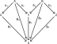

+++

Returning to the diagram that ends the question:

+++

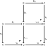

+++

Notice that, using (6.20):

$$
a_1⨟ι_X = a_2⨟ι_{Y1} \\
b_1⨟ι_{Y2} = b_2⨟ι_Z \\
ι_{Y1}⨟ι_Q = ι_{Y2}⨟ι_R
$$

+++

We know from post-composing and pre-composing that:

$$
a_1⨟ι_X⨟ι_Q = a_2⨟ι_{Y1}⨟ι_Q \\
a_2⨟ι_{Y1}⨟ι_Q = a_2⨟ι_{Y2}⨟ι_R \\
b_1⨟ι_{Y2}⨟ι_R = b_2⨟ι_Z⨟ι_R \\
b_1⨟ι_{Y1}⨟ι_Q = b_1⨟ι_{Y2}⨟ι_R
$$

+++

And therefore that:

$$
ϕ_A = a_1⨟ι_x⨟ι_Q = a_1⨟ϕ_X = a_2⨟ι_{Y1}⨟ι_Q = a_2⨟ι_{Y2}⨟ι_R = a_2⨟ϕ_Y \\
ϕ_B = b_2⨟ι_z⨟ι_R = b_2⨟ϕ_Z = b_1⨟ι_{Y1}⨟ι_Q = b_1⨟ι_{Y2}⨟ι_R = b_1⨟ϕ_Y
$$

+++

We must also show that this cocone is the colimit. That is, for all other cocones $(S_2,ψ)$ there exists a unique morphism $u$ such that:

+++

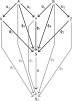

+++

How do we construct some other cocone $(S_2,ψ)$ over this same diagram? We constructed our first cocone by taking pushouts, which is the most general way (in some sense) to complete a commutative square. However, we didn't use anything special about the pushout to confirm we had a cocone; we only used the fact that we had a commutative diagram. Said another way, let's assume there are other completions of these commutative squares than the pushout. That lets us construct any other cocone:

+++

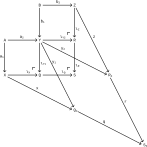

+++

To be clear, let's follow the same logic we used before. Given that these three new commutative squares commute:

$$
a_1⨟x = a_2⨟y_1 \\
b_1⨟y_2 = b_2⨟z \\
y_1⨟q = y_2⨟r
$$

+++

We know from pre-composing and post-composing that:

$$
a_1⨟x⨟q = a_2⨟y_1⨟q \\
a_2⨟y_1⨟q = a_2⨟y_2⨟r \\
b_1⨟y_2⨟r = b_2⨟z⨟r \\
b_1⨟y_1⨟q = b_1⨟y_2⨟r
$$

+++

And therefore that:

$$
ψ_A = a_1⨟x⨟q = a_1⨟ψ_X = a_2⨟y_1⨟q = a_2⨟y_2⨟r = a_2⨟ψ_Y \\
ψ_B = b_2⨟z⨟r = b_2⨟ψ_Z = b_1⨟y_1⨟q = b_1⨟y_2⨟r = b_1⨟ψ_Y
$$

+++

How do $S$ and $S_2$ relate to each other? If we take the pushout $M = Q_2 +_S R_2$ we must allow for it to be different than $S_2$. Then by the universal properties of the pushouts $Q +_Y R$ and $Q_2 +_S R_2$ we have unique morphisms $t_1$ and $t_2$ that compose to make the unique morphism $u$:

+++

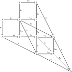

+++ {"tags": []}

```{admonition} Reveal 7S answer
:class: dropdown

```

+++

### *Corollary* 6.36

+++ {"tags": []}


+++

That is, **FinSet** and **Set** are finite cocomplete categories. This follows from Proposition 6.32 and we know about these categories.

+++

### *Theorem* 6.37

+++ {"tags": []}


+++

See Example 3.99 for a finite limit being a subset of a product.

+++ {"tags": []}


+++

Look at $\sim$ the same way you would look at =, triggering the theory behind a [Binary relation](https://en.wikipedia.org/wiki/Binary_relation). You can pronounce it "is equivalent to" although in latex it would be written `\sim` (for similar). The symbol ≅ should trigger the concept of an isomorphism, which could also be used to construct a binary relation between objects in a category.

+++ {"tags": []}


+++

Compare to Example 3.96. We don't form an empty tuple here because there are no $d∈D(v)$. That is, this construction only ever produces a set of two-tuples rather than variable-length tuples. Analogously, a product of zero elements is one and a sum of zero elements is zero.

+++ {"tags": []}


+++

This definition conflicts with the one given in [Disjoint union](https://en.wikipedia.org/wiki/Disjoint_union) and earlier in the text, where the tuples are in the opposite order $(d,v)$.

+++ {"tags": []}


+++

### *Exercise* 6.41

+++ {"tags": []}


+++

Consider the set:

+++

$$
colim_𝓙 D ≔ \big\{(v,d)|v∈\{X,N,Y\},d∈D(v)\big\} \big/ \sim
$$

+++

Without the quotient, this is simply the disjoint union of the three sets. We have only two arrows, so we want the set of equivalences classes under the equivalence relation $\sim$ generated by putting $(N,n) \sim (X,x)$ if $D(f)(n) = x$, and by putting $(N,n) \sim (Y,y)$ if $D(g)(n) = y$. We can partially take the transitive closure by putting $(X,x) \sim (Y,y)$ when $D(f)(n) = x$ and $D(g)(n) = y$; this corresponds to the definition in Example 6.25 (with $a∈A$ replaced by $n∈N$).

+++ {"tags": []}

```{admonition} Reveal 7S answer
:class: dropdown

```

+++

### *Example* 6.42

+++ {"tags": []}


+++

See also [Equaliser (mathematics)](https://en.wikipedia.org/wiki/Equaliser_(mathematics)) and [Coequalizer](https://en.wikipedia.org/wiki/Coequalizer).

+++ {"tags": []}

## 6.2.5 Cospans

+++ {"tags": []}


+++

Notice the term "apex" is also used in [Cone (category theory)](https://en.wikipedia.org/wiki/Cone_(category_theory)); it may be better to use vertex and base in that context to avoid an overload with this terminology. That is, use the terms apex/feet with a span/cospan, and vertex/base with a cone/cocone.

+++ {"tags": []}


+++ {"tags": []}


+++ {"tags": []}


+++

### *Exercise* 6.48

+++ {"tags": []}


+++

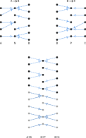

+++ {"tags": []}

```{admonition} Reveal 7S answer
:class: dropdown

```

+++

### *Exercise* 6.49

+++ {"tags": []}


+++

Composition reduces the two cospans $A→B$ and $B→C$ to a single cospan $A→C$ where the only remaining components are those that are connected all the way from $A$ to $C$.

+++ {"tags": []}

```{admonition} Reveal 7S answer
:class: dropdown

```
