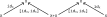
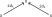
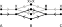
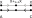
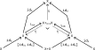
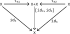
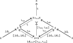

---
jupytext:
  text_representation:
    extension: .md
    format_name: myst
    format_version: 0.13
    jupytext_version: 1.14.1
kernelspec:
  display_name: Python 3 (ipykernel)
  language: python
  name: python3
---

+++ {"tags": []}

# 6.3 Hypergraph categories

+++


+++ {"tags": []}

## 6.3.1 Frobenius monoids

+++


+++

It may help to remember μ via alliteration (mu for merger), and the character η then looks similar (part of the same monoid). To get alliteration for δ you'd have to call it "doubler" rather than splitter (delta for doubler), and then ε is the next greek letter after δ (part of the same comonoid).

+++


+++

See also [Frobenius algebra § Category-theoretical definition](https://en.wikipedia.org/wiki/Frobenius_algebra#Category-theoretical_definition). What is called "the Frobenius law" here corresponds to the two commutative diagrams, and the end of the section mentions the special law.

+++


+++ {"tags": []}

### Theorem 6.55

+++

What is the author referring to with the word "each" in this Theorem? Did he mean to say there was more than one map $f$?

+++


+++ {"tags": []}

### Exercise 6.57

+++


+++

```{admonition} Reveal 7S answer
:class: dropdown

```

+++ {"tags": []}

### Theorem 6.58

+++


+++ {"tags": []}

## 6.3.2 Wiring diagram for hypergraph categories

+++


+++


+++ {"tags": []}

### Exercise 6.59

+++


+++

```{admonition} Reveal 7S answer
:class: dropdown

```

+++ {"tags": []}

## 6.3.3 Definition of a hypergraph category

+++


+++


+++


+++ {"tags": []}

### Exercise 6.62

+++


+++

```{admonition} Reveal 7S answer
:class: dropdown

```

+++ {"tags": []}

### Exercise 6.63

+++


+++

The special law can also be expressed $δ_X⨟μ_X = id_X$ (see [Frobenius algebra § Category-theoretical definition](https://en.wikipedia.org/wiki/Frobenius_algebra#Category-theoretical_definition)). To compose these two morphisms we first stick together the right foot of the left with the left foot of the right:



+++

As described in section 6.2.5 (on Cospans), to construct the composition we must also take the pushout (all finite colimits exist, so all pushouts exist). Then, as also described in that section, we must confirm that the result is isomorphic to the identity cospan:



+++

Let's start with a proof sketch in the less ambitious $\bf{Cospan}_\bf{FinSet}$ rather than any $\bf{Cospan}_𝓒$. If we let $X = \underline{2}$, then we have:



+++

Which obviously reduces (the connected components are emphasized in gray and black) to:



+++

Now let's address the more general case. By the universal property of the pushout, with $X$ the target:

$$
\begin{align}
ι_{XA}⨟t = id_X \\
ι_{XB}⨟t = id_X \\
\end{align}
$$

<!-- Therefore:

$$
ι_{XB}⨟t = ι_{XA}⨟t \\
$$ -->

We've shown e.g. $ι_{XA}⨟t = id_X$ which is half of what we need to show that $X$ and $X+_{X+X}X$ are isomorphic. How do we show $t⨟ι_{XA} = id_{X+_{X+X}X}$? We know that $t⨟ι_{XA}$ exists by composition, and there is a unique morphism from $id_{X+_{X+X}X}$ to itself; therefore these must be the same. In a visual form:



+++

<!-- By the universal property of the coproduct, with $X$ the target:



$$
ι_{X1}⨟[id_X,id_X] = id_X \\
ι_{X2}⨟[id_X,id_X] = id_X
$$

Therefore:

$$
ι_{X1}⨟[id_X,id_X] = ι_{X2}⨟[id_X,id_X]
$$ -->

<!-- By the universal property of the coproduct, with $X+_{X+X}X$ the target:



$$
ι_{X2}⨟[ι_{XA},ι_{XB}] = ι_{XB} \\
ι_{X1}⨟[ι_{XA},ι_{XB}] = ι_{XA}
$$ -->

<!-- Using unique morphisms associated with the coproduct:

$$
[ι_{XA},ι_{XB}] = [id_X,id_X]⨟ι_{XB}
$$ -->

<!-- By the universal property of the pushout $X+_{X+X}X$, with $X+_{X+X}X$ the target:

$$
ι_{XB} = ι_{XB}⨟t_2 \\
ι_{XA} = ι_{XA}⨟t_2 \\
t_2 = id_{X+_{X+X}X}
$$ -->

+++

```{admonition} Reveal 7S answer
:class: dropdown

```

+++ {"tags": []}

### Example 6.64

+++


+++ {"tags": []}

### Example 6.65

+++


+++ {"tags": []}

### Proposition 6.66

+++


+++ {"tags": []}

### Exercise 6.67

+++


+++

```{admonition} Reveal 7S answer
:class: dropdown

```
