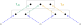
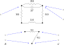

---
jupytext:
  text_representation:
    extension: .md
    format_name: myst
    format_version: 0.13
    jupytext_version: 1.14.1
kernelspec:
  display_name: Python 3 (ipykernel)
  language: python
  name: python3
---

+++ {"tags": []}

# 6.4 Decorated cospans

+++

This section is unique to one of the authors. See [[1502.00872] Decorated Cospans](https://arxiv.org/abs/1502.00872) and [1609.05382.pdf](https://arxiv.org/pdf/1609.05382.pdf).

+++ {"tags": []}

See [Review "Seven-Sketches suggestions" - Google Docs](https://docs.google.com/document/d/1HC_BRM2deHxS7FiIto2bfrM81grKu8vDiI-JgCY5eXU/edit) (several issues in this section).

+++


+++ {"tags": []}

## 6.4.1 Symmetric monoidal functors

+++

See [Monoidal functor](https://en.wikipedia.org/wiki/Monoidal_functor) and [monoidal functor](https://ncatlab.org/nlab/show/monoidal+functor).

+++


+++

### Example 6.69

+++


+++

### Symmetric monoidal power set functor

+++

For the image map $im_f$, imagine what the function would do to the function $f$ given by the relation $\{(1,α),(2,β),(3,β)\}$. We have:

$$
S = \{1,2,3\} \\
T = \{α,β\}
$$

+++

So that:

$$
\begin{align}
P(S) & = \{\{\},\{1\},\{2\},\{3\},\{1,2\},\{2,3\},\{1,3\},\{1,2,3\}\} \\
P(T) & = \{\{\},\{α\},\{β\},\{α,β\}\} \\
\end{align}
$$

+++

What the definition says is that each subset is mapped to its [Image (mathematics)](https://en.wikipedia.org/wiki/Image_(mathematics)); we call this an "image map" in Example 6.69. The new function, again represented as a relation, is:

$$
\begin{align}
im_f = \big\{(\{\}&,\{\}), \\
(\{1\}&,\{α\}), \\
(\{2\}&,\{β\}), \\
(\{3\}&,\{β\}), \\
(\{1,2\}&,\{α,β\}), \\
(\{2,3\}&,\{β\}), \\
(\{1,3\}&,\{α,β\}), \\
(\{1,2,3\}&,\{α,β\})\big\} \\
\end{align}
$$

+++

In [Image (mathematics) § Notation](https://en.wikipedia.org/wiki/Image_(mathematics)#Notation), the article authors suggest $f^→$ and $f^*$ as alternatives to $im_f$. Many readers will be even more familiar with the $f(A)$ and $f[A]$ notations, although these are more ambiguous (relying on only capitalization to indicate a subset of some set rather than an element of the set).

+++

See also [category theory - Covariant Power set functor - MSE](https://math.stackexchange.com/questions/1487902/covariant-power-set-functor) for a less helpful example because the source and target sets are the same size. The "Power sets functor" example in [Functor § Examples](https://en.wikipedia.org/wiki/Functor#Examples) is fine, although for someone new to the concept it is a bit confusing that the function $f$ is a map from $X$ to the power set of $X$. That is, in that example we have (adding $S$ and $T$ from the definition in this text):

$$
\begin{align}
S = X & = \{0,1\} \\
T = Y & = \{\{\},\{0\},\{1\},X=\{0,1\}\} \\
\end{align}
$$

+++

### Exercise 6.70

+++


+++

Remember that $|P(S)| = 2^{|S|}$. So we know that $|P(S)×P(T)| = 2^{|S|+|T|}$ and $|P(S×T)| = 2^{|S||T|}$; except when $|S|=1$ or $|T|=1$ the latter term will be equal to or much larger than the former. In the example above, we had $|S|=3$ and $|T|=2$. To imagine the 32 elements of $P(S)×P(T)$, consider how much space it would take to write out the cartesian product of the 8 elements of $P(S)$ and 4 elements of $P(T)$ both explicitly written out above. To imagine the 64 elements of $P(S×T)$, try taking the power set of (using e.g. [Pascal's triangle](https://en.wikipedia.org/wiki/Pascal%27s_triangle) to get up to 64, or bit flipping six bits):

$$
S×T = \{(1,α),(2,α),(3,α),(1,β),(2,β),(3,β)\}
$$

+++

Inspect the diagram in Exercise 6.70. In terms of Rough Definition 6.68, in Example 6.69 and along the arrows on the top/bottom of the diagram we are substituting $c_1 = S$ and $c_2 = T$. Per Exercise 6.69, the power set functor acts on morphisms by sending them to the their image map, so e.g. $P(f×g) = im_{f×g}$ and $P(f)×P(g) = im_f×im_g$. What it means to be "natural" in this context then is similar to what it means to be natural in [Natural transformation](https://en.wikipedia.org/wiki/Natural_transformation), but with F defined by the structure of the left side of the equation in Rough Definition 6.68 and G defined by the structure of the right side of the equation:

$$
φ_{c_1,c_2}:F(c_1) ⊗_D F(c_2) → F(c_1 ⊗_C c_2)
$$

+++

Let's replace F and G in [Natural transformation](https://en.wikipedia.org/wiki/Natural_transformation) by $F_n$ and $G_n$ to avoid a namespace conflict with the $F$ used for the symmetric monoidal functor. Then more explicitly, $F_n$ and $G_n$ are functors from $𝓒×𝓒→𝓓$ (as also stated in [Monoidal functor](https://en.wikipedia.org/wiki/Monoidal_functor)) and could be given:

$$
\begin{align}
F_n((c_1,c_2)) & = F(c_1) ⊗_D F(c_2) \\
G_n((c_1,c_2)) & = F(c_1 ⊗_C c_2)
\end{align}
$$

+++

We are being asked to show $φ_{S,T}⨟im_{f×g} = im_f×im_g⨟φ_{S',T'}$. We know from Example 4.49 that:

$$
im_f×im_g(A,B) ≔ (im_f(A),im_g(B)) :P(S)×P(T)→P(S')×P(T')
$$

These variable names follow Example 6.69, where $A∈P(S)$ and $B∈P(T)$ (A is a subset of S, and B is a subset of T).

+++

The coherence maps are defined (these are essentially equivalent, but with the dummy variables changed):

$$
\begin{align}
φ_{S,T}(A,B)     & ≔ A×B :P(S)×P(T)→P(S×T) \\
φ_{S',T'}(im_f(A),im_f(B)) & ≔ im_f(A) × im_f(B) :P(S')×P(T')→P(S'×T')
\end{align}
$$

+++

How do we define $im_{f×g}$? By analogy with how $A$ and $B$ are defined above, let's define $C$ so $C ∈ P(S×T)$. That is, $C$ is a set of sets where each individual set comprises two-tuples:

$$
\begin{align}
f×g(c) = f×g(s,t) & ≔ (f(s),f(t)) :S×T→S'×T' \\
im_{f×g}(C) & ≔ \{f×g(c) | c∈C\} :P(S×T)→P(S'×T') \\
\end{align}
$$

+++

The reason we're starting with this rather general definition is that you can't construct every element of $P(S×T)$ from $P(S)×P(T)$; the latter set is smaller (as discussed above). So you can't take a spec of $A,B$ to construct every element of $P(S×T)$. For example, the set $\{(2,α),(3,β)\}$ in the context of the example above is an element of $P(S×T)$ but not an element of $P(S)×P(T)$.

+++

We do have more structure here, however, because every $C$ will have been constructed from two sets $A,B$ as $A×B$ by $φ_{S,T}$. Therefore:

+++

$$
\begin{align}
im_{f×g}(C) & ≔ \{f×g(a,b) | (a,b)∈A×B=C\} :P(S×T)→P(S'×T') \\
 & = \{(f(a),f(b)) | (a,b)∈A×B\} \\
 & = im_f(A) × im_f(B) \\
\end{align}
$$

+++

```{admonition} Reveal 7S answer
:class: dropdown

```

+++ {"tags": []}

## 6.4.2 Decorated cospans

+++


+++


+++ {"tags": []}

### Example of composition

+++


+++


+++


+++


+++


+++


+++


+++


+++ {"tags": []}

### Theorem 6.77

+++ {"tags": []}


+++ {"tags": []}

### Exercise 6.78

+++


+++

Because 𝓒 is a symmetric monoidal functor with finite colimits, the category $\bf{Cospan}_𝓒$ is a hypergraph category by Example 6.61. Then, because the constant functor is a symmetric monoidal functor, we should also have that $\bf{Cospan}_F$ is a hypergraph category by Theorem 6.77.

+++

```{admonition} Reveal 7S answer
:class: dropdown

```

+++ {"tags": []}

## 6.4.3 Electrical circuits

+++


+++


+++ {"tags": []}

### Exercise 6.79

+++


+++

$$
(V,A,s,t,l) = \big( \\
    \{1,2,3,4\}, \\
    \{r12,c12,r24,i34,r13\}, \\
    \{(r12,1),(c12,1),(r24,2),(i34,3),(r13,1)\}, \\
    \{(r12,2),(c12,2),(r24,4),(i34,4),(r13,3)\}, \\
    \{(r12,2Ω),(c12,3F),(r24,1Ω),(i34,1H),(r13,1Ω)\}\big)
$$

+++

```{admonition} Reveal 7S answer
:class: dropdown

```

+++ {"tags": []}

### A decoration functor for circuits

+++


+++ {"tags": []}

### Exercise 6.80

+++


+++

```{admonition} Reveal 7S answer
:class: dropdown

```

+++ {"tags": []}

### Exercise 6.82

+++


+++


+++

```{admonition} Reveal 7S answer
:class: dropdown

```

+++ {"tags": []}

### Open circuits using decorated cospans

+++


+++


+++ {"tags": []}

### Exercise 6.84

+++


+++

$$
(V,A,s,t,l) = \big( \\
    \{1,2\}, \\
    \{c12\}, \\
    \{(c12,1)\}, \\
    \{(c12,2)\}, \\
    \{(c12,battery)\}\big)
$$

+++

```{admonition} Reveal 7S answer
:class: dropdown

```

+++


+++ {"tags": []}

### Composition in $\textbf{Cospan}_{Circ}$

+++


+++


+++


+++

If we draw (6.85) in the style of (6.47) we get:


+++


+++

When the author refers to $ι_N$ and $ι_P$, he's referring to how they are defined in (6.20), perhaps more clearly stated with these morphisms labeled on (6.85):



+++

Said yet another way, the author uses the language "pushout maps" rather than what we might call the "coproduct maps" defined in (6.12) (which also use the symbol iota). The copairing is only defined in terms of (6.12), however, with $f$ and $g$ corresponding to $ι_N$ and $ι_P$ (perhaps this isn't drawn because it leads to a namespace clash on $ι_N$ and $ι_P$). So the function $f = [ι_N,ι_P]: \underline{4}→\underline{3}$ is from the coproduct $N+P$ to the pushout $N+_BP$.

The clause "as described in Example 6.14 and 6.25" would probably be clearer if it ended with "respectively" (one covers copairing, the other covers pushout maps).

+++ {"tags": []}

### Exercise 6.86

+++


+++

These two functions have already been expressed as morphisms in $\textbf{Cospan}_{Circ}$ in (6.72) and the drawing below it. Repeating those here:



+++

Computing the composite of the cospans in the style of (6.47) (some of the connected components are given unique colors to help visually distinguish the arrows):


+++

Computing the composite of the cospans in the style of (6.85):


+++

The copairing $f = [ι_N,ι_P]: \underline{7}→\underline{5}$:


+++

```{admonition} Reveal 7S answer
:class: dropdown

```

+++ {"tags": []}

### Monoidal product in $\textbf{Cospan}_{Circ}$

+++


+++


+++ {"tags": []}

### Exercise 6.88

+++


+++ {"tags": []}

The second sentence repeats η; it should use both η and ε:

> Also define cospans η: 0 → 2 and ε: 2 → 0 as follows:

+++

```{admonition} Reveal 7S answer
:class: dropdown

```
