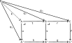

---
jupytext:
  text_representation:
    extension: .md
    format_name: myst
    format_version: 0.13
    jupytext_version: 1.14.1
kernelspec:
  display_name: Python 3 (ipykernel)
  language: python
  name: python3
---

+++ {"tags": []}

# 7.2 Set as a topos

```{code-cell} ipython3
from IPython.display import Image
```


+++


+++ {"tags": []}

## 7.2.1 Set-like properties enjoyed by any topos

+++


+++ {"tags": []}

### Limits and colimits

+++

The author will address all 5 items in the list above, but out of order. This section covers `1.` and `2.` together, then we'll cover `4.` then `3.` then `5.`.

+++


+++


+++

It's not clear why the author changes the object labels in the proposition relative to the introduction to it. Either way, it's not the case that $(A,B,D,E)$ (i.e. $(A,B,A',B')$ i.e. left square) being a pullback implies anything about $(B,C,E,F)$ (i.e. $(B,C,B',C')$ i.e. right square) being a pullback; these are completely separate questions. Proposition 7.3 is saying that if the right square is a pullback, then the left square is a pullback iff the whole rectangle is a pullback.

+++ {"tags": []}

### Exercise 7.4

+++


+++

Notice both our answer and the author's ignores the question's appeal to use Definition 3.92.

+++

The same proposition is given in [Pullback (category theory) § Properties](https://en.wikipedia.org/wiki/Pullback_(category_theory)#Properties):

> There is a natural isomorphism $(A×_CB)×_B D ≅ A×C_D$. Explicitly, this means:
> - if maps f : A → C, g : B → C and h : D → B are given and
> - the pullback of f and g is given by r : P → A and s : P → B, and
> - the pullback of s and h is given by t : Q → P and u : Q → D ,
> - then the pullback of f and gh is given by rt : Q → A and u : Q → D.
>
> Graphically this means that two pullback squares, placed side by side and sharing one morphism, form a larger pullback square when ignoring the inner shared morphism:

$$
\begin{array}{ccccc}
Q&{\xrightarrow {t}}&P&{\xrightarrow {r}}&A \\
\downarrow _{u}&&\downarrow _{s}&&\downarrow _{f} \\
D&{\xrightarrow {h}}&B&{\xrightarrow {g}}&C\end{array}
$$

+++ {"tags": []}

Taking morphism labels from Wikipedia:


+++ {"tags": []}

We'll take rt to mean r∘t, as in the Wikipedia article, for brevity. We'll break the problem into part `1.` where we show that if the left square is a pullback then the whole rectangle is a pullback and part `2.` where we show the converse.

For part `1.`, if the left square is a pullback, then for any other cone $(Q,q_1,q_2)$ over $A'→B'←B$ there is some unique morphism $k: Q→A$ such that $k$ factors out of the pair of maps $q_2: Q→B$ and $q_1: Q→A'$. That is, we have that $q_2 = t∘k$ and $q_1 = u∘k$. The $Q,q_1,q2$ variable names are coming from [Pullback (category theory)](https://en.wikipedia.org/wiki/Pullback_(category_theory)#Properties).

Take some arbitrary (in the sense of ∀, see [Glossary of mathematical jargon § Descriptive informalities](https://en.wikipedia.org/wiki/Glossary_of_mathematical_jargon#Descriptive_informalities)) third morphism $q_3: Q→C$ where $f∘q_3 = g∘h∘q_1$ to come up with an arbitrary cone $(Q,q_1,q_3)$ over $A'→C'←C$. A picture to have in mind is:

+++



+++ {"tags": []}

Is there always a unique morphism from $(Q,q_1,q_3)$ to $(A,rt,u)$? We know that $k$ is a good candidate because $q_1 = u∘k$. Is it also always the case that $q_3 = l∘k$ for some morphism $l$?

Because the right square is a pullback, $(B,r,s)$ is the limit with respect to the cospan $B'→C'←C$. We know that $(Q,h∘q_1,q_3)$ is also a cone over $B'→C'←C$, so we have that $q_3 = r∘q_2$. Given $q_2 = t∘k$ (see above) we then have that $q_3 = r∘t∘k$ and so $l = r∘t$ and $k$ can serve as the unique morphism from $(Q,q_1,q_3)$ to $(A,rt,u)$. This makes the limit of f and gh equal $(A,rt,u)$, which is what we wanted to show.

+++

For part `2.` we assume that the whole rectangle is a pullback and must show that the left rectangle is a pullback as well.

Because the whole rectangle is a pullback, then for any other cone $(Q,q_1,q_3)$ over $A'→C'←C$ there is some unique morphism $k: Q→A$ such that $k$ factors out of the pair of maps $q_3: Q→C$ and $q_1: Q→A'$. That is, we have that $q_3 = r∘t∘k$ and $q_1 = u∘k$.

Take some arbitrary third morphism $q_2: Q→B$ where $s∘q_2 = h∘q_1$ to come up with an arbitrary cone $(Q,q_1,q_2)$ over $A'→B'←B$. Is there always a unique morphism from $(Q,q_1,q_2)$ to $(A,t,u)$? We know that $k$ is a good candidate because $q_1 = u∘k$.  Is it also always the case that $q_2 = m∘k$ for some morphism $m$?

Because the right square is a pullback, $(B,r,s)$ is the limit with respect to the cospan $B'→C'←C$. We know that $g∘h∘q_1 = f∘q_3$ and we have that $g∘h∘q_1 = g∘s∘q_2$ because $h∘q_1 = s∘q_2$, so $g∘s∘q_2 = f∘q_3$. So $(Q,s∘q_2,q_3)$ is also a cone over $B'→C'←C$, so we have that $q_3 = r∘q_2$. Given $q_3 = r∘t∘k$ (see above) we then have that $q_2 = t∘k$ so $m = t$ and $k$ can serve as the unique morphism from $(Q,q_1,q_2)$ to $(A,rt,u)$. This makes the limit of s and h equal $(A,t,u)$, which is what we wanted to show.

```{code-cell} ipython3
:tags: [hide-output]

Image('raster/2023-12-27T16-24-01.png', metadata={'description': "7S answer"})
```

+++ {"tags": []}

### Epi-mono factorizations

+++


+++


+++

See also [epi- (Wiktionary)](https://en.wiktionary.org/wiki/epi-) and [mono- (Wiktionary)](https://en.wiktionary.org/wiki/mono-).

+++


+++ {"tags": []}

### Define mono/epi-morphism

+++

The fact that these diagrams commute doesn't teach us anything useful; we already knew that e.g. $id_A⨟f = id_A⨟f$. Instead, let's draw a second cone (one that is not the limit) over $A→B←A$:


+++

This leads us to the more interesting fact that:

$$
u⨟id_A = u = g_1 = g_2
$$

+++

It's this fact that we would not have if the diagram only commuted.

Said another way, the fact that $f$ is a monomorphism (i.e. the diagram is a pullback) and that $g_1⨟f = g_2⨟f$ implies that $g_1 = g_2$. In the article [Monomorphism](https://en.wikipedia.org/wiki/Monomorphism) this is the focus of the points around a monomorphism being a [left-cancellative](https://en.wikipedia.org/wiki/Cancellation_property) morphism (dually, an [Epimorphism](https://en.wikipedia.org/wiki/Epimorphism) is right-cancellative). In this understanding, we collapse the $id_A$ arrows into the $A$ object. Renaming A/B/C to X/Y/Z:


+++

Let's call C/Z the vertex of the monomorphism $f$ (being the vertex of the associated cone).

+++ {"tags": [], "jp-MarkdownHeadingCollapsed": true}

### Exercise 7.6

+++


+++

To answer `1.` let's start with the fact that $f$ is a monomorphism i.e. a [left-cancellative](https://en.wikipedia.org/wiki/Cancellation_property) morphism:

$$
\begin{align}
f∘a = f∘b & ⇒ a = b
\end{align}
$$

In **Set** we know that all of $f,a,b$ are simply functions, so we can re-express composition as:

$$
\begin{align}
f(a()) = f(b()) & ⇒ a = b
\end{align}
$$

Notice we make $Z=X^0$ or the empty tuple so that we can see $a$ and $b$ as nullary operations (language from [Pointed set](https://en.wikipedia.org/wiki/Pointed_set)). To make these maps from e.g. $Z=\underline{2}$ would only add unnecessary complexity i.e. indirection, essentially precomposing to produce something like:

$$
\begin{align}
f∘a∘z & = f∘b∘z \\
f(a(z)) & = f(b(z))
\end{align}
$$

Instead, let's simply see $a,b$ as objects again so that:

$$
\begin{align}
f(a) = f(b) & ⇒ a = b
\end{align}
$$

See [Injective function](https://en.wikipedia.org/wiki/Injective_function) for the formal requirements to be an injective function, in particular [Injective function § Proving that functions are injective](https://en.wikipedia.org/wiki/Injective_function#Proving_that_functions_are_injective). This is the definition of an injective function.

+++

To answer `2.` we can simply follow the same steps in reverse.

```{code-cell} ipython3
:tags: [hide-output]

Image('raster/2023-12-27T19-59-00.png', metadata={'description': "7S answer"})
```

+++ {"tags": []}

### Define pushing/pulling "along"

+++

See the text above Example 6.22 for comments on what it means for some morphism to be the pushout of $g$ along $f$. Presumably similar language is being used in Exercise 7.7 for pullbacks. It seems that when we say that $x$ is the pullback/pushout of $y$ along $z$, we mean that we want to produce $x$ from a parallel $y$ on a diagram (with $z$ connecting them). So $x$ is like $y$ but in some parallel world defined by $z$.

For pullbacks, it seems that $z$ connects the targets (for pushouts $z$ connects the sources).

The same "pullback along" language was originally used in Exercise 1.79 and Example 1.117 for the same concept.

+++

In the language of [Pullback (category theory) § Properties](https://en.wikipedia.org/wiki/Pullback_(category_theory)#Properties) what we are trying to prove in Exercise 7.8 is worded as:

> [Monomorphisms](https://en.wikipedia.org/wiki/Monomorphism "Monomorphism") are stable under pullback: if the arrow f in the diagram is monic, then so is the arrow p₂. Similarly, if g is monic, then so is p₁.

The author could have worded Exercise 7.8 as asking whether the pullback of a monomorphism $f$ along any morphism $h$ is also a monomorphism.

+++ {"tags": [], "jp-MarkdownHeadingCollapsed": true}

### Exercise 7.7

+++


+++ {"tags": []}

In the language of [Pullback (category theory) § Properties](https://en.wikipedia.org/wiki/Pullback_(category_theory)#Properties) what we are trying to prove here is worded as:

> [Isomorphisms](https://en.wikipedia.org/wiki/Isomorphism "Isomorphism") are also stable, and hence, for example, $X ×_X Y ≅ Y$ for any map $Y → X$ (where the implied map $X → X$ is the identity).

+++ {"tags": []}

To show that $i'$ is an isomorphism, we must show that $i'⨟q = id_{A'}$ and $q⨟i' = id_A$ for some morphism $q$. How do we come up with any morphism $q: A→A'$, much less one that is an inverse? If $A$ was the vertex of a cone over $A→B←B'$ then we could use the universal property of the pullback to generate at least one morphism. It is in fact a cone; the outer square in the following diagram commutes because $id_A⨟f = f⨟i^{-1}⨟i = f$:

+++ {"tags": []}


+++ {"tags": []}

So we've generated some $u$ that may be able to serve as the inverse $q$ we are looking for. Because of the universal property:

$$
\begin{align}
u⨟i' & = id_A \\
u⨟f' & = f⨟i^{-1}
\end{align}
$$

+++ {"tags": []}

We can ignore the second equation, but the first equation is half of what we are trying to show. How do we also show that $i'⨟u = id_{A'}$? Recall that $A'$ is also a cone over $A→B←B'$, and in fact the limiting cone:


+++ {"tags": []}

This means that there is at most one morphism from $A'$ to $A'$ where the source ($A'$) is also a cone over $A→B←B'$. The morphism $i'⨟u$ exists simply by composition and is also from $A'$ to $A'$, and so must equal $id_{A'}$.

```{code-cell} ipython3
:tags: [hide-output]

Image('raster/2023-12-27T21-49-09.png', metadata={'description': "7S answer"})
```

<!-- Because the diagram commutes, and $i$ has an inverse, we know that:

$$
\begin{align}
f'⨟i & = i'⨟f \\
f'⨟i⨟i^{-1} & = i'⨟f⨟i^{-1} \\
f' & = i'⨟f⨟i^{-1}
\end{align}
$$ -->

+++


+++ {"tags": []}

It's trivial to show the diagram commutes: $id_A⨟f = f⨟id_B$. We must also show that for any $m: C→B$ and $n: C→A$ where the outer square in the following diagram commutes (i.e. $n⨟f = m⨟id_B$) there exists a unique morphism $u: C→A$ so that $u⨟f = m$ and $u⨟id_A = n$:


+++ {"tags": []}

The morphism $n$ already satisfies the two equations and so can serve as $u$.

```{code-cell} ipython3
:tags: [hide-output]

Image('raster/2023-12-27T21-48-17.png', metadata={'description': "7S answer"})
```

<!--  -->

+++ {"tags": []}

### Exercise 7.8

+++


+++ {"tags": ["hide-output"]}

See also [](exercise-7-8.md).

```{code-cell} ipython3
:tags: [hide-output]

Image('raster/2023-12-29T16-13-03.png', metadata={'description': "7S answer"})
```

Notice the author's mention of the [Pasting lemma](https://en.wikipedia.org/wiki/Pasting_lemma).

+++

See also [How to prove that pullback preserves monomorphisms? - MSE](https://math.stackexchange.com/questions/1980887/how-to-prove-that-pullback-preserves-monomorphisms) and [What does it mean for pullbacks to preserve monomorphisms? - MSE](https://math.stackexchange.com/questions/1238066/what-does-it-mean-for-pullbacks-to-preserve-monomorphisms/1239704#1239704) and the following from [Monomorphism](https://en.wikipedia.org/wiki/Monomorphism):

> In the setting of [posets](https://en.wikipedia.org/wiki/Partially_ordered_set "Partially ordered set") intersections are [idempotent](https://en.wikipedia.org/wiki/Idempotence "Idempotence"): the intersection of anything with itself is itself. Monomorphisms generalize this property to arbitrary categories. A morphism is a monomorphism if it is idempotent with respect to [pullbacks](https://en.wikipedia.org/wiki/Pullback_(category_theory) "Pullback (category theory)").

+++ {"tags": []}

### Epi-mono images

+++


+++

See also [Isomorphism theorems § Discussion](https://en.wikipedia.org/wiki/Isomorphism_theorems#Discussion).

+++ {"tags": []}

### Exercise 7.9

+++


```{code-cell} ipython3
:tags: [hide-output]

Image('raster/2023-09-13T16-30-42.png', metadata={'description': "7S answer"})
```


+++ {"tags": []}

### Cartesian closed

+++


+++

See also [Cartesian closed category](https://en.wikipedia.org/wiki/Cartesian_closed_category).

+++ {"tags": []}

### Exercise 7.11²

+++


+++


+++


+++ {"tags": []}

## 7.2.2 The subobject classifier

+++ {"tags": []}

### Definition 7.12

+++


+++

See also [Subobject classifier](https://en.wikipedia.org/wiki/Subobject_classifier).

+++


+++ {"tags": []}

### The subobject classifier in **Set**

+++


+++ {"tags": []}

### Exercise 7.16

+++


```{code-cell} ipython3
:tags: [hide-output]

Image('raster/2023-10-24T14-26-59.png', metadata={'description': "7S answer"})
```

+++ {"tags": []}

### Exercise 7.17

+++


```{code-cell} ipython3
:tags: [hide-output]

Image('raster/2023-10-24T14-38-05.png', metadata={'description': "7S answer"})
```

+++ {"tags": []}

## 7.2.3 Logic in the topos Set

+++


+++


+++


+++ {"tags": []}

### Exercise 7.19

+++


```{code-cell} ipython3
:tags: [hide-output]

Image('raster/2023-10-24T18-27-50.png', metadata={'description': "7S answer"})
```

+++ {"tags": []}

### Exercise 7.20

+++


```{code-cell} ipython3
:tags: [hide-output]

Image('raster/2023-10-24T19-02-36.png', metadata={'description': "7S answer"})
```

+++ {"tags": []}

### Exercise 7.21

+++


```{code-cell} ipython3
:tags: [hide-output]

Image('raster/2023-10-24T19-07-16.png', metadata={'description': "7S answer"})
```

+++ {"tags": []}

### Review

+++


