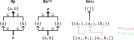
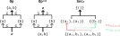
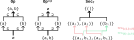
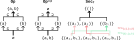

---
jupytext:
  text_representation:
    extension: .md
    format_name: myst
    format_version: 0.13
    jupytext_version: 1.16.1
kernelspec:
  display_name: Python 3 (ipykernel)
  language: python
  name: python3
---

# 7.3 Sheaves

```{code-cell} ipython3
from IPython.display import Image, IFrame
```


+++


+++

See also [Grothendieck topology](https://en.wikipedia.org/wiki/Grothendieck_topology), including:
- A site is defined on the same page; the link [Site (mathematics)](https://en.wikipedia.org/wiki/Grothendieck_topology) is a redirect.
- The link [Grothendieck site](https://en.wikipedia.org/wiki/Grothendieck_topology) is yet another redirect.

+++

## 7.3.1 Presheaves

+++


+++

### Definition 7.22

+++


+++

### Define **set-valued presheaf**

+++

The same definition is presented in [Presheaf (category theory)](https://en.wikipedia.org/wiki/Presheaf_(category_theory)). The author is defining a "presheaf" here as a functor to set, so in the language of [Sheaf (mathematics)](https://en.wikipedia.org/wiki/Sheaf_(mathematics)) we would call these **sheaves of sets** (non-plural **set-valued sheaf**).

See comments on the notation $s|_U$ in [Sheaf (mathematics) § Presheaves](https://en.wikipedia.org/wiki/Sheaf_(mathematics)#Presheaves), where it is used even for non-set presheaves. Strangely, the author invents the notation $s|_f$ for this definition (with a function rather than an open set in the subscript) and then never uses it again. That is, the author only uses open sets in the subscript going forward. This notation originated in [Restriction (mathematics)](https://en.wikipedia.org/wiki/Restriction_(mathematics)), where a subset (rather than a function) is also used in the subscript. We'll typically write $s|_{c'}$ instead, as the author and other sources do.

The notation $s|_f$ is not completely unreasonable, however, and is actually more specific given you are specifically pinning down $f$. However, writing $P(f)(s)$ is already rather short and just as specific, and avoids the use of special notation. To be even clearer, we can always write out $res_{V,U}(s)$.

Notice the author encourages the more general term *restriction map* (equivalent to *restriction morphism*), despite the fact that in the short term the unadorned term "restriction" (or "set restriction") would have communicated enough: these maps/morphisms are only functions (because these are set-valued presheaves).

+++

### Define **contravariant functor**

+++

We referred to the subsection [Sheaf (mathematics) § Presheaves](https://en.wikipedia.org/wiki/Sheaf_(mathematics)#Presheaves) above in several places, but the definition presented in it is *not* the same as the one presented in [Presheaf (category theory)](https://en.wikipedia.org/wiki/Presheaf_(category_theory)). As noted in the first paragraph of the latter, a [Sheaf (mathematics) § Presheaves](https://en.wikipedia.org/wiki/Sheaf_(mathematics)#Presheaves) is a [Presheaf (category theory)](https://en.wikipedia.org/wiki/Presheaf_(category_theory)) where the category $C$ is the poset of open sets in a topological space (a concept that isn't presented here until the paragraph starting **The open sets of a topological space form a preorder.**).

We'll use the the term **categorical presheaf** for [Presheaf (category theory)](https://en.wikipedia.org/wiki/Presheaf_(category_theory)) and **topological presheaf** for [Presheaf (category theory)](https://en.wikipedia.org/wiki/Presheaf_(category_theory)). Since a categorical presheaf is more general, we'll take the unadorned term **presheaf** to mean a categorical presheaf. This last choice conflicts with the redirect for [Presheaf](https://en.wikipedia.org/w/index.php?title=Presheaf&redirect=no), so we'll try to normally add an adjective. This terminology suggests that a "presheaf" or "sheaf" can be seen as a collection of sets. When we say "sheaf" or "presheaf" in either the topological or categorical sense, we imply that we don't know what we are reaping yet.

Notice that in Chp 3 the author defines a database instance on a category $C$ as a functor from $C$ to **Set**. That means that technically his definition of a database instance corresponds to a presheaf on $C^{op}$, so that when you take the double-opposite you get back the definition of a database instance as a functor from $C$ to **Set**. A synonym for "presheaf" is [Contravariant functor](https://en.wikipedia.org/wiki/Functor#Covariance_and_contravariance), as discussed in [Topos § Equivalent definitions](https://en.wikipedia.org/wiki/Topos#Equivalent_definitions). In fact this is actually the preferred language for [Presheaf (category theory)](https://en.wikipedia.org/wiki/Presheaf_(category_theory)), being more common, except when trying to make analogies to topology.

+++

### Example 7.23

+++


+++

### Trivial covering

+++


+++

While the concept of a [Cover (topology)](https://en.wikipedia.org/wiki/Cover_(topology)#open_cover) is used in the distinction between a presheaf and sheaf, the difference is more complicated.

+++

## 7.3.2 Topological spaces

+++


+++

### Definition 7.25

+++


+++


+++

### Define **topological space** <!-- define-topological-space -->

+++

Why does the author use **Op** for a topology? It might initially look short for "top" (without the t), but is more likely short for **Op**en as in open sets. Compare these definitions to the definitions in [Topological space § Definition via open sets](https://en.wikipedia.org/wiki/Topological_space#Definition_via_open_sets) (and [Open set](https://en.wikipedia.org/wiki/Open_set)).

Why do many writers use "$U$" for an [Open set](https://en.wikipedia.org/wiki/Open_set)? The word "open" doesn't have a $U$ in it anywhere. It may be that $U$ is just the second letter of "[S**u**bset](https://en.wikipedia.org/wiki/Subset)" but that article doesn't use "$U$" anywhere either. The simplest explanation is that this in an old convention and the reasoning has been lost; we go to "$X$" and "$Y$" as variable names often only because they look familiar. Using "$U$" and "$V$" for example open subsets may similarly be unquestioned convention.

See also [Clopen set](https://en.wikipedia.org/wiki/Clopen_set) and its comparison of sets to doors; a set can be both open and closed (e.g. at least the whole set and the empty set in every toplogy) and can it be neither open or closed (e.g. the half-open interval [0,1) on the real line). If you're over-accustomed to the concept of an open set tied to the [standard topology](https://en.wikipedia.org/wiki/Real_coordinate_space#Topological_properties), look through some of the examples of a closure on the non-standard topologies in [Closure (topology) § Examples](https://en.wikipedia.org/wiki/Closure_(topology)#Examples).

+++

### Define **open cover** <!-- define-open-cover -->

+++

The author uses the term "cover" here when the more specific term is "open cover" (see [Cover (topology)](https://en.wikipedia.org/wiki/Cover_(topology)#open_cover)). You'll need to know this; the author soon starts to use "open cover" rather than "cover" in definitions.

+++

### Define **continuous function**

+++

See the same definition in [Continuous function § Continuous functions between topological spaces](https://en.wikipedia.org/wiki/Continuous_function#Continuous_functions_between_topological_spaces), which references [Limit of a function § (ε, δ)-definition of limit](https://en.wikipedia.org/wiki/Limit_of_a_function#(%CE%B5,_%CE%B4)-definition_of_limit) in the subsection [Continuity at a point](https://en.wikipedia.org/wiki/Continuous_function#Continuity_at_a_point). In both definitions, we require that "small" variations/perturbations in the codomain (defined via either ε or $V$) must correspond to "small" variations/perturbations in the input (defined via either δ or $f^{-1}(V)$). We define what "small" means in the codomain, and our function definition should lead us to the test we need to apply in the domain. Is it possible to find a δ or $f^{-1}(V)$ that is small enough? If not, then the function is not continuous.

+++

For example, consider the following function $f$ defined on essentially the same set with different topologies. If we want to define "small" to mean the open set $V = \{2\}$ on the right, then there's no open set on the left we can choose that's "small enough" such that its image contains $\{2\}$ without also including other objects in the codomain. Indeed, our only option is $U = \{A,B\}$ whose image $f(U) = \{1,2\}$ is not a subset of $\{2\}$:

+++


+++

In this example, confirm that there is no open set on the left whose image includes $V = \{2, 3\}$ on the right without also including other objects in the codomain (similarly for $V = \{3\}$):

+++


+++

See [Connected space](connected-space.md) if it's not clear how these drawings represent topologies.

+++

This explanation is not quite the same as the one given in [The definition of continuous function in topology - MSE](https://math.stackexchange.com/questions/323610/the-definition-of-continuous-function-in-topology/323620#323620). That explanation also uses the opposite variable names for sets ($U$ corresponds to $V$ in the Wikipedia definition, and $V$ corresponds to $U$) so it is not recommended reading.

+++

### Sheaves vs Presheaves

+++


+++

### Example 7.26

+++


+++

See also [Ball (mathematics)](https://en.wikipedia.org/wiki/Ball_(mathematics)). Notice how this definition uses strict inequality < rather than the more familiar ≤ we use in preorders; the latter would be used for closed sets.

+++

### Exercise 7.27

+++


```{code-cell} ipython3
:tags: [hide-output]

Image('raster/2023-10-24T19-25-47.png', metadata={'description': "7S answer"})
```

See also [Interval (mathematics)](https://en.wikipedia.org/wiki/Interval_(mathematics)).

+++

### Example 7.28

+++


+++

### Exercise 7.29

+++


```{code-cell} ipython3
:tags: [hide-output]

Image('raster/2023-10-25T21-51-47.png', metadata={'description': "7S answer"})
```

### Example 7.30

+++


+++

Compare to [Sierpiński space](https://en.wikipedia.org/wiki/Sierpi%C5%84ski_space).

+++

### The open sets preorder

+++


+++

### The open sets poset

+++

Per [Finite topological space](https://en.wikipedia.org/wiki/Finite_topological_space#0_or_1_points), a topology on a finite set can be thought of as a sublattice of the power set of $X$ that always includes the top/bottom element. Additionally, the first sentence of [Presheaf (category theory)](https://en.wikipedia.org/wiki/Presheaf_(category_theory)) refers to this structure as the "poset" of open sets rather than the preorder. Both of these statements imply that this is actually a poset rather than just a preorder (preordered set).

Further evidence in [Cartesian closed category § Examples](https://en.wikipedia.org/wiki/Cartesian_closed_category#Examples):

> A [Heyting algebra](https://en.wikipedia.org/wiki/Heyting_algebra "Heyting algebra") is a Cartesian closed (bounded) [lattice](https://en.wikipedia.org/wiki/Lattice_(order) "Lattice (order)"). An important example arises from topological spaces. If *X* is a topological space, then the [open sets](https://en.wikipedia.org/wiki/Open_set "Open set") in *X* form the objects of a category O(*X*) for which there is a unique morphism from *U* to *V* if *U* is a subset of *V* and no morphism otherwise. This [poset](https://en.wikipedia.org/wiki/Poset "Poset") is a Cartesian closed category: the "product" of *U* and *V* is the intersection of *U* and *V* and the exponential $U^V$ is the [interior](https://en.wikipedia.org/wiki/Interior_(topology) "Interior (topology)") of $U∪(X \setminus V)$.

The author also never gives an example of an open set that would be distinct from but equivalent to another open set. See also the bottom of the section **The poset of subobjects.** under Exercise 7.62.

+++

### Define **specialization (pre)order**

+++

See [Specialization (pre)order](https://en.wikipedia.org/wiki/Specialization_(pre)order) and [specialization order](https://ncatlab.org/nlab/show/specialization+order). This is *not* the concept we're talking about here; this is defined on the objects of a set X rather than the subsets of a set X. For example, compare the specialization order on the Sierpinski space in [Specialization (pre)order § Examples](https://en.wikipedia.org/wiki/Specialization_(pre)order#Examples) to the Hasse diagram you eventually produce in Exercise 7.31.

The Sierpinski space defined by the open sets {∅, {1}, {0,1}} is defined by the closed sets {∅, {0}, {0,1}} (the complements of the open sets). Therefore the closure of {0} is {0} and the closure of {1} is {0,1}, leading to that article's conclusion that the specialization preorder of the Sierpinski space is the natural one (0 ≤ 0, 0 ≤ 1, and 1 ≤ 1).

+++

### Exercise 7.31

+++


```{code-cell} ipython3
:tags: [hide-output]

Image('raster/2023-10-24T19-45-50.png', metadata={'description': "7S answer"})
```

### Exercise 7.32

+++


+++


+++ {"tags": ["hide-output"]}

See also [Exercise 7.32](exercise-7-32.md).

```{code-cell} ipython3
:tags: [hide-output]

Image('raster/2023-10-26T17-53-08.png', metadata={'description': "7S answer"})
```

+++ {"tags": ["hide-output"]}

Notice the author skips part `3.` of the question in the solution, for whatever reason.

+++

### Exercise 7.34

+++


+++


+++ {"tags": ["hide-output"]}

See also [Exercise 7.34](exercise-7-34.md).

```{code-cell} ipython3
:tags: [hide-output]

Image('raster/solution-7-34.png')
```

## 7.3.3 Sheaves on topological spaces

+++


+++


+++

### Definition 7.35

+++


+++

### Define **categorical sheaf**

+++

See also [Sheaf (mathematics)](https://en.wikipedia.org/wiki/Sheaf_(mathematics)). See [sheaf - Wiktionary](https://en.wiktionary.org/wiki/sheaf) for the implied visualization; the term "sheaf" comes from archery where it is a collection of arrows (usually twenty four). The website [quiver](https://q.uiver.app/) has a similarly creative name. We're taking "arrows" here to mean every association of an object/morphism to a different object/morphism by a functor. We can optionally visualize it as a traditional sheaf, i.e. as many stalks of grain (see [Stalk (sheaf)](https://en.wikipedia.org/wiki/Stalk_(sheaf))) if we care less about direction.

A categorical presheaf ([Presheaf (category theory)](https://en.wikipedia.org/wiki/Presheaf_(category_theory))) is nothing more than a synonym for a functor, but we're now talking about a [Sheaf (mathematics)](https://en.wikipedia.org/wiki/Sheaf_(mathematics)) (topological presheaves) since we're in the context of topology. A sheaf is more than a synonym for a functor; it's a functor with special properties (certain requirements).

A collection of arrows makes a functor/presheaf, and a collection of functors/presheaves makes a category (a functor category). We're just defining a lot of synonyms again, so far. A functor/presheaf is not necessarily a sheaf, however, so we need a new name for a collection of sheaves: a [Topos](https://en.wikipedia.org/wiki/Topos) (which is a functor category with special functors).

+++

It may be easier to the definitions in [Sheaf (mathematics) § Sheaves](https://en.wikipedia.org/wiki/Sheaf_(mathematics)#Sheaves) if you move the "for all" before before the requirement (especially if you have a computer science background). At the least, this is a good way to reread them. For example, in the locality axiom replace:

> If $s|_{ U_i} = t|_{ U_i}$ for all $i \in I$, then $s = t$.

With:

> If for all $i \in I$: $s|_{ U_i} = t|_{ U_i}$, then $s = t$.

With these substitutions and some other simplifications the axioms become:

1.  (*Locality*) Suppose $U$ is an open set, and $\{U_i\}_{i∈I}$ is an open cover of $U$, and $s,t ∈ F(U)$ are sections. If for all $i∈I$ we have $s|_{U_i} = t|_{U_i}$, then $s = t$.
2.  ([*Gluing*](https://en.wikipedia.org/wiki/Gluing_axiom "Gluing axiom")) Suppose $U$ is an open set, and $\{U_i\}_{i∈I}$ is an open cover of $U$, and $\{s_i ∈ F(U_i)\}_{i∈I}$ is a family of sections. If all pairs of sections agree on the overlap of their domains, that is, if for all $i,j ∈ I$ we have $s_i|_{U_i∩U_j} = s_j|_{U_i∩U_j}$, then there exists a section $s ∈ F(U)$ such that for all $i ∈ I$ we have $s|_{U_i} = s_i$.

+++

### Example 7.36

+++


+++

### Extended example: sections of a function

+++

How are we going to get "sections of a function" when sections are defined on a functor (presheaf)? The title of this section is a bit of a misnomer (or "abuse of language"). The author doesn't introduce his strategy until later: he'll first convert the sets $X$ and $Y$ to topologies (the discrete topology), then he'll take the open set preorder of each, then he'll define a categorical presheaf $Sec_f$ between those (more specifically, a set-valued topological presheaf). Confusingly this functor $Sec_f$ is not the same as the $f$ initially introduced, that is, we are not producing the sections of $f$ but of $Sec_f$. Using the language of both Definition 7.22 and [Sheaf (mathematics)](https://en.wikipedia.org/wiki/Sheaf_(mathematics)) we'll refer to $Sec_f(U)$ as the *set of sections of $Sec_f$ over $U$*.

+++


+++


+++


+++

The author is using the term "fiber" here in the same way it is defined in [Fiber (mathematics)](https://en.wikipedia.org/wiki/Fiber_(mathematics)). The article [Fiber bundle](https://en.wikipedia.org/wiki/Fiber_bundle) uses it in a different but related way; it would call $B$ what is called $Y$ here and the "fiber" $F$ what is called $X$ here.

+++

### Exercise 7.38

+++


```{code-cell} ipython3
:tags: [hide-output]

Image('raster/2023-10-25T15-10-37.png', metadata={'description': "7S answer"})
```


+++

Notice the creative use of $Γ$ (which looks like a scythe) in [Sheaf (mathematics) § Sheaf of sections of a continuous map](https://en.wikipedia.org/wiki/Sheaf_(mathematics)#Sheaf_of_sections_of_a_continuous_map):

+++

> Any continuous map $f : Y → X$ of topological spaces determines a sheaf  $Γ ( Y  /  X )$ on $X$ by setting
>
> $$
  Γ ( Y / X ) ( U ) = \{ s : U → Y , f ∘ s = id_U \}
  $$
>
>Any such $s$ is commonly called a [section](https://en.wikipedia.org/wiki/Section_(category_theory) "Section (category theory)") of $f$, and this example is the reason why the elements in $F(U)$ are generally called sections.

+++

So to create a sheaf, you can use this $Γ$ (scythe) as the author does. Notice how the equation above shows that $s$ is a right inverse to $f$ as discussed in [Section (category theory)](https://en.wikipedia.org/wiki/Section_(category_theory)).

+++

### Define **FB section**

+++


+++

See [Cross section (geometry)](https://en.wikipedia.org/wiki/Cross_section_(geometry)) for the author's implied visualization/intuition for the word "section" in this context. See [Section (fiber bundle)](https://en.wikipedia.org/wiki/Section_(fiber_bundle)) for nearly the same definition. The author's definition replaces σ → s and π → f. That is, the Wikipedia article uses **s**igma for the section and **p**i for the projection function. The author also defines not just one section, but a set of sections $Sec_f(U)$ for each $U$.

+++

The author of this drawing replaces σ → s and π → p:

+++


+++

You can also see a section as a possible world, so that a set of sections is a set of possible worlds for the subworld defined by $U$. Different sheaves or presheaves then represent different sets of possible worlds (for the same open set). Look at the mapping of each element of a section as an aspect of a possible world; we consider them independent but not identically distributed. This interpretation fits the interpretation of an instance of a database being a possible world; the data we collected could have been different in a different world. From the start of Chp. 7:

> Technically, a sheaf is a certain sort of functor, but one can imagine it as a space of possibilities, varying in a controlled way ...

+++

In the introduction to [Section (fiber bundle)](https://en.wikipedia.org/wiki/Section_(fiber_bundle)) they describe how an individual section can be seen as an abstract characterization of a graph. From this perspective, the set of sections over $U$ is the set of all possible graphs the sheaf/presheaf allows:

+++


+++

### Define **presection**

+++

The author defines $Sec$ as a section in the sense of [Section (fiber bundle)](https://en.wikipedia.org/wiki/Section_(fiber_bundle)). This terminology may be a bit confusing, because a [Section (fiber bundle)](https://en.wikipedia.org/wiki/Section_(fiber_bundle)) can always go into defining a sheaf. A section as defined in [Sheaf (mathematics) § Presheaves](https://en.wikipedia.org/wiki/Sheaf_(mathematics)#Presheaves) will usually not. These should perhaps be called a "presection" to indicate they haven't passed the required tests to be a section in the original sense of the word.

+++

Is a presection an element of a set, or a function, or a morphism? It depends, because a topological presheaf is not necessarily set-valued. You could see a presection as a set of 2-tuples (i.e. as a [Binary relation](https://en.wikipedia.org/wiki/Binary_relation)). For example, we could represent $s_4$ above as $\{(a,a_2),(b,b_1)\}$ where each element is a member of ({a,b})×(2⊕3). We're using ⊕ in the previous equation for the [Coproduct](https://en.wikipedia.org/wiki/Coproduct) or [Disjoint union](https://en.wikipedia.org/wiki/Disjoint_union). A set of sections over $U$ such as $Sec_f(\{a,b\})$ would then be a set of sets, where each member set in this example has two 2-tuples from a set of size 2×5 (so 10×10 = 100 degrees of freedom).

+++

In the short term context of set-valued topological presheaves we know we're working with functions rather than relations however, so every element in the domain is mapped to at least one and only one element in the codomain. So we should be able to compress what was a relation into an ordered tuple, where the length of the tuple is determined by the cardinality of $U$. For example, we could represent $s_4$ above as $(a_2,b_1)$ ∈ (2⊕3)×(2⊕3) where $(a_2,b_1)$ ∈ $Sec_f(\{a,b\})$. A set of sections over $U$ would still be a set of tuples, where each member in this example is a 2-tuple from a set of size 5×5 (so 25 degrees of freedom).

Notice that we're losing the domain in this last representation. The notation $s|_V$ makes more context clear, so that we can say e.g. $(a_2,b_1)|_{\{a,b\}}$.

+++

Let's reduce the size of our example a bit so that we can draw it out; we'll assume there's only $\{a_1,a_2,b_2\}$ rather than the 5 elements in the text's example. It should be obvious the following is functorial i.e. that it defines a presheaf:

+++



+++

Something else that's apparent in the preceding drawing is the "restriction morphisms" aren't really restrictions. From [Sheaf (mathematics)](https://en.wikipedia.org/wiki/Sheaf_(mathematics)):

> In view of many of the examples below, the morphisms $res_{V,U}$ are called *restriction morphisms*.

That is, this language is only used for historical reasons, based on the many examples of sheaves and presheaves where we *are* dealing with restriction morphisms. Still, it's not enough to split the sets to come up with true restrictions:

+++



+++

At the least, despite the fact that we still don't have restriction morphisms that are restrictions in the original sense of the word, we can drastically compress section representations to $(2,1)$ ∈ $Sec_f(\{a,b\})$ where $(2,1)$ ∈ 2×1 (or 2×3 for the original example). We can do this because we know we're working with the open set $V = \{a,b\}$; beware $(2,1)$ in the context of $V = \{a,e\}$ is something completely different. The notation $s|_V$ can make the context clear i.e. we can say e.g. $(2,1)|_{\{a,b\}}$.

+++

Let's finally get to a presection where the restriction morphisms are actually restrictions:

+++



+++

Notice that this example is also a sheaf.

+++

### Define **categorical section**

+++

See [Section (category theory)](https://en.wikipedia.org/wiki/Section_(category_theory)). The disambiguation page [Section § Mathematics](https://en.wikipedia.org/wiki/Section#Mathematics) suggests (via subbullets) that a FB section is an example of a categorical section. Indeed, both are right inverses.

It also suggests that a section is part of a sheaf. However, as part of doing this it links to [Sheaf (mathematics)](https://en.wikipedia.org/wiki/Sheaf_(mathematics)) which calls "sections" what we call "presections" above in the section [Sheaf (mathematics) § Presheaves](https://en.wikipedia.org/wiki/Sheaf_(mathematics)#Presheaves). A presection is not a kind of categorical section because it is not defined to be a right inverse of some other morphism.

+++

### Exercise 7.40

+++


```{code-cell} ipython3
:tags: [hide-output]

Image('raster/2023-10-25T15-11-26.png', metadata={'description': "7S answer"})
```


+++

### Exercise 7.42

+++


```{code-cell} ipython3
:tags: [hide-output]

Image('raster/2023-10-25T15-57-47.png', metadata={'description': "7S answer"})
```


+++


+++

See also [Gluing axiom](https://en.wikipedia.org/wiki/Gluing_axiom). The author's Definition 7.35 initially defines a gluing in passive terms; it's something that might exist for a matching family and if it does we have a name for it. He then defines the sheaf condition in terms of a unique gluing always existing for every open cover (at least one, and no more than one).

In contrast, the article [Sheaf (mathematics) § Sheaves](https://en.wikipedia.org/wiki/Sheaf_(mathematics)#Sheaves) directly states that a gluing must exist for every open cover in the second of two axioms. It provides a second axiom (the first of the two axioms) to guarantee that it is unique. The advantage of separate axioms is apparently to be able to make it clear how some presheaves satisfy only one or the other.

+++

### Examples: Sections from restrictions

+++

From [Sheaf (mathematics) § Sheaves](https://en.wikipedia.org/wiki/Sheaf_(mathematics)#Sheaves):

>  A sheaf is a presheaf whose sections are, in a technical sense, uniquely determined by their restrictions.

+++

Let's start from this example of a sheaf:

+++


+++

The *Gluing* axiom from [Sheaf (mathematics) § Sheaves](https://en.wikipedia.org/wiki/Sheaf_(mathematics)#Sheaves) should let construct the sections of $Sec_f(\{a,b\})$ from the sections of $Sec_f(\{a\})$ and $Sec_f(\{b\})$. That is, this axiom says that we should be able to take one red arrow and one green arrow, and because they agree on their overlap (the empty set), there must exist a section in $Sec_f(\{a,b\})$ that restricts down to both of them. There are two matching families of this kind, and two elements in $Sec_f(\{a,b\})$ that correspond to them.

+++

Notice that in this example non-sheaf this is not the case for $a_2 ∈ Sec_f(\{a\})$ and $b_1 ∈ Sec_f(\{b\})$:

+++


+++

That is, we can't glue together $a_2$ and $b_1$ and get a section in $Sec_f(\{a,b\})$. That is, we are failing the "at least one" part of the "at least one and no more than one" requirement of a sheaf. This non-sheaf passes the *Locality* axiom for $(a_1,b_1),(a_2,b_1) ∈ Sec_f(\{a,b\})$ for all $U_i$ (the "no more than one" clause). To fail that, we need to add "extra" data:

+++



+++

If we add a set $\{c\}$ to the open set preorder of our original example and map it to the one-element set $\{c_1\}$, we still only have two matching families (to be clear, two matching families with all non-empty elements). If we add $b_2$ in the obvious place, we'll get four matching families with four sections in $Sec_f(\{a,b\})$.

+++

### Exercise 7.44

+++


```{code-cell} ipython3
:tags: [hide-output]

Image('raster/2023-10-25T17-33-44.png', metadata={'description': "7S answer"})
```

### Examples: Large non-sheaves

+++

Some (relatively) simple examples of non-sheaves are provided in [Constant sheaf § A detailed example](https://en.wikipedia.org/wiki/Constant_sheaf#A_detailed_example). In the first example presheaf $F$ we fail to satisfy the locality axiom because if $U = ∅$ then the categorical sections $F(U)$ are elements of ℤ i.e. integers. The statement $s|_{ U_i} = t|_{ U_i}$ for all $i \in I$ will always be true when $I$ is empty, but we can choose $s,t$ to be any integers. You can't assume any two random integers are equal.

In the second example presheaf $G$ of [Constant sheaf § A detailed example](https://en.wikipedia.org/wiki/Constant_sheaf#A_detailed_example), we cannot map the restriction maps correctly to satisfy the gluing axiom given our mapping of the objects. In particular, consider the open cover $\{\{p\},\{q\}\}$ of $U = \{p,q\}$. The intersection $U_i ∩ U_j$ of these two open sets is the empty set, and the restriction of any section will be the one element in a one-element set, so it is a "matching family" in the terminology of 7S. Does there exist a unique section  $s ∈ F(U) = ℤ$ such that for all $i ∈ I$ we have $s|_{U_i} = s_i$? Take $s_1 = 7$ over $U_1 = \{p\}$ and $s_2 = 5$ over $U_2 = \{q\}$. Because $res_{\{p\},\{p,q\}} = id$ we have $res_{\{p\},\{p,q\}}(s) = s|_{\{p\}} = s = s_1 = 7 ≠ s|_{\{q\}} = s_2 = 5$, we will not be able to find such a unique $s$.

We could come up with another non-sheaf example, which we'll call $K$. See:

```{code-cell} ipython3
save_url = "https://q.uiver.app/#q=WzAsNCxbMiwwLCJLKOKIhSk9MCJdLFswLDIsIksoXFx7cFxcfSk94oSkIl0sWzQsMiwiSyhcXHtxXFx9KT3ihKQiXSxbMiw0LCJLKFxce3AscVxcfSk94oSkw5fihKTDl+KEpCJdLFsyLDAsIjAiXSxbMSwwLCIwIiwyXSxbMywyLCLPgF8yIl0sWzMsMSwiz4BfMSIsMl1d"
IFrame(src=f"{save_url}&embed", width="700", height="400")
```

This example passes the gluing axiom, but the gluing is not unique. That is, it fails locality/uniqueness axiom for the open cover $\{\{p\},\{q\}\}$ (though it does not fail it for the open cover $\{\{p,q\}\}$).

+++

### Other examples of sheaves

+++


+++


+++

See [Sheaf (mathematics) § Sheaf of sections of a continuous map](https://en.wikipedia.org/wiki/Sheaf_(mathematics)#Sheaf_of_sections_of_a_continuous_map) and the [Pasting lemma](https://en.wikipedia.org/wiki/Pasting_lemma).

+++


+++

See nearly the same discussion in [Vector field § Vector fields on manifolds](https://en.wikipedia.org/wiki/Vector_field#Vector_fields_on_manifolds).

When the author says "agree around the border" think of the sheaf condition's requirement that open sets agree on their overlap. You could define a presheaf by putting together disagreeing pieces, but not a sheaf.

In the last sentence of the first paragraph the author appeals to the possible worlds interpretation. The cowlick example could also be described in terms of possible worlds.

+++

### Define bundle

+++

See also [Tangent bundle](https://en.wikipedia.org/wiki/Tangent_bundle); not to be confused with [Bundle (geometry)](https://en.wikipedia.org/wiki/Bundle_(geometry)). A tangent bundle is a special case of [Fiber bundle](https://en.wikipedia.org/wiki/Fiber_bundle). Another kind of fiber bundle is a [Vector bundle](https://en.wikipedia.org/wiki/Vector_bundle).

+++

### Exercise 7.47

+++


+++

There is not a one-to-one correspondence; every sheaf defines a set of possible vector fields. Each vector field is a section, that is, a particular possible world in all the possible worlds defined by the sheaf.

The category of sheaves on M is then a category of different sets of sets of possible worlds. That is, in one sheaf we may allow for certain vector fields, but in another we will not.

```{code-cell} ipython3
:tags: [hide-output]

Image('raster/2023-12-07T18-12-51.png', metadata={'description': "7S answer"})
```

### Example 7.48

+++


+++

The category $\bf{Op}$ is $∅ → \{1\}$; to make it clear the one arrow is an inclusion morphism it could be drawn $∅ ⊆ \{1\}$. The category $\bf{Op}^{op}$ is $\{1\} → ∅$ or $\{1\} ⊇ ∅$. See [Finite topological space § 0 or 1 points](https://en.wikipedia.org/wiki/Finite_topological_space#0_or_1_points) for a discussion of this space. The one arrow in $\bf{Op}$ is the empty function, and the one arrow in $\bf{Op}^{op}$ is the constant function.

To define a sheaf for **Op** we can map the empty set to the empty tuple, as described in Example 7.36 (the terminal object in **Set**). The nonempty set can map to any set, so that the category of all presheaves are all sets. That is, every presheaf picks out one set.

The morphisms (natural transformations) between sheaves are then a pair of functions. The first of the two functions is always the identity function on the initial object (rather uninteresting). The second morphism (the second component of the natural transformation) is any function, however. So ignoring the identity function on the initial object, we can see every morphism in this category of presheaves as corresponding to a function in **Set**.

The restriction map for every presheaf that qualifies as a sheaf will be the constant function to the terminal object; there is only ever one map to the terminal object so this is our only choice. The sections of $P(U)$ will simply be elements of whatever set the presheaf maps to.

The only open covers we need to worry about (besides the one for the empty set we've already addressed) are the open covers of $U = \{*\}$. These open covers will necessarily only have the empty set and $U$ as members. Let's first look at the "locality" axiom of [Sheaf (mathematics) § Sheaves](https://en.wikipedia.org/wiki/Sheaf_(mathematics)#Sheaves). It will always be satisfied if $U_i$ is the empty set by Example 7.36. It will also always be satisfied if $U_i$ is $U$ because the restriction map will be trivial (the identity) and therefore $s = t$.

Next, let's look at the "gluing" axiom of [Sheaf (mathematics) § Sheaves](https://en.wikipedia.org/wiki/Sheaf_(mathematics)#Sheaves). By Example 7.36 any open cover that includes only the empty set will satisfy this requirement. If $U$ is also part of the open cover, then if $i,j$ pick out the empty set alongside $U$ we'll have a matching family because $U_i ∩ U_j$ will be the empty set. However, we'll also always have a unique section $s|_U$ that corresponds to whatever section $s$ we picked out of $U$.

+++

### Exercise 7.49

+++


+++

See also [Exercise 7.49](exercise-7-49.md).

```{code-cell} ipython3
:tags: [hide-output]

Image('raster/2023-12-07T18-13-18.png', metadata={'description': "7S answer"})
```
