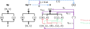
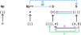
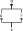
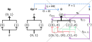
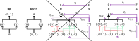
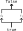

---
jupytext:
  text_representation:
    extension: .md
    format_name: myst
    format_version: 0.13
    jupytext_version: 1.16.1
kernelspec:
  display_name: Python 3 (ipykernel)
  language: python
  name: python3
---

# 7.4 Toposes

```{code-cell} ipython3
from IPython.display import Image
```


+++


+++


+++


+++

## 7.4.1 The subobject classifier Ω in a sheaf topos

+++


+++

### ☑️ Exercise 7.52

+++


+++ {"tags": ["hide-output"]}

See also [Exercise 7.52](exercise-7-52.md).

```{code-cell} ipython3
:tags: [hide-output]

Image('raster/solution-7-52.png')
```

### ☑️ Exercise 7.53

+++


+++ {"tags": ["hide-output"]}

See also [Exercise 7.53](exercise-7-53.md).

```{code-cell} ipython3
:tags: [hide-output]

Image('raster/solution-7-53.png')
```

### Ω satisfies sheaf condition

+++

> To see that $\Omega$ as defined in Eq. (7.50) satisfies the sheaf condition (see Definition 7.35), suppose that we have a cover $U=\cup_{i\in I}U_{i}$, and suppose we’re given an element $V_i ∈ \Omega(U_i)$, i.e. an open set $V_i ⊆ U_i$, for each $i ∈ I$. Suppose further that for all $i,j ∈ I$, it is the case that $V_i ∩ U_j = V_j ∩ U_i$, i.e. that the elements form a matching family. Define $V:=\cup_{i\in I}V_{i}$; it is an open subset of $U$, so we can consider $V$ as an element of $\Omega(𝑈)$. The following verifies that $V$ is indeed a gluing for the $(V_{i})_{i\in I}$:
>
> $$
V\cap U_{j}=\left(\bigcup_{i\in I}V_{i}\right)\cap U_{j}=\bigcup_{i\in I}(V_{i}\cap U_{j})=\bigcup_{i\in I}(V_{i}\cap U_{i}))=\left(\bigcup_{i\in I}U_{i}\right)\cap V_{j}=V_{j}
$$
> In other words $𝑉 ∩ 𝑈_𝑗 = 𝑉_𝑗$ for any $𝑗 ∈ 𝐼$. So our $\Omega$ has been upgraded from presheaf to sheaf!

<!--  delete-me -->

+++

To be clear, the $V_i$ are the sections $s_i$. A term like $s_i|_{U_i∩U_j}$ can then be rewritten $V_i|_{U_i∩U_j}$ or $V_i∩(U_i∩U_j)$ and because we know $V_i ∈ U_i$ this reduces to $V_i∩U_j$. This proof shows that a gluing exists, but not that it is unique (there is at most one gluing). We'll take that on trust.

+++

### Sheaf morphism for true

+++


+++

The section [Subobject classifier § Sheaves of sets](https://en.wikipedia.org/wiki/Subobject_classifier#Sheaves_of_sets) provides an equivalent definition:

> The category of [sheaves](https://en.wikipedia.org/wiki/Sheaf_(mathematics) "Sheaf (mathematics)") of sets on a [topological space](https://en.wikipedia.org/wiki/Topological_space "Topological space") $X$ has a subobject classifier $Ω$ which can be described as follows: For any [open set](https://en.wikipedia.org/wiki/Open_set "Open set") $U$ of $X$, $Ω(U)$ is the set of all open subsets of $U$. The terminal object is the sheaf 1 which assigns the [singleton](https://en.wikipedia.org/wiki/Singleton_(mathematics) "Singleton (mathematics)") $\{*\}$ to every open set $U$ of $X$. The morphism $η:1 → Ω$ is given by the family of maps $η_U : 1(U) → Ω(U)$ defined by $η_U(*)=U$ for every open set $U$ of $X$.

We could alternatively describe {1} as the [Constant presheaf](https://en.wikipedia.org/w/index.php?title=Constant_presheaf) with value {1} (or $\{*\}$), which happens to also be a sheaf. Here's a visualization of the natural transformation `true` (in purple) on the two-element discrete topological space:

+++



+++

Notice that `true` always points to the "largest open set" that it can, as the author suggests. It's not hard to imagine `true` for the [Sierpiński space](https://en.wikipedia.org/wiki/Sierpi%C5%84ski_space); to imagine it for the three-element discrete topological space one might want to draw the open subsets in a cube.

+++

### Upshot

+++


+++

See a similar "upshot" in [Subobject classifier § Sheaves of sets](https://en.wikipedia.org/wiki/Subobject_classifier#Sheaves_of_sets):

> Roughly speaking an assertion inside this topos is variably true or false, and its truth value from the viewpoint of an open subset *U* is the open subset of *U* where the assertion is true.

See also [Truth value § In other theories](https://en.wikipedia.org/wiki/Truth_value#In_other_theories); a truth-valued function is not necessarily a [Truth function](https://en.wikipedia.org/wiki/Truth_function). That is, a truth-valued function must only return a truth value while a truth function must both accept and return a truth function (see also Section 7.4.5). The author will soon start to use the language of "truth value" heavily.

+++

### ✅ Example 7.54

+++


+++

### Inconsistent ⌜?⌝ notation

+++

The author seems to be inconsistently using the ⌜?⌝ notation. Should we fill the ? with the monic morphism $m$ as in (7.13), or the subobject $H$ as in Example 7.54? The article [Subobject classifier](https://en.wikipedia.org/wiki/Subobject_classifier) is also inconsistent, using $χ_A$ where $A$ is the subobject at the start, then $χ_j$ where $j$ is the monic morphism. See also [Quasi-quotation](https://en.wikipedia.org/wiki/Quasi-quotation) and [List of logic symbols](https://en.wikipedia.org/wiki/List_of_logic_symbols).

+++

### ☑️ Exercise 7.55

+++


+++ {"tags": ["hide-output"]}

See also [Exercise 7.55](exercise-7-55.md).

```{code-cell} ipython3
:tags: [hide-output]

Image('raster/solution-7-55.png')
```

The author's solution seems to replace $H$ with $G'$.

+++

## 7.4.2 Logic in a sheaf topos

+++

> Let's consider the logical connectives $\text{AND}$, $\text{OR}$, $\text{IMPLIES}$, and $\text{NOT}$. Suppose we have a topological space $X \in \textbf{Op}$. Given two open sets $U, V$, considered as truth values $U, V \in \Omega(X)$, then their conjunction `U AND V` is their intersection, and their disjunction `U OR V` is their union:
>
> $$
\begin{align*}
(U \wedge V) &:= U \cap V \\
(U \vee V) &:= U \cup V \\
\end{align*}
$$
>
> These formulas are easy to remember, because ∧ looks like ∩ and ∨ looks like ∪. The implication $U ⇒ V$ is the largest open set $R$ such that $R ∩ U ⊆ V$, i.e.
>
> $$
(U \Rightarrow V) := \bigcap_{R \in \textbf{Op} \mid R \cap U \subseteq V} R
$$
> In general, it is not easy to reduce this last equation further, so implication is the hardest logical connective to think about topologically.

<!--  -->

+++

The author writes $U,V ∈ \Omega(X)$ when previously he was using $\Omega(U)$ alongside $U'$ for the open subsets. Presumably $X$ is the whole set, so that $U,V$ should be seen as elements of $Ω(X)$ (sections) rather than as elements in the open set poset. Of course, these lists of open subsets of $X$ will be the same.

+++

Compare (7.57) to the proof of Proposition 2.98 in [Section 2.5](2-5.md). An arguably simpler definition than (7.57), from [Heyting algebra § Examples](https://en.wikipedia.org/wiki/Heyting_algebra#Examples):

> Every [topology](https://en.wikipedia.org/wiki/Topology "Topology") provides a complete Heyting algebra in the form of its [open set](https://en.wikipedia.org/wiki/Open_set "Open set") lattice. In this case, the element $A→B$ is the [interior](https://en.wikipedia.org/wiki/Interior_(topology) "Interior (topology)") of the union of $A^c$ and $B$, where $A^c$ denotes the [complement](https://en.wikipedia.org/wiki/Complement_(set_theory) "Complement (set theory)") of the [open set](https://en.wikipedia.org/wiki/Open_set "Open set") $A$. Not all complete Heyting algebras are of this form. These issues are studied in [pointless topology](https://en.wikipedia.org/wiki/Pointless_topology "Pointless topology"), where complete Heyting algebras are also called **frames** or **locales**.

Another name for this concept is the [Relative pseudocomplement](https://en.wikipedia.org/wiki/Pseudocomplement#Relative_pseudocomplement). A relative pseudocomplement of *a* with respect to *b* is a maximal element *c* such that *a*∧*c*≤*b*. This operation is denoted *a*→*b*. If we know that *a*→*b*, then we know we are in a world where given an *a* we can always construct a *b*. That is, it should be the case that $a∧(a→b)≤b$.

+++


+++

The author is introducing ¬ as a symbol for the [Pseudocomplement](https://en.wikipedia.org/wiki/Pseudocomplement#Examples); from that article:

> If *X* is a [topological space](https://en.wikipedia.org/wiki/Topological_space "Topological space"), the (open set) [topology](https://en.wikipedia.org/wiki/Topology "Topology") on *X* is a pseudocomplemented (and distributive) lattice with the meet and join being the usual union and intersection of open sets. The pseudocomplement of an open set *A* is the [interior](https://en.wikipedia.org/wiki/Interior_(topology) "Interior (topology)") of the [set complement](https://en.wikipedia.org/wiki/Set_complement "Set complement") of *A*.

+++

Using ¬ for a pseudocomplement is potentially dangerous, because we may expect it to act like a complement (see Exercise 7.59).

+++

The pseudocomplement is defined as the greatest element $x^* ∈ L$ with the property that $x ∧ x^* = 0$. By taking the complement, we ensure that $x ∧ x^* = 0$. However, we also need to ensure that we return an open set (the complement must be a closed set, but is not guaranteed to be open). The interior of a set is the largest open set contained in a set, so by applying it we get the greatest element satisyfing our condition that is also an open set.

+++

We take the interior as part of the calculation of the [Relative pseudocomplement](https://en.wikipedia.org/wiki/Pseudocomplement#Relative_pseudocomplement) above for the same reason.

+++

### ✅ Example 7.58

+++


+++

### Implies in the standard ℝ sheaf topos

+++

Another way to define the [Material conditional](https://en.wikipedia.org/wiki/Material_conditional) (implies) $p → q$ is as $q ∨ ¬p$, though this translation requires reading it backwards. You can think about implication in Example 7.58 by imagining two number lines on top of each other with the antecedent on the bottom; when the top line is false and the bottom is true the result is not part of the resulting open set. Equivalently, the resulting open set is all parts of the line where the top line is true or the bottom line is false.

This strategy works for the standard topology on the real line, but would break down with more exotic topologies on it.

+++

### ☑️ Exercise 7.59

+++


+++ {"tags": ["hide-output"]}

See also [Exercise 7.59](exercise-7-59.md).

```{code-cell} ipython3
:tags: [hide-output]

Image('raster/solution-7-59.png')
```

### ☑️ Exercise 7.60

+++


+++


```{code-cell} ipython3
:tags: [hide-output]

Image('raster/solution-7-60.png')
```

### ✅ Example 7.61

+++


+++

For a longer list of internal logics associated to their categories, see [Heyting category in nLab](https://ncatlab.org/nlab/show/Heyting+category). A similar list is in [internal logic in nLab](https://ncatlab.org/nlab/show/internal+logic).

+++

See also [differential geometry - Applications of Topos Theory to the theory of bundles. - MSE](https://math.stackexchange.com/questions/3912771/applications-of-topos-theory-to-the-theory-of-bundles), though there's little here other than a request for more information.

+++

## 7.4.3 Predicates

+++

<!--  delete-me -->

> In English, a predicate is the part of the sentence that comes after the subject. For example "... is even" or "... likes the weather" are predicates. Not every subject makes sense for a given predicate; e.g. the sentence "7 is even" may be false, but it makes sense. In contrast, the sentence "2.7 is even" does not really make sense, and "2.7 likes the weather" certainly doesn’t. In computer science, they might say "The expression '2.7 likes the weather' does not type check."
>
> The point is that each predicate is associated to a type, namely the type of subject that makes sense for that predicate. When we apply a predicate to a subject of the appropriate type, the result has a truth value: "7 is even" is either true or false. Perhaps "Bob likes the weather" is true some days and false on others. In fact, this truth value might change by the year (bad weather this year), by the season, by the hour, etc. In English, we expect truth values of sentences to change over time, which is exactly the motivation for this chapter. We’re working toward a logic where truth values change over time.

+++

### Disambiguate: Proposition and predicate

+++

The author will soon use the terms "proposition" and "predicate" in a more "general" way than it is used elsewhere; let's review some original meanings before we try to generalize it. As discussed in [Proposition (disambiguation)](https://en.wikipedia.org/wiki/Proposition_(disambiguation)) and [Proposition](https://en.wikipedia.org/wiki/Proposition), the word has a long history (it's used as a translation of concepts going back to Aristotle):

> Propositions have played a large role throughout the history of [logic](https://en.wikipedia.org/wiki/Logic "Logic"), [linguistics](https://en.wikipedia.org/wiki/Linguistics "Linguistics"), [philosophy of language](https://en.wikipedia.org/wiki/Philosophy_of_language "Philosophy of language"), and related disciplines. Some researchers have doubted whether a consistent definition of propositionhood is possible, [David Lewis](https://en.wikipedia.org/wiki/David_Lewis_(philosopher) "David Lewis (philosopher)") even remarking that "the conception we associate with the word 'proposition' may be something of a jumble of conflicting desiderata". The term is often used broadly and has been used to refer to various related concepts.

See also [Proposition § Objections to propositions](https://en.wikipedia.org/wiki/Proposition#Objections_to_propositions). We'll avoid the unadorned terms "proposition" and "predicate" but define "set proposition" and "set predicate" in a way related to the common definition:

> Formally, propositions are often modeled as [functions](https://en.wikipedia.org/wiki/Function_(mathematics) "Function (mathematics)") which map a [possible world](https://en.wikipedia.org/wiki/Possible_world "Possible world") to a [truth value](https://en.wikipedia.org/wiki/Truth_value "Truth value"). For instance, the proposition that the sky is blue can be modeled as a function which would return the truth value $T$ if given the actual world as input, but would return  $F$ if given some alternate world where the sky is green. However, a number of alternative formalizations have been proposed, notably the **structured propositions** view.

See also [Propositional function](https://en.wikipedia.org/wiki/Propositional_function). So a proposition is essentially a nullary function (defined by the function name) and a predicate is a unary, binary, etc. function (defined by both the name and the mapping). This definition roughly agrees with [Propositional calculus](https://en.wikipedia.org/wiki/Propositional_calculus), the models defined in [forall x: Part V First-order logic](https://forallx.openlogicproject.org/html/Pt5.html) and [forall x: Part VI Interpretations](https://forallx.openlogicproject.org/html/Pt6.html), and [Predicate (mathematical logic)](https://en.wikipedia.org/wiki/Predicate_(mathematical_logic)).

+++

### Topological predicate

+++

> In a topos $\mathcal{E} = \textbf{Shv}(X, \textbf{Op})$, a predicate is a sheaf morphism $p: S → \Omega$ where $S ∈ \mathcal{E}$ is a sheaf and $\Omega ∈ \mathcal{E}$ is the subobject classifier, the sheaf of truth values. By Definition 7.35 we get a function $p(U) : S(U) → \Omega(U)$ for any open set $U ⊆ X$. In the above example - which we will discuss more carefully in Section 7.5 - if 𝑆 is the sheaf of people (people come and go over time), and $Bob ∈ S(U)$ is a person existing over a time $U$, and $p$ is the predicate "... likes the weather" then $p(Bob)$ is the set of times during which $Bob$ likes the weather. So the answer to "Bob likes the weather" is something like "in summers yes, and also in April 2018 and May 2019 yes, but in all other times no." That’s $p(Bob)$, the temporal truth value obtained by applying the predicate $p$ to the subject Bob.

+++

Given the author previously used $P$ for a presheaf, the $S$ in this section likely stands for sheaf.

+++

### ☑️ Exercise 7.62

+++

<!--  -->

> Just now we described how a predicate $𝑝: 𝑆 → Ω$, such as “... likes the weather” acts on sections $𝑠 ∈ 𝑆(𝑈)$, say $𝑠 = Bob$. But by Definition 7.12, any predicate $𝑝: 𝑆 → Ω$ also defines a subobject of $\{𝑆\;|\;𝑝\} ⊆ 𝑆$. Describe the sections of this subsheaf.

+++ {"tags": ["hide-output"]}

See [Exercise 7.62](exercise-7-62.md); the answer to this question may not be obvious if you've not read [Section 7.5](./7-5.md).

+++

### 🔴 The subobjects poset

+++

<!--  delete-me -->

> **The poset of subobjects.** For a topos $\mathcal{E} = \textbf{Shv}(X, \textbf{Op})$ and object (sheaf) $S ∈ \mathcal{E}$, the set of $S$-predicates $|\Omega^S| = \mathcal{E}(S, \Omega)$ is naturally given the structure of a poset, which we denote:
>
> $$
(|\Omega^{S}|,\leq^{S})
$$

+++

### 🔴 Power object

+++

The content of Example 7.54 is also discussed in [Power set § Power object](https://en.wikipedia.org/wiki/Power_set#Power_object), using similar variable names:

> Certain classes of algebras enjoy both of these properties. The first property is more common; the case of having both is relatively rare. One class that does have both is that of [multigraphs](https://en.wikipedia.org/wiki/Multigraph "Multigraph"). Given two multigraphs *G* and *H*, a [homomorphism](https://en.wikipedia.org/wiki/Homomorphism "Homomorphism") *h* : *G* → *H* consists of two functions, one mapping vertices to vertices and the other mapping edges to edges. The set $H^G$ of homomorphisms from *G* to *H* can then be organized as the graph whose vertices and edges are respectively the vertex and edge functions appearing in that set. Furthermore, the subgraphs of a multigraph *G* are in bijection with the graph homomorphisms from *G* to the multigraph Ω definable as the [complete directed graph](https://en.wikipedia.org/wiki/Complete_graph "Complete graph") on two vertices (hence four edges, namely two self-loops and two more edges forming a cycle) augmented with a fifth edge, namely a second self-loop at one of the vertices. We can therefore organize the subgraphs of *G* as the multigraph $Ω^G$, called the **power object** of *G*.

Notice the notational similarity to what the author is calling the subobjects poset. We'll often prefer the term "power object" to "subobjects poset" going forward. We'll also avoid the vertical bar on either side of Ω that seems to be preferred by the author; this conflicts with e.g. [Power set](https://en.wikipedia.org/wiki/Power_set) where adding vertical bars indicates a reference to the cardinality of the set of functions rather than the set of functions.

Per [Elementary topoi § Formal definition](https://en.wikipedia.org/wiki/Topos#Formal_definition), the defining characteristic of an elementary topos is that every object (in this case, sheaf) has a power object.

+++

### Topological LTE

+++

<!--  delete-me -->
<!--  delete-me -->

> Given two predicates $p,q : S → \Omega$, we say that $p ≤^S q$ if the first implies the second. More precisely, for any $U ∈ \textbf{Op}$ and section $𝑠 ∈ S(U)$ we obtain two open subsets $p(𝑠) ⊆ 𝑈$ and $q(𝑠) ⊆ 𝑈$. We say that $p ≤^𝑆 q$ if $p(𝑠) ⊆ q(𝑠)$ for all $U ∈ \textbf{Op}$ and $𝑠 ∈ 𝑆(𝑈)$. We often drop the superscript from $≤^S$ and simply write $≤$. In formal logic notation, one might write $p ≤^S q$ using the ⊢ symbol, e.g. in one of the following ways:
>
> $$
\begin{align} \\
s:S\mid p(s) & \vdash q(s) \\
p(s) & \vdash_{s:S}\;q\big(s\big)
\end{align}
$$
>
> In particular, if $S = 1$ is the terminal object, we denote $|\Omega^S|$ by $|\Omega|$, and refer to elements $p ∈ |\Omega|$ as propositions. They are just morphisms $p : 1 → \Omega$.
>
> This preorder is partially ordered — a poset — meaning that if $p ≤ q$ and $q ≤ p$ then $p = q$. The reason is that for any subsets $U,V ⊆ X$, if $U ⊆ V$ and $V ⊆ U$ then $U = V$.

+++

The author uses the language "the first implies the second" but we prefer to desymbolize ≤ to "if either the second or not the first" or simply the "first is less than or equal to the second" (when it means the material conditional). To decode $p ≤^S q$, or equivalently $p ⊢_S q$, we might say "$p(s)$ is a subset of $q(s)$ for all $s$ in $S(U)$, for all $U$ in $\textbf{Op}$" (see also [Python § 5.1.4. Nested List Comprehensions](https://docs.python.org/3/tutorial/datastructures.html#nested-list-comprehensions)).

+++

### ✅ Set propositions

+++

See [Propositional calculus](https://en.wikipedia.org/wiki/Propositional_calculus) and in particular the sections on truth-functional propositional logic (and [Truth-functional logic: Calgary](https://forallx.openlogicproject.org/html/Pt2.html) for an introduction). In **Set** these are maps from the one-object category to the booleans, true and false. A picture to have in mind is (see also Exercise 7.52):

+++


+++

A proposition like "The dog is brown." is often simply assigned to a letter in logic, such as $B$ (see the "symbolization key" introduced in [Chapter 4 § Atomic sentences](https://forallx.openlogicproject.org/html/Ch4.html#S3)). We can see η (trivially a natural transformation) in this scenario as that letter. If we had mapped $*$ to the empty set, then the proposition would be `false`.

+++

We can then define operators like $∧$ on sets to get the rest of TFL. For example, the author defined $(U \wedge V) := U \cap V$ above. If we define the symbolization key:

- $A$: Alice is quick
- $B$: Bob is quick

+++

Then in a model where both of these are mapped to true, we have that $(A \wedge B) := A \cap B = \{1\} \cap \{1\} = \{1\}$ which is `true`. It's not hard to check that → works as expected as well.

+++

If you've worked through [forall x](https://forallx.openlogicproject.org/html/index.html) then you may be expecting to use multiple terms on the left side of the [Sequent](https://en.wikipedia.org/wiki/Sequent) as in $A,B ⊢ C$. As discussed in [sequent](https://ncatlab.org/nlab/show/sequent), the $A,B$ in $A,B ⊢ C$ can be replaced by $A∩B$. At the start of the proof, you can then simply use logical [Conjunction elimination](https://en.wikipedia.org/wiki/Conjunction_elimination) twice to separate A and B.

+++

### ✅ Set predicates

+++

We'll start with an example in an [interpretation](https://forallx.openlogicproject.org/html/Ch30.html#S5) with only two names. Does $p$ entail $q$? The two set predicates:

$$
\begin{align}
p(A) & = ∅ \\
p(B) & = \{1\} \\
q(A) & = \{1\} \\
q(B) & = \{1\}
\end{align}
$$

+++

The same data in a more visual form:

+++



+++

We need only consider two sections, A and B. In both cases $p(s) ⊆ q(s)$, so we'd say that $p ⊢ q$ or more verbosely that $p(𝑠) ⊢_{𝑠:𝑆} q(𝑠)$. It is not the case that $q ⊢ p$, so a "partial subobjects poset" is p → q. Given the drawing above it may be clearer to write q ← p; this is the subobjects poset because the green arrows point to something to the right or the same as the purple arrows.

+++

Our partial subobjects poset p → q is "partial" because $Ω^S$ is defined for all possible $S$-predicates, not just the first two that we think of. There are only two more possible predicates:

$$
\begin{align}
r(A) & = \{1\} \\
r(B) & = ∅ \\
s(A) & = ∅ \\
s(B) & = ∅
\end{align}
$$

+++

It may be tempting to simplify the model above by merely listing what objects a predicate is to be true of; this corresponds to the method of stipulating the extension of a predicate via enumeration discussed in [forall x § Chapter 30 Extensionality](https://forallx.openlogicproject.org/html/Ch30.html). See also [Exercise 2.36](exercise-2-36.md).

+++

Perhaps uninterestingly, this makes it clear the "subobjects poset" $Ω^S$ (that we will often be calling, as discussed above, the "power object") is equivalent to the power set of $S$. That is, alternative notations for this power object might be $\Omega^{\{A,B\}}$ or $2^{\{A,B\}}$. In the language of the definition above, we would say that the set of $\{A,B\}$-predicates $|\Omega^{\{A,B\}}|$ is $\{p,q,r,s\}$:

+++



+++

Let's say that A stands for Alice, and B stands for Bob. We'll also define $p$ to mean Peruvian and $q$ to mean quick. As a table of observations:

```{code-cell} ipython3
import pandas as pd

pd.DataFrame({'p': [False, True], 'q': [True, True]}, index=['A', 'B'])
```

Assigning "semantics" like this (linking to the real world) makes it clear that using this model will likely fail when it's forced to generalize out of the training set. If we were to add a third piece of data (world) perhaps associated with a person named Carlos, it would likely contradict our earlier/simpler model. The maps $p$ and $q$ will simply change so that they no longer imply one another. This is a weakness of the material conditional; it's simple and can hence only fit simple data (if the goal is a perfect fit).

+++

What are $A$ and $B$ in this context? We could see them as people (Alice and Bob) that we map to truth values. We could see them as possible worlds as mentioned above and explained in [Proposition](https://en.wikipedia.org/wiki/Proposition):

> Formally, propositions are often modeled as [functions](https://en.wikipedia.org/wiki/Function_(mathematics) "Function (mathematics)") which map a [possible world](https://en.wikipedia.org/wiki/Possible_world "Possible world") to a [truth value](https://en.wikipedia.org/wiki/Truth_value "Truth value"). For instance, the proposition that the sky is blue can be modeled as a function which would return the truth value $T$ if given the actual world as input, but would return  $F$ if given some alternate world where the sky is green.

In this view, these are "possible people" and in our world there are only two possible people. We could also (as the author mentions) see $S$ as a type and the sections $s ∈ S$ as possible values that the type can take on. So if we define $p$ as "...likes the weather" then while "2.7 likes the weather" doesn't type check, the statement "Bob likes the weather" should because $p$ is an instance of a $Person$-predicate (where $Person$ is a type).

+++

### ✅ Topological propositions

+++

Let's move on to a more complicated example of a proposition, now in the context of the two-point discrete topological space. The requirement that these be a [Natural transformation](https://en.wikipedia.org/wiki/Natural_transformation) is going to start to limit what counts as a proposition. Consider the following non-example:

+++



+++

This infranatural transformation is not a proposition because it is not a natural transformation. Using the following from [Natural transformation § Definition](https://en.wikipedia.org/wiki/Natural_transformation#Definition):

$$
η_Y ∘ F(f) = G(f) ∘ η_X
$$

We always have that $F(f) = 1(f)$ is the identity on the one object in **1**, so this reduces to:

$$
η_Y = G(f) ∘ η_X
$$

While this is true for $η_{\{1\}} = G(f) ∘ η_{\{0,1\}}$ (using part of the green restriction morphism) this fails for $η_{\{0\}} = G(f) ∘ η_{\{0,1\}}$ (using part of the red restriction morphism). In the following we fix this issue:

+++



+++

Why must a morphism of sheaves be a natural transformation? From [Sheaf (mathematics) § Morphisms](https://en.wikipedia.org/wiki/Sheaf_(mathematics)#Morphisms):

> Morphisms of sheaves are, roughly speaking, analogous to functions between them. In contrast to a function between sets, which is simply an assignment of outputs to inputs, morphisms of sheaves are also required to be compatible with the local–global structures of the underlying sheaves. This idea is made precise in the following definition.

The article goes on to essentially define a morphism of sheaves as a natural transformation. The end of the section e.g. defines an isomorphism of sheaves as a natural isomorphism.

+++

#### More than true and false

+++

We now have more than just "true" and "false" that can be assigned to a proposition; even in this simple example there are two propositions that are neither true or false and are furthermore unequal to each other. We could say that each should be assigned a value of 0.5, for example, such as if we wanted to reduce our observation to a probabilistic framework. Still, this loses information because there are two different ways for something to be "half true" and we've lost in which way it is half true. As discussed in [Degree of truth](https://en.wikipedia.org/wiki/Degree_of_truth), it may be more helpful to see probability as the preferred paradigm for handling uncertainty (and there is no uncertainty here). Said yet another way, probability is a function of our current state of knowledge.

In our example, we interpet half true to mean true "half the time" i.e. at only t₀ (timestamp 0) rather than at {t₀,t₁}. Let's call $t_1 = η$ and $t_0$ the only natural transformation 1 → Ω that sends $*$ to the section $\{0\}$ of $\Omega(\{0,1\})$. Then we can see `true` as the sheaf morphism that sends $*$ to the section $\{0,1\}$ of $\Omega(\{0,1\})$. The power object Ω:

+++



+++

### ✅ Topological predicate

+++ {"tags": ["hide-output"]}

See [Exercise 7.64](exercise-7-64.md).

+++

### ☑️ Exercise 7.64

+++

<!--  delete-me -->

> Give an example of a space 𝑋, a sheaf $𝑆 ∈ \textbf{Shv(𝑋)}$, and two predicates $p, q : 𝑆 → Ω$ for which $p(𝑠) ⊢_{𝑠:𝑆} q(𝑠)$ holds. You do not have to be formal.

+++ {"tags": ["hide-output"]}

See [Exercise 7.64](exercise-7-64.md).

+++

### Logical symbols in power object

+++


+++

From [Heyting algebra](https://en.wikipedia.org/wiki/Heyting_algebra):

> Heyting algebras serve as the algebraic models of propositional [intuitionistic logic](https://en.wikipedia.org/wiki/Intuitionistic_logic "Intuitionistic logic") in the same way Boolean algebras model propositional [classical logic](https://en.wikipedia.org/wiki/Classical_logic "Classical logic"). The internal logic of an [elementary topos](https://en.wikipedia.org/wiki/Elementary_topos "Elementary topos") is based on the Heyting algebra of [subobjects](https://en.wikipedia.org/wiki/Subobject "Subobject") of the [terminal object](https://en.wikipedia.org/wiki/Terminal_object "Terminal object") 1 ordered by inclusion, equivalently the morphisms from 1 to the [subobject classifier](https://en.wikipedia.org/wiki/Subobject_classifier "Subobject classifier") Ω.
>
> The [open sets](https://en.wikipedia.org/wiki/Open_set "Open set") of any [topological space](https://en.wikipedia.org/wiki/Topological_space "Topological space") form a [complete Heyting algebra](https://en.wikipedia.org/wiki/Complete_Heyting_algebra "Complete Heyting algebra"). Complete Heyting algebras thus become a central object of study in [pointless topology](https://en.wikipedia.org/wiki/Pointless_topology "Pointless topology").

The open sets of any topological space form a complete Heyting algebra because the empty/full set provide a meet/join for all finite subsets. The [pointless topology](https://en.wikipedia.org/wiki/Pointless_topology "Pointless topology") article discusses the lattices of open sets denoted Ω(X) and Ω(Y).

+++

Also, from [Heyting algebra § Examples](https://en.wikipedia.org/wiki/Heyting_algebra#Examples):

> The [global elements](https://en.wikipedia.org/wiki/Global_element "Global element") of the [subobject classifier](https://en.wikipedia.org/wiki/Subobject_classifier "Subobject classifier") Ω of an [elementary topos](https://en.wikipedia.org/wiki/Elementary_topos "Elementary topos") form a Heyting algebra; it is the Heyting algebra of [truth values](https://en.wikipedia.org/wiki/Truth_value "Truth value") of the intuitionistic higher-order logic induced by the topos. More generally, the set of [subobjects](https://en.wikipedia.org/wiki/Subobject "Subobject") of any object *X* in a topos forms a Heyting algebra.

+++

## 7.4.4 Quantification

+++

<!--  -->

> Quantification comes in two flavors: universal and existential, or ‘for all’ and ‘there exists.’ Each takes in a predicate of 𝑛 +1 variables and returns a predicate of 𝑛 variables.

+++

### 🔴 Uniqueness quantification

+++

See also [Quantifier (logic)](https://en.wikipedia.org/wiki/Quantifier_(logic)). A third important kind of quantification is [Uniqueness quantification](https://en.wikipedia.org/wiki/Uniqueness_quantification), but this is defined in terms of the other two quantifiers. See [Chapter 28 Definite descriptions ‣ forall x: Calgary](https://forallx.openlogicproject.org/html/Ch28.html) for Russell's analysis of what it means for something to be unique. See [Glossary of mathematical jargon § Proof terminology](https://en.wikipedia.org/wiki/Glossary_of_mathematical_jargon#Proof_terminology) for the related jargon, which again points to [Uniqueness quantification](https://en.wikipedia.org/wiki/Uniqueness_quantification).

In the context of equivalence classes we think in terms of [Essentially unique](https://en.wikipedia.org/wiki/Essentially_unique) instead. That is, sometimes we don't care about the differences between all the objects (in an equivalence class).

+++

### ✅ Example 7.65

+++

<!--  -->

> Suppose we have two sheaves $𝑆,𝑇 ∈ \textbf{Shv}(𝑋, \textbf{Op})$ and a predicate $𝑝: 𝑆×𝑇 → \Omega$. Let’s say $𝑇$ represents what’s considered newsworthy and $𝑆$ is again the sheaf of people. So for a subset of time $𝑈$, a section $𝑡 ∈ 𝑇(𝑈)$ is something that’s considered newsworthy throughout the whole of $𝑈$, and a section $𝑠 ∈ 𝑆(𝑈)$ is a person that lasts throughout the whole of $𝑈$. Let’s imagine the predicate $𝑝$ as “𝑠 is worried about 𝑡.” Now recall from Section 7.4.3 that a predicate $𝑝$ does not simply return true or false; given a person $𝑠$ and a news-item $𝑡$, it returns a truth value corresponding to the subset of times on which $𝑝(𝑠,𝑡)$ is true.

+++

The choice of $t$ for a news item is a little unfortunate, because most people assume $t$ stands for a time. It seems this was a result of $T$ simply being the next letter after $S$.

+++

> "For all 𝑡 in 𝑇, ... is worried about 𝑡" is itself a predicate on just one variable, $𝑆$, which we denote:
>
> $$
∀(𝑡 : 𝑇). 𝑝(𝑠, 𝑡)
$$

+++

The author says each "takes in a predicate of $n+1$ variables and returns a predicate of $n$ variables" above. In this case, $n$ is 1 i.e. $p(s,t)$ is a predicate of two variables that we pass to the universal quantifier to get a predicate of one variable, namely $∀(t:T).p(s,t)$. The one variable is $s$, because $t$ is already bound. Taking a function of $n+1$ variables and returning a function of $n$ variables looks superficially similar to currying, but this is not currying because we directly return a truth value rather than another function (for a similar discussion see [Currying § Contrast with partial function application](https://en.wikipedia.org/wiki/Currying#Contrast_with_partial_function_application)). It also looks superficially similar to partial application, but this is not partial application because we do not supply one of the two arguments.

In all these examples, you can think about the "..." (ellipsis) as a variable. So we could have represented the predicate "For all 𝑡 in 𝑇, ... is worried about 𝑡" as $q(s)$: "For all 𝑡 in 𝑇, $s$ is worried about 𝑡" in a strange notational mix.

+++

> Applying this predicate to a person 𝑠 returns the times when that person is worried about everything in the news. Similarly, “there exists 𝑡 in 𝑇 such that 𝑠 is worried about 𝑡” is also a predicate on 𝑆, which we denote $∃(𝑡: 𝑇). 𝑝(𝑠,𝑡)$. If we apply this predicate to a person 𝑠, we get the times when person 𝑠 is worried about at least one thing in the news.

+++

### ☑️ Exercise 7.66

+++

<!--  delete-me -->

> In the topos $\textbf{Set}$, where $Ω = 𝔹$, consider the predicate $p: ℕ×ℤ\to 𝔹$ given by
>
> $$
\begin{align*}
p(n, z) &= \begin{cases}
\text{true} & \text{if } n \leq |z| \\
\text{false} & \text{if } n > |z|
\end{cases}
\end{align*}
$$
>
> 1. What is the set of $n \in ℕ$ for which the predicate $\forall(z: ℤ). p(n, z)$ holds?
> 1. What is the set of $n \in ℕ$ for which the predicate $\exists(z: ℤ). p(n, z)$ holds?
> 1. What is the set of $z \in ℤ$ for which the predicate $\forall(n: ℕ). p(n, z)$ holds?
> 1. What is the set of $z \in ℤ$ for which the predicate $\exists(n: ℕ). p(n, z)$ holds?

+++ {"tags": ["hide-output"]}

See [Exercise 7.66](exercise-7-66.md).

+++


+++

### 🔴 Universal quantification

+++

<!--  -->

> Given a predicate $𝑝: 𝑆×𝑇 → \Omega$, the universally-quantified predicate $∀(𝑡: 𝑇). 𝑝(𝑠,𝑡)$ takes a section $𝑠 ∈ 𝑆(𝑈)$, for any open set $𝑈$, and returns a certain open set $𝑉 ∈ Ω(𝑈)$. Namely, it returns the largest open set $𝑉 ⊆ 𝑈$ for which $𝑝(𝑠|_𝑉, 𝑡) = 𝑉$ holds for all $𝑡 ∈ 𝑇(𝑉)$.

+++

### ☑️ Exercise 7.67

+++

> Suppose $𝑠$ is a person alive throughout the interval $𝑈$. Apply the above definition to the example $𝑝(𝑠,𝑡)$ = “person $𝑠$ is worried about news $𝑡$” from Example 7.65. Here, $𝑇(𝑉)$ is the set of items that are in the news throughout the interval $𝑉$.
> 1. What open subset of $𝑈$ is $∀(𝑡: 𝑇). 𝑝(𝑠,𝑡)$ for a person $𝑠$?
> 2. Does it have the semantic meaning you’d expect, given the less formal description in Section 7.4.4?

<!--  delete-me -->

+++ {"tags": ["hide-output"]}

See [Exercise 7.67](exercise-7-67.md).

+++


+++

### ✅ Set universal quantifier

+++

See also [Example 1.117](./1-4.md), which points to [Universal quantification § As adjoint](https://en.wikipedia.org/wiki/Universal_quantification#As_adjoint), which points to this line in [Presheaf (category theory)](https://en.wikipedia.org/wiki/Presheaf_(category_theory)):

> For any morphism $f: X → Y$ of $\widehat{C}$, the pullback functor of subobjects $f^∗: Sub_{\widehat{C}}(Y) → Sub_{\widehat{C}}(X)$ has a [right adjoint](https://en.wikipedia.org/wiki/Right_adjoint "Right adjoint"), denoted $∀_f$, and a left adjoint, $∃_f$. These are the [universal](https://en.wikipedia.org/wiki/Universal_quantifier#As_adjoint "Universal quantifier") and existential quantifiers.

In this context, $\widehat{C} = \mathbf{Set}^{C^\mathrm{op}}$ which is roughly equivalent to $\textbf{Shv}(X, \textbf{Op})$ (both functor categories).

+++

### 🔴 Existential quantification

+++

<!--  delete-me -->

> Given a predicate $𝑝: 𝑆 × 𝑇 → \Omega$, the existentially quantified predicate $∃(𝑡: 𝑇). 𝑝(𝑠,𝑡)$ takes a section $𝑠 ∈ 𝑆(𝑈)$, for any open set $𝑈$, and returns a certain open set $𝑉 ∈ \Omega(𝑈)$, namely the union $V=\bigcup_{i}V_{i}$ of all the open sets $𝑉_𝑖$ for which there exists some $𝑡_𝑖 ∈ 𝑇(𝑉_𝑖)$ satisfying $𝑝(𝑠|_{𝑉_i}, 𝑡_𝑖) = 𝑉_𝑖$. If the result is $𝑈$ itself, you  might be tempted to think “ah, so there exists some $𝑡 ∈ 𝑇(𝑈)$ satisfying $𝑝(𝑡)$,” but that is not necessarily so. There is just a cover of $𝑈 = \bigcup 𝑈_𝑖$ and local sections $𝑡_𝑖 ∈ 𝑇(𝑈_𝑖)$, each satisfying $𝑝$, as explained above. Thus the existential quantifier is doing a lot of work “under the hood,” taking coverings into account without displaying that fact in the notation.

+++

It's not clear what the author means by $p(t)$ in this context, because $p$ was already defined as a function of two variables. One possible interpretation is that the author meant that a reader might be tempted to think that there is some $𝑡 ∈ 𝑇(𝑈)$ satisfying $p(s|_V,t) = U$.

+++

### ☑️ Exercise 7.68

+++

<!--  delete-me -->

> Apply the above definition to the "person $𝑠$ is worried about news $𝑡$" predicate from Example 7.65.
> 1. What open set is $∃(𝑡: 𝑇). 𝑝(𝑠,𝑡)$ for a person $𝑠$?
> 2. Does it have the semantic meaning you’d expect?

+++ {"tags": ["hide-output"]}

See [Exercise 7.68](exercise-7-68.md).

+++


+++

## 7.4.5 Modalities

+++

> Back in Example 1.123 we discussed modal operators - also known as modalities - saying they are closure operators on preorders which arise in logic. The preorders we were referring to are the ones discussed in Eq. (7.63): for any object $𝑆 ∈ 𝓔$ there is the poset $(|\Omega^𝑆|, ≤_𝑆)$ of predicates on $𝑆$, where $|\Omega^𝑆| = 𝓔(𝑆,\Omega)$ is just the set of morphisms $𝑆 → \Omega$ in the category $𝓔$.

<!--  delete-me -->

+++

### 🔴 Definition 7.69

+++

> A modality in $\textbf{Shv}(𝑋)$ is a sheaf morphism $𝑗: \Omega → \Omega$ satisfying three properties for all $𝑈 ⊆ 𝑋$ and $𝑝,𝑞 ∈ \Omega(𝑈)$: \
> &emsp; (a) &nbsp; $𝑝 ≤ 𝑗(𝑝)$ \
> &emsp; (b) &nbsp; $(𝑗 ⨟ 𝑗)(𝑝) ≤ 𝑗(𝑝)$ \
> &emsp; (c) &nbsp; $𝑗(𝑝 ∧ 𝑞) = 𝑗(𝑝) ∧ 𝑗(𝑞)$

+++

It looks like $j$ is inflationary based on `(a)`. But then applying it again in `(b)` results in something smaller, i.e. it appears that $j$ is deflationary. A review of Definition 1.120 in [Section 1.4](./1-4.md) seems to indicate the author meant $(j⨟j)(p) ≅ j(p)$ for `(b)`. The purpose of Exercise 7.70 seems to be to show that these are equivalent requirements.

+++

See also Proposition 1.111 in [Section 1.4](./1-4.md); part `(c)` may indicate that a modality is also a right adjoint because it preserves meets.

+++

### ☑️ Modalities are closures

+++

<!--  delete-me -->

> Suppose $𝑗: \Omega → \Omega$ is a morphism of sheaves on $𝑋$, such that $𝑝 ≤ 𝑗(𝑝)$ holds for all $𝑈 ⊆ 𝑋$ and $𝑝 ∈ \Omega(𝑈)$. Show that for all $𝑞 ∈ \Omega(𝑈)$ we have $𝑗(𝑗(𝑞)) ≤ 𝑗(𝑞)$ iff $𝑗(𝑗(𝑞)) = 𝑗(𝑞)$.

+++ {"tags": ["hide-output"]}

See [Exercise 7.70](exercise-7-70.md).

+++

### 🟣 Types of modalities

+++

<!--  delete-me -->

> In Example 1.123 we informally said that for any proposition $𝑝$, e.g. “Bob is in San Diego,” there is a modal operator “assuming $𝑝$, ...” Now we are in a position to make that formal.

+++

Proposition 7.71 gives three kinds of modalities:

+++

<!--  delete-me -->

> Fix a proposition $𝑝 ∈ |Ω|$. Then: \
> &emsp; (a) the sheaf morphism $\Omega → \Omega$ given by sending $𝑞$ to $𝑝 ⇒ 𝑞$ is a modality. \
> &emsp; (b) the sheaf morphism $\Omega → \Omega$ given by sending $𝑞$ to $𝑝 ∨ 𝑞$ is a modality. \
> &emsp; (c) the sheaf morphism $\Omega → \Omega$ given by sending $𝑞$ to $(𝑞 ⇒ 𝑝) ⇒ 𝑝$ is a modality.
>
> We cannot prove Proposition 7.71 here, but we give references in Section 7.6.

+++

The author means to imply the "Assuming Bob is in San Diego ..." modal operator is of type `(a)` in the above. We often use the word "assuming" with the ⇒ symbol, especially in TFL and FOL saying that e.g. A ⇒ B means that B holds assuming that A holds. In this case, ⇒ is defined as in the start of 7.4.2 but the meaning intends to generalize the concept from TFL and FOL.

+++

### ☑️ Exercise 7.72

+++

<!--  -->

> Let $𝑆$ be the sheaf of people as in Section 7.4.3, and let $𝑗: \Omega → \Omega$ be “assuming Bob is in San Diego ...”
> 1. Name any predicate $𝑝: 𝑆 → \Omega$, such as “likes the weather.”
> 2. Choose a time interval $𝑈$. For an arbitrary person $𝑠 ∈ 𝑆(𝑈)$, what sort of thing is $𝑝(𝑠)$, and what does it mean?
> 3. What sort of thing is $𝑗(𝑝(𝑠))$ and what does it mean?
> 4. Is it true that $𝑝(𝑠) ≤ 𝑗(𝑝(𝑠))$? Explain briefly.
> 5. Is it true that $𝑗(𝑗(𝑝(𝑠))) = 𝑗(𝑝(𝑠))$? Explain briefly.
> 6. Choose another predicate $𝑞: 𝑆 → \Omega$. Is it true that $𝑗(𝑝 ∧ 𝑞) = 𝑗(𝑝) ∧ 𝑗(𝑞)$? Explain briefly.

+++ {"tags": ["hide-output"]}

See [Exercise 7.72](exercise-7-72.md).

+++

## 7.4.6 Type theories and semantics

+++

> We have been talking about the logic of a topos in terms of open sets, but this is actually a conflation of two ideas that are really better left unconflated. The first is logic, or formal language, and the second is semantics, or meaning. The formal language looks like this:
>
> $$
∀(𝑡 : 𝑇). ∃(𝑠 : 𝑆). 𝑓 (𝑠) = 𝑡  \hspace{4em}   (7.73)
$$
>
> and semantic statements are like “the sheaf morphism 𝑓 : 𝑆 → 𝑇 is an epimorphism.” In the former, logical world, all statements are linguistic expressions formed according to strict rules and all proofs are deductions that also follow strict rules. In the latter, semantic world, statements and proofs are about the sheaves themselves, as mathematical objects.
>
> To *provide semantics* for a logical system means to provide a compiler that converts each logical statement in the formal language into a mathematical statement about particular sheaves and their relationships. A computer can carry out logical deductions without knowing what any of them “mean” about sheaves. We say that semantics is *sound* if every formal proof is converted into a true fact about the relevant sheaves.
>
> Every topos can be assigned a formal language, often called its *internal language*, in which to carry out constructions and formal proofs. This language has a sound semantics—a sort of logic-to-sheaf compiler—which goes under the name *categorical semantics* or *Kripke-Joyal semantics*. We gave the basic ideas in Section 7.4; we give references to the literature in Section 7.6.

<!--  -->

+++

See also [Kripke semantics § Kripke–Joyal semantics](https://en.wikipedia.org/wiki/Kripke_semantics#Kripke%E2%80%93Joyal_semantics).

+++

### ✅ Example 7.74

+++

> In every topos $𝓔$, and for every $𝑓: 𝑆 → 𝑇$ in $𝓔$, the morphism $𝑓$ is an epimorphism if and only if Eq. (7.73) holds. For example, consider the case of database instances on a schema $𝓒$, say with 100 tables (one of which might be denoted $𝑐 ∈ Ob(𝓒)$) and 500 foreign key columns (one of which might be denoted $𝑓 : 𝑐 → 𝑐'$ in $𝓒$); see [Eq. (3.2)](./3-1.md).
>
> If $𝑆$ and $𝑇$ are two instances and $𝑓$ is a natural transformation between them, then we can ask the question of whether or not Eq. (7.73) holds. This simple formula is compiled by the Kripke-Joyal semantics into asking:
>
> > Is it true that for every table $𝑐 ∈ Ob(C)$ and every row $𝑠 ∈ 𝑆(𝑐)$ there exists a row $𝑡 ∈ 𝑇(𝑐)$ such that $𝑓(𝑠) = 𝑡$?

+++

This last statement does not seem to match Eq. (7.73). It should likely read:

+++

> Is it true that for every table $𝑐 ∈ Ob(C)$ and every row $t ∈ T(𝑐)$ there exists a row $s ∈ S(𝑐)$ such that $𝑓(𝑠) = 𝑡$?

+++

Without this change, the sentence seems to only be stating that $f$ is total (is defined for all inputs).

+++

> This is exactly what it means for $𝑓$ to be surjective. Maybe this is not too impressive, but whether one is talking about databases or topological spaces, or complex ideas from algebraic geometry, Eq. (7.73) always compiles into the question of surjectivity. For topological spaces it would say something like:
>
> > Is it true that for every open set $𝑈 ⊆ 𝑋$ and every section $𝑠 ∈ 𝑆(𝑈)$ of the bundle $𝑆$, there exists an open cover $\{𝑈_𝑖\}_{𝑖∈𝐼}$ of $𝑈$ and a section $𝑡_𝑖 ∈ 𝑇(𝑈_𝑖)$ of the bundle $𝑇$ for each $𝑖 ∈ 𝐼$, such that $𝑓(𝑡_𝑖) = 𝑠|_{𝑈_i}$ is the restriction of $𝑠$ to $𝑈_𝑖$?

<!--  delete-me -->
