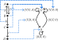
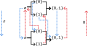
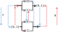
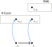
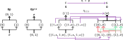
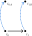

---
jupytext:
  text_representation:
    extension: .md
    format_name: myst
    format_version: 0.13
    jupytext_version: 1.14.1
kernelspec:
  display_name: Python 3 (ipykernel)
  language: python
  name: python3
---

+++ {"tags": []}

# 7.4 Toposes

```{code-cell} ipython3
from IPython.display import Image
```


+++


+++


+++


+++ {"tags": []}

## 7.4.1 The subobject classifier Ω in a sheaf topos

+++


+++ {"tags": []}

### Exercise 7.52

+++


+++

The one point space has two open sets and could be represented ∅ → {1}. Based on Eq. 7.50 we assign $Ω(∅) = \{∅\}$ and we assign $Ω(\{1\}) = \{∅,\{1\}\}$.

The non-empty set is being mapped to a two object set we can see as the booleans. Therefore we can see any morphism between sheaves (a natural transformation) that targets this sheaf as a function to the booleans.

```{code-cell} ipython3
:tags: [hide-output]

Image('raster/2023-12-08T17-20-38.png', metadata={'description': "7S answer"})
```

+++ {"tags": []}

### Exercise 7.53

+++


+++

For part `1.` we need to check that Ω is functorial i.e. that it preserves identities and composition. It preserves identities because the identity on every open set $U$ in 𝓒 (the trivial inclusion ⊆) is mapped to the identity on $Ω(U)$ in **Set**. This latter identity is $Ω(U) → Ω(U)$ or $U' ↦ U' ∩ U$ or $U' ↦ U'$ (every set gets mapped to itself).

To preserve composition we must have that if $f⨟g = h$ then $Ω(f)⨟Ω(g) = Ω(h)$. That is, if W ⊆ V ⊆ U then $res_{V,U}⨟res_{W,V} = res_{W,U}$ (using syntax from [Sheaf (mathematics)](https://en.wikipedia.org/wiki/Sheaf_(mathematics)), and including a reversal because presheafs are contravariant). The first two restriction maps are:

$$
\begin{align}
U' & ↦ U' ∩ V \\
V' & ↦ V' ∩ W
\end{align}
$$

Replacing the dummy variables with $S$ (for **s**et) to make for easier reading:

$$
\begin{align}
S & ↦ S ∩ V \\
S & ↦ S ∩ W
\end{align}
$$

Composing these and using the fact that W ⊆ V so that V ∩ W = W:

$$
\begin{align}
S & ↦ (S ∩ V) ∩ W \\
S & ↦ S ∩ (V ∩ W) \\
S & ↦ S ∩ W
\end{align}
$$

+++

For part `2.`, it's true that all you need to do to check that something like Ω is a presheaf is to check that it is a functor, because a functor and a presheaf are essentially synonymous.

```{code-cell} ipython3
:tags: [hide-output]

Image('raster/2023-12-08T17-37-03.png', metadata={'description': "7S answer"})
```

+++ {"tags": []}

### Ω satisfies sheaf condition

+++


+++ {"tags": []}

### Sheaf morphism for true

+++


+++

The section [Subobject classifier § Sheaves of sets](https://en.wikipedia.org/wiki/Subobject_classifier#Sheaves_of_sets) provides nearly the same definition. We could alternatively describe {1} as the [Constant presheaf](https://en.wikipedia.org/w/index.php?title=Constant_presheaf) with value {1} (or $\{*\}$), which happens to also be a sheaf. Here's a visualization of it on the two-element discrete topological space:


+++

Notice that the natural transformation η that corresponds to `true` always points to the "largest open set" that it can, as the author suggests.

+++ {"tags": []}

### Upshot

+++


+++

See a similar "upshot" in [Subobject classifier § Sheaves of sets](https://en.wikipedia.org/wiki/Subobject_classifier#Sheaves_of_sets). This suggests a more probabilistic view of truth; we could even considering getting a value between 0 and 1 by taking the open set returned and seeing what fraction it covers of the whole set.

+++


+++ {"tags": []}

### Inconsistent ⌜?⌝ notation

+++

The author seems to be inconsistently using the ⌜?⌝ notation. Should we fill the ? with the monic morphism $m$ as in (7.13), or the subobject $H$ as in Example 7.54? The article [Subobject classifier](https://en.wikipedia.org/wiki/Subobject_classifier) is also inconsistent, using $χ_A$ where $A$ is the subobject at the start, then $χ_j$ where $j$ is the monic morphism.

+++ {"tags": []}

### Exercise 7.55

+++


+++

Answering via a drawing:

+++



```{code-cell} ipython3
:tags: [hide-output]

Image('raster/2023-12-08T16-51-55.png', metadata={'description': "7S answer"})
```

The author's solution seems to replace $H$ with $G'$.

+++ {"tags": []}

## 7.4.2 Logic in a sheaf topos

+++


+++


+++


+++ {"tags": []}

### Implies in the standard ℝ sheaf topos

+++

Another way to define the [Material conditional](https://en.wikipedia.org/wiki/Material_conditional) (implies) $p → q$ is as $q ∨ ¬p$, though this translation requires reading it backwards. You can think about implication in Example 7.58 by imagining two number lines on top of each other with the antecedent on the bottom; when the top line is false and the bottom is true the result is not part of the resulting open set. Equivalently, the resulting open set is all parts of the line where the top line is true or the bottom line is false.

This strategy works for the standard topology on the real line, but would break down with more exotic topologies on it.

+++ {"tags": []}

### Exercise 7.59

+++


+++

For `1.`, the complement of ℝ is {0} (a point). The [Interior (topology)](https://en.wikipedia.org/wiki/Interior_(topology)) of {0} is not (0) because an open set (an "open line") on the real line is defined to include all points within ε of 0, where ε is non-zero (see also [Ball (mathematics)](https://en.wikipedia.org/wiki/Ball_(mathematics))). Therefore (0) is "larger" than {0}, and so the largest open set contained in {0} is ∅. It may be best not to even think of (0) or (0,0) as an open set; it uses interval notation but without two distinct numbers to define the interval.

For `2.` the complement of ∅ is the full set. The interior of the full set is the full set.

For `3.`, yes.

For `4.`, no.

```{code-cell} ipython3
:tags: [hide-output]

Image('raster/2023-12-08T22-57-51.png', metadata={'description': "7S answer"})
```

+++ {"tags": []}

### Dual interior/closure operators

+++

Consider the following not-adjoint pair for the [Sierpiński space](https://en.wikipedia.org/wiki/Sierpi%C5%84ski_space) defined by the open sets $∅ → \{1\} → \{0,1\}$, with the closure operator in blue and the interior operator in red. These are *not* an adjoint pair (take $p = q = \{1\}$) despite these operators being described as "dual" to each other in some references:

+++



+++

Replacing interior → "interior of the complement" and closure → "closure of the complement" we get an adjoint pair with the opposite category:

+++



+++

See also [Interior algebra](https://en.wikipedia.org/wiki/Interior_algebra).

+++ {"tags": []}

### Exercise 7.60

+++


+++


+++

1. The whole set $X$
2. Yes
3. The empty set ∅
4. Yes

```{code-cell} ipython3
:tags: [hide-output]

Image('raster/2023-12-08T23-00-20.png', metadata={'description': "7S answer"})
```

+++ {"tags": []}

### Example 7.61

+++


+++

See also [differential geometry - Applications of Topos Theory to the theory of bundles. - MSE](https://math.stackexchange.com/questions/3912771/applications-of-topos-theory-to-the-theory-of-bundles).

For a longer list of internal logics associated to their categories, see [Heyting category in nLab](https://ncatlab.org/nlab/show/Heyting+category). A similar list is in [internal logic in nLab](https://ncatlab.org/nlab/show/internal+logic).

+++ {"tags": []}

## 7.4.3 Predicates

+++


+++

Given the author previously used $P$ for a presheaf, the $S$ in this section likely stands for sheaf. Looking at the mapping of each element of a section as an aspect of a possible world, in this example each person's opinion is an aspect of the world allowed by $S$.

+++ {"tags": []}

### Exercise 7.62

+++


+++

This subsheaf represents all the possible combinations of times and people where everyone likes the weather. The sections of this subsheaf represent specific combinations of times and people (who like the weather). Some example sections will be specific people and when they liked the weather.

```{code-cell} ipython3
:tags: [hide-output]

Image('raster/2023-12-25T20-35-53.png', metadata={'description': "7S answer"})
```

The author uses a more restrictive definition of a section for this extended example; see comments below.

+++ {"tags": []}

### The subobjects poset

+++


+++


+++


+++ {"tags": []}

### Define "Power object"

+++ {"tags": []}

The content of Example 7.54 is also discussed in [Power set § Power object](https://en.wikipedia.org/wiki/Power_set#Power_object), using similar variable names:

> Certain classes of algebras enjoy both of these properties. The first property is more common; the case of having both is relatively rare. One class that does have both is that of [multigraphs](https://en.wikipedia.org/wiki/Multigraph "Multigraph"). Given two multigraphs *G* and *H*, a [homomorphism](https://en.wikipedia.org/wiki/Homomorphism "Homomorphism") *h* : *G* → *H* consists of two functions, one mapping vertices to vertices and the other mapping edges to edges. The set $H^G$ of homomorphisms from *G* to *H* can then be organized as the graph whose vertices and edges are respectively the vertex and edge functions appearing in that set. Furthermore, the subgraphs of a multigraph *G* are in bijection with the graph homomorphisms from *G* to the multigraph Ω definable as the [complete directed graph](https://en.wikipedia.org/wiki/Complete_graph "Complete graph") on two vertices (hence four edges, namely two self-loops and two more edges forming a cycle) augmented with a fifth edge, namely a second self-loop at one of the vertices. We can therefore organize the subgraphs of *G* as the multigraph $Ω^G$, called the **power object** of *G*.

Notice the notational similarity to what the author is calling the subobjects poset. We'll often prefer the term "power object" to "subobjects poset" going forward. We'll also avoid the vertical bar on either side of Ω that seems to be preferred by the author; this conflicts with e.g. [Power set](https://en.wikipedia.org/wiki/Power_set) where adding vertical bars indicates a reference to the cardinality of the set of functions rather than the set of functions.

Per [Elementary topoi § Formal definition](https://en.wikipedia.org/wiki/Topos#Formal_definition), the defining characteristic of an elementary topos is that every object (in this case, sheaf) has a power object.

+++ {"tags": []}

### Example: Set propositions

+++

See [Propositional calculus](https://en.wikipedia.org/wiki/Propositional_calculus) and in particular the sections on truth-functional propositional logic (and [Truth-functional logic: Calgary](https://forallx.openlogicproject.org/html/Pt2.html) for an introduction). In **Set** these are maps from the one-object category to the booleans, true and false. A picture to have in mind is (see also Exercise 7.52):

+++


+++

A proposition like "The dog is brown." is often simply assigned to a letter in logic, such as $B$ (see the "symbolization key" introduced in [Chapter 4 § Atomic sentences](https://forallx.openlogicproject.org/html/Ch4.html#S3)). We can see η (trivially a natural transformation) in this scenario as that letter. If we had mapped $*$ to the empty set, then the proposition would be `false`.

+++ {"tags": []}

### Example: Set predicates

+++

The author uses the term [Predicate (mathematical logic)](https://en.wikipedia.org/wiki/Predicate_(mathematical_logic)) in a more "general" (categorical) way than it is defined in the Wikipedia article and e.g. [Chapter 23 Building blocks of FOL: Calgary](https://forallx.openlogicproject.org/html/Ch23.html). Let's review the original meaning of the word in the context of this definition.

+++

Let's say that A stands for Abraham Lincoln, and B stands for Bill Russell. These are the only two objects in our universe, in which we'll also define $p$ to mean good at basketball. That is, define $p(A) = ∅$ and $p(B) = \{1\}$. We'll additionally define $q$ to mean being tall so that $q(A) = \{1\}$ and $q(B) = \{1\}$ makes a little sense.

Does p imply q? That is, does being good at basketball imply one is tall - in this universe? To review:

$$
\begin{align}
p(A) & = ∅ \\
p(B) & = \{1\} \\
q(A) & = \{1\} \\
q(B) & = \{1\}
\end{align}
$$

In a more visual form:

+++


+++

We need only consider two sections, A and B. In both cases $p(s) ⊆ q(s)$, so we'd say that p ⊢ q. It is not the case that q ⊢ p, so a "partial subobjects poset" is p → q. Given the drawing above it may be clearer to write q ← p; this is the subobjects poset because the green arrows point to something to the right or the same as the purple arrows.

+++

Our partial subobjects poset p → q is "partial" because $Ω^S$ is defined for all possible $S$-predicates, not just the first two that we think of. There are only two more possible predicates:

$$
\begin{align}
r(A) & = \{1\} \\
r(B) & = ∅ \\
s(A) & = ∅ \\
s(B) & = ∅
\end{align}
$$

+++

Perhaps uninterestingly, this makes it clear the "subobjects poset" $Ω^S$ (that we will often be calling, as discussed above, the "power object") is equivalent to the power set of $S$. That is, alternative notations for this power object might be $Ω^{\{A,B\}}$ or $2^{\{A,B\}}$:

+++


+++

If you've worked through [forall x: Calgary](https://forallx.openlogicproject.org/html/index.html) then you may be expecting to use multiple terms on the left side of the [Sequent](https://en.wikipedia.org/wiki/Sequent) as in $A,B ⊢ C$. As discussed in [sequent](https://ncatlab.org/nlab/show/sequent), the $A,B$ in $A,B ⊢ C$ can be replaced by $A∩B$. At the start of the proof, you can then simply use logical [Conjunction elimination](https://en.wikipedia.org/wiki/Conjunction_elimination) twice to separate A and B.

+++ {"tags": []}

### Example: Topological propositions

+++

Let's move on to a more complicated example of a proposition, now in the context of the two-point discrete topological space. The requirement that these be a [Natural transformation](https://en.wikipedia.org/wiki/Natural_transformation) is going to start to limit what counts as a proposition. Consider the two examples on the right:

+++


+++

The infranatural transformation on the left is not a proposition because it is not a natural transformation. Using the following from [Natural transformation § Definition](https://en.wikipedia.org/wiki/Natural_transformation#Definition):

$$
η_Y ∘ F(f) = G(f) ∘ η_X
$$

We always have that $F(f)$ is the identity on the one object in **1**, so this reduces to:

$$
η_Y = G(f) ∘ η_X
$$

While this is true for $η_{\{1\}} = G(f) ∘ η_{\{0,1\}}$ (using part of the green restriction morphism) this fails for $η_{\{0\}} = G(f) ∘ η_{\{0,1\}}$ (using part of the red restriction morphism).

+++ {"tags": []}

### More than true and false

+++

We now have more than just "true" and "false" that can be assigned to a proposition; even in this simple example there are two propositions that are neither true or false and are furthermore unequal to each other. We could say that each should be assigned a value of 0.5, for example, such as if we wanted to reduce our observation to a probabilistic framework. Still, this loses information because there are two different ways for something to be "half true" and we've lost in which way it is half true.

In our example, we interpet half true to mean true "half the time" i.e. at only t₀ (timestamp 0) rather than at {t₀,t₁}. Let's call $t_1 = η$ and $t_0$ the only natural transformation 1 → Ω that sends $*$ to the section $\{0\}$ of $Ω(\{0,1\})$. Then we can see `true` as the sheaf morphism that sends $*$ to the section $\{0,1\}$ of $Ω(\{0,1\})$. The power object Ω:

+++


+++ {"tags": []}

### Example: All possible sections

+++

As before, we must set up a bit of a story to give a concrete example of topological predicates. Continuing with previous examples, we'll assume that time is discrete and our universe has only two timestamps. Bob only exists at the second timestamp, and Alice (see also [Alice and Bob](https://en.wikipedia.org/wiki/Alice_and_Bob)) exists at both timestamps. Alice only likes the weather at the first timestamp, and Bob only likes the weather at the second timestamp.

To encode this in a model, let's define our sheaf as:

+++



+++

We show one example section, representing "Alice" and defined over the open set $\{0,1\}$. We could define the "likes weather" predicate $p$ as:

+++



+++

Where the "likes weather" subsheaf would be:

+++



+++

As discussed above, this is not how the author is apparently defining the people sheaf. This definition allows for sections that include that more than one person; an arguably simpler model limits the possible sections.

+++ {"tags": []}

### Example: Limited sections

+++

Let's start from the same "story" as previously: Alice only likes the weather at the first timestamp, and Bob only likes the weather at the second timestamp. We'll add a third character named Carlos who exists at both timestamps but only enjoys the weather at the second:

+++ {"tags": []}

### Possible world semantics

+++

See [Possible world](https://en.wikipedia.org/wiki/Possible_world); not to be confused with [Kripke semantics](https://en.wikipedia.org/wiki/Kripke_semantics) (despite the fact that [Modal logic](https://en.wikipedia.org/wiki/Modal_logic) is about possibilities).

You can see this as limiting subobjects. In our people example, there are some subsheafs that are not legitimate subsheafs of the people sheaf. For example, if Bob was not alive in 1921 then we cannot provide a subsheaf that says that Bob liked the weather in 1921. That is, we don't allow that possible world.

People can disagree about what's possible, and if something isn't possible in the mind of one person they won't bother to think about it in the models they produce. This could be seen as an optimization as well as a statement about what's real; someone may refuse to think about a particular possibility because it would require rewriting too much of what they already know (e.g. an older adult).

+++

The subobjects of the terminal object 1 are essentially a list of all possible worlds.

+++

We don't allow some worlds i.e. consider them impossible (level one), we allow some worlds (level two), we allow world aspects (level three). Do we also allow for world aspects to be of different kinds?

Agreement on the overlap for a particular matching family is then agreement on the shared aspects of the possible worlds.

When we consider only a subset U of X we are cutting down all our possible worlds to fewer world aspects. That is, fewer columns in a table (assuming rows are observations, columns are features).

+++

Can you see the following as sections over a timeline?:

+++


+++

Can you see the propositions-as-types insight as both propositions and types corresponding to a range of possible worlds? A type (such as an integer) can take on e.g. 2^32 possible values (possible worlds). A proposition (such as whether aristotle is a man) can take on a certain number of possible values (possible worlds) such as true or false. When you extend to Heyting logic, you're allowing for more than two possible worlds.

Throwing away uncertainty then becomes a matter of engineering; how much do you want to throw away? It depends on your meta-uncertainty; perhaps you aren't sure how uncertain you are and so only bother to split the possible worlds into true and false (as a first step).

+++ {"tags": []}

### Topological subobjects

+++

A topological subobject (see also [Subobject](https://en.wikipedia.org/wiki/Subobject)) would be a [Subspace topology](https://en.wikipedia.org/wiki/Subspace_topology).

+++ {"tags": []}

### Exercise 7.64³

+++


+++


+++

From [Heyting algebra](https://en.wikipedia.org/wiki/Heyting_algebra):

> Heyting algebras serve as the algebraic models of propositional [intuitionistic logic](https://en.wikipedia.org/wiki/Intuitionistic_logic "Intuitionistic logic") in the same way Boolean algebras model propositional [classical logic](https://en.wikipedia.org/wiki/Classical_logic "Classical logic"). The internal logic of an [elementary topos](https://en.wikipedia.org/wiki/Elementary_topos "Elementary topos") is based on the Heyting algebra of [subobjects](https://en.wikipedia.org/wiki/Subobject "Subobject") of the [terminal object](https://en.wikipedia.org/wiki/Terminal_object "Terminal object") 1 ordered by inclusion, equivalently the morphisms from 1 to the [subobject classifier](https://en.wikipedia.org/wiki/Subobject_classifier "Subobject classifier") Ω.
>
> The [open sets](https://en.wikipedia.org/wiki/Open_set "Open set") of any [topological space](https://en.wikipedia.org/wiki/Topological_space "Topological space") form a [complete Heyting algebra](https://en.wikipedia.org/wiki/Complete_Heyting_algebra "Complete Heyting algebra"). Complete Heyting algebras thus become a central object of study in [pointless topology](https://en.wikipedia.org/wiki/Pointless_topology "Pointless topology").

The open sets of any topological space form a complete Heyting algebra because the empty/full set provide a meet/join for all finite subsets. The [pointless topology](https://en.wikipedia.org/wiki/Pointless_topology "Pointless topology") article discusses the lattices of open sets denoted Ω(X) and Ω(Y).

+++ {"tags": []}

## 7.4.4 Quantification

+++


+++


+++

The author says each "takes in a predicate of $n+1$ variables and returns a predicate of $n$ variables" above. In this case, $n$ is 1 i.e. $p(s,t)$ is a predicate of two variables that we pass to the universal quantifier to get a predicate of one variable, namely $∀(t:T).p(s,t)$. The one variable is $s$, because $t$ is already bound.

+++ {"tags": []}

### Exercise 7.66

+++


+++

1. {0}
2. ℕ
3. {∞}
4. ℤ

```{code-cell} ipython3
:tags: [hide-output]

Image('raster/2023-12-25T21-34-29.png', metadata={'description': "7S answer"})
```


+++


+++ {"tags": []}

### Exercise 7.67¹

+++


+++


+++

See also [Universal quantification § As adjoint](https://en.wikipedia.org/wiki/Universal_quantification#As_adjoint).

+++


+++ {"tags": []}

### Exercise 7.68¹

+++


+++


+++ {"tags": []}

## 7.4.5 Modalities

+++


+++ {"tags": []}

### Exercise 7.70¹

+++


+++


+++


+++ {"tags": []}

### Exercise 7.72¹

+++


+++ {"tags": []}

## 7.4.6 Type theories and semantics

+++


+++

See also [Kripke semantics § Kripke–Joyal semantics](https://en.wikipedia.org/wiki/Kripke_semantics#Kripke%E2%80%93Joyal_semantics).

+++ {"tags": []}

### Example 7.74

+++


+++

Example 7.74 seems to summarize 7.73 incorrectly, reversing s and t. Or is this part of the reversal that is part of defining a restriction? Start with the simple example provided in (3.2), and come up with two instances on it (S and T) then a natural transformation f between them. From this perspective it does make sense; there’s a surjective map from the table S(c) in S to the table T(c) in T.
