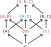
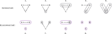

---
jupytext:
  text_representation:
    extension: .md
    format_name: myst
    format_version: 0.13
    jupytext_version: 1.16.1
kernelspec:
  display_name: Python 3 (ipykernel)
  language: python
  name: python3
---

# Connected space

```{code-cell} ipython3
from IPython.display import IFrame
```

## Drawing topologies

+++

If you want to try to draw a finite topological space, one option is to include all the open sets:

+++


+++

Notice the left of our two examples is `8.` in the list in [Finite topological space](https://en.wikipedia.org/wiki/Finite_topological_space), mapping our element to theirs by:
- A → b
- B → c
- C → a

+++

If that's too cluttered, another option is to exclude all the open sets that are implied by the open sets you choose to draw. That is, choose not to draw any open sets that are either the intersection or union of open sets you've chosen to draw. Also always choose to exclude both the empty set and the full set. With this approach, we might simplify the drawing above to:

+++


+++

Unfortunately this drawing strategy isn't always going to produce the same drawing for the same topology. We could have also drawn the above as:

+++


+++

To be consistent, it's probably best to only draw the smallest open sets that you can, that still imply the other open sets. Said another way, draw only those open sets that allow you to infer all other open sets via the rule that the union of any open sets is also an open set. In general, this should lead to a less-cluttered drawing.

Said another way, we don't draw any open sets that are "covered" by other open sets (the "open covers") except those open covers that can be produced by a single (the same) open set. We *may* draw an open set that contains an open set. Said yet another way, in the sublattice (or preordered set) that defines the topology we draw the bottom (leaf) elements first and then keep drawing up any elements that don't have two arrows pointing into them. Notice these arrows represent "inclusion" morphisms, so we don't draw any sets that "include" two other sets (notably, the same arrows in the opposite category are the restriction morphisms). The topology on the left from this perspective:

```{code-cell} ipython3
save_url = "https://q.uiver.app/#q=WzAsNixbMSwzLCJcXGVtcHR5Il0sWzAsMiwiXFx7QVxcfSJdLFsxLDIsIlxce0JcXH0iXSxbMCwxLCJcXHtBLEJcXH0iXSxbMSwxLCJcXHtBLENcXH0iXSxbMSwwLCJcXHtBLEIsQ1xcfSJdLFswLDJdLFswLDFdLFsxLDNdLFsyLDNdLFszLDVdLFs0LDVdLFsxLDRdXQ=="
IFrame(src=f"{save_url}&embed", width="423", height="423")
```

## Drawing topologies with color

+++

In some cases it's necessary to be able to quickly see what sets are open, which are closed, and which are both. It's reasonable to use color to indicate these states, to avoid cluttering the diagram too much. We'll red for open, blue for closed, and purple for both (red and blue mix to make purple in subtractive color models). An example topology with this scheme:

+++



+++

## Define **connected space**

+++

We define [Connected space](https://en.wikipedia.org/wiki/Connected_space) in a negative way, in terms of whether the whole set can be represented as the union of two (or more) open sets. See [Finite topological space](https://en.wikipedia.org/wiki/Finite_topological_space); the 9 non-equivalent topologies on three elements from this perspective:

+++



+++

The arrows in the preceding diagram demonstrate the [Specialization (pre)order](https://en.wikipedia.org/wiki/Specialization_(pre)order) for these topologies, which demonstrates some of the concepts in [Finite topological space § Connectivity](https://en.wikipedia.org/wiki/Finite_topological_space#Connectivity). The [Clopen sets](https://en.wikipedia.org/wiki/Clopen_set) are colored purple.

+++

## Review of Chapter 1

+++

How should we see the "topologies" of chapter 1 in terms of this definition? Recall, for example:

+++


+++

These 5 examples are actually partitions of a set, not topologies, though they are introduced with the language of connectedness. There are only 5 partitions on a set of 3 elements, but 29 topologies (see [Finite topological space](https://en.wikipedia.org/wiki/Finite_topological_space)).

+++

However, see [Connected space § Connected components](https://en.wikipedia.org/wiki/Connected_space). With this perspective we can produce a partition of any of these spaces. You should see that the topologies numbered 1-3 and 5-6 above produce the trivial partition, 4 and 7-8 produce the partition AB|C, and 9 is the finest partition. The arrows in Equation (1.5) are then roughly the ⊆ relationship in [Comparison of topologies](https://en.wikipedia.org/wiki/Comparison_of_topologies) with 10 topologies under the trivial partition, 5 under each of the middle partitions, and 4 under the finest partition. See [The 29 Topologies on a 3 Element Set](https://satprepget800.com/2019/05/01/the-29-topologies-on-a-3-element-set/) for help counting these out.
