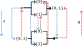

---
jupytext:
  text_representation:
    extension: .md
    format_name: myst
    format_version: 0.13
    jupytext_version: 1.16.1
kernelspec:
  display_name: Python 3 (ipykernel)
  language: python
  name: python3
---

# Define dual

+++

## Define **order-theoretic dual**

+++

Consider the following not-adjoint pair for the [Sierpiński space](https://en.wikipedia.org/wiki/Sierpi%C5%84ski_space) defined by the open sets $∅ → \{1\} → \{0,1\}$, with the closure operator in blue and the interior operator in red. These are *not* an adjoint pair (take $p = q = \{1\}$) despite these operators being described as "dual" to each other in [Interior algebra](https://en.wikipedia.org/wiki/Interior_algebra). The full counterexample:

+++

+++

Why does this not work? We'll come back to this later, but for now let's address why we sometimes expect the word "dual" to imply "adjoint" but not the opposite. The simplest way of using the word "dual" is arguably in the sense of [Duality (order theory)](https://en.wikipedia.org/wiki/Duality_(order_theory)). In fact, this is the meaning used in the first example in [Duality (mathematics) § Introductory examples](https://en.wikipedia.org/wiki/Duality_(mathematics)#Introductory_examples) and in the first section of this article, namely [Duality (mathematics) § Order-reversing dualities](https://en.wikipedia.org/wiki/Duality_(mathematics)#Order-reversing_dualities). Here's an example of a duality in this sense:

+++

+++

We'd call the top poset in this example the "dual" (or opposite) of the bottom poset, and vice-versa. Our author uses $P^{op}$ for this dual poset, but an alternative notation is $P^d$, which may be more appropriate when you are using the word "dual" regularly (or just to save a letter).

Let's say instead that we were given these two posets and asked if they are duals. In that case we'd check that there is an [Order isomorphism](https://en.wikipedia.org/wiki/Order_isomorphism) between one and the dual of the other.

+++

The drawing of the posets above is a special case of duality showing a *self-dual* poset; there is an order isomorphism between the poset and its own dual. The following poset is not self-dual (derived from [this example](https://en.wikipedia.org/wiki/Duality_(order_theory)#/media/File:Duale_Verbaende.svg)):

+++

+++

Every order isomorphism is also a galois connection (a strictly weaker notion). So in general we can expect an order duality to lead to an adjoint pair, but not the opposite.

+++

Let $A$ represent some predicate we can apply to an element that has a dual concept, and call the dual predicate $A^d$. For example if we let $A(x)$ mean "x is a greatest element" then $A^d(x)$ means "x is a least element" in a particular poset. Then it should be no surprise that $A(x) = A^d(x^d)$ where $x^d$ refers to the element that $x$ maps to in the opposite category (e.g. $e$ is mapped to $e'$ above so that $-'$ could be thought of as $-^d$).

If a concept is "self-dual" then $A = A^d$ so that $A(x) = A(x^d)$. If you take $A$ to mean "$∀x,y,z: x∧(y ∨ z) = (x∧y) ∨ (x∧z)$" (from [Distributive lattice](https://en.wikipedia.org/wiki/Distributive_lattice)) then $A = A^d$. If you take $A$ to mean "is a partial order" then $A = A^d$ though we're now talking at a higher level, so that $A(X) = A(X^d) = A^d(X^d)$.

+++

We use $f$ and $g$ in the drawing above for the two components of an order isomorphism, but because the poset is self-dual we could have also denoted these both as $-^d$ or $-^{op}$ and thought of them as endomorphisms. It's when we have an underlying self-dual order that authors tend to use $-^c$ (for complement) or $-^*$ (for pseudocomplement). Unfortunately ¬ is also used for both these concepts and must be interpreted based on context.

+++

## Define **categorical dual**

+++

See [Dual (category theory)](https://en.wikipedia.org/wiki/Dual_(category_theory)), which is a strict generalization of order-theoretic duality. To take an order-theoretic dual you reverse all arrows (use the opposite order) and switch out order-theoretic definitions such as ∧ and ∨. To take a categorical dual you similarly take the opposite order i.e. reverse all arrows. You also similarly switch out category-theoretic definitions; e.g. the order-theoretic task of switching out ∧ and ∨ corresponds to the category-theoretic task of switching out products with coproducts (or limits with colimits). A category is more than an order, however, so there are additional concepts to switch out. For example, many category-theoretic concepts involve composition and the dual conversion requires that composition be reversed.

+++

## Define **logical dual**

+++

See [Duality (mathematics) § Duality in logic and set theory](https://en.wikipedia.org/wiki/Duality_(mathematics)#Duality_in_logic_and_set_theory) and let $A$ mean "interior" and $B$ mean "closure" in the first definition. Let's take our example from above and replace "interior" with the "interior of the complement" and "closure" with "complement of the closure" to get an adjoint pair with the opposite category:

+++

+++

Apparently, this is the definition of "dual" the authors of [Interior algebra](https://en.wikipedia.org/wiki/Interior_algebra) had in mind when they described these operators as being dual to each other despite linking to [Duality (order theory)](https://en.wikipedia.org/wiki/Duality_(order_theory)).

+++

TODO: This may be completely wrong/unhelpful in its current form. Perhaps just remove it. Think of both $A$ and $A^d$ as maps to an Ω such as Bool instead.
