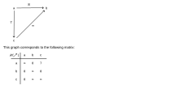

---
jupytext:
  text_representation:
    extension: .md
    format_name: myst
    format_version: 0.13
    jupytext_version: 1.16.1
kernelspec:
  display_name: Python 3 (ipykernel)
  language: python
  name: python3
---

# Exercise 2.63

```{code-cell} ipython3
import pandas as pd

def prove_v_category(df, mon_prod, preorder_rel):
    for row in df.index:
        for col in df.columns:
            for idx in range(0,len(df.index)):
                a = mon_prod(df.iloc[row, idx], df.iloc[idx, col])
                assert preorder_rel(a, df.iloc[row,col]), (row,idx,col)
```


+++



The first property requires that the diagonal be ∞:

$$
I = ∞ \leq n(x,x)
$$

Checking the second property by brute force:

```{code-cell} ipython3
inf = float("inf")
wdf = pd.DataFrame(
    index=range(3), columns=range(3),
    data=[[inf,8,7],[0,inf,0],[0,inf,inf]]
)
display(wdf)
prove_v_category(wdf, min, lambda x,y: x <= y)
```

The required second property (with min replaced by ∧):

$$
n(x,y) ∧ n(y,z) \leq n(x,z)
$$

For paths that are only two edges long, you can interpret this as the instructions to take the:

> *minimum* edge label in *p*.

For longer paths, you can see this as considering all possible intermediates *y* between *x* and *z*
where *y* must be precomputed. For this to be true for all intermediates (all *y*) we must take the:

> *maximum* over all paths *p*

You could see enrichment in $\mathcal{W}$ as the opposite of enrichment in **Cost**. In this
scenario, higher numbers mean two elements are actually *more* rather than less connected. The
**NMY** and **Bool** enrichments could be seen as special cases of this kind of enrichment, with
only three and two levels of connectedness respectively (in contrast to an infinite number of
levels).

If you saw the graph as editable (as in a neural network) or at least "editable" in the sense you
can turn off connections by setting them to zero, then you could see these levels of connectedness
as network weights. In some design contexts (e.g. Transformer models) the opposite concept
(distance) is used, and the network structure is optimized to minimize distance between key nodes.
One could use the number of edges as a distance as well (assign each a value of one) if network
weights haven't been assigned yet.
