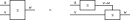
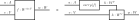

---
jupytext:
  text_representation:
    extension: .md
    format_name: myst
    format_version: 0.13
    jupytext_version: 1.14.1
kernelspec:
  display_name: Python 3 (ipykernel)
  language: python
  name: python3
---

+++ {"tags": []}

# Exercise 2.84

+++

+++

We'll assume we don't know the hom-element $v⊸w$ is $v→w$ i.e. $w∨¬v$. The second-to-last column is then what we could allow it be defined as, and the final column is how we choose to define it:

+++

+++

One could read (2.80) in this context as the rule that if $a$ and $v$ holding means that $w$ also holds, then it's also the case that $a$ holding means that if $v$ holds then $w$ holds. In terms of wiring/string diagrams (visual proofs):

+++

+++

In the category of sets this becomes [Currying](https://en.wikipedia.org/wiki/Currying):

+++

+++

If you have a $v$ (know it holds) and a $v ⊸ w$ (know it holds), you can get a $w$ (conclude it holds) via $v ∧ (w∨ ¬v) = v ∧ w ≤ w$.
