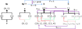
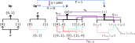

---
jupytext:
  text_representation:
    extension: .md
    format_name: myst
    format_version: 0.13
    jupytext_version: 1.16.1
kernelspec:
  display_name: Python 3 (ipykernel)
  language: python
  name: python3
---

# Exercise 7.64

+++

<!--  delete-me -->

> Give an example of a space 𝑋, a sheaf $𝑆 ∈ \textbf{Shv(𝑋)}$, and two predicates $p, q : 𝑆 → Ω$ for which $p(𝑠) ⊢_{𝑠:𝑆} q(𝑠)$ holds. You do not have to be formal.

+++

## Author's solution

+++

> We need an example of a space $𝑋$, a sheaf $𝑆 ∈ \textbf{Shv}(𝑋)$, and two predicates $𝑝, 𝑞 : 𝑆 → \Omega$ for which $𝑝(𝑠) ⊢_{𝑠:𝑆} 𝑞(𝑠)$ holds. Take $𝑋$ to be the one-point space, take $𝑆$ to be the sheaf corresponding to the set $𝑆 = ℕ$, let $𝑝(𝑠)$ be the predicate “24 ≤ $𝑠$ ≤ 28” and let $𝑞(𝑠)$ be the predicate “$𝑠$ is not prime.” Then $𝑝(𝑠) ⊢_{𝑠:𝑆} 𝑞(𝑠)$ holds.
>
> As an informal example, take $𝑋$ to be the surface of the earth, take $𝑆$ to be the sheaf of vector fields as in Example 7.46 thought of in terms of wind-blowing. Let $𝑝$ be the predicate “the wind is blowing due east at somewhere between 2 and 5 kilometers per hour” and let $𝑞$ be the predicate “the wind is blowing at somewhere between 1 and 5 kilometers per hour.” Then $𝑝(𝑠) ⊢_{𝑠:𝑆} 𝑞(𝑠)$ holds. This means that for any open set $𝑈$, if the wind is blowing due east at somewhere between 2 and 5 kilometers per hour throughout $𝑈$, then the wind is blowing at somewhere between 1 and 5 kilometers per hour throughout $𝑈$ as well.

+++

## Alternative answer

+++

As before, we must set up a bit of a story to give a concrete example of a topological predicate. Continuing with previous examples, we'll assume that time is discrete and our universe has only two timestamps. Bob only exists at the second timestamp, and Alice (c.f. [Alice and Bob](https://en.wikipedia.org/wiki/Alice_and_Bob)) exists at both timestamps. One possible visualization of these people in a single drawing is:

+++

+++

In the previous drawing we show one example section, representing "Alice" and defined over the open set $\{0,1\}$. We also draw the "Alice" sheaf more compactly as a gray box.

+++

We'll say Alice only likes the weather at the first timestamp, and Bob only likes the weather at the second timestamp. We could visualize the "... likes the weather" predicate $p$ as:

+++

+++

One can check that this is a natural transformation, and that $S$ is a sheaf. However, the author's language sometimes implies the people sheaf only includes sections representing people who exist throughout the whole of $U$. An attempt to "fix" this issue:

+++

<!--  delete-me -->
<!--  delete-me -->

+++

Unfortunately, in this model there is no unique gluing of $t_{0A}$ and $t_{1B}$. See [Exercise 7.62](./exercise-7-62.md) for a discussion.
