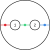
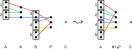
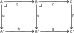
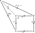
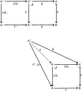

---
jupytext:
  text_representation:
    extension: .md
    format_name: myst
    format_version: 0.13
    jupytext_version: 1.14.1
kernelspec:
  display_name: Python 3 (ipykernel)
  language: python
  name: python3
---

# Improve SSiC

+++

## Optimization problems

+++

See [How are universal properties “solutions to optimization problems”?](https://math.stackexchange.com/questions/3239188/how-are-universal-properties-solutions-to-optimization-problems). Example 3.99 (introducing the pullback) seems like a good example of this; we have to construct some object based on constraints the object must satisfy (it literally uses the word "constraint"). See "equality constraints" in [Optimization problem](https://en.wikipedia.org/wiki/Optimization_problem). It would be helpful to add certain "hard" equality constraints to the "soft" objective function minimization/maximization that is often done in an optimization.

See also [Equaliser (mathematics)](https://en.wikipedia.org/wiki/Equaliser_(mathematics)), and the database constraints in Chp. 3.

+++

## 6.2.1 Initial objects

+++

### Exercise 6.7

+++

#### Part `2.`

+++


+++

For part `2.` can we use a one-element set? See [Field with one element](https://en.wikipedia.org/wiki/Field_with_one_element); at least for a field this isn't a well-defined concept. However, why can't the multiplicative identity equal the [Additive identity](https://en.wikipedia.org/wiki/Additive_identity)? See [Additive identity § Properties](https://en.wikipedia.org/wiki/Additive_identity#Properties); there's no hard reason this isn't possible for a ring. In fact, this is known as the [Zero ring](https://en.wikipedia.org/wiki/Zero_ring).

However, the zero ring cannot serve as an initial object in **Rig** because we can still preserve structure and map the one element in this structure to either the additive or multiplicative identity in many other rigs (such as e.g. the natural numbers). That makes two morphisms (homomorphisms) from the zero ring to the natural numbers, when an initial object must only have one.

Having both a multiplicative and additive element implies (via the distributive property) that some other element 1+1 must exist, and via mathematical induction this implies we must have at least the natural numbers in an initial object. Are the natural numbers an initial object in **Rig**? There is exactly one morphism from them to the zero ring (all elements go to zero).

Without reading it, this solution looks long. For likely solutions to this question (check before checking the back of the book), see:
- [Rig in nLab](https://ncatlab.org/nlab/show/Rig)
- [rig in nLab](https://ncatlab.org/nlab/show/rig)

+++

#### Interpretations of zero

+++

The symbol 0 gets used in higher mathematics for much more than the number zero; see [Zero element](https://en.wikipedia.org/wiki/Zero_element). In part (d) of Definition 5.36 (a dependency of Exercise 6.7) it's specifically identified as an absorbing element, besides being the additive identity. Since we're in a section on initial objects, and have already learned about terminal objects, it may be worth looking at the concept of a [Zero object (algebra)](https://en.wikipedia.org/wiki/Zero_object_(algebra)) (which is both initial and terminal).

All over the article [Zero object (algebra)](https://en.wikipedia.org/wiki/Zero_object_(algebra)#Vector_space), the word "trivial" is used almost as a synonym for zero object. At the start:

> This article is about trivial or zero algebraic structures.

The article [Initial and terminal objects](https://en.wikipedia.org/wiki/Initial_and_terminal_objects) redefines "zero object" but links to [Zero object (algebra)](https://en.wikipedia.org/wiki/Zero_object_(algebra)#Vector_space) and specifically mentions:

> This is the origin of the term "zero object".

In [Initial and terminal objects](https://en.wikipedia.org/wiki/Initial_and_terminal_objects), the symbol 0 is often used for initial objects (though the author uses ∅). It's likely this is because 0 serves as the additive identity and so seems natural alongside the symbol + often used for the coproduct. The symbol 1 is similarly often used for terminal objects because it is the identity with respect to the categorical product. The article also mentions:

> Cat, the category of small categories with functors as morphisms has the empty category, 0 (with no objects and no morphisms), as initial object and the terminal category, 1 (with a single object with a single identity morphism), as terminal object.

While it often works to use 0 for an initial object and 1 for a terminal object, this also not a specific approach. It can also be confusing when a category has a "zero" object that is not initial (as in **Ring**/**Rig**, where the zero ring/rig is terminal).

+++ {"tags": []}

# 6.4 Decorated cospans

+++

This section is unique to one of the authors. See [[1502.00872] Decorated Cospans](https://arxiv.org/abs/1502.00872) and [1609.05382.pdf](https://arxiv.org/pdf/1609.05382.pdf).

+++ {"tags": []}

See [Review "Seven-Sketches suggestions" - Google Docs](https://docs.google.com/document/d/1HC_BRM2deHxS7FiIto2bfrM81grKu8vDiI-JgCY5eXU/edit) (several issues in this section).

+++


+++ {"tags": []}

## 6.4.1 Symmetric monoidal functors

+++

See [Monoidal functor](https://en.wikipedia.org/wiki/Monoidal_functor) and [monoidal functor](https://ncatlab.org/nlab/show/monoidal+functor).

+++


+++

### Example 6.69

+++


+++

### Symmetric monoidal power set functor

+++

For the image map $im_f$, imagine what the function would do to the function $f$ given by the relation $\{(1,α),(2,β),(3,β)\}$. We have:

$$
S = \{1,2,3\} \\
T = \{α,β\}
$$

+++

So that:

$$
\begin{align}
P(S) & = \{\{\},\{1\},\{2\},\{3\},\{1,2\},\{2,3\},\{1,3\},\{1,2,3\}\} \\
P(T) & = \{\{\},\{α\},\{β\},\{α,β\}\} \\
\end{align}
$$

+++

What the definition says is that each subset is mapped to its [Image (mathematics)](https://en.wikipedia.org/wiki/Image_(mathematics)); we call this an "image map" in Example 6.69. The new function, again represented as a relation, is:

$$
\begin{align}
im_f = \big\{(\{\}&,\{\}), \\
(\{1\}&,\{α\}), \\
(\{2\}&,\{β\}), \\
(\{3\}&,\{β\}), \\
(\{1,2\}&,\{α,β\}), \\
(\{2,3\}&,\{β\}), \\
(\{1,3\}&,\{α,β\}), \\
(\{1,2,3\}&,\{α,β\})\big\} \\
\end{align}
$$

+++

In [Image (mathematics) § Notation](https://en.wikipedia.org/wiki/Image_(mathematics)#Notation), the article authors suggest $f^→$ and $f^*$ as alternatives to $im_f$. Many readers will be even more familiar with the $f(A)$ and $f[A]$ notations, although these are more ambiguous (relying on only capitalization to indicate a subset of some set rather than an element of the set).

+++

See also [category theory - Covariant Power set functor - MSE](https://math.stackexchange.com/questions/1487902/covariant-power-set-functor) for a less helpful example because the source and target sets are the same size. The "Power sets functor" example in [Functor § Examples](https://en.wikipedia.org/wiki/Functor#Examples) is fine, although for someone new to the concept it is a bit confusing that the function $f$ is a map from $X$ to the power set of $X$. That is, in that example we have (adding $S$ and $T$ from the definition in this text):

$$
\begin{align}
S = X & = \{0,1\} \\
T = Y & = \{\{\},\{0\},\{1\},X=\{0,1\}\} \\
\end{align}
$$

+++

### Exercise 6.70

+++


+++

Remember that $|P(S)| = 2^{|S|}$. So we know that $|P(S)×P(T)| = 2^{|S|+|T|}$ and $|P(S×T)| = 2^{|S||T|}$; except when $|S|=1$ or $|T|=1$ the latter term will be equal to or much larger than the former. In the example above, we had $|S|=3$ and $|T|=2$. To imagine the 32 elements of $P(S)×P(T)$, consider how much space it would take to write out the cartesian product of the 8 elements of $P(S)$ and 4 elements of $P(T)$ both explicitly written out above. To imagine the 64 elements of $P(S×T)$, try taking the power set of (using e.g. [Pascal's triangle](https://en.wikipedia.org/wiki/Pascal%27s_triangle) to get up to 64, or bit flipping six bits):

$$
S×T = \{(1,α),(2,α),(3,α),(1,β),(2,β),(3,β)\}
$$

+++

Inspect the diagram in Exercise 6.70. In terms of Rough Definition 6.68, in Example 6.69 and along the arrows on the top/bottom of the diagram we are substituting $c_1 = S$ and $c_2 = T$. Per Exercise 6.69, the power set functor acts on morphisms by sending them to the their image map, so e.g. $P(f×g) = im_{f×g}$ and $P(f)×P(g) = im_f×im_g$. What it means to be "natural" in this context then is similar to what it means to be natural in [Natural transformation](https://en.wikipedia.org/wiki/Natural_transformation), but with F defined by the structure of the left side of the equation in Rough Definition 6.68 and G defined by the structure of the right side of the equation:

$$
φ_{c_1,c_2}:F(c_1) ⊗_D F(c_2) → F(c_1 ⊗_C c_2)
$$

+++

Let's replace F and G in [Natural transformation](https://en.wikipedia.org/wiki/Natural_transformation) by $F_n$ and $G_n$ to avoid a namespace conflict with the $F$ used for the symmetric monoidal functor. Then more explicitly, $F_n$ and $G_n$ are functors from $𝓒×𝓒→𝓓$ (as also stated in [Monoidal functor](https://en.wikipedia.org/wiki/Monoidal_functor)) and could be given:

$$
\begin{align}
F_n((c_1,c_2)) & = F(c_1) ⊗_D F(c_2) \\
G_n((c_1,c_2)) & = F(c_1 ⊗_C c_2)
\end{align}
$$

+++

We are being asked to show $φ_{S,T}⨟im_{f×g} = im_f×im_g⨟φ_{S',T'}$. We know from Example 4.49 that:

$$
im_f×im_g(A,B) ≔ (im_f(A),im_g(B)) :P(S)×P(T)→P(S')×P(T')
$$

These variable names follow Example 6.69, where $A∈P(S)$ and $B∈P(T)$ (A is a subset of S, and B is a subset of T).

+++

The coherence maps are defined (these are essentially equivalent, but with the dummy variables changed):

$$
\begin{align}
φ_{S,T}(A,B)     & ≔ A×B :P(S)×P(T)→P(S×T) \\
φ_{S',T'}(im_f(A),im_f(B)) & ≔ im_f(A) × im_f(B) :P(S')×P(T')→P(S'×T')
\end{align}
$$

+++

How do we define $im_{f×g}$? By analogy with how $A$ and $B$ are defined above, let's define $C$ so $C ∈ P(S×T)$. That is, $C$ is a set of sets where each individual set comprises two-tuples:

$$
\begin{align}
f×g(c) = f×g(s,t) & ≔ (f(s),f(t)) :S×T→S'×T' \\
im_{f×g}(C) & ≔ \{f×g(c) | c∈C\} :P(S×T)→P(S'×T') \\
\end{align}
$$

+++

The reason we're starting with this rather general definition is that you can't construct every element of $P(S×T)$ from $P(S)×P(T)$; the latter set is smaller (as discussed above). So you can't take a spec of $A,B$ to construct every element of $P(S×T)$. For example, the set $\{(2,α),(3,β)\}$ in the context of the example above is an element of $P(S×T)$ but not an element of $P(S)×P(T)$.

+++

We do have more structure here, however, because every $C$ will have been constructed from two sets $A,B$ as $A×B$ by $φ_{S,T}$. Therefore:

+++

$$
\begin{align}
im_{f×g}(C) & ≔ \{f×g(a,b) | (a,b)∈A×B=C\} :P(S×T)→P(S'×T') \\
 & = \{(f(a),f(b)) | (a,b)∈A×B\} \\
 & = im_f(A) × im_f(B) \\
\end{align}
$$

+++

```{admonition} Reveal 7S answer
:class: dropdown

```

+++ {"tags": []}

## 6.4.2 Decorated cospans

+++


+++


+++ {"tags": []}

### Example of composition

+++


+++


+++


+++


+++


+++


+++


+++


+++ {"tags": []}

### Theorem 6.77

+++ {"tags": []}


+++ {"tags": []}

### Exercise 6.78

+++


+++

Because 𝓒 is a symmetric monoidal functor with finite colimits, the category $\bf{Cospan}_𝓒$ is a hypergraph category by Example 6.61. Then, because the constant functor is a symmetric monoidal functor, we should also have that $\bf{Cospan}_F$ is a hypergraph category by Theorem 6.77.

+++

```{admonition} Reveal 7S answer
:class: dropdown

```

+++ {"tags": []}

## 6.4.3 Electrical circuits

+++


+++


+++ {"tags": []}

### Exercise 6.79

+++


+++

$$
(V,A,s,t,l) = \big( \\
    \{1,2,3,4\}, \\
    \{r12,c12,r24,i34,r13\}, \\
    \{(r12,1),(c12,1),(r24,2),(i34,3),(r13,1)\}, \\
    \{(r12,2),(c12,2),(r24,4),(i34,4),(r13,3)\}, \\
    \{(r12,2Ω),(c12,3F),(r24,1Ω),(i34,1H),(r13,1Ω)\}\big)
$$

+++

```{admonition} Reveal 7S answer
:class: dropdown

```

+++ {"tags": []}

### A decoration functor for circuits

+++


+++ {"tags": []}

### Exercise 6.80

+++


+++

```{admonition} Reveal 7S answer
:class: dropdown

```

+++ {"tags": []}

### Exercise 6.82

+++


+++


+++

```{admonition} Reveal 7S answer
:class: dropdown

```

+++ {"tags": []}

### Open circuits using decorated cospans

+++


+++


+++ {"tags": []}

### Exercise 6.84

+++


+++

$$
(V,A,s,t,l) = \big( \\
    \{1,2\}, \\
    \{c12\}, \\
    \{(c12,1)\}, \\
    \{(c12,2)\}, \\
    \{(c12,battery)\}\big)
$$

+++

```{admonition} Reveal 7S answer
:class: dropdown

```

+++


+++ {"tags": []}

### Composition in $\textbf{Cospan}_{Circ}$

+++


+++


+++


+++

If we draw (6.85) in the style of (6.47) we get:


+++


+++

When the author refers to $ι_N$ and $ι_P$, he's referring to how they are defined in (6.20), perhaps more clearly stated with these morphisms labeled on (6.85):


+++

Said yet another way, the author uses the language "pushout maps" rather than what we might call the "coproduct maps" defined in (6.12) (which also use the symbol iota). The copairing is only defined in terms of (6.12), however, with $f$ and $g$ corresponding to $ι_N$ and $ι_P$ (perhaps this isn't drawn because it leads to a namespace clash on $ι_N$ and $ι_P$). So the function $f = [ι_N,ι_P]: \underline{4}→\underline{3}$ is from the coproduct $N+P$ to the pushout $N+_BP$.

The clause "as described in Example 6.14 and 6.25" would probably be clearer if it ended with "respectively" (one covers copairing, the other covers pushout maps).

+++ {"tags": []}

### Exercise 6.86

+++


+++

These two functions have already been expressed as morphisms in $\textbf{Cospan}_{Circ}$ in (6.72) and the drawing below it. Repeating those here:


+++

Computing the composite of the cospans in the style of (6.47) (some of the connected components are given unique colors to help visually distinguish the arrows):


+++

Computing the composite of the cospans in the style of (6.85):


+++

The copairing $f = [ι_N,ι_P]: \underline{7}→\underline{5}$:


+++

```{admonition} Reveal 7S answer
:class: dropdown

```

+++ {"tags": []}

### Monoidal product in $\textbf{Cospan}_{Circ}$

+++


+++


+++ {"tags": []}

### Exercise 6.88

+++


+++ {"tags": []}

The second sentence repeats η; it should use both η and ε:

> Also define cospans η: 0 → 2 and ε: 2 → 0 as follows:

+++

```{admonition} Reveal 7S answer
:class: dropdown

```

+++ {"tags": []}

# 6.5 Operads and their algebras

+++


+++ {"tags": []}

## 6.5.1 Operads design wiring diagrams

+++


+++


+++


+++


+++


+++


+++

See also [Operad](https://en.wikipedia.org/w/index.php?title=Operad&section=1).

+++


+++


+++

See also [Context-free grammar](https://en.wikipedia.org/wiki/Context-free_grammar#cite_note-1).

+++ {"tags": []}

## 6.5.2 Operads from symmetric monoidal categories

+++


+++


+++


+++


+++ {"tags": []}

### Exercise 6.96

+++


+++

For part `1.`:



+++

For part `2.`:


+++

For part `3.` see part (iii) of Rough Definition 6.91, which is more detailed than part (iii) of Example 6.94. In this case we have $i=1$. The variable $i$ can be interpreted as "the index where we want to substitute the first tuple" (assuming the variable $s$ is used to mean "substituted") so that:

$$
∘_1: 𝓞(s_1,...,s_m;t_1)×𝓞(t_1,...,t_n;t)→𝓞(s_1,...,s_m,t_2,...,t_n;t)
$$

+++

We'll have to assume:

$$
\begin{align}
f & ∈ 𝓞(s_1,...,s_m;t_1) = \textbf{Cospan}(2,2;2) \\
g & ∈ 𝓞(t_1,...,t_n;t) = \textbf{Cospan}(2,2,2;0)
\end{align}
$$

+++

So that:

$$
\begin{align}
g ∘_1 f ∈ 𝓞(s_1,...,s_m,t_2,...,t_n;t) = \textbf{Cospan}(2,2,2,2;2)
\end{align}
$$

+++

We must make this assumption because the definition in part (iii) of Definition 6.91 is unclear about order, and because the opposite substitution just doesn't work. This assumption also fits Example 6.93, where the author is also using the variable names $f$ and $g$ (suggesting that is also what he is looking at). In Example 6.93, notice the author flips the order of $f$ and $g$ between the equation that defines $g ∘_i f$ and the sentence below it.

+++

Turning the cospans on their sides to compute the composite in the connected-components style of (6.47) (and adding colors only to help visually distinguish connected components):

+++



+++

For part `4.`:


+++

```{admonition} Reveal 7S answer
:class: dropdown

```

+++ {"tags": []}

### Definition 6.97

+++


+++ {"tags": []}

## 6.5.3 The operad for hypergraph props

+++


+++


+++


+++


+++


+++


+++


+++ {"tags": []}

# 6.6 Summary and further reading

+++


+++


+++ {"tags": []}

# 7.1 How can we prove our machine is safe?

+++


+++


+++


+++


+++


+++


+++


+++


+++

See also [Topos](https://en.wikipedia.org/wiki/Topos).

+++


+++ {"tags": []}

# 7.2 The category Set as an exemplar topos

+++


+++


+++ {"tags": []}

## 7.2.1 Set-like properties enjoyed by any topos

+++


+++


+++ {"tags": []}

### Exercise 7.4

+++ {"tags": []}

Labeling the morphisms:



In this context, because the $(B,C,B',C')$ square is a pullback, $(B,b,k)$ is the limit with respect to the cospan $B'→C'←C$.

If the $(A,B,A',B')$ square is a pullback, then the whole rectangle commutes and so $(A,a⨟m,j⨟k)$ is also a cone over $B'→C'←C$ (but not the limit). Because $(A,a⨟m,j⨟k)$ is a cone but not the limit, we know that $j$ is actually the unique morphism such that $j⨟b = a⨟m$.

If the $(A,C,A',C')$ square is a pullback, then $(A,a,j⨟k)$ is the limit with respect to the cospan $A'→C'←C$.

+++ {"tags": []}

### Epi-mono factorizations

+++


+++


+++


+++

See also [Epimorphism](https://en.wikipedia.org/wiki/Epimorphism). Clearly the fact that these diagrams commute doesn't teach us anything useful; we already knew that e.g. $id_A⨟f = id_A⨟f$. Instead, let's draw a second cone (one that is not the limit) over $A→B←A$:


+++

This leads us to the more interesting fact that:

$$
u⨟id_A = u = g_1 = g_2
$$

+++

It's this fact that we would not have if the diagram only commuted.

Said another way, the fact that $f$ is a monomorphism (i.e. the diagram is a pullback) and that $g_1⨟f = g_2⨟f$ implies that $g_1 = g_2$. In the article [Monomorphism](https://en.wikipedia.org/wiki/Monomorphism) this is the focus of the points around a monomorphism being a [left-cancellative](https://en.wikipedia.org/wiki/Cancellation_property) morphism. In this understanding, we collapse the $id_A$ arrows into the $A$ object. Renaming A/B/C to X/Y/Z:


+++

Let's call C/Z the vertex of the monomorphism $f$ (being the vertex of the associated cone).

+++ {"tags": []}

### Exercise 7.6

+++


+++

See [Injective function](https://en.wikipedia.org/wiki/Injective_function) for the formal requirements to be an injective function, in particular [Injective function § Proving that functions are injective](https://en.wikipedia.org/wiki/Injective_function#Proving_that_functions_are_injective). The general requirement, written in a few different ways:

$$
\begin{align}
f(a) = f(b) & ⇒ a = b \\
f(a()) = f(b()) & ⇒ a = b \\
f∘a = f∘b & ⇒ a = b
\end{align}
$$

+++

In the first equation above, we treat $a$ and $b$ as objects. In the second we make $Z=X^0$ or the empty tuple so that we can see $a$ and $b$ as nullary operations (language from [Pointed set](https://en.wikipedia.org/wiki/Pointed_set)). In the last equation we make it clearer that $f$ is a [left-cancellative](https://en.wikipedia.org/wiki/Cancellation_property) morphism (a monomorphism).

+++ {"tags": []}

### Exercise 7.7

+++


+++

In the language of [Pullback (category theory) § Properties](https://en.wikipedia.org/wiki/Pullback_(category_theory)#Properties) what we are trying to prove here is worded as isomorphisms being "stable" under pullback.

+++

See the text above Example 6.22 for comments on what it means for some morphism to be the pushout of $g$ along $f$. Presumably similar language is being used here for pullbacks; so when we say that $x$ is the pullback of $y$ along $z$, we mean that $x$ and $y$ are typically drawn parallel to each other on diagram (with $z$ connecting them). For pullbacks, it seems that $z$ connects the targets (for pushbacks $z$ connects the sources).

+++ {"tags": []}

To show that $i'$ is an isomorphism, we must show that $i'⨟q = id_{A'}$ and $q⨟i' = id_A$ for some morphism $q$. How do we come up with any morphism $q: A→A'$, much less one that is an inverse? If $A$ was the vertex of a cone over $A→B←B'$ then we could use the universal property of the pullback to generate at least one morphism. It is in fact a cone; the outer square in the following diagram commutes because $id_A⨟f = f⨟i^{-1}⨟i = f$:



+++ {"tags": []}

So we've generated some $u$ that may be able to serve as the inverse $q$ we are looking for. Because of the universal property:

$$
\begin{align}
u⨟i' & = id_A \\
u⨟f' & = f⨟i^{-1}
\end{align}
$$

+++ {"tags": []}

We can ignore the second equation, but the first equation is half of what we are trying to show. How do we also show that $i'⨟u = id_{A'}$? Recall that $A'$ is also a cone over $A→B←B'$, and in fact the limiting cone:


+++ {"tags": []}

This means that there is at most one morphism from $A'$ to $A'$ where the source ($A'$) is also a cone over $A→B←B'$. The morphism $i'⨟u$ exists simply by composition and is also from $A'$ to $A'$, and so must equal $id_{A'}$.

+++

<!-- Because the diagram commutes, and $i$ has an inverse, we know that:

$$
\begin{align}
f'⨟i & = i'⨟f \\
f'⨟i⨟i^{-1} & = i'⨟f⨟i^{-1} \\
f' & = i'⨟f⨟i^{-1}
\end{align}
$$ -->

+++


+++ {"tags": []}

It's trivial to show the diagram commutes: $id_A⨟f = f⨟id_B$. We must also show that for any $m: C→B$, $n: C→A$ where the outer square in the following diagram commutes (i.e. $n⨟f = m⨟id_B$) there exists a unique morphism $u: C→A$ so that $u⨟f = m$ and $u⨟id_A = n$:


+++ {"tags": []}

The morphism $n$ is clearly a candidate because it exists and satisfies the two equations. It's unique because there should be no other morphism but $n$ for which $u⨟id_A = n$.

+++

<!--  -->

+++ {"tags": []}

### Exercise 7.8

+++


+++

In the language of [Pullback (category theory) § Properties](https://en.wikipedia.org/wiki/Pullback_(category_theory)#Properties) what we are trying to prove here is worded as monomorphisms being "stable" under pullback.

+++

The following trivially commutes, but we must also show the box on the left is a pullback. To do so we could try to show the outer box is a pullback and use Proposition 7.3. It's trivial to show the outer box commutes.



+++

See also:
- https://math.stackexchange.com/questions/1980887/how-to-prove-that-pullback-preserves-monomorphisms

+++

See also the following from the wiki page:

> In the setting of posets intersections are idempotent: the intersection of anything with itself is itself. Monomorphisms generalize this property to arbitrary categories. A morphism is a monomorphism if it is idempotent with respect to pullbacks.

Said another way, the operation $f@f$ (where @ means pulling back along $f$) should always equal $f$.

+++ {"tags": []}

### Epi-mono images

+++


+++

See also [Isomorphism theorems § Discussion](https://en.wikipedia.org/wiki/Isomorphism_theorems#Discussion).

+++ {"tags": []}

### Exercise 7.9

+++


+++

```{admonition} Reveal 7S answer
:class: dropdown

```

+++


+++ {"tags": []}

### Cartesian closed

+++


+++

See also [Cartesian closed category](https://en.wikipedia.org/wiki/Cartesian_closed_category).

+++ {"tags": []}

### Exercise 7.11

+++


+++

How does the cartesian closure requirement (i.e. Equation (7.10)) translate to preorders? Something along the lines of:

$$
A×C ≤ D ≅ A ≤ D→C
$$

See something similar at the start of [Heyting algebra](https://en.wikipedia.org/wiki/Heyting_algebra#Universal_constructions), which also discusses subobject classifiers.

+++


+++


+++ {"tags": []}

## 7.2.2 The subobject classifier

+++


+++

See also [Subobject classifier](https://en.wikipedia.org/wiki/Subobject_classifier).

+++


+++


+++ {"tags": []}

### The subobject classifier in **Set**

+++


+++ {"tags": []}

### Exercise 7.16

+++


+++ {"tags": []}

### Exercise 7.17

+++


+++ {"tags": []}

## 7.2.3 Logic in the topos Set
