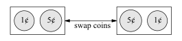
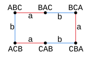
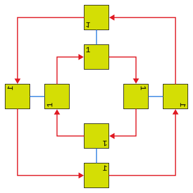
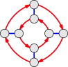
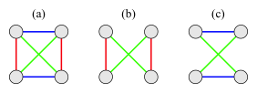
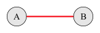
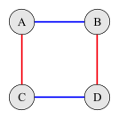
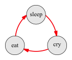

---
jupytext:
  text_representation:
    extension: .md
    format_name: myst
    format_version: 0.13
    jupytext_version: 1.16.1
kernelspec:
  display_name: Python 3 (ipykernel)
  language: python
  name: python3
---

# 2.6 Exercises

+++

## 2.6.1 Basics

+++

### Exercise 2.1 (📑)

+++

> In the rectangle puzzle, what actions were the generators? What other actions are there besides the generators?

+++

The generators were flip horizontally and vertically; the other distinct action is both a horizontal and vertical flip. There's also an identity action that's similarly always available. All these actions are their own reverse.

+++

The author's solution:

+++

> The two generators are the horizontal flip and vertical flip. The other actions in the puzzle are the non-action (do nothing) and the combined action "horizontal flip then vertical flip".

+++

### Exercise 2.2

+++

> In the light switch puzzle, what actions were the generators? What other
actions are there besides the generators?

+++

The generators were flip the left and right flip; the other distinct action is flipping both at once. There's also an identity action that's similarly always available. All these actions are their own reverse.

+++

### Exercise 2.3 (📑)

+++

> Can an arrow in a Cayley diagram ever connect a node to itself?

+++

We typically don't include the identity arrows, but we may in some cases for clarity.

+++

The author's solution:

+++

> Arrows that point from a node to itself represent the non-action. Typically such arrows are not included in the diagram, since they add clutter, but not any useful information.

+++

## 2.6.2 Mapmaking

+++

### Exercise 2.4 (📑)

+++

> Exercise 1.1 of Chapter 1 defined a group. Create its Cayley diagram using the technique from this chapter. (Hint: This group is simpler than even those done
so far; the diagram will be small.)

+++

+++

The author's solution:

+++

> 

+++

### Exercise 2.5

+++

> Exercise 1.4 of Chapter 1 defined a group. Create its Cayley diagram using the technique from this chapter.

+++

+++

Using [Cycle notation](https://en.wikipedia.org/wiki/Permutation#Cycle_notation):

+++

$$
\begin{align}
a = [(AB)(C)] \\
b = [(A)(BC)]
\end{align}
$$

+++

### Exercise 2.6

+++

> Exercise 1.13 described an infinite group which can be generated with just one generator. Can you draw an infinite Cayley diagram for it? (Just draw a portion of the diagram that makes the infinite repeating pattern clear.)

+++

+++

> How does that Cayley diagram compare to one for the group in Exercise 1.14 part (a)?

+++

It has the same structure (homomorphic):

+++

+++

### Exercise 2.7

+++

> Exercise 1.14 part (d) described a two-element group. Can you draw a Cayley diagram for it? Which arrow or arrows should you use and why?

+++

+++

We only use the arrow for -1; the arrow for 1 is the identity.

+++

### Exercise 2.8 (📑)

+++

> Section 2.2 introduced the rectangle puzzle. Imagine instead a square puzzle with its corners labeled the same way. Such a puzzle would allow a new move
that was not possible with the rectangle puzzle; you could rotate a quarter-turn clockwise.
>
> (a) Make the map of this group.

+++

<!-- !name='2-6-ex-8-square-puzzle-vertical' && ffmpeg -y -framerate 2 -pattern_type glob -i "${name}_*.png" ${name}.gif -->

+++

We'll use 🟥 below for rotating to the right; here's an example cycle:

+++

+++

We'll use 🟦 for a vertical flip:

+++

+++

We will *not* use a horizontal flip as a generator, although it would be possible:

+++

+++

We could have also used a left rotation as a generator, or a combination (composition) of these "primitive" moves. The map given our choices:

+++

+++

See also [Cayley Diagram for $D_4$](https://nathancarter.github.io/group-explorer/CayleyDiagram.html?groupURL=https://nathancarter.github.io/group-explorer/groups/D_4.group) and [Dihedral group](https://en.wikipedia.org/wiki/Dihedral_group). Yet another version from [File:Dih 4 Cayley Graph](https://en.wikipedia.org/wiki/File:Dih_4_Cayley_Graph;_generators_a,_b.svg):

+++

+++

And yet another:

+++

+++

The author's solution:

+++

> This group is called $D_4$ and there are several ways to represent it with a Cayley diagram. Here is one.
>
> 

+++

> (b) Why is the quarter-turn move not "allowed" in the rectangle puzzle?

+++

Distinguish between the similarly-named [Symmetric group](https://en.wikipedia.org/wiki/Symmetric_group) $S_n$ and [Symmetry group](https://en.wikipedia.org/wiki/Symmetry_group) $Sym(X)$. From the top of the former:

> *Not to be confused with [Symmetry group](https://en.wikipedia.org/wiki/Symmetry_group "Symmetry group").*

From the latter:

> Such a transformation is an invertible mapping of the [ambient space](https://en.wikipedia.org/wiki/Ambient_space "Ambient space") which takes the object to itself, and which preserves all the relevant structure of the object.

+++

That is, a quarter-turn would make the square some 2d space that it was not in its original position.

+++

If we allowed moving out of the starting space you'd be able to rotate by 10 degrees as a valid action; but if rotating by 10 degrees is valid then why not by 5 degrees? And if rotating by 10 degrees is valid, why not allow horizontal flipping at any point, regardless of how the shape ends up looking? In order to limit the number of valid actions we're limiting our actions to those that put the rectangle (or square) back into the same space with every action (just reoriented).

+++

### Exercise 2.9 (📑)

+++

> Most groups can be generated many different ways, and each way gives rise to a corresponding way to connect a Cayley diagram with arrows. For example,
consider the group $V_4$, which we met in the rectangle puzzle. Let's shorten the names of its actions to $n$, $h$, $v$ and $b$, meaning (respectively) no action, horizontal flip, vertical flip, and both (a horizontal flip followed by a vertical flip).
>
> We saw that $h$ and $v$ together generate $V_4$. But it is also true that $h$ and $b$ together would generate $V_4$, or $v$ and $b$ together. (You can verify these facts by exploring the rectangle realm using these generators on your own numbered rectangle.)
>
> (a) Make a copy of Figure 2.9 and add to it a new type of arrow, representing the action b.

+++

See the author's solution's drawings; these aren't interesting enough to reproduce.

+++

> (b) Make a copy of your answer to part (a), with the arrows representing $h$ removed. How does your diagram show that $v$ and $b$ are sufficient to generate $V_4$?

+++

Only $v$ and $b$ are sufficient to generate $V_4$ because we can still reach every state from every other state.

+++

> (c) Make a copy of your answer to part (a), with the arrows representing $v$ removed. How does your diagram show that $h$ and $b$ are sufficient to generate $V_4$?

+++

Only $h$ and $b$ are sufficient to generate $V_4$ because we can still reach every state from every other state.

+++

The author's solution:

+++

> 
>
> In both parts (b) and (c), the diagram shows that the generators drawn are sufficient because the diagram is connected. (From any one location, you can get to any other.)

+++

## 2.6.3 Going backwards

+++

### Exercise 2.10

+++

> If you've done all the exercises to this point, you've encountered two different Cayley diagrams that have the two-node form shown here.
>
> 
>
> Can you come up with another group whose Cayley diagram has this form?

+++

A door lock, specifically one which can only be locked and unlocked (two states). We define the single action as switching the lock state.

+++

Alternatively, a stick with the generator of flipping the stick.

+++

### Exercise 2.11

+++

> If you've done all the exercises to this point, you've encountered two different Cayley diagrams that have the four-node form shown here.
>
> 
>
> Can you come up with another group whose Cayley diagram has this form?

+++

A car, where we define one "action" to turn the engine on/off and the other to put the car in motion/stop it. A car can be both running and moving, neither, or one or the other.

+++

Alternatively, the set of binary two-tuples (00, 10, 01, 11), with the generators:
- Flipping the first bit
- Flipping the second bit

+++

### Exercise 2.12 (📑)

+++

> We have not yet seen a group whose Cayley diagram has the three-node form called $C_3$, shown in the top left of Figure 2.10. Can you come up with a group
whose Cayley diagram has that form?

+++

The **proper symmetry group** i.e. **rotation group** of a triangle (see [Symmetry group](https://en.wikipedia.org/wiki/Symmetry_group)).

+++

The author's solution:

+++

> The following is one example answer; it represents the cycle of activities for a typical newborn baby.
>
> 

+++

## 2.6.4 Rules

+++

### Exercise 2.13 (📑)

+++

> A group's generators have a special status in a Cayley diagram for the group. What is that special status?

+++

They represent the arrows we chose to draw, and each gets a unique color. We could have chosen other generators and gotten a different set of arrows but still the same nodes.

+++

Even in the article [Cayley graph](https://en.wikipedia.org/wiki/Cayley_graph), the color is critical to interpretation and one reason visualizing large groups or non-finitely generated groups is that we run out of colors. In [Cayley Q8 multiplication graph](https://upload.wikimedia.org/wikipedia/commons/a/a5/Cayley_Q8_multiplication_graph.svg), we even color the first node associated with the generator (starting from the identity element) based on the generator:

+++

+++

These coloring choices is arbitrary in many ways. Not only could we have colored different generators differently, we often have more than one natural choice regarding which node we treat as the identity element. Without any map to the real world (such as the map from $V_4$ to the rectangle puzzle) there's always no natural choice.

+++

See also [Active and passive transformation](https://en.wikipedia.org/wiki/Active_and_passive_transformation). Looking at [Cayley Q8 multiplication graph](https://upload.wikimedia.org/wikipedia/commons/a/a5/Cayley_Q8_multiplication_graph.svg) again, we interpret $j$ both as a node and a generator and color both the node and the arrow green. From the perspective of $1$ it is known as $j$ (alias), but we can also transform $1$ to $j$ with the transform $j$ (alibi).

+++

We assume we can take all the generator actions from every node as we build the Cayley graph; in this sense the cardinality of the set of generators determines how many lines come out of every node.

+++

The author's answer:

+++

> The generators have the special status of being represented by the diagram's arrows. (And like all other elements of the group, the generators are also represented as nodes.)

+++

### Exercise 2.14

+++

> Chapter 1 required groups to satisfy Rule 1.5, which states, "There is a predefined list of actions that never changes." How does this rule impact the appearance of Cayley diagrams? (Or how would diagrams be different if this rule were not a requirement?)

+++

This question is a bit unexpected based on a comment by the author in section 1.5.3:

> Rules 1.6 through 1.8 would not make much sense without Rule 1.5, because it introduces the notion of a list of actions. But for each of the other rules, we can ask what it would be like if that rule were not present.

Still, we can conjecture. The cardinality of the set of actions (potentially infinite) is the number of nodes. If the list of actions could change then the number of nodes could change as you took action, which would be harder (though more realistic in e.g. robotic applications).

Per the bottom of page 6, however, Rule 1.5 refers to the number of generators:

> In the case of Rubik's Cube, although I list only six basic actions, you can form many actions by combining these six. As a simple example, combining two 90-degree rotations of the front face in sequence creates a new action, a 180-degree rotation of the front face. More complicated examples can be created from sequences of three or four or more different basic actions chained together. The standard way to say this is that Rule 1.5 gives us actions that generate all the others, and are therefore called generators.

The text seems confused about what this rule means; if this last statement is correct then we could have considered this question as part of Exercise 2.13.

+++

### Exercise 2.15 (📑)

+++

> Chapter 1 required groups to satisfy Rule 1.6, which states, "Every action is reversible." What constraint does this place on the arrows in a Cayley diagram? Can
you draw a diagram that does not fit this constraint? (That is, draw a diagram that almost deserves the name "Cayley diagram," except for that one rule violation.)

+++

See Exercise 1.10; we should be able to take any answer to it and draw the Cayley diagram for it. To draw it for a stack, we'd just have one starting node and an infinite stack of arrows to the right of it:

+++

+++

The author's answer:

+++

> If following arrows in a diagram corresponds to doing actions, then following arrows backwards corresponds to undoing the actions. So in order for us to be able to follow arrows backwards in a diagram, we cannot have two arrows of the same type pointing to the same destination from two different sources. For instance, in the following diagram, it is not clear how to undo the action of the solid black arrow when in configuration $C$. Should you go to $A$ or to $B$?
>
> 

+++

It might be a bit confusing to say that following arrows backwards is the only way to reverse an action; in $C_3$ it seems we must do so by following two arrows forward. However, in a group there is always an inverse so you can always take an arrows backwards. If we call the generator of the cyclic group $g$, then there's always an inverse $g^{-1}$. In an "infinite cyclic group" (or "monogeneous" group, see [Cyclic group](https://en.wikipedia.org/wiki/Cyclic_group)) there's no way to follow arrows backward except to appeal to this member.

It seems the point the author is really trying to make here is that the system is memoryless. If you're at state $C$, then if you had a history of your actions you would know how to reverse your action to get back to either $A$ or $B$. If you don't have history, then your action is not reversible.

The author's answer is not just a "one rule violation" that the question asked for. It also fails to satisfy Rule 1.5, because not every action (in particular the black arrow action) is available from $C$. The errata mentions that it also fails to satisfy Rule 1.8 and suggests a different answer:

+++

> The diagram shown in the text as a solution to this exercise violates not only Rule 1.6, as assigned, but also Rule 1.8, as described in the solution to exercise 2.17. However, the assignment was to violate only Rule 1.6, not any of the others. A diagram like the following would be better, in which we find that from the point B, it is not clear what the inverse of the red arrow would mean.
>
> 

+++

The author actually misspells "assignment" as "assignmentw" in the errata but there's no errata for the errata.

+++

### Exercise 2.16

+++

> Chapter 1 required groups to satisfy Rule 1.7, which states, "Every action is deterministic." What constraint does this place on the arrows in a Cayley diagram? Can you draw a diagram that does not fit this constraint? (That is, draw a diagram that almost deserves the name "Cayley diagram," except for that one rule violation.)

+++

See Exercise 1.11; we should be able to take any answer to it and draw the Cayley diagram for it.

+++

We simply need to make some actions/transitions probabilistic. From [Markov decision process](https://en.wikipedia.org/wiki/Markov_decision_process):

+++

+++

### Exercise 2.17 (📑)

+++

> Chapter 1 required groups to satisfy Rule 1.8, which states, "Any sequence of consecutive actions is also an action." How do we depend upon this fact when using a Cayley diagram as a map?

+++

When we're using a Cayley diagram as a map, we let ourselves follow any sequence of arrows we'd like to as long as we'd like to. That sequence still counts as an action, and we can name the action based on the steps we took. In fact, we can take an infinite number of steps. It's the ability to take an infinite/arbitrary number of steps that makes it hard to decide which actions are actually equivalent (e.g. that $vh$ is equivalent to $hv$).

+++

The author's answer:

+++

> It guarantees that from every point on the map, there will always be an arrow of each type leaving that point. This can be verified by considering what it would
be like if it were not true; let's say we had some point $P$ on our map that was lacking an outbound arrow corresponding to some action $A$. Then the sequence of moves leading from the start to $P$ followed by action $A$ would be invalid, which Rule 1.8 forbids.

+++

With Exercise 2.15, this implies that every node will have an "arrow out" for every generator and an "arrow in" for every generator.

+++

## 2.6.5 Shapes

+++

### Exercise 2.18

+++

> If we created an equilateral triangle puzzle, like the square puzzle in Exercise 2.8, what would the valid moves be? Map the group of such a puzzle.

+++

From [Dihedral group of order 6](https://en.wikipedia.org/wiki/Dihedral_group_of_order_6):

+++

+++

### Exercise 2.19

+++

> A regular $n$-gon is a polygon with $n$ equal sides and $n$ equal angles. You have already analyzed regular $n$-gons with $n = 3$ (equilateral triangle, Exercise 2.18) and $n = 4$ (square, Exercise 2.8).
>
> (a) Based on what you know about the cases when $n = 3$ and $n = 4$, make a conjecture about how many actions will be in the group of the regular $n$-gon for any $n$ > 2.

+++

$2n$

+++

> (b) Test your conjecture by making the map of the group for a regular pentagon ($n = 5$).

+++

See [1810.00158v1.pdf § Definition 3](https://arxiv.org/pdf/1810.00158#section.1.2) for this work.

+++

> (c) Find the equilateral triangle group, the square group, and the regular pentagon group in Group Explorer's library. (Hint: Use the search feature.)
>
> (i) Do your Cayley diagrams look like those in Group Explorer?

+++

See [$S_3$](https://nathancarter.github.io/group-explorer/CayleyDiagram.html?groupURL=https://nathancarter.github.io/group-explorer/groups/S_3.group), [${Dih}_4$](https://nathancarter.github.io/group-explorer/CayleyDiagram.html?groupURL=https://nathancarter.github.io/group-explorer/groups/D_4.group), and [${Dih}_5$](https://nathancarter.github.io/group-explorer/CayleyDiagram.html?groupURL=https://nathancarter.github.io/group-explorer/groups/D_5.group). Our triangle Cayley diagram doesn't look the same, but could with different generators.

+++

> (ii) Does your conjecture hold up against all the data you can find in Group Explorer?

+++

Yes

+++

> (d) Write a paragraph giving as convincing an argument as you can in favor of your conjecture. Try to anticipate the counterarguments of a skeptical reader.

+++

If we didn't consider reflections, there'd only be $n$ elements in the rotation group. With reflections we get two cycles, one for the unreflected and reflected $n$-gon.
