---
jupytext:
  text_representation:
    extension: .md
    format_name: myst
    format_version: 0.13
    jupytext_version: 1.16.1
kernelspec:
  display_name: Python 3 (ipykernel)
  language: python
  name: python3
---

# 3.4 Exercises

+++

## 3.4.1 Basics

+++

### Exercise 3.1

+++

> Consider the six contra dance figures shown in Figure 3.15. Which of them, if any, when repeated twice in succession, return the dancers to their original positions? Which, if any, do not return the dancers to their original positions until the move is repeated three times? Four? Do any figures require more repetitions than four to return the dancers to their original positions?

+++

These only require repeating the action twice:
- Ladies' chain
- Swing on side
- Gents allemande
- Right and left through
- California twirl

The "Circle right" action requires repeating the action four times.

+++

### Exercise 3.2

+++

> Consider the horizontal flip shown on top of Figure 3.11. What is the effect of repeating that action twice in succession? How is the glide reflection shown in
the same figure different?

+++

The horizontal flip, repeated twice, does nothing.

The glide reflection moves the whole structure forward.

+++

### Exercise 3.3

+++

> Figure 3.4 shows that if you rotate a boric acid molecule clockwise one-third of a full turn, it takes up the same space as it did originally. This clockwise rotation generates the Cayley diagram shown in Figure 3.6. How would the diagram be different if I had generated it with a counterclockwise rotation instead? Would the group size or structure change?

+++

The diagram would rotate in the opposite direction but the group size and structure would stay the same.

+++

### Exercise 3.4

+++

> Name three physical manipulations you could do to the cube in Figure 3.7 that would rearrange its parts but leave it taking up the same space, as in step 2 of
Definition 3.1.

+++

You could reflect the cube across a plane cutting it in half in any of the three dimensions. You could also rotate it on several axes through the center of cube.

+++

## 3.4.2 The symmetry of molecules

+++

### Exercise 3.5

+++

> Apply the technique from Definition 3.1 to a molecule of ethylene, shown below. (Include the optional Step 3.) Where have we seen the resulting group before and what is its name?
>
> 
>
> The chemical formula for ethylene is $C_2 H_4$; the dark atoms indicate carbon and the light blue atoms indicate hydrogen. A scale model of this molecule would lie flat on a table; it has no depth.

+++

Assuming the molecule is rectangular, this group is isomorphic to the Klein four-group.

+++

### Exercise 3.6 (📑)

+++

> Apply the technique from Definition 3.1 to a molecule of sulfur chloride pentafluoride, shown below. As in the previous exercise, perform the optional Step 3. We have not named the resulting group so far in this book; can you find it in Group Explorer?
>
> 
>
> The chemical formula for sulfur chloride pentafluoride is ${SF}_5 Cl$; the yellow atom indicates sulfur, the white indicates chlorine, and the magenta atoms indicate fluorine.

+++

This is the cyclic group $C_4$ (of order 4). See [$C_4$ in Group Explorer](https://nathancarter.github.io/group-explorer/CayleyDiagram.html?groupURL=https://nathancarter.github.io/group-explorer/groups/Z_4.group).

+++

The author's answer:

+++

> In the Cayley diagram in Figure A.1, the arrows labeled "1/4 turn" mean a quarter turn as if you had twisted the white molecule on top clockwise, spinning the atom around the vertical axis.
>
> 

+++

### Exercise 3.7

+++

> Repeat the previous exercise on a molecule of benzene, as shown below.
>
> 
>
> The chemical formula for benzene is $C_6 H_6$; the dark atoms indicate carbon and the light blue atoms indicate hydrogen. A scale model of this molecule would lie flat on a table; it has no depth.

+++

This is the dihedral group $D_6$ (of order 12).

+++

### Exercise 3.8 (📑)

+++

> Repeat the previous exercise on a molecule of eclipsed ferrocene, $Fe{(C_5 H_5)}_2$, as shown below.
>
> 

+++

This is the dihedral group $D_5$ (of order 10).

+++

The author's answer:

+++

> A solution to this problem is not provided, but here is a hint. You may find it easier to explore the molecule's symmetry group if you know that it has the same symmetries as a regular pentagon. (Think of laying a pentagon flat with its center at the center of the molecule, each of its five corners half way between two of the purple atoms, vertically. Just as the molecule can be spun or flipped, so can the pentagon, and vice versa.)

+++

### Exercise 3.9

+++

> Your work in the exercises in this section has shown you several symmetry groups, of various sizes. Is there any relationship between symmetry group size and how much symmetry the corresponding object displays?

+++

Generally speaking, more symmetry means the group's order is larger. That is, the more ways there are to get something looking the same after a transformation, the larger the order of the associated group.

+++

### Exercise 3.10

+++

> What physical objects with which you are familiar have some symmetry? Choose one and apply the technique in Definition 3.1 to create and diagram the group describing its symmetry.

+++

Both a ring (a circle) and a ball (a sphere) have "infinite" symmetry.

+++

## 3.4.3 Repeating patterns

+++

### Exercise 3.11 (⚠, 🕳️, 📑)

+++

> As mentioned in this chapter, there are exactly seven groups that describe all possible symmetries for frieze patterns. The diagram of one such group appears in Figures 3.12 and 3.13.
>
> This exercise has six parts, (a) through (f), each asking you to apply the technique in Definition 3.1 to a frieze that exemplifies one of the other six frieze groups. The friezes you need are shown below.

+++

See [Frieze group § Descriptions of the seven frieze groups](https://en.wikipedia.org/wiki/Frieze_group#Descriptions_of_the_seven_frieze_groups). We'll categorize each into their IUC identifier. For some we'll supply a drawing of the isomorphic group (as in Figure 3.13) but the Wikipedia article provides a decent summary:

> Of the seven frieze groups, there are only four up to [isomorphism](https://en.wikipedia.org/wiki/Group_isomorphism "Group isomorphism"). Two are singly generated and isomorphic to $\mathbb {Z}$; four of them are doubly generated, among which one is [abelian](https://en.wikipedia.org/wiki/Abelian_group "Abelian group") and three are nonabelian and isomorphic to $D_{\infty }$, the [infinite dihedral group](https://en.wikipedia.org/wiki/Infinite_dihedral_group "Infinite dihedral group"); and one of them has three generators.

+++

In the following images we use $t$ for translation (T on Wikipedia), $g$ for glide reflection (G on Wikipedia), $e$ for identity, and $r$ for 180° rotation i.e. $vh$ (R on Wikipedia). Following the author (and Inkscape) we use $h$ for horizontal flip (Wikipedia uses "vertical reflection line" or V) and $v$ for vertical flip (Wikipedia uses "horizontal reflection line" or H).

+++

 (a) p1

+++

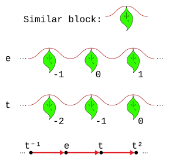

+++

 (b) p11g

+++

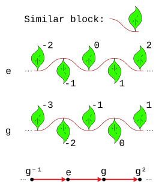

+++

 (c) p1m1

+++

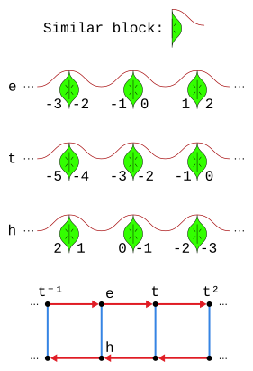

+++

 (d) p2mm

+++

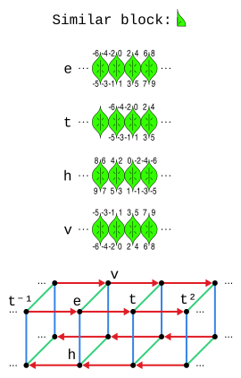

+++

The author's solution, partially taken from the errata:

+++

> The solution to part (d) is shown in Figure A.2. It is a pattern that repeats vertically in blocks of four; each block of four is a little Klein 4-group, like the group of the rectangle puzzle from Chapter 2. The curved arrows represent the action of sliding the pattern to the right by the width of one leaf.
>
> 

+++

 (e) p2

+++

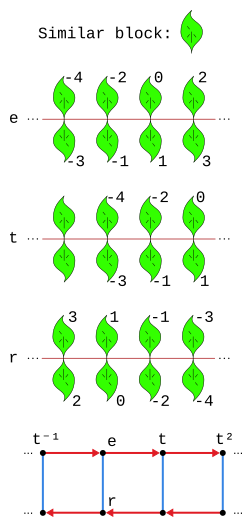

+++

 (f) p11m

+++

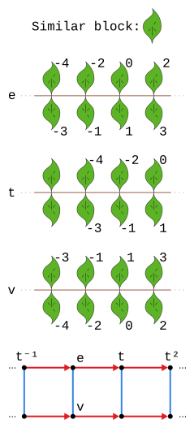

+++

The author's Figure 3.10 is a p2mg, so we've seen all 7 frieze groups on the Wikipedia page.

+++

### Exercise 3.12 (⚠)

+++

> For each of the following letter sequences, think of it as a frieze pattern. Match each letter sequence with the leaf frieze from the previous exercise that has the same symmetry group.
>
>  (a) `LLLLLLLL`

+++

p1

+++

>  (b) `MMMMMMMM`

+++

p1m1

+++

>  (c) `MWMWMWMW`

+++

p2mg

+++

From the errata:

+++

> Part (c) does not have the same symmetries as any of the figures in the previous exercise; it has the same symmetries as the frieze pattern from Section 3.1.3.

+++

This does seem correct if you interpret a flipped M as matching a W (which many readers will naturally assume is what was meant).

+++

>  (d) `HHHHHHHH`

+++

p2mm

+++

>  (e) `SSSSSSSS`

+++

p1

+++

## 3.4.4 Dancing

+++

### Exercise 3.13 (📑)

+++

> Take just the contra dance figure called "Circle right" from those shown in Figure 3.15.
>
> (a) Create a Cayley diagram for the group generated by this action alone (i.e., Circle right and any number of repetitions of it).

+++

This is $C_4$:

+++

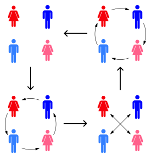

+++

The author's answer:

+++

> The following Cayley diagram shows the group generated by the contra dance figure called "Circle right." Note that the dancers are moving to their own right sides, which from our point of view means they move counterclockwise.
>
> 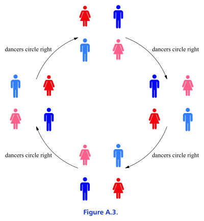
>
> Rather than moving the dancers around the square, as in the diagram above, I could have drawn each square with the dancers in their original position, but with arrows to show where they would end up. This makes it easier to see how repetitions of the "Circle right" figure can yield other figures, and therefore makes it easier to answer the second part of this question. Figure A.4 does so.

+++

> (b) Does this group contain any of the other contra dance figures from Figure 3.15?

+++

Yes, we can see "Right and left through" in it.

+++

> It contains the "Right and left through," as well as two other figures not shown in Figure 3.15. One of those figures doesn't look very interesting, because the dancers don't change positions at all. But keep in mind that these illustrations only show the results of the figures, not the steps taken during them; a figure may be interesting to watch or to dance, even though it does not result in a shuffling of the dancers at its end.
>
> 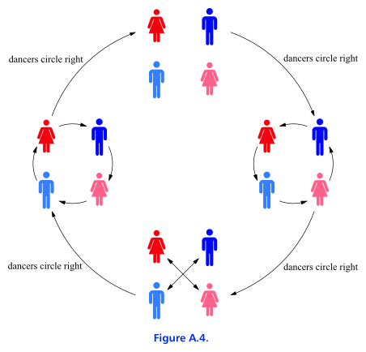

+++

### Exercise 3.14

+++

> (a) Repeat Exercise 3.13 for the figure "Ladies' chain."

+++

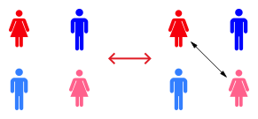

+++

> (b) Repeat Exercise 3.13 for the figure "Gents allemande."

+++

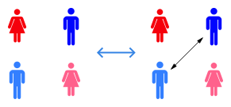

+++

> (c) Repeat Exercise 3.13 for the group generated by the two figures "Ladies' chain" and "Gents allemande" together.

+++

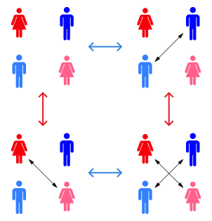

+++

### Exercise 3.15

+++

> (a) If you had to generate all the contra dance figures in Figure 3.15 using only combinations of "Circle right" and another contra dance figure of your choice, which would you choose? Show that your answer is correct.

+++

It looks like combining most dances with "Circle right" would work (besides "Right and left through"). Let's try "Swing on side" and abbreviate "Circle right" as $r$ and "Swing on side" as $s$. Then to generate all six moves:
- $r$: Circle right
- $r^2$: Right and left through
- $s$: Swing on side
- $sr$: Ladies' chain
- $sr^2$: California twirl
- $sr^3$: Gents allemade

+++

> (b) Is it possible to generate all the contra dance figures in Figure 3.15 using only combinations of "Ladies chain" and one other contra dance figure of your choice? If so, which contra dance figure should you choose? If not, how many more contradance figures beyond "Ladies' chain" would you need?

+++

We'll need "Circle right" to make this work. Abbreviate "Circle right" as $r$ and "Ladies chain" as $l$. Then to generate all six moves:
- $r$: Circle right
- $r^2$: Right and left through
- $l$: Ladies' chain
- $lr$: California twirl
- $lr^2$: Gents allemade
- $sr^3$: Swing on side

+++

> (c) How few contra dance figures can you start with, and still generate all the contra dance figures in Figure 3.15 from their combinations?

+++

We'd need at least two dances, as in the examples above (we can't do it with one).

+++

### Exercise 3.16

+++

> (a) When you generate a group by combining contra dance figures as in Exercise 3.15, can you generate any contra dance figures that are not shown in Figure 3.15?

+++

Yes, for example the "Nobody move" and "Circle left" dances. There are 24 permutations of the integers 1234, and we are only hitting 8 of those.
The dances are designed to keep men and women separate, so we never hit the permutations where a man is standing next to a man.

+++

> (b) How big is the group of contra dance figures generated from those in Figure 3.15?

+++

There are a total of 8 dances.

+++

> (c) Diagram the entire group.

+++

We'll use the generators "Circle right" (🟩) and "Ladies chain" (🟥):

+++

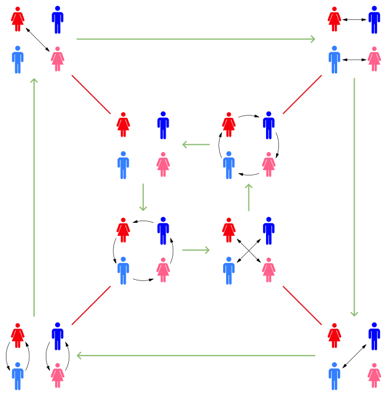
