---
jupytext:
  text_representation:
    extension: .md
    format_name: myst
    format_version: 0.13
    jupytext_version: 1.16.1
kernelspec:
  display_name: Python 3 (ipykernel)
  language: python
  name: python3
---

# 4.5 Exercises

+++

## 4.5.1 Basics

+++ {"jp-MarkdownHeadingCollapsed": true}

### Exercise 4.1

+++

> Consider the lightswitch group shown in Figure 2.8. Let $L$ stand for the action of flipping the left switch and $R$ stand for the action of flipping the right switch.

---

> (a) Which of the following equations are true and which are false in this group?
>
> $LRRRR = RRL$

True, cancel all the $R$.

> $LR = RLRLRL$

True, because the group is commutative.

> $L = RR$

False

> $R^8 = R^{100}$

True

---

> (b) Let N stand for the non-action (leaving the switches untouched). Which of the following equations are true?
>
> ${(LNR)}^2 = LNR$

False

> $NN = N$

True

> $RL = N$

False

> $R^4 = N$

True

> ${(LNR)}^3 = R^3 L^3 $

True

> $LRLR = N$

True

> (c) What is the smallest positive power of R that equals N ?

$R^2$

> (d) What is the smallest positive power of L that equals N ?

$L^2$

> (e) What is the smallest positive power of RL that equals N ?

${(RL)}^2$

> (f) What is the smallest positive power of LR that equals N?

${(LR)}^2$

+++

### Exercise 4.2

+++

> (a) Apply the transformation in Definition 4.1 to the lightswitch Cayley diagram in Figure 2.8.

+++

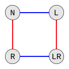

+++

> (b) Create a multiplication table for the lightswitch group.

+++

We'll use a permutation library to avoid doing too much manual work on some of these questions. See [Permutations - SymPy documentation](https://docs.sympy.org/latest/modules/combinatorics/permutations.html) and [Permutations and Symmetric groups · AbstractAlgebra.jl](https://docs.juliahub.com/AbstractAlgebra/b8V2b/0.41.3/perm/) for two options.

```{code-cell} ipython3
import numpy as np

from sympy.combinatorics import Permutation

e = Permutation([0, 1, 2, 3])
l = Permutation([2, 1, 0, 3]) # Left light switch
r = Permutation([0, 3, 2, 1]) # Right light switch

permutation = {
    "E": e,
    "L": l,
    "R": r,
    "LR": l*r,
}
action = {v: k for k, v in permutation.items()}

x = np.array(list(permutation.values()))
rank_v = np.vectorize(action.get)
actions = rank_v(x)
```

See also [Broadcasting — NumPy Manual](https://numpy.org/doc/stable/user/basics.broadcasting.html).

```{code-cell} ipython3
import pandas as pd

pd.DataFrame(rank_v(x[...,np.newaxis] * x), index=actions, columns=actions)
```

+++ {"jp-MarkdownHeadingCollapsed": true}

### Exercise 4.3

+++

> Each part below describes a set with a binary operation on it. For each one, determine whether it is commutative and whether it is associative.
>
> (a) the addition operation on the set of all whole numbers

Commutative, associative

> (b) the subtraction operation on the set of all whole numbers

Not commutative, not associative

> (c) the multiplication operation on the set of positive real numbers

Commutative, associative

> (d) the division operation on the set of positive real numbers

Not commutative, not associative (try 2/3/2)

> (e) the exponentiation operation on the set of positive whole numbers (that is, the operation written $a^b$, but typed a^b on many calculators)

Not commutative, not associative (try 2^3^2)

+++

## 4.5.2 Creating tables

+++ {"jp-MarkdownHeadingCollapsed": true}

### Exercise 4.4 (⚠)

+++

> The Cayley diagrams for two groups are shown here, the cyclic group $C_5$ on the left and the Quaternion group $Q_4$ on the right.
>
> 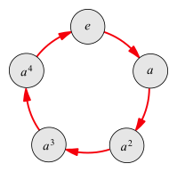 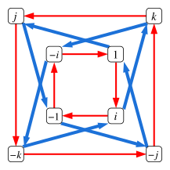

See comments in the errata. The author's replacement drawing strangely uses red for $j$ and green for $i$, which seems odd given that red is normally the first color in all these examples. We'll using a variation on [File:Cayley graph Q8.svg](https://commons.wikimedia.org/wiki/File:Cayley_graph_Q8.svg) here and going forward, with green replaced with blue.

> (a) The red arrow in the diagram for $C_5$ represents multiplication by what element?

$a$

> (b) What is $a^3 · a$ in $C_5$?

$a^4$

> (c) What is $a^3 · a · a$ in $C_5$?

$e$

> (d) If 1 is the identity element, then what do red arrows in the diagram for $Q_4$ represent? What do the blue arrows represent?

$i$ and $j$

> (e) What is $i^2$? What is $j·i$?

$-1$ and $-k$

> (f) What is $i·j·j$?

$-i$

+++ {"jp-MarkdownHeadingCollapsed": true}

### Exercise 4.5 (📑)

+++

> Using the Cayley diagrams from Exercise 4.4, answer the following questions.
>
> (a) How do you use the diagram of $C_5$ to multiply $x·a^2$ in $C_5$, for any element $x$?

First you go to $x$, then you follow two red arrows.

> (b) How do you use the diagram of $Q_4$ to multiply $x·k$ in $Q_4$, for any element $x$?

First you go to $x$, then you follow a red and then a blue arrow (because $k$ is equivalent to $ij$).

+++

The author's answer, based on the original/incorrect quaternion group drawing:

+++

> (a) Beginning at the element x in the diagram, follow a red arrow twice. Each red arrow represents one multiplication on the right by a, so this computes $x · a · a$, or $x · a^2$.
>
> (b) From Exercise 4.4 we learned that $k = j · i$, which is performed by following the $j$ arrow (blue) and then the $i$ arrow (red). So to multiply $x · k$, begin at the node for $x$ and follow a blue arrow and then a red one.

+++

### Exercise 4.6 (⚠)

+++

> Create a multiplication table for each of the following Cayley diagrams.
>
> (a) $C_5$, as shown on the left of Exercise 4.4. Use the template given here.

```{code-cell} ipython3
import numpy as np

from sympy.combinatorics import Permutation

e = Permutation([0, 1, 2, 3, 4])
a = Permutation([4, 0, 1, 2, 3])

permutation = {
    "e": e,
    "a": a,
    "a²": a*a,
    "a³": a*a*a,
    "a⁴": a*a*a*a,
}
action = {v: k for k, v in permutation.items()}

x = np.array(list(permutation.values()))
rank_v = np.vectorize(action.get)
actions = rank_v(x)
```

```{code-cell} ipython3
import pandas as pd

pd.DataFrame(rank_v(x[...,np.newaxis] * x), index=actions, columns=actions)
```

> (b) $Q_4$, the quaternion group with eight elements, as shown on the right of Exercise 4.4. Use the template given here.

+++

See the multiplication tables in either [Groupprops - Quaternion group](https://groupprops.subwiki.org/wiki/Quaternion_group) or [Quaternion group](https://en.wikipedia.org/wiki/Quaternion_group).

+++

> (c) $A_4$, the alternating group with twelve elements:

+++

Based on the errata we'll inspect a different version of $A_4$:

+++

> 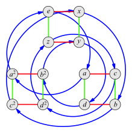

+++

It's not clear how the author intended readers to do this without a library; for a student to manually fill this 144-entry table would not be a good use of time.

```{code-cell} ipython3
from sympy.combinatorics.named_groups import AlternatingGroup

G = AlternatingGroup(4)
permutations = list(G.generate_dimino())

indexes = {perm: idx for idx, perm in enumerate(permutations)}
indexes
```

How do we relate these permutations to the names the author would like us to use? To start we'll pick out some "natural" permutations to use for the generators, though these choices are somewhat arbitrary:

```{code-cell} ipython3
permutation = {
    "e": permutations[0],
    "x": permutations[4],
    "z": permutations[6],
    "a": permutations[1],
}
```

From the generators we should be able to define all other actions:

```{code-cell} ipython3
permutation["y"] = permutation["x"]*permutation["z"]
```

```{code-cell} ipython3
permutation["a²"] = permutation["a"]*permutation["a"]
```

```{code-cell} ipython3
permutation["b"] = permutation["x"]*permutation["a"]
```

```{code-cell} ipython3
permutation["b²"] = permutation["b"]*permutation["b"]
```

```{code-cell} ipython3
permutation["c"] = permutation["z"]*permutation["a"]
```

```{code-cell} ipython3
permutation["c²"] = permutation["c"]*permutation["c"]
```

```{code-cell} ipython3
permutation["d"] = permutation["y"]*permutation["a"]
```

```{code-cell} ipython3
permutation["d²"] = permutation["d"]*permutation["d"]
```

```{code-cell} ipython3
permutation
```

```{code-cell} ipython3
import numpy as np

action = {v: k for k, v in permutation.items()}
name_v = np.vectorize(action.get)
x = np.array(list(permutation.values()))
```

```{code-cell} ipython3
import pandas as pd
import seaborn as sns

from sympy.combinatorics import Permutation

y = x[...,np.newaxis] * x
df = pd.DataFrame(name_v(y), index=name_v(x), columns=name_v(x))

index_v = np.vectorize(indexes.get)
cm = sns.color_palette("Paired", as_cmap=True)
df.style.background_gradient(axis=None, cmap=cm, gmap=index_v(y))
```

+++ {"jp-MarkdownHeadingCollapsed": true}

### Exercise 4.7

+++

> It is possible to suggest the full multiplication table for an infinite group by showing just part of it. Fill in the following partial table for the operation of addition on the set of all whole numbers; the ellipses indicate the table continues infinitely in all directions.

+++

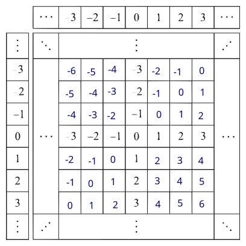

+++ {"jp-MarkdownHeadingCollapsed": true}

### Exercise 4.8

+++

> Exercises 2.4 through 2.8 of Chapter 2 asked you to draw Cayley diagrams for three groups. Use the diagrams you drew to make multiplication tables for those same groups. Note that if your diagram is not yet a diagram of actions, you may need to apply the transformation in Definition 4.1.

+++

Here are possible answers for Exercise 2.4 through Exercise 2.7; see the next question for Exercise 2.8 (which is $D_4$).

+++

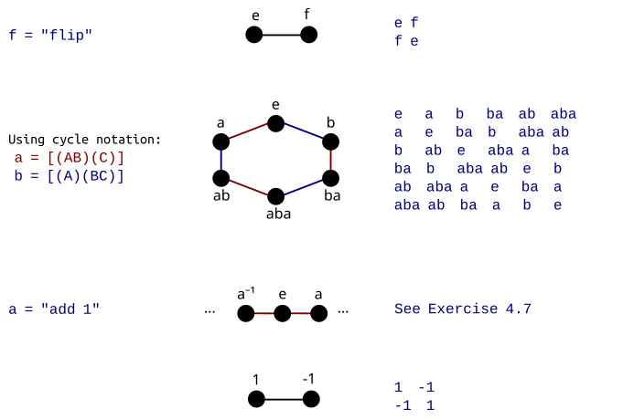

+++ {"jp-MarkdownHeadingCollapsed": true}

### Exercise 4.9

+++

> Exercises 2.18 and 2.19 of Chapter 2 asked you to find the pattern describing the sequence of Cayley diagrams for the "n-gon puzzle." I mentioned in that exercise that the family of groups describing such puzzles are called the dihedral groups. You will study them in detail in Chapter 5, and this exercise previews some of that material.
>
> Find the pattern describing the sequence of multiplication tables for those same groups. You might consider the following steps.
>
> (a) Create multiplication tables from the Cayley diagrams for triangle, square, and regular pentagon puzzles.

```{code-cell} ipython3
from sympy.combinatorics.named_groups import DihedralGroup

G = DihedralGroup(3)
permutations = list(G.generate_dimino())

indexes = {perm: idx for idx, perm in enumerate(permutations)}
indexes
```

```{code-cell} ipython3
permutation = {
    "e": permutations[0],
    "r": permutations[1],
    "f": permutations[3],
}
```

```{code-cell} ipython3
permutation["r²"] = permutation["r"]*permutation["r"]
```

```{code-cell} ipython3
permutation["rf"] = permutation["r"]*permutation["f"]
```

```{code-cell} ipython3
permutation["fr"] = permutation["f"]*permutation["r"]
```

```{code-cell} ipython3
permutation
```

```{code-cell} ipython3
import numpy as np

action = {v: k for k, v in permutation.items()}
name_v = np.vectorize(action.get)
x = np.array(list(permutation.values()))
```

```{code-cell} ipython3
import pandas as pd
import seaborn as sns

from sympy.combinatorics import Permutation

y = x[...,np.newaxis] * x
df = pd.DataFrame(name_v(y), index=name_v(x), columns=name_v(x))

index_v = np.vectorize(indexes.get)
cm = sns.color_palette("Paired", as_cmap=True)
df.style.background_gradient(axis=None, cmap=cm, gmap=index_v(y))
```

```{code-cell} ipython3
from sympy.combinatorics.named_groups import DihedralGroup

G = DihedralGroup(4)
permutations = list(G.generate_dimino())

indexes = {perm: idx for idx, perm in enumerate(permutations)}
indexes
```

```{code-cell} ipython3
permutation = {
    "e": permutations[0],
    "r": permutations[1],
    "f": permutations[4],
}
```

```{code-cell} ipython3
permutation["r²"] = permutation["r"]*permutation["r"]
```

```{code-cell} ipython3
permutation["r³"] = permutation["r"]*permutation["r"]*permutation["r"]
```

```{code-cell} ipython3
permutation["rf"] = permutation["r"]*permutation["f"]
```

```{code-cell} ipython3
permutation["fr"] = permutation["f"]*permutation["r"]
```

```{code-cell} ipython3
permutation["r²f"] = permutation["r"]*permutation["r"]*permutation["f"]
```

```{code-cell} ipython3
permutation
```

```{code-cell} ipython3
import numpy as np

action = {v: k for k, v in permutation.items()}
name_v = np.vectorize(action.get)
x = np.array(list(permutation.values()))
```

```{code-cell} ipython3
import pandas as pd
import seaborn as sns

from sympy.combinatorics import Permutation

y = x[...,np.newaxis] * x
df = pd.DataFrame(name_v(y), index=name_v(x), columns=name_v(x))

index_v = np.vectorize(indexes.get)
cm = sns.color_palette("Paired", as_cmap=True)
df.style.background_gradient(axis=None, cmap=cm, gmap=index_v(y))
```

```{code-cell} ipython3
from sympy.combinatorics.named_groups import DihedralGroup

G = DihedralGroup(5)
permutations = list(G.generate_dimino())

indexes = {perm: idx for idx, perm in enumerate(permutations)}
indexes
```

```{code-cell} ipython3
permutation = {
    "e": permutations[0],
    "r": permutations[1],
    "f": permutations[5],
}
```

```{code-cell} ipython3
permutation["r²"] = permutation["r"]*permutation["r"]
```

```{code-cell} ipython3
permutation["r³"] = permutation["r"]*permutation["r"]*permutation["r"]
```

```{code-cell} ipython3
permutation["r⁴"] = permutation["r"]*permutation["r"]*permutation["r"]*permutation["r"]
```

```{code-cell} ipython3
permutation["rf"] = permutation["r"]*permutation["f"]
```

```{code-cell} ipython3
permutation["fr"] = permutation["f"]*permutation["r"]
```

```{code-cell} ipython3
permutation["r²f"] = permutation["r"]*permutation["r"]*permutation["f"]
```

```{code-cell} ipython3
permutation["fr²"] = permutation["f"]*permutation["r"]*permutation["r"]
```

```{code-cell} ipython3
permutation
```

```{code-cell} ipython3
import numpy as np

action = {v: k for k, v in permutation.items()}
name_v = np.vectorize(action.get)
x = np.array(list(permutation.values()))
```

```{code-cell} ipython3
import pandas as pd
import seaborn as sns

from sympy.combinatorics import Permutation

y = x[...,np.newaxis] * x
df = pd.DataFrame(name_v(y), index=name_v(x), columns=name_v(x))

index_v = np.vectorize(indexes.get)
cm = sns.color_palette("Paired", as_cmap=True)
df.style.background_gradient(axis=None, cmap=cm, gmap=index_v(y))
```

>(b) Discern a pattern and describe it. This will be your conjecture about n-gons for n > 5.

+++

Each dihedral group has a "sub-multiplication table" within each of the four quadrants of the table.

+++

> (c) Return to the group library in Group Explorer and investigate the same groups as in Exercise 2.19. (If you do not remember which ones they are, you can use the search feature again and look up "triangle," "square," etc.)
>
> (i) Do your multiplication tables from part (a) agree with those in Group Explorer? Note that Group Explorer may have used different names for the elements of the group than you did, and may have chosen a different order for the rows and columns, but the pattern in the table should be the same. You can rename elements and reorder the rows and columns in Group Explorer's multiplication tables to help with the comparison.

+++

Yes, they seem to match.

+++

> (ii) Does your conjecture about the pattern of multiplication tables for n-gons with n > 5 hold up against all the data you can find in Group Explorer? (This includes groups other than the three you just examined.)

+++

Yes, there are similar patterns in those tables.

+++

> (d) Can you give a convincing reason why the conjecture you made ought to be true?

+++

In the top-left quadrant we have the table for when we never flip the $n$-gon (limit ourselves to rotations, this is essentially the table for a cyclic group). The bottom-left and top-right quadrants are associated with a single flip, and the bottom-right with two flips.

+++ {"jp-MarkdownHeadingCollapsed": true}

## 4.5.3 Almost tables

+++ {"jp-MarkdownHeadingCollapsed": true}

### Exercise 4.10 (📑)

+++

> Consider the following multiplication table that displays a binary operation.
>
> 
>
> (a) Explain succinctly why the binary operation is not associative. Can you write your answer as one equation?

+++

We could directly search for a counter-example, but we'll use [Light's associativity test](https://en.wikipedia.org/wiki/Light%27s_associativity_test) to generate more than one counterexample. The two tables produced by the test process:

+++


+++

We can see the tables disagree on two cells, corresponding to:

$$
\begin{align} \\
A·(A·B) = A·e = A & ≠ B = e·B = (A·A)·B \\
B·(A·A) = B·e = B & ≠ A = e·A = (B·A)·A
\end{align}
$$

+++

The author's answer:

+++

> Hint: Check associativity of $A·A·B$.

+++

This answer is fine, but it takes as an assumption that $A ≠ B$. If we let $A = B$ then this table (redundantly) represents a group with only 2 distinct elements ($e$ and $A = B$).

+++

> (b) Does the operation have inverses?

+++

Yes, each element is its own inverse, and $A$ and $B$ are also inverses of each other. Notice that $e$ shows up twice in the row for $A$, meaning we can conclude:

+++

$$
A·A = A·B = e
$$

+++

Lacking associativity, nothing about the previous statement can be reduced and there's little we can do to manipulate it further in an interesting way. If we assume associativity, this leads to $A = B$.

+++

Assuming $A ≠ B$ we can't even call this algebraic structure a [Quasigroup](https://en.wikipedia.org/wiki/Quasigroup) because it doesn't obey the Latin square property.

+++ {"jp-MarkdownHeadingCollapsed": true}

### Exercise 4.11

+++

> Consider the following multiplication table that displays a binary operation.
>
> 
>
> (a) Explain succinctly why the binary operation does not have inverses. Can you write your answer as one equation?

+++

See [Inverse element](https://en.wikipedia.org/wiki/Inverse_element); we can't have inverses without an identity (or identities). Since this operation is total, we can have only identity and in this cases it's $3$ because it is the only element where the row and column associated with it equals the row and column labels. We don't have all inverses, however, because $2$ does not have one. We can see $2$ doesn't have an inverse because there's no element in the row/column associated with this element that's equal to $3$ (similarly, it's quick to see that $1$ doesn't have an inverse).

+++

> (b) Is the operation associative?

+++

An operation is associative if a term reduces to the same regardless of where you put parentheses. If any term based on this algebra has a $1$ in it, then the term will be a $1$ regardless of the placement of parentheses. Similarly, if it has a $2$ in it then it will be a $2$ and if it only has $1$ in it it'll reduce to $1$ (again, regardless of parentheses). Since parentheses don't matter, this table is associative.

+++

We'd call this algebraic structure a [Monoid](https://en.wikipedia.org/wiki/Monoid) (because it has associativity and identity, but not invertibility), specifically a commutative monoid.

+++ {"jp-MarkdownHeadingCollapsed": true}

### Exercise 4.12

+++

> Consider the following multiplication table that displays a binary operation.
>
> 
>
> (a) Does this operation have inverses? Justify your answer.

+++

The identity is clearly $1$, using similar reasoning to the last question. It doesn't have inverses because e.g. there's no $1$ in the row/column for $x$.

+++

> (b) Is the operation associative? Justify your answer.

+++

Yes, because terms will evaluate the same regardless of parentheses. If a term has a $y$ it will always reduce to a $y$. Otherwise, a term has a single $x$ and only $1$ it will reduce to $x$; if it has two $x$ and only $1$ it will reduce to $y$. Otherwise, the term will reduce to $1$.

+++

We'd call this algebraic structure a [Monoid](https://en.wikipedia.org/wiki/Monoid) (because it has associativity and identity, but not invertibility), specifically a commutative monoid.

+++ {"jp-MarkdownHeadingCollapsed": true}

### Exercise 4.13 (📑)

+++

> For each multiplication table below, explain why it does not depict a group.
>
> 

+++

Notice two $3$ in the row for $3$, implying it has two inverses (which should be unique). That row is specifically claiming there are two identities:

+++

$$
3·e = 3·4 = 3
$$

+++

We know we can't have two identities, and we specifically know that $4$ is not an identity because the row/column associated with it is not equal the identity permutation. Therefore we can use the left inverse of $3$ to come up with a contradiction based on it:

+++

$$
(2·3)·4 = e·4 = 4 ≠ 2·(3·4) = 2·3 = e
$$

+++

That is, the algebra/table is not associative (we can change the result based on where we put parentheses).

+++

Here's an alternative approach. Assuming associativity and using the row for $4$, we would similarly conclude that $1 = 3$:

+++

$$
\begin{align}
4·1 & = 4·3 = 2 \\
4·4·1 & = 4·4·3 = 4·2 \\
1 & = 3 = 1
\end{align}
$$

+++

The rows/columns for these two elements are clearly different, so we should question the assumption of associativity. Indeed, we can verify it doesn't hold in one of the places we assumed it:

+++

$$
(4·4)·3 = e·3 = 3 ≠ 4·(4·3) = 4·2 = 1
$$

+++

The author's answer:

+++

> The operator is not associative, as the following computation demonstrates:
>
> $4·(3·2) = 4·1 = 2 ≠ 4 = 2·2 = (4·3)·2$

+++

> 

+++

It does not have inverses; notice the row for $a$ does not have an $e$ in it.

+++

> 

+++

Notice two $b$ in the row for $b$, implying it has two inverses (which should be unique). Based on logic similar to above we can find a counterexample to the claim of associativity:

$$
(b·b)·c = e·c = c ≠ e = b·b = b·(b·c)
$$

+++

> 

+++

It lacks an identity.

+++ {"jp-MarkdownHeadingCollapsed": true}

### Exercise 4.14 (📑)

+++

> The following multiplication table does not depict a binary operation on the set $\{e, x, y\}$. The reason is part of the definition of a binary operation; we would say that this binary operation lacks **closure**. Can you spot the problem and explain it in your own words?
>
> 

+++

The $s$ entry is not an element of $\{e,x,y\}$.

+++

The author's answer:

+++

> The element $s$ appears in the table, but is not in the row or column headings. Is it in the group or isn't it?

+++ {"jp-MarkdownHeadingCollapsed": true}

### Exercise 4.15

+++

> Why can the same element not appear twice in any row of a group's multiplication table? Does this restriction also apply to columns?

+++

Let's say the row $a$ contained two elements $x$ and $y$ that both equal some third element $z$:

+++

$$
a·x = a·y = z
$$

+++

Assuming inverses and associativity, we could conclude:

+++

$$
a^{-1}·(a·x) = a^{-1}·(a·y) = (a^{-1}·a)·x = x = (a^{-1}·a)·y = y = a^{-1}·z
$$

+++

This would require us to conclude that $x = y$, which is typically not going to be possible. We must more likely give up either the assumption of (1) inverses or (2) associativity; but to give up either would be to concede that we're not looking at a group. Notice we're trying to avoid an appeal to the [Law of excluded middle](https://en.wikipedia.org/wiki/Law_of_excluded_middle).

+++

A similar argument would apply to columns.

+++ {"jp-MarkdownHeadingCollapsed": true}

### Exercise 4.16

+++

> Exercises 2.14 through 2.17 on page 24 asked you to translate the rules from Definition 1.9 into criteria about diagrams. The goal was to create criteria for judging whether a diagram was a Cayley diagram - i.e., whether it represented a group.
>
> This exercise will show that the answers to Exercises 2.14 through 2.17 are not sufficiently restrictive. That is, there are diagrams that satisfy those criteria but are not Cayley diagrams for any group. Consider the two diagrams shown below, neither of which is a valid Cayley diagram.
>
> 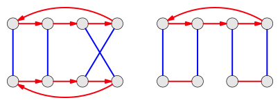
>
> (a) Does each diagram meet all the criteria that were your answers to Exercises 2.14 through 2.17?

+++

- There's a predefined list of 2 generators (red and blue, which we'll call $a$ and $b$).
- Every action can be undone in one way or another. Every generator comes into every node, so it can in theory be followed backwards assuming inverses.
- There's no sense of probability or chance in the actions.
- The two generators are available coming out of every node.

+++

> (b) Try to convert each of these diagrams into a multiplication table. What problem arises in each case?

+++

How should we choose what element to label $e$ in the diagrams above, and on unlabeled Cayley diagrams in general? There's no rule regarding which element to label as the identity, so ultimately this must be an arbitrary choice. In this sense a group has no "bottom" on which all other elements rest, because with a different selection the labels would have all ended up different but you'd still have the "same" group (really, an isomorphic group). Let's put $e$ in the top left (reading order) and see what we come up with for both diagrams:

+++

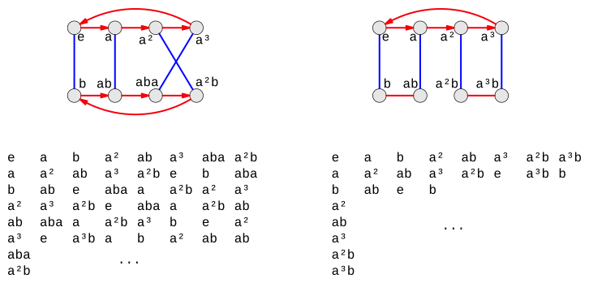

+++

In both these examples we run into an issue with the same element appearing twice on one row:

+++

$$
\begin{align}
(a³)(aba) &= (a³)(a²b) = ab \\
(b)(e)    &= (b)(a²)   = b
\end{align}
$$

+++

As discussed in Exercise 4.15 this implies we've made an incorrect assumption somewhere. If we assume we have inverses and associativity, then we'll find that we don't have distinct elements:

+++

$$
\begin{align}
(a)(a³)(aba) &= (a)(a³)(a²b) = (a)ab \\
aba          &= a²b          = a²b
\end{align}
$$

$$
\begin{align}
(b)(b)(e)    &= (b)(b)(a²) = (b)b \\
e            &= a²         = e \\
\end{align}
$$

+++

Since actions are equivalent to elements, another way to put this is that we don't have distinct actions. That is, what $e$ does (as an action) is sometimes the same as what $a²$ does (as an action) and sometimes not. That is, in some places in the second diagram we have $a²$ acting as an identity, and in other places (namely, starting from $e$) it doesn't.

+++

> (c) Can you explain what is wrong with these diagrams that caused the problems you encountered in part (b)?

+++

In short, these diagrams are not symmetrical. We should be able to put $e$ on any node in the diagram and get the same list of actions. Consider for example the [Symmetric group S₃](https://en.wikipedia.org/wiki/Dihedral_group_of_order_6), another version of which you can find in [Cayley Diagram for S³](https://nathancarter.github.io/group-explorer/CayleyDiagram.html?groupURL=https://nathancarter.github.io/group-explorer/groups/S_3.group). With the second version's generators, notice that $frf = r^2 = r^{-1}$ no matter where you start from, i.e. where you put $e$. With the first version's generators, you should similarly see that it's always the case that $aba = bab$.

+++

Another way to put this is that what actions are equivalent should not be stateful i.e. depend on your current location on the map. If you discover that $ab = ba$ in one part of a diagram (i.e. with a particular selection of $e$), it should also be the case that $ab = ba$ in another part of the diagram (i.e. with another selection of $e$). If we call the node representing the second selection of $e$ something like $c$, then we're saying it should be the case that $cab = cba$. That is, we should be able to left-multiply and get another true statement.

+++

It may help to rely on your sense of symmetry to quickly show that a particular diagram does not represent group. For example, we can see that moving $e$ down to $b$ in the left example won't help show that $ab ≠ ba$ because the diagram has reflectional symmetry in that direction. If we instead move $e$ to $a$ then we'll be able to show that $ab ≠ ba$ starting from that new position.

+++

> (d) Create another diagram satisfying the criteria of Exercises 2.14 through Exercises 2.17, yet having the same problem as the two diagrams above.

+++

Although we informally specified that groups that are "non-symmetrical" will fail to satisfy all the axioms of the group, it's not hard to accidentally draw what is really a group in a non-symmetrical way. Consider the following example; the non-symmetrical Cayley diagram on the left is actually hiding $Z_4$:

+++

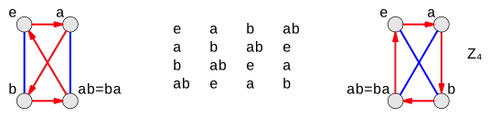

+++

If we allow self-loops (i.e. competing identities) then we can create a rather minimal example of a Cayley diagram satisyfing the 4 action-based requirements that also does not represent a group:

+++

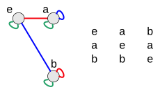

+++

We show the action of $e$ on all the nodes for completeness (in green). We clearly have that $ae = ab$, which assuming inverses implies $e = b$ (a competing identity). In fact this equation is not universal in the diagram; starting from $e$ we have that $e ≠ b$.

+++

An arguably more interesting example without self-loops:

+++

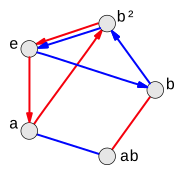

+++

> This exercise shows a slight discrepancy between the actions-based definition of group (Definition 1.9, illustrated using Cayley diagrams) and my algebraic one (Definition 4.2, illustrated using multiplication tables). This discrepancy will be cleared up in Section 6.1.

+++ {"jp-MarkdownHeadingCollapsed": true}

### Exercise 4.18 (⚠, 📑)

+++

The errata suggests working on 4.18 before 4.17:

+++

> These exercises should be in the other order, since 4.18 asks you why there is only one identity element in a group, and the answer to 4.17 requires you to use the fact that there is only one identity element in a group.

+++

> When creating a multiplication table for a group, if you try to include two different identity elements, what goes wrong? What does this lead you to conclude about groups?

+++

If you have two columns that are both for identity elements $e$ and $f$, then in every row you'll repeat the elements in those two columns. For example, in the row for $a$ you'll have entries for $ae$ and $af$, which will both be equal $a$. If $ae = af$ then $e = f$ given invertibility.

+++

The author's answer:

> It leads you to conclude that a group can have only one identity element.

+++ {"jp-MarkdownHeadingCollapsed": true}

### Exercise 4.17 (⚠, 📑)

+++

> Explain why a Cayley diagram must be connected. That is, why must there be a path from every node to every other node?

+++

There should be at least one path to every node $a$ from the starting node, or the node $a$ wouldn't be a part of the group. If there's a path from the starting node to every node $a$ then one could also take the inverse $a^{-1}$ to get back to the starting node and then to any other node $b$.

+++

The author's answer:

> Hint: It may help to consider a specific example. Why can the following two-piece diagram not be viewed as one Cayley diagram for an eight-element group? Which part of Definition 4.2 would be violated?
>
> 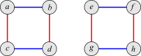
>
> (Note that you could add arrows to make it a Cayley diagram, but as is, it is not one.)

+++

Consider part `3.` of the definition, which requires that $eg = g$ for every element in the group. One can read this as saying that every element is both an action and an element; it's an action that takes the current state (system state, i.e. the argument to $g$) from the starting node $e$ to the named node (element) $g$. If we take $a$ as the identity element in the Cayley diagram above, there's no action to get to e.g. $f$ (so it's only an element, not an action that's always available). We interpret "action" to mean an active transformation in the sense of [Active and passive transformation](https://en.wikipedia.org/wiki/Active_and_passive_transformation).

This makes "travel" in a Cayley diagram for a group easy if you know the name of where you want to go relative to the starting point; you can always take the inverse of your current location and then the action $g$ to get to the node $g$.

+++

## 4.5.4 Small groups

+++ {"jp-MarkdownHeadingCollapsed": true}

### Exercise 4.19

+++

> Complete each of the following multiplication tables so that it depicts a group. There is only one way to do so, if we require that 0 be the identity element in
each table. Then search Group Explorer's group library to determine the names for the groups the tables represent.

```{code-cell} ipython3
pd.DataFrame([
    [0, 1],
    [1, 0],
], index=[0, 1], columns=[0, 1])
```

See [Group Explorer · Z₂](https://nathancarter.github.io/group-explorer/GroupInfo.html?groupURL=https://nathancarter.github.io/group-explorer/groups/Z_2.group).

```{code-cell} ipython3
pd.DataFrame([
    [0, 1, 2],
    [1, 2, 0],
    [2, 0, 1],
], index=[0, 1, 2], columns=[0, 1, 2])
```

See [Group Explorer · Z₃](https://nathancarter.github.io/group-explorer/GroupInfo.html?groupURL=https://nathancarter.github.io/group-explorer/groups/Z_3.group).

```{code-cell} ipython3
pd.DataFrame([
    [0],
], index=[0], columns=[0])
```

See [Group Explorer · Z₁](https://nathancarter.github.io/group-explorer/GroupInfo.html?groupURL=https://nathancarter.github.io/group-explorer/groups/Trivial.group).

```{code-cell} ipython3
pd.DataFrame([
    [0, 1, 2, 3],
    [1, 2, 3, 0],
    [2, 3, 0, 1],
    [3, 0, 1, 2],
], index=[0, 1, 2, 3], columns=[0, 1, 2, 3])
```

See [Group Explorer · Z₄](https://nathancarter.github.io/group-explorer/GroupInfo.html?groupURL=https://nathancarter.github.io/group-explorer/groups/Z_4.group).

```{code-cell} ipython3
pd.DataFrame([
    [0, 1, 2, 3],
    [1, 3, 0, 2],
    [2, 0, 3, 1],
    [3, 2, 1, 0],
], index=[0, 1, 2, 3], columns=[0, 1, 2, 3])
```

See [Group Explorer · Z₄](https://nathancarter.github.io/group-explorer/GroupInfo.html?groupURL=https://nathancarter.github.io/group-explorer/groups/Z_4.group) with:
- $0 = e$
- $1 = a$
- $3 = a²$
- $2 = a³$

Shift-click on columns in Group Explorer to move them and make the multiplication tables match.

+++

The author's answer:

> Hint: For this exercise and those that follow it, use the fact from Exercise 4.15 liberally.

+++ {"jp-MarkdownHeadingCollapsed": true}

### Exercise 4.20

+++

The following table can be completed in more than one way, and still have the result depict a group. Find all possible such completions of the table, again using 0 as the identity element. How many did you find? Search Group Explorer's group library to determine the names for the groups each of your resulting tables represents.

```{code-cell} ipython3
pd.DataFrame([
    [0, 1, 2, 3],
    [1, 0, 3, 2],
    [2, 3, 0, 1],
    [3, 2, 1, 0],
], index=[0, 1, 2, 3], columns=[0, 1, 2, 3])
```

See [Group Explorer · V₄](https://nathancarter.github.io/group-explorer/GroupInfo.html?groupURL=https://nathancarter.github.io/group-explorer/groups/V_4.group) with:
- $0 = e$
- $1 = h$
- $3 = v$
- $2 = hv$

```{code-cell} ipython3
pd.DataFrame([
    [0, 1, 2, 3],
    [1, 0, 3, 2],
    [2, 3, 1, 0],
    [3, 2, 0, 1],
], index=[0, 1, 2, 3], columns=[0, 1, 2, 3])
```

See [Group Explorer · Z₄](https://nathancarter.github.io/group-explorer/GroupInfo.html?groupURL=https://nathancarter.github.io/group-explorer/groups/Z_4.group) with:
- $0 = e$
- $1 = a²$
- $2 = a$
- $3 = a³$

+++ {"jp-MarkdownHeadingCollapsed": true}

### Exercise 4.21

+++

> From Exercise 4.19 part (a) you can conclude that there is only one pattern for a group containing two elements. This is because the only difference between the multiplication table you computed and that of any other group with two elements will be the names of those elements. So the pattern of interactions among elements (or colors if we were to color the cells of the table) would be no different.
> (a) How many patterns are there for groups containing three elements?

One, for the same reasons.

> (b) Containing one element?

One, for the same reasons.

> (c) Containing four elements?

Two, based on the last two parts of Exercise 4.19 and Exercise 4.20.

> Chapter 9 attacks the general question, "How many groups there are with n elements?"

+++ {"jp-MarkdownHeadingCollapsed": true}

## 4.5.5 Table patterns

+++

> These exercises preview Section 5.2, about an important family of groups called the abelian groups.

+++ {"jp-MarkdownHeadingCollapsed": true}

### Exercise 4.22 (📑)

+++

> We saw earlier in this chapter that in the group $V_4$, the equation $RB = BR$ is true. In fact, for any two elements $a, b ∈ V_4$, the equation $ab = ba$ is true. That is, the order in which you combine elements does not matter. Consider each group whose multiplication table appears in Figure 4.7 (except $A_5$, whose details are too small to see). For which of those groups does the order of combining elements matter?

+++

The symmetric group $S_3$ and the quasihedral group with 16 elements.

+++

The author's answer:

> Order matters in $S_3$, and the two groups shown in the bottom row, but order does not matter in the other three groups shown in that figure.

+++ {"jp-MarkdownHeadingCollapsed": true}

### Exercise 4.23 (📑)

+++

> Groups in which the order of multiplication of elements does not matter are called commutative or abelian. Look through the groups in Group Explorer's group library, starting with the smallest, until you find one that is noncommutative. What is the name of the smallest noncommutative group?

+++

The symmetric group $S_3$.

+++ {"jp-MarkdownHeadingCollapsed": true}

### Exercise 4.24 (📑)

+++

> What visual pattern do the multiplication tables of commutative groups exhibit?

+++

The colors reflect across the diagonal.

+++

## 4.5.6 Algebra

+++ {"jp-MarkdownHeadingCollapsed": true}

### Exercise 4.25

+++

> To go along with the other algebraic notation we've seen in this chapter, there is also an algebraic notation for generators. For instance, the group $C_5$, which appears in the first few exercises of this chapter, is generated by the element $a$. The standard notation for this is $C_5 = 〈a〉$. The 〈a〉 means "what you can generate from a," and so the equation $C_5 = 〈a〉$ is saying $C_5$ is the group generated from a." From Figure 4.3, we can write $V_4 = 〈R, B〉$, saying that $R$ and $B$ together generate $V_4$.
>
> Show your understanding of this new notation by filling in the blanks below using however many elements are necessary to generate the group. Use as few elements as possible.
>
> (a) From the Cayley diagram in Exercise 4.4, we see that $Q_4 = 〈 \underline{ } 〉$

+++

$Q_4 = 〈i,j〉$

+++

> (b) From the Cayley diagram in part (c) of Exercise 4.6, we see that $A_4 = 〈\underline{ }〉$.

+++

$A_4 = 〈 a,x 〉$

+++

> (c) There is more than one way to generate most groups. Find a different (yet still correct) answer to each of the previous two questions.

+++

$Q_4 = 〈i,k〉$ because $k = ji$ so that $j = ki^{-1}$.

+++

$A_4 = 〈 a²,x 〉$ because $a² = aa$ so that $a = a²a^{-1}$.

+++

### Exercise 4.26 (⚠, 📑)

+++

> Use the multiplication tables you constructed in Exercise 4.6 to determine the inverses for each element of each of the three groups from that problem.
>
> (a) In the cyclic group $C_5$, the inverses are:

+++

$$
\begin{align}
e^{-1} &= e \\
a^{-1} &= a⁴ \\
(a^2)^{-1} &= a³ \\
(a^3)^{-1} &= a² \\
(a^4)^{-1} &= a \\
\end{align}
$$

+++

> (b) In the quaternion group $Q_4$, the inverses are:

+++

See the multiplication table in [Quaternion group](https://en.wikipedia.org/wiki/Quaternion_group), where what the author calls $Q_4$ is called $Q_8$.

+++

$$
\begin{align}
1^{-1} &= e \\
(-1)^{-1} &= -1 \\
i^{-1} &= -i \\
(-i)^{-1} &= i \\
j^{-1} &= -j \\
(-j)^{-1} &= j \\
k^{-1} &= -k \\
(-k)^{-1} &= k \\
\end{align}
$$

+++

> (c) In the alternating group $A_4$, the inverses are:

+++

Skipping; this answer would be straightforward but time-consuming.

+++

> (d) In general, how do you use a multiplication table to find an element's inverse?

+++

You take the name of the column where the element's value is $e$. In a Cayley diagram, you follow the associated inverse arrow(s) in the reverse order (e.g. the inverse of $fr$ is $r^{-1}f^{-1}$).

+++

### Exercise 4.27 (📑)

+++

> Inverses can be used to solve equations. In the group $C_5$, to solve $a²x = a$ for x, I can proceed as in high school algebra:
>
> $$
\begin{align}
a²x &= a \\
(a²)^{-1}a²x &= (a²)^{-1}a \\
x &= (a²)^{-1}a \\
x &= a^4
\end{align}
$$
>
> Computing $(a²)^{-1}a$ in $C_5$ gives $x = a^4$.
>
> Try solving each of these equations in $C_5$.
>
> (a) $a^3 x = a^2$

+++

$$
\begin{align}
a³x &= a² \\
(a³)^{-1}a³x &= (a³)^{-1}a² \\
x &= a^{-1} = a⁴ \\
\end{align}
$$

+++

> (b) $a^4 a^2 x = a$

+++

$$
\begin{align}
a^4 a^2 x &= a \\
x &= e
\end{align}
$$

+++

> (c) $a x (a^3)^{-1} = e$

+++

$$
\begin{align}
a x (a^3)^{-1} &= e \\
x &= a²
\end{align}
$$

+++

### Exercise 4.28 (⚠)

+++

> (a) If I have the equation $a^2 x (a^2)^{-1} = a$ to solve as in the previous exercise, can I cancel the $a²$ and the $(a^2)^{-1}$? Why or why not? (Hint: Is the result you get by canceling actually a solution to the equation?)

+++

Yes, because the group is abelian.

+++

> (b) If I have a similar equation, but in the group $Q_4$ from Exercise 4.6, $ixi^{-1} = j$, can I cancel the $i$ and $i^{-1}$? Why or why not?

+++

No, because the group is not abelian.

+++

> (c) Your answers to parts (a) and (b) should be different. What makes them different? Hint: Apply what you learned from the exercises in Section 4.5.5.

+++

From the errata:

> The exercise attempts to show a difference between abelian and nonabelian groups, but fails in the following way. In part (a), one can cancel a² and (a²)⁻¹ despite the x between them because the group C₅ is abelian; this part of the exercise is correct. In part (b), the group is Q₄, a nonabelian group, and in general it is not acceptable in nonabelian groups to rearrange elements to permit cancelling. However, in this case, the example chosen was a poor example, because the solution to part (b) is x = j, which one could obtain by naively canceling the i and i⁻¹. Although this strategy does not work in every nonabelian example, it works in this one.
>
> A correct version of the exercise would use a different example for part (b), such as the equation a² x (a²)⁻¹ = d in the group A₄ from page 54. The solution would be x = b, which we would not get through naive cancelling. If we attempted to cancel the a² with (a²)⁻¹, we would find x = d instead, which is incorrect.

+++

### Exercise 4.29 (⚠)

+++

Premultiply by b₁'s inverse and postmultiply by a₂'s inverse.

+++

### Exercise 4.30 (⚠)

+++

> Solve these equations for t.
> (a) In Q₄, $jitk⁻¹ = -kj$

$i⁻¹j⁻¹jitk⁻¹k = i⁻¹j⁻¹(-k)jk = t = (-i)(-j)(-k)jk = (-k)(-k)(-i) = i$

> (b) In A₄, $t(b₂)² = xyz$

Skipping because these symbols don't match the A₄ symbols; see errata.

> (c) In S₃, $rtf = e$

$$
\begin{align}
r⁻¹ &= r² \\
f⁻¹ &= f \\
rtf &= e \\
r⁻¹rtff⁻¹ &= r⁻¹ef⁻¹ = t = r²ef = fr
\end{align}
$$

+++

### Exercise 4.31

+++

> Let's say you have a group G with identity element e. Take any three elements a, b, and c in G.
>
> (a) What does the equation ab = e say about the relationship between a and b?

+++

It implies they are inverses of one another.

+++

> (b) If both ab = e and ac = e, can you use algebra to show that b = c?

+++

We have ab = ac = e from the two equations. Premultiply by the inverse of a to show this implies b = c.

+++

> (c) Can an element in a group have two different inverses?

+++

No

+++

### Exercise 4.32 (📑)

+++

> The set of integers (all positive and negative whole numbers, and zero) is often written as ℤ. Use Definition 4.2 to answer each of the following questions about ℤ.
>
> (a) Is it a group using ordinary addition as the operation?

+++

Yes: It's closed, associative, has an identity element (0), and every element has an inverse.

+++

> (b) Is it a group using ordinary multiplication as the operation?

+++

No: Assume an identity element of 1. Every element does not have an inverse. For example,
3 does not have an inverse (you'd need to use 1/3 which is a rational).

+++

> (c) Are the even integers a group using ordinary addition as the operation?

+++

Yes, still using 0 as the identity element.

+++

> (d) The even integers are sometimes written 2ℤ, because they can be obtained by multiplying every integer by 2. If we think of 3ℤ, 4ℤ, and in general any nℤ in the same way, for what integers n is the set nℤ a group using ordinary addition as the operation?

+++

Any integer n should still describe a group.

+++

### Exercise 4.33 (📑)

+++

> The rational numbers (often written ℚ) are the set of fractions $\frac{a}{b}$, where a and b are integers (but b ≠ 0). For example, $\frac{1}{2}$, $\frac{-6}{11}$, and $\frac{50}{3}$ are all rational. Any integer, including zero, is rational, because you can just divide it by 1. For example, 10 is the rational number $\frac{10}{1}$.
>
> Use Definition 4.2 to answer each of the following questions about ℚ.
>
> (a) Is it a group using ordinary addition as the operation?

+++

Yes: It's closed, associative, has an identity element (0), and every element has an inverse.

+++

> (b) Is it a group using ordinary multiplication as the operation?

+++

Almost: It's closed, associative, has an identity element (1), and almost every element has an
inverse (the reciprocal). Zero does not have a reciprocal.

+++

> (c) Call ℚ⁺ the positive rational numbers (only those greater than zero). Is ℚ⁺ a group under
ordinary addition?

+++

No, it doesn't have an identity element.

+++

> (d) Is ℚ⁺ a group under ordinary multiplication?

+++

Yes: It's closed, associative, has an identity element (1), and every element has an
inverse (the reciprocal).

+++

> (e) Call ℚ* the nonzero rational numbers (all positive and negative ones, only leaving out
zero). Is ℚ* a group under ordinary addition?

+++

No, it doesn't have an identity element.

+++

> (f) Is ℚ* a group under ordinary multiplication?

+++

Yes: It's closed, associative, has an identity element (1), and every element has an inverse
(the reciprocal).

+++

> (g) Why are groups like ℚ, ℚ⁺, and ℚ* difficult to visualize using multiplication tables and Cayley diagrams?

+++

It's hard to know what part of them to show since they're infinite in two directions, both the numerator and the denominator. Besides that, they have have "holes" for irrational numbers like π (see [Compact space](https://en.wikipedia.org/wiki/Compact_space)) which will not be consistent or symmetric (will appear almost random).
