---
jupytext:
  text_representation:
    extension: .md
    format_name: myst
    format_version: 0.13
    jupytext_version: 1.16.1
kernelspec:
  display_name: Python 3 (ipykernel)
  language: python
  name: python3
---

# 5.5 Exercises

+++

## 5.5.1 Basics

+++

### Exercise 5.1

+++

> If a group is generated by just one element, what kind of group is it?

+++

A cyclic group.

+++

A similar, also interesting question: If a group contains one element, what kind of group is it? This is often called the trivial group. It is:
- Cyclic because applying the single action leads you back to the same location.
- Abelian because the multiplication table is symmetric along the diagonal and it doesn't order what matter you perform actions in.
- Symmetric because it corresponds to all permutations of size one.

It would probably not be called:
- Dihedral because it doesn't have a flipping action.
- Alternating because it's not possible to take even permutations of a single element.

+++

### Exercise 5.2

+++

> (a) In the group $C_5$, compute 2 + 2.

4

> (b) In the group $C_5$, compute 4 + 3.

2

> (c) In the group $C_10$, compute 8 + 7.

5

> (d) In the group $C_10$, compute 9 + 1.

0

> (e) In the group $C_3$, compute 2 + 2 + 2 + 2 + 2 + 2.

0

> (f) In the group $C_11$, compute 10 - 8 + 1 - 7 + 6 + 5.

7

+++

### Exercise 5.3

+++

> For each statement below, determine if it is true or false.
> (a) Every cyclic group is abelian.

True

> (b) Every abelian group is cyclic.

False

> (c) Every dihedral group is abelian.

False (D₃)

> (d) Some cyclic groups are dihedral.

True (C₂ = D₂)

> (e) There is a cyclic group of order 100.

True ($C_{100}$)

> (f) There is a symmetric group of order 100.

False (symmetric groups are all of order $n!$)

> (g) If some pair of elements in a group commute, the group is abelian.

False

> (h) If every pair of elements in a group commute, the group is cyclic.

False

> (i) If the pattern on the left of Figure 5.8 appears nowhere in the Cayley diagram for a group, then the group is abelian.

True. If it's never the case that $ab ≠ ba$, then $ab = ba$ assuming $a$ and $b$ are the only group elements. In a Cayley diagram we should be able to see all group elements and so if $a$ and $b$ (and perhaps $c$) are enough to generate every element in an abelian way, then the products of other elements can also be expressed in an abelian way from those generators.

+++

### Exercise 5.4

+++

> (a) Use the Cayley diagram of the group $D_5$ in Figure 5.17 to compute $r · f · r$ in that group.

$f$

> (b) Is the answer the same or different if you do the computation in the group $D_3$ instead?

The same.

> (c) Is the answer the same or different if you do the computation in the group $D_n$ instead?

The same.

> (d) In this chapter, I introduced $D_n$ as a group satisfying $frf = r^{-1}$. Use that equation to prove your answer to part (c).

$$
\begin{align}
frf &= r^{-1} \\
ffrfr &= fr^{-1}r \\
rfr &= f
\end{align}
$$

+++

### Exercise 5.5

+++

> Compare the strengths and weaknesses of the three visualization techniques introduced in this book: Cayley diagrams, multiplication tables, and cycle graphs.

Cayley diagrams are small and succinct because they usually include only a minimal set of generators, but are incomplete relative to multiplication tables. Cayley diagrams are not unique to a group, but multiplication tables can be if you arrange the columns consistently (multiplication tables can be used to show groups are isomorphic). Multiplication tables take the most work to generate.

Cycle graphs express groups in terms of simpler cyclic groups, but are not unique (see [Cycle graph (algebra) § Non-uniqueness](https://en.wikipedia.org/wiki/Cycle_graph_(algebra)#Non-uniqueness)). Like Cayley diagrams and multiplication tables, they often rely on colors (and humans can only distinguish a dozen or so colors):

> There can be ambiguity when two cycles share a non-identity element. For example, the 8-element [quaternion group](https://en.wikipedia.org/wiki/Quaternion_group "Quaternion group") has cycle graph shown at right. Each of the elements in the middle row when multiplied by itself gives -1 (where 1 is the identity element). In this case we may use different colors to keep track of the cycles, although symmetry considerations will work as well.
>
> 

+++

## 5.5.2 Understanding the families

+++

### Exercise 5.6 (📑)

+++

> Sketch the following visualizations.
>
> (a) a cycle graph for $C_9$

+++

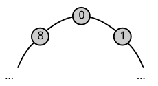

+++

> (b) a Cayley diagram for $D_4$

+++


+++

> (c) a multiplication table for $D_2$

```{code-cell} ipython3
import pandas as pd

pd.DataFrame([
    ['e' , 'r' , 'f' , 'rf'],
    ['r' , 'e' , 'rf', 'f' ],
    ['f' , 'rf', 'e' , 'r' ],
    ['rf', 'f' , 'r' , 'e' ],
], index=['e', 'r', 'f', 'rf'], columns=['e', 'r', 'f', 'rf'])
```

### Exercise 5.7

+++

> Describe in words what each of the following visualizations looks like for $C_{999}$.
>
> (a) Cayley diagram

A large circle of 999 nodes numbered 0 to 998, with one-sided arrows connecting them.

> (b) multiplication table

A table with 0 to 998 as both column and row headers. If it was colored, it would show a rainbow pattern from 0 to the antidiagonal and then the same pattern from one past the antidiagonal to the end of the matrix.

> (c) cycle graph

A large circle of 999 nodes numbered 0 to 998, with lines connecting them.

+++

### Exercise 5.8

+++

> Describe in words what each of the following visualizations looks like for $D_{999}$.
>
> (a) Cayley diagram

Two circles with arrows connecting them, with one at an inset inside the other. Red arrows connect the nodes (999 of them) inside the circles in the opposite direction the 999 nodes in the outside circle are connected by red arrows. A blue arrow connects each of the 999 inner nodes to one of the 999 outer nodes.

> (b) multiplication table

The multiplication table with be divisible into four quadrants, the top left and bottom right quadrants representing "non-flip" scenarios and including the same colors associated with those underlying set elements. Each will be of size
999 x 999. Quadrants of the same size representing flip scenarios will be in the top right and bottom left quadrants.

> (c) cycle graph

The cycle graph will have one large cycle/orbit representing the loop (typically outer) in the Cayley diagram that is connected to the identity element. The elements in the inner loop in the Cayley diagram will be represented as 999 two-node
cycles/orbits connected to the identity element.

+++

### Exercise 5.9 (📑)

+++

> What are the orders of the first ten symmetric groups, S₁ through S₁₀? What are the orders of their corresponding alternating groups, A₁ through A₁₀? Explain your answer for the order of A₁.

The order of symmetric group $Sₙ$ is $n!$ which generally speaking means the size increases quickly.

The order of the alternating groups will be exactly half the size of the corresponding symmetric group. It's hard to say whether A₁ should be considered an alternating group; [Alternating group](https://en.wikipedia.org/wiki/Alternating_group) does not allow it.

If we were to allow it and define it as the square of the single element in $S₁$ then it would be the same size as $S₁$ (order 1, the trivial group). We'd get the same answer if we defined it as the even permutations of order one (the only permutation is trivially even).

The author's answer:

> If we view $A_n$ as all the squares of elements from $S_n$, then squaring the one permutation in $S_1$, the identity, gives back that same permutation. Therefore $A_1 = S_1$ and so the order of both is 1.

+++

### Exercise 5.10

+++

> The exercises for Chapter 3 asked you to create several Cayley diagrams. This chapter introduced a method for telling whether a group is abelian based on its Cayley diagram.
>
> For each of the Chapter 3 exercises mentioned below, first determine whether each Cayley diagram from that exercise represents an abelian group. Then determine whether the group belongs to any of the five families introduced in this chapter, and if so, what
the group's name is (e.g., D₄, S₃, etc.). Explain how you determine each of your answers.
>
> (a) Exercise 3.5

Klein 4 group (V₄). Abelian because the Cayley diagam is a single diamond. Not cyclic, but isomorphic to D₂. No symmetric or alternating group is of order 4.

> (b) Exercise 3.6

D₄ is not abelian; it is the example the text goes over to test commutativity from a
Cayley diagram. No symmetric or alternating group is of order 8.

> (c) Exercise 3.7

D₆ is not abelian for the same reason D₄ isn't and any dihedral group isn't. That is,
you can find an example in the Cayley diagram around the identity element that isn't
abelian: rf ≠ fr. No symmetric group is of order 12. The alternating group A₄ of order
12 is not isomorphic, based on comparing cycle graphs.

> (d) Exercise 3.8

D₅ is not abelian for the same reason any dihedral group isn't. No symmetric or
alternating group is of order 10.

> (e) Exercise 3.11

The p1, p11g, and p11m are abelian. See [Frieze group § Descriptions of the seven frieze groups](https://en.wikipedia.org/wiki/Frieze_group#Descriptions_of_the_seven_frieze_groups) for which groups are dihedral and cyclic; none are symmetric.

> (f) Exercise 3.13

C₄, abelian. No symmetric or alternating group is of order 4.

> (g) Exercise 3.14

C₂, abelian. Isomorphic to S₂. No alternating group exists of order 2.

> (h) Exercise 3.16

D₄, see comments above.

+++

### Exercise 5.11

+++

> Explain why every cyclic group is abelian.

The cyclic groups are abelian because they only have one action; you need two actions to
be able to do them in different orders and get different results.

+++

### Exercise 5.12

+++

> Why is it sufficient, when looking to see if a Cayley diagram represents an abelian group, to only consider the arrows? Why do we not need to examine every possible combination of paths?

Commutativity is a binary operation that would only take the generators as arguments, not arbitrary actions. That is, we only need to show the following equation holds assuming generators f and r:

$$
fr = rf
$$

If we can prove commutativity on the generators, it should be trivial to go through the other actions and prove they can commute with each other as well because the other actions will be built from the generators.

+++

### Exercise 5.13

+++

> (a) Create a cycle graph for the group V₄ using the multiplication table in Figure 5.31.

+++

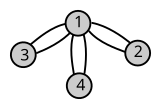

+++

> (b) Create a cycle graph for the group A₄ using the Cayley diagram in Exercise 4.6 part (c).

+++

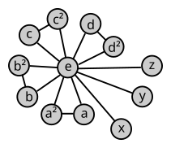

+++

### Exercise 5.14

+++

> (a) Is there a dihedral group of order 7?

No, there are only even-numbered dihedral groups.

> (b) If Aₙ has order 2520, what is n?

2520*2 = 5040 = 7! so n = 7.

> (c) If Aₙ has order m, what order does Sₙ have?

2m

+++

### Exercise 5.15

+++

> For each part below, compute the orbit of the element in the group. Your answer will be a list of elements from the group that ends with the identity. (a) The element r² in the group D₁₀

{r², r⁴, r⁶, r⁸, e}

> (b) The element 10 in the group C₁₆

{10, 4, 14, 8, 2, 12, 6, 0}

> (c) The element 25 in the group C₃₀

{25, 20, 15, 10, 5, 0}

> (d) The element 12 in the group C₄₂

{12, 24, 36, 6, 18, 30, 0}

> (e) The element s in the group whose Cayley diagram is on the left below. (Assume the element a at the top left is the identity.)

{s, m, j, a}

> (f) The element l in the group whose Cayley diagram is on the right below. (Assume the element a at the top is the identity.)

{l, e, p, a}

+++

### Exercise 5.16

+++

> Recall the notation for generators from Exercise 4.25. Use it to fill in the blanks below with however many elements are necessary to generate the group. Use as few elements as possible.

(a) Cₙ = ⟨1⟩

(b) Dₙ = ⟨f, r⟩

+++

## 5.5.3 Small examples

+++

### Exercise 5.17

+++

> Create multiplication tables for the smallest dihedral groups D₁, D₂, D₃, and so on, until you find the first non-abelian member of the family. Which is it, and how can you tell?

For n=1 and n=2, the geometric description of the dihedral groups does not make sense; there are no regular polygons with one and two sides. See [Dihedral group - Groupprops](https://groupprops.subwiki.org/wiki/Dihedral_group).

We can use the group presentation from that page or the definitions on [Dihedral group](https://en.wikipedia.org/wiki/Dihedral_group) to learn about D₁ and D₂.

D₃ is the first non-abelian group because the multiplication table is not symmetric along the diagonal.

+++

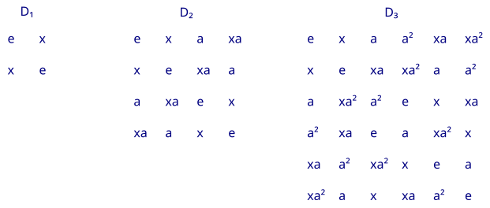

+++

### Exercise 5.18

+++

> Repeat Exercise 5.17 for the symmetric groups $S_n$. Use the permutation notation from this chapter.

The question recommends the book's permutation notation, but we'll prefer cycle notation to avoid a lot of arrows.

S₃ is the first non-abelian group because the multiplication table is not symmetric along the diagonal.

+++

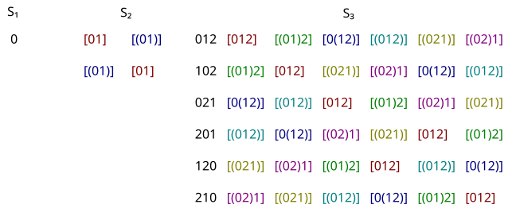

+++

### Exercise 5.19

+++

> For each symmetric group whose multiplication table you created in Exercise 5.18, compute the elements of the corresponding alternating group, as in Figure 5.25. For each alternating group you compute, create: \
> (a) a multiplication table, \
> (b) a Cayley diagram, and \
> (c) a cycle graph.

+++

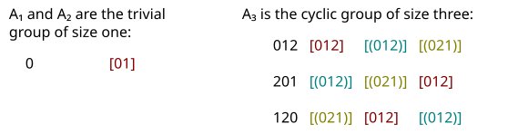

+++

Skipping the Cayley and cycle diagrams because they're not hard to draw and are available elsewhere.

+++

### Exercise 5.20 (📑)

+++

> What other groups belong to more than one of the families we studied in this chapter? (Another way to read this question is, "Are there any groups in one of the families Cₙ, Dₙ, Sₙ, and Aₙ that are isomorphic to a group in another of those families?")

One way to think about this would be to consider the order of the groups for all n and see if sizes line up. If they line up, ask if they're the same.

Cₙ: 1, 2, 3, 4, 5, ... \
Dₙ: 2, 4, 6, 8, 10, ... \
Sₙ: 1, 2, 6, 24, 120, ... \
Aₙ: 1, 1, 3, 12, 60, ...

For orders 1, 2, and 3 all the groups are the same because there is only one way to
build a group of these sizes. The order 4 cyclic group is not isomorphic to the order 4
dihedral group. There is only a cyclic group of order 5. The order 6 dihedral and
symmetric groups are isomorphic. Beyond that, no groups are isomorphic.

+++

### Exercise 5.21

+++

> For each of the following questions, either exhibit a group that answers the question in the affirmative or give a clear explanation of why the answer to the question is negative.
>
> (a) Is there a cyclic group with exactly four generators? (Not that it takes four elements to generate the group, but that there are four different elements a, b, c, d in Cₙ and Cₙ = ⟨a⟩ = ⟨b⟩ = ⟨c⟩ = ⟨d⟩.) Is there more than one such group?

Let's say this group exists. Naturally one of the four generators will be the default single generator (typically called $r$). Each of the other three generators $g_m$ (with $m = 2, 3, 4$) will be a power of $r$. Call the power of each of the generators relative to the default generator $k_m$. Call the order of the cyclic group we are looking for $n$. A generator will stop generating actions the first time $t*k_m \mod{n} = 0$, having generated $t$ actions. Said another way, the generator will stop generating actions when 
$n$ divides (shares a common factor greater than one with) $t*k_m$. To ensure $t = n$ (and no less) we need $n*kₘ$ and $n$ to share no factors but $1$ and $n$. This requirement is equivalent to $n$ and $k_m$ being [Coprime integers](https://en.wikipedia.org/wiki/Coprime_integers).

If we let $n = 5$ (a prime number) then each of $\{1, 2, 3, 4\}$ are coprime with $5$.

If we let $n = 6$ then each of $\{2,3,4\}$ are *not* coprime with $6$ and hence we only have three generators $\{1,5\}$.

If we let $n = 7$ then each of $\{1,2,3,4,5,6\}$ are coprime with $7$ and we have too many generators.

If we let $n = 8$ (not a prime number) then each of $\{1, 3, 5, 7\}$ are coprime with $8$. If we let $n = 12$ (not a prime number) then each of $\{1, 5, 7, 11\}$ are coprime with $12$.

> (b) Is there a cyclic group with exactly one generator? Is there more than one?

The trivial group (of size one) has a single generator in the identity element. The cyclic group of size two has the single generator $r$; it can't be generated by the identity element.

+++

### Exercise 5.22

+++

> Open Group Explorer and sort the group library by order, with the smallest groups on top. Where in the list do you find the first group that's not in any of the families this chapter introduced? What is its name and size? How can you tell that it's not in any of the families you just learned?

At first glance it appears to be the Klein group V₄, but that is isomorphic to the order 4 dihedral group. The next that does not look familiar is the Quaternion group Q₄ of order 8, which is not isomorphic (based on the cycle graph) to D₄.

+++

## 5.5.4 Going a bit further

+++

### Exercise 5.23 (📑)

+++

> This chapter gave propellers and pinwheels as examples of objects whose symmetries are described by cyclic groups, that is, objects with rotational symmetry only. What other objects fit in this category?

Some molecules, galaxies, most car and bike wheels (thinking of the grooves in the tread), flowers, some friezes (infinite). Many 3D objects are symmetric across a single plane, such as a fish or a frying pan (cyclic group of size two).

The author's answer:

> Answers will vary; for instance, the blade on a blender, some windmills.

+++

### Exercise 5.24 (📑)

+++

> This chapter gave regular polygons as examples of objects whose symmetries are described by dihedral groups, that is, objects with both rotational and bilateral symmetry, but no other symmetries. What other objects fit in this category?

If you let $n$ go to infinity then an $n$-gon would become a circle. Some molecules. Some friezes (infinite). The extension of regular polygons into 3D, such as the shape sorter games where you try to fit e.g. "triangles" (actually a triangular prism) and "circles" (actually a cylinder) into holes. In general these shapes are called [Prism (geometry)](https://en.wikipedia.org/wiki/Prism_(geometry)).

+++

The author's answer:

> Answers will vary; for instance snowflakes and stars, like those shown on the left below, and truncated polygons, like those shown on the right below.
>
> 
>
> It is interesting to note that if we take $D_n$ to be the group of symmetries of the truncated $n$-gon, then it is natural to make $D_2$ a long, tall rectangle, which is appropriate.

+++

### Exercise 5.25

+++

> Analyze the symmetries of a tetrahedron using the technique from Definition 3.1, resulting in the Cayley diagram for its symmetry group.

+++

If you have trouble reading the author's drawings of which actions to use, see the left two drawings in following higher resolution and colored image. This image is tracked via [File:Symmetries of the tetrahedron.svg](https://commons.wikimedia.org/wiki/File:Symmetries_of_the_tetrahedron.svg), with a description in [Tetrahedron § Isometries of the regular tetrahedron](https://en.wikipedia.org/wiki/Tetrahedron#Isometries_of_the_regular_tetrahedron):

+++


+++

See [Tetrahedral symmetry](https://en.wikipedia.org/wiki/Tetrahedral_symmetry) and the drawing [File:Tetrahedral group 2.svg](https://en.wikipedia.org/wiki/File:Tetrahedral_group_2.svg). We'll annotate the latter with our own permutations:

+++

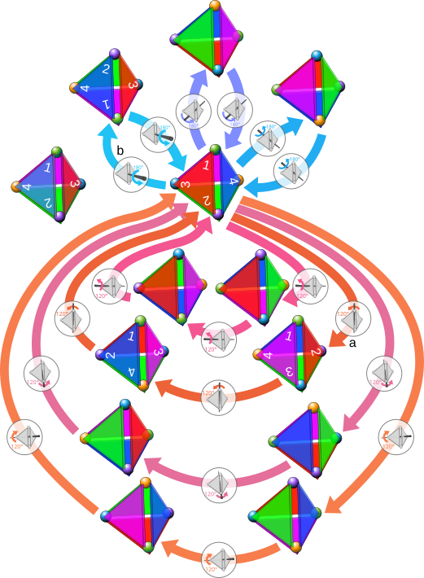

+++

In the Cayley diagram below, the first three numbers we use to label every state come from numbers on the face of the tetrahedron facing you (initially red), taken clockwise. The last number is on the back of the triangle:

+++

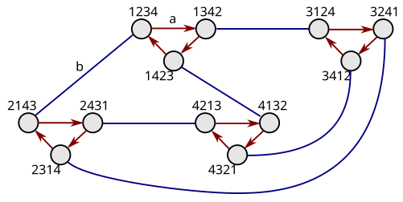

+++

### Exercise 5.26

+++

> As you know from the chapter, the symmetry group for the tetrahedron is A₄. We can think of it, as you saw in Exercise 5.25, as permuting four vertices. What physical features of the tetrahedron prevent its symmetry group from being all of S₄?

+++

Nothing really prevents us from introducing reflections and covering all of S₄. Notice the right drawing in [File:Symmetries of the tetrahedron.svg](https://commons.wikimedia.org/wiki/File:Symmetries_of_the_tetrahedron.svg), mentioned above. A reflection action like this one can lead to a "1243" state such as the following, not included in the Cayley diagram above:

+++

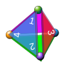

+++

When we identified the symmetry group of the equilateral triangle as D₃, we assumed that reflections were allowed (we did not allow them for the tetrahedron, initially). If we hadn't allowed them for the equilateral triangle, we would also gotten a smaller group (C₃).

+++

The language of "chiral tetrahedral symmetry" in [Tetrahedral symmetry](https://en.wikipedia.org/wiki/Tetrahedral_symmetry) for the group we did map out may be a bit confusing, because the tetrahedron is clearly not [chiral](https://en.wikipedia.org/wiki/Chirality). What's likely the intention of the language here is that we are treating (read "pretending") the tetrahedron is chiral by not allowing reflections.

+++

This contrasts with statements made elsewhere that define an object as being chiral when it has no reflection symmetries, such as in [Symmetry group](https://en.wikipedia.org/wiki/Symmetry_group):

> An object is [chiral](https://en.wikipedia.org/wiki/Chirality_(mathematics) "Chirality (mathematics)") when it has no [orientation](https://en.wikipedia.org/wiki/Orientation_(vector_space) "Orientation (vector space)")-reversing symmetries, so that its proper symmetry group is equal to its full symmetry group.

The same statement is made in [Point groups in three dimensions](https://en.wikipedia.org/wiki/Point_groups_in_three_dimensions):

> The rotation group of a bounded object is equal to its full symmetry group [if and only if](https://en.wikipedia.org/wiki/If_and_only_if "If and only if") the object is [chiral](https://en.wikipedia.org/wiki/Chirality_(mathematics) "Chirality (mathematics)").

+++

What these statements mean to get at is that, assuming reflections are allowed, a chiral object's group won't get larger by including them because the reflections of a chiral object won't be symmetries (the reflection of the object won't fill the same ambient space).

+++

What the author is likely getting at in this question is that we can't perform reflections with a physical tetrahedron.

+++

### Exercise 5.27

+++

> As you know from the chapter, S₃ and D₃ are two different names for the same group. Yet no larger dihedral group is also a symmetric group. Give an argument based on the physical features of an n-gon for why this is so (n ≥ 4).

All the dihedral groups provide two permutations: spin and flip. It turns out that two permutations are enough to cover all of S₃; there are only 6 possible 3-tuples. When you get to S₄ you suddenly need to cover 24 possible 4-tuples, more than the flip and spin permutations can cover (these two permutations are not generators of the group).

+++

### Exercise 5.28 (📑)

+++

> Section 5.2.3 describes what the cycle graph will look like for Cₚ x Cₚ if p is a prime number. Draw the cycle graph for C₅ x C₅. (It is not necessary to label the elements.)

We can expect 5x5 = 25 elements in this group. That is, the first and the second action in the 2-tuple that defines every product action will take on powers from 0 to 4. Based on section 5.2.3, we should have p+1 = 6 cycles with p = 5 elements in each. This is not a prediction of 6*5 = 30 elements; each of the 6 cycles will include the identity element so that it is counted an extra 6 - 1 = 5 times.

+++

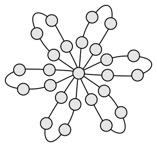

+++

### Exercise 5.29

+++

> Each part of this problem should help you answer the later parts.
>
> (a) Is it true that any a in Cₙ will generate the whole group, i.e., Cₙ = ⟨a⟩? Why or why not? If not, for which elements a in which groups Cₙ is it false?

See section 8.4 for an introduction to "relatively prime" numbers and an answer above involving coprime numbers.

Any power of r that is coprime to n will not generate the whole group. For example, r⁴ will not generate C₆ because 4 and 6 are coprime (they share the factor of 2).

+++

> (b) For how many different pairs $a, b$ in $D_3$ can you write $D_3 = ⟨a, b⟩$? What if I change the $D_3$ to $D_n$?

+++

$D_3$ has 6 actions; obviously no pair of the same two actions would act as a generator of the group given its non-trivial structure. Similarly, no pair with the identity element will generate the whole group. This leaves 5*4 = 20 remaining 2-tuples; since the order generators are listed doesn't matter this essentially comes down to 10 options (consider combinations rather than permutations).

We can partition these ten options into three groups. The first is pairs of generators
with both generators on the outside cycle (the same cycle as the identity element) in the
Cayley graph. There is one combination in this partition (⟨r, r²⟩) and it can't generate
the whole group because there is no way to get to the inside cycle.

The second partition is pairs of generators with both generators coming from the inside
cycle. There are three of these pairs. All these pairs generate the group; a single
action allows getting inside the inner cycle and the action with a power of r allows
getting around it.

The third partition is pairs of generators with one generator coming from the outside and
one from the inside cycle. There are 2*3 = 6 of these pairs. All of these action pairs
allow the generation of the full group.

So there are a total of 9 pairs of generators that generate the whole group.

We could also try to solve a series of 6 equations:

$$
\begin{align}
a_1 &= aⁿ*bⁱ \\
\ldots &= \ldots \\
a_6 &= aⁿ*bⁱ
\end{align}
$$

The questions gets more complicated for Dₙ because many powers of r (e.g. r² in D₄) will
not generate the whole cycle, as discussed in part (a) of the question.

+++

> (c) You may have noticed that D₃ = ⟨rf, r²f⟩, which for the moment I will rewrite as ⟨rf, r⁻¹f⟩. Does this same set of generators generate any other Dₙ? Which ones, and how do you know?

+++

The generators ⟨rf, r²f⟩ should cover any Dₙ; there's a way to get to the inner cycle and around it in either direction.

+++

### Exercise 5.30 (📑)

+++

> In Exercise 4.32 you were introduced to the set ℤ, which is a group under the operation of ordinary addition.
>
> (a) Create a Cayley diagram for it.

+++

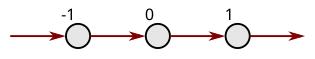

+++

> (b) Create a cycle graph for it.

+++


+++

> (c) Is it abelian?

Yes, because integer addition is commutative.

> (d) Are there any objects whose symmetries it describes?

Some of the frieze groups, see [Frieze group](https://en.wikipedia.org/wiki/Frieze_group).

+++

### Exercise 5.31 (📑)

+++

> The group Z from the previous exercise is considered an infinite cyclic group. What do you think an infinite dihedral group would be like?

See Figure 3.13 or previous answers on frieze groups for the actual Cayley diagram.

The cycle graph would have an infinitely large cycle for the outside cycle, and an infinite number of small cycles for every element on the inside cycle of the Cayley diagram.

+++

### Exercise 5.32

+++

> In Exercises 4.32 and 4.33 you investigated some infinite groups of numbers. Are any of them abelian?

Yes, both are abelian.

+++

## 5.5.5 Going beyond

+++

### Exercise 5.33 (⚠)

+++

> The notation for generating a group, introduced in Exercise 4.25, can be extended to what are called "group presentations" by adding equations that describe how the elements relate. For example, the presentation for S₃ is:
>
> $$
    ⟨r, f \enspace | \enspace r³ = 1, f² = 1, frf = r⁻¹⟩
$$
> We can think of this as specifying a Cayley diagram; the $r, f$ tells there will be two arrow colors (one for r and one for f) and the equations that follow tell us how those arrows tie together. The first two, $r³ = 1$ and $f² = 1$, tell you the orders of the generators, and the last equation tells you how the generators relate. Such a presentation gives you all the information you need to construct a Cayley diagram for $S_3$, step-by-step.
>
> (a) Explain how the information from the presentation
>$$
    ⟨r, f \enspace | \enspace r³ = 1, f² = 1, frf = r⁻¹⟩
$$
> enables you to create each step of a Cayley diagram for $S₃$. That is, go through the step-by-step process and write down both the steps and how you concluded the information you needed at each step.

+++

Compare [Presentation of a group](https://en.wikipedia.org/wiki/Presentation_of_a_group#cite_ref-Peifer_1-0).

+++

#### Algebraic approach

+++

How many actions/states/elements will we end up with on the Cayley diagram? That is, what is the order of the group? We should first try to identify each one of these states, ideally with the minimum number of generator actions required to reach it.

A simple algorithm to come up with a maximum set of labels is to take all the generators to all possible powers, in all possible orders. Said another way, we want to see a subgroup (subset) of the [Free group](https://en.wikipedia.org/wiki/Free_group) on two generators. In this first phase, we'll remove only "obvious" equal elements.

We'll use the term "word" in the following in the sense of [Word (group theory)](https://en.wikipedia.org/wiki/Word_(group_theory)). We have one word of length 0, namely the identity element $e$. The words of length 1 are simply $r$, $f$, $r^{-1}$, and $f^{-1} = f$, which takes us to a total of $1 + 3 = 4$ unique words. The length two words are trickier; we'll list them all here for completeness. This list has $9 = 3^2$ elements because we have only $3$ unique length-one words to build length-two words with:

+++

$$
\begin{align}
rr^{-1} &= e \\
rf \\
r^2 &= r^{-1} \\
fr \\
ff &= e \\
fr^{-1} &= rf \\
r^{-1}r &= e \\
r^{-1}f &= fr \\
r^{-2} &= r \\
\end{align}
$$

+++

Some of the relationships in the above are "non-obvious" but can be established with some algebra, such as:

+++

$$
\begin{align}
fr^{-1} &= x_1 \\
f &= x_1r \\
e &= x_1rf \\
rf &= x_1rfrf \\
rf &= x_1 \\
\end{align}
$$

+++

We could also establish this fact from the relator $rfrf = e$ more directly. We know that $fr$ and $rf$ are not equivalent because we'd need a four-term relator to equate them and the only candidate ($frfr$) does not (technically $f^4$ could as well, but has no $r$ in it).

+++

In some sense this is like exploring a map. In the same way places get named on a map based on who gets there first, the name of a particular location on the map is subject to the order in which you explored the map (the first name it receives will become its long-term name).

+++

Notice that we now have $1 + 3 + 2 = 6$ unique words; the last step was a lot of work but only generated 2 new words. To make our job easier, let's consider only terms that are composed of $r$ and $f$ going forward (the [Free monoid](https://en.wikipedia.org/wiki/Free_monoid)). We can do this because in the the last step we identified that $r^2 = r^{-1}$, so we know that any length-three word on only $r$ and $f$ (and not their inverses) can represent any length-two word on $r, f, r^{-1}$ and a bit more. Are there any new unique words in this set?

+++

$$
\begin{align}
rrr &= e \\
rrf &= fr \\
rfr &= f \\
rff &= r \\
frr &= rf \\
frf &= r^2 \\
ffr &= r \\
fff &= f \\
\end{align}
$$

+++

The relationship $rrf = fr$ may look like a five-term relator but can also be written $r^{-1}f = fr$ (that is, it comes from the four-term relator $rfrf$).

+++

Since there are no length-three words on only $r$ and $f$, we know there are no new unique length-four words on $r$ and $f$ (and length-five, etc.) because a length-four word can be built as a combination of a length-one and a length-three word. The length-three word will be reducible to a length-two word, which combined with the length-one word will produce a length-three word that will be reducible to a length-two word.

+++

#### Formal approach

+++

Following [Presentation of a group § Definition](https://en.wikipedia.org/wiki/Presentation_of_a_group#Definition), let $R$ be a set of words on $S$, so $R$ naturally gives a subset of $F_S$. The set $R$ in this case could be:

$$
R = \{r³, f², frfr\}
$$

Or for a slightly different presentation:

$$
R = \{r³, f², rfrf\}
$$

Per the same article, take the quotient of $F_S$ by the smallest normal subgroup that contains each element of $R$. This subgroup is called the [Normal closure (group theory)](https://en.wikipedia.org/wiki/Normal_closure_(group_theory)) $N$ of $R$ in the free group. This will be:

$$
N = ncl_{F_S}(R) = \{g^{-1}rg : g ∈ F_S\}
$$

As discussed in [Presentation of a group § Background](https://en.wikipedia.org/wiki/Presentation_of_a_group#Background), every element of this set will be equivalent (reducible) to $e$. Taking e.g. $r = frfr$ with any $g$:

$$
g⁻¹(frfr)g = g⁻¹(1)g = g⁻¹g = 1
$$

It may be helpful to think of all these relators as being the argument to a "modulo" (see [Modular arithmetic](https://en.wikipedia.org/wiki/Modular_arithmetic)) relationship. That is, we generate free words in $F_S$ but whenever we see one of these relators in them we cut them down. This is similar to how in modular arithmetic you can add up the elements (numbers) as much as you'd like, but when we reach the modulo argument we cut it back down. You could apply this reasoning with less analogy to the cyclic group presentation:

$$
〈a \enspace | \enspace a^n〉
$$

That is, we'd let the free group generate $e, a, a², a³, ...$ but then reduce $a^n = e$ when we encounter it. The free group would also include $a^{2n}$ and $a^{2n+1}$ which would need to be reduced similarly; notice $a^na^n = a^{2n}$ is a member of the normal subgroup $N$ mentioned above. Clearly this requires taking the quotient of an infinite group ($F_S$) with an infinite group ($N$) which makes it practically inefficient.

We're trying to solve the [Word problem for groups](https://en.wikipedia.org/wiki/Word_problem_for_groups). In general it's difficult, but it is solvable for finite groups.

+++

#### Visual approach

+++

We'll explore in a slightly different order (but only slight different order) visually than how we explored algebraically (which was essentially breadth-first search). To begin, we'll cover all zero-length and one-length words as well as the single length-two word $r^2 = r^{-1}$:

+++

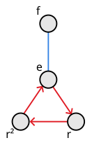

+++

We have not explored all length-two words; if it had turned out that some length-two word was equivalent to $r²$ then it would have been given that name rather than the name given in our original exploration order. Let's continue to explore with $rf$ and $fr$:

+++

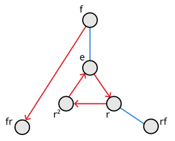

+++

We know that both $rf$ and $fr$ are unique terms (new territory) because the relator $frfr = 1$ implies that $rf = fr^{-1}$ and $fr = r^{-1}f$, both of which are also length-two and therefore within scope of how far we've let ourselves explore. Reviewing the algebraic exploration above, we also know they are not equivalent to any other length-two words. Let's include these other length-two words:

+++

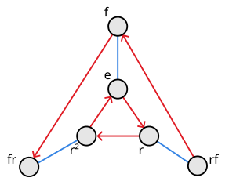

+++

As part of exploring length-three words we discover words that are equivalent to length-two words, but no new ones:

+++

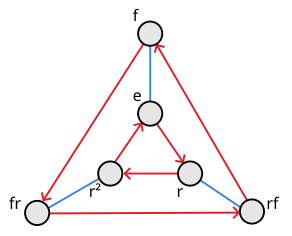

+++

> (b) Repeat part (a) for the presentation:
>$$
⟨r, f \enspace | \enspace r⁴ = 1, f² = 1, frf = r⁻¹⟩
$$
> which is only different in that the 3 changed to a 4. What group is this?

+++

#### Algebraic approach

+++

We have one word of length 0, namely the identity element $e$. The words of length 1 are simply $r$, $f$, $r^{-1}$, and $f^{-1} = f$, which takes us to a total of $1 + 3 = 4$ unique words. The length two words are trickier; we'll list them all here for completeness. This list has $9 = 3^2$ elements because we have only $3$ unique length-one words to build length-two words with:

+++

$$
\begin{align}
rr^{-1} &= e \\
rf \\
r^2 \\
fr \\
ff &= e \\
fr^{-1} &= rf \\
r^{-1}r &= e \\
r^{-1}f &= fr \\
r^{-2} &= r^2 \\
\end{align}
$$

+++

We know that $fr$ and $rf$ are not equivalent because we'd need a four-term relator to equate them and the only candidate ($frfr$) does not (technically $f^4$ and $r^4$ could as well, but have only one kind of term in them).

+++

Notice that we now have $1 + 3 + 3 = 7$ unique words; the last step was a lot of work but only generated 3 new words. To make our lives easier let's start to explore the length-three words with $r^3 = r^{-1}$. By doing so we recognize that we only need to explore terms with $f$ and $r$ in them, because all other words can be written in terms of these two symbols. All the length-three words:

+++

$$
\begin{align}
rrr &= r^{-1} \\
rrf \\
rfr &= f \\
rff &= r \\
frr &= rrf \\
frf &= r^{-1} \\
ffr &= r \\
fff &= f \\
\end{align}
$$

+++

The relationship $frr = rrf$ comes from conjugating $rfrf$ with $fr$ i.e. $(fr)(rfrf)(fr)^{-1} = frrfrfr^{-1}f = frrfrffr = frrfrr$. It's much easier to discover this last equation given a map/solution (the Cayley diagram) and building equations from the relators in it, as opposed to exploring many combinations of equations in an attempt to build the map.

+++

All the length-four words can be written in terms of shorter words:

+++

$$
\begin{align}
rrrr &= e \\
rrrf &= r^{-1}f \\
rrfr &= rf \\
rrff &= r^2 \\
rfrr &= fr \\
rfrf &= e \\
rfff &= rf \\
frrr &= fr^{-1} \\
frrf &= r^2 \\
frfr &= e \\
frff &= fr \\
ffrr &= r^2 \\
ffrf &= rf \\
fffr &= fr \\
ffff &= e \\
\end{align}
$$

+++

Another way to view this reduction is as a system with three equations and two unknowns. The system clearly has redudancies that we discover in terms of equivalences.

+++

#### Visual approach

+++

Again, we'll take a slightly different approach for the visual exploration. First we'll explore all the singly-generated elements:

+++

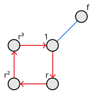

+++

Then we'll explore all length-two words:

+++

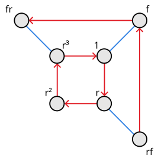

+++

Then all length-three words:

+++

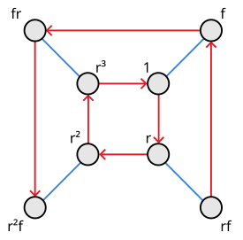

+++

And finally pull only equivalences from exploring length-four words:

+++

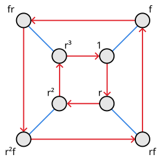

+++

> (c) What group has the presentation $⟨a \enspace | \enspace aⁿ = 1⟩$?

+++

Cyclic group of order n.

+++

> (d) What is the presentation for $D_n$?

+++

$$
⟨r, f \enspace | \enspace r^n = 1, f² = 1, frf = r⁻¹⟩
$$

+++

> (e) Sketch a Cayley diagram for the group:
>$$
⟨a, b \enspace | \enspace a^4 = 1, b^4 = 1, a^2 = b^2, bab = a⟩.
$$

+++

Let's assume the singly-generated elements $a$ through $a^4$ and $b$ through $b^4$. Exploring all of these, we should have $b, b², b^3, b^{-1} = b^3, b^{-2} = b^2, b^{-3} = b, a, a² = b², a³, a^{-1} = a^3, a^{-2} = a^2, a^{-3} = a$. So far, we have $1 + 5 = 6$ unique words. Next we'll explore all length-three words:

+++

$$
\begin{align}
aa &= b² \\
ab \\
aa^{-1} &= e \\
ab^{-1} &= ba \\
ba \\
bb &= b² \\
ba^{-1} &= ba \\
bb^{-1} &= e \\
a^{-1}a &= e \\
a^{-1}b &= ba \\
a^{-1}a^{-1} &= b² \\
a^{-1}b^{-1} &= ab \\
b^{-1}a &= ab \\
b^{-1}b &= e \\
b^{-1}a^{-1} &= ba \\
b^{-1}b^{-1} &= e \\
\end{align}
$$

+++

Notice that from $a = bab$ we can immediately conclude $ab^{-1} = ba$ and $b^{-1}a = ab$.

+++

Conjugating $baba^{-1}$ with $b²$, we get the relator $b^2baba^{-1}b^{-2} = b^3aba^3a^2 = b^{-1}aba$. This establishes that $b = aba$ and $ba^{-1} = ab$ and $a^{-1}b = ba$.

+++

Conjugating $bb(bb)^{-1}$ with $a$, we get the relator $abb(bb)^{-1}a^{-1} = abba$. This establishes that $a^{-1} = bba$ and $a^{-1} = abb$ and $ab = a^{-1}b^{-1}$ and $b^{-1}a^{-1} = ba$.

+++

Confirming there are no length-three words (on $a,b$) we missed:

+++

$$
\begin{align}
aaa &= a³ \\
aab &= b³ \\
aba &= b \\
abb &= a^{-1} \\
baa &= b^{-1} \\
bab &= a \\
bba &= a^{-1} \\
bbb &= b³ \\
\end{align}
$$

+++

We started by exploring all the singly-generated elements:

+++

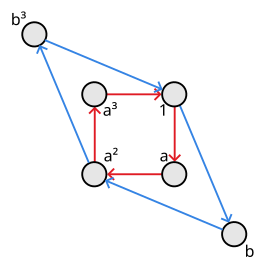

+++

After exploring all length-two words, we were able to fill in the whole diagram:

+++

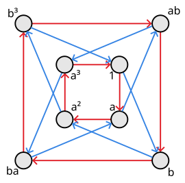

+++

Notice that this group is isomorphic to $Q_4$; a similar definition is given in [Group Info: Q₄](https://nathancarter.github.io/group-explorer/GroupInfo.html?groupURL=https://nathancarter.github.io/group-explorer/groups/Q_4.group).

+++

### Exercise 5.34

+++

> This exercise gives you a different look at S₃ and S₄ by looking at them using a different set of generators than we have up until this point.
>
> (a) The group S₃ can be generated by the following two permutations. Make a Cayley diagram for S₃ whose arrows represent these elements.

+++

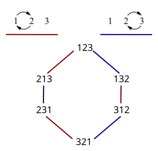

+++

> (b) The group S₄ can be generated by the following three permutations. Make a Cayley diagram for S₄ whose arrows represent these elements. Hint: It can be laid out as a truncated octahedron, similar to Figure 5.28, but with three arrow colors.

+++

Not bothering to add all the green lines:

+++

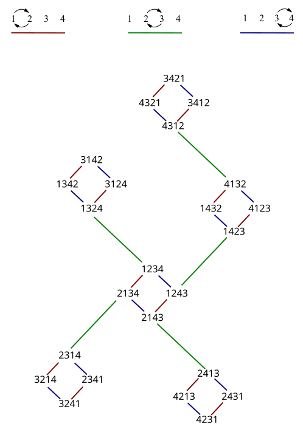

+++

> (c) What conjecture does this lead you to make about generating Sₙ?

You can do it with $n$ generators, with permutations that only transpose two elements.

+++

### Exercise 5.35 (📑)

+++

> This exercise analyzes the multiplication table for D₅ in Figure 5.18, relating it to a Cayley diagram for that same group, shown in the center of Figure 5.17. It begins with a generic question that will help us relate multiplication to Cayley diagrams, and the remaining parts apply it to D₅.
>
> (a) Consider an equation like ab = c about the elements a, b, and c in a group. What part of a multiplication table for the group expresses the information ab = c? What part of a Cayley diagram for the group expresses the same information?

A single cell represents this information in a multiplication table; every cell represents an equation.

If b is a generator then ab = c will expressed in a Cayley diagram as a line from a to c of the appropriate color for b. If b is some other action, then b will be the series of lines from a to c.

+++

> (b) The upper left quarter of the multiplication table for D₅ in Figure 5.18 corresponds to what portion of the Cayley diagram for D₅ in Figure 5.17? Justify your answer here using your answer from part (a).

The outer loop.

+++

> (c) The lower left quarter of the multiplication table for D₅ in Figure 5.18 corresponds to what portion of the Cayley diagram for D₅ in Figure 5.17? Justify your answer here using your answer from part (a).

The inner loop.

+++

> (d) Why do the diagonal stripes in the right half of the table in Figure 5.18 slant opposite to those in the left half of the table? This part's answer, too, can be justified using your answer from part (a).

For the upper right quadrant, going down the rows works clockwise around the outer loop but
going right among the columns works counterclockwise around the inner loop. This is opposite
of the left side of the multiplication table, where going down the rows and right among the
columns both work clockwise.

+++

### Exercise 5.36

+++

> (a) Is there a group in which no element (other than the identity) is its own inverse? Look for a group without any identity elements on the main diagonal of its multiplication table; see Exercise 4.19 for multiplication table construction.

It looks like C₃ satisfies this requirement.
e a b
a b e
b e a

> (b) The previous question was one of the three from page 63. Answer the other two as well.

> Is there more than one group with ten elements?

Yes, at least C₁₀ and D₅.

> Do all groups describe the symmetries of some object?

No, some groups describe how we can rearrange objects (permutations). We could probably force any group to describe the symmetry of some object, but this would be forced semantics.

> (c) In every group, any two orbits touch at the identity. Is there any group containing two orbits that touch only at the identity? Is there any group containing two orbits that touch at the identity and at exactly one other place?

Yes, the dihedral groups have many orbits that touch only at the identity. The minimal example of a group with at least two orbits is the Klein four-group (which has three that meet only at the identity).

Yes, the quaternion group Q₈ and some direct products of groups. In the quaternion group this happens because of the special element -1, which acts somewhat analogously to the identity.

> (d) Find a group with at least two elements in it, and only one solution to the equation x² = e, the solution x = e.

The cyclic group of order 3 (C₃).

> (e) Find a group that has exactly two solutions to the equation x² = e.

The cyclic group of order 2 (C₃).

> (f) Find a group that has more than two solutions to the equation x² = e.

The Klein four-group (has three).

> (g) Find a group with at least two elements in it, and only one solution to the equation x³ = e, the solution x = e, or explain why no such group exists.

The cyclic groups of order 4 or 5, because {3,4} and {3,5} are coprime.

> (h) Find a group that has more than two solutions to the equation x³ = e, or explain why no such group exists.

The cyclic group of order 9 (e and a³ and a⁶).

> (i) Find a group that has exactly two solutions to the equation x³ = e, or explain why no such group exists.

The cyclic group of order 6 (e and a³).

+++

### Exercise 5.37

+++

> (a) There are two different groups of order 6. What are their names? Specify which, if any, are abelian.

The symmetric group S₆ (isomorphic to D₆) and the cyclic group C₆. Only the latter is abelian.

> (b) If there is only one group of a given order, to what family must it belong? Why?

The cyclic groups, because you can construct a group of any order in that family.

> (c) Find some values of n for which there is only one group of order n. Can you see a pattern among the numbers you found? (Chapter 7 will talk about the pattern that exists.) Hint: The group library in Group Explorer may speed your search.

{1,2,3,5,7,11,13}; these look like the prime numbers.

+++

### Exercise 5.38 (📑)

+++

> Prove using algebra that if every element in a group has order 2, then the group is abelian.

For a group to be abelian, we must have ab = ba for all actions. If every element in the group has order 2, then for every element a² = e (every element is its own inverse), i.e. a = a⁻¹. This implies (ab)⁻¹ = ab so that (ab)⁻¹ab = (ab)⁻¹ba = abba = 1.

+++

### Exercise 5.39

+++

> In finite groups, the orbit of an element can be defined as all the positive powers of that element; the orbit of a is {a¹, a², a³, a⁴, ...}, a sequence which cannot go on infinitely. Because the group is finite, eventually one of the elements encountered (maybe a²⁰, maybe a¹⁰⁰⁰, maybe later) must be a repetition of an element already on the list. Explain why this means that some power of a must equal e.

The element e is already implicitly part of the list as a⁰. Let's say we were to reach some repeated element (e.g. we discover a²⁰ = a³). This implies we "missed" the repeated element a¹⁹ = a²; in fact we can continue this logic to conclude a¹⁷ = e.

+++

### Exercise 5.40 (📑)

+++

> The parts of this exercise ask you to explore the relationship among the elements in $D_4$, and how different layouts of its Cayley diagram can show those relationships in different ways. Begin with the Cayley diagram you created for $D_4$ in Exercise 5.6. Ensure that it follows the pattern given in Figure 5.17.

+++

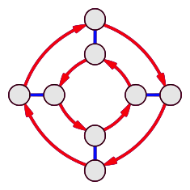

+++

> (a) Make another copy of this diagram with one change: Reorder the elements of the inner ring so that the arrows representing $r$ point clockwise in that ring, as they do in the outer ring. In order for it to still be a Cayley diagram of $D_4$, you must preserve the same pattern of connections. Therefore some of your $f$ arrows will be stretched by this new layout, but try to stretch them as little as possible.

+++

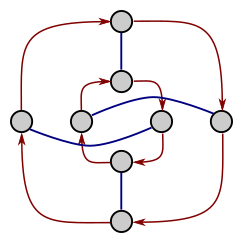

+++

> (b) Make another copy of the diagram, but this time arrange the nodes in two horizontal rows, the top row proceeding through the orbit of $r$ starting from $e$, and the bottom row connected to the top row by four parallel $f$ arrows.

+++

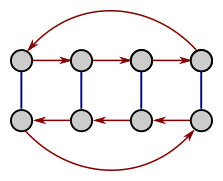

+++

> (c) Make another copy of this two-row diagram, but this time arrange the bottom row so that each element $fr^m$ is below the corresponding element $r^m$ for every number $m$ (between 0 and 3). The $f$ arrows will no longer be parallel, but try to make it as organized as possible.

+++

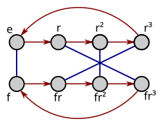

+++

> (d) For each of these three new ways of laying out the dihedral group $D_4$ (parts (a) through (c)), explain what the Cayley diagram for an arbitrary dihedral group $D_n$ would look like if laid out similarly.

(a) The blue arrows would form a twisted pattern. \
(b) You'd get nearly the same diagram as an infinite dihedral group. \
(c) The blue arrows would form a large diamond.

> (e) In Group Explorer, open a Cayley diagram for the group $D_4$. It defaults to the pattern from Figure 5.17. How can you instruct Group Explorer to reorganize the nodes of the diagram in the same ways you did in this exercise? (You may need to refer to Group Explorer's built-in help system for information on manipulating Cayley diagrams.)

The location of the nodes and arc of arrows can be changed by holding down shift.

+++

## 5.5.6 Cayley's theorem

+++

### Exercise 5.41 (⚠)

+++

> The following applications will give you some hands-on experience with Cayley's theorem.
>
> (a) Extract from the multiplication table of C₂ × C₄ shown on the right of Figure 5.12 the eight permutations in S₈ that behave like a copy of C₂ × C₄. You may want to make a copy of the table with the elements numbered from 1 to 8; the example in Figure 5.31 may help.

+++

In cycle notation:
1. (1)(2)(3)(4)(5)(6)(7)(8)
2. (1432)(5876)
3. (13)(24)(57)(68)
4. (1234)(5678)
5. (15)(26)(37)(48)
6. (1836)(2547)
7. (17)(28)(35)(46)
8. (1638)(2745)

+++

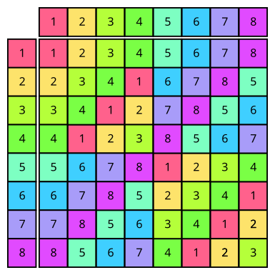

+++

> (b) Extract from the Cayley diagram of D₅ in Figure 5.17 the two permutations that describe its arrows, following the example of Figure 5.30. Here it may also be useful to number the elements, 1 to 10.

Using 1 to a (hex digits) to help distinguish 10.

e -> 1, r -> 2, etc.
f -> 6, fr -> 7, etc.

In cycle notation:
1. (12345)(6789a)
2. (16)(2a)(39)(48)(57)

+++

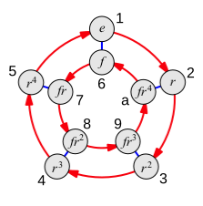

+++

> (c) Take the two permutations shown in Figure 5.30 and make a multiplication table from them and all their combinations. Organize your table and highlight what each permutation does to the identity element, as in Figure 5.32. The result should make it clear that the multiplication table you created is one for D₃, as shown in Figure 4.7 (under the name S₃).

+++

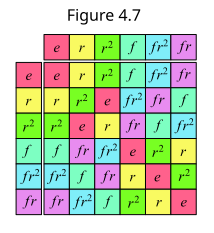

+++

In cycle notation the two permutations are:
1. (123)(465)
2. (14)(25)(36)

In one-line notation:
1. 123456 (identity)
2. 231645 (1 above; σ(1) = 2, σ(2) = 3)
3. 312564 (1 above, repeated twice)
4. 456123 (2 above)
5. 564312 (1 then 2)
6. 645231 (2 then 1)

The advantage of one-line notation here is we can read this notation off directly as
the multiplication table columns.

+++

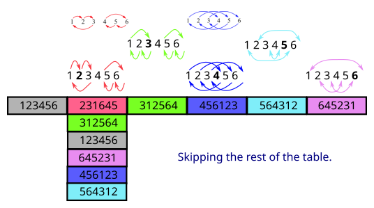

+++

### Exercise 5.42

+++

> Cayley's theorem says that any group is isomorphic to a collection of permutations. If we restrict ourselves to only using permutations of three items (i.e., elements of S₃), what groups can we form? For instance, we can obviously create all of S₃ by taking every permutation of three elements, and we can obviously create the group C₁ by just taking the identity permutation from S₃. What other groups are possible?

Reviewing all groups smaller than order 6 in group explorer, it appears only C₂ and C₃ also fit in S₃.

+++

### Exercise 5.43 (📑)

+++

> Repeating Exercise 5.42 for S₄ would be lengthy, so rather than ask you to search blindly, I will give you hints. All of the following groups can be built using collections of permutations of four things (i.e., elements of S₄). Find the appropriate collection of permutations for each group given.
>
> (a) every group of order 1, 2, 3, or 4 (for a total of five groups)

Answers in cycle notation.

Order 1: \
Z₁: 1234

Order 2: \
Z₂: 1234, (12)34

Order 3: \
Z₃: 1234, (123)4

Order 4: \
V₄: 1234, (12)(34), (13)(24) \
Z₄: 1234, (1234)

> (b) the group D₄. Hint: Apply the technique from Chapter 3 to a square. Recall Exercise 2.8.

See Exercise 3.15

1234, (1234), (14)(23)

> (c) the group A₄

See Figure 5.27 (or square all permutations in S₄)

1234, 1(243), (12)(34)

+++

### Exercise 5.44 (⚠, 📑)

+++

> Although you can find a copy of $C_6$ in $S_6$ by simply taking the orbit of the permutation shown here:
>
> (123456)
>
> that is not the most "efficient" way to embed $C_6$ in an $S_n$. The following permutation in $S_5$ also has order 6, and therefore its orbit is a copy of $C_6$ as well:
>
> (123)(45)
>
> Thus we can fit $C_6$ in $S_6$ in an obvious way, or in $S_5$ with a little cleverness. So although the easiest way to embed $C_n$ in a symmetric group is by taking a permutation that cycles the elements of $S_n$, for some $n$ there is a way to embed $C_n$ in a smaller symmetric group.
>
> (a) For each $n$ between 1 and 12, determine the smallest value of $m$ such that $C_n$ can be expressed in $S_m$. Can you find any pattern or determine any strategy for computing $m$ from $n$?

Most of the time, $n = m$. The exceptions are for $n = 6$ (described above), $n = 10$, and $n = 12$. For $n = 10$, $m = 7$ and the generator is (12345)(67) (where a represents 10, as in hex). For $n = 12$, $m = 7$ and the generator is (1234)(567).

You can embed a cyclic group of order $n$ in a smaller symmetric group when $n$ can be factored into a set that is coprime.

> (b) Does your answer change if instead of a copy of $C_n$, you must find in $S_m$ a copy of $D_n$?

It should be possible to use the same permutations, reversing them as the second action required by $D_n$ (the $f$ to go with the existing $r$). So e.g. for $n = 10$ (and $m = 7$) the two generators are:

(12345)(67), (15)(24)(3)67
