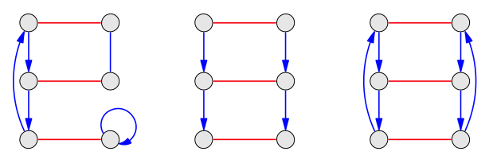
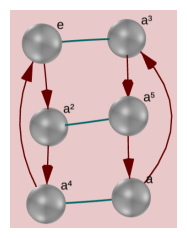
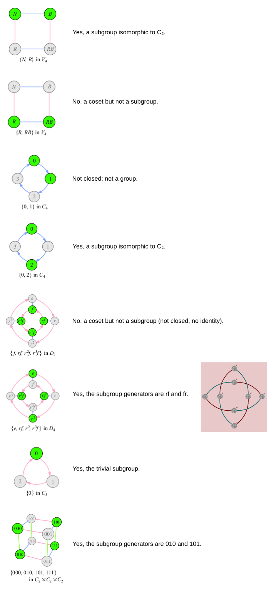
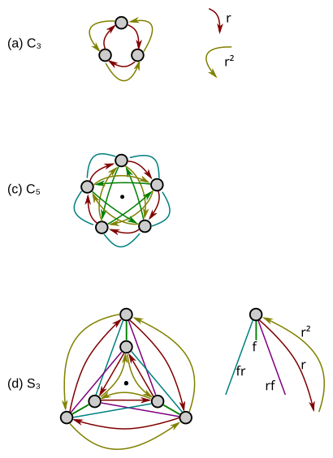
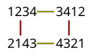
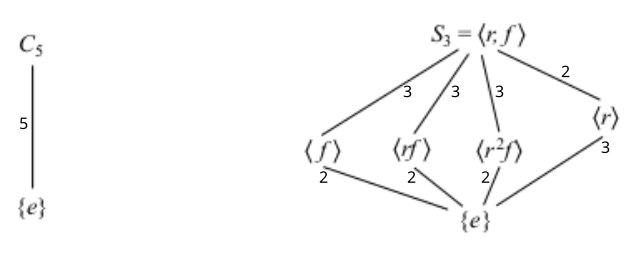
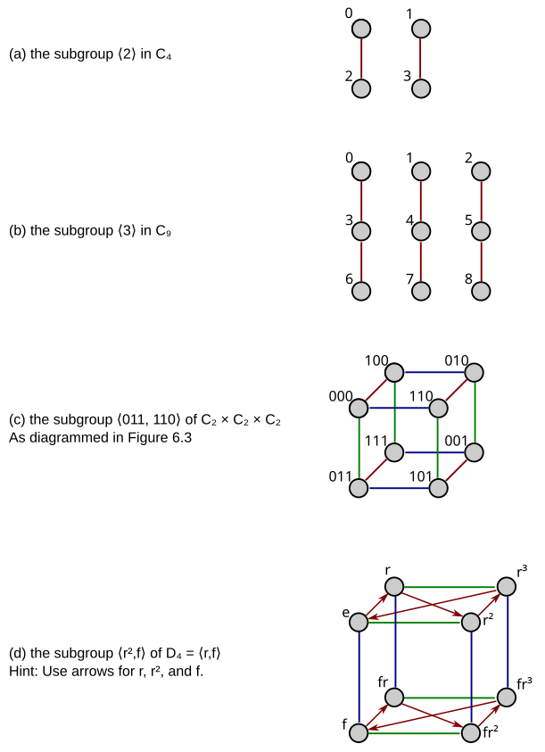
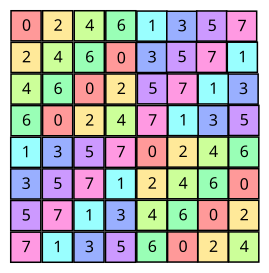
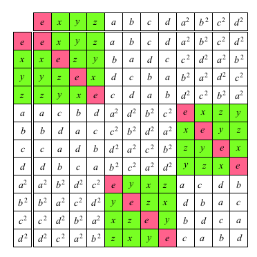

---
jupytext:
  text_representation:
    extension: .md
    format_name: myst
    format_version: 0.13
    jupytext_version: 1.16.1
kernelspec:
  display_name: Python 3 (ipykernel)
  language: python
  name: python3
---

# 6.6 Exercises

+++

## 6.6.1 Basics

+++

### Exercise 6.1 (📑)

+++

> Which of these three diagrams is a Cayley diagram? Which satisfies all the requirements for being a Cayley diagram except for regularity?
>
> 

+++

The first diagram satisfies all requirements but regularity:
1. There is a fixed number of generators
2. Every arrow type enters each node exactly once.
3. No probabilities
4. Every arrow type exits each node exactly once.

The first diagram is not regular because the b arrow produces a different result depending where you start from.

The second diagram has some nodes where blue arrows do not exit.

The third diagram is a valid Cayley diagram (Z₆). You can add arrows for a² and a³ in Group Explorer and rearrange by holding down shift on nodes and arcs to confirm:

+++

+++

### Exercise 6.2

+++

> Each of the diagrams below highlights some nodes. In each case, determine whether the highlighted set of nodes form a subgroup. You may need to reorganize some of the diagrams or add more arrows to make the answer obvious.

+++

+++

## 6.6.2 Understanding subgroups

+++

### Exercise 6.3 (📑)

+++

> Make Cayley diagrams for the following groups with every non-identity element represented by an arrow.

For part (b) V₄ see Exercise 2.9.

+++

+++

### Exercise 6.4

+++

> Which of the following subgroups does Lagrange's Theorem preclude from appearing as a subgroup of C₈? Which of them does Lagrange's Theorem preclude from appearing as a subgroup of D₅?
>
> In general, Lagrange's Theorem precludes a subgroup if the order of the subgroup does not evenly divide the order of the supergroup. 

> (a) C₂

Could be a subgroup of C₈ (2 divides 8).
Could be a subgroup of D₅ (2 divides 10).

> (b) C₃

Cannot be a subgroup of C₈ (3 does not divide 8).
Cannot be a subgroup of D₅ (3 does not divide 10).

> (c) V₄

Could be a subgroup of C₈ (4 divides 8).
Cannot be a subgroup of D₅ (4 does not divide 5).

> (d) C₅

Cannot be a subgroup of C₈ (5 does not divide 8).
Could be a subgroup of D₅ (5 divides 10).

> (e) S₃

Cannot be a subgroup of C₈ (6 does not divide 8).
Cannot be a subgroup of D₅ (6 does not divide 10).

+++

### Exercise 6.5

+++

> Find every subgroup for each of the following groups. Compute the order and index of each subgroup you find.

You can confirm all these answers are correct in Group Explorer.

> (a) V₄   Hint: There are five.

⟨e⟩: Order 1, Index 4 \
⟨v⟩: Order 2, Index 2 \
⟨h⟩: Order 2, Index 2 \
⟨vh⟩: Order 2, Index 2 \
⟨h,v⟩: Order 4, Index 1

> (b) C₅

⟨e⟩: Order 1, Index 4 \
⟨r⟩: Order 5, Index 1

> (c) S₃   Hint: There are six.

⟨e⟩: Order 1, Index 6 \
⟨f⟩: Order 2, Index 3 \
⟨r⟩: Order 3, Index 2 \
⟨fr⟩: Order 2, Index 3 \
⟨rf⟩: Order 2, Index 3 \
⟨f, r⟩: Order 6, Index 1

> (d) C₈

⟨e⟩: Order 1, Index 8 \
⟨r⁴⟩: Order 2, Index 4 \
⟨r²⟩: Order 4, Index 2 \
⟨r⟩: Order 8, Index 1

> (e) D₄

⟨e⟩: Order 1, Index 8 \
⟨f⟩: Order 2, Index 4 \
⟨r²⟩: Order 2, Index 4 \
⟨fr⟩: Order 2, Index 4 \
⟨fr²⟩: Order 2, Index 4 \
⟨rf⟩: Order 2, Index 4 \
⟨r⟩: Order 4, Index 2 \
⟨f, r²⟩: Order 4, Index 2 \
⟨fr, r²⟩: Order 4, Index 2 \
⟨f, r⟩: Order 8, Index 1

> (f) C₃ × C₃

⟨00⟩: Order 1, Index 9 \
⟨01⟩: Order 3, Index 3 \
⟨10⟩: Order 3, Index 3 \
⟨11⟩: Order 3, Index 3 \
⟨12⟩: Order 3, Index 3 \
⟨01, 10⟩: Order 9, Index 1

+++

### Exercise 6.6

+++

> (a) What elements are in the left coset rᵐ⟨f⟩ in Dₙ?

{rᵐ, rᵐf}

> (b) What elements are in the right coset ⟨f⟩rᵐ in Dₙ?

{rᵐ, frᵐ}

> (c) How do these cosets look in a typical Cayley diagram for Dₙ?

The first is all the double-sided arrows between the inside and outside circle.

The second is harder to see; each of these cosets will be a pair between the inside and outside circles but on what is usually the opposite sides of the diagram.

+++

### Exercise 6.7

+++

> (a) If e is the identity element, then what is ⟨e⟩?

The trivial subgroup.

> (b) If a is in the subgroup ⟨b,c⟩ then what is ⟨a,b,c⟩?

The same subgroup ⟨b,c⟩.

> (c) If a is not in the subgroup ⟨b,c⟩, and that subgroup's index is 2, then what is ⟨a,b,c⟩?

The whole group (the non-proper subgroup).

> (d) If a is not in the subgroup ⟨b,c⟩, and that subgroup's order is 28, then what do you know about the order of ⟨a,b,c⟩?

It will be greater than order 28

+++

### Exercise 6.8

+++

> Consider a cyclic group Cₙ. If m is a number that divides n, then describe all the subgroups Cₙ has of order m.

There will be only subgroup, with n/m (the index of the subgroup in Cₙ) cosets. It will be generated by r to the power of n/m.

+++

### Exercise 6.9

+++

> If a is the permutation that interchanges the numbers 1 and 2, but leaves all other numbers alone, then what is [Sₙ : ⟨a⟩]?

We know the order of this permutation's subgroup is 2 because it returns to the identity after a second application of the generator. The order of Sₙ is n! so:

$$
[Sₙ : ⟨a⟩] = n! / 2
$$

+++

### Exercise 6.10

+++

> Which of the following statements are true? Explain each of your answers.
>
> (a) A group with 18 elements cannot have a subgroup of order 9.

False, C₁₈ does.

> (b) A group with 22 elements cannot have a subgroup of order 12.

True, per Lagrange's Theorem this is not possible because 12 does not divide 22.

> (c) A group with 12 elements cannot have a subgroup of order 22.

True, a subgroup always has fewer elements.

> (d) A group with 10 elements must have a subgroup of order 10.

True, the group itself is still considered a subgroup (the non-proper subgroup).

> (e) A group with 12 elements must have a subgroup of order 6. (See Exercise 6.31.)

In general, the converse of Lagrange's theorem does not hold.

+++

### Exercise 6.11

+++

> A particular special case of Lagrange's Theorem bears highlighting on its own. As we learned in Chapter 5, any element g in a group can be used to create a cyclic subgroup called the orbit of g. We write |g| as shorthand for the size of that orbit
(i.e., |g| = |⟨g⟩|), and call it the order of g.
>
> Explain why the order |g| of any element must divide the order |G| of the group.

The orbit of g is a subgroup of the group G and per Lagrange's Theorem the order of a subgroup must divide the order of the group.

+++

### Exercise 6.12 (📑)

+++

> Answer each of the following questions and explain why your answers are correct.
>
> (a) How many subgroups does G have when |G| is prime?

Two, the trivial subgroup and the nonproper subgroup.

> (b) What is the orbit of an element in such a group G?

The whole group.

> (c) How many groups of order p are there, when p is prime?

One, the cyclic group of that order.

+++

### Exercise 6.13

+++

> (a) What subgroup of A₄ is generated by the following two permutations?
>
> (12)(34)
> (13)(24)

The following subgroup, isomorphic to V₄:

+++

+++

> (b) What subgroup of S₄ is generated by the following two permutations?
>
> (123)4
> 1(234)

All of S₄; confirm in Group Explorer.

+++

### Exercise 6.14 (📑)

+++

> Is the "turned-around" version of Lagrange's Theorem mentioned at the end of this chapter at least true about cyclic groups?

Yes. Let's say you have some integer m you want to build a subgroup for in Cₙ (where m divides n). You should be able to construct a subgroup of order m by simply taking r to the power n/m.

+++

### Exercise 6.15

+++

> Leading up to Observation 6.6, I gave an informal explanation of why that observation is true. Let's make that explanation more formal. Recall that Observation 6.6 says that if b is in aH, then aH = bH. So assume in the group G that the element b is in the left coset aH, and answer the following questions.
>
> (a) What do we know about how a and b connect in a Cayley diagram of G?

With one generator from H we should be able to reach b from a. We may need a finite number of arrows on a Cayley diagram based on different generators, but if we add the generators in H explicitly (e.g. Exercise 6.3) we should be able to do it one arrow. Said another way, we know that b = ah for some h in H.

> (b) Explain why every node that can be reached from b using the generators of H can also be reached from a using those same generators.

You can use whatever generator (arrow) h you need to get from a to b, then use all the generators from H to get to all the nodes you can reach from b. In general, the selection of the identity element in a group is arbitrary.

> (c) Explain why every node that can be reached from a using the generators of H can also be reached from b using those same generators.

You can use the inverse of whatever generator (arrow) you need to get from a to b to get from b to a, then use all the generators from H to get to all the nodes you can reach from a.

> (d) Explain why correct answers to parts (b) and (c) prove that whenever b is in aH, then aH = bH.

Those answers show you can reach all the same nodes without introducing any new nodes to the coset, indicating these sets are the same.

+++

### Exercise 6.16 (📑)

+++

> Correct answers to this exercise show that all the work in this chapter that was specific to left cosets could also be done for right cosets.
>
> (a) The justification following Observation 6.3 spoke from the point of view of left cosets. Explain why Observation 6.3 is also true about right cosets. That is, why is every element of the group in some right coset?

Call our subgroup generators H. A right coset Hg includes all nodes that the right factor g can reach from all nodes in H. If we consider every element in G for g, it's clear that even if H is {e} we'll have a right coset covering every element in the original group. If H is equal {e} then each coset will be of size one, covering all of G.

> (b) Explain what changes would need to be made to my questions and your answers in Exercise 6.15 to make them justify a version of Observation 6.6 about right cosets.

Ha and Hb are all the nodes that are reachable from the generators of H using a and b, respectively. Both Ha and Hb include their respective right factor, generated when the h in H is equal e. To generate all of Hb we can follow the b arrow in reverse from b to get to the identity and then generate the right coset Hb as normal starting from e. We could do the same for a. Another option for Ha, if we know that b is in a, is to take the a arrow in reverse to whatever h in H was used to reach b (we know b = ha from some h in H so we can say specifically h = ba⁻¹). Because of the regularity of the Cayley diagram, we can start from this h node rather than the normal h node (e) to build up the same right coset.

The author's answer to this subquestion seems to be an answer to part (d):

> Exercise 6.16(b). The coset H b is the set of destinations of the b-arrows that lead from the elements of H . There are never two different b-arrows leading into the same node because the actions represented by the generators are reversible (Exercise 2.15). There are never two b-arrows leaving the same node because the actions represented by the arrows are deterministic (Exercise 2.16). Thus each b-arrow leads to a different node from each of the elements of $H$, so there are exactly as many nodes in $Hb$ as in $H$.

> (c) If Theorem 6.7 had been about right cosets, what changes would you need to make to its proof? Feel free to make reference to your answers to parts (a) and (b).

Very little. Since g is in Ha, we can conclude that Hg = Ha, based on Observation 6.6. And since g is also in Hb, we know that Hg = Hb for the same reason. The reason, then, that Ha = Hb is that both are equal to Hg.

> (d) Why is the number of elements in Hg equal to |H|?

The "function" g from each h in H to each hg is bijective.

> (e) If Theorem 6.8 had been about right cosets, what changes would you need to make to its proof? Again, you may make use of earlier answers.

The proof should essentially be the same; we've shown that G is partitioned into copies of H with the version of Theorem 6.7 for right cosets. So the size of G can be determined by counting how many copies of H there are and multiplying by the size of each one, the number |H|.

+++

### Exercise 6.17 (📑)

+++

> Consider the group Z from Exercise 5.30.
>
> (a) If n is in Z, then is ⟨n⟩ a subgroup of Z? What does it contain?

Yes, it contains all the multiples of n.

> (b) For which n ∈ Z is ⟨n⟩ = Z?

-1 and 1

> (c) If n and m are both in Z, then when is ⟨n⟩ < ⟨m⟩?

When m is a multiple of n.

> (d) Can ⟨n⟩ itself also have subgroups?

Yes, the factors of n.

> (e) What subgroup of Z is generated by 2 and 5?

⟨1⟩

> (f) What subgroup of Z is generated by 4 and 6?

⟨2⟩

+++

### Exercise 6.18 (⚠)

+++

> (a) What is the one coset of ⟨2⟩ in Z (besides the subgroup ⟨2⟩ itself)?

1 + ⟨2⟩

Or ⟨2⟩ + 1 as a right coset.

> (b) How many cosets does ⟨3⟩ have in Z, and what are they?

Two, they are:
1 + ⟨3⟩
2 + ⟨3⟩

> (c) Is ⟨n⟩ a normal subgroup of Z?

Yes, because the right and left cosets are the same. In this case that occurs because the group Z with addition is abelian.

+++

### Exercise 6.19

+++

> Recall the group Q of rational numbers under the operation of addition, from Exercise 4.33 part (a).
>
> (a) Compare its subgroup ⟨2⟩ to the subgroup ⟨2⟩ of Z. Note any similarities or differences.

These should be isomorphic with all the same element names, as well.

> (b) Compare its subgroup ⟨2, 3⟩ to the subgroup ⟨2, 3⟩ of Z. Note any similarities or differences.

These should be isomorphic with all the same element names. Fractional elements cannot be constructed from the addition and subtraction of integers; they are represented in the group as separate elements.

+++

### Exercise 6.20

+++

> For each H and G given below, find all left cosets of H in G, then state the index $[G : H]$.
>
> (a) H = ⟨4⟩, G = C₂₀

$$
\begin{gather}
1⟨4⟩, 2⟨4⟩, 3⟨4⟩ \\
[G : H] = 5
\end{gather}
$$

> (b) H = ⟨6⟩, G = C₁₅

$$
\begin{gather}
1⟨6⟩, 2⟨6⟩ \\
[G : H] = 3
\end{gather}
$$

> (c) H = ⟨f⟩, G = D₄

$$
\begin{gather}
f⟨f⟩ \\
[G : H] = 4
\end{gather}
$$

> (d) H = A₄, G = S₄

Using cycle notation:

$$
\begin{gather}
2341⟨(1234)⟩ \\
[G : H] = 2
\end{gather}
$$

+++

### Exercise 6.21

+++

> List all the subgroup relationships that exist among the following eight groups.

Assuming $ℚ$ refers to the rational numbers under addition. Ignoring $ℚ⁺$ since this is not a group (likely an error in the book).

$$
\begin{gather}
C₂ < C₄ \\
C₂ < C₆ \\
C₃ < C₆ \\
⟨2⟩ < ℤ \\
⟨2⟩ < ℚ \\
ℤ < ℚ
\end{gather}
$$

+++

## 6.6.3 Hasse diagrams

+++

See also [Hasse diagram](https://en.wikipedia.org/wiki/Hasse_diagram).

+++

### Exercise 6.22

+++

> (a) Why are there no lines among any of the subgroups ⟨f⟩, ⟨rf⟩, ⟨r²f⟩, and ⟨r⟩ in S₃?

They don't share a common set of elements.

> (b) What is the smallest subgroup of S₃ containing both f and rf?

S₃ itself

> (c) What is the smallest subgroup of C₅ with more than one element in it?

C₅ itself

> (d) Label each line in each of the above two Hasse diagrams with the index of the smaller subgroup in the larger. For example, you would label the lower-leftmost line in the S₃ diagram with 2, because $[⟨f⟩ : {e}] = 2$.

+++

+++

### Exercise 6.23 (📑)

+++

See also [Lattice of subgroups](https://en.wikipedia.org/wiki/Lattice_of_subgroups).

+++

> Make a Hasse diagram for each of the groups whose list of subgroups you found in Exercise 6.5.

+++

+++

Skipping part (f), not interesting.

+++

### Exercise 6.24

+++

> Make a Hasse diagram for the group C₂₄. Recall Exercise 6.8, whose answer will speed your search for subgroups.

+++

+++

## 6.6.4 Organizing visualizations

+++

### Exercise 6.25

+++

> In each of the following cases, draw a Cayley diagram for the given group that emphasizes the given subgroup. Choose a layout for the nodes that clusters together each left coset of the given subgroup.

+++

+++

> (e) the subgroup A₄ of S₄
>
> Hint: Take a Cayley diagram for S₄ from Chapter 5, label an element as the identity, and then square each element in the diagram visually (treating it as a path from the identity node). This quick, visual way to compute A₄ results in a diagram that must simply be reorganized to cluster A₄ apart from its one coset.

Skipping, a lot of work for not that interesting of a result.

+++

### Exercise 6.26 (📑, 🕳️)

+++

> (a) Organize a multiplication table of V₄ by an order-2 subgroup.

There are only order-2 subgroups, so any table will do.

+++

> (b) Organize a multiplication table of C₈ by the subgroup ⟨2⟩.

+++

+++

The author's solution to this question has an error; the fourth column should be a $6$ rather than an $8$. He mentions this in the errata, but the errata erroneously mentions it only under "Page 270, Answer to Exercise 7.9" (only the page number is right) (📌).

+++

> (c) Organize a multiplication table of C₈ by the subgroup ⟨4⟩.

Skipping, feel free to do in Group Explorer.

> (d) Organize a multiplication table of C₉ by the subgroup ⟨3⟩.

Skipping, feel free to do in Group Explorer.

+++

### Exercise 6.27

+++

> The previous exercises had you organize Cayley diagrams and multiplication tables in different ways. Are there also different ways to organize cycle graphs? If so, what significance do they have? Can they be used to emphasize specific subgroups? Why or why not?

Cycle graphs can only show cyclic subgroups.

+++

## 6.6.5 Finding examples

+++

### Exercise 6.28 (📑)

+++

> For each of the following questions, either find a group that answers the question in the affirmative or give a clear explanation of why the answer to the question is negative.
>
> (a) Is there a non-cyclic group all of whose proper subgroups are cyclic?

Yes, $V_4$.

> (b) Is there a non-abelian group all of whose proper subgroups are abelian? For a subgroup to be abelian, you need the subgroup generators to work commutatively.

Yes, $S_3$.

+++

### Exercise 6.29

+++

> For each of the following questions, either find a group that answers the question in the affirmative or give a clear explanation of why the answer to the question is negative.
>
> (a) Is there a group of order 8 with a subgroup whose cosets partition the group into two different cosets (each coset therefore containing four elements)?

Yes, $C_8$ with ⟨r²⟩.

> (b) Is there a group of order 8 with a subgroup whose cosets partition the group into eight different cosets (each element in its own coset)?

Yes, any group of order 8 with ⟨e⟩.

> (c) Is there a group of order 8 with a subgroup whose cosets partition the group into just one big cluster (every element in one coset)?

Yes, any group of order 8 with all its generators (the nonproper subgroup).

> (d) Is there a group of order 30 with a subgroup whose cosets partition the group into 20 different cosets?

No, by Langrange's Theorem.

> (e) Is there an abelian group with a subgroup whose left and right cosets partition the group differently?

No, the left coset aH is defined as $\{ah | h ∈ H\}$, and the right coset as $\{ha | h ∈ H\}$. If the group is abelian then $ah = ha$ for all h in H.

+++

### Exercise 6.30 (📑)

+++

> For each integer n between 1 and 5, find a non-abelian group $G$ with a subgroup $H$ such that $|H| ≥ 3$ and $[G : H] = n$.

Strategy: The symmetric groups are all non-abelian. Find permutation subgroups of size $|H| ≥ 3$ that divide $s!$ (where s is the order of the symmetric group) to get the desired index. Because $[G : H] = |G| / |H|$ we need $s! / |H| = n$.

$n = 1$: S₃ and ⟨f, r⟩, so $[G : H] = 3! / 6$ \
$n = 2$: S₃ and ⟨r⟩, so $[G : H] = 3! / 3$ \
$n = 3$: S₄ and ⟨(1234), (14)(23)⟩, so $[G : H] = 4! / 8$ \
$n = 4$: S₄ and ⟨(123)4, (12)34⟩, so $[G : H] = 4! / 6$

Special case:
$n = 5$: D₅ and ⟨f⟩, so $[G : H] = 10 / 2$

+++

### Exercise 6.31

+++

> This exercise investigates subgroups of A₄. By Lagrange's Theorem, the only sizes possible for subgroups of A₄ are 1, 2, 3, 4, 6, and 12. You can either do the work of this exercise using permutations, or using the following multiplication table for A₄. In it, the elements are colored according to their order:
>
> 
>
> a, b, c, and d are of order 3, while the elements x, y, and z are of order 2. This
coloring should prove helpful in answering the questions below.

+++

> (a) Describe all subgroups of order 1.

⟨e⟩

> (b) Describe all subgroups of order 12.

The whole group (nonproper subgroup).

> (c) A subgroup of order 2 must be structurally the same as what group? Express each order-2 subgroup of A₄ using generator notation.

The cyclic group of order 2.
⟨x⟩, ⟨y⟩, ⟨z⟩

> (d) A subgroup of order 3 must be structurally the same as what group? Express each order-3 subgroup of A₄ using generator notation.

The cyclic group of order 3.
⟨a⟩, ⟨b⟩, ⟨c⟩, ⟨d⟩

> (e) In part (a) of Exercise 5.37 we saw that there are only two groups of order 6, $C_6$ and $S_6$. Each of them has an element of order 2 and one of order 3. Thus we can look for subgroups of order 6 by pairing up order-2 elements with order-3 elements. Express each order-6 subgroup of $A_4$ using generator notation.

Potential options:
⟨x,a⟩, ⟨x,b⟩, ⟨x,c⟩, ⟨x,d⟩
⟨y,a⟩, ⟨y,b⟩, ⟨y,c⟩, ⟨y,d⟩
⟨z,a⟩, ⟨z,b⟩, ⟨z,c⟩, ⟨z,d⟩

What order is ⟨x,a⟩? Because xa = b, ax = c, bx = d, a²b = y, and a²d = z, this group
is order 12. The same applies to the other 11 possibilities listed above.

> (f) What is the significance of your result from part (e)?

The "reverse" of Lagrange's Theorem doesn't hold.
