---
jupytext:
  text_representation:
    extension: .md
    format_name: myst
    format_version: 0.13
    jupytext_version: 1.16.1
kernelspec:
  display_name: Python 3 (ipykernel)
  language: python
  name: python3
---

# 7.6 Exercises

+++

## 7.6.1 Direct products

+++

### Exercise 7.1

+++

> How many elements are in each of the following groups?
>
> (a) C₂ × C₆

12

> (b) S₃ × A₅

15

> (c) C₃⁵, which means C₃ × C₃ × C₃ × C₃ × C₃

3⁵ = 243

+++

### Exercise 7.2

+++

> (a) Consider two Cayley diagrams, one for the group A with two arrow types (indicating two generators) and one for the group B with just one arrow type. How many arrow types will be in the Cayley diagram for A × B, constructed by Definition 7.1?

3

> (b) What is the answer if the diagram for A has n arrow types and the diagram for B has m?

n*m

+++

### Exercise 7.3 (📑)

+++

> For each of the following statements, determine if it is true or false.
>
> (a) If A and B are any two groups, then |A × B| = |A|*|B|.

True

> (b) The group C₃ × C₄ has the same elements as the group C₄ × C₃.

The names may be different, but the two groups are isomorphic.

> (c) The group A × B is abelian, for any groups A and B.

False

> (d) The group C₂ × C₂ has the same structure as the group C₄.

False

> (e) If A and B are any two groups, then A ⊲ A × B.

True

> (f) The group Dₙ has the same structure as the group C₂ × Cₙ.

False

+++

### Exercise 7.4 (📑)

+++

> (a) Create a Cayley diagram for C₄ × C₄, which can be called C₄², "cee four squared."

+++

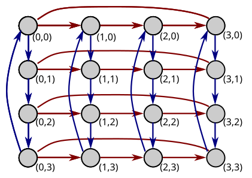

+++

> (b) Create a Cayley diagram for C₃ × C₃ × C₃, which can be called C₃³, cee three cubed.

+++

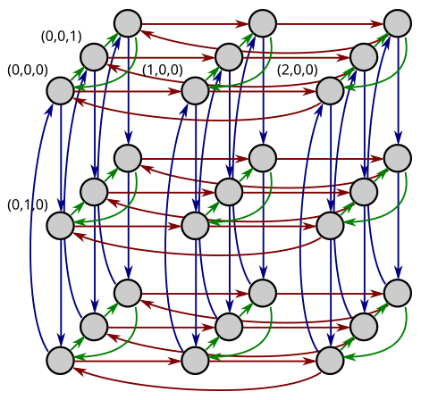

+++

> (c) Create a Cayley diagram for C₂ × C₂ × C₂ × C₂, which can be called C₂⁴, cee two to the fourth.

+++

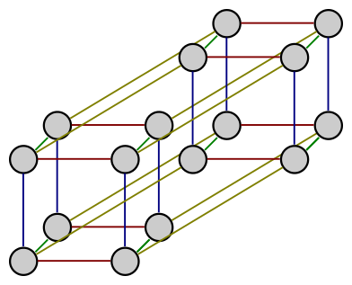

+++

> (d) Are C₄² and C₂⁴ the same?

No

+++

### Exercise 7.5

+++

> (a) Describe the construction of C₅ × C₁. To what is it isomorphic?

Start with C₅ and duplicate C₁ into every node. It is isomorphic to C₅.

> (b) Describe the construction of C₁ × C₅. To what is it isomorphic?

Start with C₁ and duplicate C₅ into every node (just one). It is isomorphic to C₅.

> (c) What can you say about C₁ × G and G × C₁ in general?

It will be equal C₁.

+++

### Exercise 7.6

+++

> If |A| = n and |B| = m, then what is |A × B|?

n*m

+++

### Exercise 7.7

+++

> Although all parts of this question can be answered after only having read Section 7.1, parts (b) and (c) are easier if you have also read Section 7.3.
>
> (a) Use direct product notation to describe the group depicted by the following Cayley diagram (shown from two different angles, to clarify its structure).
>
> 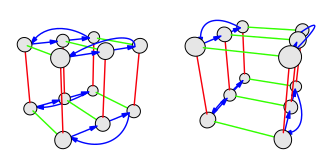

+++

C₂ × C₃ × C₂

+++

> (b) The group C₁₀ is a direct product. What are its factors?

+++

C₂ × C₅

+++

> (c) Is the group depicted by the following Cayley diagram a direct product group? Justify your answer.
>
> 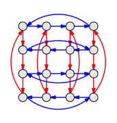

+++

No, it looks like C₄ × C₄ but notice the reversed blue arrows in the 2nd and 4th rows. If you take a quotient by the red C₄ arrows you'll see the blue arrows do not connect corresponding elements of the red C₄ cosets.

+++

### Exercise 7.8 (📑)

+++

> (a) If A and B are abelian, is A × B?

Yes

> (b) Justify your answer to (a) visually. If you answered yes, give evidence by explaining why the direct product process for two abelian Cayley diagrams must produce an abelian Cayley diagram. If you answered no, give Cayley diagrams for abelian groups A and B and the corresponding non-abelian group A × B.

See Figure 5.8; we want to argue this pattern will be produced across the entire diagram constructed via a direct product from two diagrams that already follow this pattern. When you perform a direct product you connect the corresponding nodes in the right factor (B) based on the arrows in the left factor (A).

Starting from some node $i$, a new arrow $〈a〉$ introduced by A will lead to some corresponding node $i'$ within a second copy of B. If you also follow the $j$ arrow from $i$ in the first copy of B to $ij$ you would have found it ran in "parallel" to the $j$ arrow from $i'$ to $i'j'$ in the copy of B. The arrow that must exist from node $ij$ via the new arrow $〈a〉$ to $i'j'$ completes the abelian pattern (see also Figure 7.14).

> (c) Justify your answer to (a) algebraically (either by reference to the groups' binary operations or their multiplication tables).

We want to show that in general $(a₁,b₁)*(a₂,b₂) = (a₂,b₂)*(a₁,b₁)$. Similar to section 7.1.4:

$$
(a₁,b₁)*(a₂,b₂) = (a₁*a₂,b₁*b₂) = (a₂*a₁,b₂*b₁) = (a₂,b₂)*(a₁,b₁)
$$

> (d) If A is non-abelian, what can you conclude about A × B?

It's not abelian.

> (e) Justify your answer to (d) visually (by reference to Cayley diagrams).

See Figure 5.8; we want to argue this pattern will not be followed somewhere in the diagram produced by the direct product operation. It will not be followed in any of the cosets of A in a A × B.

> (f) Justify your answer to (d) algebraically (either by reference to the groups' binary operations or their multiplication tables).

In terms of multiplication tables, the non-abelian nature of A will lead to a non-symmetric multiplication table because of asymmetry in the first of the two elements of the 2-tuple.

+++

### Exercise 7.9 (⚠, 🕳️)

+++

> A Cayley diagram for Q₄ appears in Exercise 4.4.
>
> (a) Reorganize the diagram to show the subgroup $⟨i⟩$ and its left cosets. Is $⟨i⟩$ a normal subgroup of $Q_4$?

+++

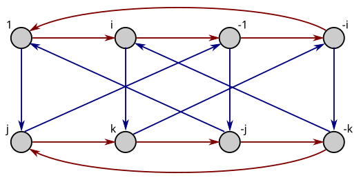

+++

The subgroup $⟨i⟩$ is $\{1, i, -1, -i\}$. The only left coset is $j⟨i⟩$ is $\{j, k, -j, -k\}$. The right coset $⟨i⟩j$ is $\{j, -k, -j, k\}$, the same, so this is a normal subgroup.

+++

> (b) Let's determine whether $Q_4$ is a direct product of $⟨i⟩$ with some other subgroup $A < Q_4$. What size must $A$ be?

+++

Four, because the number of elements in a direct product is the product of the number of elements in the factors.

+++

> (c) Based on part (b), what are the possibilities for $A$?

+++

Only $C_4$. It looks like $V_4$ is the right size but is not a subgroup.

+++

> (d) Is $Q_4$ a direct product $⟨i⟩ × A$ for some $A$? If so, what is $A$? If not, why not?

+++

It's not a direct product for any $A$, because $⟨i⟩ × C_4$ is not isomorphic to $Q_4$.

+++

### Exercise 7.10

+++

> Explain succinctly why A₄ is not a direct product ⟨x⟩ × A, ⟨y⟩ × A, or ⟨z⟩ × A for any group A.

All of ⟨x⟩, ⟨y⟩, and ⟨z⟩ are subgroups of order 2, and because |C × A| = |C|*|A| we know that the order of A must be 6. We also know that both C and A are subgroups (actually normal subgroups) of C × A. Because we know from Exercise 6.31 that there are no order 6 subgroups of A₄, we can say that none of ⟨x⟩ × A, ⟨y⟩ × A, or ⟨z⟩ × A can be valid direct products.

+++

### Exercise 7.11

+++

> Come up with a way to take any positive whole number n and create a group whose Cayley diagram requires at least n arrow types.

Take a direct product between n copies of C₂.

+++

### Exercise 7.12

+++

> Prove that A ⊲ A × B and B ⊲ A × B. You may find the equations on page 128 useful for an algebraic argument, or Figure 7.14 for a visual one.

+++

Assume we can generate all of A from one generator (it is a cyclic group). If so, we only need to show $⟨a⟩g = g⟨a⟩$ (i.e. $Hg = gH$) for all $g$ actions in $A×B$. If the elements of $A × B$ have the form $(a,b)$ this amounts to showing $⟨(a,e)⟩(a,b) = (a,b)⟨(a,e)⟩$, which is easy to show based on algebra similar to that on page 128. To be completely clear (see also [Normal subgroup](https://en.wikipedia.org/wiki/Normal_subgroup)), we must have that $(a_n,e)(a,b) = (a,b)(a_n,e)$ for all $(a,b) ∈ G$ and $a_n ∈ A$ where $a_n$ is a power of $a$.

To show $A ⊲ A × B$ for a non-cyclic group $A$, we need to consider more generators. Call the A generators $⟨a₀, a₁, ...⟩$. We can say $⟨(aₙ,e)⟩(e,bₙ) = (e,bₙ)⟨(aₙ,e)⟩$ for every generator $aₙ$ in $A$ based on logic similar to that of page 128, making this subgroup normal. That is, we did not need to assume a cyclic group (it's just an easier place to start).

+++

### Exercise 7.13

+++

> Draw a representative portion of the infinite Cayley diagram for the group Z₂.

+++

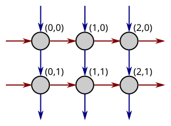

+++

## 7.6.2 Semidirect products

+++

### Exercise 7.14 (📑)

+++

> (a) Create and diagram the rewiring group for $C_5$.

+++

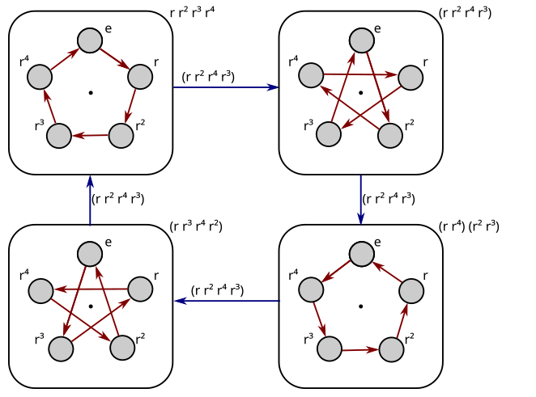

+++

See also [Stellation](https://en.wikipedia.org/wiki/Stellation).

+++

> (b) Create and diagram the rewiring group for $C_7$.

+++

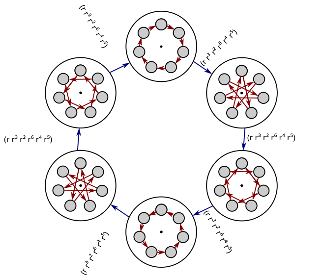

+++

> (c) What conjecture would you make about rewiring groups for $C_p$, when $p$ is prime?

+++

The rewiring group is of order $p - 1$. We'll learn later the correct term for a "rewiring group" is an [Automorphism group](https://en.wikipedia.org/wiki/Automorphism_group). From that page:

> The automorphism group $G$ of a finite [cyclic group](https://en.wikipedia.org/wiki/Cyclic_group "Cyclic group") of [order](https://en.wikipedia.org/wiki/Order_(group_theory) "Order (group theory)") $n$ is [isomorphic](https://en.wikipedia.org/wiki/Group_isomorphism "Group isomorphism") to  $(ℤ/nℤ)^×$, the [multiplicative group of integers modulo *n*](https://en.wikipedia.org/wiki/Multiplicative_group_of_integers_modulo_n "Multiplicative group of integers modulo n") ...

+++

And from [Multiplicative group of integers modulo n](https://en.wikipedia.org/wiki/Multiplicative_group_of_integers_modulo_n):

+++

> The order of the multiplicative group of integers modulo $n$ is the number of integers in $\{0,1, ... , n - 1\}$ coprime to $n$. It is given by [Euler's totient function](https://en.wikipedia.org/wiki/Euler%27s_totient_function "Euler's totient function"): $|(ℤ/nℤ)^×|= φ (n)$ (sequence [A000010](https://oeis.org/A000010 "oeis:A000010") in the [OEIS](https://en.wikipedia.org/wiki/On-Line_Encyclopedia_of_Integer_Sequences "On-Line Encyclopedia of Integer Sequences")). For prime *p*, $φ ( p ) = p - 1$.

+++

> (d) What is the rewiring group of $S_3$?

+++

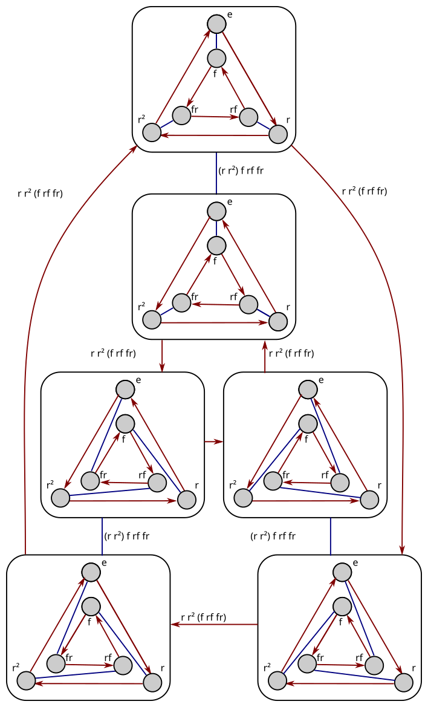

+++

### Exercise 7.15 (📑)

+++

> (a) What is the semidirect product of C₄ with its rewiring group?

+++

What is C₄'s rewiring group? We can reverse the arrows to get one other option, but you can't use r² to get another option in the group. That is, (r r²) (r³) (r⁴) produces a subgroup (isomorphic to C₂) rather than the whole group.

So the rewiring group is C₂:

+++

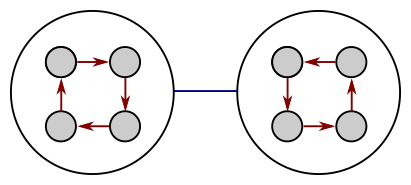

+++

The semidirect product of C₄ with this group (C₄ ⋊ C₂) is D₄.

+++

> (b) What is the semidirect product of C₆ with its rewiring group?

+++

What is C₆'s rewiring group? You can reverse the arrows, but both r² and r³ will produce a subgroup. So the semidirect product is similar to above, but D₆ this time.

+++

> (c) Do you suspect that the semidirect product of C₅ with its rewiring group will follow the pattern suggested by parts (a) and (b)? Why or why not?

+++

It won't follow, because C₅ has a more interesting rewiring group as covered in Exercise 7.14.

+++

> (d) Draw a Cayley diagram of the semidirect product of C₅ with its rewiring group.

+++

With only 2/5 of the blue arrows, to keep the drawing readable:

+++

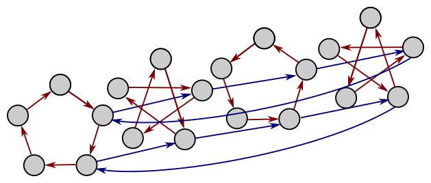

+++

> (e) Think about and then describe (without necessarily drawing it) the Cayley diagram for the semidirect product of C₇ with its rewiring group.

+++

Similar to the above, but seven layers deep and with seven nodes in each layer.

+++

### Exercise 7.16 (📑)

+++

> What is the rewiring group of ℤ?

+++

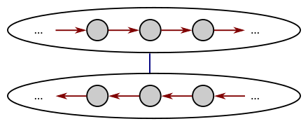

+++

> Compute the corresponding semidirect product group.

+++

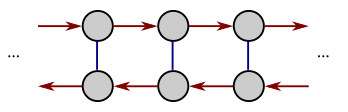

+++

## 7.6.3 Quotients

+++

### Exercise 7.17

+++

> Consider the quotient taken in Figure 7.23.
> (a) What is the subgroup by which the quotient is taken? Where in the figure can you see that subgroup?

V₄, repeated three times.

> (b) What is the order of that subgroup? How does the figure show that order?

Four, in each of the cosets.

> (c) What is the index of that same subgroup? How does the figure show that index?

Three, shown as the three groups of four.

> (d) Does A₄ have any subgroups of order 3? How does the figure show you such a subgroup, or show you that there are not any?

Yes, the blue arrows are a generator of a subgroup of order 3.

> (e) Can A₄ be divided by any of its other subgroups?

Per Exercise 6.31, there are no subgroups of order 6 to divide by. We've already divided by the subgroup of order 4. We can't divide by the group of order 3 as shown in Figure 7.26. A similar operation with a subgroup of order 2 fails:

+++

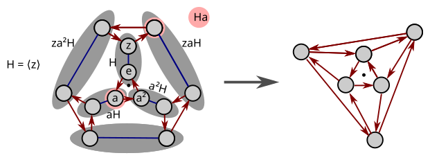

+++

Said another way, the order-2 subgroup is not normal (notice the left and right cosets $aH$ and $Ha$ are not equal, at least one vote against).

+++

### Exercise 7.18 (⚠)

+++

> For each of the following $H$ and $G$ (with $H < G$), attempt the quotient process from Definition 7.5. If it succeeds, show a diagram like Figure 7.20 and state the name of the quotient group. If the quotient operation reveals a direct or semidirect product structure, say which it is and name the factors. If the quotient operation fails, show a diagram like Figure 7.26.

+++

The author's language in this question and throughout the chapter is a bit confusing, because the semidirect product is a generalization of the direct product and therefore it's not an "either or" question of which pattern is revealed. That is, the author uses "direct product" to mean a product that can be modeled by both a direct and semidirect product.

+++

See also the following comment on this exercise in the text:

> We will also see quotients that reveal neither of these patterns, but that nonetheless help us see structure in a large group (e.g., Exercise 7.18).

+++

> (a) $G = C_4, H = ⟨2⟩$

+++

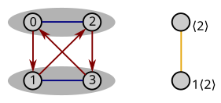

+++

Left  cosets: $⟨2⟩, 1⟨2⟩$ \
Right cosets: $⟨2⟩, ⟨2⟩1$ \
Quotient group: $C_2$

+++

This is our first example of a quotient that cannot be undone by a semidirect product. It's specifically discussed in [Semidirect product § Non-examples](https://en.wikipedia.org/wiki/Semidirect_product#Non-examples).

+++

Notice that the quotient group on the drawing uses as coset representatives the elements $\{0,1\} \in C_4$, which are not a subgroup of $C_4$ (the set is not closed under the original group operations). It may seem somewhat arbitrary that we labeled the nodes in the quotient $\{⟨2⟩, 1⟨2⟩\}$ when we could have chosen alternative names for the cosets, such as $\{2⟨2⟩, 3⟨2⟩\}$. However, see [Quotient group § Definition](https://en.wikipedia.org/wiki/Quotient_group#Definition). We should have been able to choose *any* elements of the original group to represent each coset and still seen that e.g. $\{2⟨2⟩, 3⟨2⟩\}$ was a group and it is; the quotient group.

+++

For example, in the quotient group we have that $2⟨2⟩·3⟨2⟩ = (2·3)⟨2⟩ = 1⟨2⟩ = 3⟨2⟩$. We color the quotient group's generator $1⟨2⟩$ yellow on the right in the drawing above to make it clear that's a different generator than either $1$ or $2$ used on the left of the diagram (red and blue). It's also different than $3$:

+++

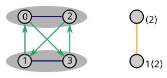

+++

We chose the representatives $\{0,1\}$ only because they looked the "smallest" when in fact the elements are unordered; we could have chosen any others and would likely have done so if the labeling happened to be different.

+++

Choosing $2⟨2⟩$ for the node label of the first coset doesn't make sense because then the identity would not become part of the quotient group. With that choice the $\{⟨2⟩, 3⟨2⟩\}$ quotient node labels would be less natural because they use $r^{-1}$ ($r^3$) to define the potential group rather than $r$. Still, we should check that all alternative generators don't produce a group, and $\{0, 3\}$ is not a subgroup.

+++

A tempting way to see this example is that $C_4$ has only one subgroup isomorphic to $C_2$, which we divided out. It doesn't have any subgroups $C_2$ left to make it any kind of product $C_2 ⋊ C_2$. This is an incorrect way of reasoning, however, because as we'll see later the quotient group doesn't have to be a subgroup of the original group. Subgroups and quotient groups are two ways to make a smaller group out of a larger one, but they work differently. From [Quotient group](https://en.wikipedia.org/wiki/Quotient_group):

> The [dual](https://en.wikipedia.org/wiki/Duality_(mathematics) "Duality (mathematics)") notion of a quotient group is a [subgroup](https://en.wikipedia.org/wiki/Subgroup "Subgroup"), these being the two primary ways of forming a smaller group from a larger one. Any normal subgroup has a corresponding quotient group, formed from the larger group by eliminating the distinction between elements of the subgroup. In [category theory](https://en.wikipedia.org/wiki/Category_theory "Category theory"), quotient groups are examples of [quotient objects](https://en.wikipedia.org/wiki/Quotient_object "Quotient object"), which are [dual](https://en.wikipedia.org/wiki/Dual_(category_theory) "Dual (category theory)") to [subobjects](https://en.wikipedia.org/wiki/Subobject "Subobject").

+++

To form a semidirect product the author typically rearranges the elements inside the dark grey regions (the subgroup $\{0,2\}$ and its cosets in this case) but when we're dividing by a group isomorphic to $C_2$ there's no opportunity to rearrange. From [Quotient group § Properties](https://en.wikipedia.org/wiki/Quotient_group#Properties):

+++

> Given $G$ and a normal subgroup ⁠$N$, then $G$ is a [group extension](https://en.wikipedia.org/wiki/Group_extension "Group extension") of $G/N$ by $N$⁠. One could ask whether this extension is trivial or split; in other words, one could ask whether $G$ is a [direct product](https://en.wikipedia.org/wiki/Direct_product_of_groups "Direct product of groups") or [semidirect product](https://en.wikipedia.org/wiki/Semidirect_product "Semidirect product") of $N$ and $G  /N$⁠. This is a special case of the [extension problem](https://en.wikipedia.org/wiki/Extension_problem "Extension problem"). An example where the extension is not split is as follows: Let $G = Z_4 = \{0, 1, 2, 3\}$⁠, and ⁠$N = \{0, 2\}$⁠, which is isomorphic to $Z_2$. Then $G/N$ is also isomorphic to $Z_2$. But $Z_2$ has only the trivial [automorphism](https://en.wikipedia.org/wiki/Automorphism "Automorphism"), so the only semi-direct product of $N$ and $G/N$ is the direct product. Since $Z_4$ is different from ⁠$Z_2×Z_2$⁠, we conclude that $G$ is not a semi-direct product of $N$ and ⁠$G/N$.

+++

> (b) $G = V_4$ with generators named $a$ and $b$, $H = ⟨a⟩$

+++

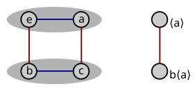

+++

Left  cosets: $⟨a⟩, b⟨a⟩$ \
Right cosets: $⟨a⟩, ⟨a⟩b$ \
Quotient group: $C_2$ \
Direct product $C_2 \times C_2$

+++

It may be tempting to see the quotient group as "corresponding" to $⟨b⟩$, but this is incorrect because in general a quotient group does not need to be a subgroup of the original group. The quotient group also does not correspond to $⟨c⟩$ in the original group:

+++

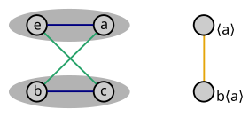

+++

> (c) $G = C_{10}, H = ⟨2⟩$

+++

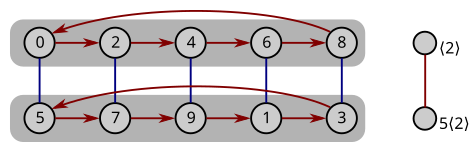

+++

Left  cosets: $⟨a⟩, b⟨a⟩$ \
Right cosets: $⟨a⟩, ⟨a⟩b$ \
Quotient group: $C_2$ which does *not* correspond to any one of $⟨5⟩$, $⟨7⟩$, $⟨9⟩$, $⟨1⟩$, or $⟨3⟩$ in the original group \
Direct product $C_2 × C_5$

+++

If we were to take the quotient of $C_∞$ by $⟨2⟩$, we'd remove an infinite number of order-2 subgroups from the original group.

+++

> (d) $G = D_4, H = ⟨r^2⟩$

+++

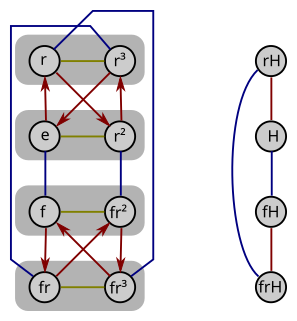

+++

See Exercise 5.40 for a visual $D_4$.

+++

Left cosets: $⟨r²⟩, r⟨r²⟩, f⟨r²⟩, fr⟨r²⟩$ \
Right cosets: $⟨r²⟩, ⟨r²⟩r, ⟨r²⟩f, ⟨r²⟩fr$ \
Quotient group: $V_4$

+++

This is another example of a quotient that can't be undone by a semidirect product. To form a semidirect product the author typically rearranges the elements inside the dark grey regions (the subgroup $\{e,r²\}$ and its cosets) but in this case that's only $C_2$ so there's no opportunity to rearrange. We can actually see the pattern in part (a)'s drawing at the bottom of part (d)'s drawing.

+++

This group can be constructed as a semidirect product, and even of the form $V_4 ⋊_\phi C_2$ for various $\phi$. To see one, fold down the top-most and fold up the bottom-most row in the drawing above and try some new generators $fr$ and $rf$:

+++

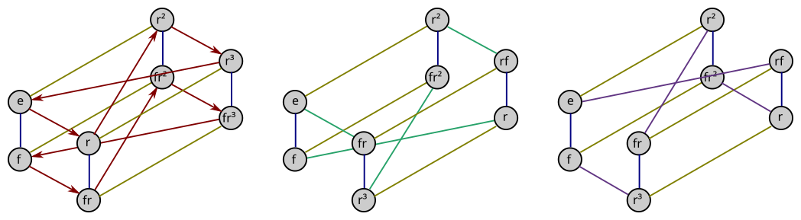

+++

The previous drawings suggest a way to divide out the normal subgroup $⟨fr, r^2⟩$ but others suggest a way to divide out the normal subgroup $⟨f, r^2⟩$:

+++

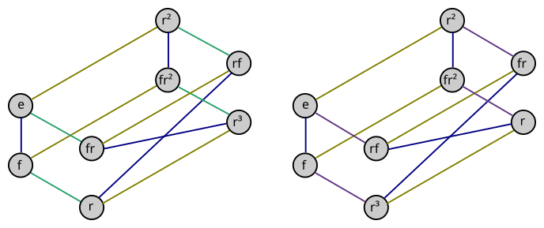

+++

> (e) $G = D_4, H = ⟨f⟩$

+++

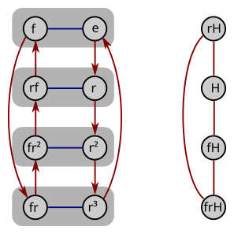

+++

See Exercise 5.40 for a visual $D_4$.

+++

Left cosets: $⟨f⟩, r⟨f⟩, r²⟨f⟩, fr⟨f⟩$ \
Right cosets: $⟨f⟩, ⟨f⟩r, ⟨f⟩r², ⟨f⟩r³$

The quotient operation failed.

+++

> (f) The group $G$ shown in the Cayley diagram below, with $H$ standing for the two-element subgroup generated by the green arrow.

+++

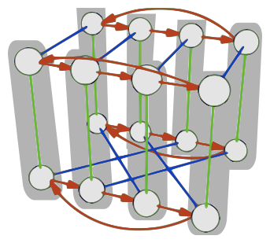

+++

View from the top (or bottom); the quotient operation failed:

+++

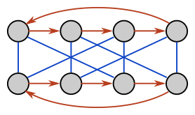

+++

> (g) The group $G$ shown in the same Cayley diagram (above), but this time with $H$ standing for the two-element subgroup generated by the blue arrow.

+++

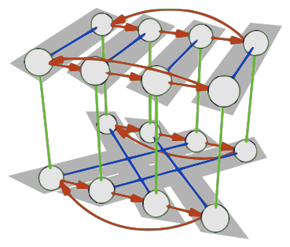

+++

View from the front (or back); the quotient operation failed:

+++

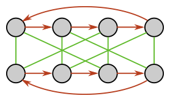

+++

> (h) The group $G$ shown in the Cayley diagram below (sometimes called $G_{4,4}$), with $H$ standing for the two-element subgroup generated by the red arrow.

+++

Let's also label the elements to make them easier to talk about (using $r$ for red, $b$ for blue, and $g$ for green):

+++

<!-- 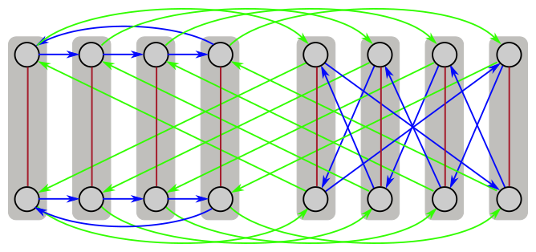 -->
<!-- 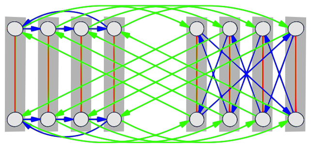 -->

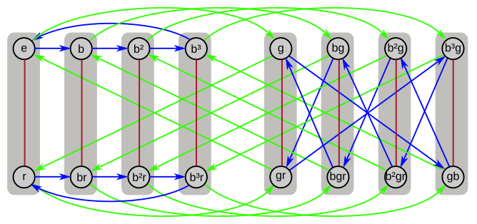

+++

Quotient group $D_4$:

+++

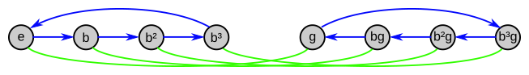

+++

Notice we chose our node names so that $b ↔ r$ and $g ↔ f$ in the typical labelling of the nodes in $D_4$.

+++

It appears there is no way to form this group as a semidirect product of other groups. To form a semidirect product the author typically rearranges the elements inside the dark grey regions (the subgroup $\{e,r\}$ and its cosets in this case) but when we're dividing by a group isomorphic to $C_2$ there's no opportunity to rearrange.

+++

A search for $G_{4,4}$ on [List of small groups](https://en.wikipedia.org/wiki/List_of_small_groups#Small_Groups_Library) (it's #31) indicates it has no subgroups isomorphic to $D_4$ (i.e. $D_8$ in that context) so we won't bother to search for it.

+++

### Exercise 7.19

+++

> In any group $G$, the relationships $G ⊲ G$ and ${e} ⊲ G$ are true (where $e$ stands for the identity element).
>
> (a) What is $G/G$?

$\{e\}$

> (b) What is $G/{e}$?

$G$

+++

### Exercise 7.20

+++

> (a) Develop a quotient procedure for multiplication tables. (Hint: You learned last chapter how to expose subgroups and their cosets.) Your procedure should succeed just when the subgroup by which you divide is normal. In that case, the result should be a multiplication table for the quotient group. Take care with how you name the elements in that table.

+++

The first step in the multiplication table quotient procedure is to organize the table's columns (and rows) by the subgroup and its left cosets; this is already done in the two multiplication tables in part (b).

After this organization, the subgroup and its left cosets should be listed underneath the subgroup in the first column of sub-tables (cells). Draw boxes around these cells and number the boxes from 1 to n (where n is the index of subgroup in the group).

Look for the same cells in the first row of sub-tables (cells) of the multiplication table; these are the right cosets of the subgroup. If the same sub-tables are not present, the subgroup is not normal and the quotient operation fails.

If the same sub-tables exist in the first row of sub-tables, number them just as you labeled the first column of sub-tables. Proceed to number the rest of the table using the indices established for the first column.

Collapse the sub-tables into a multiplication table (using the assigned sub-tables indices) to reveal the quotient group.

+++

> (b) Test your procedure on the following two multiplication tables. The left table is a multiplication table for S₃ organized by the normal subgroup ⟨r⟩. The right table is the same table, but organized by the non-normal subgroup ⟨f⟩.
>
> 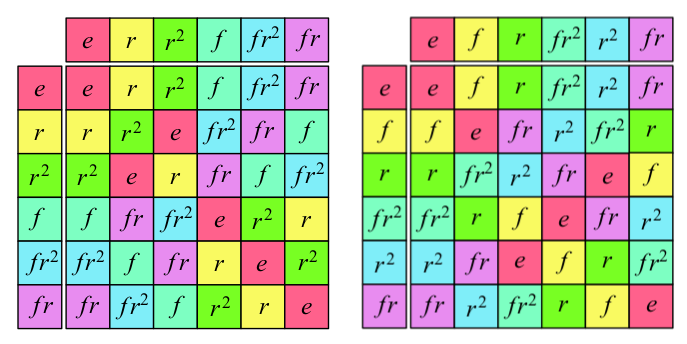

+++

Let's take the quotient of S₃ by the subgroup H = ⟨r⟩, using the table on the left above:

+++

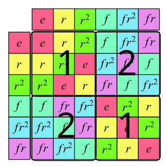

+++

The quotient group is C₂:

+++

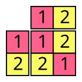

+++

The same approach with the table on the right fails:

+++

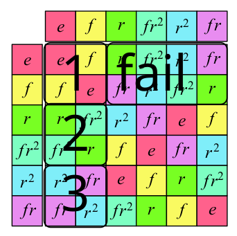

+++

> (c) Choose one of the groups from Exercise 7.18, create a multiplication table for it, and apply your technique to one of its subgroups. Was the subgroup normal? If so, what was the quotient group?

+++

We'll just suggest the answer to part (a), which will also result in $C_2$ given above:

+++

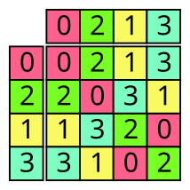

+++

> (d) Write your technique down carefully and clearly, using some of your work from this exercise as examples to illustrate your explanation.

+++

See above; it's not clear how this question is asking us to expand on that answer.

+++

### Exercise 7.21 (📑)

+++

> Explain why every subgroup of an abelian group is normal.

For a subgroup to be normal, all left cosets must equal the corresponding right coset. That is, for all g in G:

$$
gH = Hg
$$

Because the group is abelian, we know that for any H:

$$
gH = g\{e, h₁, h₂, ..\} = \{ge, gh₁, gh₂, ..\} = \{eg, h₁g, h₂g, ..\} = \{e, h₁, h₂, ..\}g = Hg
$$

+++

### Exercise 7.22

+++

> Is every quotient of an abelian group also abelian? Explain why. (Your answer to Exercise 7.20 may help.)

Yes; if the multiplication table was symmetric before it will remain so after the quotient operation.

+++

### Exercise 7.23

+++

> (a) Prove that if H < G and [G : H] = 2, then H ⊲ G.

If [G : H] = 2 then H only has one left coset, which must contain all elements in G that are not in H. By the same logic, there must be one right coset with all elements in G that are not in H; therefore the right and left cosets must be the same (containing all elements not in H).

> (b) What will be G/H in this case? Justify your answer.

C₂, because there is only one group of order 2.

> (c) What relationship does [G: H] have with |G/H| in general?

If $G/H$ exists, then $|G/H|$ should equal $[G: H]$ because $[G: H] = |G|/|H|$ and the quotient operation collapses $|H|$ elements into 1 in every coset.

+++

### Exercise 7.24

+++

> Recall the group ℚ (under addition) and the group ℚ* (under multiplication) introduced in Exercise 4.33.
>
> (a) Describe the quotient group ℚ/⟨1⟩

All the rational numbers greater than or equal to zero and less than one. The identity element is zero. The operation is addition module one.

We're dividing an infinite size group by an infinite size group to get an infinite size group. See also [Infinite set](https://en.wikipedia.org/wiki/Infinite_set) for thoughts on different infinities.

> (b) Describe the quotient group ℚ*/⟨-1⟩

All the rational numbers greater than zero. The identity element is one. The operation is still multiplication.

+++

## 7.6.4 Normalizers

+++

### Exercise 7.25 (📑)

+++

> Compute the normalizer of H in G for each of the following cases. None of these requires drawing; all are possible by thinking (and perhaps using your mind's eye).
>
> (a) G = C₉, H = ⟨3⟩

C₉

> (b) G is any group and H = G

G

> (c) G is any group and H = {e}

G

> (d) G = Dₙ and H = ⟨r⟩

Dₙ

+++

### Exercise 7.26

+++

> Illustrate the normalizer of H in G in each of the following cases, as Figure 7.29 did for ⟨f⟩ < D₆.
>
> (a) G = D₃, H = ⟨f⟩

+++

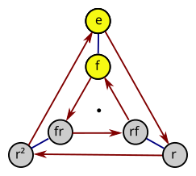

+++

See also [Centralizer and normalizer § Example](https://en.wikipedia.org/wiki/Centralizer_and_normalizer#Example).

+++

> (b) G = D₄, H = ⟨f⟩

+++

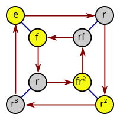

+++

> (c) G = D₄, H = ⟨f, r²⟩

+++

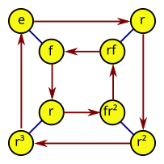

+++

> (d) G = D₅, H = ⟨f⟩

+++

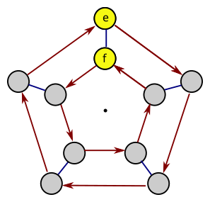

+++

### Exercise 7.27

+++

> From what you observed as you did Exercise 7.26, can you say for which $n$ the normalizer $N_{D_n}(〈f〉)$ is not equal to $〈f〉$?

+++

When $n$ is odd.

+++

## 7.6.5 Conjugacy

+++

### Exercise 7.28

+++

> What is the result of conjugating an element by itself?

The element, because g(g)g⁻¹ = g. That is, every element is conjugate with itself.

+++

### Exercise 7.29

+++

> Show that all of an element's conjugates have the same order as the element.

The order of an element $h$ is the smallest possible integer $m$ such that $h^m = e$. The order of any conjugate $ghg⁻¹$ is the smallest possible integer m such that $(ghg⁻¹)^m = e$. We can simplify this second equation to:

$$
(ghg⁻¹)^m = (ghg⁻¹)(ghg⁻¹)(ghg⁻¹) ... = gh^mg⁻¹ = e
$$

Premultiplying by $g^{-1}$ and postmultiplying by $g$:

$$
\begin{align}
gh^mg⁻¹ &= e \\
h^m &= g⁻¹eg \\
h^m &= e
\end{align}
$$

So for both $h$ and all its conjugates, the order of the element is the smallest possible integer $m$ such that $h^m = e$.

+++

### Exercise 7.30

+++

> For each group below, an element has been singled out. Describe the conjugacy class of that element.
>
> (a) $r ∈ D_3$

+++

A single rotation of a triangle and its reverse $\{r, r²\}$. An exhaustive/brute-force review of the conjugates of $r$:

$$
\begin{align}
(r)r(r)⁻¹ &= r \\
(e)r(e)⁻¹ &= r \\
(r^2)r(r^2)⁻¹ &= r \\
(f)r(f)⁻¹ &= r² \\
(fr)r(fr)⁻¹ &= r² \\
(rf)r(rf)⁻¹ &= r²
\end{align}
$$

+++

> (b) $r^k ∈ D_n$

+++

Assume $k < n$; if $k ≥ n$ we can easily find an alias for it by subtracting $n$. Conjugate by all the powers $r^m$ where $m < n$:

$$
(r^m)r^k(r^m)^{-1} = r^k
$$

+++

Conjugate by all the powers $fr^m$ where $m < n$:

$$
(fr^m)r^k(fr^m)^{-1} = fr^kf = r^{-k}
$$

+++

The last equality comes from continuing the following pattern:

$$
\begin{align}
frf &= r^{-1} \\
(frf)^2 &= r^{-2} \\
(frf)^2 &= (frf)(frf) = fr²f
\end{align}
$$

+++

So the conjugacy class is a single rotation $r^k$ of an $n$-gon and the same action from the flipped perspective ($r^{n-k}$ or $r^{-k}$).

As a special case, if we have that both $n$ is even and $k = n/2$ then $r^{n-k} = r^k$. For example, $r^2$ is in its own conjugacy class in $D_4$.

+++

> (c) $m ∈ C_n$

+++

$C_n$ is an abelian group (see Exercise 7.31 part (c)) so every element is in its own conjugacy class. In this case, the conjugacy class of $m$ is just $\{m\}$.

+++

> (d) A 90-degree clockwise rotation about one face in the group of symmetries of the cube

+++

See the section "Conjugacy classes" in [Octahedral symmetry § Details](https://en.wikipedia.org/wiki/Octahedral_symmetry#Details). The relevant row is:

> 6× rotation by 90° about a 4-fold axis

See [Rotational symmetry](https://en.wikipedia.org/wiki/Rotational_symmetry) for the meaning of "$n$-fold" in this context. See [Full octahedral group - Wikiversity](https://en.wikiversity.org/wiki/Full_octahedral_group) for visualizations of each on a JF compound.

So the conjugacy class of this move is all the 90-degree clockwise rotations about any of the six faces of the cube.

+++

> (e) A 180-degree clockwise rotation about one face in the group of symmetries of the cube

+++

A 180-degree clockwise rotation about three of the faces of the cube.

+++

> (f) The permutation interchanging $1$ and $2$ in $S_n$ (with $n ≥ 2$)

+++

You can take the conjugate of this permutation $σ$ with a permutation $τ$ that switches element $1$ with any element $i ≤ n$ and $2$ with any element $j ≤ n$ (we must also have $i ≠ j$ to still have a bijection). We know that the transposition $τ$ is in $S_n$ because it has all permutations. Therefore, this permutation is conjugate to at least the transposition of any two elements in $S_n$.

+++

In fact, any permutation $τ$ (whether a transposition or not) will not affect any other element but the $i$ and $j$ that get switched into position $1$ and $2$ because the full conjugation operation $ρ$ will undo what it does with the action $τ$ by the action $τ^{-1}$ for all other elements. Therefore the conjugacy class of $\sigma$ is also only the transpositions.

+++

> (g) The following permutation in $S_n$ (for $k ≤ n$):
>
> $(123⋯k)⋯n$

+++

You can take the conjugate of this permutation $σ$ with the cyclic permutation $τ$ of length $k + 1$ to get a permutation of length $k$ at a different position (on different elements of the set). Therefore this permutation is conjugate to many adjacent cyclic permutations of length $k$. If we take the conjugate with any non-adjacent length-$k$ cyclic permutation $τ$ where we line up the elements of the single cycle in $σ$ with the elements of the single cycle in $τ$ would allow us to construct non-adjacent cycles. Think of $τ$ as a "translation" permutation; $τ$ lines up elements to be operated on by $σ$ and $τ^{-1}$ translates back and puts those that weren't operated on by $σ$ back where it got them.

+++

In fact, conjugating by any permutation $τ$ can only affect those elements that are operated on by $σ$; those that aren't operated on by $σ$ will be put back by $τ^{-1}$ to the place that $τ$ got them from. Those that are operated on by $σ$ will be un-renamed by $τ^{-1}$ in the opposite way that $τ$ renamed them, so that conjugation by any permutation $τ$ will only be able to produce other permutations $ρ$ that are $k$-cycles.

+++

### Conjugation and cycle structure

+++

See [abstract algebra - Why are two permutations conjugate iff they have the same cycle structure?](https://math.stackexchange.com/questions/48134/why-are-two-permutations-conjugate-iff-they-have-the-same-cycle-structure) for a proof of a more general concept:

> I have heard that two permutations are conjugate if they have the same cyclic structure. Is there an intuitive way to understand why this is?

While it's only true in $S_n$ that if two elements have the same cycle structure they are conjugate, the converse is true in any group: if two elements are conjugate they have the same cycle structure. Therefore another way to show that two elements of a group are not conjugate is to show that they do not have the same cycle structure (though this would require embedding the group in some $S_n$ to reveal a cycle structure). The source SVGs for the rasters in that answer:

+++

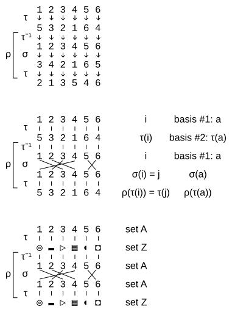

+++

The symbols in the answer come from [Geometric Shapes (Unicode block)](https://en.wikipedia.org/wiki/Geometric_Shapes_(Unicode_block)) (generally a good source of symbols when you want to define an abstract set).

+++

Another useful perspective on this proof is to see the "cycle structure" permutation as the only alibi permutation, and all others as alias permutations.

+++

Are generators equivalent to the basis vectors in linear algebra? The [Basis disambiguation page - Wikipedia](https://en.wikipedia.org/wiki/Basis) specifically links to the article [Generating set of a group](https://en.wikipedia.org/wiki/Generating_set_of_a_group).

+++

### Exercise 7.31

+++

> Compute the class equations for the following groups.
>
> (a) C₃

This is an abelian group, so:

```
1 + 1 + 1 = 3
```

+++

> (b) V₄

This is an abelian group, so:

```
1 + 1 + 1 + 1 = 4
```

+++

> (c) any abelian group of order n

```
1 + 1 + 1 ... = n
```

+++

> (d) S₃

See logic in Exercise 7.30a; we can see this group as $D_3$. Therefore $r²$ is conjugate to $r$; we'll call this conjugacy class 3A (see the last paragraph of [Conjugacy class § Definition](https://en.wikipedia.org/wiki/Conjugacy_class#Definition) for the "3A" language).

We can see $fr$ is conjugate to $f$:

$$
(r)f(r)⁻¹ = rfr² = r²f = fr
$$

And $rf$ is conjugate to $fr$:

$$
(r)fr(r)⁻¹ = rf
$$

Therefore we have conjugacy class 2A that includes at least $\{f, rf, fr\}$. Is this group conjugate with the conjugacy class 3A we already discovered? No, because we showed that $r$ is not conjugate to any element but $r^2$ in Exercise 7.30a. We could also confirm this by checking the order of the elements don't match:

$$
\begin{align}
|e| = 1 \\
|r| = |r²| = 3 \\
|f| = |fr| = |rf| = 2
\end{align}
$$

To summarize:

```
1 + 2 + 3 = 6
```

+++

> (e) Q₄ (as in Exercises 4.4 and 7.9)

+++

We can quickly confirm that $-i$ is conjugate to $i$ (call this 4A):

$$
(j)i(j)⁻¹ = -i
$$

$-j$ is conjugate to $j$ (call this 4B):

$$
(i)j(i)⁻¹ = -j
$$

$-k$ is conjugate to $k$ (call this 4C):

$$
(i)k(i)⁻¹ = -k
$$

And $-1$ is conjugate to $-1$ (call this 2A):

$$
(j)-1(j)⁻¹ = -1
$$

+++

Clearly 2A cannot be merged with any other class because of its order. How do we know that e.g. 4A can't be merged with 4B, though? Checking that e.g. $i$ is not conjugate to $j$ by conjugating by some element $q_1 ∈ Q_4$ would not prove that these classes are disjoint, only that this particular element is not conjugate to the other by switching our context to $q_1$.

+++

Just because we show that $i$ is not conjugate to $j$ doesn't mean that we can't perform something similar to $i$ via a $j$ operation by conjugating with some $q_2$ other than the $q_1$ we tested with (see an example of this in Exercise 7.30a, where $r$ is in the same class as $r^2$ but it takes several tests to establish this). Said in the language of the author's "doing the same thing in another context" analogy, there's a difference between whether you *can* achieve something in another context and whether you will. You need to discover the specific $g ∈ G$ in your group $G$ that lets you achieve the same elsewhere. Not any will work.

+++

One way to describe what we need is an algorithm to discover [Connected components](https://en.wikipedia.org/wiki/Connected_component). Per [Connected components (graph theory) - Wikipedia](https://en.wikipedia.org/wiki/Component_(graph_theory)), this can be done efficiently with something like a [Disjoint-set data structure](https://en.wikipedia.org/wiki/Disjoint-set_data_structure). We could have even used a disjoint set data structure with the orders of the elements, then created disjoint data structures at that point from every element of a given order. Said another way, you start with every element in its own class (i.e. $1 + 1 + 1 + ... = n$) and then slowly merge classes/sets.

+++

At an abstract level we’re disambiguating words. When we show two words are joint, it makes our lives easier because we can reduce the number of words we talk in. When we show two words are disjoint we can totally disregard one when talking about another. We use the language “up to'' in this kind of scenario (see Exercise 7.36). As an example, we would say $r$ and $r_3$ are equivalent up to conjugacy in $D_4$. The “up to” language can be dangerous, however, often equating elements of a set that may best be left un-conflated. For example, what if you have two people who are equivalent “up to” height and eye color? They’re likely much different in many other ways (gender, age, etc.) so that this kind of distinction is unhelpful. Considering height and eye color as columns in a table of observations, you can essentially say two elements are equivalent “up to” in at least one way whenever at least two columns match. Correlation does not imply equivalence, even less so than it implies causation.

+++

At this point, we don't have a great way to prove that 4A, 4B, and 4C are disjoint conjugacy classes except by brute force. A good library for quaternions in python (if you need speed i.e. in an industrial application) is likely [moble/quaternion: Add built-in support for quaternions to numpy](https://github.com/moble/quaternion); this library is also mentioned in [Quaternions and spatial rotation](https://en.wikipedia.org/wiki/Quaternions_and_spatial_rotation). We'll avoid an extra install and use the `Quaternion` from [Algebras - SymPy 1.13.0rc2 documentation](https://docs.sympy.org/latest/modules/algebras.html).

```{code-cell} ipython3
from sympy import Quaternion

one = Quaternion(1, 0, 0, 0)
i = Quaternion(0, 1, 0, 0)
j = Quaternion(0, 0, 1, 0)
k = Quaternion(0, 0, 0, 1)
```

```{code-cell} ipython3
one*i*one
```

```{code-cell} ipython3
-one*i*-one
```

```{code-cell} ipython3
i*i*-i
```

```{code-cell} ipython3
-i*i*i
```

```{code-cell} ipython3
j*i*-j
```

```{code-cell} ipython3
-j*i*j
```

```{code-cell} ipython3
k*i*-k
```

```{code-cell} ipython3
-k*i*k
```

With this, we've shown that 4A is a closed conjugacy class; it won't be merged with either 4B or 4C. Why don't we need to check for transitive conjugacy relationships? More specifically, why don't we need to check that $-i$ (the other element in this conjugacy class) is not conjugate to any other $g$ in $G$? More generally, why isn't it possible that after computing that $g_1$ is conjugate to $g_2$ that we later discover that $g_2$ is conjugate to $g_3$ and we need to merge the conjugacy classes? See Exercise 7.36c below. As long as we compute the conjugate of $g_1$ with respect to all $g$ in $G$, we would already have discovered the conjugate relationship between $g_1$ and $g_3$ with the element $h_3$ (if it exists).

+++

We won't show that 4B is disjoint from 4C only because the work would be tedious, but it would be the final step in this proof. That is, we would not need to show that 4B or 4C is not conjugate to any element in 4A.

+++

To summarize:

```
1 + 2 + 2 + 2 + 1 = 8
```

+++

> (f) D₄

+++

We'll start by checking the orders to try to identify which elements could be in the same conjugacy classes:

+++

```
|e| = 1
|r| = |r³| = 4
|f| = |fr²| = |rf| = |fr| = |r²| = 2
```

+++

r³ is conjugate to r (call this 4A):

$$
(f)r(f)⁻¹ = frf = r³
$$

+++

We know that $r²$ is not conjugate to any of the $fr^m$ for any $m$ based on logic in Exercise 7.30b (call this 2A).

+++

$fr²$ is conjugate to $f$ (call this 2B):

$$
(r)f(r)⁻¹ = rfr³ = fr²
$$

$rf$ is conjugate to $fr$ (call this 2C):

$$
(r)fr(r)⁻¹ = rf
$$

+++

Conjugate all the powers $fr^m$ by $r^k$ with $m,k$ arbitrary:

$$
(r^k)fr^m(r^k)^{-1} = r^kfr^kr^{-k}r^mr^{-k} = r^kfr^kr^{m-2k} = fr^{m-2k}
$$

+++

The last equality comes from continuing the following pattern:

$$
\begin{align}
rfr &= f \\
rrfrr &= rfr \\
r^2fr^2 &= f \\
\end{align}
$$

+++

Conjugate all the powers $fr^m$ by $fr^k$ with $m,k$ arbitrary:

$$
(fr^k)fr^m(fr^k)^{-1} = fr^kfr^kr^{-k}r^mr^{-k}f = fr^kfr^kr^{m-2k} = ffr^{m-2k}f = r^{m-2k}f = r^{m-2k}fr^{m-2k}r^{2k-m} = fr^{2k-m}
$$

+++

Because the $m$ in $fr^{2k-m}$ is arbitrary, this term is equivalent to $fr^{m-2k}$. From all of the preceding, we can conclude that $fr^m$ for an arbitrary $m$ is only conjugate to $fr^{m-2k}$ i.e. to other elements of the same [Parity (mathematics)](https://en.wikipedia.org/wiki/Parity_(mathematics)). Therefore 2B and 2C are distinct conjugacy classes.

+++

To summarize:

+++

1 + 2 + 1 + 2 + 2 = 8

+++

### Exercise 7.32

+++

> Let $c$ and $t$ stand for the permutations shown below, members of $S_n$.
>
> \begin{align}
c = (1 ⋯ n) \\
t = (12) ⋯ n
\end{align}
>
> Thus $c$ stands for a cycle of $n$ numbers in order, and $t$ stands for the interchange of just the numbers 1 and 2, leaving the rest alone. This exercise determines what elements the subgroup $⟨c, t⟩$ of $S_n$ contains.
>
> (a) What is the conjugate of $t$ by $c$, written $ctc^{-1}$? What is the conjugate of $t$ by $c^k$, for any $k$ up to $n$?

+++

In this question, the author essentially works us through the logic in [Cyclic permutation § Transpositions](https://en.wikipedia.org/wiki/Cyclic_permutation#Transpositions). He explicitly includes a cycle $c$ when we could (alternatively) use many transpositions to generate the group (see [Symmetric group § Generators and relations](https://en.wikipedia.org/wiki/Symmetric_group#Generators_and_relations)).

+++

We'll use the author's composition convention, which conflicts with the convention of [Permutation § Composition of permutations](https://en.wikipedia.org/wiki/Permutation#Composition_of_permutations). To make this choice clear, we'll use ⨟ between terms rather than simple concatenation. The combination of our active/passive and composition conventions means we use what is called an "Active right" convention in [Permutation notation](https://en.wikiversity.org/wiki/Permutation_notation). In [Permutation matrix](https://en.wikipedia.org/wiki/Permutation_matrix), this is equivalent to the column representation.

+++

$$
\begin{align}
c = (1 ⋯ n) &= 234...n1 \\
t = (21) ⋯ n &= 2134...n \\
c⨟t = (1)(2 ⋯ n) &= 134...n2 \\
c^{-1} = (n⋯321) &= n123...n-1 \\
c⨟t⨟c^{-1} = (1n)2⋯(n-1) &= n23...1 \\
c^2⨟t = (135⋯n)(246⋯(n-1)) &= 345...n21 \\
c^2⨟t⨟c^{-2} = 123⋯n((n-1)n) &= 123...n(n-1) \\
\end{align}
$$

+++

While $t$ switches elements 0 and 1, $ctc^{-1}$ switches elements $n-1$ and $0$, and $c^2t(c^2)^{-1}$ switches elements $n-2$ and $n-1$. In general $c^kt(c^k)^{-1}$ switches elements $n-k$ and $n-k+1$.

+++

> (b) All the conjugates from part (a) are in $⟨c, t⟩$. Describe that set of conjugate elements.

+++

All permutations that switch two *adjacent* elements (see [adjacent transformations](https://en.wikipedia.org/wiki/Cyclic_permutation#adjacent_transpositions)).

+++

> (c) What is the conjugate of $t$ by the following permutation, which interchanges just the numbers 2 and 3, leaving the rest alone?
>
> $1(23)4⋯n$

+++

We'll call this permutation $s$, but notice that based on part (a) we could generate it as $s = c^{n-2}tc^{-(n-2)}$.

+++

$$
\begin{align}
s⨟t = (123)⋯n &= 2314...n \\
s⨟t⨟s^{-1} = (13)⋯n &= 3214...n
\end{align}
$$

+++

> How could you use two of the elements in $⟨c, t⟩$ to create a permutation that swaps any two numbers from $1$ to $n$, leaving the rest alone?

+++

To create $(02)$ above, we took the conjugate of $(01)$ by $(12)$. To create $(13)$, we would take the conjugate of $(12)$ by $(23)$. You could create all actions to swap elements two steps away from each other with this pattern. You can think of it in general as getting to into a context where the action $01$ is effectively the same action as some other flip (because the appropriate item has been put in the $1$ spot).

To produce $(03)$, we would take the conjugate of $(01)$ by $(13)$. Similarly, to create all actions to swap elements three steps away from each other.

To create $(0k)$, take the conjugate of $(01)$ by $(0k)$. Similarly, to create all actions to swap elements $k$ steps away from each other.

+++

> (d) Describe the set of elements that part (c) shows to be members of $⟨c, t⟩$.

+++

All permutations that switch any two in general *non-adjacent* elements (i.e. all swaps of any two elements).

+++

> (e) What permutation is obtained by doing $t$ followed by the permutation of part (c)? How could you create any cyclic permutation using just elements of $⟨c, t⟩$?

+++

A reversed cycle of length three:

+++

$$
\begin{align}
t⨟s = (12)⨟(23) = (132)4⋯n &= 3124...n
\end{align}
$$

+++

Notice $s⨟t$ above is the forward cycle.

+++

We can create a reversed 4-cycle by appending another transposition:

+++

$$
\begin{align}
t⨟s⨟r = (12)⨟(23)⨟(34) = (1432)4⋯n &= 41235...n
\end{align}
$$

+++

Or a forward 4-cycle by prepending another transposition:

+++

$$
\begin{align}
u⨟t⨟s = (34)⨟(23)⨟(12) = (1234)5⋯n &= 23415...n
\end{align}
$$

+++

By prepending an adjacent transposition in the same manner (not just t, but any transposition we showed in part (d) is part of this group) you can construct any length cyclic permutation.

+++

You can look at a transposition as a cyclic permutation of length 2, so in general prepending a transposition to a cyclic permutation of length $n$ constructs a cyclic permutation of length $n+1$.

+++

> (f) All permutations can be broken into a sequence of non-overlapping cyclic permutations, as in the following example.
>
> $(14)(235) = (14)⨟(235)$
>
> How does this help determine the subgroup $⟨c, t⟩$ of $S_n$? What is that subgroup?

+++

By using some non-adjacent swap permutations you can add "skips" to a cyclic permutation in the sense of $(235)$ skipping $4$. We could call these non-adjacent cycles.

+++

To construct permutations that include one more than one cyclic permutation, we can combine two cyclic permutations as shown above. With the previous observations, this shows we can build any permutation in $S_n$ from $⟨c, t⟩$ (the subgroup is all of $S_n$).

+++

Let's step back and consider what the author is trying to say in all of Exercise 7.32. The immediate lesson is that you can generate any symmetric group with just two generators. Since any group is a subgroup of a symmetric group, does this mean that you can generate any group with just two generators? The short answer is likely no; we need to prevent some elements of the symmetric group from being generated to stay closed with respect to the group we want to generate elements for.

+++

### Exercise 7.33 (🕳️)

+++

> (a) Compute the class equation for the first few dihedral groups $D_n$ with $n$ odd, until you notice a pattern. State the pattern and give some justification for it.

Let's start by looking at the order of elements to see which cannot be in the same conjugacy class.

For D₁ we have:

```
|e| = 1
|f| = 2
```

For D₃ we have:

```
|e| = 1
|r| = |r²| = 3
|f| = |rf| = |r²f| = 2
```

For D₅ we have:

```
|e| = 1
|r| = |r²| = |r³| = |r⁴| = 5
|f| = |rf| = |r²f| = |r³f| = |r⁴f| = 2
```

For D₇ we have:

```
|e| = 1
|r| = |r²| = |r³| = |r⁴| = |r⁵| = |r⁶| = 7
|f| = |rf| = |r²f| = |r³f| = |r⁴f| = 2
```

For D₉ we have:

```
|e| = 1
|r| = |r²| = |r⁴| = |r⁵| = |r⁷| = |r⁸| = 9
|r³| = |r⁶| = 3
|f| = |rf| = |r²f| = |r³f| = |r⁴f| = 2
```

See the notebook linked to from [File:Dihedral-conjugacy-classes.svg](https://commons.wikimedia.org/wiki/File:Dihedral-conjugacy-classes.svg) for full calculations. The elements generated by $r$ are not in the same conjugacy class; the orders of elements as
shown above for $D_9$ show this cannot be the case.

As pointed out in Exercise 7.30(b) the elements generated by $r$ (i.e. $r^k$) are in conjugacy classes of size 2 (because n is even, there is no special case).

All other elements are in the same conjugacy class. The conjugate of $f$ by $r$ is $rfr^{n-1}$ or $fr^{n-2}$. Unlike the standard dihedral relationship $rfr = f$ this rotates the shape in the same direction twice (rather than in one direction, then in reverse). Conjugating by other powers of $r$ similarly rotates the shape double the distance and flips it.

Therefore in general the class equation is:

$$
1 + 2 [(n-1)/2 (repetitions)] + n = 2n
$$

+++

> (b) Compute the class equation for the first few dihedral groups Dₙ with n even, until you notice a pattern. State the pattern and give some justification for it.

For D₂ (V₄) we have:

```
|e| = 1
|r| = 2
|f| = 2
|rf| = 2
```

For D₄ we have:

```
|e| = 1
|r| = |r³| = 4
|r²| = 2
|f| = |rf| = |r²f| = |r³f| = 2
```

For D₆ we have:

```
|e| = 1
|r| = |r⁵| = 6
|r²| = |r⁴| = 3
|r³| = 2
|f| = |rf| = |r²f| = |r³f| = |r⁴f| = |r⁵f| = 2
```

For D₈ we have:

```
|e| = 1
|r| = |r³| = |r⁵| = |r⁷| = 8
|r²| = |r⁶| = 4
|r⁴| = 2
|f| = |rf| = |r²f| = |r³f| = |r⁴f| = |r⁵f| = |r⁶f| = |r⁷f| = 2
```

As pointed out in Exercise 7.30(b) the elements generated by $r$ (i.e. $r^k$) are in conjugacy classes of size 2 in general. Because $n$ is even, there is a special case when $k = n/2$.

See the thoughts above (7.33a) about how to conjugate $f$ to get an action that rotates the $n$-gon in the same direction twice and flips it. When we rotate twice or in general $2k$ times ($r^{2k}$) when the $n$ in $D_n$ is even, we don't ever produce odd rotation powers. This divides the conjugacy class that previously included all terms with $f$ in half. The answer to Exercise 7.31(f) explains the same more algebraically.

Therefore in general the class equation is:

$$
1 + 1 + 2 [n/2 - 1 (repetitions)] + n/2 + n/2 = 2n
$$

+++

> (c) Class equations can be illustrated by coloring the elements of a group according to the sets in the conjugacy class partition, a different color for each set. Illustrate the patterns in each of parts (a) and (b) using colored Cayley diagrams.

+++

See [File:Dihedral-conjugacy-classes.svg](https://commons.wikimedia.org/wiki/File:Dihedral-conjugacy-classes.svg):


+++

> (d) Cycle graphs display element order rather clearly. How is this relevant to conjugacy classes? Use Group Explorer to illustrate the patterns in each of parts (a) and (b) using cycle graphs.

+++

Because cycle graphs show the order of elements, they can help you quickly identify which elements may be in the same conjugacy class.

+++

### Exercise 7.34

+++

> Which of the following equations could be class equations for a group? Find all the groups that have that class equation, if there are any. If there are not any, explain why.
>
> (a) 1 + 2 = 3

The only group of order 3 is cyclic (abelian) for which all conjugacy classes are of order one.

> (b) 1 + 1 + 1 + 1 + 1 = 5

C₅

> (c) 1 + 2 + 3 = 6

S₃ (see Exercise 7.31)

> (d) 1 + 3 + 3 = 7

The only group of order 7 is cyclic (abelian) for which all conjugacy classes are of order one.

> (e) 1 + 3 + 4 = 8

The only groups of order 8 are Q₄ and several cyclic (abelian) groups. For Q₈, see Exercise 7.31 above. All conjugacy classes of an abelian group would be order one.

+++

### Exercise 7.35

+++

> How few elements might $gHg^{-1}$ and $H$ have in common? Find a minimal example and explain how you know it is minimal.

This question could be read in two ways, one where $gHg^{-1}$ is a term defined on a single $g$ and one where $gHg^{-1}$ is shorthand for $gHg^{-1}$ for all $g ∈ G$. The latter interpretation was more common for much of the chapter when we were trying to show that e.g. $H$ is a normal subgroup, but it seems possible the author is referring to $gHg^{-1}$ for a single $g ∈ G$.

Regardless of how the question is read, all subgroups $H$ must contain the identity element $e$. The element $e$ will always be shared between $gHg^{-1}$ and $H$ because $geg^{-1} = gg^{-1} = e$. A trivial example would be $H$ as the trivial subgroup $\{e\}$: in this case $H$ and $gHg^{-1}$ have only one element in common.

Regardless of how the question is read, $gHg^{-1}$ will only contain conjugates of elements in $H$. If $H$ is a normal (i.e. self-conjugate) subgroup then these elements will land in $H$, but otherwise they could land all over the larger group $G$. Therefore to minimize shared elements, we should expect $H$ to be a non-normal subgroup.

Let's say we read the question where we must pick a single $g ∈ G$. If we pick a $g ∈ H$, then because $ggg^{-1} = g$ we'll end up with one more shared element between $gHg^{-1}$ and $H$. To minimize shared elements, we'll want to choose some $g ∉ H$.

Take as an example the subgroup $H = \{e,f\}$ in $S_3$. If we let $g = r$ then we get only one shared element between $gHg^{-1}$ and $H$, namely the unavoidable element $e$. This implies that we can minimally get down to only one element shared between $H$ and the set of conjugates $gHg^{-1}$.

Let's say we read the question where we assume the elements are defined for all $g ∈ G$. All $h ∈ H$ must be shared because $hhh^{-1} = h$. In $S_3$, an example of this is the subgroup $H = 〈f〉$ which has only two elements. Said another way, only $\{e,f\} ∈ G$ will "vote" for this being a normal subgroup and all other elements (e.g. $r$) and cosets (e.g. $rH$) will vote against. In general, the smallest set of elements that may be shared between $gHg^{-1}$ and $H$ is the elements of $H$.

+++

### Exercise 7.36

+++

> An equivalence relation is one that can be used to partition a set; equivalence relations have three properties. This exercise asks you to prove that being a conjugate is an equivalence relation, using algebraic or visual evidence, whichever seems best to you.
>
> (a) Show that being a conjugate is a reflexive relation: Any $g ∈ G$ is conjugate to itself.

See Exercise 7.28 above; conjugating any element by itself will produce the same element.

Alternatively, one can take the conjugate of any element $g$ by $e$ to get the same element.

> (b) Show that being a conjugate is a symmetric relation: If $g_1$ is conjugate to $g_2$ (that is, there is some $h ∈ G$ such that $g_1 = hg_2h^{-1}$), then $g_2$ is also conjugate to $g_1$.

We need to show for some $h_2$ in $G$ that $g_2$ = $h_2g_1h_2^{-1}$. Consider the inverse of the $h$ that was used to show $g_1$ is conjugate to $g_2$; this is an element of $G$ because every element (including $h$) has an inverse.

Set $h_2$ = $h^{-1}$:

$$
g_2 = h^{-1}g_1h = h^{-1}(hg_2h^{-1})h = g_2
$$

If you have unanimous arrows from one coset to another, you should also have unanimous inverse arrows.

> (c) Show that being a conjugate is a transitive relation: If $g_1$ is conjugate to $g_2$, which is conjugate to $g_3$, then $g_1$ is also conjugate to $g_3$.

For some $h_1$ and $h_2$ we have:

$$
\begin{align}
g_1 = h_1g_2(h_1)^{-1} \\
g_2 = h_2g_3(h_2)^{-1}
\end{align}
$$

We need to show for some $h_3$ in $G$ that $g_1 = h_3g_3(h_3)^{-1}$. Consider $h_3 = h_1h_2$:

$$
g_1 = h_1h_2g_3(h_1h_2)^{-1} = h_1h_2g_3(h_2)^{-1}(h_1)^{-1} = h_1g_2(h_1)^{-1} = g_1
$$

If you have unanimous arrows from coset $A$ to coset $B$ and from coset $B$ to coset $C$, you should also have unanimous arrows from coset $A$ to coset $C$.

+++

### Exercise 7.37 (⚠)

+++

> Recall Figure 7.33, which showed that $a$ and $b$ are conjugates in $A_4$. Show that $b$ and $d$ are conjugates as well, by finding an element of $A_4$ by which to conjugate. This can be done algebraically (using a Cayley diagram or multiplication table for $A_4$ as reference) or visually (using Figure 7.32 or an actual tetrahedron for reference). Try to illustrate the conjugation like Figure 7.33 does.

+++

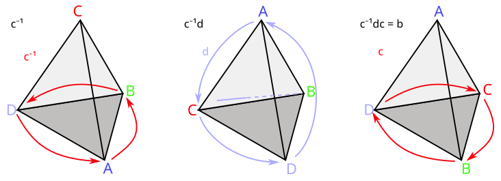
