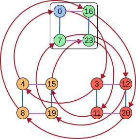
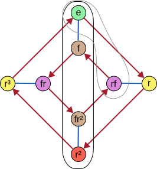
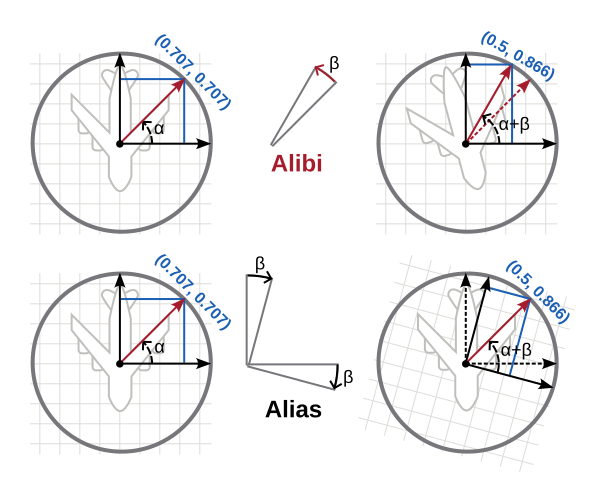

---
jupytext:
  text_representation:
    extension: .md
    format_name: myst
    format_version: 0.13
    jupytext_version: 1.16.1
kernelspec:
  display_name: Python 3 (ipykernel)
  language: python
  name: python3
---

# 7 Products and quotients

+++

## 7.1 The direct product

+++

Compare [Direct product of groups](https://en.wikipedia.org/wiki/Direct_product_of_groups), a special case of a [Direct product](https://en.wikipedia.org/wiki/Direct_product). A [Direct product](https://en.wikipedia.org/wiki/Direct_product) is a special case of a [Product (category theory)](https://en.wikipedia.org/wiki/Product_(category_theory)).

+++

Compare [Normal subgroup](https://en.wikipedia.org/wiki/Normal_subgroup).

+++

## 7.2 Semidirect product

+++

Compare [Semidirect product](https://en.wikipedia.org/wiki/Semidirect_product).

+++

## 7.3 Normal subgroups and quotients

+++

Compare [Quotient group](https://en.wikipedia.org/wiki/Quotient_group). Per that article, we should read $G/N$ as "G mod N" which makes sense given that essentially all of the examples under [Quotient group § Examples](https://en.wikipedia.org/wiki/Quotient_group#Examples) can be seen as a generalization of modular arithmetic. See also [Congruence relation](https://en.wikipedia.org/wiki/Congruence_relation). Unfortunately this clashes with the typical "G divided by N" most people will come to the subject with, and that we'll all continue to use most of the time for the symbol `/`. It's important to mentally pronounce this correctly so you say it and recall the concept correctly; practice with some kind of reminder.

+++

A quotient group is not analogous to the $5$ that's the [integer part](https://en.wikipedia.org/wiki/Quotient#Integer_part_definition) of the quotient $15/3$. If it were, then we could reconstruct the $15$ from the $3$ and $5$, but as we'll see this is not the case. It's tempting to see the problem this way because a normal subgroup and its cosets fit snugly into their parent group.

+++

A quotient group is also not even nicely analogous to the $5$ that's the integer part of the quotient $16/3$. This analogy is a bit better because it's clear that we don't always have a way to take the subgroup ($3$) and quotient ($5$) and reproduce the original group, but reversing this operation with the addition of the recording of the remainder is not difficult. For groups this reversal operation is called the [Extension problem](https://en.wikipedia.org/wiki/Group_extension#Extension_problem) and it may never have an efficient solution.

+++

### Simple groups

+++

On the subject of poor analogies for groups, you may have heard of the [Classification of finite simple groups](https://en.wikipedia.org/wiki/Classification_of_finite_simple_groups). From that article:

+++

> Simple groups can be seen as the basic building blocks of all [finite groups](https://en.wikipedia.org/wiki/Finite_group "Finite group"), reminiscent of the way the [prime numbers](https://en.wikipedia.org/wiki/Prime_number "Prime number") are the basic building blocks of the [natural numbers](https://en.wikipedia.org/wiki/Natural_number "Natural number"). The [Jordan--Hölder theorem](https://en.wikipedia.org/wiki/Jordan%E2%80%93H%C3%B6lder_theorem "Jordan--Hölder theorem") is a more precise way of stating this fact about finite groups. However, a significant difference from [integer factorization](https://en.wikipedia.org/wiki/Integer_factorization "Integer factorization") is that such "building blocks" do not necessarily determine a unique group, since there might be many non-[isomorphic](https://en.wikipedia.org/wiki/Isomorphic "Isomorphic") groups with the same [composition series](https://en.wikipedia.org/wiki/Composition_series "Composition series") or, put in another way, the [extension problem](https://en.wikipedia.org/wiki/Group_extension#Extension_problem "Group extension") does not have a unique solution.

+++

The first sentence of this paragraph analogizes some groups (specifically [simple groups](https://en.wikipedia.org/wiki/Simple_group)) to the prime numbers. This is a relatively poor analogy, and seems to be poor enough to have garnered many votes on the questions and answers to [abstract algebra - How is a group made up of simple groups?](https://math.stackexchange.com/questions/25315/how-is-a-group-made-up-of-simple-groups). There's actually just a special way of breaking down a group into predictable smaller groups; quoting from [Group extension](https://en.wikipedia.org/wiki/Group_extension):

> Since any [finite group](https://en.wikipedia.org/wiki/Finite_group "Finite group") $G$ possesses a [maximal](https://en.wikipedia.org/wiki/Maximal_subgroup "Maximal subgroup") [normal subgroup](https://en.wikipedia.org/wiki/Normal_subgroup "Normal subgroup") $N$ with [simple](https://en.wikipedia.org/wiki/Simple_group "Simple group") [factor group](https://en.wikipedia.org/wiki/Factor_group "Factor group") $G/N$, all finite groups may be constructed as a series of extensions with finite [simple groups](https://en.wikipedia.org/wiki/Simple_group "Simple group"). This fact was a motivation for completing the [classification of finite simple groups](https://en.wikipedia.org/wiki/Classification_of_finite_simple_groups "Classification of finite simple groups").

+++

So if you take a group $G$ you can divide it by its maximal normal subgroup $N$ to get a group you add to a list, and then you keep dividing $N$ using this special technique. The list (series) you'll end up with, all normal groups, is not completely unique to the original group $G$ but at least so up to permutation and isomorphism; see [Composition series § For groups](https://en.wikipedia.org/wiki/Composition_series#For_groups) for details.

+++

See also, from [Quotient group § Properties](https://en.wikipedia.org/wiki/Quotient_group#Properties):

> If $H$ is a subgroup in a finite group $G$, and the order of $H$ is one half of the order of $G$⁠, then $H$ is guaranteed to be a normal subgroup, so $G/H$ exists and is isomorphic to ⁠$C_2$⁠. This result can also be stated as "any subgroup of index 2 is normal", and in this form it applies also to infinite groups. Furthermore, if $p$ is the smallest prime number dividing the order of a finite group, $G$⁠, then if $G/H$ has order $p$, $H$ must be a normal subgroup of $G$.

+++

The smallest nonabelian simple group is the [alternating group](https://en.wikipedia.org/wiki/Alternating_group "Alternating group") $A_5$ of order 60, which we'll meet in Chp. 10, and every simple group of order 60 is [isomorphic](https://en.wikipedia.org/wiki/Group_isomorphism "Group isomorphism") to $A_5$.

+++

## 7.4 Normalizers

+++

Compare [Centralizer and normalizer](https://en.wikipedia.org/wiki/Centralizer_and_normalizer). The [Center (group theory)](https://en.wikipedia.org/wiki/Center_(group_theory)) concept is arguably easier to start with, and also widely used.

+++

## 7.5 Conjugacy

+++

Compare [Conjugacy class](https://en.wikipedia.org/wiki/Conjugacy_class). Once you've reached this section, it may be helpful to start referring to normal subgroups as [Self-conjugate subgroups](https://en.wikipedia.org/wiki/Self-conjugate_subgroup) (a bit more descriptive).

+++

### Colored conjugacy classes

+++

In Exercise 7.33 part (c) the author suggests coloring the elements of a group according to the sets in the conjugacy class partition. This is arguably one of the simplest ways (if you know the group's conjugacy classes) to identify whether a particular group is normal. In the following, we draw a boundary around the normal subgroup isomorphic to $V_4$ that's in $A_4$. To determine whether the group is normal, all we have to do is check whether the colors inside the boundary are only inside the boundary:

+++

+++

In the following we show $D_4$ with both a black boundary around $⟨f,r^2⟩$ and a gray boundary around $⟨rf⟩$. One represents a normal subgroup, and the other a non-normal subgroup. Can you quickly tell which is normal?

+++

+++

The downside to this approach is that the list of subgroups associated with a group is typically shorter than the number of elements (see e.g. [List of small groups](https://en.wikipedia.org/wiki/List_of_small_groups)), so if you're relying on tables/data anyway it may be better to simply find the list of subgroups associated with a group and see if you can find a source that includes normality. It's likely the case that lists of subgroups are smaller because, although elements can be part of multiple subgroups, for every subgroup there must be many cosets of elements that necessarily aren't part of the subgroup and these elements will add up. The group list also stays small because small subgroups add up into larger subgroups (think of a Hasse diagram).

+++

### Permutation notation

+++

See the article section [Permutation § Notation](https://en.wikipedia.org/wiki/Permutation#Notations) for the fundamentals of permutation notation. We'll write permutations in both one-line notation and cycle notation for experience with both, since both are widely used.

One-line notation represents a compression of two-line notation when a natural order is available (such as for the integers). A permutation is a function (from a set to a set) so there is no sense of order fundamental to it (so we in general require two-line notation). We can create an order by working with vectors or words (which both have order) rather than sets, applying the permutation to them. A vector naturally has an order, provided by the integers that index the elements of the vector or the placement of the elements in a drawing (left to right, top to bottom).

+++

### Alibi and alias permutations

+++

To quote from [this reference](https://en.wikipedia.org/wiki/Permutation_matrix#cite_note-4):

> A permutation—say, of the names of a number of people—can be thought of as moving either the names or the people. The alias viewpoint regards the permutation as assigning a new name or *alias* to each person (from the Latin *alias* = otherwise). Alternatively, from the alibi viewoint we move the people to the places corresponding to their new names (from the Latin *alibi* = in another place.

+++

Consider as an example the permutation:

+++

$$
\begin{pmatrix}
  1 & 2 & 3 \\
  3 & 1 & 2
\end{pmatrix}
$$

+++

In the following, imaging three people sitting at a triangular table. Their names are plain integers similar to how $x_1$ or [Thing 1](https://en.wikipedia.org/wiki/The_Cat_in_the_Hat) are named. However, their names change when they either move or the naming system changes. The starting point:

+++

+++

If we interpret the permutation above as an alias permutation, then we simply rename the elements according to the permutation:

+++

+++

You can see the last change as rotating our point of view as well, so that we see the same triangle from a viewpoint 120° off.

+++

If we interpret the permutation above as an alibi permutation, we "move the people to the places corresponding to their new names" which describes an active change (as on the left in the next drawing) that leads to the result on the right:

+++

+++

### Active and passive permutations

+++

See the conversation in [Permutation matrix § Permutation matrices permute rows or columns](https://en.wikipedia.org/wiki/Permutation_matrix#Permutation_matrices_permute_rows_or_columns), quite similar to the conversation in [Permutation notation - Wikiversity](https://en.wikiversity.org/wiki/Permutation_notation). Applying a passive permutation to a vector $(x_1, x_2, ... x_n)$ results in a vector $(x_{\pi(1)}, x_{\pi(2)}, ... x_{\pi(n)})$. This is the same kind of renaming that we took above when we renamed $(1,2,3)$ to $(3,1,2)$. That is, interpreting a one-line permutation as passive is the same as interpreting it as alias. Applying an active permutation to a vector $(x_1, x_2, ... x_n)$ results in a vector $(x_{\pi^{-1}(1)}, x_{\pi^{-1}(2)}, ... x_{\pi^{-1}(n)})$. This is equivalent to the alibi interpretation that moved each of $(1,2,3)$ to $(2,3,1)$. That is, interpreting a one-line permutation as active is the same as interpreting it as alibi.

+++

The same Wikiversity article describes an active permutation similarly to an alibi permutation as one where:

> $\pi$ moves an object from place $i$ to place $\pi(i)$

+++

The article describes a passive permutation similarly to an alias permutation as one where:

> $\pi$ replaces an object in position $i$ by that in position $\pi(i)$

+++

The article [Active and passive transformation](https://en.wikipedia.org/wiki/Active_and_passive_transformation) also considers active *transformations* a synonym for alibi *transformations* (and passive a synonym for alias). We consider active a synonym for alibi as well with respect to permutations (and passive a synonym for alias), given the above.

+++

### Interpretation and inverses

+++

We consider there to be a one-to-one map from permutations in the two-line form to the one-line form, as given in [Permutation § Notations](https://en.wikipedia.org/wiki/Permutation#Notations). However, interpreting a one-line permutation as "active" or "passive" requires either:
1. Changing what a permutation does to a vector from e.g. producing $(x_{\pi(1)}, x_{\pi(2)}, ... x_{\pi(n)})$ rather than $(x_{\pi^{-1}(1)}, x_{\pi^{-1}(2)}, ... x_{\pi^{-1}(n)})$, or vice-versa.
2. Using the same definition for what a permutation does, but take the inverse of the permutation.

+++

For beginners this can be especially confusing because the active and passive interpretations of a particular permutation will produce the same vectors until you start to work with more complicated permutations. As an example, consider the permutation $(14)$ on the set $[\![1..5]\!]$ as an arrow diagram:

+++

+++

Again, the arrows are the permutation (not the numbers on the top or bottom). The active and passive interpretations of this permutation will both produce $(x_4,x_2,x_3,x_1,x_5)$, which it shouldn't be too hard to work out mentally. Does it matter how we interpret the following permutation, however?

+++

+++

Consider the same operations in the context of permutations. Applying the actively-interpreted permutation $13542$ to a vector $(x_1, x_2, ... x_n)$ results in a vector $(x_{\pi^{-1}(1)}, x_{\pi^{-1}(2)}, ... x_{\pi^{-1}(n)})$ which in this case is $(x_1, x_5, x_2, x_4, x_3)$. Applying the passively-interpreted permutation $13542$ to a vector $(x_1, x_2, ... x_n)$ results in a vector $(x_{\pi(1)}, x_{\pi(2)}, ... x_{\pi(n)})$ which in this case is $(x_1, x_3, x_5, x_4, x_2)$. These are no longer the same!

+++

In short, the active interpretation $\pi$ and passive interpretation $\rho$ of any permutation represented in one-line notation are inverses of each other, with $\pi\rho = id$ so that $\pi^{-1} = \rho$. and $\pi = \rho^{-1}$. When a permutation is its own inverse (such as in the [transposition](https://en.wikipedia.org/wiki/Cyclic_permutation#Transpositions) example above) the passive and active interpretations of the same permutation work the same, and so interpreting either a passive or active permutation as the other leads to no immediate mistake.

+++

As discussed in [Permutation notation - Wikiversity](https://en.wikiversity.org/wiki/Permutation_notation), to get the one-line notation from an arrow diagram for a permutation you want to interpret as active, you go through the top row from left to right and follow the arrows forward. Alternatively, to get the same one-line notation you unorder the items on the bottom so all the arrows are straight (and take the bottom line). To get the one-line notation from an arrow diagram for a permutation you want to interpret as passive, you go through the bottom row from left to right and follow the arrows backwards. Alternatively, to get the same one-line notation you unorder items on the top so all the arrows are straight (and take the top line). Said another way, and as exemplified at the start of this section, you can place a permutation such as $13542$ either below or above the original ordered set $12345$ to interpret it as either an active or passive permutation (respectively) in two-line notation. The two-line "active" interpretation:

+++

$$
\pi = \begin{pmatrix}
  1 & 2 & 3 & 4 & 5 \\
  1 & 3 & 5 & 4 & 2
\end{pmatrix}
$$

+++

The two-line "passive" interpretation:

+++

$$
\rho = \begin{pmatrix}
  1 & 3 & 5 & 4 & 2 \\
  1 & 2 & 3 & 4 & 5
\end{pmatrix}
$$

+++

These one-line and two-line representations then need to be applied as active permutations, however.

+++

Where do the terms "active" and "passive" come from? Applying the actively-interpreted permutation $13542$ to a vector $(x_1, x_2, ... x_n)$ results in the vector $(x_1, x_5, x_2, x_4, x_3)$. Notice the subscripts on the vector are now $15243$, which is exactly the passively-interpreted version of the same permutation. So an active permutation describes the future (what to do, or the *change* rather than the before or after) while a passive permutation describes an actively-interpreted permutation in terms of the result after its application. Alternatively, your bottom/basis of 12345 is transformed forward/down in the active interpretation. In the passive interpretation, you are given which elements map to the bottom/basis of 12345.

+++

### Alibi and alias transformations

+++

The article [Active and passive transformation](https://en.wikipedia.org/wiki/Active_and_passive_transformation) discusses active and passive *transformations* rather than active and passive *permutations*. The following conversation is related the topic of [Group representation](https://en.wikipedia.org/wiki/Group_representation).

The "names" in this context are vectors; we can rename the vector $(\frac{\sqrt(2)}{2},\frac{\sqrt(2)}{2})$ to $(\frac{1}{2},\frac{\sqrt(3)}{2})$ (by changing our viewpoint) (alias) or we can rotate it so it gets a new name by virtue of being in a new place (alibi):

+++

+++

Notice that we previously took $123$ as a vector/word representing the state of the whole permutation (or the change/action the permutation performs) while we now confusingly view vectors/words as entries in an implicit infinite vector/word. That is, previously we saw $1$ as a member of a vector and now we see vectors such as $(\frac{\sqrt(2)}{2},\frac{\sqrt(2)}{2})$ as a member of an implied infinite vector (a vector of vectors). A sample of such a map in two-line notation:

+++

$$
\begin{pmatrix}
  ... & (\frac{\sqrt(2)}{2},\frac{\sqrt(2)}{2}) & ... & (1,0) & ... \\
  ... & (\frac{1}{2},\frac{\sqrt(3)}{2}) & ... & (cos(\frac{\pi}{12}),sin(\frac{\pi}{12})) & ...
\end{pmatrix}
$$

+++

This "infinite vector" represents a permutation but is much more compactly represented as a matrix (such as a rotation matrix) which in this case is:

+++

$$
T = R = \begin{pmatrix}
 cos(\frac{\pi}{12}) & -sin(\frac{\pi}{12}) \\
 sin(\frac{\pi}{12}) &  cos(\frac{\pi}{12})
\end{pmatrix}
$$

+++

Infinite groups like the general linear group thus still have elements that are permutations (per Cayley's theorem) in some sense. [Similar matrices](https://en.wikipedia.org/wiki/Matrix_similarity) will represent the same "cycle structure" of e.g. rotating all vectors by $\frac{\pi}{12}$.

+++

Following the example in the drawing alongside the calculations in [Active and passive transformation § Spatial transformations in the Euclidean space R³](https://en.wikipedia.org/wiki/Active_and_passive_transformation#Spatial_transformations_in_the_Euclidean_space_R3):

+++

$$
T\textbf{v} = \begin{pmatrix}
 cos(\frac{\pi}{12}) & -sin(\frac{\pi}{12}) \\
 sin(\frac{\pi}{12}) &  cos(\frac{\pi}{12})
\end{pmatrix}
\begin{pmatrix}
 \frac{\sqrt(2)}{2} \\
 \frac{\sqrt(2)}{2}
\end{pmatrix}= \begin{pmatrix}
 \frac{1}{2} \\
 \frac{\sqrt(3)}{2}
\end{pmatrix}
$$

+++

$$
e_X = T^{-1}(1,0) = \begin{pmatrix}
 cos(\frac{\pi}{12})  & sin(\frac{\pi}{12}) \\
 -sin(\frac{\pi}{12}) & cos(\frac{\pi}{12})
\end{pmatrix}
\begin{pmatrix}
 1 \\
 0
\end{pmatrix}= \begin{pmatrix}
 cos(\frac{pi}{12}) \\
 -sin(\frac{pi}{12})
\end{pmatrix}
$$

+++

$$
e_Y = T^{-1}(0,1) = \begin{pmatrix}
 cos(\frac{\pi}{12})  & sin(\frac{\pi}{12}) \\
 -sin(\frac{\pi}{12}) & cos(\frac{\pi}{12})
\end{pmatrix}
\begin{pmatrix}
 0 \\
 1
\end{pmatrix}= \begin{pmatrix}
 sin(\frac{pi}{12}) \\
 cos(\frac{pi}{12})
\end{pmatrix}
$$

+++

To be clear, in the drawings we interpret the first rotation (alibi) of an airplane as that the airplane "turned" somehow. In the second, the airplane does not turn, but its angle relative to the coordinate system does. You can see the same sentiment in the castle drawing:

+++

+++

In both cases, there's some larger coordinate system (the "bottom") that lets us make a distinction between the two kinds of transformations. In both drawings, this "bottom" is essentially the background page.

+++

It may seem a bit odd to call a passive transformation a "transformation" when nothing about the scene changes. It is a bit of misnomer, but to make it less of a misnomer it may help to see it as "transforming" the coordinate system rather than the scene. A passive transformation actually introduces a a new basis (from scratch), unlike the alibi transformation (in most interpretations). Unlike reference frames that point to reference frames in a nested fashion, two different bases are no better than one another (they're simply different perspectives on the same scene i.e. the same vector space).

+++

Said another way, it's just an accident that we get the same coordinate vector from both these operations. They're conceptually completely distinct, and the point of considering them together in this Wikipedia article is only to distinguish them.

+++

Consider the same operations in the context of permutations. Interpreting the one-line permutation $13542$ as active and applying it to a vector $(x_1, x_2, ... x_n)$ results in a vector $(x_{\pi^{-1}(1)}, x_{\pi^{-1}(2)}, ... x_{\pi^{-1}(n)})$ which in this case is $(x_1, x_5, x_2, x_4, x_3)$. Applying the passively-interpreted inverse permutation $15243$ (which should be the same permutation) to a vector $(x_1, x_2, ... x_n)$ results in a vector $(x_{\pi(1)}, x_{\pi(2)}, ... x_{\pi(n)})$ which in this case is $(x_1, x_5, x_2, x_4, x_3)$ (the same). This is analogous to how the coordinate vector for the airplane's wing ended up at the same coordinates regardless of whether we applied the transformation as an alibi transformation or an alias transformation.

+++

When we go from coordinate vectors (tuples) to a vector in a vector space we're essentially given an opportunity to rename. When we're in the standard basis, this rename is essentially a no-op, but by keeping track of some other basis vectors than the standard basis we retain the right to change the "names" that we use for every vector in the vector space.

+++

Said another way, any square matrix can be seen as either a change of basis matrix (a rename) or a transformation matrix (a movement). In this sense a "passive transformation" is also a bit of a misnomer, because "transformation" typically implies movement or change.

+++

### Permutation matrices

+++

Although it may initially seem rather inefficient, one can also represent permutations as matrices as in [Permutation matrix](https://en.wikipedia.org/wiki/Permutation_matrix). The advantage to this form over cycle, two-line, and one-line notation is that it allows us to relate combinatoric concepts to linear algebraic concepts as in [Permutation matrix § Linear-algebraic properties](https://en.wikipedia.org/wiki/Permutation_matrix#Linear-algebraic_properties) and several other sections of that article.

+++

### Special orthogonal group

+++

In Inkscape and many other raster and vector graphics editors, you may find that after flipping some parts of your drawing around you accidentally included text:

+++

+++

Obviously, this is unreadable. How do you fix your annotations? Do you need to remember how you messed up the text to begin with, and follow the same steps in reverse to make the text readable again? In short, no. It turns out you can use either a vertical flip (keyboard shortcut `v` in Inkscape) with rotations (`[` and `]`) to fix the issue:

+++

+++

Or a horizontal flip (`h`) with rotations:

+++

+++

With only rotations, we're stuck in the [Circle group](https://en.wikipedia.org/wiki/Circle_group) (isomorphic to the [Special orthogonal group](https://en.wikipedia.org/wiki/Orthogonal_group#Special_orthogonal_group) $SO(2)$). When we allow reflections (either `v` or `h`) we can move anywhere in the full [Orthogonal group](https://en.wikipedia.org/wiki/Orthogonal_group).

+++

Another way to interpret the same observation is to see the text as labeling a 24-sided regular polygon (assuming we allow only 15° rotations, as in Inkscape). A reflection is like a `f` in the dihedral group, bringing us from the inside to the outside circle and back.
