---
jupytext:
  text_representation:
    extension: .md
    format_name: myst
    format_version: 0.13
    jupytext_version: 1.16.1
kernelspec:
  display_name: Python 3 (ipykernel)
  language: python
  name: python3
---

# 8.7 Exercises

+++

## 8.7.1 Basics

+++

### Exercise 8.1

+++

> (a) In the homomorphism ϕ in Figure 8.2, what is ϕ(2)?

r²

> (b) In the homomorphism θ in Figure 8.4, what is θ(1)?

2

> (c) In the isomorphism in Figure 8.8, the equation 1 + 2 = 3 in the domain corresponds to what equation in the codomain?

$$
i(-1) = -i
$$

> (d) In the homomorphism τ₁ in Figure 8.9, what elements map to b?

$\{-k, k\}$

> (e) In the homomorphism τ₂ in Figure 8.9, what elements map to 0?

$\{0,2,4,6,8\}$

+++

### Exercise 8.2

+++

> For each statement below, determine whether it is true or false.
>
> (a) For any groups H and G, there is some homomorphism from H to G.

True, map the trivial subgroup.

> (b) For any groups H and G, there is some embedding of H into G.

True, map the trivial subgroup.

> (c) Every homomorphism is either an embedding or a quotient map.

True

> (d) Embeddings are those homomorphisms whose kernel is empty.

False

>  (e) When $A ≅ B$, there is some isomorphism $i: A → B$, and therefore there is also an isomorphism $j: B → A$.

True, the function is both surjective and injective, therefore it is bijective, and therefore it has an inverse.

+++

## 8.7.2 Homomorphisms

+++

### Exercise 8.3

+++

> If $ϕ : G → H$ maps every element of $G$ to the identity element of $H$, is $ϕ$ a homomorphism?

Yes, unless G is the trivial group this is a quotient map to the trivial subgroup of H.

+++

### Exercise 8.4 (🕳️)

+++

> For each part below, list all homomorphisms (both embeddings and quotient maps) with the given domain and codomain. Does each collection of homomorphisms form a group, as collections of automorphisms do?

A general strategy is to consider all the subgroups in the codomain, and for each one, try to find a mapping from the domain (we need to cover the whole domain) to the subgroup.

If the domain is larger than the codomain, you're only going to find quotient maps. If the codomain is larger or the same size, you may find an embedding.

+++

> (a) Domain C₃ and codomain C₂

{0,1,2} → 0  (order 1)

This collection is the trivial group.

+++

> (b) Domain C₂ and codomain C₃

{0,1} → 0    (order 1)

This collection is the trivial group.

+++

> (c) Domain and codomain both C₄

{0,1,2,3} → 0                  (order 1) \
0 → 0, 1 → 1, 2 → 2, 3 → 3  (order 4) \
0 → 0, 1 → 3, 2 → 2, 3 → 1  (order 4) \
{0,2} → 0, {1,3} → 2          (order 2)

The whole collection is not a group; there's no way to map from an order 1 or 2 group to an order 4 group and then back again.

Call the first of the two order-4 groups $0123$ and the second $0321$ (using one-line notation). These construct a group isomorphic to C₂ with the generator $0321$; this is the automorphism group of C₄.

+++

> (d) Domain C₂ and codomain V₄

+++

{0,1} → 0 \
0 → e, 1 → v   (order 2) \
0 → e, 1 → h   (order 2) \
0 → e, 1 → d   (order 2)

The whole collection is not a group; although there are several order 2 groups the underlying sets are not equal (i.e. $v ≠ h$) and therefore cannot be mapped to each other.

+++

> (e) Domain and codomain both V₄

+++

{e,v,h,d} → 0 \
e → e, v → v, h → h, d → d

The rest in cycle notation: \
(vhd) \
(vdh) \
(vd)h \
(vh)d \
(hd)v

The six order-4 groups form the automorphism group of V₄. Two actions that can serve as generators are (vhd) and (vd)h.

+++

### Exercise 8.5

+++

> Consider the function $ϕ: Z → Z$ defined by $ϕ(n) = 2n$. Justify your answer to each of the following questions about $ϕ$.
>
> (a) Is it a homomorphism? If so, is it an embedding or a quotient map?

+++

An embedding, because the mapping is one-to-one.

+++

> (b) Would $ϕ$ be a homomorphism if it were to use a different coefficient than 2? If so, what numbers could be used in place of 2?

+++

Any positive or negative integer, and zero. That is, $ℤ$.

+++

> (c) What are $Ker(ϕ)$ and $Im(ϕ)$?

+++

$Ker(ϕ) = {0}$ \
$Im(ϕ)  = ⟨2⟩$

+++

### Exercise 8.6 (🕳️)

+++

> Assume there is a homomorphism $ϕ: G → H$. Justify your answers to each of the following questions.
>
> (a) If there is a subgroup $K < G$, will the set of elements in $H$ to which $ϕ$ maps elements of $K$ also be a subgroup?

+++

We'll use $L = ϕ[K]$ to name the "set" of elements in $H$ to which $ϕ$ maps elements of $K$ (notation from [Image of a subset](https://en.wikipedia.org/wiki/Image_(mathematics)#Image_of_a_subset)). The question changes the meaning of the symbol $K$ between parts $(a),(b)$ and parts $(c),(d)$. The meaning in parts $(a),(b)$ is (see also [this drawing](https://en.wikipedia.org/wiki/Group_homomorphism#/media/File:Group_homomorphism_ver.2.svg)):

+++

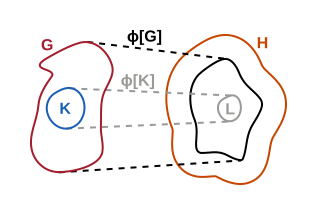

+++

We used dashed lines for the image of a subset and dotted lines (below) for the preimage of a subset, following [Image (mathematics)](https://en.wikipedia.org/wiki/Image_(mathematics)). In general these lines need to be distinguished because in general $K \neq ϕ^{-1}[ϕ[K]]$.

+++

Intuitively, a homomorphism "preserves structure" in some sense specific to the situation (a group homomorphism preserves group structure). It would make sense that a map that preserves structure at the larger/composite level would also preserve structure at the lower/component level. Is that actually the case?

+++

We know that $ϕ(g_1·_Gg_2) = ϕ(g_1)·_Hϕ(g_2)$, where $g_1,g_2 ∈ G$. Is it also the case that $ϕ(k_1·_Gk_2) = ϕ(k_1)·_Hϕ(k_2)$, where $k_1,k_2 ∈ K$? Yes, because $k_1,k_2 ∈ G$. We also know there is some subgroup $K < G$ with its own operation $·_K$ (defined on a subset of $·_G$), meaning we also have that $ϕ(k_1·_Kk_2) = ϕ(k_1)·_Hϕ(k_2)$.

+++

We could try to show that $ϕ(k_1)·_Hϕ(k_2) = ϕ(k_1)·_Lϕ(k_2)$ i.e. that there is also some group homomorphism $φ: K → L$ but we can't say much about this operator $·_L$. The fact that $φ$ is a group homomorphism (if we could show that) would mean that it maps a group to another group as asserted by e.g. [Group homomorphism](https://en.wikipedia.org/wiki/Group_homomorphism#Category_of_groups) (if you accept that assertion).

+++

Another approach could use that a group can be presented as being generated from a finite set of generators. All the generators must be mapped to the image because all elements are mapped. From these mapped generators, we should be able to create a group presentation i.e. make it clear we have a group. This may be more obvious in the case of an embedding (when each generator is mapped distinctly) but even if different generators are mapped to the same element in the codomain we should still be able to come up with a presentation that's simplified by some generators getting the same name.

+++

We can also simply try to directly show $L$ is a group given $ϕ: G → H$ is a group homomorphism. For it to be a group, it must have an identity, inverses, and be associative and closed. See [Fundamental theorem on homomorphisms § Proof](https://en.wikipedia.org/wiki/Fundamental_theorem_on_homomorphisms#Proof) for a similar proof.

+++

#### Identity

+++

From the property $ϕ(k_1·_Kk_2) = ϕ(k_1)·_Hϕ(k_2)$ we should be able to conclude that $ϕ$ maps the identity element $e_K$ to $e_H = e_L$, i.e. that $ϕ(e_K) = e_H$. Indeed, assume that either $k_1$ or $k_2$ is equal $e_K$ and call the non-$e_K$ element just $k$. We then know that $ϕ(e_K·_Kk) = ϕ(e_K)·_Hϕ(k)$ or that $ϕ(k) = ϕ(e_K)·_Hϕ(k)$. Multiplying by $ϕ(k)^{-1}$ on the right gives $ϕ(k)ϕ(k)^{-1} = ϕ(e_K)ϕ(k)ϕ(k)^{-1} = e_H = ϕ(e_K)$.

+++

#### Inverses

+++

Can we also show that we always have inverses? For any element $g$ we know that $ϕ(gg^{-1}) = ϕ(g)ϕ(g^{-1}) = ϕ(e_G) = e_H$. If $ϕ(g)ϕ(g^{-1}) = e_H$ then $ϕ(g^{-1}) = ϕ(g)^{-1}$.

+++

#### Associativity

+++

For arbitary $a,b,c$, is it the case that $(ϕ(a)·ϕ(b))·ϕ(c) = ϕ(a)·(ϕ(b)·ϕ(c))$? We know that $(a·b)·c = a·(b·c)$, from which we can conclude:

$$
\begin{align}
ϕ((a·b)·c) &= ϕ(a·(b·c)) \\
ϕ(a·b)·ϕ(c) &= ϕ(a)·ϕ(b·c) \\
(ϕ(a)·ϕ(b))·ϕ(c) &= ϕ(a)·(ϕ(b)·ϕ(c)) \\
\end{align}
$$

+++

#### Closed

+++

For arbitrary $a,b ∈ K$, is it the case that $ϕ(a)ϕ(b) ∈ ϕ[K]$? We know that $ab ∈ K$ (call this element $ab = c$). Therefore $ϕ(ab) = ϕ(c) = ϕ(a)ϕ(b) ∈ ϕ[K]$.

+++

> (b) If there is a normal subgroup $K ⊲ G$, will the set of elements in $H$ to which $ϕ$ maps elements of $K$ also be a normal subgroup?

+++

Working forward, we know that $gkg^{-1} ∈ K$ for all $k ∈ K$ and $g ∈ G$ by virtue of it being a normal subgroup. Working backward, we know that $ϕ[K]$ is a subgroup from the previous question, so we just need to show that it is normal i.e that $ϕ(g)ϕ(k)ϕ(g)^{-1} ∈ ϕ[K]$ for all $ϕ(k) ∈ ϕ[K]$ and $ϕ(g) ∈ ϕ[G]$. Notice $ϕ[G] = Im(ϕ)$ is not necessarily equivalent to $H$. From [the errata](http://web.bentley.edu/empl/c/ncarter/vgt/errata.html#appendix):

+++

> Part $(b)$ is ambiguous. It asks if the set of elements to which $ϕ$ maps $K$ will be normal, but it does not say normal in what group. It will always be normal in $Im(ϕ)$, but not always normal in $H$.

+++

Working forward again, we know $ϕ(gkg^{-1}) ∈ ϕ[K]$ by applying $ϕ$ to both sides of $gkg^{-1} ∈ K$. Take $w = gk$ in $ϕ(gkg^{-1}) ∈ ϕ[K]$ to get $ϕ(wg^{-1}) ∈ ϕ[K]$ from which we can derive $ϕ(w)ϕ(g^{-1}) = ϕ(w)ϕ(g)^{-1} = ϕ(gk)ϕ(g)^{-1} = ϕ(g)ϕ(k)ϕ(g)^{-1} ∈ ϕ[K]$ by definition of $ϕ$ being a homomorphism.

+++

If $ϕ$ was surjective, then we could make the more general claim that this is equivalent to $hϕ(k)h^{-1} ∈ ϕ[K]$ for all $ϕ(k) ∈ ϕ[K]$ and $h ∈ H$.

+++

> (c) If there is a subgroup $K < H$, will the set of elements in $G$ that $ϕ$ maps to elements of $K$ also be a subgroup?

+++

Call the set of elements in $G$ that $ϕ$ maps to elements of $K$ by the name $J = ϕ^{-1}[K]$:

+++

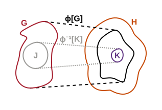

+++

We can only use $ϕ^{-1}$ in the sense of a preimage of a set (not a function), because if $ϕ$ is non-injective then many elements in $G$ will map to one in $H$.

+++

We know that $ϕ(g_1·_Gg_2) = ϕ(g_1)·_Hϕ(g_2)$, where $g_1,g_2 ∈ G$. Is it still the case that $ϕ(j_1·_Gj_2) = ϕ(j_1)·_Hϕ(j_2)$, where $j_1,j_2 ∈ J$? Yes, because $j_1,j_2 ∈ G$. We also know there is some subgroup $K < H$ with its own operation $·_K$ (defined on a subset of $·_H$), meaning we also have that $ϕ(j_1·_Gj_2) = ϕ(j_1)·_Hϕ(j_2) = ϕ(j_1)·_Kϕ(j_2)$. Does the operator $·_G$ restricted to operations in the set $J$ (call this operator $·_J$) also define a group homomorphism $ϕ: J → L$?

+++

#### Identity

+++

Does the set $J$ also have an identity $e_J$? We have an identity $e_H = e_K$ because for $K$ to be a subgroup it must include the larger group identity $e_H$. We know that $ϕ$, regardless of how it maps this close side set, must map $e_G$ to $e_H$. Since $ϕ(e_G)$ is in $K$ we know that $e_G$ is in $J$, by just taking the inverse of $ϕ$.

+++

#### Inverses

+++

Take some arbitrary element $j \in J$, does it have an inverse in $J$? The element $j$ will have an inverse $j^{-1} \in G$ (because $G$ is a group). Following similar reasoning to above, for any element $j$ we know that $ϕ(jj^{-1}) = ϕ(j)ϕ(j^{-1}) = ϕ(e_G) = e_H$. If $ϕ(j)ϕ(j^{-1}) = e_H$ then $ϕ(j^{-1}) = ϕ(j)^{-1}$.

The element $ϕ(j)$ must have an inverse $ϕ(j)^{-1} \in H$ (because $H$ is a group), and an inverse $ϕ(j)^{-1} \in K$ (because $K$ is a group). The inverse is unique, so these must be the same, and also equal $ϕ(j^{-1})$ mentioned above. This shows that $j^{-1}$, which we previously could only show was in $G$, is actually in the preimage $J = ϕ^{-1}[K]$.

+++

#### Associativity

+++

For arbitary $a,b,c \in J$ we know it is always the case that $(ϕ(a)·ϕ(b))·ϕ(c) = ϕ(a)·(ϕ(b)·ϕ(c))$ because $K$ is a group. Can we show that $(a·b)·c = a·(b·c)$ as well?

$$
\begin{align}
(ϕ(a)·ϕ(b))·ϕ(c) &= ϕ(a)·(ϕ(b)·ϕ(c)) \\
ϕ(a·b)·ϕ(c) &= ϕ(a)·ϕ(b·c) \\
ϕ((a·b)·c) &= ϕ(a·(b·c)) \\
\end{align}
$$

+++

#### Closed

+++

Take two arbitrary elements $a,b \in J$. Will their product $c = ab$ also be in $J$? It will be if we can show that $ϕ(c) \in K$. We know that $ϕ(a)$ and $ϕ(b)$ are in $K$, and because it is a group and therefore closed the product $ϕ(a)ϕ(b) \in K$. Given $ϕ$ is a homomorphism we also know $ϕ(a)ϕ(b) = ϕ(ab) = ϕ(c)$, which is what we wanted to show.

+++

> (d) If there is a normal subgroup $K ⊲ H$, will the set of elements in $G$ that $ϕ$ maps to elements of $K$ also be a normal subgroup?

+++

See comments in [Group homomorphism § Image and kernel](https://en.wikipedia.org/wiki/Group_homomorphism#Image_and_kernel) showing the kernel is a normal subgroup; we can follow similar logic. Assume $j \in J$; we must show $g^{-1}jg \in J$ for arbitrary $j,g$, which is equivalent to $ϕ(g^{-1}jg) \in K$. We know that $ϕ\left(g^{-1} j g\right) = ϕ(g)^{-1} \cdot ϕ(j) \cdot ϕ(g)$ given $ϕ$ is a homomorphism. Given $ϕ(j) \in K$ and that $K$ is a normal subgroup, it is indeed the case that $ϕ(g)^{-1} \cdot ϕ(j) \cdot ϕ(g) \in K$.

+++

### Exercise 8.7

+++

> Use the concept of generating a homomorphism (page 161) to explain why any homomorphism must map the domain's identity element to the codomain's identity element.

+++

We should also be able to do this without reference to pg. 161. In fact, we've already done so in the previous question. To answer this question we'll go through the logic in more detail, and try to vary it a bit.

For the identity element $e_G$ in the domain $g = ge_G = e_Gg$ for all $g \in G$.

We know the codomain $H$ is a group and must have an identity element $e_H$ for which it also holds that $h = he_H = e_Hh$ for all $h \in H$.

Given a homomorphism $ϕ$ we must have $ϕ(g) = ϕ(g)ϕ(e_G) = ϕ(e_G)ϕ(g)$ for all $g \in G$. In the $Im(ϕ)$ (which we'll call $L$) we must therefore have $l = lϕ(e_G) = ϕ(e_G)l$ for all $l \in L$.

Recall that a group can only have one identity element. Call the identity element in a group $e$, and assume it has some other identity element $a$. If $e$ is the identity element then that implies $g = eg$, and if $a$ is another identity element then $g = ag$. This implies $g = eg = ag$ or (cancelling $g$ from the right) that $e = a$.

Therefore the identity element $ϕ(e_G)$ in $L$ must equal the identity element $e_H$ in $H$, that is, we must have that $e_H = ϕ(e_G)$.

+++

## 8.7.3 Embeddings

+++

### Exercise 8.8

+++

> Is it possible to embed $C_n$ in $Z$ with a homomorphism? Explain your answer.

+++

We could trivially map $C_1$ to $Z$ by mapping the only element (the identity) in $C_1$ to the identity in $Z$. We could map any $C_n$ to the identity in $Z$, in fact, although this would no longer be an embedding (just a homomorphism).

+++

A group homomorphism is a map from a group to a group, and there are only two possible subgroups on the "far side" of this theoretical map (in $Z$). These are the identity map, which we've discussed, and the whole group. Can we map $C_n$ to the whole group?

+++

It does not seem possible to map any $C_n$ to all of $Z$. One way to think about this is that a finite group cannot possibly cover all of an infinite group. Each element of the finite group can only map to one element in the codomain, making the image of the homomorphism smaller than the codomain (a non-surjective map). The product of any two elements in the codomain must again be a member of the homomorphism's image if it is the case that $ϕ(ab) = ϕ(a)ϕ(b)$, so there would be no way to cover the rest of the infinite group.

+++

### Exercise 8.9 (📑)

+++

> (a) How many embeddings of $C_4$ are there into itself?

+++

Two, see Exercise 8.4c above.

+++

> (b) How many automorphisms are there of $C_4$?

+++

Two, see Exercise 8.4c above.

+++

> (c) Is an embedding of any group into itself always an automorphism?

+++

No, this is true only if the group is finite. Consider the mapping in Exercise 8.5 above for an example of an embedding of a group into itself that is not an automorphism.

+++

For finite groups, by definition an embedding is a one-to-one mapping from the domain to the codomain (it is injective). Because the domain and codomain are the same size, we can also say that it's surjective. This makes it an isomorphism, and an isomorphism from a group to itself is an automorphism.

+++

### Exercise 8.10

+++

> For each part below, describe all the embeddings with the given domain and codomain. Choose one from each part (if available) to diagram.
>
> (a) Domain $C_2$ and codomain $V_4$

+++

0 → e, 1 → v \
0 → e, 1 → h \
0 → e, 1 → d

+++

We'll skip the diagrams in this question since they all seem rather simple/duplicate.

+++

> (b) Domain $C_2$ and codomain $C_3$

+++

None

+++

> (c) Domain $C_2$ and codomain $C_4$

+++

0 → 0, 1 → 2

+++

> (d) Domain $C_3$ and codomain $S_3$

+++

0 → e, 1 → r , 2 → r² \
0 → e, 1 → r², 2 → r

+++

> (e) Domain $C_n$ and codomain $ℤ$

+++

See Exercise 8.8 (only the trivial homomorphism for $C_1$).

+++

> (f) Domain and codomain both $ℤ$

+++

The only automorphisms are $ϕ(n) = mn$ for $m \in \{1,-1\}$, as discussed in Exercise 8.9c. See Exercise 8.5 for an example of an embedding that is not an automorphism; we could effectively extend that example to $ϕ(n) = mn$ for $m \in ℤ$.

+++

## 8.7.4 Quotient maps

+++

### Exercise 8.11 (📑)

+++

> (a) Diagram the quotient $\frac{ℤ}{⟨3⟩}$ similar to the diagram $\frac{ℤ}{⟨12⟩}$ in Figure 8.17.

+++

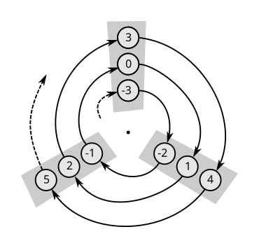

+++

> (b) What is the corresponding quotient map from $ℤ$ to $C_3$?

+++

$ϕ(n) = n \mod 3$

+++

> (c) Can you devise a way to diagram that quotient using a multiplication table instead?

+++

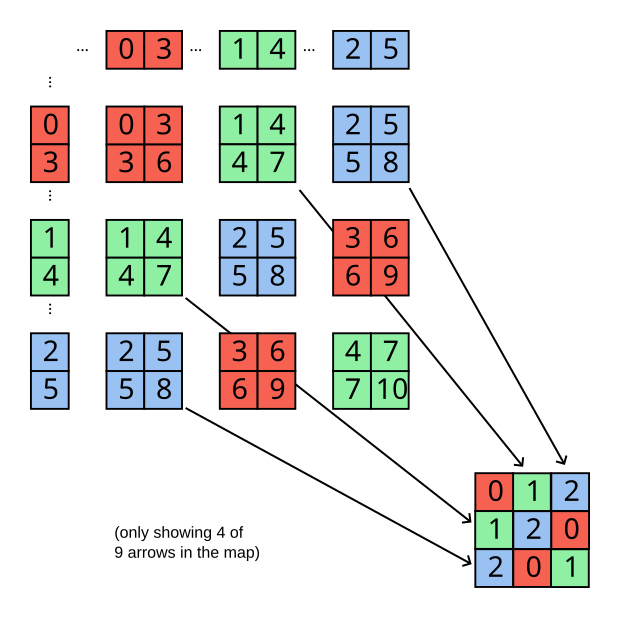

+++

### Exercise 8.12 (📑)

+++

> For parts (a) through (c), a group $G$ is given together with a normal subgroup $H$. Illustrate not only the quotient map $q: G → G/H$, but the embedding $ϕ: H → G$, chained together so that $Im(ϕ) = Ker(q)$. Here is an example for $H = C_2$ and $G = C_6$. Elements of $H$ (as well as elements to which they map) are highlighted:
>
> 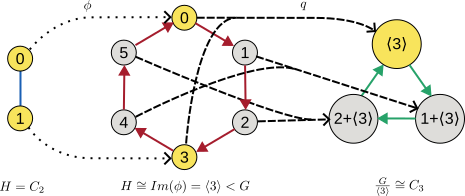

+++

> (a) $H = C_3$, $G = C_6$

+++

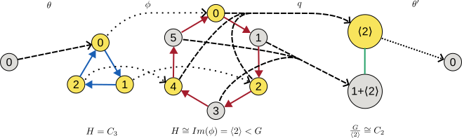

+++

> (b) $H = C_3$, $G = S_3$

+++

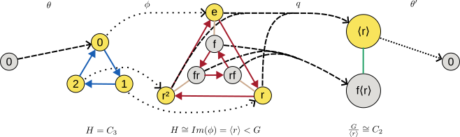

+++

> (c) $H = V_4$, $G = A_4$

+++

See [A₄ Cayley table](https://en.wikipedia.org/wiki/Alternating_group#/media/File:Alternating_group_4;_Cayley_table;_numbers.svg) for the source of the node labels. This drawing is similar to Figure 7.23, although Figure 7.24 arguably makes the structure clearer:

+++

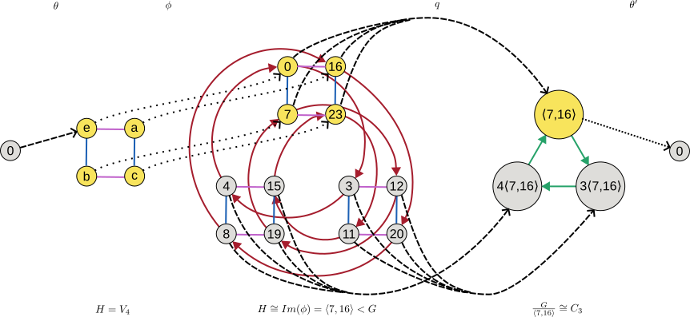

+++

See also [Klein four-group § Permutation representation](https://en.wikipedia.org/wiki/Klein_four-group#Permutation_representation).

+++

> Now answer each of the following questions about each of your answers to parts (a) through (c).
>
> (d) What map $θ$ into $H$ would satisfy the equation $Im(θ) = Ker(ϕ)$? Choose one with the smallest possible domain.

+++

See above.

+++

> (e) What map $θ'$ from $G/H$ would satisfy the equation $Im(q) = Ker(θ')$? Choose one with the smallest possible codomain.

+++

See above.

+++

> (f) Add the two maps $θ'$ and $θ'$ to your illustration.

+++

See above.

+++

> The new chain of four homomorphisms is called a *short exact sequence*. It is one way to use homomorphisms to illustrate quotients, and it shows a connection between embeddings and quotient maps.

+++

See more commentary from the author in [Group Theory Terminology - Short Exact Sequence](https://nathancarter.github.io/group-explorer/help/rf-groupterms/index.html#short-exact-sequence), though that explanation doesn't use great variable names and sometimes uses $=$ when it should use $\cong$.

+++

See also [Exact sequence § Short exact sequence](https://en.wikipedia.org/wiki/Exact_sequence#Short_exact_sequence). What's the motivation for putting groups on a line and forcing $im(f_1) = {ker(f_2)}$ (an exact sequence, not yet short)? There is more than one motivation, but one is that when you put a $0$ object at the start or end of such a sequence you can force certain properties on the morphisms involved, in particular that they are monomorphisms or epimorphisms (or both). This is discussed in [Exact sequence § Simple cases](https://en.wikipedia.org/wiki/Exact_sequence#Simple_cases).

+++

Another motivation for exact sequences is obviously short exact sequences, which can be seen as a tool for recording either:
1. How a group "breaks down" into two smaller groups.
2. How two groups can "compose" or "add up" to produce some particular new group.

+++

Regarding #1, since the first isomorphism theorem demonstrates how to break down a group given a homomorphism out of it, a short exact sequence can illustrate the first isomorphism theorem (since it specifies a unique homomorphism $q$ or $\pi$ that can be used for the breakdown). Here's an illustration of the first isomorphism theorem (in the form of a short exact sequence) from [Isomorphism theorems](https://en.wikipedia.org/wiki/Isomorphism_theorems):

+++

+++

Let's replace some variable names in the drawing above to make the relationship between the two drawings clearer:

+++

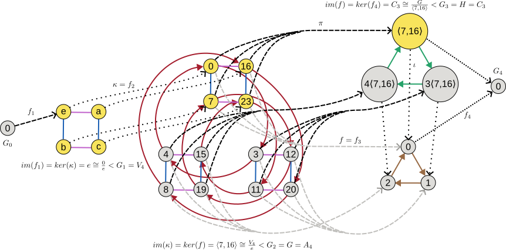

+++

This drawing uses $\pi$ (for **p**rojection) rather than $q$ as the author uses (for **q**uotient); from [Quotient group § Properties](https://en.wikipedia.org/wiki/Quotient_group#Properties):

> There is a "natural" [surjective](https://en.wikipedia.org/wiki/Surjective "Surjective") [group homomorphism](https://en.wikipedia.org/wiki/Group_homomorphism "Group homomorphism") ⁠$\pi : G → G / N$, sending each element $g$ of $G$ to the coset of $N$ to which $g$ belongs, that is: $\pi(g) = gN$⁠. The mapping $\pi$ is sometimes called the *canonical projection of $G$ onto ⁠$G/N$*. Its [kernel](https://en.wikipedia.org/wiki/Kernel_(algebra) "Kernel (algebra)") is ⁠$N$.

+++

Notice that in an exact sequence (with the indexing in the following equation coming from [Exact sequence - Wikipedia](https://en.wikipedia.org/wiki/Exact_sequence)) the first isomorphism theorem implies:

+++

$$
im(f_n) \cong \frac{G_{n-1}}{ker(f_n)}
$$

+++

With the addition of the exact sequence's requirement that $im(f_{n-1}) = {ker(f_{n})}$, we have that:

+++

$$
im(f_n) \cong \frac{G_{n-1}}{im(f_{n-1})}
$$

+++

The $0$ on the far left of the sequence forces $f_1$ to be injective, so that $G_1 \cong im(f_2)$. The $0$ on the far right forces $f_3$ to be surjective, so that $G_3 \cong im(f_3)$. These additional requirements imply:

+++

$$
G_3 \cong \frac{G_2}{G_1}
$$

+++

It's in this sense that a short exact sequence illustrates the first isomorphism theorem, by taking the three terms in the theorem and laying them out as the three middle groups of the sequence. Notice the first isomophism theorem implies parallel isomorphic groups along the whole sequence, however, as illustrated in the drawing above. These parallel isomorphic groups exist not just in short exact sequences but for any homomorphism, so in some scenarios it may seem redundant to include them.

+++

To repeat motivation #2 above, short exact sequences also provide a way to record how two groups can "add up" to produce some new group. That is, we can see the short exact sequences $0 → V_4 → A_4 → C_3 → 0$ as a record of not just how to break down $A_4$ into $C_3$ and $V_4$, but how to add up $C_3$ and $V_4$ to get $A_4$. In the language of [Group extension](https://en.wikipedia.org/wiki/Group_extension) we'd call this short exact sequence an "extension" and say that $A_4$ is an extension of $C_3$ by $V_4$. A group extension records how to break down a group to produce a quotient group, but this isn't particularly interesting if you know that any normal subgroup can be used to produce a quotient group (just find all the normal subgroups of a group to illustrate all the ways to break it down). The harder problem is the [Extension problem](https://en.wikipedia.org/wiki/Group_extension#Extension_problem), which asks how you can take two groups and add them up.

+++

As a small example of the extension problem, say you were given the two groups $C_2$ and $C_2$ and asked to answer what groups could be constructed with the former as a normal subgroup and the latter as the quotient group. You'd likely discover the semidirect product $C_2 × C_2$ (also the direct product) and that there are no other semidirect products. However, as discussed in [Semidirect product § Non-examples](https://en.wikipedia.org/wiki/Semidirect_product#Non-examples) there's another short exact sequence using these two groups with $C_4$ in the middle. How could you have known that group existed, and be sure that you enumerated all possible groups? At this scale the problem isn't difficult since we can easily enumerate all groups of order four, but enumerating all possible groups doesn't scale well.

+++

See also [Isomorphism theorems § Discussion](https://en.wikipedia.org/wiki/Isomorphism_theorems#Discussion) for other categorical interpretations of the first isomorphism theorem.

+++

### Exercise 8.13 (⚠, 📑, 🔨)

+++

> For any group $G$ and any number $n$ we can create a homomorphism that raises every element to the $n^{th}$ power, $ϕ: G → G$ by $ϕ(g) = g^n$. (In an additive group like ℤ, we would write $ng$ instead of $g^n$. Thus this is like the function in Exercise 8.5, but it works for any group $G$.)

+++

Is this a homomorphism? We'd expect that $ϕ(g_1g_2) = ϕ(g_1)ϕ(g_2)$, but in general $ϕ(g_1g_2) = (g_1g_2)^n \neq ϕ(g_1)ϕ(g_2) = g_1^ng_2^n$. Consider e.g. the case where $n=2$ and $G=S_3$ with $g_1,g_2 = f,r$ (a trivial non-abelian group). If you work on the assumption that this a homomorphism then you'll find that the kernel is not always a normal subgroup of $G$:

+++

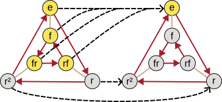

+++

The author notes this issue in the errata. If we assume $G$ is an abelian group then $ϕ(g_1g_2) = (g_1g_2)^n = ϕ(g_1)ϕ(g_2) = g_1^ng_2^n$.

+++

> What is the kernel of this homomorphism?

+++

The identity element and any other element whose order is a factor of $n$. If an element has order $m$ and this is a factor of $n$ so that $n = mk$, then $ϕ(g) = g^{mk} = e^k = e$. We could also express this from the additive perspective as $ϕ(g) = kmg = ke = e$. In a finite group all elements have finite order, so taking $n$ to be the least common multiple of the orders of all the elements will make the whole group the kernel. For example, in $C_3$ the elements are of order $\{2,3,6\}$ so setting $ϕ(g) = g^6$ maps the whole group to the kernel. In $V_4$ the elements are of order $\{2,2,2\}$ so to collapse the group to the identity requires $n=2$. Similarly, setting $n = 1$ on any group makes $ϕ$ injective (and trivial).

+++

Because the group (and therefore the kernel) are abelian, we should be able to represent either (per the the [fundamental theorem of finite abelian groups](https://en.wikipedia.org/wiki/Fundamental_theorem_of_finite_abelian_groups "Fundamental theorem of finite abelian groups")) as a the direct product of cyclic subgroups of prime-power order. The prime factorization of $n$ will determine these subgroups in the kernel, because a prime-power in $n$ will map a subgroup of that order (or of a smaller prime-power, for the same prime) to the identity (if the subgroup exists in $G$).

+++

> (b) When we compute $\frac{G}{Ker(ϕ)}$, do we get a subgroup of $G$?

+++

This question is specific to the $ϕ$ defined in part (a). Normal subgroups and kernels of homomorphisms are in a one-to-one relationship, so an alternative way to phrase this question is whether $\frac{G}{H}$ is a subgroup of $G$ for any normal subgroup defined by $ϕ$ for different $n$ (call these $ϕ_n$). In part (c) we'll ask the more general question of whether (ignoring $ϕ$) dividing by any normal subgroup leads to a group that is isomorphic to a subgroup of $G$.

+++

To show we have an isomorphism, we could try to show that there is a homomorphism that's injective and surjective (bijective) between the quotient group and some subgroup of the original group. Consider the special case of $C_4$ however, which we saw in Exercise 7.18(a) is not the direct product of cyclic groups. It's not clear how we'd form this reverse map in this example.

+++

Another option is to use the [fundamental theorem of finite abelian groups](https://en.wikipedia.org/wiki/Fundamental_theorem_of_finite_abelian_groups "Fundamental theorem of finite abelian groups") (the author's Theorem 8.8). According to that theorem, the group $G$ should be constructible as the direct product of cyclic subgroups of prime-power order. These factors $C_{n_1}$, $C_{n_2}, \cdots C_{n_m}$ will naturally be subgroups of $G$, and the direct product of any arbitrary subset of them should be usable to form other subgroups (imagine the power set as the group's Hasse diagram).

+++

Will we be able to use the direct product of some subset of $C_{n_1}$, $C_{n_2}, \cdots C_{n_m}$ to form the quotient group? Take some arbitary $C_{n_1}$ with $n_1 = p^b$ where $p$ is a prime and $b$ is a prime-power. If $n$ has a prime-power $a$ (i.e. $p^a$ for some prime $p$) that is less than the prime-power $b$ of the subgroup in $G$, then the group in $G$ will have its order reduced to $b - a$ by the homomorphism so that $C_{p^{a}}$ is in the kernel and $C_{p^{b-a}}$ is in the quotient group. If $C_{p^b}$ is in $G$ we know that we'll also have a group $C_{p^{b-a}} < C_{p^b}$ in $G$ that we can use to form a direct product subgroup involving that term, however. If $a >= b$ then we'll map $C_{n_1}$ to the identity, which will have no effect on a direct product we form with it.

+++

In this way we can imagine every $C_{n_1}$, $C_{n_2}, \cdots C_{n_m}$ being mapped to some other subgroup of the quotient group, so that the quotient group (not surprisingly) is a direct product of these new groups (and therefore also an abelian group, since each will be cyclic and of a prime power).

+++

Take for example the group $G = C_4 × C_2 × C_7 × C_9$. If we take $n = 12 = 4×3$ then the quotient group will be $\frac{G}{Ker(ϕ_{12})} = e × e × C_7 × C_3 = C_7 × C_3$ which is also a subgroup of $G$. Notice the kernel is $C_4 × C_2 × C_3$, which depended on the contents of $G$. That is, $Ker(ϕ_{12})$ is a subgroup that depends on the contents of $G$ because of the particular way in which this homomorphism is defined.

+++

<!--

Consider all the elements $g \in G$ as potential generators of subgroups in $G$. These are the only possible generators of groups; no subgroups can be formed without using some subset of these elements. If we were to take the quotient using the trivial homomorphism $ϕ_1$ with kernel $N = \{e\}$ we'd get all the same groups with the new generators $gN \in \frac{G}{Ker(ϕ)}$.

Stepping up the number of worlds we're considering to the homomorphism $ϕ_2$, we'd find that $N$ included all elements $g \in G$ of order two. Is it still the case that for any elements $g_1,g_2 \in G$ for which $g_3 = g_1·g_2$ we also have that $g_3N = g_1N·g_2N$? Yes, by the logic in [Quotient group § Definition](https://en.wikipedia.org/wiki/Quotient_group#Definition).

Is it still the case that for any elements $g_1N,g_2N,g_3N \in \frac{G}{Ker(ϕ)}$ for which $g_3N = g_1N·g_2N$ we also have that $g_3 = g_1·g_2$? No; consider even $0⟨2⟩ = 1⟨2⟩·1⟨2⟩$ in $\frac{C_4}{⟨2⟩}$ or $4⟨2⟩ = 1⟨2⟩·1⟨2⟩$ in $\frac{C_6}{⟨2⟩}$. What we can say is that it's always possible to pick a canonical representative for $g_1,g_2,g_3$ and construct an equivalent group in $G$. In this case we'll pick $g_1^2$, $g_2^2$, and $g_3^2$. We know that $gN = g^2N$

We'd again have all the same groups in the quotient group because we strictly removed generators (elements) from the group. For every $g_1$ we removed we still have a $g_1^2$ that can generate any groups that used to be generated with $g_1^2$.

-->

+++

> (c) Is $\frac{G}{H}$ always isomorphic to a subgroup of $G$ (for any $G$ and $H ⊲ G$)?

+++

No, we saw in Exercise 7.18(h) the group $G_{4,4}$ for which this was not the case. Looking through [List of small groups](https://en.wikipedia.org/wiki/List_of_small_groups#Small_Groups_Library) for a smaller example, we see the following comment on $Q_8$:

> The smallest group $G$ demonstrating that for a normal subgroup $H$ the [quotient group](https://en.wikipedia.org/wiki/Quotient_group "Quotient group") $G$/$H$ need not be isomorphic to a subgroup of $G$.

This example is discussed in more detail in [Semidirect product § Non-examples](https://en.wikipedia.org/wiki/Semidirect_product#Non-examples), in the context of it not being expressable as a semidirect product. If we take the quotient $\frac{Q_8}{⟨-1⟩}$ we get a group isomorphic to $V_4$, which is not a subgroup of $Q_8$:

+++

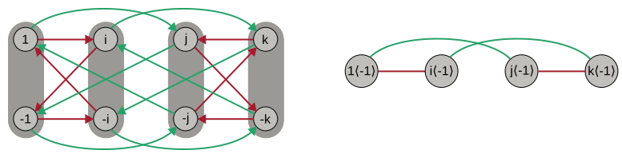

+++

Notice the pattern we first saw in 7.18a (in both the red and green generators) that collapses and order-4 generator to an order-2 generator in the quotient. If we were to allow expanding order-2 generators to all the possible order-4 generators in the something similar to the semidirect product, then we could potentially reverse this operation. See also [Wreath product](https://en.wikipedia.org/wiki/Wreath_product).

+++

### Exercise 8.14

+++

> For any group $G$ consider the homomorphism $θ: G → G$ by $θ(g) = g^{-1}$. What are its image and kernel? What more can you say about it?

+++

The image is the set $\{θ(g) | g \in G\}$ or $\{g^{-1} | g \in G\}$. This set will include all the inverses of $G$, of course. Because all the inverses of $G$ were in $G$, it will also include all $g \in G$. That is, the image will be the whole group.

The kernel is all $g$ for which $ϕ(g) = e$. For which elements does $e = g^{-1}$ in G? Multiply by $g$ on the right to get $eg = g^{-1}g = g = e$ (i.e. all $g$ for which this is true is $\{e\}$).

Because the kernel is only the identity element, we can call this homomorphism injective. Because the image is the whole group, we can call this embedding an isomorphism. It is also an [involution (mathematics)](https://en.wikipedia.org/wiki/Involution_(mathematics)).
