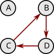
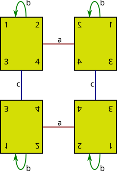
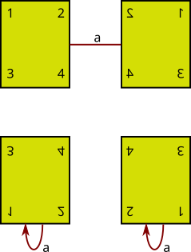
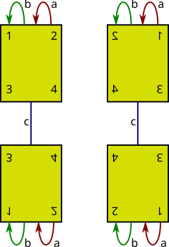
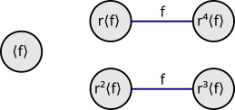
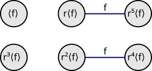
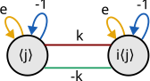

---
jupytext:
  text_representation:
    extension: .md
    format_name: myst
    format_version: 0.13
    jupytext_version: 1.16.1
kernelspec:
  display_name: Python 3 (ipykernel)
  language: python
  name: python3
---

# 9.5 Exercises

+++

## 9.5.1 Basics

+++

### Exercise 9.1

+++

> Name two questions that the Sylow Theorems answered about the group $A$ of order 200. Name two questions they did not answer about it.

This question is quite open-ended so we'll limit it to the questions suggested at the start of the chapter.

+++

> Are any of them normal?

+++

This question was partially answered in general; the combination of the 2ST and 3ST lets us sometime determine whether there are Sylow $p$-subgroups that are normal.

For the group $A$, there is at least one normal subgroup, of order 25.

+++

> How big are its subgroups?

+++

The 1ST answers this question for only some subgroups; those that have an order that is a power of a prime number exist (and are of that size).

For the group $A$, we saw groups of order up to 8 and 25.

+++

> How are those subgroups related?

+++

The 1ST covers how (some) subgroups are nested. The 2ST covers how (some) subgroups are conjugates.

+++

For the group $A$, the order-2 group is a subgroup of the order-4 group which is a subgroup of the order-8 group.

+++

> How many subgroups are there?

+++

In general, all three Sylow theorems were involved in answering this question (not just the 1ST).

+++

For the group $A$, this question was only partially answered. We know there is only one subgroup of order 25, but we don't know how many subgroups of order 8 there are. We also don't know if there are any other subgroups of other non-prime sizes.

+++

### Exercise 9.2

+++

> If $S$ has six elements, how many does $Perm(S)$ have?

```{code-cell} ipython3
import math

math.factorial(6)
```

### Exercise 9.3 (📑)

+++

> If $G$ acts on $S$ and $s ∈ S$, consider the two sets $Orb(s)$ and $Stab(s)$.
>
> (a) Is either of them a group?

+++

$Stab(s)$ is always a group in $G$ (see Exercise 9.17). $Orb(s)$ is not necessarily a group, as we've seen in some examples (Figure 9.3).

+++

> (b) How do the two sets relate?

+++

The Orbit-Stabilizer Theorem

+++

> (c) What is the smallest size that $Orb(s)$ can have?

+++

One (when $Stab(s)$ is all of G)

+++

> (d) What is the largest size that $Orb(s)$ can have?

+++

$|G|$ (when $Stab(s)$ is one)

+++

> (e) Are all sizes in between possible?

+++

No, $Orb(s)$ must always divide $G$.

+++

### Exercise 9.4

+++

> If $|G| = 28$, what sizes of subgroups does Cauchy's Theorem guarantee exist in $G$? How does the First Sylow Theorem improve on that guarantee?

+++

Because $28 = 7×2²$, Cauchy's Theorem guarantees cyclic subgroups of orders 2 and 7. The First Sylow Theorem expands the guarantee to groups of size 2, 7, and 2² (the last not necessarily being cyclic).

+++

### Exercise 9.5

+++

> How many groups are there of order less than or equal to 8?

+++

See [List of small groups](https://en.wikipedia.org/wiki/List_of_small_groups). There are a total of 14.

+++

As a reminder, $C_3 × C_2$ is isomorphic to $C_6$; these are not two different groups. The former representation is more "wasteful" in the sense it requires two generators to cover the whole group rather than one.

You can't just look at the "shape" of two Cayley graphs to say two groups are isomorphic to each other, because a Cayley graph may be missing many generators or it may be drawn in a different way (e.g. on a grid rather than a circle). In the end, two groups are the same if they have the same multiplication table.

+++

## 9.5.2 Group actions and action diagrams

+++

### Exercise 9.6

+++

> What do the $h$ arrows in Figure 9.2 signify? What do the $v$ arrows in that figure signify?

+++

The $h$ arrows signify the permutation that switches the first and third rectangle configurations, as well as the second and fourth. That is, it is a mapping from the set of rectangle configurations to the set of rectangle configurations (to itself).

The $v$ arrows represent the $id$ (identity) permutation of the rectangle configurations.

+++

### Exercise 9.7

+++

> Consider the action of $C_3$ on the set $\{A,B,C,D\}$ by the interpretation homomorphism $ϕ: C_3 → Perm(\{A,B,C,D\})$ generated by:
>
> $$
ϕ(1) = (BDC)
$$
>
> (a) Draw the corresponding action diagram.

+++

$$
\begin{align}
ϕ(0) & = id \\
ϕ(1) & = (BDC) \\
ϕ(1·1) = ϕ(2) & = ϕ(1)ϕ(1) = (BDC)(BDC) = (BCD)
\end{align}
$$

+++



+++

> (b) What are the stable elements?

+++

$\{0\}$

+++

> (c) What are the orbits?

+++

$$
\begin{align}
Orb(A) & = \{A\} \\
Orb(B) & = Orb(C) = Orb(D) = \{B,C,D\}
\end{align}
$$

+++

### Exercise 9.8

+++

> For each part below, create an action diagram satisfying the given criteria.
>
> (a) condition (1) of the two on pages 195-196, but not condition (2)

+++

We'll stick with $V_4$ and the rectangle puzzle for this question, though in another interpretation we'd find a puzzle that could optionally exclude reflections. A square puzzle and $D_4$, for example, would reduce to a square and $C_4$ without reflections (no taking it off the table).

So we have four configurations possible by hand, all of which $ϕ$ must map to in an injective manner. That requires a minimum of four elements in the group we're mapping from, but exactly four elements would make the homomorphism an isomorphism. So we'll map something larger than $V_4$ to the four configurations (a quotient map).

Let's map $V_4 × C_2$ i.e. $C_2^3$ onto the four permutations instead. Call the generators $⟨a,b,c⟩$.

+++



+++

> (b) condition (2) of the two on pages 195-196, but not condition (1)

+++

Let $G = C_2$ with generator $⟨a⟩$.

+++



+++

> (c) neither of the two conditions on pages 195-196 (Although Figure 9.2 answers this part, create a different action diagram than that one.)

+++

Using the $C_2^3$ from part (a):

+++



+++

### Exercise 9.9

+++

> If $C_5$ acts on the letters $\{A,B,C,D\}$, what will the action diagram be? Why?

+++

A diagram without arrows (every element is stable).

The interpretation homomorphism needs to map to the codomain $S_4$, but there are no order-5 subgroups in $S_4$ to map to. Hence the quotient map to the identity is the only homomorphism possible.

+++

### Exercise 9.10

+++

> Consider the group action defined at the start of the proof of Theorem 9.9.
>
> (a) Draw the action diagram for the specific example of $G = D_5$ and $H = ⟨f⟩$.

+++

> Consider the group action defined at the start of the proof of Theorem 9.9.
>
> (a) Draw the action diagram for the specific example of G = D₅ and H = ⟨f⟩.

+++

The set we're acting on is $S = \{⟨f⟩, r⟨f⟩, r²⟨f⟩, r³⟨f⟩, r⁴⟨f⟩\}$. The interpretation homomorphism (with permutations in cycle notation) is:

+++

$$
\begin{align}
ϕ(e) & = id \\
ϕ(f) & = (r⟨f⟩ r⁴⟨f⟩) (r²⟨f⟩ r³⟨f⟩)
\end{align}
$$

+++



+++

Incidentally, notice $[N_G(H) : H] = 1 ≡_2 5 = [G : H]$. Let's also look at $G = D_6$ and $H = ⟨f⟩$, which is just a little more work. We have $S = {⟨f⟩, r⟨f⟩, r²⟨f⟩, r³⟨f⟩, r⁴⟨f⟩, r⁵⟨f⟩}$, and:

+++

$$
\begin{align}
ϕ(e) & = id \\
ϕ(f) & = (r⟨f⟩ r⁵⟨f⟩) (r²⟨f⟩ r⁴⟨f⟩)
\end{align}
$$

+++



+++

Where now $[N_G(H): H] = 2 ≡_2 6 = [G : H]$.

+++

> (b) Verify that for each $s ∈ S$, your diagram satisfies the Orbit-Stabilizer Theorem.

+++

$$
\begin{align}
|Stab(⟨f⟩)  |·|Orb(⟨f⟩)  | & = 2·1 = 2 \\
|Stab(r⟨f⟩) |·|Orb(r⟨f⟩) | & = 1·2 = 2 \\
|Stab(r²⟨f⟩)|·|Orb(r²⟨f⟩)| & = 1·2 = 2 \\
|Stab(r³⟨f⟩)|·|Orb(r³⟨f⟩)| & = 1·2 = 2 \\
|Stab(r⁴⟨f⟩)|·|Orb(r⁴⟨f⟩)| & = 1·2 = 2
\end{align}
$$

+++

### Exercise 9.11

+++

> (a) Consider the group action defined at the start of the proof of Theorem 9.12. Draw the action diagram for the specific example of $G = Q_4$, $H = ⟨j⟩$, and $K = ⟨k⟩$.

+++

Inspect the Cayley graph on [Quaternion group](https://en.wikipedia.org/wiki/Quaternion_group). We have $S = \{⟨j⟩,i⟨j⟩\}$, and:

+++

$$
\begin{align}
ϕ(e) & = id \\
ϕ(k) & = (⟨j⟩ i⟨j⟩) \\
ϕ(-1) & = id \\
ϕ(-k) & = (⟨j⟩ i⟨j⟩)
\end{align}
$$

+++



+++

> (b) Are there any stable elements?

+++

No

+++

> (c) Is either $H$ or $K$ normal? Why or why not?

+++

Since there isn't even one stable element, these two groups aren't conjugate to each other. This shouldn't be particularly surpising in the context of the 2ST, however, because these are not Sylow 2-subgroups. The Sylow 2-subgroup is all of $Q_4$ in this case (not a proper subgroup).

+++

They are both normal, which you can verify by taking the quotient with the $⟨j⟩$ subgroup in the errata's drawing of $Q_4$ (or with Figure 9.15). All of $i$, $j$, and $k$ are symmetric so we can assume the same for $⟨k⟩$.

+++

## 9.5.3 Justification

+++

### Exercise 9.12 (🕳️)

+++

> Give a counterexample to the general converse of Lagrange's Theorem. That is, give a group $G$ and a number $n$ dividing $|G|$ such that $G$ has no subgroups of order $n$.

+++

See Exercise 6.31(f). It appears $A_4$ is also the smallest example, based on [List of small groups](https://en.wikipedia.org/wiki/List_of_small_groups).

+++

From the errata (⚠️):

> Page 278, Answer to Exercise 9.12: It should instead state that Exercise 6.31 guides you through creating the counterexample that Exercise 9.12 requests.

+++

### Exercise 9.13

+++

> I claimed that the Cayley diagrams shown at the end of Section 9.2.1 represent the groups $C_6$ and $S_3$. Demonstrate clearly why this is so.

+++

For the drawing of $C_6$ (arranged to look like $C_2 × C_3$), the $ab$ (red-then-blue) element is of order 6.

+++

For the drawing of $S_3$, rearrange the drawing to make the red lines straight.

+++

### Exercise 9.14

+++

> The statement of Theorem 9.5 would not be true without the assumption that $|G|$ is prime. Show this by finding a particular $G$, $S$, and $ϕ$ for which the statement would fail.

+++

See the group action in Figure 9.3:

$$
\begin{align}
G & = S₃ \\
|G| & = 6\ \text{(not prime)} \\
\text{Stable elements} & = 2 \\
|S| & = 5 ≢_6 2
\end{align}
$$

+++

### Exercise 9.15 (📑)

+++

> (a) If $g^p = e$ and $p$ is prime, why must $|g|$ be $1$ or $p$?

+++

See [Order (group theory)](https://en.wikipedia.org/wiki/Order_(group_theory)). The order of $g$ (called $|g|$ above) is defined as the first positive $k$ for which $g^k = e$. We cannot have $k > p$ or the order of $g$ would have been $p$ ($k = p$, by definition).

Every group element $g$ can have only one minimum power of $g$ we refer to by the word $g^k$ for which $g^k = e$ (there is a single value of $k$). Because there is only one identity element in the group, there can also be no $g^m = e$ where $m < k$ or $g^m$ would have been the only identity and $k = m$.

Similarly, because there is only one identity element in the group, there can also be no $g^m = e$ where $m < p$ unless $m$ is a factor of $p$. This is only the case if $m$ is equal $1$ or $p$ (because $p$ is prime).

+++

> (b) In general, if $g^n = e$, must $|g|$ divide $n$?

+++

If $g^{|g|} = e$ and $g^n = e$, then $g^{|g|} = g^n = e$ and $g^{|g|-n} = e$. If $|g|$ divides $n$, then $n$ can be written $n = m|g|$ so that $g^{|g|-m|g|}= g^{(1-m)|g|} = e$ which should always hold. Otherwise $n$ must be written $n = m|g| + t$ where $t < |g|$ so that $g^{|g|-(m|g|+t)}= g^{(1-m)|g|}g^{-t} = g^{-t} = e$. This is a contradiction because we assumed $t < g$ and therefore $t$ would have been the order of $g$.

+++

<!--
We can also prove this assuming the uniqueness of $e$. The order of $g$ (called $|g|$ above) is defined as the first positive $k$ for which $g^k = e$. Every group element $g$ can have only one minimum power of $g$ we refer to by the word $g^k$ for which $g^k = e$ (there is a single value of $k$). All other words where $g^m = e$ must be of the form $g^m$ (for many values of $m$).

There can be only one identity, and all of its multiples are the only other words that are also equivalent to the identity (including to the power of zero or multiplied by zero). That is, $e = gᵏ = gᵐ$ implies $e = gᵐ⁻ᵏ = gᵏ⁻ᵐ$ which implies $e = gᵐ⁻ᵏ = gᵏ$.

To generate all the $m$ values that are equivalent to the identity, we can start with the relationship $gᵏ = gᵐ⁻ᵏ$ and (by mathematical induction) generate all higher powers by setting $m = 2k$. So all the terms (words) that are equivalent to $e$ are $(gᵏ)ⁿ = gⁿᵏ = e$. This implies that $|g|$ must always divide a power of $g$ that is equivalent to $e$.
-->

+++

### Exercise 9.16 (📑)

+++

> Demonstrate that, for the $ϕ$ defined in the proof of Theorem 9.6, each $ϕ(n)$ is a permutation of $S$, by showing both of the following statements to be true.
>
> (a) Each $ϕ(n)$ sends any element $s ∈ S$ to another element in $S$.

+++

In the example in the text we had three-element terms. These were effectively of the form $g_1g_2(g_1g_2)^{-1}$, with (as the text explains) $|G| = 6$ options for the first entry, $|G| = 6$ options for the second entry, and no choice for the third entry (in order to make the term equal $e$). This made for 6×6 = 36 elements in the table. These are all and the only terms that equal $e$, and rotating the terms in one of these words will only create another term equal $e$ because $abc = e$ implies $ab = c^{-1}$ and therefore $cab = e$.

+++

> (b) No $ϕ(n)$ sends two different elements of $S$ to the same destination.

+++

Except for $n = 0$, every permutation will be a $k$-cycle where $k = |S|$. A cycle won't send different elements to the same destination.

+++

### Exercise 9.17 (📑)

+++

> Assume $G$ acts on $S$.
>
> (a) Why is $Stab(s) < G$ for any $s ∈ S$?

+++

The whole group is always a subgroup of the whole group (just not a "proper" subgroup). It's not clear what the author meant by the hint in the Appendix.

+++

> (b) In Figure 9.2, $Stab(s) = Ker(θ)$. Are stabilizers always the kernel of the interpretation homomorphism?

+++

As stated, this question doesn't make sense because it doesn't define an $s$ (📌). The author is likely intending to something similar to this result from [Group action § Fixed points and stabilizer subgroups](https://en.wikipedia.org/wiki/Group_action#Fixed_points_and_stabilizer_subgroups):

> The kernel $N$ of the homomorphism with the symmetric group, $G → Sym(X)$, is given by the [intersection](https://en.wikipedia.org/wiki/Intersection_(set_theory) "Intersection (set theory)") of the stabilizers $G_x$ for all $x \in X$.

+++

From the errata (⚠️):

> Page 219, Exercise 9.16: Although the word Ker in this exercise has extra spaces in it, it has the same meaning as elsewhere in the text, where it is typeset correctly. See also the erratum on page 292.

+++

This issue actually applies to Exercise 9.17 (the errata should be fixed) (📌).

+++

### Exercise 9.18

+++

> Consider the following alternate definition of p-group: A p-group is a group whose elements all have orders that are powers of the same prime p.
>
> (a) If Definition 9.7 is true of a group, explain why this alternate version is also true of the group.

+++

Definition 9.7 does not exclude subgroups from existing in the $p$-group. These subgroups could only be of order $p$, since the order of subgroups must divide the order of the group.

+++

> (b) If Definition 9.7 is not true of a group, explain why this alternate version is not true either.

+++

If all elements are of order $p$, you can't generate a group that isn't of a prime power order.

+++

### Exercise 9.19

+++

> Let $S$ be the set of left cosets of a subgroup $H$ in a group $G$, as in the proof of Theorem 9.9. If $G$ acts on $S$ by left multiplication (like the $ϕ$ in that proof), then explain why every $ϕ(g)$ is a permutation. That is, how do we know it doesn't send two different elements of $S$ to the same destination?

+++

We'll use variable names from:

> $$
ϕ(h) = \text{the permutation that sends a coset $gH$ to the coset $hgH$}
$$

+++

If the coset $gH$ that we're left-multiplying an $h$ by is a member of the normalizer, then that element in the permutation will be fixed (as discussed in Figure 9.10), in every permutation $ϕ(g)$. Other elements $gH$ may be fixed for particular $h$, but not all $h$.

+++

You can see an example of one of these permutations in $S_3$. Take the subgroup $⟨f⟩$, with left cosets $\{⟨f⟩,r⟨f⟩,r^2⟨f⟩\}$. Multiplying by $h = f$ on the left gives the permutation (in cycle notation) $(r⟨f⟩ r^2⟨f⟩)$.

+++

To review the proof, we don't know that $hg \in gH$ because $hg \in hG$. Figure 9.10 could likely be improved a bit by labeling the four $g$ arrows between the top two bubbles as $g_1$, and the four arrows between the bottom three bubbles as $g_2$. The permutations we're interested in are then associated with a particular $h$ and a particular $g$. For example, $g_1H$ on the bottom is fixed by the $h_1$ permutation but not the $h_2$ permutation.

+++

See [Coset § Properties](https://en.wikipedia.org/wiki/Coset#Properties) for a discussion of coset representatives. How would we choose representatives in general? We'd have to select a subset of the $g \in G$ where for each $g_1,g_2$ we had that $g_1h \ne g_2$ for any $h \in H$ (which would make $g_1H = g_2H$). This includes a representative $g$ for the subgroup $H$, which can be any member of $h$ (typically $e$). A problem is that even in the simple $S_3$ example above, the $hg$ product is not going to land on a representative that was initially picked out in a fixed manner. One possibility is to hit just a different set of representatives when we multiply by $h$. That's what seems to be happening in $S_3$; see Exercise 7.20 (right table of the part (b) question) where the left cosets of $⟨f⟩$ can be seen as either six two-cells or three four-cells on the left side of the table. In that example for the permutation where $h = f$ (discussed above), whether or not a coset is mapped to a different coset, all cosets get a new representative. You see the same in the Exercise 6.31 table, imagining the colored cells as an $H$ and picking out some $h$ to premultiply by.

+++

We can see a left coset $g_1H$ of $H$ as "left rebasing" the $H$ group on a new identity element $g_1$. Recall that the choice of the identity element in a group is arbitrary, as long as all other elements are defined in terms of it. If we know $g_2 \in gH$ then $g_1$ and $g_2$ are related by some $h$ where $g_2 = g_1h$, and we can "left rebase" the group $H$ on this element $g_2 \in gH$ by simply referring to it as $g_2H$. So if $g_2 = g_1h \in gH$, we're simply selecting another representative of the same coset. In Figure 9.10, this is shown for all four $h \in H$ in the drawing on the top and for two in the drawing on the bottom.

+++

No representative $g_1$ can be mapped to any other representative $g_2$ because of how we defined them. We also can't have that $hg_1 = hg_2$ for the same $h$ because that would imply $g_1 = g_2$, a contradiction (showing the map is injective, if not to cosets but to all elements). This is equivalent to how in a group multiplication table, all elements are represented in every row and column (a bijection).

+++

Can we have that $hg_1H = hg_2H$? This is essentially "left rebasing" the coset $g_1H$ on $h$ rather than $e$. There's no reason not to cancel the $h$ on the left of both sides of this equation to show a contradiction, once again (if it can be done with each individual element of $H$ in place of $h$, it should be possible with all of them). This shows that this map is injective.

+++

The map is surjective because we previously required that for all representatives $g_1,g_2$ we had that $g_1h \ne g_2$ for any $h \in H$. If that still applies, then we still have a representative for every coset. Call the new arbitrary representatives $g_3 = hg_1$ and $g_4 = hg_2$. Since $g_1h \ne g_2$ for any $h \in H$, it should still be the case that $g_3h \ne g_4$ for any $h \in H$ because this is equivalent to $hg_1h \ne hg_2$ and this holds because $g_1h \ne g_2$. Therefore, we have no more than one representative for every coset.

+++

Since our map is injective and surjective, it's bijective and therefore a permutation of the left cosets.

+++

### Exercise 9.20 (🔨)

+++

Skipping this question until the question it is based on is un-skipped.

+++

### Exercise 9.21 (📑)

+++

> The converse of Lagrange's theorem is true for abelian groups. Any $n$ dividing $|G|$ has a subgroup $H < G$ of order $n$. Explain why.

+++

See the [Fundamental theorem of finite abelian groups](https://en.wikipedia.org/wiki/Fundamental_theorem_of_finite_abelian_groups "Fundamental theorem of finite abelian groups"), from which this almost directly follows.

+++ {"jp-MarkdownHeadingCollapsed": true}

## 9.5.4 Sylow $p$-subgroups (🔨)

+++ {"jp-MarkdownHeadingCollapsed": true}

## 9.5.5 Classifying groups of a given order (🔨)
