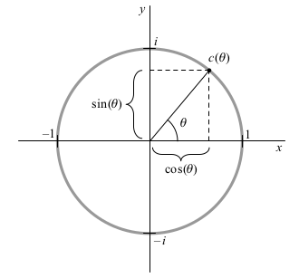
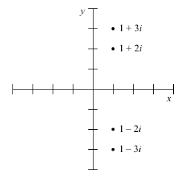
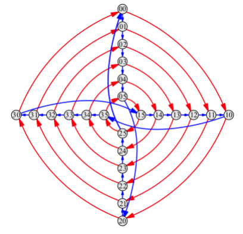
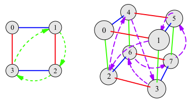
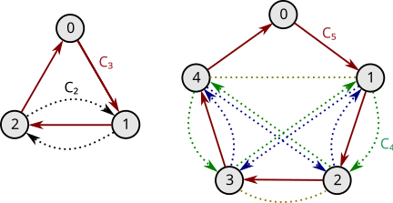
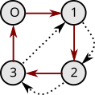

---
jupytext:
  text_representation:
    extension: .md
    format_name: myst
    format_version: 0.13
    jupytext_version: 1.16.1
kernelspec:
  display_name: Python 3 (ipykernel)
  language: python
  name: python3
---

# 10.8 Exercises

+++

## 10.8.1 Basics

+++

### Exercise 10.1

+++

> (a) a number in ℕ

+++

4

+++

> (b) a number in ℤ but not ℕ

+++

-4

+++

> (c) a number in ℚ but not ℤ

+++

3/7

+++

> (d) a number in ℝ but not ℚ (i.e. irrational)

+++

$π$

+++

> (e) an algebraic number not in ℝ

+++

$\sqrt{2}$

+++

> (f) a number in ℂ that's not algebraic (i.e. transcendental)

+++

$π$

+++

> (g) a number in ℂ that's not algebraic nor in ℝ

+++

$π + i$

+++

### Exercise 10.2

+++

> Simplify each of these complex-number expressions.
> 
> (a) $(12 + i)(3 - i)$

+++

$36 + 3i - 12i + 1 = 37 - 9i$

+++

> (b) $2i(1 + i + i³) - 9$

+++

$2i - 2 + 2 - 9 = -9 + 2i$

+++

### Exercise 10.3 (📑)

+++

> Identify which of the following statements are true and which are false, and explain why.
>
> (a) Saying a polynomial is "solvable" means that it has solutions.

+++

False. The term "solvable" means "solvable by radicals" (confusingly).

+++

> (b) Every quartic polynomial is solvable.

+++

True

+++

> (c) Every quintic polynomial is solvable.

+++

False. See section 10.7.2 for an example.

+++

> (d) No quintic polynomial is solvable.

+++

False. The equation $x^5 = 0$ is solvable (it's zero).

+++

> (e) Every sextic (degree 6) polynomial is solvable.

+++

False

+++

> (f) No sextic polynomial is solvable.

+++

False. The equation $x^6 = 0$ is solvable (it's zero).

+++

> (g) Because every Galois group contains the complex conjugacy operation, every Galois group has even order.

+++

False. The field extension $ℚ(\sqrt{2})$ includes the complex conjugacy operation, but it's trivial. See [Complex conjugation in the Galois group of a polynomial](https://math.stackexchange.com/questions/103716/complex-conjugation-in-the-galois-group-of-a-polynomial/103730#103730) for details.

+++

> (h) Every polynomial $x^2 - a$ (for $a > 0$ in $ℚ$) is irreducible.

+++

False. Consider $x^2 - 1 = (x + 1)(x - 1)$ and $x^2 - 4 = (x + 2)(x - 2)$.

+++

> (i) The Eisenstein Criterion can never be used to conclude that a polynomial is factorable. It only tells us when a polynomial is not factorable.

+++

True. It is a sufficient condition but not a necessary one.

+++

> (j) If a quintic polynomial factors over $ℚ$, then it is solvable.

+++

True

+++

> (k) Every Galois group is finite.

+++

False. See [Galois group § Infinite groups](https://en.wikipedia.org/wiki/Galois_group#Infinite_groups).

+++

> (l) Every algebraic number is a real number.

+++

False. Imaginary numbers are algebraic.

+++

> (m) Every real number is an algebraic number.

+++

False. The number $π$ is not real but algebraic. The equation $(x - π)^2 = 0$ doesn't count because the coefficients aren't in $ℚ$.

+++

### Exercise 10.4

+++

Question fixed based on the following from the errata (⚠️):

> Page 253, Exercise 10.4: In part (a), step 2 actually yields $\frac{-x^2-x-2}{x^2+1}$.

+++

> I say in the text that any equation made from the operations of arithmetic can be simplified to a polynomial equal to zero. The following simplification procedure supports my claim.
>
> 1. If needed, subtract to move the right side over to the left, leaving just zero on the right.
> 2. Combine fractions until the left-hand side contains at most one fraction. (More on this step below.)
> 3. Multiply both sides of the equation by the fraction's denominator, leaving a polynomial equal to zero.
>
> Answer the following questions to show that the above procedure works.
>
> (a) Consider $\frac{x-1}{x + \frac{1}{x}} = 2$. Applying step 1 yields $\frac{x-1}{x + \frac{1}{x}} - 2 = 0$, and step
2 then yields $\frac{-x^2-x-2}{x^2+1}$. Explain how step 2 was applied (that is, show the steps).

+++

$$
\begin{align}
\frac{x-1}{x + \frac{1}{x}} - 2 & = 0 \\
\frac{x(x-1)}{x(x + \frac{1}{x})} - 2 & = 0 \\
\frac{x^2-x}{x^2 + 1} - 2 & = 0 \\
\frac{x^2-x}{x^2 + 1} - 2\frac{x^2 + 1}{x^2 + 1} & = 0 \\
\frac{-x^2-x-2}{x^2 + 1} & = 0
\end{align}
$$

+++

> (b) In general, if step 1 results in two fractions subtracted, how should they be combined? What other algebra steps may be needed to get a large, complicated expression down to containing at most one fraction?

+++

The top and bottom of the two fractions should be multiplied by a polynomial that makes both fractions have the same denominator, so they can be combined. In general this is the least common multiple of the two polynomials, but multiplying the two denominators will produce a polynomial that works.

+++

> (c) What might equations from algebra that contain at most one fraction look like? Why does step 3 always turn them into polynomials?

+++

An example might be $\frac{x^5}{1 + x^{-3}} + 6x = 0$. When we multiply by the one fraction's denominator we always remove it.

+++

> (d) What equation results if we apply step 3 to the expression from part (a)?

+++

$-x^2 - x - 2 = 0$

+++

> (e) Explain how any polynomial equation whose coefficients are rational numbers can be turned into one with only integer coefficients. Test your method on $\frac{2}{9}x^7 - \frac{11}{8}x + \frac{1}{2} = 0$.

+++

Multiply the equation by the least common multiple of the denominators i.e. 72:

```{code-cell} ipython3
import math

math.lcm(2,8,9)
```

$$
72\frac{2}{9}x^7 - 72\frac{11}{8}x + 72\frac{1}{2} = 16x^7 - 99x + 36 = 0
$$

+++

### Exercise 10.5 (📑)

+++

> Prove the missing step in Theorem 10.3, that:
>
> $\overline{(a + bi)(c + di)} = (\overline{a + bi})(\overline{c + di})$

+++

$$
\overline{(a + bi)(c + di)} = \overline{ac - bd + (bc + ad)i} = ac - bd - (bc + ad)i = (a - bi)(c - di) = (\overline{a + bi})(\overline{c + di})
$$

+++

### Exercise 10.6 (📑)

+++

See the following from the errata if you use the author's explanation (⚠️):

> Pages 253-254, Exercise 10.6: Every occurrence of 24x in the example polynomial division should actually be 26x.

+++

Otherwise, see [Polynomial long division](https://en.wikipedia.org/wiki/Polynomial_long_division).

+++

> Solve the following polynomial division problems. The solutions for the first two are available in the back of the book.
>
> (a) $\frac{x^3-1}{x-1}$

+++


+++

> (b) $(76x^7 + 20x^6 - 38x^4 - 10x^3 + 2) ÷ (4x^6 - 2x^3)$

+++

See the book's solution.

+++

> (c) $(x^5-1) ÷ (x-1)$

+++

$x^4 + x^3 + x^2 + x + 1$

+++

> (d) Another polynomial

+++

Skipping; it doesn't seem like there'd be much insight to gain from this exercise.

+++

> (e) $\frac{x^n-1}{x-1}$

+++

$x^{n-1} + x^{n-2} + \cdots + x + 1$

+++

> (f) Factor the lower right polynomial in Figure 10.6 into irreducible polynomials.

+++

The polynomial is $8x^5 - 28x^4 - 6x^3 + 83x^2 - 117x + 90$; notice the roots are in that figure as well. So this should be as simple as:

$$
(x + 2)(x - 3/2)(x - 3)(x - (1/2 - i))(x - (1/2 + i)) = (x + 2)(x - 3/2)(x - 3)(x^2 - x + 5/4)
$$

+++

> (g) If a division (such as part (d)) does not come out even, but has a remainder, does that make the polynomial irreducible?

+++

No, we may have simply divided by an expression that is not a factor.

+++

### Exercise 10.7

+++

> Discern whether the following polynomials are irreducible. For those that are reducible, factor them.
>
> (a) $x^2 - 14x + 51$

+++

For an order-2 polynomial we can rely on the [Quadratic equation](https://en.wikipedia.org/wiki/Quadratic_equation). The [Discriminant](https://en.wikipedia.org/wiki/Discriminant) is:

+++

$$
b^2 - 4ac = 196 - 204 = -8
$$

+++

Since this is negative, the polynomial is irreducible.

+++

> (b) $60x^2 + 50x - 10$

+++

To avoid big numbers, we can immediately reduce this to $6x^2 + 5x - 1 = 0$.

$$
\frac{-b±\sqrt{b^2-4ac}}{2a} = \frac{-5±\sqrt{25+24}}{12} = \left\{\frac{1}{6}, -1\right\}
$$

+++

(c) $9x^3 - 36x^2 + x - 4$

+++

See [Cubic equation](https://en.wikipedia.org/wiki/Cubic_equation#History). Cardano's formula is rather complicated, so we'll use technology to guess-and-check:

```{code-cell} ipython3
import numpy as np
import matplotlib.pyplot as plt

x = np.linspace(-2,5,100)
y = [np.polyval([9,-36,1,-4], i) for i in x]
plt.grid(); plt.plot(x,y); plt.show()
```


+++

## 10.8.2 Fields and extensions

+++

### Exercise 10.8 (📑)

+++

Skipping this question; all of it is rather simple. The purpose of adding this question seems to be to show the symmetry of it with Exercise 10.9. Roughly speaking, we're inspecting the field $ℝ(i)$ in this question (showing $ℂ = ℝ(i)$) and $ℚ(\sqrt{2})$ in the next. Another question could show $ℝ(i,j,k)$ produces the quaternions.

+++

### Exercise 10.9 (📑)

+++

Question fixed based on the following from the errata (⚠️):

> Page 255, Exercise 10.9: In part (e), you may also assume that $\sqrt{6}$ is irrational.

+++

> This exercise proves several claims from the text about $ℚ(\sqrt{2})$. I claimed that the set of elements $a + b\sqrt{2}$ for $a, b ∈ ℚ$ is the smallest field containing $ℚ$ and $\sqrt{2}$.
>
> (a) Show that addition, $(a + b\sqrt{2}) + (c + d\sqrt{2})$, produces a new element of the same form.

+++

$(a + b\sqrt{2}) + (c + d\sqrt{2}) = (a + c) + (b + d)\sqrt{2}$

+++

> (b) Show that multiplication, $(a + b\sqrt{2})(c + d\sqrt{2})$, produces a new element of the same form.

+++

$(a + b\sqrt{2})(c + d\sqrt{2}) = (ac + 2bd) + (cb + ad)\sqrt{2}$

+++

> (c) What is the additive inverse of $a + b\sqrt{2}$?

+++

$-a + (-b)\sqrt{2}$

+++

> (d) What is the multiplicative inverse of $a + b\sqrt{2}$?

+++

$$
\frac{1}{a + b\sqrt{2}} = \frac{a - b\sqrt{2}}{a^2 - 2b^2} = \frac{a}{a^2 - 2b^2} + \frac{-b}{a^2 - 2b^2}\sqrt{2}
$$

+++

> (e) Show that no $a + b\sqrt{2}$ can equal $\sqrt{3}$, by simplifying $(a + b\sqrt{2})^2 = 3$ and finding no solutions. Recall that $\sqrt{2}$ and $\sqrt{3}$ and $\sqrt{6}$ are irrational.

+++

An initial simplification:

+++

$$
(a + b\sqrt{2})^2 = (a^2 + 2b^2) + 2ab\sqrt{2} = 3 + 0\sqrt{2}
$$

+++

We can use the quadratic equation to solve for possible values of $a$ in terms of $b$:

+++

$$
a² + (2b\sqrt{2})a + (2b² - 3) = 0
$$

+++

The solutions:

+++

$$
\begin{align}
a & = \frac{-2b\sqrt{2} ± \sqrt{8b² - 4(2b² - 3)}}{2} \\
  & = \frac{-2b\sqrt{2} ± \sqrt{12}}{2} \\
  & = -b\sqrt{2} ± \sqrt{3} \\
\end{align}
$$

+++

We need selections of $a,b$ that are rational. We could set $b = 0$ but then $a = ±\sqrt{3}$. We could set $a = 0$ but then $b$ would include radicals. There's no solution that keeps both $a,b$ free of radicals.

+++

The author's solution sees $a,b$ as elements of a vector space (a good way to see the problem) and reinterprets the above as a system of equations:

+++

$$
\begin{align}
a^2 + 2b^2 & = 3 \\
2ab & = 0
\end{align}
$$

+++

In this view we must more clearly set either $a$ or $b$ to zero. With either option, there's still no non-radical solution for the other variable.

+++

> (f) Show that no $a + b\sqrt{2}$ can equal $\sqrt[3]{2}$, by simplifying $(a + b\sqrt{2})^3 = 2$ and finding no solutions. Recall that $\sqrt[3]{2}$ is irrational.

+++

An initial simplification:

+++

$$
(a + b\sqrt{2})^3 = ((a^2 + 2b^2) + 2ab\sqrt{2})(a + b\sqrt{2}) = (a^3 + 2ab^2 + 4ab^2) + (a^2b + 2b^3 + 2a^2b)\sqrt{2} = (a^3 + 6ab^2) + (3a^2b + 2b^3)\sqrt{2}= 2 + 0\sqrt{2}
$$

+++

So we need:

+++

$$
\begin{align}
a^3 + 6ab^2 & = 2 \\
3a^2b + 2b^3 & = 0
\end{align}
$$

+++

Solving for $b^2$ in the second equation:

+++

$$
\begin{align}
3a^2 & = -2b^2 \\
\frac{-3a^2}{2} & = b^2
\end{align}
$$

+++

Plugging this into the first equation:

+++

$$
\begin{align}
a^3 + 6a\frac{-3a^2}{2} & = 2 \\
a^3 - 9a^3 & = 2 \\
8a^3 & = 2 \\
a^3 & = \frac{1}{4} \\
\end{align}
$$

+++

Clearly this has no solution that can be expressed in the rationals.

+++

### Exercise 10.10

+++

> In Sections 10.5.1 and 10.5.2, I analyzed $ℚ(\sqrt{2})$, giving the formula $a + b\sqrt{2}$ for a typical element and computing its Galois group.
>
> (a) Do a similar analysis for $ℚ(\sqrt{3})$.

All the logic should be the same, just with a new symbol.

+++

> (b) Is $ℚ(\sqrt{3})$ inside $ℚ(\sqrt{2})$? Is $ℚ(\sqrt{2})$ inside $ℚ(\sqrt{3})$?

+++

No, they share all the rationals but not e.g. $\sqrt{2}$ (only in one) and $\sqrt{3}$ (only in the other).

+++

> (c) Is $ℚ(\sqrt{3})$ inside $ℚ(\sqrt{2}, \sqrt{3})$?

+++

Yes

+++

### Exercise 10.11 (📑)

+++

> I say in the text that $ℚ(\sqrt{2})(\sqrt{3}) = ℚ(\sqrt{3})(\sqrt{2})$, and that it is a field whose elements have the form $a + b\sqrt{2} + c\sqrt{3} + d\sqrt{6}$. This exercise asks you to give the evidence for this claim.
>
> (a) Show that all four terms are necessary to express elements of $ℚ(\sqrt{2})(\sqrt{3})$.

+++

Say you multiply two terms of the form $a + b\sqrt{2}$ and $c + d\sqrt{3}$. The result will introduce the term $\sqrt{2}\sqrt{3} = \sqrt{6}$:

$$
(a + b\sqrt{2})(c + d\sqrt{3}) = ac + bc\sqrt{2} + ad\sqrt{3} + bd\sqrt{6}
$$

+++

> (b) Show that the set of all such terms is closed under addition and contains the additive inverse of each of its elements.

+++

$(a_1 + b_1\sqrt{2} + c_1\sqrt{3} + d_1\sqrt{6)} + (a_2 + b_2\sqrt{2} + c_2\sqrt{3} + d_2\sqrt{6}) = (a_1 + a_2) + (b_1 + b_2)\sqrt{2} + (c_1 + c_2)\sqrt{3} + (d_1 + d_2)\sqrt{6}$

The additive inverse of $a + b\sqrt{2} + c\sqrt{3} + d\sqrt{6}$ is:

$$
-a + -b\sqrt{2} + -c\sqrt{3} + -d\sqrt{6}
$$

+++

> (c) Show that it is also closed under multiplication and contains each element's multiplicative inverse.

+++

$$
\begin{align}
& =(a_1 + b_1\sqrt{2} + c_1\sqrt{3} + d_1\sqrt{6})(a_2 + b_2\sqrt{2} + c_2\sqrt{3} + d_2\sqrt{6}) \\
& =
(a_1)(a_2 + b_2\sqrt{2} + c_2\sqrt{3} + d_2\sqrt{6}) +
(b_1\sqrt{2})(a_2 + b_2\sqrt{2} + c_2\sqrt{3} + d_2\sqrt{6}) +
(c_1\sqrt{3})(a_2 + b_2\sqrt{2} + c_2\sqrt{3} + d_2\sqrt{6}) +
(d_1\sqrt{6})(a_2 + b_2\sqrt{2} + c_2\sqrt{3} + d_2\sqrt{6}) \\
& =
(a_1a_2 + a_1b_2\sqrt{2} + a_1c_2\sqrt{3} + a_1d_2\sqrt{6}) +
(a_2b_1\sqrt{2} + b_2b_12 + c_2b_1\sqrt{6} + d_2b_12\sqrt{3}) +
(a_2c_1\sqrt{3} + b_2c_1\sqrt{6} + c_2c_13 + d_2c_13\sqrt{2}) +
(d_1\sqrt{6}a_2 + b_2d_12\sqrt{3} + c_2d_13\sqrt{2} + d_2d_16)
\end{align}
$$

+++

Skipping the multiplicative inverse, because it seems like busy work. See the book's answer.

+++

> (d) Show that $Q(\sqrt{6})(\sqrt{2}) = Q(\sqrt{6})(\sqrt{3}) = Q(\sqrt{2},\sqrt{3})$.

+++

The general form of $Q(\sqrt{6})$ should be $a_0 + a_1\sqrt{6}$. The general form of $Q(\sqrt{6})(\sqrt{2})$ will be $b_0 + b_1\sqrt{2}$ with $b_0,b_1$ coming from $Q(\sqrt{6})$, so that we have complete terms of the form:

$$
\begin{align}
& (a_0 + a_1\sqrt{6}) + (a_2 + a_3\sqrt{6})\sqrt{2} \\
& = a_0 + a_1\sqrt{6} + a_2\sqrt{2} + a_3\sqrt{6}\sqrt{2} \\
& = a_0 + a_1\sqrt{6} + a_2\sqrt{2} + 2a_3\sqrt{3} \\
& = c_0 + c_1\sqrt{6} + c_2\sqrt{2} + c_3\sqrt{3}
\end{align}
$$

+++

The calculations for the other extensions are similar.

+++

### Exercise 10.12 (📑)

+++

> Theorem 10.5 can be proven in two steps, the first of which is much harder than the second. I give both steps here, and ask you to prove the second. If you like a challenge, try proving the first as well.
>
> First, show that every element of $ℚ(r)$ can be written as some:
>
> $$
c_0 + c_1r + c_2r^2 + \dots + c_nr^n
$$
>
> with each $c_i ∈ ℚ$.
>
> Second, show that $n$ is always less than the degree of the polynomial for which $r$ is a root.

+++

Call the degree of the polynomial $d$. As an example, consider $ℚ(\sqrt{2})$. The irreducible polynomial $x^2 - 2$ is of degree $d = 2$, so every element can be written in the form $c_0 + c_1\sqrt{2}$ with each $c_i ∈ ℚ$. In this case $n = 1$ is less than $d = 2$.

+++

As a more interesting example, consider $ℚ(\sqrt[3]{2})$. The irreducible polynomial $x^3 - 2$ is of degree three, but can every element be written in the form $c_0 + c_1\sqrt[3]{2} + c_2\sqrt[3]{2}^2$ with each $c_i ∈ ℚ$? Yes; the discussion in section 10.5.5 implies we need $n = 5$ but that's to include all 3 roots of the original equation. So in this example $n = 2$ and $d = 3$.

+++

Why do these two steps prove Theorem 10.5? If we can show that $n < d$, then because $n + 1$ is the degree of the extension $[ℚ(r):ℚ]$ (notice there are $n+1$ terms $c_i$ in the above) then we've shown the degree of the extension is less than or equal to the degree of the polynomial.

+++

Clearly, this only shows $n \leq d$, rather than $n = d$ as Theorem 10.5 claims. Let's return to the $r = \sqrt{2}$ example, and pretend we chose as $x^4 - 4$ as the polynomial to which it is a root rather than $x^2 - 2$. Suddenly, $d$ has changed despite the fact that our root is still the same (and if our root is the same, then the extension should be of the same degree). How is Theorem 10.5 supposed to work in general?

+++

The simple answer is that we could have reduced $x^4 - 4$ to $(x^2 - 2)(x^2 + 2)$ and taken our smaller degree polynomial from the factorization. Per [Minimal polynomial (field theory)](https://en.wikipedia.org/wiki/Minimal_polynomial_(field_theory)), it should always be possible to factor the minimal polynomial associated with a root out of any other polynomial that has it as a root, whether irreducible or not. The author has only focused on [Irreducible polynomial](https://en.wikipedia.org/wiki/Irreducible_polynomial) to get the degree as small as possible, while technically the minimal polynomial is also monic (and hence unique). For example, $2x^2 - 4$ is irreducible, but not minimal. See also [Abel's irreducibility theorem](https://en.wikipedia.org/wiki/Abel%27s_irreducibility_theorem).

+++

So, we're assuming $ℚ(r)$ is only as big as it needs to be so that it includes the root $r$ and is still a field (closed, etc.). Additionally, we require that the minimal polynomial be only as big as it needs to be so that $r$ is a root.

+++

Going forward, let's work in $ℚ(r)$ rather than $ℚ$. That means we can use $r$ in our equations. We can expect $r$ to be a zero to some function of the form (i.e. the minimal polynomial):

+++

$$
f(x) = x^d + a_{n-1}x^{d-1} \dots + a_1x + a_0
$$

+++

This means we know that:

+++

$$
r^d + a_{n-1}r^{d-1} \dots + a_1r + a_0 = 0
$$

+++

It appears we need terms of degree $r^d$ in $ℚ(r)$ to express the above equation, but these elements can be expressed in terms of lower-order powers of $r$:

+++

$$
r^d = -a_{n-1}r^{d-1} \dots - a_1r - a_0
$$

+++

So in general we need $n = d - 1$ or $n + 1 = d$.

+++

You can also see this (less generally) if you think of $r$ as a radical applied to a single rational $m$. The term $r^d$ will correspond (by the design of radicals) to a rational, so we don't need a place for them in the vector basis. If $m$ isn't square-free or cube-free or we're taking non-prime powers this gets more complicated, however.

+++

### Exercise 10.13

+++

> (a) Make a diagram like Figure 10.17 for the field extension $ℚ(\sqrt{2})$ and its Galois group, which is isomorphic to $C_2$.

+++


+++

> (a) Make a diagram like Figure 10.17 for the field extension $ℚ(\sqrt{2},\sqrt{3})$ and its Galois group, which is isomorphic to $V_4$.

+++


+++

### Exercise 10.14

+++

> Compute the Galois group of $ℚ(i)$ as an extension of $ℚ$.

+++

Assume every term is of the form $a + bi$ where $a$ and $b$ are in $ℚ$ (typically they're in $ℝ$).

It's clearly closed under addition and multiplication. The additive and multiplicative inverses are also not any different than with $ℝ$. The additive and multiplicative identities are also unchanged relative to $ℝ$.

+++

See also [Gaussian rational](https://en.wikipedia.org/wiki/Gaussian_rational).

+++

### Exercise 10.15

+++

> Recall the function $ϕ: Q(\sqrt{2}) → Q(\sqrt{2})$ from Section 10.5.3, defined by $ϕ(a + b\sqrt{2}) = a - b\sqrt{2}$.
>
> (a) Show that it is a field automorphism, meaning that it satisfies the following two equations.
>
> $$
ϕ(a + b) = ϕ(a) + ϕ(b)  \hspace{60pt}  ϕ(a·b) = ϕ(a)·ϕ(b)
$$

+++

$ϕ(a + b\sqrt{2} + c + d\sqrt{2}) = (a + c) - (b + d)\sqrt{2} = ϕ(a + b\sqrt{2}) + ϕ(c + d\sqrt{2})$

$ϕ((a + b\sqrt{2})·(c + d\sqrt{2})) = ϕ(ac + 2bd + (bc + ad)\sqrt{2}) = ac + 2bd - (bc + ad)\sqrt{2} = ϕ(a + b\sqrt{2})ϕ(c + d\sqrt{2}) = (a - b\sqrt{2})(c - d\sqrt{2})$

+++

> (b) Explain why it fixes $ℚ$.

+++

It doesn't affect the $a$ part of the equations above.

+++

### Exercise 10.16

+++

> Explain why the Galois group of any irreducible quadratic polynomial is isomorphic to $C_2$.

+++

The quadratic function must have imaginary zeros because it is irreducible, so the complex conjugacy automorphism must be in the Galois group. Since there are only two roots (by the fundamental theorem of algebra), this must be the only permutation besides the identity. The only group of size two is $C_2$.

+++

### Exercise 10.17 (📑)

+++

> Every polynomial $x^n - a$ (for $a > 0$ in $ℚ$) has the solution $\sqrt[n]{a}$ in the positive real numbers. But it actually has n - 1 other solutions as well, most of which are not real numbers.
>
> I define the function $c: ℝ → ℂ$ by $c(θ) = cos(θ) + isin(θ)$. This function gives the point in the complex plane that is one unit distant from (0,0) in the direction of the angle $θ$, as shown here.
>
> 

+++

The author is providing another name for [cis (mathematics)](https://en.wikipedia.org/wiki/Cis_(mathematics)); this is also simply Euler's formula $e^{iθ}$. See also [Root of unity](https://en.wikipedia.org/wiki/Root_of_unity).

+++

> (a) Use the trigonometric identities
>$$
\begin{align}
                     cos(α + β) = cos(α)cos(β) - sin(α)sin(β) \\
        \text{and}  \qquad           sin(α + β) = sin(α)cos(β) + cos(α)sin(β)
\end{align}
$$
> to prove that $c(α)·c(β) = c(α + β)$.

+++

$$
(cos(α) + isin(α))·(cos(β) + isin(β)) = cos(α)cos(β) - sin(α)sin(β) + i(cos(α)sin(β) + sin(α)cos(β)) = cos(α + β) + isin(α + β)
$$

+++

> (b) Explain why $c$ is a homomorphism from the group $ℝ$ under addition to the group $ℂ$ under multiplication. Is it an embedding or a quotient map?

+++

Part (a) shows the homomorphism. It is a quotient map because e.g. $0$ and $2\pi$ are mapped to the same place.

+++

> (c) What is $c(α)^n$?

+++

Notice using part (a)'s result that $c(α)·c(α) = c(α)² = c(α + α) = c(2α)$. Therefore:

$$
c(α)·c(2α) = c(α)c(α)^2 = c(α)^3 = c(α + 2α) = c(3α)
$$

By mathematical induction, we have $c(α)^n = c(nα)$.

+++

> (d) Let $r_1 = \sqrt[3]{2}$, $r_2 = \sqrt[3]{2}·c(2π/3)$, and $r_3 = \sqrt[3]{2}·c(4π/3)$. Compare these values to those in Section 10.5.5.

+++

$$
\begin{align}
r_2 & = \sqrt[3]{2}\left(-\frac{1}{2} + i\frac{\sqrt{3}}{2}\right) \\
r_3 & = \sqrt[3]{2}\left(-\frac{1}{2} - i\frac{\sqrt{3}}{2}\right)
\end{align}
$$

+++

If we let $z = \left(-\frac{1}{2} + i\frac{\sqrt{3}}{2}\right)$ (variable name from [Root of unity](https://en.wikipedia.org/wiki/Root_of_unity)) then $z^2 = \left(-\frac{1}{2} - i\frac{\sqrt{3}}{2}\right)$ and we can express these more simply as:

+++

$$
\begin{align}
r_2 & = \sqrt[3]{2}z \\
r_3 & = \sqrt[3]{2}z^2
\end{align}
$$

+++

> (e) Prove that if $r = \sqrt[n]{a}$, then every $\sqrt[n]{a}·c(2πk/n)$ is also a root of $x^n - a$, for any natural number $k$. (Assume $a > 0$ in $ℚ$.)

+++

Let $r = \sqrt[n]{a}·c(2πk/n)$. Then:

$$
r^n = (\sqrt[n]{a}·c(2πk/n))^n = a·c(2πk/n)^n = a·c(2πk) = a(cos(2πk) + isin(2πk)) = a(1 + i0) = a
$$

+++

> (f) Consider the group of roots of $x^6 - 1$ under the operation of multiplication. To what group is it isomorphic? What elements generate it?

+++

It's isomorphic to $C_6$ with the generator $c(2π/6) = c(π/3) = \frac{1}{2} + i\frac{\sqrt{3}}{2}$$.

All the elements that generate it are $c(1·2π/6)$ and $c(5·2π/6)$.

+++

> (g) Consider the group of roots of $x^n - 1$ under the operation of multiplication. To what group is it isomorphic? What elements generate it?

+++

It's isomorphic to $C_n$ with the generator $c(2π/n)$.

+++

### Exercise 10.18

+++

> Section 10.5.5 analyzed $ℚ(r_1)$, finding the expression for a typical element and computing the Galois group.
>
> (a) Do the same for $ℚ(r_2)$. What are the similarities and differences?

+++

Taking the roots from Section 10.5.5, and the previous question:

+++

$$
\begin{align}
r_1 & = \sqrt[3]{2} \\
r_2 & = \sqrt[3]{2}\left(-\frac{1}{2} + i\frac{\sqrt{3}}{2}\right) = \sqrt[3]{2}z   = \sqrt[3]{2}e^{i2\pi/3} \\
r_3 & = \sqrt[3]{2}\left(-\frac{1}{2} - i\frac{\sqrt{3}}{2}\right) = \sqrt[3]{2}z^2 = \sqrt[3]{2}e^{i4\pi/3}
\end{align}
$$

+++

Checking for closure under multiplication:

+++

$$
(a_0 + a_1r_2)(a_2 + a_3r_2) = a_0c + (a_1a_2 + a_0a_3)r_2 + a_1a_3(r_2)^2
$$

+++

The $(r_2)^2$ term is:

+++

$$
(r_2)^2 = \left(\frac{\sqrt[3]{2}}{2}(-1 + i\sqrt{3})\right)\left(\frac{\sqrt[3]{2}}{2}(-1 + i\sqrt{3})\right) = \frac{\sqrt[3]{2}^2}{4}(1 - 2i\sqrt{3} - 3) = \frac{\sqrt[3]{2}^2}{4}(-2 - 2i\sqrt{3}) = (\sqrt[3]{2})^2z^2 = (z\sqrt[3]{2})^2
$$

+++

So we have a new term; assume the general form is:

$$
\begin{align}
c & = b_0 + b_1r_2 + b_2(r_2)^2 \\
  & = b_0 + b_1z\sqrt[3]{2} + b_2(z\sqrt[3]{2})^2
\end{align}
$$

+++

Checking for closure under multiplication:

+++

$$
\begin{align}
c_1c_2 &= (b_0 + b_1r_2 + b_2(r_2)^2)(b_3 + b_4r_2 + b_5(r_2)^2) \\
       &= b_0b_3 + (b_1b_3 + b_0b_4)r_2 + (b_0b_5 + b_2b_3 + b_1b_4)(r_2)^2 + (b_2b_4 + b_1b_5)(r_2)^3 + b_2b_5(r_2)^4
\end{align}
$$

+++

The new terms are:

$$
\begin{align}
(r_2)^3 &= (\sqrt[3]{2}z)^3 = 2 \\
(r_2)^4 &= (\sqrt[3]{2}z)^4 = 2r_2
\end{align}
$$

+++

So the above simplifies to:

+++

$$
\begin{align}
c_1c_2 &= (b_0b_3 + 2b_2b_4 + 2b_1b_5) + (b_1b_3 + b_0b_4 + 2b_5b_2)r_2 + (b_0b_5 + b_2b_3 + b_1b_4)(r_2)^2
\end{align}
$$

+++

To show the multiplicative inverse is of the same form, we'd like to make the term above equal one. We have three equations and three degrees of freedom:

+++

$$
\begin{align}
1 &= b_0b_3 + 2b_2b_4 + 2b_1b_5  \\
0 &= b_1b_3 + b_0b_4 + 2b_2b_5   \\
0 &= b_0b_5 + b_2b_3 + b_1b_4
\end{align}
$$

+++

Solving for $b_5$ in the last, and plugging it into the second equation:

+++

$$
\begin{align}
b_5 &= -\frac{b_2b_3 + b_1b_4}{b_0} \\
0 &= b_1b_3 + b_0b_4 -2b_2\frac{b_2b_3 + b_1b_4}{b_0} \\
0 &= b_0b_1b_3 + b_0^2b_4 - 2b_2^2b_3 - 2b_1b_2b_4    \\
\end{align}
$$

+++

Solving for $b_4$ in the previous equation, and plugging it and $b_5$ into the first equation:

+++

$$
\begin{align}
b_4 &= b_3\frac{2b_2^2 - b_0b_1}{b_0^2 - 2b_1b_2}    \\
1 &= b_0b_3 + 2b_2b_3\frac{2b_2^2 - b_0b_1}{b_0^2 - 2b_1b_2} - 2b_1\frac{b_2b_3 + b_1b_3\frac{2b_2^2 - b_0b_1}{b_0^2 - 2b_1b_2}}{b_0} \\
b_0 &= b_0^2b_3 + 2b_0b_2b_3\frac{2b_2^2 - b_0b_1}{b_0^2 - 2b_1b_2} - 2b_1(b_2b_3 + b_1b_3\frac{2b_2^2 - b_0b_1}{b_0^2 - 2b_1b_2}) \\
(b_0^2 - 2b_1b_2)b_0 &= (b_0^2 - 2b_1b_2)b_0^2b_3 + 2b_0b_2b_3(2b_2^2 - b_0b_1) - 2b_1b_2b_3(b_0^2 - 2b_1b_2) - 2b_1^2b_3(2b_2^2 - b_0b_1) \\
b_3 &= \frac{(b_0^2 - 2b_1b_2)b_0}{(b_0^2 - 2b_1b_2)b_0^2 + 2b_0b_2(2b_2^2 - b_0b_1) - 2b_1b_2(b_0^2 - 2b_1b_2) - 2b_1^2(2b_2^2 - b_0b_1)} \\
\end{align}
$$

+++

Although this is quite complicated, it shows that the multiplicative inverse can be expressed in the same form:

+++

$$
\begin{align}
\frac{1}{c} &= \frac{1}{b_0 + b_1r_2 + b_2(r_2)^2} \\
            &= \frac{b_3 + b_4r_2 + b_5(r_2)^2}{(b_0 + b_1r_2 + b_2(r_2)^2)(b_3 + b_4r_2 + b_5(r_2)^2)} \\
            &= b_3 + b_4r_2 + b_5(r_2)^2
\end{align}
$$

+++

The new general form is also clearly closed under addition. The additive identity is zero and the multiplicative identity is 1. The additive inverse is:
$$
-a - br_2 - c(r_2)^2
$$

+++

<!--
$$
\begin{align}
c_1c_2 &= (b_0 + b_1r_2 + b_2(r_2)^2)(b_3 + b_4r_2 + b_5(r_2)^2) \\
       &= (b_0b_3 + 2b_2b_4 + 2b_1b_5) + (b_1b_3 + b_0b_4 + 2b_5b_2)r_2 + (b_0b_5 + b_2b_3 + b_1b_4)(r_2)^2 \\
       &= b_0b_3 + (b_1b_3)r_2 + (b_0b_4)r_2^{-1} + (-b_0b_5)(r_2)^{-2} + (b_2b_3)(r_2)^2 + b_1b_4 + (b_2b_4)r_2 + (b_1b_5)(r_2)^{-1} + b_5b_2
\end{align}
$$

Set both $b_3$ and $b_5$ to zero, and use $b_4$ to eliminate just one term. Remove the second as a second step.

With only $b_3$, you get three equations with one degree of freedom. With $b_3, b_4$ you get six equations with two degrees of freedom at worst.

$$
\begin{align}
c_1c_2 &= (b_0 + b_1z\sqrt[3]{2} + b_2(z\sqrt[3]{2})^2)(b_3 + b_4z^{-1}\sqrt[3]{2} + b_5z^{-2}(\sqrt[3]{2})^2) \\
       &= b_0b_3 + (b_1b_3)\sqrt[3]{2}z + (b_0b_4)\sqrt[3]{2}z^2 + (b_0b_5)z(\sqrt[3]{2})^2) + (b_2b_3)z^2(\sqrt[3]{2})^2) + b_1b_4 + (b_2b_4)r_2 + (b_1b_5)(r_2)^{-1} + b_5b_2
\end{align}
$$
-->

+++

> (b) Do the same for $ℚ(r_3)$. To which of $ℚ(r_1)$ or $ℚ(r_2)$ is it more similar, and how?

+++

This analysis should be nearly the same as the one for $ℚ(r_2)$.

+++

> (c) Show that the expression for elements of $ℚ(r_1,r_2,r_3)$ is the six-term one given in Section 10.5.5, by analyzing $ℚ(r_1)(r_2)$, $ℚ(r_1)(r_3)$, or a similar field.

+++

The general form in $ℚ(r_1)$ is:

$$
a_0 + a_1\sqrt[3]{2} + a_2\sqrt[3]{2}^2
$$

+++

Let's extend it with $ℚ(r_2)$, assuming the general form:

+++

$$
b_0 + b_1z\sqrt[3]{2} + b_2(z\sqrt[3]{2})^2
$$

+++

Where all $b_i$ come from $ℚ(r_1)$. So a typical term is:

+++

$$
\begin{align}
c &= (a_0+a_1\sqrt[3]{2}+a_2\sqrt[3]{2}^2) + (a_3+a_4\sqrt[3]{2}+a_5\sqrt[3]{2}^2)z\sqrt[3]{2} + (a_6+a_7\sqrt[3]{2}+a_8\sqrt[3]{2}^2)(z\sqrt[3]{2})^2 \\
  &= a_0 + a_1\sqrt[3]{2} + a_2\sqrt[3]{2}^2 + a_3z\sqrt[3]{2} + a_4z(\sqrt[3]{2})^2 + 2a_5z + a_6z^2(\sqrt[3]{2})^2 + 2a_7z^2 + 2a_8z^2(\sqrt[3]{2}) \\
  &= a_0 + a_1\sqrt[3]{2} + a_2\sqrt[3]{2}^2 + 2(a_5z + a_7z^2) + \sqrt[3]{2}(a_3z + 2a_8z^2) + (\sqrt[3]{2})^2(a_4z + a_6z^2) \\
  &= a_0 + a_1\sqrt[3]{2} + a_2\sqrt[3]{2}^2 + 2(a_5\left(-\frac{1}{2} + i\frac{\sqrt{3}}{2}\right) + a_7\left(-\frac{1}{2} - i\frac{\sqrt{3}}{2}\right)) + \sqrt[3]{2}(a_3\left(-\frac{1}{2} + i\frac{\sqrt{3}}{2}\right) + 2a_8\left(-\frac{1}{2} - i\frac{\sqrt{3}}{2}\right)) + (\sqrt[3]{2})^2(a_4\left(-\frac{1}{2} + i\frac{\sqrt{3}}{2}\right) + a_6\left(-\frac{1}{2} - i\frac{\sqrt{3}}{2}\right)) \\
  &= a_0 + a_1\sqrt[3]{2} + a_2\sqrt[3]{2}^2 + a_5(-1 + i\sqrt{3}) + a_7(-1 - i\sqrt{3}) + \frac{\sqrt[3]{2}}{2}a_3(-1 + i\sqrt{3}) + a_8(-1 - i\sqrt{3}) + \frac{(\sqrt[3]{2})^2}{2}a_4(-1 + i\sqrt{3}) + \frac{(\sqrt[3]{2})^2}{2}a_6(-1 - i\sqrt{3}) \\
  &= (a_0 - a_5 - a_7 - a_8) + a_1\sqrt[3]{2} + a_2\sqrt[3]{2}^2 + (a_5 - a_7 - a_8)i\sqrt{3} + \frac{a_3}{2}\sqrt[3]{2}(-1 + i\sqrt{3}) + \frac{a_4}{2}(\sqrt[3]{2})^2(-1 + i\sqrt{3}) + \frac{a_6}{2}(\sqrt[3]{2})^2(-1 - i\sqrt{3}) \\
  &= (a_0 - a_5 - a_7 - a_8) + (a_1 - \frac{a_3}{2})\sqrt[3]{2} + a_2\sqrt[3]{2}^2 + (a_5 - a_7 - a_8)i\sqrt{3} + \frac{a_3}{2}i\sqrt{3}\sqrt[3]{2} + \frac{a_4}{2}(\sqrt[3]{2})^2(-1 + i\sqrt{3}) + \frac{a_6}{2}(\sqrt[3]{2})^2(-1 - i\sqrt{3}) \\
  &= (a_0 - a_5 - a_7 - a_8) + (a_1 - \frac{a_3}{2})\sqrt[3]{2} + (a_2 - \frac{a_4}{2} - \frac{a_6}{2})\sqrt[3]{2}^2 + (a_5 - a_7 - a_8)i\sqrt{3} + \frac{a_3}{2}i\sqrt{3}\sqrt[3]{2} + (\frac{a_4}{2} - \frac{a_6}{2})i\sqrt{3}(\sqrt[3]{2})^2 \\
\end{align}
$$

+++

It would have been much easier to show e.g. $ℚ(i\sqrt{3})(r_1)$ or $ℚ(r_1)(i\sqrt{3})$ has the six-term form, but this was only to show this approach was possible.

+++

> (d) For each of the irrational numbers that appears in that six-term form, find its irreducible polynomial over $ℚ$, and the smallest extension field of $ℚ$ containing it.

+++

The [Irreducible polynomial](https://en.wikipedia.org/wiki/Irreducible_polynomial) for all six irrational numbers:

+++

$$
\begin{align}
1:                        f(x) &= x - 1      \\
\sqrt[3]{2}:              f(x) &= x^3 - 2    \\
(\sqrt[3]{2})^2:          f(x) &= x^3 - 4    \\
i\sqrt{3}:                f(x) &= x^2 + 3    \\
\sqrt[3]{2}i\sqrt{3}:     f(x) &= x^6 + 108  \\
(\sqrt[3]{2})^2i\sqrt{3}: f(x) &= x^6 + 432  \\
\end{align}
$$

+++

We can call these "the" irreducible polynomials because they should be the [Minimal polynomial (field theory)](https://en.wikipedia.org/wiki/Minimal_polynomial_(field_theory)), being monic.

+++

Notice that although $ℚ(\sqrt[3]{2})$ includes $(\sqrt[3]{2})^2$, there's a different polynomial associated with it than $(\sqrt[3]{2})^2$. This isn't because this extension is not a [Normal extension](https://en.wikipedia.org/wiki/Normal_extension); it's not normal because the original irreducible polynomial $x^3 - 2$ doesn't split in it without a [Normal extension § Normal closure](https://en.wikipedia.org/wiki/Normal_extension#Normal_closure). The polynomial is different simply because the [Minimal polynomial (field theory)](https://en.wikipedia.org/wiki/Minimal_polynomial_(field_theory)) is defined to have $\alpha$ as a root, and $(\sqrt[3]{2})^2$ is not a root of $x^3 - 2$ (because $(\sqrt[3]{2})^6 = 4$).

+++

The smallest field extensions containing each element:

+++

$$
\begin{align}
1 &:                        ℚ                          \\
\sqrt[3]{2} &:              ℚ(\sqrt[3]{2})             \\
(\sqrt[3]{2})^2 &:          ℚ(\sqrt[3]{2})             \\
i\sqrt{3} &:                ℚ(i\sqrt{3})               \\
\sqrt[3]{2}i\sqrt{3} &:     ℚ(i\sqrt{3})(\sqrt[3]{2})  \\
(\sqrt[3]{2})^2i\sqrt{3} &: ℚ(i\sqrt{3})(\sqrt[3]{2})  \\
\end{align}
$$

+++

> (e) Arrange all the fields you found into a Hasse diagram.

+++

See the Hasse diagram in the text; it's not clear how this one would be any different.

+++

### Exercise 10.19

+++

> Use the irreducible polynomials you found in Exercise 10.18 to create the Galois group of $ℚ(r_1,r_2,r_3)$ as a group of automorphisms (using Theorem 10.8). Write each as a function operating on a typical element of $ℚ(r_1,r_2,r_3)$, as in:
>
> $$
a + b\sqrt[3]{2} + c(\sqrt[3]{2})^2 + d\sqrt{3}i + e\sqrt[3]{2}\sqrt{3}i + f(\sqrt[3]{2})^2\sqrt{3}i = a + b\sqrt[3]{2} + c(\sqrt[3]{2})^2 - d\sqrt{3}i - e\sqrt[3]{2}\sqrt{3}i - f(\sqrt[3]{2})^2\sqrt{3}i
$$
>
> Specify the isomorphism mentioned in Section 10.5.5, between $S_3$ and this Galois group.

+++

The question suggests simply writing out each function in an equality, but this doesn't provide a way to name the automorphisms (📌). We'll instead provide names via the same method as the text and the examples in [Fundamental theorem of Galois theory](https://en.wikipedia.org/wiki/Fundamental_theorem_of_Galois_theory):

+++

$$
ϕ_{\sqrt{3}i}(a + b\sqrt[3]{2} + c(\sqrt[3]{2})^2 + d\sqrt{3}i + e\sqrt[3]{2}\sqrt{3}i + f(\sqrt[3]{2})^2\sqrt{3}i) = a + b\sqrt[3]{2} + c(\sqrt[3]{2})^2 - d\sqrt{3}i - e\sqrt[3]{2}\sqrt{3}i - f(\sqrt[3]{2})^2\sqrt{3}i
$$

+++

The automorphism provided in the question exchanges the two zeros $\{\sqrt{3}i, -\sqrt{3}i\}$ of $f(x) = x^2 + 3$. We'll also refer to this automorphism as $ϕ_{\sqrt{3}i} = ϕ_f$, for reasons that will become obvious later.

+++

The first sentence of the question implies that each of the minimal polynomials from Exercise 10.18 part (d) is associated with an automorphism. Each automorphism permutes the roots of a minimal polynomial, and in the example of section 10.5.4 (i.e. [Fundamental theorem of Galois theory § Example 1](https://en.wikipedia.org/wiki/Fundamental_theorem_of_Galois_theory#Example_1)) because each extension was of order two we had an irreducible polynomial of order two to go with each of two automorphisms $ϕ_2,ϕ_3$. The irreducible polynomial associated with $\sqrt{6}$ (which is $f(x) = x^2 - 6$) was never explicitly addressed and did not need to be. We defined $ϕ_6 = ϕ_2·ϕ_3$ but we could have easily have defined $ϕ_2 = ϕ_6·ϕ_3$. Still, there's a one-to-one association of irreducible polynomials and these automorphisms (of degree two).

+++

In general, minimal polynomials are associated with specific elements of a field extension. A field extension is associated with many elements; even the normal extension $ℚ(i\sqrt{3})$ includes e.g. $5i\sqrt{3}$ with minimal polynomial $f(x) = x^2 + 75$. Because the extension is normal (and Galois) this is easy to compute with [Minimal polynomial (field theory) § Minimal polynomial of a Galois field extension](https://en.wikipedia.org/wiki/Minimal_polynomial_(field_theory)#Minimal_polynomial_of_a_Galois_field_extension) (using $σ_1 = id$ and $σ_2(a + bi\sqrt(3)) = a - bi\sqrt(3)$). For non-normal extensions you may need to first compute the normal closure to pull in an element that you want to compute the minimal polynomial for, although this only really happens when you have a root of an irreducible polynomial to pull in (and then you already have what is often a minimal polynomial, if it's monic).

+++

With that background, let's compute automorphisms for another minimal polynomial. The three roots of $f(x) = x^3 - 2$ are $\{\sqrt[3]{2}, z\sqrt[3]{2}, z^2\sqrt[3]{2}\}$. The most obvious way to permute them is with the cyclic permutation (expressed here in cycle notation) of $(\sqrt[3]{2}\enspace z\sqrt[3]{2}\enspace z^2\sqrt[3]{2})$. In the traditional form:

+++

$$
ϕ_r(a + b\sqrt[3]{2} + c(\sqrt[3]{2})^2 + d\sqrt{3}i + e\sqrt[3]{2}\sqrt{3}i + f(\sqrt[3]{2})^2\sqrt{3}i) = a + bz\sqrt[3]{2} + c(z\sqrt[3]{2})^2 + d\sqrt{3}i + ez\sqrt[3]{2}\sqrt{3}i + f(z\sqrt[3]{2})^2\sqrt{3}i
$$

+++

However, there's another way to permute the roots of this minimal polynomial, namely $(\sqrt[3]{2}\enspace z^2\sqrt[3]{2}\enspace z\sqrt[3]{2})$ or:

+++

$$
ϕ_{r^2}(a + b\sqrt[3]{2} + c(\sqrt[3]{2})^2 + d\sqrt{3}i + e\sqrt[3]{2}\sqrt{3}i + f(\sqrt[3]{2})^2\sqrt{3}i) = a + bz^2\sqrt[3]{2} + c(z^2\sqrt[3]{2})^2 + d\sqrt{3}i + ez^2\sqrt[3]{2}\sqrt{3}i + f(z^2\sqrt[3]{2})^2\sqrt{3}i
$$

+++

Said another way, there's in general more than one automorphism associated with every minimal polynomial, because a whole group of automorphisms are associated with a field extension and a field extension is associated with many irreducible polynomials. The automorphism $ϕ_f$ mentioned above is not strictly associated with the field $ℚ(i\sqrt{3})$; it's expressed in terms of $ℚ(r_1, r_2, r_3) = ℚ(i\sqrt{3})(\sqrt[3]{2})$.

+++

When the author assumes a one-to-one association between a minimal polynomial and an automorphism, it's generally assuming application of Theorem 10.8 to convert the first to the second. Unfortunately it's not completely clear how to reinterpret this theorem for a degree-3 extension, and there's no proof or alternative statement of it in other resources (🔨).

+++

We'll create the isomorphism mentioned in Section 10.5.5 based on the generators $ϕ_f,ϕ_r$:

$$
\begin{align}
f &→ ϕ_f \\
r &→ ϕ_r \\
r^2 &→ ϕ_rϕ_r \\
fr &→ ϕ_rϕ_f \\
fr^2 &→ ϕ_rϕ_rϕ_f \\
rf &→ ϕ_fϕ_r \\
\end{align}
$$

+++

See also [Fundamental theorem of Galois theory § Example 2](https://en.wikipedia.org/wiki/Fundamental_theorem_of_Galois_theory#Example_2).

+++

### Exercise 10.20 (📑)

+++

> Which path of field extensions between $ℚ$ and $ℚ(r_1,r_2,r_3)$ corresponds to the solvable sequence for $S_3$? Why did I not create $ℚ(r_1,r_2,r_3)$ along this route in the chapter?

+++

The path associated with the subgroups (see [Solvable group § Definition](https://en.wikipedia.org/wiki/Solvable_group#Definition)):

+++

$$
e ⊲ r ⊲ S_3
$$

+++

Is associated with the path of field extensions:

+++

$$
ℚ ⊆ ℚ(\sqrt{3}i) ⊆ ℚ(r_1,r_2,r_3)
$$

+++

The author did not take this route because it was not a root of the polynomial we were considering; see the answer in the back of the textbook.

+++

### Exercise 10.21 (📑)

+++

> Prove that if $ϕ$ is an automorphism of any field extending $ℚ$ (and thus $ϕ$ respects addition and multiplication), then $ϕ$ fixes $ℚ$.

+++

See Exercise 10.15; the short answer is that an automorphism doesn't touch what is typically named the $a$ element (this question seems to be a duplicate of that one).

+++

In general what we'd like to show is that $ϕ(q) = q$ for all $q \in ℚ$. See also [Fixed-point subring](https://en.wikipedia.org/wiki/Fixed-point_subring), which has notation that inspires the notation in the article [Fundamental theorem of Galois theory](https://en.wikipedia.org/wiki/Fundamental_theorem_of_Galois_theory). The author's hint in the appendix suggests he is looking for a more complicated proof but it's not clear what this is (🔨).

+++

## 10.8.3 Polynomials and solvability

+++

### Exercise 10.22 (📑)

+++

> Find the irreducible polynomial for each of the following algebraic numbers.
>
> (a) $\sqrt{15}$

+++

$f(x) = x^2 - 15$

+++

We'll check our answers with tools from [Simplification - SymPy](https://docs.sympy.org/latest/tutorials/intro-tutorial/simplification.html):

```{code-cell} ipython3
from sympy import *

x = symbols('x')
init_printing(use_unicode=True)
factor(x**2 - 15)
```

> (b) $\sqrt[5]{1 + \sqrt{2}}$

+++

From the errata (⚠️):

+++

> Page 258, Exercise 10.22. See the erratum for the solution to part (c), below. The same problem does not appear in any of the other three parts of this exercise, because in each case, arguments that are not too difficult can be made for the irreducibility of the resulting polynomial.

+++

This part of the errata refers to part (c) but it should likely be referring to part (b) (see below) (📌). We'll try to solve the original with some outside help.

+++

$$
\begin{align}
r                 &= \sqrt[5]{1 + \sqrt{2}}  \\
r^5               &= 1 + \sqrt{2}   \\
(r^5 - 1)         &= \sqrt{2}  \\
(r^5 - 1)²        &= 2   \\
r^{10} - 2r^5 + 1 &= 2   \\
r^{10} - 2r^5 - 1 &= 0
\end{align}
$$

+++

Per the [Rational root theorem](https://en.wikipedia.org/wiki/Rational_root_theorem), the only possible rational solutions are $±1$. Neither of these are solutions.

```{code-cell} ipython3
factor(x**10 - 2*x**5 - 1)
```

From the errata (🕳️):

+++

> Page 282, Answer to Exercise 10.22(b). The polynomial I create may be irreducible, but it is not obvious whether it is or not. I should have designed the exercise better; consider instead changing the $1$ to a $2$, so that $r$ is the fifth root of $2+\sqrt{2}$. Then the polynomial created is $r^{10} - 4r^5 + 2$, which is irreducible by the Eisenstein Criterion (Theorem 10.4).

+++

Checking the author's answer:

+++

$$
\begin{align}
r                 &= \sqrt[5]{2 + \sqrt{2}}  \\
r^5               &= 2 + \sqrt{2}   \\
(r^5 - 2)         &= \sqrt{2}  \\
(r^5 - 2)²        &= 2   \\
r^{10} - 4r^5 + 4 &= 2   \\
r^{10} - 4r^5 + 2 &= 0
\end{align}
$$

+++

> (c) $\sqrt{10} + \sqrt{11}$

+++

$$
\begin{align}
r                 &= \sqrt{10} + \sqrt{11}  \\
r^2               &= (\sqrt{10} + \sqrt{11})^2 = 10 + 2\sqrt{10}\sqrt{11} + 11  \\
r^2 - 21          &= 2\sqrt{110}  \\
(r^2 - 21)^2      &= 4·110  \\
r^4 - 42r^2 + 441 &= 440  \\
r^4 - 42r^2 + 1   &= 0  \\
\end{align}
$$

+++

Per the [Rational root theorem](https://en.wikipedia.org/wiki/Rational_root_theorem), the only possible rational solutions are $±1$. Neither of these are solutions.

```{code-cell} ipython3
factor(x**4 - 42*x**2 + 1)
```

> (c) $\sqrt[3]{2} + 10$

+++

$$
\begin{align}
r                         &= \sqrt[3]{2} + 10  \\
r - 10                    &= \sqrt[3]{2}  \\
(r - 10)^3                &= 2  \\
(r^2 - 20r + 100)(r - 10) &= 2  \\
r^3 - 30r^2 + 300r - 1000 &= 2  \\
r^3 - 30r^2 + 300r - 1002 &= 0  \\
\end{align}
$$

+++

Irreducible by the Eisenstein criterion with $p = 2$.

```{code-cell} ipython3
factor(x**3 - 30*x**2 + 300*x - 1002)
```

### Exercise 10.23

+++

> (a) Create a polynomial with these four roots.
>
> 

+++

$$
\begin{align}
(x - (1 + 3i))(x - (1 - 3i))(x - (1 + 2i))(x - (1 - 2i)) &= 0  \\
(x^2 - 2x + (1 + 10))(x^2 - 2x + (1 + 4))                &= 0  \\
(x^2 - 2x + 11)(x^2 - 2x + 5)                            &= 0  \\
x^4 - (2+2)x^3 + (5+4+11)x^2 - (10+22)x + 55             &= 0  \\
x^4 - 4x^3 + 20x^2 - 32x + 55                            &= 0
\end{align}
$$

+++

> (b) Is it irreducible?

+++

No, you can factor it into $(x^2 - 2x + 11)(x^2 - 2x + 5) = 0$.

+++

> (c) What is its Galois group?

+++

$C_2$, all we can do is flip the imaginary axis (complex conjugation). Both irreducible polynomials associated with this polynomial contribute the same automorphism.

+++

> (d) Write an equation of arithmetic that distinguishes the inner two roots from the outer two.

+++

Let $r_1 = 1 + 3i$ and $r_2 = 1 + 2i$. Then:

$$
3r_2 - 2r_1 = 1
$$

+++

### Exercise 10.24 (📑)

+++

> Consider the cubic polynomial on the top right of Figure 10.6.
>
> (a) Write an equation of arithmetic that distinguishes one of its roots from the other two.

+++

Let $r_1 = 2 + \frac{i}{2}$ and $r_3 = -\frac{1}{3}$. Then:

+++

$$
r_1^2 - 2r_1 - 1/12 = r_3
$$

+++

An even simpler answer is that one of the roots satisfies the following equation, which is no longer true when they are interchanged:

+++

$$
x + \frac{1}{3} = 0
$$

+++

> (b) Can an equation of arithmetic distinguish one of the roots of $x^3 - 5$ from the other two?

+++

No. Expressing the solution $\sqrt[3]{5}$ (required for all three roots) requires a cubic root, which you must describe in a dimension perpendicular to the rationals.

+++

> (c) Compute the Galois group of the polynomial in part (a).

+++

$C_2$, all we can do is flip the imaginary axis (complex conjugation).

+++

### Exercise 10.25 (📑)

+++

> Given the roots $r_1$, $r_2$, and $r_3$ of $x^3 - 2$ defined in Section 10.5.5, recall the non-normal extension $ℚ(r_1)$ of $ℚ$, and the normal extension $ℚ(r_1, r_2, r_3)$. In the text we found that $[ℚ(r_1, r_2, r_3) : ℚ] = 6$ and $[ℚ(r_1) : ℚ] = 3$, so it must be the case that $[ℚ(r_1, r_2, r_3) : ℚ(r_1) ] = 2$. Find the corresponding degree-2 polynomial with coefficients from $ℚ(r_1)$ whose two roots are $r_2$ and $r_3$.

+++

The extension $ℚ(r_1)$ lets us express $r_1 = \sqrt[3]{2}$ so we can factor $x - \sqrt[3]{2}$ out of $x^3 - 2$:

+++


+++

### Exercise 10.26

+++

> Every subgroup of $S_5$ (except $A_5$) is isomorphic to one of the following groups. Show that each is solvable. \
> &ensp; Cyclic groups: $C_1, C_2, C_3, C_4, C_5, C_6$ \
> &ensp; Dihedral groups: $D_2$ (which is $V_4$), $D_3$ (which is $S_3$), $D_4$, $D_6$ \
> &ensp; Other groups: $A_4$ (Cayley diagrams for which appear in Exercise 4.6 and Figure 5.27),
a 20-element group whose Cayley diagram appears on the left of Exercise 5.15, and the
24-element group whose Cayley diagram appears below.
>
> 

+++

We know that the cyclic groups are solvable because they are abelian. We've already seen that $D_2$ ($V_4$) and $D_3$ ($S_3$) are solvable in examples in this chapter. The other dihedral groups have a subgroup path through $⟨r⟩$ that make them solvable.

+++

Exercise 4.6 and Figure 5.27 do not show the $V_4$ subgroup of $A_4$, which is the only normal subgroup (use Group Explorer if you want to see it). The path is:

$$
{e} ⊲ ⟨(03)(12)⟩ ⊲ A_4
$$

+++

Confirming the quotient groups on this path are abelian:

+++

$$
\begin{align}
\frac{A_4}{⟨(03)(12)⟩} &= C_3 \\
\frac{⟨(03)(12)⟩}{{e}} &= V_4
\end{align}
$$

+++

See Exercise 5.15 for that 20-element subgroup. This Cayley diagram makes it obvious how a quotient operation on the subgroup generated by the blue arrows (isomorphic to $C_5$) will result in $C_3$. Both these subgroups (⟨blue arrow⟩ then $\{e\}$) are normal because the quotient operations succeeded, and each quotient is abelian ($C_3$ then $C_5$).

+++

The 24-element group shown above is similar to the 20-element subgroup in Exercise 5.15.

+++

Compare this list to the ones in:
- [S5 - GroupNames](https://people.maths.bris.ac.uk/~matyd/GroupNames/97/S5.html)
- [Using basic knowledge about the roots of a quintic polynomial to determine if the polynomial is solvable by radicals - MSE](https://math.stackexchange.com/questions/1553698/using-basic-knowledge-about-the-roots-of-a-quintic-polynomial-to-determine-if-th?rq=1)
- [Calculating the Galois group of an (irreducible) quintic - MSE](https://math.stackexchange.com/questions/38896/calculating-the-galois-group-of-an-irreducible-quintic)

+++

### Exercise 10.27 (📑)

+++

> How can calculus be used to show that there are three real and two imaginary roots of $x^5 + 10x^4 - 2$? Hint: Set the derivative equal to zero to find the peaks and valleys in the curve.

+++

$$
\begin{align}
y(x)   &= x^5 + 10x^4 - 2 \\
y'(x)  &= 5x^4 + 40x^3    \\
y''(x) &= 20x^3 + 120x^2
\end{align}
$$

+++

The derivative is zero at $x = \{-8, 0\}$. Because $y$ goes to $-∞$ as $x$ goes to $-∞$, we know that $x = -8$ corresponds to a maxima (also notice $y''(-8) < 0$). Therefore we have a real zero between $x = -∞$ and $x = -8$ because $y(-8) > 0$. Because $y(0) < 0$ we must also have a real zero between $x = -8 and x = 0$. Because $y$ goes to $∞$ as $x$ goes to $∞$, we must have a real zero between $x = 0$ and $x = ∞$. Therefore there are a total of three real roots.

+++

By the fundamental theorem of algebra we must have five roots total, so the two roots we haven't discovered must be imaginary.

+++

### Exercise 10.28 (📑)

+++

> Create irreducible polynomials of degree 5, as assigned here.
>
> (a) Make one with only one real root.

+++

The general strategy for all parts of this question is going to be start with a degree-4 polynomial that will be the derivative of a degree-5 polynomial that will be our result. We can design this degree-4 polynomial with a certain number of zeros (either one, two, or four) to get a degree-5 polynomial with one, three, or five zeros (with one, two, or four inflection points that are properly placed).

+++

The equation $f(x) = 5x^4$ has a zero at $x = 0$ and nowhere else. The [antiderivative](https://en.wikipedia.org/wiki/Antiderivative) is (where $c$ is a constant):

$$
f(x) = x^5 + c
$$

+++

We need to select $c$ so the equation is irreducible by [Eisenstein's criterion](https://en.wikipedia.org/wiki/Eisenstein%27s_criterion). One example is $f(x) = x^5 - 7$.

```{code-cell} ipython3
factor(x**5 - 7)
```

This and similar examples have a field extension whose symmetries can be described by a properly scaled primitive fifth root of unity, and hence are solvable (see [!wolf roots x^5 - 7](https://www.wolframalpha.com/input?i=roots+x%E2%81%B5+-+7) for the actual list). See also Exercise 10.17 and Section 10.5.5 for symmetries based on roots of unity.

+++

It should be possible to create an unsolvable example with one real root as well; we won't create one ourselves but see part (c) below for the example $x^5 - x - 1$.

+++

<!--
You can use (x - a)⁴ for the derivative where `a` is constant to get more examples.

Notice (x + 1)⁴ = x⁴ + 4x³ + 6x² + 4x + 1
Antiderivative: x⁵ + 4x⁴ + 6x³ + 4x² + x + c
Irreducible via Eisenstein's criterion with p = 2.

Another option is to simply insert an x term into a quintic that makes it unsolvable. That is, use this general form and make it irreducible:
x⁵ + bx + c

Example: x⁵ + 5x + 5
-->

+++

> (b) Make one with exactly three real roots.

+++

Design a derivative that has two zeros at $\{-2, 0\}$:
$$
y'(x) = 5(x^3 + 8)x = 5x^4 + 40x
$$

+++

So that:

+++

$$
y(x) = x^5 + 20x^2 + c
$$

+++

We want to select $c$ so:
- $y(-2) = -32 + 80 + c = 48 + c > 0$ i.e. $c > -48$.
- $y( 0) = c < 0$
- The polynomial is irreducible by [Eisenstein's criterion](https://en.wikipedia.org/wiki/Eisenstein%27s_criterion).

+++

$c = -2$ makes the following irreducible with $p = 2$:

+++

$$
y(x) = x^5 + 20x^2 - 2
$$

```{code-cell} ipython3
factor(x**5 + 20*x**2 - 2)
```

This is unsolvable by the logic in Section 10.7.2.

+++

> (c) Make one with five real roots.

+++

Design a derivative that has four zeros at $\{-3, -2, -1, 0\}$:
$$
\begin{align}
y'(x) &= 5(x + 3)(x + 2)(x + 1)x = 5(x⁴ + (3 + 2 + 1)x³ + (3·2 + 3·1 + 2·1)x² + 3·2·1·x) \\
      &= 5x⁴ + 30x³ + 55x² + 30x
\end{align}
$$

+++

So that:

+++

$$
y(x) = x^5 + \frac{15}{2}x^4 + \frac{55}{3}x^3 + 15x^2 + c
$$

+++

To get integer coefficients (required by [Eisenstein's criterion](https://en.wikipedia.org/wiki/Eisenstein%27s_criterion)), multiply by $6$:

+++

$$
y(x) = 6x^5 + 45x^4 + 110x^3 + 90x^2 + c
$$

+++

We want to select $c$ so:
- $y(-3) = 6(-3)^5 + 45(-3)^4 + 110(-3)^3 + 90(-3)^2 + c = 27 + c > 0$ or $c > -27$
- $y(-2) = 6(-2)^5 + 45(-2)^4 + 110(-2)^3 + 90(-2)^2 + c = 84 + c < 0$ or $c < -8$
- $y(-1) = 6(-1)^5 + 45(-1)^4 + 110(-1)^3 + 90(-1)^2 + c = 19 + c > 0$ or $c > -19$
- $y(0 ) = c < 0$
- The polynomial is irreducible by [Eisenstein's criterion](https://en.wikipedia.org/wiki/Eisenstein%27s_criterion).

+++

$c = -10$ makes the following irreducible with $p = 5$:

+++

$$
y(x) = 6x^5 + 45x^4 + 110x^3 + 90x^2 - 10
$$

```{code-cell} ipython3
factor(6*x**5 + 45*x**4 + 110*x**3 + 90*x**2 - 10)
```

> (d) Are any of the polynomials you created unsolvable?

+++

We can see the polynomial from part (a) is solvable because we've factored it into terms that use radicals, and the example in part (b) is unsolvable by the logic in Section 10.7.2. In general, it's far from trivial to determine the Galois group of a polynomial (and hence whether it's solvable); see [How to find the Galois group of a polynomial? - MSE](https://math.stackexchange.com/questions/45893/how-to-find-the-galois-group-of-a-polynomial?noredirect=1&lq=1) for a list of tricks. From that page:

> Although Galois groups are computable, computation of Galois groups, both by computer systems and by students in Galois theory courses, does not proceed along a single algorithm, but rather involves a smorgasboard of methods which are used to prove facts about the group $G$, until enough facts are accumulated to single out a particular group.

+++

From a probabilistic perspective it's likely that our polynomial from part (c) is also unsolvable; from the same page:

> A random polynomial over $ℚ$ has very high probability of having Galois group $𝑆_n$. (See [this paper of Cohen](http://www.ams.org/mathscinet-getitem?mr=628276) for a precise bound.)

+++

For our purposes, the paper [RECOGNIZING GALOIS GROUPS $S_n$ AND $A_n$ (Keith Conrad)](https://kconrad.math.uconn.edu/blurbs/galoistheory/galoisSnAn.pdf) seems to be the reference that many Math Stack Exchange questions are coming back to. It clearly defines the critical Dedekind's theorem and walks through a fistful of good examples.

+++

Here's another good example from [Abel–Ruffini theorem § Explicit example](https://en.wikipedia.org/wiki/Abel%E2%80%93Ruffini_theorem#Explicit_example):

> Let $q$ be $x^5 - x - 1$. Let $G$ be its Galois group, which acts faithfully on the set of complex roots of $q$. Numbering the roots lets one identify $G$ with a subgroup of the symmetric group $S_5$. Since $q \bmod 2$ factors as $(x^2 + x + 1)(x^3 + x^2 + 1)$ in $𝔽_2[x]$, the group $G$ contains a permutation $g$ that is a product of disjoint cycles of lengths 2 and 3 (in general, when a monic integer polynomial reduces modulo a prime to a product of distinct monic irreducible polynomials, the degrees of the factors give the lengths of the disjoint cycles in some permutation belonging to the Galois group); then $G$ also contains $g^3$, which is a [transposition](https://en.wikipedia.org/wiki/Transposition_(mathematics) "Transposition (mathematics)"). Since $q \bmod 3$ is irreducible in $𝔽_3[x]$, the same principle shows that $G$ contains a [5-cycle](https://en.wikipedia.org/wiki/Cyclic_permutation "Cyclic permutation"). Because 5 is prime, any transposition and 5-cycle in $S_5$ generate the whole group; see [Symmetric group § Generators and relations](https://en.wikipedia.org/wiki/Symmetric_group#Generators_and_relations "Symmetric group"). Thus $G = S_5$. Since the group $S_5$ is not solvable, the equation $x^5 - x - 1 = 0$ is not solvable in radicals.

+++

See also [Finite field § Polynomial factorization](https://en.wikipedia.org/wiki/Finite_field#Polynomial_factorization).

+++

Let's use WolframAlpha to do factorization over finite fields; see [factor 6x^5 + 45x^4 + 110x^3 + 90x^2 - 10](https://www.wolframalpha.com/input?i=factor+6x%5E5+%2B+45x%5E4+%2B+110x%5E3+%2B+90x%5E2+-+10). In the "Factorizations over finite fields" section hit the "More" button to get a bunch of factorizations for small primes. You'll see several examples that show the group has a 5-cycle (e.g. GF(43)) and several that show we have roots with cycle type (2,3) (e.g. GF(23)), which indicates we're covering all of $S_5$. So our polynomial from part (c) is also unsolvable.

+++

For the Wikipedia example above, see [factor x^5 - x - 1](https://www.wolframalpha.com/input?i=factor+x%5E5+-+x+-+1) (which shows essentially what it claims). For the author's example from Section 10.7.2 see [factor x^5 +10x^4 - 2](https://www.wolframalpha.com/input?i=factor+x%5E5+%2B10x%5E4+-+2), which again shows a 5-cycle and a transposition.

+++

For our example from part (a) see [factor x^5 - 7](https://www.wolframalpha.com/input?i=factor+x%5E5+-+7). Notice the finite field factorizations show we have a 5-cycle, but you won't find any transpositions. You will find double transpositions and 4-cycles, but strictly speaking it doesn't seem that these require that the Galois group is $A_n$ or $S_n$ (see "Statement of Theorems and Some Applications" in [RECOGNIZING GALOIS GROUPS $S_n$ AND $A_n$ (Keith Conrad)](https://kconrad.math.uconn.edu/blurbs/galoistheory/galoisSnAn.pdf)). However, per the answer to [Finding the Galois group of a quintic - MSE](https://math.stackexchange.com/questions/1917302/finding-the-galois-group-of-a-quintic?rq=1) we should have at least $A_5$ (though the answer doesn't provide a reference); there may be more to investigate here (🔨).

+++

## 10.8.4 Finite fields

+++

See also [Finite field](https://en.wikipedia.org/wiki/Finite_field).

+++

### Exercise 10.29

+++

Fixing the question based on the following from the errata (⚠️):

+++

> Pages 259-260, Exercise 10.29. The exercise claims to show the diagrams of finite fields of orders 5 and 8, but from the diagrams it is clear that this is a typo; they show the finite fields of orders 4 and 8. Thus when part (b) of the problem asks you to create the diagram for the finite field of order 4, this does not make sense since you were already given it. Consider instead creating the diagram for the finite field of order 5.

+++

> Here are diagrams of the finite fields of orders 4 and 8. Each is shown as two Cayley diagrams overlaid on the same set of nodes; the solid arrows are the Cayley diagram for addition, and the dashed ones are the Cayley diagram for multiplication. The diagrams for multiplication do not include zero.
>
> 
>
> (a) Are the addition and multiplication operations in finite fields addition and multiplication $\bmod$ some number?

+++

No; this is only true of finite fields of prime order (which are the most commonly considered) not those of prime-power order. The author's diagram for $\mathbb{F}_4$ is a bit confusing in naming the elements after the natural numbers; here's an alternative:

+++


+++

> (b) There is never more than one finite field of a given order. Create the Cayley diagrams for the finite fields of orders 3, 5, 7, and 11.

+++

The larger diagrams seem like busy work, so we'll limit this answer to the order 3 and 5 fields:

+++



+++

### Exercise 10.30

+++

> Why can the group $C_4$ under addition not be made into a finite field by overlaying a multiplicative structure on $\{1,2,3\}$? Why do $C_6$ and $C_{15}$ have the same problem?

+++

Consider the proposed multiplicative structure:

+++



+++

We must consider multiplication by both $2$ and $3$:

+++

1×2 = 2 \
2×2 = 3 \
3×2 = 1

1×3 = 3 \
2×3 = 1 \
3×3 = 2

+++

The distributive property (a requirement on the definition of a field) no longer holds. For example:

$$
(1 + 1)×2 = 2×2 = 3 ≠ (1 + 1)×2 = 1×2 + 1×2 = 2 + 2 = 0
$$
